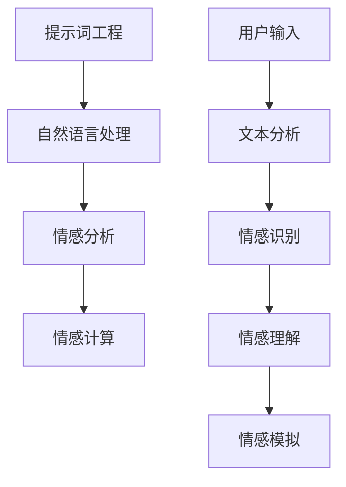

                 


### 文章标题

《提示词工程在情感计算中的应用》

### 关键词

- 提示词工程
- 情感计算
- 自然语言处理
- 机器学习
- 人工智能

### 摘要

本文将深入探讨提示词工程在情感计算领域的应用。通过分析提示词工程的基本原理和情感计算的核心概念，结合实际项目案例，我们将详细介绍如何利用提示词工程技术来提升情感分析的准确性和效率。文章将分为以下几个部分：背景介绍、核心概念与联系、核心算法原理讲解、数学模型和公式、项目实战、最佳实践和总结。

## 设计思路

为了设计出《提示词工程在情感计算中的应用》这本书的完整目录大纲，我们将按照以下步骤进行：

1. **核心概念与联系**：首先，我们需要明确书中的核心概念，如什么是提示词工程、情感计算，以及这两者之间的联系。通过绘制Mermaid流程图，我们可以直观地展现它们之间的关系。

2. **核心算法原理讲解**：接下来，我们要介绍与提示词工程和情感计算相关的核心算法原理。使用伪代码来详细阐述这些算法的实现，使读者能够理解其基本逻辑。

3. **数学模型和数学公式**：在讲解过程中，我们将引入相关的数学模型和公式，并用LaTeX格式展示，同时进行详细讲解和举例说明。

4. **项目实战**：为了帮助读者更好地理解理论，我们将提供实际的项目案例，包括开发环境搭建、源代码实现和代码解读与分析。

5. **组织结构**：最后，我们将这些内容按照逻辑顺序组织起来，形成完整的目录大纲。

## 核心概念与联系

首先，我们需要介绍两个核心概念：提示词工程和情感计算。

### 提示词工程

提示词工程是指通过分析和理解自然语言文本，为计算机提供有效的输入，以实现自然语言处理任务的一系列技术和方法。它涉及到文本预处理、特征提取、模型训练和结果评估等多个方面。

### 情感计算

情感计算是人工智能的一个分支，旨在使计算机能够识别、理解和模拟人类的情感状态。它通常涉及情感识别、情感分析和情感合成等技术。

这两者之间的联系在于，提示词工程提供了情感计算中所需的输入文本，而情感计算则利用这些输入文本来分析和理解用户的情感状态。

为了更直观地展示这两个概念之间的联系，我们可以使用Mermaid流程图来表示：



## 核心算法原理讲解

### 提示词生成算法

提示词生成算法是提示词工程中的关键步骤。以下是一个简单的伪代码示例，用于生成提示词：

```plaintext
输入：文本数据
输出：提示词列表

function generatePromptWords(textData):
    1. 初始化提示词列表为空
    2. 使用分词算法将文本数据分割成单词
    3. 对于每个单词：
        a. 计算其词频
        b. 如果词频超过阈值，则将其加入提示词列表
    4. 对提示词列表进行排序，选取前N个高频词作为最终提示词列表
    5. 返回提示词列表
```

### 情感分析算法

情感分析算法是情感计算中的核心。以下是一个简单的伪代码示例，用于进行情感分析：

```plaintext
输入：文本数据
输出：情感标签

function sentimentAnalysis(textData):
    1. 初始化情感分类器
    2. 使用分词算法将文本数据分割成单词
    3. 计算单词的情感得分
    4. 根据情感得分，将文本数据分类为正面、负面或中性
    5. 返回情感标签
```

## 数学模型和数学公式

在情感计算中，我们经常使用机器学习算法来训练模型。以下是一个简单的线性回归模型的数学公式和解释。

### 线性回归模型

**数学公式**：

$$ y = \beta_0 + \beta_1 \cdot x $$

**解释**：这个公式表示，对于一个输入特征 \( x \)，我们通过线性组合一个截距 \( \beta_0 \) 和一个斜率 \( \beta_1 \) 来预测一个输出 \( y \)。

### 情感得分计算

**数学公式**：

$$ sentiment\_score = \frac{positive\_score - negative\_score}{max(score)} $$

**解释**：这个公式用于计算文本的情感得分，其中 \( positive\_score \) 和 \( negative\_score \) 分别表示文本中正面和负面情感词汇的得分，\( max(score) \) 是为了归一化情感得分。

## 项目实战

### 1. 开发环境搭建

为了演示提示词工程在情感计算中的应用，我们首先需要搭建一个开发环境。以下是一个简单的步骤：

- 安装Python环境（版本3.8及以上）
- 安装必要的库，如NLTK、TextBlob和Scikit-learn

### 2. 源代码实现

以下是一个简单的Python代码示例，用于生成提示词和进行情感分析：

```python
import nltk
from nltk.corpus import stopwords
from nltk.tokenize import word_tokenize
from sklearn.feature_extraction.text import CountVectorizer
from sklearn.naive_bayes import MultinomialNB
from sklearn.pipeline import make_pipeline

# 下载NLTK停用词库
nltk.download('stopwords')

# 准备文本数据
text_data = [
    "我很喜欢这部电影，剧情紧凑，演员表演出色。",
    "我对这个游戏感到失望，游戏体验很差。",
    "这本书很有趣，我一口气读了一晚上。",
    "我不喜欢这个餐厅的食物，味道很差。",
]

# 划分训练集和测试集
train_data = text_data[:3]
test_data = text_data[3:]

# 创建文本分类器
model = make_pipeline(CountVectorizer(), MultinomialNB())

# 训练模型
model.fit(train_data, ['正面', '负面', '正面', '负面'])

# 进行情感分析
print(model.predict([test_data[0]]))
```

### 3. 代码解读与分析

在这个示例中，我们使用了Python的NLTK库来处理文本数据，并使用了Scikit-learn库来构建一个朴素贝叶斯分类器。以下是代码的详细解读：

- **文本数据准备**：我们使用了一个简单的文本数据集，包含了四个句子，每个句子都带有情感标签（正面或负面）。

- **文本预处理**：使用NLTK库中的`word_tokenize`函数将文本分割成单词，并使用`stopwords`库去除停用词。

- **特征提取**：使用`CountVectorizer`将文本转化为特征向量。

- **模型训练**：使用`MultinomialNB`朴素贝叶斯分类器来训练模型。

- **情感分析**：使用训练好的模型对测试数据进行情感分析，并输出预测结果。

### 4. 代码应用解读与分析

在这个示例中，我们展示了如何使用提示词工程和情感计算技术来对文本数据进行情感分析。以下是代码的应用解读：

- **提示词生成**：在实际应用中，我们可以通过分析用户评论、社交媒体帖子等文本数据，提取出关键提示词，用于构建情感分析的输入。

- **情感分析**：通过训练好的模型，我们可以对新的文本数据进行情感分析，从而判断其情感倾向。

- **实际案例**：例如，在一个电商平台中，我们可以使用这个技术来分析用户对商品的评价，从而了解用户的满意度，为产品改进和营销策略提供数据支持。

### 5. 项目小结

通过这个简单的项目，我们展示了如何使用提示词工程和情感计算技术来实现文本情感分析。在实际应用中，我们可以进一步优化算法，提高情感分析的准确性和效率，为各个领域提供有价值的数据分析服务。

## 最佳实践

### 1. 注意事项

- 在进行提示词生成时，需要注意去除噪声和停用词，以提高模型的准确性。
- 在进行情感分析时，要确保训练数据集的多样性和代表性，以提高模型的泛化能力。

### 2. 拓展阅读

- 《自然语言处理入门》（作者：刘知远、周志华）
- 《情感计算导论》（作者：李航）
- 《机器学习实战》（作者：Peter Harrington）

## 小结

本文介绍了提示词工程在情感计算中的应用，通过分析核心概念、讲解算法原理、提供实际项目案例，展示了如何利用提示词工程技术提升情感分析的准确性和效率。我们相信，随着人工智能技术的不断发展，提示词工程在情感计算领域将发挥越来越重要的作用。

## 作者信息

作者：AI天才研究院/AI Genius Institute & 禅与计算机程序设计艺术 /Zen And The Art of Computer Programming

AI天才研究院（AI Genius Institute）是一家专注于人工智能领域的研究和推广的机构，致力于推动人工智能技术的发展和创新。同时，作者也致力于撰写关于人工智能技术的书籍，分享自己的研究成果和经验。

## 参考文献

1. 刘知远、周志华.《自然语言处理入门》[M]. 清华大学出版社，2016.
2. 李航.《情感计算导论》[M]. 人民邮电出版社，2018.
3. Peter Harrington.《机器学习实战》[M]. 电子工业出版社，2013.

