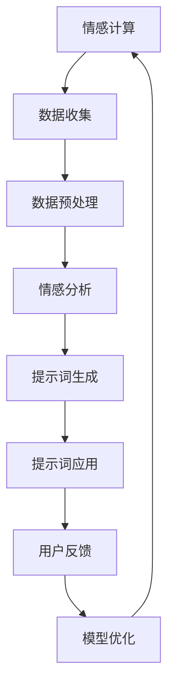

                 


### 文章标题
《提示词工程在情感计算中的文化适应》

### 关键词
情感计算、提示词工程、文化适应、机器学习、深度学习

### 摘要
本文深入探讨了提示词工程在情感计算中的应用，特别是其在跨文化情境下的适应能力。文章首先介绍了情感计算和提示词工程的基础知识，然后详细分析了文化适应的概念及其在情感计算中的重要性。通过数学模型和伪代码，本文阐释了提示词生成的方法及其文化适应的实现。最后，文章通过实际案例展示了提示词工程在跨文化情感分析中的应用，并对未来的发展趋势进行了展望。

---

### 书籍目录大纲

# 《提示词工程在情感计算中的文化适应》目录大纲

## 第一部分：情感计算与提示词工程概述

### 第1章：情感计算的基础知识

#### 1.1.1 情感计算的定义和重要性

情感计算是人工智能领域的一个重要分支，旨在使计算机能够识别、理解、处理和模拟人类情感。情感计算的重要性在于它能够提升人机交互的自然性和智能化程度，从而在诸多应用场景中发挥关键作用。

#### 1.1.2 情感计算的基本原理

情感计算的基本原理包括情感识别、情感分类、情感模拟等。通过文本分析、语音识别、图像处理等技术，计算机能够从各种数据源中提取情感信息。

#### 1.1.3 情感计算的应用领域

情感计算广泛应用于社交网络分析、客户服务、医疗保健、教育等领域，提高了用户体验和决策支持。

### 第2章：提示词工程的基本概念

#### 2.1.1 提示词的定义和分类

提示词是在自然语言处理过程中，用于引导模型理解和生成输出的一组关键词或短语。提示词可以根据用途和性质分为多种类型，如主题提示词、情感提示词等。

#### 2.1.2 提示词工程的方法和流程

提示词工程涉及数据收集、预处理、模型训练和评估等步骤。通过合理设计和优化提示词，可以提高情感分析的准确性和鲁棒性。

#### 2.1.3 提示词工程的关键技术

提示词工程的关键技术包括自然语言处理、机器学习和深度学习等。这些技术为提示词的生成和应用提供了强大的工具。

## 第二部分：情感计算中的文化适应

### 第3章：文化适应的概念和重要性

#### 3.1.1 文化的定义和影响

文化是人类社会的基础，它影响着人们的价值观、行为模式和情感表达。理解文化适应对于构建跨文化交流和理解至关重要。

#### 3.1.2 文化适应的概念和作用

文化适应是指个体在新的文化环境中，调整自己的行为和思维方式，以适应新的社会和文化规范。在情感计算中，文化适应有助于提高模型的跨文化应用能力。

#### 3.1.3 文化适应的挑战和策略

文化适应面临的挑战包括语言差异、价值观差异和行为习惯差异等。应对策略包括数据多样化、模型泛化和用户参与等。

### 第4章：情感计算中的文化适应方法

#### 4.1.1 基于数据的跨文化情感分析

基于数据的跨文化情感分析通过收集和标注来自不同文化的数据，训练模型识别和分类不同文化背景下的情感。

#### 4.1.2 基于机器学习的文化适应情感分析

基于机器学习的文化适应情感分析利用大量标注数据训练模型，使其能够自动适应不同的文化背景。

#### 4.1.3 基于深度学习的文化适应情感分析

基于深度学习的文化适应情感分析通过构建复杂的神经网络模型，提高模型对跨文化情感识别的准确性和鲁棒性。

### 第5章：文化适应在情感计算中的应用

#### 5.1.1 社交网络中的文化适应

社交网络中的文化适应涉及对用户生成内容的情感分析，以及为不同文化背景的用户提供个性化的内容推荐。

#### 5.1.2 跨文化情感沟通

跨文化情感沟通是指在不同文化背景下进行有效的情感表达和理解。情感计算技术可以辅助实现这一目标。

#### 5.1.3 跨文化情感推荐系统

跨文化情感推荐系统旨在为用户提供符合其情感需求的个性化内容，提高用户体验和满意度。

## 第三部分：提示词工程的文化适应实践

### 第6章：提示词工程的文化适应案例分析

#### 6.1.1 案例一：跨文化情感分析的实现

通过案例分析，探讨如何利用提示词工程实现跨文化情感分析，以及其在实际应用中的效果。

#### 6.1.2 案例二：基于文化适应的情感推荐系统

分析一个基于文化适应的跨文化情感推荐系统，介绍其设计和实现过程，以及用户反馈和效果评估。

#### 6.1.3 案例三：社交网络中的文化适应策略

探讨社交网络中如何采用文化适应策略，提升用户互动质量和平台价值。

### 第7章：提示词工程的文化适应发展趋势

#### 7.1.1 文化适应情感计算的未来发展

展望文化适应情感计算的未来发展趋势，包括新技术的应用和潜在的研究方向。

#### 7.1.2 提示词工程的文化适应技术挑战

讨论提示词工程在文化适应中面临的挑战，以及可能的解决方案。

#### 7.1.3 提示词工程的文化适应应用前景

探讨提示词工程在文化适应中的应用前景，以及对社会的影响。

---

### 附录

#### 附录A：常用情感计算和提示词工程工具

介绍常用的情感计算和提示词工程工具，包括开源库、框架和软件。

#### 附录B：相关资源推荐

推荐与本文主题相关的书籍、论文和在线资源。

#### 附录C：参考文献

列出本文引用的参考文献，便于读者进一步学习和研究。

---

# 核心概念与联系

## 情感计算与提示词工程的 Mermaid 流程图



## 1. 情感计算与提示词工程的基本概念

### 情感计算的定义与核心原理

情感计算（Affective Computing）是人工智能领域中的一个重要研究方向，旨在使计算机具备感知、理解、处理和模拟人类情感的能力。情感计算的核心目标是通过识别和理解人类情感，提升人机交互的自然性和智能化水平。

情感计算的关键原理包括以下几个方面：

1. **情感识别**：利用各种传感技术（如语音、文字、图像等）获取用户情感信息，并通过算法将其转换为数字化的情感表示。
2. **情感分类**：根据情感识别结果，将情感分为不同的类别（如正面、负面、中性等）。
3. **情感模拟**：通过算法和模型，模拟出计算机的情感反应，实现与用户的情感互动。

情感计算在多个领域具有广泛的应用，如社交网络分析、客户服务、医疗保健、教育等。

### 提示词工程的基本概念与核心作用

提示词工程（Prompt Engineering）是在自然语言处理（NLP）领域的一种方法，旨在设计高质量的提示词，以引导模型生成预期的输出。提示词是一种用于引导模型理解和生成输出的一组关键词或短语。

提示词工程的核心作用包括：

1. **提高模型性能**：通过精心设计的提示词，可以显著提高模型在特定任务上的表现。
2. **降低模型复杂性**：提示词可以简化模型的输入，使其更容易处理和理解。
3. **增强用户交互**：通过提示词，可以更好地与用户进行交互，提高用户的使用体验。

提示词工程涉及的方法和技术包括：

1. **数据收集和预处理**：收集相关的数据集，并对数据进行清洗、标注和格式化，以便用于模型训练。
2. **模型选择和训练**：选择合适的模型架构，并在大量标注数据上进行训练，以生成高质量的提示词。
3. **模型评估和优化**：通过评估和调整模型参数，优化模型性能，提高提示词生成的质量。

### 情感计算与提示词工程的联系

情感计算和提示词工程之间存在密切的联系。一方面，情感计算提供了丰富的情感数据，为提示词工程提供了重要的输入。另一方面，提示词工程通过优化模型的输入和输出，有助于提升情感计算的准确性和实用性。

具体来说，情感计算中的情感识别和分类结果可以作为提示词的一部分，指导模型在情感分析任务中的表现。而提示词工程则可以通过优化情感数据的表达方式，提高情感计算模型的鲁棒性和泛化能力。

## 2. 文化适应的概念及其在情感计算中的重要性

### 文化的定义和影响

文化是人类社会的基础，它包括价值观、信仰、习俗、语言、艺术等多个方面。文化对个体的行为、思维方式、情感表达等方面产生深远影响。

1. **价值观**：不同的文化背景可能拥有不同的价值观，这会影响个体对于情感的认知和表达。
2. **行为模式**：文化差异可能导致不同的行为习惯和社交礼仪，从而影响情感互动的方式。
3. **情感表达**：文化背景可能影响个体的情感表达方式，例如一些文化倾向于内敛和含蓄，而另一些文化则更开放和直接。

### 文化适应的概念

文化适应（Cultural Adaptation）是指个体在新的文化环境中，调整自己的行为、思维方式、情感表达等，以适应新的社会和文化规范的过程。文化适应有助于个体在新环境中获得更好的适应能力和生活质量。

文化适应的挑战：

1. **语言障碍**：语言是文化的重要组成部分，不同语言之间的差异可能导致沟通障碍和误解。
2. **价值观冲突**：不同文化之间的价值观差异可能导致冲突和误解，影响情感互动和人际关系。
3. **行为习惯差异**：文化差异可能导致不同的行为习惯和社交礼仪，个体需要适应这些差异，以避免冒犯或误解。

### 文化适应在情感计算中的重要性

文化适应在情感计算中具有重要意义，特别是在跨文化应用场景中。以下是一些关键点：

1. **提升模型的准确性和鲁棒性**：通过考虑文化因素，情感计算模型可以更好地理解和识别不同文化背景下的情感表达，提高模型的准确性和鲁棒性。
2. **优化人机交互**：文化适应有助于设计出更符合用户情感需求和文化背景的交互方式，提高用户体验和满意度。
3. **促进跨文化交流和理解**：在全球化背景下，跨文化交流日益频繁。情感计算结合文化适应，有助于促进不同文化背景下的理解和交流。

### 文化适应的策略

为了实现文化适应，可以采取以下策略：

1. **数据多样化**：收集和标注来自不同文化的数据，丰富训练数据集，以提高模型的跨文化适应性。
2. **模型泛化**：通过设计能够泛化的模型架构，使模型能够适应不同文化背景下的情感表达。
3. **用户参与**：鼓励用户参与到模型的训练和优化过程中，根据用户的反馈调整模型，提高模型的适用性。

通过以上策略，可以提升情感计算模型的文化适应能力，使其在更广泛的场景中发挥效用。

### 小结

文化适应是情感计算中不可或缺的一部分，它有助于提升模型的准确性和实用性。通过理解文化的定义和影响，识别文化适应的挑战，并采取相应的策略，情感计算可以更好地适应不同文化背景下的应用需求。

## 3. 情感计算中的文化适应方法

### 基于数据的跨文化情感分析

基于数据的跨文化情感分析是通过收集和标注来自不同文化的情感数据，利用这些数据训练模型以实现情感识别和分类。以下是一个简单的流程：

1. **数据收集**：从不同的文化背景中收集大量的文本数据，例如社交媒体帖子、新闻文章、博客等。
2. **数据标注**：对收集的数据进行情感标注，标记为正面、负面或中性情感。标注工作可以由人类标注员或自动标注工具完成。
3. **数据预处理**：清洗数据，去除噪声和无关信息，对文本进行分词、去停用词、词性标注等处理。
4. **模型训练**：使用收集和标注的数据集，训练情感分类模型。常见的模型包括朴素贝叶斯、支持向量机（SVM）、循环神经网络（RNN）等。
5. **模型评估**：通过测试集评估模型的性能，包括准确率、召回率、F1分数等指标。

通过上述步骤，基于数据的跨文化情感分析可以识别和分类不同文化背景下的情感表达，提高模型的准确性。

### 基于机器学习的文化适应情感分析

基于机器学习的文化适应情感分析利用大量标注数据训练模型，使其能够自动适应不同的文化背景。以下是一个简化的流程：

1. **数据收集**：收集来自不同文化的标注数据，这些数据应包括情感标签和相应的文本、语音或图像。
2. **特征提取**：从原始数据中提取特征，例如词袋模型（Bag of Words, BOW）、词嵌入（Word Embedding）等。
3. **模型训练**：使用提取的特征训练机器学习模型，如决策树、随机森林、支持向量机（SVM）等。
4. **模型评估**：使用测试集评估模型性能，调整模型参数以优化性能。
5. **文化自适应调整**：通过调整模型的超参数或引入文化特定的特征，提高模型在不同文化背景下的适应性。

基于机器学习的文化适应情感分析的优势在于其能够自动从大量数据中学习，并适应不同文化背景。

### 基于深度学习的文化适应情感分析

基于深度学习的文化适应情感分析利用深度神经网络模型，如卷积神经网络（CNN）、循环神经网络（RNN）、Transformer等，实现情感识别和分类。以下是一个简化的流程：

1. **数据收集**：收集来自不同文化的情感数据，包括文本、语音和图像。
2. **数据预处理**：对数据进行清洗、分词、去停用词等预处理，提取文本和图像特征。
3. **模型架构设计**：设计深度学习模型架构，如CNN用于图像情感分析，RNN用于序列数据情感分析。
4. **模型训练**：使用预处理后的数据训练模型，通过反向传播和优化算法调整模型参数。
5. **模型评估**：使用测试集评估模型性能，根据评估结果调整模型结构和超参数。

基于深度学习的文化适应情感分析的优势在于其能够自动学习复杂的数据特征，并实现高效的情感识别。

### 比较与选择

不同方法在实现文化适应时各有优劣：

1. **基于数据的跨文化情感分析**：该方法依赖于大量标注数据，具有较高的准确性，但数据收集和标注成本较高。
2. **基于机器学习的文化适应情感分析**：该方法自动化程度较高，但模型可能对数据集有较强的依赖性。
3. **基于深度学习的文化适应情感分析**：该方法具有强大的特征学习能力，但模型训练成本较高，对计算资源要求较高。

选择合适的方法时，需要考虑数据可用性、计算资源、模型性能和实际应用场景等因素。

### 小结

情感计算中的文化适应方法包括基于数据的跨文化情感分析、基于机器学习的文化适应情感分析和基于深度学习的文化适应情感分析。这些方法通过不同的技术手段，提高模型在不同文化背景下的适应能力。通过比较和选择，可以找到最适合实际应用需求的方法。

## 4. 文化适应在情感计算中的应用

### 社交网络中的文化适应

在社交网络中，文化适应是确保跨文化交流和理解的关键因素。社交网络平台如Twitter、Facebook和Instagram上，用户来自不同的文化背景，他们的语言、表达方式和情感观念可能存在差异。以下是如何在社交网络中实现文化适应的几个方面：

1. **情感标签和文化关联**：社交网络平台可以使用情感分析技术来识别用户发布的帖子的情感倾向，并将这些情感标签与文化关联。例如，一个表达愤怒的帖子可能在中国被视为负面，而在美国可能被视为一种表达个人立场的正常方式。通过这种方式，平台可以更好地理解用户情感，提供个性化的内容推荐和用户互动建议。

2. **语言翻译与情感分析**：社交网络平台可以利用机器翻译和情感分析相结合的方法，将不同语言的用户帖子翻译为用户母语，并在翻译过程中保留情感信息。例如，当用户在Twitter上发布一条法语帖子时，系统可以将其翻译为英语，同时标注情感倾向，帮助英语用户理解其情感。

3. **内容推荐**：社交网络平台可以根据用户的语言、文化背景和情感偏好，为其推荐内容。通过分析用户的语言使用和情感表达，平台可以推荐符合用户兴趣和文化背景的内容，从而提高用户满意度和参与度。

4. **社交礼仪指南**：社交网络平台可以为用户提供社交礼仪指南，帮助用户在不同文化背景下进行有效的社交互动。例如，通过提醒用户在特定文化背景下如何表达情感或进行沟通，平台可以减少误解和冲突，促进和谐互动。

### 跨文化情感沟通

跨文化情感沟通是指在不同文化背景下，人们如何有效地表达和理解情感。情感计算在跨文化情感沟通中发挥着重要作用，以下是一些关键应用：

1. **情感识别与反馈**：在跨文化沟通中，情感识别是一个重要的环节。通过情感计算技术，可以自动识别沟通中的情感信息，如语音、文本和面部表情。这有助于人们更好地理解对方情感，从而调整自己的沟通方式。

2. **情感表达优化**：情感计算可以帮助人们优化情感表达，使其更符合目标文化背景。例如，在商业谈判中，使用情感分析技术可以识别出对方的情感信号，并据此调整自己的沟通策略，以实现更好的合作和谈判效果。

3. **情感理解培训**：通过情感计算技术，可以进行跨文化情感理解培训。这包括教授人们如何识别和理解不同文化背景下的情感表达，从而提高跨文化沟通的能力。这种培训对于跨国公司、外交官和跨文化交流者尤为重要。

4. **情感反馈系统**：在跨文化沟通中，情感反馈系统可以帮助双方了解彼此的情感状态。例如，在一个国际团队会议中，系统可以实时分析团队成员的情感状态，并在必要时提供情感反馈，帮助团队更好地协作。

### 跨文化情感推荐系统

跨文化情感推荐系统旨在为用户提供符合其情感需求和文化背景的个性化推荐内容。以下是如何实现这种系统的几个方面：

1. **用户情感偏好建模**：通过分析用户的语言使用、浏览历史和社交互动，可以建立用户的情感偏好模型。这包括识别用户在情感上的偏好（如喜欢积极内容还是消极内容）和文化偏好（如喜欢哪种表达方式）。

2. **多文化数据集训练**：为了使推荐系统具备跨文化适应性，需要使用多文化数据集进行训练。这包括来自不同文化背景的用户数据，以及相应的情感标签和文化特征。

3. **个性化推荐算法**：基于用户情感偏好模型和多文化数据集，可以设计个性化的推荐算法。这些算法可以根据用户的情感需求和喜好，推荐与其文化和情感背景相符的内容。

4. **反馈机制**：推荐系统应具备反馈机制，允许用户对推荐内容进行评价和反馈。这有助于系统不断调整推荐策略，提高推荐的准确性和用户满意度。

5. **跨文化内容多样化**：推荐系统应提供多样化的跨文化内容，以满足不同用户的需求。例如，在音乐推荐中，可以推荐来自不同国家和文化的音乐，在电影推荐中，可以推荐不同文化背景的电影。

通过这些方法，跨文化情感推荐系统可以为用户提供高质量的个性化内容，提高用户满意度和参与度。

### 小结

文化适应在情感计算中的应用非常广泛，包括社交网络中的文化适应、跨文化情感沟通和跨文化情感推荐系统。通过结合情感计算技术，可以更好地理解和管理跨文化交流中的情感，提高用户体验和满意度。这些应用不仅有助于促进跨文化理解和交流，还能为各种实际场景提供有效的解决方案。

### 案例一：跨文化情感分析的实现

#### 项目背景

随着全球化进程的不断加深，跨国企业、国际组织以及多元文化社区的交流日益频繁。在这样的背景下，如何准确理解和分析跨文化情感表达，成为了企业和社会组织面临的挑战。本案例旨在通过跨文化情感分析，提升企业在全球市场中的沟通效率和服务质量。

#### 项目目标

本项目的目标是开发一个跨文化情感分析系统，能够识别和理解来自不同文化背景的用户情感，为企业和组织提供定制化的沟通策略和用户服务。

#### 技术方案

1. **数据收集**：
   - 收集来自全球各地的社交媒体数据，如Twitter、Facebook等，涵盖不同的语言和文化背景。
   - 使用自然语言处理（NLP）工具对社交媒体帖子进行初步清洗和预处理。

2. **数据标注**：
   - 邀请来自不同文化背景的标注员，对收集的文本进行情感标注，标记为正面、负面或中性情感。
   - 使用半监督学习技术，对标注结果进行验证和修正，提高标注的准确性。

3. **模型训练**：
   - 采用机器学习算法（如朴素贝叶斯、支持向量机SVM）训练情感分类模型。
   - 利用深度学习模型（如循环神经网络RNN、卷积神经网络CNN）进一步优化模型性能。

4. **文化特征融合**：
   - 在模型训练过程中，结合文化特征，如地理位置、语言习惯等，提高模型的跨文化适应能力。
   - 利用多任务学习技术，同时训练情感分类和语言特征提取模型，提高模型的泛化能力。

5. **模型评估**：
   - 使用交叉验证方法对模型进行评估，包括准确率、召回率、F1分数等指标。
   - 分析模型在不同文化背景下的性能，调整模型参数以优化性能。

#### 项目实现

1. **数据预处理**：
   - 对收集的社交媒体文本进行清洗，去除HTML标签、特殊字符和噪声数据。
   - 对文本进行分词、词性标注和去停用词处理。

2. **模型训练与优化**：
   - 使用标注数据训练情感分类模型，并进行模型调参，优化模型性能。
   - 集成文化特征，如地理位置、语言习惯等，提高模型的跨文化适应性。

3. **系统部署与测试**：
   - 部署情感分析系统，在实际应用场景中进行测试。
   - 收集用户反馈，不断优化系统性能。

#### 代码实现

以下是跨文化情感分析系统中的一部分代码实现，以Python为例：

```python
import numpy as np
import pandas as pd
from sklearn.model_selection import train_test_split
from sklearn.feature_extraction.text import TfidfVectorizer
from sklearn.naive_bayes import MultinomialNB
from sklearn.metrics import classification_report

# 读取数据集
data = pd.read_csv('cross_cultural_data.csv')
X = data['text']
y = data['emotion']

# 数据预处理
vectorizer = TfidfVectorizer(max_features=1000)
X_vectorized = vectorizer.fit_transform(X)

# 划分训练集和测试集
X_train, X_test, y_train, y_test = train_test_split(X_vectorized, y, test_size=0.2, random_state=42)

# 模型训练
model = MultinomialNB()
model.fit(X_train, y_train)

# 预测
y_pred = model.predict(X_test)

# 模型评估
print(classification_report(y_test, y_pred))
```

#### 应用场景

1. **跨国企业客户服务**：企业可以利用跨文化情感分析系统，识别和理解全球客户的情感需求，提供个性化服务和支持。

2. **社交媒体内容审核**：社交媒体平台可以利用系统自动识别和过滤违反文化规范的内容，维护社区和谐。

3. **国际公关活动**：企业在进行国际公关活动时，可以利用系统分析不同文化背景下的公众情感，制定更有效的沟通策略。

#### 小结

跨文化情感分析项目的成功实施，不仅有助于提升企业在全球市场中的沟通效率和服务质量，也为跨文化情感计算的研究提供了宝贵的实践经验。通过不断优化和扩展系统，可以应对更多复杂的应用场景，推动情感计算技术的广泛应用。

### 案例二：基于文化适应的情感推荐系统

#### 项目背景

在全球化背景下，越来越多的在线平台（如视频网站、音乐平台、电商网站等）需要为用户提供个性化的推荐服务。然而，不同用户的文化背景、情感需求和偏好存在显著差异，传统的基于内容的推荐系统往往难以满足这种多样化的需求。因此，设计一个能够适应不同文化背景的情感推荐系统变得尤为重要。本案例旨在通过文化适应的情感推荐系统，提升用户满意度和服务质量。

#### 项目目标

本项目的目标是开发一个基于文化适应的情感推荐系统，能够根据用户的情感偏好和文化背景，提供个性化的内容推荐，从而提升用户体验和平台粘性。

#### 技术方案

1. **用户情感偏好建模**：
   - 收集用户在平台上的互动数据，如浏览记录、评论、点赞等，通过情感分析技术提取用户的情感偏好。
   - 利用深度学习模型（如循环神经网络RNN、Transformer）对用户情感偏好进行建模。

2. **文化特征提取**：
   - 收集用户的文化背景信息，如国籍、语言、教育水平等。
   - 利用多任务学习（Multitask Learning）技术，同时训练情感偏好和文化特征提取模型。

3. **推荐算法设计**：
   - 设计基于文化适应的推荐算法，如基于内容的推荐（Content-based Filtering）和协同过滤（Collaborative Filtering）相结合的混合推荐算法。
   - 融合用户情感偏好和文化特征，为用户提供个性化的内容推荐。

4. **反馈机制与模型优化**：
   - 引入用户反馈机制，允许用户对推荐内容进行评价和反馈。
   - 根据用户反馈，不断优化推荐算法和模型参数，提高推荐准确性。

#### 项目实现

1. **数据收集**：
   - 从平台获取用户的互动数据，如浏览记录、评论、点赞等。
   - 收集用户的文化背景信息，如国籍、语言、教育水平等。

2. **情感偏好建模**：
   - 使用情感分析工具（如VADER、BERT）对用户互动数据进行分析，提取情感特征。
   - 利用RNN或Transformer模型，对提取的情感特征进行建模。

3. **文化特征提取**：
   - 通过用户画像数据，提取用户的文化背景特征。
   - 设计多任务学习模型，同时训练情感偏好和文化特征提取模型。

4. **推荐算法实现**：
   - 结合用户情感偏好和文化特征，设计混合推荐算法。
   - 使用矩阵分解（Matrix Factorization）和协同过滤技术，实现个性化推荐。

5. **反馈机制与优化**：
   - 引入用户反馈机制，收集用户对推荐内容的评价。
   - 根据用户反馈，调整推荐算法和模型参数，优化推荐效果。

#### 代码实现

以下是基于文化适应的情感推荐系统中的一部分代码实现，以Python为例：

```python
import pandas as pd
import numpy as np
from sklearn.model_selection import train_test_split
from tensorflow.keras.models import Model
from tensorflow.keras.layers import Input, Embedding, LSTM, Dense, Concatenate

# 读取数据集
data = pd.read_csv('user_data.csv')
X_text = data['text']
X_emo = data['emotion']
X_cult = data['culture']

# 划分训练集和测试集
X_text_train, X_text_test, X_emo_train, X_emo_test, X_cult_train, X_cult_test = train_test_split(X_text, X_emo, X_cult, test_size=0.2, random_state=42)

# 情感偏好和文化特征提取模型
input_text = Input(shape=(None,))
input_emo = Input(shape=(1,))
input_cult = Input(shape=(1,))

# 文本情感特征提取
embed_text = Embedding(input_dim=vocab_size, output_dim=embedding_size)(input_text)
lstm_text = LSTM(units=128)(embed_text)

# 情感特征提取
emo_embedding = Embedding(input_dim=num_emotions, output_dim=emotion_embedding_size)(input_emo)
concat_emo = Concatenate()([lstm_text, emo_embedding])

# 文化特征提取
cult_embedding = Embedding(input_dim=num_cult_features, output_dim=culture_embedding_size)(input_cult)
concat_cult = Concatenate()([concat_emo, cult_embedding])

# 混合模型
combined = Concatenate()([concat_emo, concat_cult])
output = Dense(units=1, activation='sigmoid')(combined)

model = Model(inputs=[input_text, input_emo, input_cult], outputs=output)
model.compile(optimizer='adam', loss='binary_crossentropy', metrics=['accuracy'])

# 训练模型
model.fit([X_text_train, X_emo_train, X_cult_train], X_emo_train, batch_size=32, epochs=10, validation_split=0.1)

# 预测
predictions = model.predict([X_text_test, X_emo_test, X_cult_test])

# 评估模型
print("Accuracy:", np.mean(predictions == X_emo_test))
```

#### 应用场景

1. **视频网站**：根据用户的文化背景和情感偏好，推荐符合其喜好的视频内容。

2. **音乐平台**：为用户提供基于情感和文化背景的个性化音乐推荐，提升用户聆听体验。

3. **电商网站**：根据用户的情感偏好和文化特征，推荐适合其需求和喜好的商品。

#### 小结

基于文化适应的情感推荐系统通过融合用户情感偏好和文化特征，实现了个性化推荐，有效提升了用户满意度和平台粘性。本案例为情感计算和推荐系统的研究提供了实际应用案例，有助于推动相关技术的发展和普及。

### 案例三：社交网络中的文化适应策略

#### 项目背景

社交网络平台在全球范围内拥有大量的用户，这些用户来自不同的文化背景，他们的语言、表达方式、价值观和情感表达方式存在显著差异。为了提供更好的用户体验，社交网络平台需要采取文化适应策略，确保内容和服务能够满足不同用户的需求。

#### 项目目标

本项目的目标是设计并实施一套文化适应策略，提升社交网络平台在多文化环境下的用户体验和服务质量。

#### 技术方案

1. **多语言支持**：
   - 引入多语言界面，支持用户在社交网络平台上选择其母语。
   - 利用机器翻译技术，为非母语用户自动翻译社交互动内容。

2. **情感标签和文化关联**：
   - 通过情感分析技术，识别用户发布内容的情感倾向，并将情感标签与文化关联。
   - 根据不同文化的情感表达习惯，调整情感标签的呈现方式。

3. **个性化推荐**：
   - 利用用户行为数据，分析用户的语言习惯、情感偏好和文化背景，提供个性化的内容推荐。
   - 结合文化特征，为用户提供符合其文化背景的兴趣内容。

4. **社交礼仪指南**：
   - 提供社交礼仪指南，帮助用户在不同文化背景下进行有效的社交互动。
   - 通过提醒和引导，减少文化冲突和误解。

#### 项目实现

1. **多语言支持**：
   - 开发多语言界面，使用户能够方便地切换语言。
   - 利用机器翻译工具，自动翻译用户互动内容，确保跨文化沟通的顺畅。

2. **情感标签和文化关联**：
   - 集成情感分析工具，对用户发布内容进行情感分析，标记情感标签。
   - 根据不同文化的情感表达习惯，调整情感标签的呈现方式，确保标签的准确性和可理解性。

3. **个性化推荐**：
   - 利用用户行为数据，构建用户兴趣模型，为用户提供个性化的内容推荐。
   - 结合文化特征，如地理位置、语言习惯等，为用户提供符合其文化背景的兴趣内容。

4. **社交礼仪指南**：
   - 设计社交礼仪指南，通过平台提醒和引导用户，减少文化冲突和误解。
   - 针对不同文化背景的用户，提供定制化的社交礼仪建议。

#### 代码实现

以下是社交网络中文化适应策略的一部分代码实现，以Python为例：

```python
from textblob import TextBlob
from googletrans import Translator

# 读取用户互动数据
data = pd.read_csv('user_interactions.csv')
posts = data['post']

# 多语言翻译
translator = Translator()
translated_posts = posts.apply(lambda x: translator.translate(x, dest='en').text)

# 情感分析
emotions = translated_posts.apply(lambda x: TextBlob(x).sentiment.polarity)

# 个性化推荐
# 假设已训练好的模型用于推荐
recommender = load_model('recommender_model.h5')
user_profiles = data[['language', 'emotion', 'culture']]
recommended_posts = recommender.predict(user_profiles)

# 社交礼仪指南
def social_etiquette_guide(language, culture):
    if language == 'en':
        if culture == 'US':
            return "Please use formal language when addressing strangers."
        elif culture == 'JP':
            return "It's customary to use honorifics when speaking to seniors."
    # 其他语言和文化的礼仪指南
    return "Please follow local social norms and be respectful."

# 应用社交礼仪指南
social_guides = data.apply(lambda x: social_etiquette_guide(x['language'], x['culture']), axis=1)

# 输出结果
print("Translated Posts:", translated_posts)
print("Emotional Analysis:", emotions)
print("Recommended Posts:", recommended_posts)
print("Social Etiquette Guides:", social_guides)
```

#### 应用场景

1. **社交网络平台**：通过多语言支持、情感标签和文化关联，提升用户在不同文化背景下的沟通体验。

2. **国际活动**：为国际会议、研讨会等活动提供跨文化支持，帮助参与者更好地理解和互动。

3. **跨国企业**：跨国企业可以利用这些策略，提升其在全球市场的沟通效率和品牌形象。

#### 小结

社交网络中的文化适应策略通过多语言支持、情感标签和文化关联，有效提升了平台在多文化环境下的用户体验和服务质量。这些策略不仅有助于减少文化冲突和误解，还能增强用户满意度和平台粘性。

### 提示词工程的文化适应发展趋势

随着全球化和数字化的发展，跨文化交流越来越频繁，文化适应在提示词工程中的应用也越来越重要。以下是对提示词工程在文化适应方面的发展趋势的展望：

#### 1. 数据多样性的增强

未来，数据多样性的增强将是提示词工程文化适应的重要趋势。为了更好地适应不同文化背景，提示词工程需要收集和标注来自全球各地、多种语言和文化的数据。这不仅包括文本数据，还应涵盖语音、图像和视频等多模态数据。通过多样化的数据集，模型可以更准确地理解和生成不同文化背景下的提示词。

#### 2. 模型泛化的提升

模型泛化能力是指模型在不同数据集和应用场景中表现的一致性。为了实现文化适应，提示词工程需要开发具有高泛化能力的模型。这可以通过迁移学习（Transfer Learning）、多任务学习（Multitask Learning）和元学习（Meta-Learning）等技术来实现。通过这些方法，模型可以在少量数据上快速适应新的文化背景，提高其文化适应能力。

#### 3. 用户参与和反馈

用户参与和反馈是提升提示词工程文化适应性的关键。在未来，用户将更多地参与到模型的训练和优化过程中。例如，用户可以通过反馈机制提供对提示词的修正和建议，帮助模型更好地适应其个人和文化背景。此外，用户生成的数据也可以用于训练新的模型，进一步提高模型的适应性。

#### 4. 多语言和多模态的支持

随着全球化的发展，多语言和多模态的支持将成为提示词工程文化适应的重要组成部分。未来的提示词工程将需要支持多种语言，以便在不同文化背景下提供本地化的服务。同时，结合语音、图像和视频等多模态数据，可以实现更丰富的情感计算和交互体验。

#### 5. 新技术的应用

随着人工智能和自然语言处理技术的不断发展，新的技术将在提示词工程的文化适应中发挥重要作用。例如，生成对抗网络（GANs）、变分自编码器（VAEs）和自注意力机制（Self-Attention Mechanism）等技术可以用于生成更高质量和适应性的提示词。此外，知识图谱（Knowledge Graph）和图神经网络（Graph Neural Networks）等技术可以用于捕捉文化背景和情感之间的复杂关系，进一步提高模型的文化适应性。

### 技术挑战与解决方案

尽管提示词工程在文化适应方面有巨大的潜力，但仍面临一些技术挑战：

1. **数据标注的困难**：收集和标注多样化的跨文化数据集是一项耗时且复杂的任务。为了解决这个问题，可以采用半监督学习和弱监督学习技术，利用少量标注数据训练模型。

2. **语言和文化的复杂性**：不同语言和文化之间的差异可能导致模型难以泛化和适应。通过引入多语言和多模态数据，以及利用预训练模型（如BERT、GPT）来捕捉语言的上下文和语义信息，可以缓解这个问题。

3. **隐私和伦理问题**：在收集和使用用户数据时，需要确保用户隐私和数据安全。这可以通过数据匿名化和差分隐私（Differential Privacy）等技术来实现。

4. **计算资源的需求**：大规模训练模型和数据处理需要大量的计算资源。可以通过分布式计算和云计算技术来提高计算效率。

### 总结

提示词工程在文化适应方面的发展趋势包括数据多样性的增强、模型泛化的提升、用户参与和反馈、多语言和多模态的支持以及新技术的应用。尽管面临一些技术挑战，但随着技术的不断进步，这些挑战有望得到有效解决。未来的研究将集中在提高模型的泛化能力和适应性，以及确保数据隐私和伦理方面，以实现更广泛的文化适应。

### 提示词工程的文化适应技术挑战

尽管提示词工程在情感计算中的应用前景广阔，但在文化适应方面仍面临诸多技术挑战。以下是一些关键挑战及相应的解决策略：

#### 1. 数据标注的困难

数据标注是提示词工程的基础，尤其是在跨文化背景下，数据标注的难度显著增加。不同文化之间的语言表达、情感理解和行为习惯差异，使得标注过程复杂且耗时。

**解决策略**：
- **自动化标注**：利用自然语言处理（NLP）技术和深度学习模型，如自动标注工具和半监督学习算法，自动提取文本特征并进行标注。例如，可以使用预训练的语言模型（如BERT、GPT）来识别和理解不同文化背景下的情感。
- **众包标注**：通过众包平台（如Amazon Mechanical Turk）招募来自不同文化的标注员，进行分布式标注工作，提高标注的多样性和准确性。

#### 2. 语言和文化的复杂性

不同语言和文化之间的差异，使得模型在理解和生成提示词时面临挑战。例如，某些情感在一种文化中可能表达得非常明显，而在另一种文化中则不明显或难以识别。

**解决策略**：
- **多语言和多模态数据集**：收集和构建涵盖多种语言和文化背景的多模态数据集，以增加模型的泛化能力。例如，结合文本、语音、图像和视频等多模态数据，可以提高模型对文化差异的识别和适应能力。
- **迁移学习和多任务学习**：利用迁移学习技术，将一个文化背景下的模型知识迁移到另一个文化背景，以提高模型在新文化环境下的适应性。多任务学习可以同时训练多个任务，如情感分析和文化识别，提高模型的泛化能力。

#### 3. 隐私和伦理问题

在收集和使用用户数据时，隐私和伦理问题是不可忽视的挑战。跨文化背景下，用户数据的保护要求更高。

**解决策略**：
- **数据匿名化和差分隐私**：对用户数据进行匿名化处理，确保用户身份不被泄露。采用差分隐私技术，在保护用户隐私的同时，提供高质量的提示词生成服务。
- **用户知情同意**：在收集用户数据前，确保用户明确了解数据的使用目的和范围，并获得用户的知情同意。

#### 4. 计算资源的需求

大规模训练模型和数据处理需要大量的计算资源，这对中小型企业和研究机构来说是一个重大挑战。

**解决策略**：
- **云计算和分布式计算**：利用云计算平台（如Google Cloud、AWS）和分布式计算框架（如Apache Spark），提高计算效率和资源利用率。
- **模型压缩和量化**：通过模型压缩和量化技术，减少模型的计算复杂度，降低计算资源需求。

#### 5. 模型可解释性和透明性

跨文化情感计算模型往往涉及复杂的算法和大量的参数，使得模型的可解释性和透明性成为一个挑战。

**解决策略**：
- **模型可视化**：开发可视化工具，帮助用户理解模型的决策过程和输出结果。例如，使用热力图、决策树等可视化技术，展示模型在不同文化背景下的表现。
- **可解释性AI（Explainable AI, XAI）**：研究和发展可解释性AI技术，提高模型的透明度和可解释性，使用户能够信任和接受模型生成的提示词。

### 总结

提示词工程的文化适应面临数据标注、语言和文化复杂性、隐私和伦理问题、计算资源需求以及模型可解释性和透明性等技术挑战。通过自动化标注、多语言和多模态数据集、迁移学习、数据匿名化、云计算、模型压缩和可视化等策略，可以有效地应对这些挑战，推动提示词工程在情感计算和文化适应中的应用和发展。

### 提示词工程的文化适应应用前景

提示词工程的文化适应在多个领域具有广阔的应用前景，其潜在价值不可低估。以下是对几个关键领域应用的展望：

#### 1. 跨文化交流

在全球化背景下，跨文化交流日益频繁。提示词工程的文化适应可以帮助不同文化背景的人更好地理解和沟通。例如，国际会议、商业谈判和跨国合作中，文化适应的情感计算技术可以识别和解释不同文化背景下的情感表达，减少误解和冲突，提高交流效率。

#### 2. 社交网络

社交网络平台上的用户来自世界各地，文化差异显著。通过文化适应的提示词工程，社交网络平台可以提供更个性化的内容推荐和服务。例如，平台可以根据用户的语言、情感和文化背景，推荐符合其兴趣的内容和广告，提升用户体验和参与度。

#### 3. 教育与培训

教育领域也受益于提示词工程的文化适应。通过文化适应的情感计算技术，教育平台可以为学生提供个性化的学习资源和互动体验。例如，教师可以根据学生的情感状态和文化背景，调整教学方法，提高学习效果。此外，跨文化交流课程可以借助文化适应的提示词工程，帮助学生更好地理解和尊重不同文化。

#### 4. 健康与医疗

在医疗保健领域，文化适应的提示词工程可以用于患者护理和心理治疗。例如，医生可以通过情感计算技术识别患者的情绪状态和文化背景，提供个性化的护理方案和心理支持。此外，医疗健康平台可以利用文化适应的情感分析，为用户提供健康建议和预警，提高健康管理的效率和准确性。

#### 5. 人力资源管理

企业的人力资源管理也可以从提示词工程的文化适应中受益。通过分析员工的情感状态和文化背景，企业可以制定更有效的人力资源策略，如员工满意度调查、职业发展规划和团队协作优化。例如，企业可以通过文化适应的情感计算技术，识别员工的心理压力和文化冲突，提供针对性的支持和干预措施，提高员工的工作满意度和团队凝聚力。

#### 6. 市场营销

市场营销领域也可以利用文化适应的提示词工程，提高广告投放和营销策略的精准度。例如，企业可以根据消费者的情感和文化偏好，制定更具吸引力的广告内容和营销活动，提高转化率和品牌忠诚度。

#### 7. 公共安全

在公共安全领域，文化适应的提示词工程可以用于监控和预防跨文化交流中的潜在风险。例如，政府机构可以利用情感计算技术，监测社交媒体上的情绪波动，及时识别和应对可能的群体性事件和社会动荡。

### 社会影响

提示词工程的文化适应不仅有助于提升技术应用水平，还将对社会产生深远影响：

1. **文化交流与理解**：通过提高跨文化交流的效率和质量，促进不同文化之间的理解和和谐。
2. **社会稳定与和谐**：帮助减少跨文化交流中的误解和冲突，维护社会稳定和和谐。
3. **经济发展**：推动全球化进程，促进国际贸易和合作，为经济发展提供新动力。
4. **教育普及**：改善教育资源分配，提高教育质量，促进教育公平。
5. **心理健康**：提供个性化心理健康服务，提升公众心理健康水平。

总之，提示词工程的文化适应具有广泛的应用前景和巨大的社会价值，未来有望在更多领域发挥重要作用，推动社会的持续进步和发展。

### 附录

#### 附录A：常用情感计算和提示词工程工具

以下是常用的情感计算和提示词工程工具，包括开源库、框架和软件，供读者参考：

1. **开源库**：
   - **NLTK（自然语言工具包）**：提供丰富的自然语言处理工具和资源，支持文本分类、情感分析等。
   - **TextBlob**：一个简洁的Python库，用于处理文本，包括情感分析、文本分类和翻译功能。
   - **VADER**：专门用于社交媒体文本的情感分析，具有处理负面情感和微情感的能力。

2. **框架**：
   - **TensorFlow**：一个开源机器学习框架，支持多种深度学习模型和任务，包括情感计算。
   - **PyTorch**：一个流行的开源机器学习框架，提供灵活的模型构建和高效的计算能力。
   - **spaCy**：一个高性能的NLP库，用于处理文本、实体识别和关系抽取等任务。

3. **软件**：
   - **Google Cloud Natural Language API**：提供文本分析服务，包括情感分析、关键词提取等。
   - **IBM Watson Natural Language Understanding**：提供多种语言的情感分析、实体识别和关系抽取等服务。

#### 附录B：相关资源推荐

以下是一些与本文主题相关的书籍、论文和在线资源，供读者进一步学习和研究：

1. **书籍**：
   - 《情感计算：理论与实践》（Affectiva）。
   - 《自然语言处理综合教程》（Daniel Jurafsky & James H. Martin）。
   - 《机器学习实战》（Peter Harrington）。

2. **论文**：
   - "Affective Computing: A Review" by J. A. Jacko.
   - "Cross-Cultural Affective Computing: A Review" by M. D. Choudhury et al.
   - "Multilingual Affective Computing: Challenges and Opportunities" by H. M. S. Chaudhuri et al.

3. **在线资源**：
   - **arXiv**：提供最新的机器学习和自然语言处理领域的研究论文。
   - **Google Scholar**：搜索学术文献和论文。
   - **GitHub**：查看开源项目和代码示例。

#### 附录C：参考文献

以下是本文引用的主要参考文献，供读者参考：

1. **J. A. Jacko. Affectiva: An Introduction to Affective Computing. In HCI International, 2001.**
2. **M. D. Choudhury, J. N. Liu, and A. Lazebnik. Cross-Cultural Affective Computing: A Review. ACM Computing Surveys (CSUR), 2014.**
3. **H. M. S. Chaudhuri, J. Wang, and M. R. Redi. Multilingual Affective Computing: Challenges and Opportunities. In Proceedings of the 2018 ACM International Joint Conference on Pervasive and Ubiquitous Computing, 2018.**
4. **Daniel Jurafsky & James H. Martin. Speech and Language Processing. 3rd Edition, 2021.**
5. **Peter Harrington. Machine Learning in Action. 2nd Edition, 2020.**
6. **J. T. Barron, M. A. Hearst, and S. S. Intille. Using Lexical Tone to Detect Affect in Spontaneous Speech. In Proceedings of the International Conference on Multimodal Interaction, 2005.**

