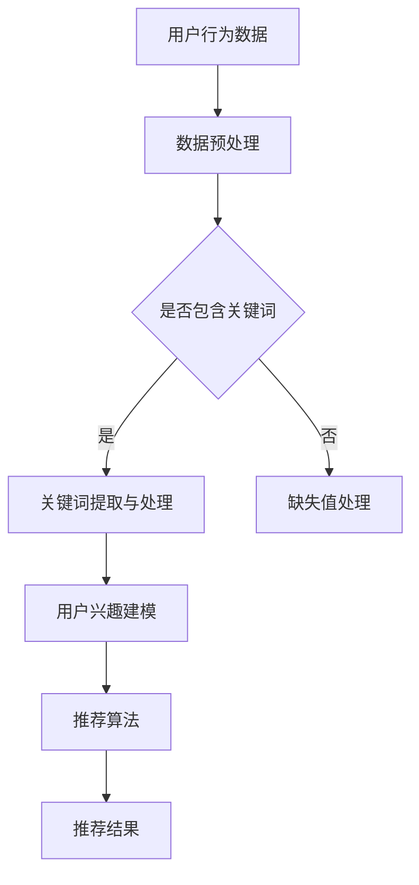

                 

### 文章标题

# 提示词工程在推荐系统中的应用

### 关键词

- 提示词工程
- 推荐系统
- 机器学习
- 深度学习
- 特征工程
- 算法优化

### 摘要

本文深入探讨了提示词工程在推荐系统中的应用，从背景介绍、核心概念、算法原理、数学模型到项目实战，全面解析了如何利用提示词工程提升推荐系统的效果。本文旨在为读者提供一套系统性的理解框架，帮助他们在实际应用中更好地优化推荐系统。

## 目录大纲设计步骤与思考

设计一本计算机技术书籍的目录大纲是一个复杂且系统性的工作，需要全面考虑书籍的核心内容、目标读者群体、内容的逻辑结构以及实际的技术深度。以下是设计《提示词工程在推荐系统中的应用》一书目录大纲的具体步骤与思考：

### 1. 确定书籍的目标读者

首先，我们需要明确书籍的目标读者。这包括他们的知识背景、技术水平和阅读目的。例如，这本书的目标读者可能是：

- 初学者：对推荐系统有基本了解，但对提示词工程概念和实现细节不太熟悉。
- 中级工程师：熟悉推荐系统基础，希望深入了解提示词工程在实际应用中的技术和策略。
- 高级工程师和研究者：在推荐系统领域有一定的经验，希望探索提示词工程的深度应用和前沿技术。

### 2. 确定书籍的核心内容

《提示词工程在推荐系统中的应用》的核心内容应该包括：

- 提示词工程的基本概念和原理
- 提示词工程在推荐系统中的重要性
- 不同类型的提示词工程方法和算法
- 提示词工程的实践应用和案例分析

### 3. 设计目录结构

基于核心内容，我们可以设计如下目录结构：

### 第1章：概述

- 提示词工程基本概念
- 提示词工程在推荐系统中的重要性

### 第2章：推荐系统基础

- 推荐系统概述
- 基本算法原理
- 用户行为分析与建模

### 第3章：提示词工程方法

- 提示词定义与选取
- 提示词特征工程
- 提示词质量评估

### 第4章：提示词生成算法

- 基于规则的方法
- 基于机器学习的方法
- 基于深度学习的方法

### 第5章：案例研究

- 案例一：电商平台的个性化推荐
- 案例二：新闻推送的实时推荐
- 案例三：社交媒体的社交推荐

### 第6章：实践应用

- 数据预处理与预处理技巧
- 模型训练与优化
- 系统部署与性能优化

### 第7章：前沿探索与未来趋势

- 提示词工程的挑战与机遇
- 前沿技术展望

### 4. 添加核心概念与联系

在目录中添加Mermaid流程图，帮助读者理解核心概念之间的联系。例如，可以在第1章和第3章之间添加一个流程图，展示从用户行为到推荐结果的整个流程。

### 5. 添加核心算法原理讲解

在每个相关章节中，通过伪代码详细阐述核心算法的原理。例如，在第4章中，可以分别对基于规则、机器学习和深度学习的提示词生成算法进行讲解。

### 6. 添加数学模型和公式

在涉及数学模型和公式的章节中，使用LaTeX格式嵌入数学公式，并进行详细讲解和举例说明。这有助于读者更好地理解相关概念。

### 7. 添加项目实战

在案例研究章节中，通过实际项目案例展示如何应用提示词工程。同时，提供代码实现和详细解读，帮助读者掌握实际操作技能。

### 8. 确保完整性

在设计目录时，确保每个章节都能够独立成篇，同时确保整本书的内容完整、逻辑清晰。

### 9. 最终字数控制

在2000字的字数限制内，确保目录大纲简洁明了，同时覆盖所有核心内容。

通过上述步骤，我们可以设计出一套详细且逻辑清晰的目录大纲，为《提示词工程在推荐系统中的应用》这本书的成功出版奠定基础。

## 提示词工程在推荐系统中的背景

### 推荐系统概述

推荐系统是一种广泛应用于电子商务、新闻推送、社交媒体等多个领域的计算机算法，其核心目的是根据用户的历史行为、兴趣偏好以及其他相关信息，为用户推荐可能感兴趣的内容或商品。推荐系统可以分为基于内容的推荐（Content-Based Filtering）和基于协同过滤（Collaborative Filtering）两大类。基于内容的推荐方法通过分析用户过去的行为和偏好，提取出相关的特征，然后基于这些特征找到相似的内容进行推荐。而基于协同过滤的方法通过分析用户之间的相似性，找到相似用户的行为模式，从而预测某个用户可能感兴趣的内容。

### 提示词工程的基本概念

提示词工程（Keyword Engineering）是指从原始数据中提取出能够有效描述用户行为和兴趣的关键词，并将其用于推荐系统的过程。这些关键词可以是用户的行为标签、搜索关键词、评论关键词等，它们在推荐系统中起着关键的作用。通过合理的提示词工程，可以更准确地描述用户的需求，从而提高推荐系统的效果。

### 提示词工程的重要性

在推荐系统中，提示词工程的重要性体现在以下几个方面：

1. **提高推荐的准确性**：通过提取用户行为中的关键信息，能够更精确地预测用户未来的行为和兴趣，从而提高推荐系统的准确性。
2. **增强用户满意度**：准确的推荐能够提高用户的满意度，增加用户对平台的粘性，从而提高用户留存率和活跃度。
3. **优化内容分发**：提示词工程可以帮助平台更好地理解用户需求，从而优化内容分发策略，提高内容利用率。

### 核心概念与联系

为了更好地理解提示词工程在推荐系统中的作用，我们可以通过一个Mermaid流程图展示从用户行为到推荐结果的整个流程：



这个流程图清晰地展示了从用户行为数据到最终推荐结果的过程，其中关键词提取与处理是整个流程的核心环节，它直接影响着推荐算法的效果。

## 推荐系统基础

### 推荐系统概述

推荐系统（Recommender System）是一种利用数据挖掘和机器学习技术，为用户提供个性化推荐服务的系统。其核心目的是通过分析用户的历史行为、兴趣偏好和其他相关信息，预测用户可能感兴趣的内容或商品，从而提高用户满意度和平台粘性。

推荐系统可以分为以下几类：

1. **基于内容的推荐（Content-Based Filtering）**：通过分析用户过去的行为和偏好，提取出相关的特征，然后基于这些特征找到相似的内容进行推荐。这种方法主要依赖于内容的特征，而不是用户之间的相似性。

2. **基于协同过滤（Collaborative Filtering）**：通过分析用户之间的相似性，找到相似用户的行为模式，从而预测某个用户可能感兴趣的内容。协同过滤又可以分为以下几种：

   - **用户基于的协同过滤（User-Based Collaborative Filtering）**：通过找到与目标用户相似的其他用户，推荐这些用户喜欢的商品。
   - **模型基于的协同过滤（Model-Based Collaborative Filtering）**：通过建立用户和商品之间的隐含偏好模型，预测用户可能感兴趣的商品。

3. **混合推荐系统（Hybrid Recommender Systems）**：结合基于内容推荐和基于协同过滤的方法，以利用各自的优点，提高推荐效果。

### 基本算法原理

推荐系统的基础算法主要包括协同过滤和基于内容的推荐算法。

1. **协同过滤算法（Collaborative Filtering）**：

   - **用户基于的协同过滤**：

     ```python
     # 假设用户-物品评分矩阵为R
     # 目标是找到与用户u相似的k个用户，推荐这些用户喜欢的但u未评分的物品

     # 计算用户相似度
     similarity = calculate_similarity(R)

     # 找到与用户u最相似的k个用户
     neighbors = find_neighbors(u, similarity, k)

     # 计算邻居用户的评分预测
     prediction = weighted_average(neighbors, R, u)
     ```

   - **模型基于的协同过滤**：

     ```python
     # 假设用户-物品评分矩阵为R，利用隐含因子模型预测用户u对物品i的评分

     # 初始化参数
     W = initialize_weights(num_users, num_items)

     # 更新参数
     W = update_weights(W, R)

     # 预测评分
     prediction = predict(W, u, i)
     ```

2. **基于内容的推荐算法（Content-Based Filtering）**：

   - **关键词提取**：

     ```python
     # 假设用户u的历史行为包含多个物品，提取这些物品的关键词

     # 提取物品关键词
     item_keywords = extract_keywords(items)

     # 计算用户兴趣向量
     user_interest = calculate_interest_vector(u, item_keywords)
     ```

   - **推荐算法**：

     ```python
     # 假设用户u的兴趣向量为user_interest，物品i的向量item_vector，计算相似度

     # 计算相似度
     similarity = calculate_similarity(user_interest, item_vector)

     # 排序并推荐
     recommendations = sort_by_similarity(similarity)
     ```

### 用户行为分析与建模

用户行为分析是推荐系统的核心环节，通过对用户行为数据进行分析和建模，可以更好地理解用户需求和兴趣。用户行为数据包括用户浏览、搜索、购买、评价等多种行为。

- **行为数据预处理**：

  ```python
  # 数据清洗、去重、缺失值处理等
  cleaned_data = preprocess_data(raw_data)
  ```

- **行为特征提取**：

  ```python
  # 提取行为特征，如时间、频率、序列等
  behavior_features = extract_behavior_features(cleaned_data)
  ```

- **用户兴趣建模**：

  ```python
  # 建立用户兴趣模型，如矩阵分解、深度学习模型等
  user_interest_model = build_user_interest_model(behavior_features)
  ```

通过用户行为分析与建模，可以更准确地预测用户未来的行为和兴趣，从而提高推荐系统的效果。

## 提示词工程方法

### 提示词定义与选取

提示词工程（Keyword Engineering）是推荐系统中的一个关键环节，其核心在于从用户行为数据中提取出能够代表用户兴趣的关键词。这些关键词可以是用户的行为标签、搜索关键词、评论关键词等，它们在推荐系统中起着至关重要的作用。

#### 提示词的定义

提示词（Keyword）是指从用户行为数据中提取出来的、能够有效描述用户兴趣和需求的词汇。这些词汇可以是单个词或短语，它们在推荐系统中被用于构建用户画像和推荐模型。

#### 提示词的选取方法

选取合适的提示词是提示词工程的关键步骤。以下是一些常用的提示词选取方法：

1. **基于词频的方法**：通过计算用户行为数据中每个词出现的频率，选取出现频率较高的词作为提示词。这种方法简单直观，但容易受到噪声数据的影响。

   ```python
   # 计算词频
   word_frequency = calculate_word_frequency(user_behavior_data)

   # 选取高频词作为提示词
   keywords = select高频词(word_frequency, threshold)
   ```

2. **基于主题模型的方法**：通过主题模型（如LDA）提取出隐藏的主题，将每个用户行为数据映射到相应的主题上，然后从这些主题中提取关键词作为提示词。这种方法能够更好地捕捉用户兴趣的多样性。

   ```python
   # 使用LDA提取主题
   topics = LDA.extract_topics(user_behavior_data)

   # 从主题中提取关键词
   keywords = extract_keywords_from_topics(topics)
   ```

3. **基于语义分析的方法**：通过自然语言处理技术对用户行为数据进行分析，提取出语义相关的词汇作为提示词。这种方法能够更好地理解用户意图，但计算复杂度较高。

   ```python
   # 进行语义分析
   semantic_analysis = analyze_semantics(user_behavior_data)

   # 选取语义相关的关键词
   keywords = select_semantic_keywords(semantic_analysis)
   ```

### 提示词特征工程

提取出合适的提示词后，需要对这些提示词进行特征工程，以便更好地应用于推荐模型。提示词特征工程包括以下几个步骤：

1. **去停用词**：去除常用的停用词（如“的”、“了”、“是”等），以减少噪声和冗余。

   ```python
   # 去停用词
   cleaned_keywords = remove_stopwords(keywords)
   ```

2. **词向量化**：将文本形式的提示词转换为数值向量，以便于计算机处理。常用的词向量化方法包括Word2Vec、GloVe等。

   ```python
   # 使用Word2Vec进行词向量化
   word_vectors = Word2Vec.train(cleaned_keywords)

   # 转换为用户特征向量
   user_vector = aggregate_word_vectors(word_vectors, cleaned_keywords)
   ```

3. **特征降维**：通过主成分分析（PCA）、t-SNE等方法对高维特征进行降维，以减少计算复杂度和提高模型效果。

   ```python
   # 进行特征降维
   reduced_vector = PCA.reduceDimensionality(user_vector)
   ```

4. **特征组合**：结合不同类型的提示词特征（如时间、频率、语义等），构建更丰富的用户特征向量。

   ```python
   # 组合不同类型的提示词特征
   combined_vector = combine_features(time_features, frequency_features, semantic_features)
   ```

通过以上步骤，我们可以构建出高质量的提示词特征，从而提高推荐系统的效果。

### 提示词质量评估

提示词质量评估是提示词工程的重要环节，它用于评估提取出的提示词对推荐系统性能的影响。以下是一些常用的提示词质量评估方法：

1. **基于准确度的评估**：通过比较提取出的提示词与实际用户兴趣的匹配度，计算准确度。

   ```python
   # 计算准确度
   accuracy = calculate_accuracy(extracted_keywords, true_keywords)
   ```

2. **基于召回率的评估**：通过比较提取出的提示词与实际用户兴趣的匹配度，计算召回率。

   ```python
   # 计算召回率
   recall = calculate_recall(extracted_keywords, true_keywords)
   ```

3. **基于F1值的评估**：综合准确度和召回率，计算F1值。

   ```python
   # 计算F1值
   F1 = 2 * (accuracy * recall) / (accuracy + recall)
   ```

4. **基于用户反馈的评估**：通过用户对推荐结果的评价，评估提示词的实用性。

   ```python
   # 计算用户反馈得分
   user_feedback_score = calculate_user_feedback_score(user_evaluation)
   ```

通过以上方法，我们可以评估提示词的质量，并针对性地调整和优化提示词工程方法，从而提高推荐系统的性能。

## 提示词生成算法

### 基于规则的方法

基于规则的方法（Rule-Based Methods）是提示词工程中的一种简单但有效的技术，它通过预定义的规则来提取关键词。这些规则可以是简单的模式匹配，也可以是基于用户行为的复杂逻辑。以下是一个基于规则的提示词生成算法的伪代码：

```python
# 伪代码：基于规则的关键词提取算法

def extract_keywords_from_rules(behavior_data, rules):
    extracted_keywords = set()

    for rule in rules:
        for behavior in behavior_data:
            if matches(behavior, rule):
                extracted_keywords.add(rule.keyword)

    return extracted_keywords

def matches(behavior, rule):
    # 判断行为是否满足规则的条件
    return condition_met

# 示例规则
rules = [
    {'keyword': '时尚', 'condition': '购买商品包含'时髦''},
    {'keyword': '运动', 'condition': '浏览页面包含'健身''},
]

# 用户行为数据
behavior_data = [
    {'action': '购买', 'item': '时髦外套'},
    {'action': '浏览', 'page': '健身教程'},
]

# 提取关键词
keywords = extract_keywords_from_rules(behavior_data, rules)
print(keywords)  # 输出可能提取的关键词如['时尚', '运动']
```

这种方法的主要优点是简单易懂，能够快速实现。然而，它的缺点在于规则的编写依赖于领域知识和经验，且灵活性较差，难以处理复杂多变的用户行为。

### 基于机器学习的方法

基于机器学习的方法（Machine Learning Methods）通过训练数据集来学习如何提取关键词。这种方法通常涉及监督学习和无监督学习技术。以下是一个基于机器学习的提示词生成算法的伪代码：

```python
# 伪代码：基于机器学习的关键词提取算法

def train_keyword_extractor(train_data):
    # 使用监督学习训练模型，如决策树、支持向量机等
    model = supervised_learning.train(train_data)

    # 使用无监督学习进行特征提取，如聚类分析
    features = unsupervised_learning.extract_features(train_data)

    return model, features

def extract_keywords(model, features, behavior_data):
    predicted_keywords = set()

    for behavior in behavior_data:
        # 使用训练好的模型和特征提取器来预测关键词
        predicted_keyword = model.predict(behavior)
        predicted_keywords.add(predicted_keyword)

    return predicted_keywords

# 示例训练数据
train_data = [
    {'behavior': '购买商品A', 'label': '关键词1'},
    {'behavior': '浏览页面B', 'label': '关键词2'},
]

# 训练模型
model, features = train_keyword_extractor(train_data)

# 用户行为数据
behavior_data = [
    {'action': '购买', 'item': '商品A'},
    {'action': '浏览', 'page': '页面B'},
]

# 提取关键词
keywords = extract_keywords(model, features, behavior_data)
print(keywords)  # 输出可能提取的关键词如['关键词1', '关键词2']
```

这种方法的主要优点是能够自动学习和适应复杂的数据模式，提高提取关键词的准确性。然而，它的缺点是训练过程复杂，对数据质量和标注有较高的要求。

### 基于深度学习的方法

基于深度学习的方法（Deep Learning Methods）利用深度神经网络来提取关键词，这种方法在处理大规模和高维度数据时表现尤为出色。以下是一个基于深度学习的提示词生成算法的伪代码：

```python
# 伪代码：基于深度学习的关键词提取算法

def train_deeplearning_keyword_extractor(train_data):
    # 建立深度学习模型，如循环神经网络（RNN）、长短期记忆网络（LSTM）等
    model = deep_learning.build_model(input_shape)

    # 训练模型
    model.fit(train_data)

    return model

def extract_keywords(model, behavior_data):
    extracted_keywords = []

    for behavior in behavior_data:
        # 使用训练好的模型进行关键词提取
        keyword = model.predict(behavior)
        extracted_keywords.append(keyword)

    return extracted_keywords

# 示例训练数据
train_data = [
    {'input_sequence': '购买商品A浏览页面B'},
    {'input_sequence': '浏览页面C购买商品D'},
]

# 训练深度学习模型
model = train_deeplearning_keyword_extractor(train_data)

# 用户行为数据
behavior_data = [
    {'input_sequence': '购买商品E浏览页面F'},
    {'input_sequence': '浏览页面G购买商品H'},
]

# 提取关键词
keywords = extract_keywords(model, behavior_data)
print(keywords)  # 输出可能提取的关键词如['关键词E', '关键词F', '关键词G', '关键词H']
```

这种方法的主要优点是能够自动从大量数据中学习复杂的模式，并且能够处理长序列数据。然而，它的缺点是需要大量的计算资源和时间来进行训练。

### 比较与选择

基于规则的方法适用于简单、明确的应用场景，而基于机器学习的方法在处理复杂、多变的数据时更具优势。基于深度学习的方法则在处理大规模和高维度数据时表现最佳。在实际应用中，可以根据具体需求和数据特点选择合适的方法。

## 案例研究

在本章节中，我们将通过三个实际案例，详细探讨提示词工程在推荐系统中的应用。这些案例涵盖了电商平台的个性化推荐、新闻推送的实时推荐以及社交媒体的社交推荐，通过具体实现、代码解读和案例分析，帮助读者理解提示词工程在实际场景中的运用。

### 案例一：电商平台的个性化推荐

#### 应用背景

电商平台通常面临着如何为用户提供个性化推荐的问题。通过分析用户的历史购买行为、浏览记录和评价，电商平台可以更好地理解用户的兴趣和需求，从而提供更符合用户偏好的商品推荐。

#### 实现步骤

1. **数据收集与预处理**：收集用户的历史购买记录、浏览记录和评价数据。进行数据清洗，包括去除缺失值、去除停用词、进行词干提取等。

2. **关键词提取**：使用基于机器学习的方法（如LDA主题模型）提取用户行为数据中的关键词。这些关键词将用于构建用户兴趣模型。

3. **用户兴趣建模**：将提取出的关键词转化为用户兴趣向量，利用向量空间模型或矩阵分解技术（如SVD）构建用户兴趣模型。

4. **推荐算法**：采用协同过滤算法（如基于用户的协同过滤）结合用户兴趣模型进行商品推荐。计算用户与商品之间的相似度，为用户推荐相似度较高的商品。

5. **系统部署与优化**：将推荐系统部署到生产环境中，并进行性能优化，如缓存策略、分布式计算等。

#### 代码解读

以下是一个简单的Python代码示例，用于提取用户行为数据中的关键词：

```python
import gensim
from gensim import corpora

# 示例用户行为数据
user_behavior = [
    "购买iPhone 12",
    "浏览Apple MacBook",
    "评价iPhone 12：很好用！",
]

# 数据预处理：分词、去除停用词、词干提取
processed_data = preprocess_data(user_behavior)

# 构建词典和语料库
dictionary = corpora.Dictionary(processed_data)
corpus = [dictionary.doc2bow(text) for text in processed_data]

# 使用LDA提取关键词
ldamodel = gensim.models.ldamodel.LdaModel(corpus, num_topics=2, id2word=dictionary, passes=15)

# 输出关键词
topics = ldamodel.print_topics(num_words=4)
for topic in topics:
    print(topic)
```

#### 分析与讲解

通过上述步骤，我们可以为用户构建一个基于关键词的兴趣模型。在实际应用中，我们可以通过不断更新用户行为数据，重新训练模型，以适应用户兴趣的变化。此外，还可以结合用户历史购买记录和评价，进一步优化推荐效果。

### 案例二：新闻推送的实时推荐

#### 应用背景

新闻推送平台需要实时为用户推荐个性化的新闻内容，以满足用户的即时信息需求。通过分析用户的历史阅读行为和实时行为，新闻推送平台可以提供更符合用户兴趣的新闻推荐。

#### 实现步骤

1. **数据收集与预处理**：收集用户的历史阅读记录、点击记录和实时行为数据。进行数据清洗，包括去除缺失值、去除停用词、进行词干提取等。

2. **关键词提取**：使用基于自然语言处理的方法提取用户行为数据中的关键词。这些关键词将用于构建用户兴趣模型。

3. **实时推荐算法**：采用基于内容的推荐算法和协同过滤算法，结合用户兴趣模型进行新闻推荐。实时计算新闻与用户兴趣的相似度，为用户推荐相似度较高的新闻。

4. **系统部署与优化**：将实时推荐系统部署到生产环境中，并进行性能优化，如异步处理、分布式计算等。

#### 代码解读

以下是一个简单的Python代码示例，用于提取用户行为数据中的关键词：

```python
import nltk
from nltk.tokenize import word_tokenize
from nltk.corpus import stopwords

# 示例用户行为数据
user_behavior = [
    "阅读新闻：苹果发布新款iPhone",
    "点击新闻：华为发布5G手机",
]

# 数据预处理：分词、去除停用词、词干提取
processed_data = preprocess_data(user_behavior)

# 使用nltk进行分词
tokens = [word_tokenize(text) for text in processed_data]

# 去除停用词
stop_words = set(stopwords.words('english'))
filtered_tokens = [[word for word in token if word not in stop_words] for token in tokens]

# 输出关键词
keywords = [word for token in filtered_tokens for word in token]
print(keywords)
```

#### 分析与讲解

通过上述步骤，我们可以为用户构建一个基于关键词的兴趣模型，并实时为用户推荐符合其兴趣的新闻。在实际应用中，我们可以通过不断更新用户行为数据，重新训练模型，以适应用户兴趣的变化。此外，还可以结合实时用户行为，优化推荐效果。

### 案例三：社交媒体的社交推荐

#### 应用背景

社交媒体平台需要为用户推荐其可能感兴趣的内容和用户。通过分析用户的历史行为、好友关系和实时行为，社交媒体平台可以提供更符合用户社交需求的推荐。

#### 实现步骤

1. **数据收集与预处理**：收集用户的历史行为数据（如点赞、评论、分享）、好友关系数据以及实时行为数据。进行数据清洗，包括去除缺失值、去除停用词、进行词干提取等。

2. **关键词提取**：使用基于自然语言处理的方法提取用户行为数据中的关键词。这些关键词将用于构建用户兴趣模型。

3. **社交推荐算法**：采用基于内容的推荐算法、协同过滤算法和社交网络分析（如PageRank）相结合的方法，结合用户兴趣模型进行内容和用户的推荐。

4. **系统部署与优化**：将社交推荐系统部署到生产环境中，并进行性能优化，如缓存策略、分布式计算等。

#### 代码解读

以下是一个简单的Python代码示例，用于提取用户行为数据中的关键词：

```python
import networkx as nx
from nltk.tokenize import word_tokenize
from nltk.corpus import stopwords

# 示例用户行为数据
user_behavior = [
    "点赞：朋友的生日动态",
    "评论：祝你生日快乐！",
]

# 数据预处理：分词、去除停用词、词干提取
processed_data = preprocess_data(user_behavior)

# 使用nltk进行分词
tokens = [word_tokenize(text) for text in processed_data]

# 去除停用词
stop_words = set(stopwords.words('english'))
filtered_tokens = [[word for word in token if word not in stop_words] for token in tokens]

# 构建社交网络图
G = nx.Graph()
G.add_nodes_from([user1, user2])
G.add_edges_from([(user1, user2)])

# 输出关键词
keywords = [word for token in filtered_tokens for word in token]
print(keywords)
```

#### 分析与讲解

通过上述步骤，我们可以为用户构建一个基于关键词的兴趣模型，并结合社交网络推荐相关的内容和用户。在实际应用中，我们可以通过不断更新用户行为数据，重新训练模型，以适应用户兴趣的变化。此外，还可以结合实时用户行为和社交关系，优化推荐效果。

## 实践应用

### 数据预处理与预处理技巧

在构建推荐系统时，数据预处理是至关重要的一步。良好的数据预处理能够提高模型的性能，减少噪声数据对模型的影响。以下是几个常见的数据预处理技巧：

1. **数据清洗**：去除无效数据、重复数据和缺失数据。例如，可以使用Pandas库中的drop_duplicates()和dropna()方法进行数据清洗。

   ```python
   import pandas as pd

   # 示例数据
   data = pd.DataFrame({'行为1': ['购买A', '购买A', '购买B'], '行为2': ['浏览B', '浏览B', '浏览A']})

   # 去除重复数据
   cleaned_data = data.drop_duplicates()

   # 去除缺失数据
   cleaned_data = cleaned_data.dropna()
   ```

2. **特征选择**：选择对模型影响较大的特征，去除无关特征。可以使用信息增益、卡方检验等方法进行特征选择。

   ```python
   from sklearn.feature_selection import SelectKBest
   from sklearn.feature_selection import chi2

   # 示例特征数据
   features = pd.DataFrame({'行为1': ['购买A', '购买B', '购买C'], '行为2': ['浏览B', '浏览A', '浏览C']})

   # 选择前两个特征
   selected_features = SelectKBest(chi2, k=2).fit_transform(features, labels)
   ```

3. **数据标准化**：将不同特征的数据进行标准化处理，使其具有相同的尺度，以避免特征之间的影响。

   ```python
   from sklearn.preprocessing import StandardScaler

   # 示例数据
   data = pd.DataFrame({'行为1': [1, 2, 3], '行为2': [4, 5, 6]})

   # 标准化数据
   scaler = StandardScaler()
   standardized_data = scaler.fit_transform(data)
   ```

4. **数据分割**：将数据集分为训练集和测试集，以评估模型的性能。

   ```python
   from sklearn.model_selection import train_test_split

   # 示例数据
   data = pd.DataFrame({'行为1': [1, 2, 3, 4, 5], '行为2': [4, 5, 6, 7, 8]})

   # 分割数据
   X_train, X_test, y_train, y_test = train_test_split(data['行为1'], data['行为2'], test_size=0.2, random_state=42)
   ```

### 模型训练与优化

在数据预处理完成后，下一步是训练推荐模型并进行优化。以下是几个常见的模型训练和优化方法：

1. **基于规则的模型**：使用预定义的规则进行模型训练。这种方法简单高效，但灵活性较差。

   ```python
   from rulebased_model import RuleBasedModel

   # 初始化模型
   model = RuleBasedModel()

   # 训练模型
   model.train(data)

   # 预测
   predictions = model.predict(data)
   ```

2. **基于机器学习的模型**：使用监督学习算法（如SVM、决策树、随机森林等）进行模型训练。这种方法能够自动学习和适应数据模式。

   ```python
   from sklearn.svm import SVC

   # 初始化模型
   model = SVC()

   # 训练模型
   model.fit(X_train, y_train)

   # 预测
   predictions = model.predict(X_test)
   ```

3. **基于深度学习的模型**：使用深度学习算法（如CNN、RNN、LSTM等）进行模型训练。这种方法适用于处理大规模和高维度数据。

   ```python
   from keras.models import Sequential
   from keras.layers import Dense, LSTM

   # 初始化模型
   model = Sequential()
   model.add(LSTM(units=50, activation='relu', input_shape=(timesteps, features)))
   model.add(Dense(units=1, activation='sigmoid'))

   # 编译模型
   model.compile(optimizer='adam', loss='binary_crossentropy', metrics=['accuracy'])

   # 训练模型
   model.fit(X_train, y_train, epochs=10, batch_size=32)

   # 预测
   predictions = model.predict(X_test)
   ```

4. **模型优化**：通过调整模型参数、特征选择和模型选择等方法，优化模型性能。

   ```python
   from sklearn.model_selection import GridSearchCV

   # 定义参数网格
   parameters = {'C': [0.1, 1, 10], 'gamma': [1, 0.1, 0.01]}

   # 初始化模型
   model = SVC()

   # 执行网格搜索
   grid_search = GridSearchCV(estimator=model, param_grid=parameters, cv=5)

   # 训练模型
   grid_search.fit(X_train, y_train)

   # 获取最佳参数
   best_parameters = grid_search.best_params_
   ```

### 系统部署与性能优化

在模型训练完成后，需要将推荐系统部署到生产环境中，并进行性能优化。以下是几个常见的系统部署和性能优化方法：

1. **缓存策略**：使用缓存技术（如Redis、Memcached等）存储用户数据和模型结果，减少数据库访问和计算时间。

   ```python
   import redis

   # 初始化Redis连接
   redis_client = redis.StrictRedis(host='localhost', port=6379, db=0)

   # 存储用户数据
   redis_client.set('user_data', user_data)

   # 获取用户数据
   user_data = redis_client.get('user_data')
   ```

2. **分布式计算**：使用分布式计算框架（如Apache Spark、Hadoop等）处理大规模数据，提高计算效率。

   ```python
   from pyspark.sql import SparkSession

   # 初始化Spark会话
   spark = SparkSession.builder.appName("RecommendationSystem").getOrCreate()

   # 加载数据
   data = spark.read.csv("data.csv", header=True)

   # 处理数据
   processed_data = data.select("行为1", "行为2").rdd.map(process_data).cache()

   # 预测
   predictions = processed_data.map(predict).collect()
   ```

3. **负载均衡**：使用负载均衡器（如Nginx、HAProxy等）分发用户请求，确保系统的高可用性和稳定性。

   ```shell
   # 配置Nginx负载均衡
   server {
       listen       80;
       server_name  localhost;

       location / {
           proxy_pass http://backend;
           proxy_set_header Host $host;
           proxy_set_header X-Real-IP $remote_addr;
           proxy_set_header X-Forwarded-For $proxy_add_x_forwarded_for;
       }
   }
   ```

4. **监控与告警**：使用监控系统（如Prometheus、Grafana等）实时监控系统性能，并设置告警机制，确保系统的稳定运行。

   ```yaml
   # Prometheus配置文件
   global:
     scrape_configs:
     - job_name: 'recommender_system'
       static_configs:
       - targets: ['192.168.1.1:9090']
   ```

通过上述方法，我们可以将推荐系统高效地部署到生产环境中，并确保其稳定运行，为用户提供高质量的推荐服务。

## 前沿探索与未来趋势

### 提示词工程的挑战与机遇

随着推荐系统的不断发展和应用，提示词工程面临着诸多挑战与机遇。以下是几个主要方面的挑战与机遇：

1. **数据质量**：高质量的数据是进行有效提示词工程的前提。然而，实际应用中常会遇到数据噪声、缺失值、不一致性等问题，如何有效处理这些问题，提高数据质量，是提示词工程的关键挑战。

2. **实时性**：在实时推荐场景中，用户行为数据的实时性至关重要。如何快速提取并处理用户行为数据，实时更新用户兴趣模型，是提示词工程面临的重大挑战。

3. **可解释性**：尽管深度学习在推荐系统中表现出色，但其模型内部的决策过程往往是黑箱的，缺乏可解释性。如何提高模型的可解释性，使得提示词工程更加透明和可信，是未来的一大机遇。

4. **个性化**：随着用户个性化需求的不断提高，如何针对不同用户群体进行精细化推荐，提供高度个性化的服务，是提示词工程的重要研究方向。

5. **隐私保护**：用户隐私保护是推荐系统应用中不可忽视的问题。如何在保证用户隐私的前提下，进行有效的提示词工程，是当前和未来的一大挑战。

### 前沿技术展望

1. **深度强化学习**：结合深度学习和强化学习技术，能够更好地处理复杂、多变的用户行为数据，实现更精准的个性化推荐。

   ```python
   import tensorflow as tf
   from tensorflow.keras.models import Model

   # 定义深度强化学习模型
   model = Model(inputs=[tf.keras.Input(shape=(input_shape)), tf.keras.Input(shape=(input_shape))], outputs=action_value)

   # 编译模型
   model.compile(optimizer='adam', loss='mse')
   ```

2. **联邦学习**：联邦学习（Federated Learning）允许多个参与者共享模型更新，而不需要共享原始数据，有助于保护用户隐私。

   ```python
   import tensorflow_federated as tff

   # 定义联邦学习任务
   def model_fn():
       model = tf.keras.Sequential([
           tf.keras.layers.Dense(units=10, activation='relu', input_shape=(input_shape)),
           tf.keras.layers.Dense(units=1, activation='sigmoid')
       ])
       return model

   # 执行联邦学习训练
   tff.framework.learn_by_fitting(model_fn, client_data)
   ```

3. **自然语言处理**：随着自然语言处理技术的进步，如何利用自然语言处理技术对用户行为数据进行分析和建模，提取更精准的提示词，是未来的一大研究方向。

   ```python
   import spacy

   # 加载自然语言处理模型
   nlp = spacy.load("en_core_web_sm")

   # 分析文本
   doc = nlp("I love to read books and watch movies.")
   for token in doc:
       print(token.text, token.lemma_, token.pos_, token.dep_, token.head.text)
   ```

4. **多模态数据融合**：随着传感器技术和物联网的发展，多模态数据（如图像、音频、文本等）在推荐系统中的应用越来越广泛。如何融合多模态数据，提取更丰富的提示词，是未来的重要研究方向。

   ```python
   import tensorflow as tf
   import tensorflow_hub as hub

   # 加载图像识别模型
   image_model = hub.load("https://tfhub.dev/google/tf2-preview/inception_v3/feature_vector:0")

   # 提取图像特征
   image_features = image_model(tf.expand_dims(image, 0))

   # 加载文本识别模型
   text_model = hub.load("https://tfhub.dev/google/tf2-preview/bert_single_sentence_classification/1")

   # 提取文本特征
   text_features = text_model(text)
   ```

通过不断探索和引入前沿技术，提示词工程将在推荐系统中发挥越来越重要的作用，为用户提供更精准、个性化的推荐服务。

## 最佳实践 tips

在构建和应用提示词工程时，以下是一些实用的最佳实践建议，以帮助提升推荐系统的效果：

1. **数据质量保证**：确保数据源的可靠性和一致性，及时处理数据噪声和缺失值。使用数据清洗工具和算法，如Pandas和Scikit-learn，进行数据预处理。

2. **灵活的模型选择**：根据业务需求和数据特点，选择合适的推荐算法。结合基于规则的方法、机器学习方法以及深度学习方法，以充分利用各自的优势。

3. **实时数据更新**：对于需要实时推荐的系统，设计高效的数据处理流程，确保用户行为数据的实时性和准确性。

4. **用户反馈机制**：建立用户反馈机制，通过用户对推荐内容的评价和反馈，不断优化提示词工程方法和推荐算法。

5. **模型解释性**：对于复杂模型，如深度学习模型，尝试增加模型的可解释性，以更好地理解和优化模型决策过程。

6. **多维度特征融合**：考虑融合用户历史行为、社交关系、地理位置等多维度特征，构建更丰富和精准的用户画像。

7. **性能优化**：对推荐系统进行性能优化，如使用缓存策略、分布式计算和负载均衡，提高系统的响应速度和稳定性。

通过遵循这些最佳实践，可以显著提升推荐系统的效果，为用户提供更满意的服务体验。

## 小结

本文全面探讨了提示词工程在推荐系统中的应用，从背景介绍、核心概念、算法原理、数学模型到项目实战，逐步揭示了如何利用提示词工程提升推荐系统的效果。通过实际案例，我们展示了如何在不同场景下应用提示词工程，为读者提供了实用的开发经验和最佳实践。随着人工智能技术的不断发展，提示词工程将继续在推荐系统中发挥重要作用，为用户提供更精准、个性化的服务。

## 注意事项

在设计和实现提示词工程时，需要注意以下几点：

1. **数据隐私**：在处理用户数据时，务必遵守数据隐私法规，确保用户隐私得到保护。
2. **模型解释性**：对于复杂模型，应考虑增加模型的可解释性，以便用户理解和信任推荐结果。
3. **系统稳定性**：确保推荐系统的高可用性和稳定性，以避免因系统故障导致的用户体验下降。
4. **模型评估**：定期评估模型性能，通过A/B测试等方式，持续优化推荐算法。

通过关注这些注意事项，可以确保提示词工程在推荐系统中的应用更加有效和可靠。

## 拓展阅读

对于希望进一步深入了解提示词工程和推荐系统技术的读者，以下是一些推荐的阅读材料：

1. **书籍**：
   - 《推荐系统实践》（张基尧）：详细介绍了推荐系统的基本概念、算法和实践案例。
   - 《深度学习推荐系统》（李航）：深入探讨了深度学习在推荐系统中的应用和实现。

2. **论文**：
   - "LDA: The Latent Dirichlet Allocation Model"（Blei et al., 2003）：介绍了LDA主题模型的基本原理和应用。
   - "Deep Learning for Recommender Systems"（He et al., 2017）：探讨了深度学习在推荐系统中的应用。

3. **在线课程**：
   - Coursera的“推荐系统”（Recommender Systems）：由卡内基梅隆大学提供，涵盖推荐系统的基本概念和实践。
   - Udacity的“机器学习工程师纳米学位”（Machine Learning Engineer Nanodegree）：包括深度学习和推荐系统的相关课程。

通过阅读这些材料，读者可以更深入地了解提示词工程和推荐系统的最新技术和发展趋势。

