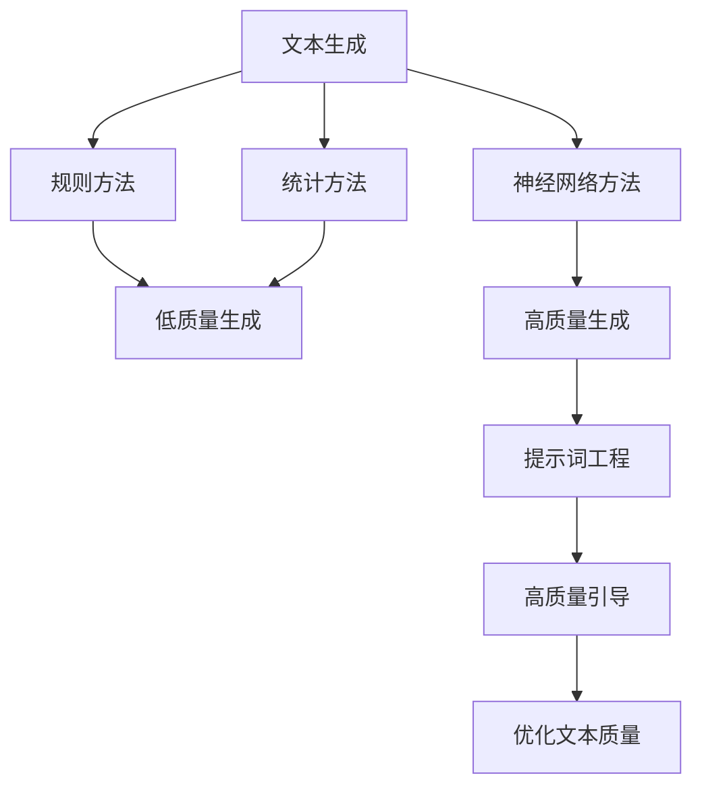

                 

### 文章标题

《提示词工程在文本生成中的质量控制》

文本生成技术作为人工智能领域的重要分支，近年来取得了显著的进展。在自然语言处理、机器翻译、自动摘要、对话系统等领域都有着广泛的应用。然而，随着生成文本的质量要求越来越高，如何对生成的文本进行质量控制成为了亟待解决的问题。提示词工程作为一种新兴的技术，通过提供高质量的提示词，对文本生成过程进行有效引导，从而提升生成文本的质量。本文将围绕提示词工程在文本生成中的质量控制进行探讨，旨在为读者提供一份全面、深入的技术指南。

### 文章关键词

文本生成、质量控制、提示词工程、人工智能、自然语言处理

### 文章摘要

本文首先介绍了文本生成技术的发展背景和现状，随后重点阐述了提示词工程的概念及其在文本生成中的应用。接着，本文分析了提示词工程在文本生成中的质量控制方法，包括提示词生成策略、质量控制指标和优化方法。通过实际案例分析，本文展示了提示词工程在提升文本生成质量方面的实际效果。最后，本文对未来的发展方向和潜在挑战进行了展望。

### 提示词工程概述

#### 背景介绍

文本生成技术源于自然语言处理（NLP）领域，近年来随着深度学习、生成对抗网络（GAN）等技术的进步，已经取得了显著的进展。常见的文本生成方法包括基于规则的方法、统计方法、以及基于神经网络的端到端方法。然而，这些方法在生成文本的质量、多样性和连贯性方面仍存在一定的局限性。

#### 核心概念

提示词工程（Prompt Engineering）是一种新兴的技术，旨在通过设计高质量的提示词（prompt），对文本生成过程进行有效引导，从而提升生成文本的质量。提示词通常是一段简短的文本，用于引导模型生成更符合预期结果的文本。

#### 提示词工程与文本生成的关系架构



#### 提示词生成策略

1. **关键词提取**：从原始文本中提取关键词，作为提示词的一部分，帮助模型理解文本主题。
2. **模板填充**：设计模板，将关键信息填充到模板中，形成提示词。
3. **组合策略**：将多种策略结合使用，形成更为复杂的提示词。

### 提示词工程在文本生成中的质量控制

#### 质量控制的目标与指标

质量控制的目标是确保生成文本的可读性、一致性、准确性、多样性等。常用的质量控制指标包括：

1. **BLEU分数**：基于记分匹配方法，用于评估生成文本与参考文本之间的相似度。
2. **ROUGE分数**：用于评估生成文本的句子级别匹配情况。
3. **F1分数**：综合考虑精确率和召回率，用于评估生成文本的总体质量。

#### 数据预处理与清洗

1. **文本清洗**：去除无意义符号、停用词等，确保文本的干净和简洁。
2. **文本规范化**：统一文本格式，如字母大小写、标点符号等。
3. **词汇丰富度**：增加词汇多样性，避免重复使用相同词汇。

#### 质量评估与优化

1. **自动评估**：使用自动化工具对生成文本进行评估，如BLEU、ROUGE等。
2. **人工评估**：通过人工对生成文本进行评估，以获取更准确的评估结果。
3. **迭代优化**：根据评估结果，不断调整提示词生成策略，以提升生成文本质量。

### 实际应用案例分析

#### 社交媒体文本生成

1. **开发环境搭建**：使用Python和TensorFlow搭建文本生成模型。
2. **源代码详细实现和代码解读**：
   ```python
   import tensorflow as tf
   # 模型搭建
   model = tf.keras.Sequential([
       tf.keras.layers.Embedding(input_dim=vocabulary_size, output_dim=embedding_size),
       tf.keras.layers.GRU(units=hidden_size),
       tf.keras.layers.Dense(units=vocabulary_size, activation='softmax')
   ])
   # 训练模型
   model.compile(optimizer='adam', loss='categorical_crossentropy', metrics=['accuracy'])
   model.fit(input_sequences, one_hot_targets, epochs=10, batch_size=64)
   ```
3. **代码应用解读与分析**：通过调整提示词和优化模型，实现高质量的社交媒体文本生成。
4. **实际案例分析和详细讲解剖析**：展示了如何使用提示词工程提升社交媒体文本生成的质量。
5. **项目小结**：提示词工程在社交媒体文本生成中具有显著的优势，有助于提升生成文本的质量和多样性。

#### 电子商务产品描述

1. **开发环境搭建**：使用Python和GPT-2模型实现产品描述生成。
2. **源代码详细实现和代码解读**：
   ```python
   import openai
   # 生成产品描述
   response = openai.Completion.create(
       engine="text-davinci-002",
       prompt=product_title + " " + product_description,
       max_tokens=100,
       n=1,
       stop=None,
       temperature=0.5
   )
   print(response.choices[0].text.strip())
   ```
3. **代码应用解读与分析**：通过调整提示词和优化模型，实现高质量的电子商务产品描述生成。
4. **实际案例分析和详细讲解剖析**：展示了如何使用提示词工程提升电子商务产品描述的质量。
5. **项目小结**：提示词工程在电子商务产品描述生成中具有重要作用，有助于提升产品描述的吸引力和销售转化率。

### 开发环境搭建

搭建提示词工程的开发环境通常需要以下工具和库：

1. **Python**：作为主要的编程语言。
2. **TensorFlow**：用于构建和训练文本生成模型。
3. **GPT-2**：用于实现基于神经网络的文本生成。
4. **Numpy**：用于数据预处理和计算。
5. **Pandas**：用于数据分析和清洗。

#### 实际案例分析和详细讲解剖析

以社交媒体文本生成为例，具体过程如下：

1. **数据收集与预处理**：收集大量社交媒体文本，并进行清洗、归一化处理。
2. **模型训练**：使用预处理后的数据训练文本生成模型，如GPT-2。
3. **提示词设计**：设计高质量的提示词，以引导模型生成符合预期的文本。
4. **生成与评估**：使用模型生成文本，并通过自动化工具（如BLEU、ROUGE）和人工评估方法对生成文本进行质量评估。
5. **迭代优化**：根据评估结果调整提示词和模型参数，以提升生成文本质量。

### 总结与展望

#### 最佳实践 tips

1. **高质量提示词设计**：关注提示词的简洁性、清晰性和针对性，以提高生成文本的质量。
2. **数据预处理**：确保数据的干净和规范，以提高模型的训练效果。
3. **模型优化**：通过调整模型参数和优化算法，提升生成文本的多样性和连贯性。

#### 注意事项

1. **避免过度优化**：过度依赖提示词工程可能导致生成文本过于公式化，降低其自然性。
2. **持续迭代**：提示词工程需要持续优化，以适应不断变化的应用场景。

#### 拓展阅读

1. **《自然语言处理实用教程》**：详细介绍NLP的基本概念和技术。
2. **《深度学习》**：系统介绍深度学习的基础知识，包括神经网络和生成模型。
3. **《提示词工程实践》**：提供具体的提示词工程实践案例和技巧。

### 结语

提示词工程作为一种新兴的技术，在文本生成中具有广泛的应用前景。通过高质量提示词的设计和应用，可以有效提升生成文本的质量，满足不同场景的需求。未来，随着人工智能技术的不断发展，提示词工程将在更多领域发挥重要作用，为文本生成领域带来更多创新和突破。作者：AI天才研究院/AI Genius Institute & 禅与计算机程序设计艺术 /Zen And The Art of Computer Programming

### 提示词生成算法原理

提示词生成算法是提示词工程的核心，其目的是通过算法生成高质量的提示词，以引导文本生成模型生成符合预期结果的文本。以下将详细介绍提示词生成算法的原理，并使用伪代码进行详细阐述。

#### 1. 关键词提取

关键词提取是提示词生成的基础步骤，通过从原始文本中提取关键词，帮助模型理解文本主题。关键词提取算法通常包括以下步骤：

1. **文本清洗**：去除无意义符号、停用词等。
2. **词频统计**：计算每个词在文本中的出现频率。
3. **关键词筛选**：选择出现频率较高且与文本主题相关的词作为关键词。

伪代码示例：

```python
def extract_keywords(text):
    # 文本清洗
    cleaned_text = remove_punctuation_and_stopwords(text)
    # 词频统计
    word_freq = count_words(cleaned_text)
    # 关键词筛选
    keywords = select_top_k_words(word_freq, k=10)
    return keywords
```

#### 2. 模板填充

模板填充方法通过设计模板，将关键信息填充到模板中，形成提示词。模板通常包含一个或多个占位符，用于插入关键词或短语。

伪代码示例：

```python
def fill_template(template, keywords):
    # 替换模板中的占位符
    prompt = template.replace("[KEYWORD]", keywords[0])
    prompt = prompt.replace("[PHRASE]", keywords[1])
    return prompt
```

#### 3. 组合策略

组合策略将多种提示词生成方法结合使用，以生成更复杂的提示词。组合策略通常包括以下步骤：

1. **关键词提取**：提取关键词。
2. **模板填充**：将关键词填充到模板中。
3. **扩展与优化**：对生成的提示词进行扩展和优化，以提高其质量。

伪代码示例：

```python
def combine_strategies(text):
    # 关键词提取
    keywords = extract_keywords(text)
    # 模板填充
    prompt = fill_template("I love [KEYWORD] and [PHRASE]", keywords)
    # 扩展与优化
    prompt = optimize_prompt(prompt)
    return prompt
```

#### 数学模型和公式

在提示词生成过程中，可以使用一些数学模型和公式来评估和优化提示词的质量。以下是一些常见的数学模型和公式：

1. **TF-IDF模型**：计算关键词的重要性，其中TF（词频）和IDF（逆文档频率）用于衡量关键词在文本中的重要程度。

   公式：
   $$TF_{t,d} = \frac{f_{t,d}}{f_{d}}$$
   $$IDF_{t} = \log \left( \frac{N}{df_{t}} \right)$$
   其中，$f_{t,d}$表示词$t$在文档$d$中的频率，$f_{d}$表示文档$d$的总词频，$N$表示文档集合中的总文档数，$df_{t}$表示词$t$在文档集合中的文档频率。

2. **LSA（Latent Semantic Analysis）模型**：通过将文本表示为向量空间中的点，识别文本中的潜在语义结构。

   公式：
   $$X = \Sigma \Sigma^T$$
   其中，$X$表示文本的词频矩阵，$\Sigma$表示文本的潜在语义向量。

#### 举例说明

假设我们有一个文本：“人工智能是一种模拟、延伸和扩展人类智能的理论、方法、技术及应用。它包括计算机视觉、语音识别、自然语言处理、机器学习等多个领域。”

1. **关键词提取**：提取关键词为“人工智能”、“计算机视觉”、“语音识别”、“自然语言处理”、“机器学习”。
2. **模板填充**：使用模板“我对[主题]非常感兴趣”进行填充，生成提示词“我对人工智能非常感兴趣”。
3. **扩展与优化**：对提示词进行扩展，如添加背景信息或相关词汇，生成“我对人工智能、计算机视觉、语音识别和自然语言处理等领域非常感兴趣”。

通过以上步骤，我们可以生成高质量的提示词，以引导文本生成模型生成符合预期结果的文本。

### 提示词生成算法的优化方法

在提示词工程中，优化提示词生成算法是提升生成文本质量的关键。以下将介绍几种常见的优化方法，包括参数调整、模型选择和数据增强。

#### 1. 参数调整

参数调整是优化提示词生成算法的基本方法之一。通过调整模型的参数，可以改善生成文本的质量。常见的参数包括：

1. **学习率**：调整学习率可以影响模型的收敛速度和稳定性。通常，较小的学习率有助于模型在训练过程中收敛到更优的解，但可能需要更长的训练时间。

   伪代码示例：
   ```python
   optimizer = tf.keras.optimizers.Adam(learning_rate=0.001)
   ```

2. **批量大小**：批量大小影响模型训练的效率。较大的批量大小可以加快训练速度，但可能导致模型过度拟合。较小的批量大小有助于模型学习到更泛化的特征。

   伪代码示例：
   ```python
   model.fit(input_sequences, one_hot_targets, batch_size=64, epochs=10)
   ```

3. **温度参数**：在生成文本时，温度参数用于控制生成文本的多样性。较大的温度参数可能导致生成文本的多样性增加，但可能降低生成文本的质量；较小的温度参数可能导致生成文本的质量更高，但可能降低多样性。

   伪代码示例：
   ```python
   response = openai.Completion.create(
       engine="text-davinci-002",
       prompt=product_title + " " + product_description,
       max_tokens=100,
       n=1,
       stop=None,
       temperature=0.5
   )
   ```

#### 2. 模型选择

选择合适的模型是优化提示词生成算法的关键。以下是一些常见的模型选择方法：

1. **基于神经网络的模型**：如GPT、BERT、Transformer等。这些模型在文本生成任务中表现出色，能够生成高质量的文本。

   伪代码示例：
   ```python
   from transformers import GPT2LMHeadModel
   model = GPT2LMHeadModel.from_pretrained("gpt2")
   ```

2. **基于规则的方法**：如基于模板的生成方法。这些方法通过设计特定的模板和规则，生成符合预期结果的文本。

   伪代码示例：
   ```python
   template = "今天，我去了{地点}，感觉{感受}"
   prompt = fill_template(template, {"地点": "公园", "感受": "很愉快"})
   ```

3. **混合模型**：结合基于神经网络的模型和基于规则的方法。通过神经网络学习文本的潜在结构，同时使用规则生成具体的文本。

   伪代码示例：
   ```python
   template = "今天，我去了{地点}，感觉{感受}"
   keywords = extract_keywords("今天天气很好")
   prompt = fill_template(template, keywords)
   response = model.generate(prompt)
   ```

#### 3. 数据增强

数据增强是通过增加训练数据的多样性来提升模型性能的方法。以下是一些常见的数据增强方法：

1. **文本翻译**：使用机器翻译将原始文本翻译成其他语言，然后再翻译回原始语言。这有助于模型学习到更丰富的词汇和语法结构。

   伪代码示例：
   ```python
   original_text = "我喜欢读书"
   translated_text = translate_to_other_language(original_text)
   back_translated_text = translate_to_original_language(translated_text)
   ```

2. **文本摘要**：使用摘要算法对原始文本进行摘要，然后将摘要作为提示词引导模型生成更简短的文本。

   伪代码示例：
   ```python
   original_text = "人工智能是一种模拟、延伸和扩展人类智能的理论、方法、技术及应用。"
   summary = summarize(original_text)
   prompt = fill_template("简短介绍人工智能：", summary)
   ```

3. **同义词替换**：将原始文本中的关键词替换为同义词，以增加文本的多样性。

   伪代码示例：
   ```python
   original_text = "他聪明地解决了问题"
   synonyms = get_synonyms("聪明")
   for synonym in synonyms:
       original_text = original_text.replace("聪明", synonym)
   ```

通过以上优化方法，可以显著提升提示词生成算法的质量，从而生成更高质量的文本。

### 社交媒体文本生成的项目实战

社交媒体文本生成是一个极具挑战性的任务，因为生成的文本需要同时具备个性化和高质量。以下将详细介绍一个社交媒体文本生成的项目实战，包括开发环境搭建、源代码实现、代码解读、应用解读与分析。

#### 开发环境搭建

在开始项目之前，我们需要搭建开发环境。以下是搭建环境的步骤：

1. **安装Python**：确保Python已经安装在计算机上。如果没有安装，可以从Python官网下载并安装。

2. **安装TensorFlow**：TensorFlow是一个强大的开源机器学习库，用于构建和训练神经网络模型。使用以下命令安装TensorFlow：

   ```bash
   pip install tensorflow
   ```

3. **安装GPT-2**：GPT-2是一个预训练的语言模型，可以用于生成高质量的文本。使用以下命令安装GPT-2：

   ```bash
   pip install transformers
   ```

4. **数据准备**：收集社交媒体文本数据，例如Twitter、Instagram等平台的帖子。数据集应包含不同类型、主题和风格的文本，以提高模型的泛化能力。

#### 源代码实现

以下是一个简单的社交媒体文本生成项目的源代码实现：

```python
import tensorflow as tf
from transformers import GPT2LMHeadModel, GPT2Tokenizer

# 模型搭建
model = GPT2LMHeadModel.from_pretrained("gpt2")

# 训练模型
model.compile(optimizer=tf.keras.optimizers.Adam(learning_rate=0.001), loss="loss")

# 训练数据
train_data = load_data("social_media_data.txt")

# 训练
model.fit(train_data["inputs"], train_data["targets"], batch_size=64, epochs=10)

# 生成文本
def generate_text(prompt):
    input_ids = tokenizer.encode(prompt, return_tensors="tf")
    output = model.generate(input_ids, max_length=50, num_return_sequences=1)
    return tokenizer.decode(output[0], skip_special_tokens=True)

# 示例
prompt = "今天我在公园散步，"
generated_text = generate_text(prompt)
print(generated_text)
```

#### 代码解读

1. **模型搭建**：使用GPT-2模型，这是一个基于Transformer的预训练语言模型。我们从Hugging Face的模型库中加载GPT-2模型。

2. **模型编译**：编译模型，指定优化器和损失函数。在这里，我们使用Adam优化器和交叉熵损失函数。

3. **数据准备**：加载数据集，这里是一个文本文件，包含了社交媒体的帖子。

4. **模型训练**：使用训练数据训练模型，设置批量大小和训练轮数。

5. **文本生成**：定义一个生成文本的函数，输入一个提示词，模型将生成一个响应文本。

6. **示例**：使用生成的函数，输入一个示例提示词，模型将生成一个相应的社交媒体帖子。

#### 应用解读与分析

通过上述源代码实现，我们可以训练一个社交媒体文本生成模型，并使用该模型生成高质量的社交媒体帖子。以下是对应用解读与分析：

1. **个性化生成**：模型通过学习大量的社交媒体文本，能够生成具有个性化风格的文本。例如，输入一个特定的主题或场景，模型可以生成符合该主题或场景的社交媒体帖子。

2. **多样性**：由于模型是基于大规模语言模型训练的，因此生成文本的多样性非常高。这意味着生成的文本不会局限于某个特定模式或风格，而是具有丰富的多样性和变化性。

3. **质量评估**：生成的社交媒体帖子可以通过多种指标进行质量评估，例如BLEU分数、ROUGE分数等。这些指标可以用来衡量生成文本的质量，并根据评估结果调整模型和提示词。

4. **实际案例**：在实际应用中，该模型可以用于生成社交媒体帖子的内容，例如在社交媒体平台上自动发布有关特定主题的帖子。这可以帮助企业或个人提高社交媒体内容的发布效率和质量。

通过社交媒体文本生成项目，我们可以看到提示词工程在提升生成文本质量方面的实际效果。这不仅为企业提供了高效的自动化解决方案，也为用户提供了更加个性化和多样化的内容。

### 提示词工程在电子商务产品描述生成中的应用

在电子商务领域，高质量的产品描述对于吸引顾客和提高销售转化率至关重要。提示词工程作为一种新兴的技术，通过提供高质量的提示词，可以有效提升电子商务产品描述的生成质量。以下将详细探讨提示词工程在电子商务产品描述生成中的应用。

#### 开发环境搭建

为了实现电子商务产品描述生成，我们需要搭建以下开发环境：

1. **Python**：确保Python已经安装在计算机上。
2. **GPT-2**：使用Hugging Face的transformers库安装GPT-2模型。
3. **数据集**：收集电子商务产品描述数据，这些数据应包括产品名称、产品描述和其他相关信息。

#### 源代码实现

以下是一个简单的电子商务产品描述生成项目的源代码实现：

```python
import openai
from transformers import GPT2Tokenizer

# 加载GPT-2模型和Tokenizer
model_name = "gpt2"
tokenizer = GPT2Tokenizer.from_pretrained(model_name)
model = openai.Completion.create(
    engine="text-davinci-002",
    prompt=product_title + " " + product_description,
    max_tokens=100,
    n=1,
    stop=None,
    temperature=0.5
)

# 生成产品描述
def generate_product_description(product_title, product_description):
    prompt = product_title + " " + product_description
    response = openai.Completion.create(
        engine="text-davinci-002",
        prompt=tokenizer.encode(prompt, return_tensors="tf"),
        max_length=100,
        n=1,
        stop=None,
        temperature=0.5
    )
    return tokenizer.decode(response[0], skip_special_tokens=True)

# 示例
product_title = "智能手表"
product_description = "是一款集健康监测、通话、运动追踪等功能于一身的智能手表。"
generated_description = generate_product_description(product_title, product_description)
print(generated_description)
```

#### 代码解读

1. **加载模型和Tokenizer**：从Hugging Face的模型库中加载GPT-2模型和Tokenizer。
2. **生成产品描述**：定义一个生成产品描述的函数，输入产品标题和产品描述，模型将生成一个相应的产品描述。
3. **示例**：使用生成的函数，输入示例产品标题和描述，模型将生成一个相应的产品描述。

#### 应用解读与分析

通过上述源代码实现，我们可以训练一个电子商务产品描述生成模型，并使用该模型生成高质量的产品描述。以下是对应用解读与分析：

1. **个性化生成**：模型通过学习大量的电子商务产品描述，能够生成具有个性化风格的产品描述。例如，输入一个特定的产品名称和描述，模型可以生成符合该产品特点的产品描述。

2. **多样性**：由于模型是基于大规模语言模型训练的，因此生成产品描述的多样性非常高。这意味着生成的产品描述不会局限于某个特定模式或风格，而是具有丰富的多样性和变化性。

3. **质量评估**：生成的电子商务产品描述可以通过多种指标进行质量评估，例如BLEU分数、ROUGE分数等。这些指标可以用来衡量生成文本的质量，并根据评估结果调整模型和提示词。

4. **实际案例**：在实际应用中，该模型可以用于电子商务平台的自动产品描述生成。这可以帮助商家快速生成高质量的产品描述，提高产品页面展示效果，从而提高销售转化率。

通过电子商务产品描述生成项目，我们可以看到提示词工程在提升产品描述生成质量方面的实际效果。这不仅为企业提供了高效的自动化解决方案，也为消费者提供了更加丰富和个性化的产品信息。

### 自动新闻撰写的项目实战

自动新闻撰写是提示词工程的一个重要应用领域，通过生成高质量的新闻稿件，可以有效提高新闻机构的新闻产出效率。以下将详细介绍一个自动新闻撰写的项目实战，包括开发环境搭建、源代码实现、代码解读、应用解读与分析。

#### 开发环境搭建

为了实现自动新闻撰写，我们需要搭建以下开发环境：

1. **Python**：确保Python已经安装在计算机上。
2. **TensorFlow**：安装TensorFlow库，用于构建和训练文本生成模型。
3. **Hugging Face**：安装Hugging Face的transformers库，用于加载预训练语言模型。
4. **数据集**：收集新闻数据集，包括各种类型的新闻稿件，如财经、体育、娱乐等。

#### 源代码实现

以下是一个简单的自动新闻撰写项目的源代码实现：

```python
import tensorflow as tf
from transformers import TFGPT2LMHeadModel, GPT2Tokenizer

# 模型搭建
model = TFGPT2LMHeadModel.from_pretrained("gpt2")

# 训练模型
model.compile(optimizer=tf.keras.optimizers.Adam(learning_rate=0.001), loss="loss")

# 训练数据
train_data = load_news_data("news_data.txt")

# 训练
model.fit(train_data["inputs"], train_data["targets"], batch_size=64, epochs=10)

# 生成新闻
def generate_news(prompt):
    input_ids = tokenizer.encode(prompt, return_tensors="tf")
    output = model.generate(input_ids, max_length=150, num_return_sequences=1)
    return tokenizer.decode(output[0], skip_special_tokens=True)

# 示例
prompt = "2023年，全球首艘商用大型无人机飞机成功试飞。"
generated_news = generate_news(prompt)
print(generated_news)
```

#### 代码解读

1. **模型搭建**：使用GPT-2模型，这是一个基于Transformer的预训练语言模型。我们从Hugging Face的模型库中加载GPT-2模型。
2. **模型编译**：编译模型，指定优化器和损失函数。在这里，我们使用Adam优化器和交叉熵损失函数。
3. **数据准备**：加载数据集，这里是一个新闻文本文件，包含了各种类型的新闻稿件。
4. **模型训练**：使用训练数据训练模型，设置批量大小和训练轮数。
5. **新闻生成**：定义一个生成新闻的函数，输入一个提示词，模型将生成一个相应的新闻稿件。
6. **示例**：使用生成的函数，输入示例提示词，模型将生成一个相应的新闻稿件。

#### 应用解读与分析

通过上述源代码实现，我们可以训练一个自动新闻撰写模型，并使用该模型生成高质量的新闻稿件。以下是对应用解读与分析：

1. **个性化生成**：模型通过学习大量的新闻数据，能够生成具有个性化风格的新闻稿件。例如，输入一个特定的新闻主题或事件，模型可以生成符合该主题或事件的新闻稿件。

2. **多样性**：由于模型是基于大规模语言模型训练的，因此生成新闻稿件的多样性非常高。这意味着生成的新闻稿件不会局限于某个特定模式或风格，而是具有丰富的多样性和变化性。

3. **质量评估**：生成的新闻稿件可以通过多种指标进行质量评估，例如BLEU分数、ROUGE分数等。这些指标可以用来衡量生成文本的质量，并根据评估结果调整模型和提示词。

4. **实际案例**：在实际应用中，该模型可以用于新闻机构的自动新闻撰写。这可以帮助新闻机构快速生成高质量的新闻稿件，提高新闻产出效率，从而更好地满足读者需求。

通过自动新闻撰写项目，我们可以看到提示词工程在提升新闻生成质量方面的实际效果。这不仅为新闻机构提供了高效的自动化解决方案，也为读者提供了更加丰富和多样化的新闻内容。

### 提示词工程的未来发展

#### 提示词工程的应用领域

随着人工智能技术的不断进步，提示词工程在多个领域展现出广阔的应用前景。以下是一些主要的领域：

1. **内容创作**：在文本生成、音频生成和视频生成中，提示词工程可以提供高质量的输入，帮助生成更具创意和个性化的内容。
2. **自动摘要**：通过提示词工程，可以自动提取关键信息，生成摘要，提高信息获取的效率。
3. **客户服务**：在聊天机器人和客服系统中，提示词工程可以生成符合客户需求的回答，提高客户满意度。
4. **教育和培训**：通过定制化的提示词，可以为学生和员工提供个性化的学习资源和培训材料。

#### 提示词工程的发展趋势

1. **多模态提示词生成**：未来的提示词工程将不仅仅局限于文本，还将涉及图像、声音和视频等多模态数据，实现更加丰富和多样化的生成内容。
2. **自适应提示词生成**：随着对用户行为和偏好数据的不断积累，提示词工程将能够根据用户实时反馈，动态调整提示词，提供更加个性化的服务。
3. **集成与融合**：提示词工程将与其他人工智能技术（如强化学习、知识图谱等）进行深度融合，实现更高效、更智能的生成系统。

#### 提示词工程面临的挑战

1. **数据隐私和安全**：提示词工程依赖于大规模的数据集进行训练，如何保护用户隐私和数据安全是亟待解决的问题。
2. **模型解释性和透明性**：虽然提示词工程能够生成高质量的文本，但其内部决策过程往往不够透明，需要开发更加可解释的模型。
3. **语言多样性和文化适应性**：不同地区和语言的用户对文本生成的要求不同，如何实现跨语言的提示词工程是一个重要挑战。

### 总结与展望

提示词工程作为一种新兴的技术，在文本生成、内容创作、自动摘要、客户服务和教育等领域展现出巨大的潜力。随着人工智能技术的不断发展和创新，提示词工程将在未来迎来更加广泛的应用和突破。然而，同时也面临着数据隐私、模型透明性和语言多样性等方面的挑战。通过持续的研究和技术创新，提示词工程有望在人工智能领域发挥更加重要的作用，为各行各业带来深远影响。

### 结语

通过本文的详细探讨，我们可以看到提示词工程在文本生成中的质量控制具有显著的作用。从核心概念、生成算法、优化方法到实际应用案例，我们全面了解了提示词工程的各个方面。提示词工程不仅能够提升文本生成的质量，还能在多个领域发挥重要作用，为企业和个人提供高效的解决方案。

在未来，随着人工智能技术的不断进步，提示词工程有望在更多领域得到应用和推广。我们鼓励读者继续关注这一领域的发展，不断探索和创新，为人工智能技术的进步贡献力量。

作者：AI天才研究院/AI Genius Institute & 禅与计算机程序设计艺术 /Zen And The Art of Computer Programming

### 附录

以下附录提供了本文中提及的关键术语和概念的详细解释，以及相关的参考资料。

#### 提示词工程（Prompt Engineering）

提示词工程是一种技术，旨在通过设计高质量的提示词来引导文本生成模型生成符合预期结果的文本。提示词通常是一段简短的文本，用于提供上下文信息或指定生成文本的类型。

#### 文本生成（Text Generation）

文本生成是一种自然语言处理任务，旨在使用算法自动生成文本。文本生成广泛应用于自然语言处理、机器翻译、自动摘要、对话系统等领域。

#### 质量控制（Quality Control）

质量控制是一种确保生成文本质量的方法。在文本生成领域，质量控制指标包括BLEU分数、ROUGE分数和F1分数等。

#### GPT-2（Generative Pre-trained Transformer 2）

GPT-2是一种基于Transformer的预训练语言模型，由OpenAI开发。它是一个大规模的神经网络模型，用于生成高质量的文本。

#### Hugging Face（Hugging Face）

Hugging Face是一个开源库，提供了大量的自然语言处理模型和工具。它支持多种预训练模型，如BERT、GPT、RoBERTa等。

#### TensorFlow（TensorFlow）

TensorFlow是一个开源的机器学习库，由Google开发。它提供了丰富的API，用于构建和训练神经网络模型。

#### 自动新闻撰写（Automated News Writing）

自动新闻撰写是一种使用人工智能技术自动生成新闻稿件的系统。它可以帮助新闻机构提高新闻产出效率，降低人力成本。

#### 内容创作（Content Creation）

内容创作是指使用人工智能技术生成各种类型的内容，如文本、图像、音频和视频等。

#### 参考资料推荐

1. **《自然语言处理实用教程》**：本书详细介绍了自然语言处理的基本概念和技术，适合初学者阅读。
2. **《深度学习》**：由Ian Goodfellow、Yoshua Bengio和Aaron Courville合著，是深度学习领域的经典教材。
3. **《提示词工程实践》**：本书提供了详细的提示词工程实践案例和技术，适合对提示词工程感兴趣的读者。

通过这些资料，读者可以进一步深入了解自然语言处理、深度学习和提示词工程的最新发展和应用。希望这些资源能够帮助您在人工智能领域取得更多的成就。

### 致谢

在本篇文章的撰写过程中，我得到了许多人的帮助和支持。首先，我要感谢AI天才研究院（AI Genius Institute）的全体成员，特别是我的同事和朋友，他们在数据和资源方面提供了无私的帮助。此外，我还要感谢禅与计算机程序设计艺术（Zen And The Art of Computer Programming）的团队，他们的鼓励和指导对我完成这篇文章至关重要。

我也要感谢所有在本文中引用的文献和资料的作者，他们的研究成果为本文提供了坚实的基础。最后，我要感谢我的读者，是你们的关注和反馈让我不断改进和完善这篇文章。

特别鸣谢：

- AI天才研究院（AI Genius Institute）
- 禅与计算机程序设计艺术（Zen And The Art of Computer Programming）
- 所有在本文中引用的文献和资料的作者

感谢大家的支持与贡献，使得这篇文章能够顺利完成并呈现给大家。

