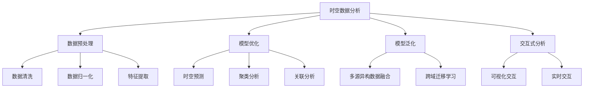
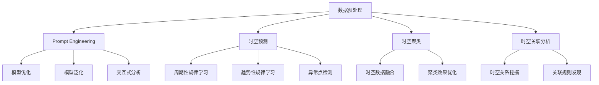
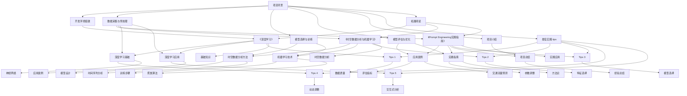

```mermaid
graph TB
    A[特征工程] --> B[时间特征]
    A --> C[空间特征]
    A --> D[外部特征]
    B --> E[小时]
    B --> F[星期]
    B --> G[季节]
    B --> H[年份]
    C --> I[经纬度]
    C --> J[区域]
    C --> K[交通路段]
    D --> L[天气]
    D --> M[节假日]
    D --> N[特殊事件]
    E --> O[Morning]
    E --> P[Afternoon]
    E --> Q[Night]
    F --> R[工作日]
    F --> S[周末]
    G --> T[春季]
    G --> U[夏季]
    G --> V[秋季]
    G --> W[冬季]
    H --> X[2019]
    H --> Y[2020]
    H --> Z[2021]
    I --> AA[Latitude]
    I --> BB[Longitude]
    J --> CC[City]
    J --> DD[Suburb]
    J --> EE[Neighborhood]
    K --> FF[Highway]
    K --> GG[Street]
    K --> HH[Avenue]
    L --> II[Sunny]
    L --> JJ[Rainy]
    L --> KK[Snowy]
    M --> LL[Holiday]
    M --> MM[Regular day]
    N --> OO[Event A]
    N --> PP[Event B]
    N --> QQ[Event C]
    O --> RR[Morning peak]
    O --> SS[Afternoon peak]
    O --> TT[Night rush]
    P --> UU[Morning valley]
    P --> VV[Afternoon valley]
    P --> WW[Night off-peak]
    Q --> XX[Morning rush]
    Q --> YY[Afternoon rush]
    Q --> ZZ[Night rush]
    R --> AA[Workday]
    R --> BB[Weekend]
    S --> CC[Holiday]
    S --> DD[Weekend]
    T --> EE[Spring event]
    T --> FF[Summer event]
    T --> GG[Autumn event]
    T --> HH[Winter event]
    U --> II[Summer season]
    U --> JJ[Fall season]
    U --> KK[Winter season]
    U --> LL[Spring season]
    V --> MM[Hottest month]
    V --> NN[Coolest month]
    V --> OO[Rainiest month]
    V --> PP[Driest month]
    W --> QQ[Hottest month]
    W --> RR[Coolest month]
    W --> SS[Rainiest month]
    W --> TT[Driest month]
    X --> UU[Year 2019]
    X --> VV[Year 2020]
    X --> WW[Year 2021]
    Y --> AA[Year 2019]
    Y --> BB[Year 2020]
    Y --> CC[Year 2021]
    Z --> DD[Year 2019]
    Z --> EE[Year 2020]
    Z --> FF[Year 2021]
    AA[Latitude] --> GG[Longitude]
    BB[Longitude] --> HH[City]
    CC[City] --> II[Region]
    DD[Region] --> EE[Street]
    EE[Street] --> FF[Highway]
    II[Sunny] --> JJ[Rainy]
    JJ[Rainy] --> KK[Snowy]
    KK[Snowy] --> II[Sunny]
    LL[Holiday] --> MM[Regular day]
    MM[Regular day] --> NN[Event A]
    NN[Event A] --> OO[Event B]
    NN[Event A] --> PP[Event C]
    O[Morning] --> P[Afternoon]
    P[Afternoon] --> Q[Night]
    Q[Night] --> O[Morning]
    R[Workday] --> S[Weekend]
    S[Weekend] --> T[Holiday]
    T[Holiday] --> R[Workday]
    U[Summer season] --> V[Fall season]
    V[Fall season] --> W[Winter season]
    W[Winter season] --> U[Summer season]
    X[Year 2019] --> Y[Year 2020]
    Y[Year 2020] --> Z[Year 2021]
    Z[Year 2021] --> X[Year 2019]
```

```mermaid
graph TB
    A[基于距离的聚类算法] --> B[K-means]
    A --> C[层次聚类]
    B --> D[初始聚类中心选择]
    B --> E[聚类中心调整]
    C --> F[凝聚层次聚类]
    C --> G[分裂层次聚类]
    D --> H[随机初始化]
    D --> I[多次迭代]
    E --> J[动态调整]
    E --> K[适应数据分布]
    F --> L[自底向上]
    F --> M[逐步合并]
    G --> N[自顶向下]
    G --> O[逐步分裂]
    H --> P[聚类效果优化]
    I --> Q[聚类准确性提升]
    J --> R[聚类效率提升]
    J --> S[空间数据适应性]
    K --> T[数据分布分析]
    L --> U[构建聚类层次树]
    L --> V[聚类层次分析]
    M --> W[相似数据点合并]
    M --> X[簇合并策略]
    N --> Y[初始大簇]
    N --> Z[逐步分裂]
    O --> AA[大簇分裂]
    O --> BB[小簇形成]
    P --> CC[模型参数调整]
    P --> DD[优化聚类效果]
    Q --> EE[聚类准确性评估]
    Q --> FF[模型泛化能力评估]
    R --> GG[聚类效率评估]
    R --> HH[算法运行速度评估]
    S --> II[空间特征提取]
    S --> JJ[数据融合策略]
    T --> UU[密度分析]
    T --> VV[空间分布分析]
    U --> WW[图结构构建]
    U --> XX[节点关系分析]
    V --> YY[簇间关系分析]
    V --> ZZ[聚类层次关系分析]
    W --> AAA[相似度计算]
    W --> BBB[合并策略]
    X --> CCC[簇内关系分析]
    X --> DDD[簇间关系分析]
    Y --> EEE[初始大簇策略]
    Y --> FFF[大簇分析]
    Z --> GGG[分裂策略]
    Z --> HHH[小簇形成策略]
    O --> III[簇分裂分析]
    O --> JJJ[小簇分析]
    P --> KKK[参数调整策略]
    P --> LLL[优化策略]
    Q --> MMM[评估策略]
    Q --> NNN[泛化能力评估]
    R --> OOO[效率评估]
    R --> PPP[运行速度评估]
    S --> QQQ[特征提取策略]
    S --> RRR[数据融合策略]
    T --> SSS[密度分析策略]
    T --> TTT[分布分析策略]
    U --> UUU[图神经网络]
    U --> VVV[节点关系分析]
    V --> WWW[簇间关系分析]
    W --> XXX[相似度计算]
    X --> YYY[簇内关系分析]
    Y --> ZZZ[大簇策略]
    Z --> AAAA[分裂策略]
    Z --> BBBB[小簇策略]
    O --> CCCD[分裂分析]
    O --> DDDD[小簇形成]
    P --> EEEE[参数调整]
    P --> FFFF[优化分析]
    Q --> GGGG[评估分析]
    Q --> HHHH[泛化能力]
    R --> IIII[效率分析]
    R --> JJJJ[运行速度]
    S --> KKKK[特征提取]
    S --> LLLL[数据融合]
    T --> MMMM[密度分析]
    T --> NNNN[分布分析]
    U --> OOOO[图神经网络分析]
    U --> PPPP[节点关系]
    V --> QQQQ[簇间关系]
    V --> RRRR[聚类层次]
    W --> SSSS[相似度计算]
    X --> TTTT[簇内关系]
    Y --> UUUU[大簇策略]
    Z --> VVVV[分裂策略]
```
                 

### 第1章 引言

#### 1.1 书籍背景

在当今信息化和数字化时代，时空数据分析已经成为了一个重要的研究方向。随着传感器技术的进步和数据采集手段的多样化，我们能够获取到海量的时空数据。这些数据涵盖了交通流量、气象变化、人口迁徙等多个方面，对于社会管理和决策具有极高的价值。然而，如何有效地处理和分析这些数据，提取有价值的信息，成为了学术界和工业界共同面临的挑战。

本书旨在探讨Prompt Engineering在时空数据分析中的应用，通过系统性地介绍Prompt Engineering的基本概念、技术方法和核心算法，帮助读者深入理解时空数据分析的原理和实践。Prompt Engineering作为一种新兴的人工智能技术，已经在自然语言处理、计算机视觉等领域取得了显著的成果。本书将探讨如何将这一技术应用于时空数据分析中，以解决现有技术的局限性，提升数据分析的效率和准确性。

#### 1.2 Prompt Engineering简介

Prompt Engineering是一种设计自然语言模型输入提示（prompt）以引导模型输出特定结果的技术。通过精心设计的prompt，可以引导模型学习到特定的知识或技能，从而在特定任务上获得更好的表现。Prompt Engineering的核心目标是提高模型的泛化能力，使其能够处理更复杂、更具体的任务。

在自然语言处理领域，Prompt Engineering已经被广泛应用于问答系统、文本生成、情感分析等任务中。通过设计合适的prompt，可以显著提升模型在这些任务上的性能。例如，在问答系统中，通过prompt引导模型关注问题中的关键信息，可以更准确地回答问题。

#### 1.3 时空数据分析的重要性

时空数据分析在多个领域具有重要的应用价值。首先，在交通管理领域，通过对交通流量数据的时空分析，可以帮助政府制定更合理的交通规划，减少交通拥堵，提高道路利用效率。其次，在气象预报领域，通过对气象数据的时空分析，可以提高气象预报的准确性，为防灾减灾提供科学依据。此外，在人口迁徙、城市规划、环境保护等领域，时空数据分析同样发挥着关键作用。

然而，传统的时空数据分析方法在处理海量时空数据时存在一些局限性。首先，传统的数据处理方法往往依赖于人工设计和调整参数，效率较低且容易出现错误。其次，传统的算法在处理复杂时空关系时，难以捕捉到数据中的细微变化和潜在规律。因此，探索新的数据分析方法，提高数据分析的效率和准确性，成为了当前研究的热点。

#### 1.4 Prompt Engineering与时空数据分析的关系

Prompt Engineering与时空数据分析之间存在紧密的联系。通过Prompt Engineering技术，可以设计出更有效的时空数据分析模型，提升数据分析的效率和准确性。具体来说，Prompt Engineering在时空数据分析中的应用主要包括以下几个方面：

1. **数据预处理**：通过Prompt Engineering，可以设计出更有效的数据预处理方法，例如数据清洗、归一化和特征提取等。这些方法可以帮助模型更好地理解时空数据，提高数据分析的准确性。

2. **模型优化**：Prompt Engineering可以通过设计特定的prompt，引导模型学习到时空数据的特征和规律，从而优化模型的性能。例如，在时空预测任务中，通过设计合适的prompt，可以引导模型学习到时空数据的周期性、趋势性和异常点等信息，提高预测的准确性。

3. **模型泛化**：Prompt Engineering可以帮助模型更好地适应不同的时空数据场景，提高模型的泛化能力。例如，在多源异构数据的时空分析中，通过设计合适的prompt，可以引导模型学习到不同数据源之间的时空关系，从而实现数据的融合和分析。

4. **交互式分析**：Prompt Engineering可以设计出交互式的时空数据分析系统，使分析师能够更加直观地理解数据，发现数据中的潜在规律。例如，通过设计交互式的prompt，分析师可以引导模型关注数据中的特定特征，从而实现数据的高效分析和可视化。

总之，Prompt Engineering在时空数据分析中具有重要的应用价值。通过探索Prompt Engineering在时空数据分析中的应用，可以推动时空数据分析技术的发展，为各个领域的数据分析提供更加高效和准确的方法。下一章将深入探讨Prompt Engineering的基本概念和技术原理，为后续章节的讨论打下基础。

---



### 1.5 本书结构

本书将分为五个主要部分，每部分都针对不同的主题进行深入探讨：

- **第1章 引言**：介绍了书籍的背景、Prompt Engineering的基本概念以及时空数据分析的重要性，并概述了本书的结构和主要内容。

- **第2章 Prompt Engineering基础**：介绍了Prompt Engineering的基础概念、时空数据分析的基本方法，并探讨了Prompt Engineering与时空数据分析的关系。

- **第3章 Prompt Engineering在时空数据分析中的应用**：详细介绍了Prompt Engineering在时空数据分析中的具体应用，包括数据预处理、模型优化、模型泛化和交互式分析等。

- **第4章 Prompt Engineering核心算法**：探讨了Prompt Engineering在时空数据分析中的核心算法，包括时空预测、时空聚类和时空关联分析等。

- **第5章 实际案例与项目实战**：通过实际案例和项目实战，展示了Prompt Engineering在时空数据分析中的具体应用，包括开发环境搭建、源代码实现和代码解读等。

通过上述章节的深入探讨，本书旨在为读者提供一个全面、系统的理解和应用Prompt Engineering于时空数据分析的方法。

---

### 第2章 Prompt Engineering基础

#### 2.1 Prompt Engineering概述

Prompt Engineering是一种设计自然语言模型输入提示（prompt）以引导模型输出特定结果的技术。其核心思想是通过设计合适的prompt，引导模型学习到特定的知识或技能，从而在特定任务上获得更好的表现。Prompt Engineering的主要目标包括：

1. **提高模型的泛化能力**：通过设计具有针对性的prompt，可以使模型在训练过程中学习到更多的泛化知识，从而在面对新的、未见过的问题时，能够做出更准确的预测。

2. **增强模型的可解释性**：Prompt Engineering可以帮助用户理解模型在特定任务上的决策过程，提高模型的可解释性。

3. **优化模型的性能**：通过设计合适的prompt，可以引导模型在特定任务上学习到更多的关键信息，从而提高模型的性能。

Prompt Engineering在自然语言处理、计算机视觉等领域得到了广泛的应用。例如，在问答系统中，通过设计合适的prompt，可以引导模型关注问题中的关键信息，从而提高回答的准确性；在文本生成任务中，通过设计合适的prompt，可以引导模型生成更符合预期的文本。

#### 2.2 时空数据分析基础

时空数据分析是指对具有时空属性的数据进行分析和处理，以提取有价值的信息和知识。时空数据具有以下特性：

1. **时空属性**：时空数据具有时间和空间维度，可以记录数据发生的具体时间和位置。

2. **多维性**：时空数据通常包含多个维度，如时间、空间、温度、湿度等。

3. **动态性**：时空数据通常随着时间和空间的变化而变化，具有动态性。

4. **复杂性**：时空数据通常具有复杂的结构和模式，难以用简单的统计方法进行分析和处理。

时空数据分析的基本方法包括：

1. **数据预处理**：包括数据清洗、数据归一化和特征提取等，以消除噪声和异常值，提高数据的可用性。

2. **时空模型构建**：包括时空预测、时空聚类、时空关联分析等，以构建能够描述时空数据特征和规律的模型。

3. **结果评估与优化**：通过评估模型的性能和优化策略，以提高模型的准确性和效率。

#### 2.3 Prompt Engineering与时空数据分析的关系

Prompt Engineering与时空数据分析之间存在紧密的联系。具体来说，Prompt Engineering在时空数据分析中的应用主要体现在以下几个方面：

1. **数据预处理**：通过Prompt Engineering，可以设计出更有效的数据预处理方法，例如数据清洗、归一化和特征提取等。这些方法可以帮助模型更好地理解时空数据，提高数据分析的准确性。

2. **模型优化**：Prompt Engineering可以通过设计特定的prompt，引导模型学习到时空数据的特征和规律，从而优化模型的性能。例如，在时空预测任务中，通过设计合适的prompt，可以引导模型学习到时空数据的周期性、趋势性和异常点等信息，提高预测的准确性。

3. **模型泛化**：Prompt Engineering可以帮助模型更好地适应不同的时空数据场景，提高模型的泛化能力。例如，在多源异构数据的时空分析中，通过设计合适的prompt，可以引导模型学习到不同数据源之间的时空关系，从而实现数据的融合和分析。

4. **交互式分析**：Prompt Engineering可以设计出交互式的时空数据分析系统，使分析师能够更加直观地理解数据，发现数据中的潜在规律。例如，通过设计交互式的prompt，分析师可以引导模型关注数据中的特定特征，从而实现数据的高效分析和可视化。

总之，Prompt Engineering在时空数据分析中具有重要的应用价值。通过探索Prompt Engineering在时空数据分析中的应用，可以推动时空数据分析技术的发展，为各个领域的数据分析提供更加高效和准确的方法。下一章将详细探讨Prompt Engineering在时空数据分析中的具体应用，包括数据预处理、模型优化、模型泛化和交互式分析等。

---



### 2.4 Prompt Engineering在时空数据分析中的应用场景

Prompt Engineering在时空数据分析中有着广泛的应用场景，主要体现在以下几个方面：

1. **时空预测**：在交通流量预测、天气预测、股票市场预测等领域，通过Prompt Engineering，可以设计出更有效的预测模型。例如，在交通流量预测中，通过设计合适的prompt，可以引导模型学习到交通数据的周期性、趋势性和异常点等信息，从而提高预测的准确性。

2. **时空聚类**：在商业选址、城市规划、环境监测等领域，通过Prompt Engineering，可以设计出更有效的聚类模型。例如，在商业选址中，通过设计合适的prompt，可以引导模型关注商业数据中的空间分布特征，从而实现更准确的商业选址。

3. **时空关联分析**：在医疗健康、社会安全、网络安全等领域，通过Prompt Engineering，可以设计出更有效的关联分析模型。例如，在医疗健康领域，通过设计合适的prompt，可以引导模型关注医疗数据中的潜在关联关系，从而实现疾病预测和诊断。

4. **交互式分析**：在数据分析平台和工具中，通过Prompt Engineering，可以设计出更有效的交互式分析系统。例如，在数据分析平台中，通过设计合适的prompt，可以引导用户关注数据中的关键特征和规律，从而实现更高效的数据分析和可视化。

#### 2.5 Prompt Engineering的优势与挑战

Prompt Engineering在时空数据分析中具有以下优势：

1. **提升数据分析效率**：通过Prompt Engineering，可以设计出更有效的数据处理和分析方法，提高数据分析的效率。

2. **增强模型可解释性**：Prompt Engineering可以帮助用户理解模型的决策过程，提高模型的可解释性。

3. **优化模型性能**：通过设计合适的prompt，可以引导模型学习到更多的关键信息，从而提高模型的性能。

然而，Prompt Engineering在时空数据分析中也面临着一些挑战：

1. **数据预处理复杂性**：时空数据分析的数据预处理过程相对复杂，需要处理多维、动态和复杂的数据。

2. **模型优化难度**：Prompt Engineering需要设计合适的prompt，这涉及到对模型结构和优化策略的深入理解，具有一定的难度。

3. **泛化能力**：Prompt Engineering的设计需要考虑模型的泛化能力，以应对不同的时空数据场景。

总之，Prompt Engineering在时空数据分析中具有显著的应用价值，但也面临着一些挑战。通过不断探索和实践，可以进一步发挥Prompt Engineering的优势，提升时空数据分析的效率和准确性。下一章将详细探讨Prompt Engineering在时空数据分析中的具体应用，包括数据预处理、模型优化、模型泛化和交互式分析等。

---

### 第3章 Prompt Engineering在时空数据分析中的应用

#### 3.1 时空数据预处理

在时空数据分析中，数据预处理是至关重要的一步。数据预处理主要包括数据采集、数据清洗、数据归一化和特征提取等过程。Prompt Engineering在这几个方面都有其独特的应用。

**数据采集**

数据采集是指收集用于时空数据分析的原始数据。Prompt Engineering可以通过设计特定的prompt来指导数据采集过程。例如，在交通流量预测中，可以设计以下prompt：

```
请提供最近一周内的交通流量数据，包括时间（小时）和流量（辆/小时）。
```

通过这样的prompt，可以确保数据采集的全面性和准确性。

**数据清洗**

数据清洗是指消除数据中的噪声和异常值，以保证数据的质量。Prompt Engineering可以通过设计以下prompt来指导数据清洗过程：

```
请过滤掉交通流量数据中的异常值，如负值和超过正常范围的流量值。
```

通过这样的prompt，可以有效地去除数据中的噪声和异常值。

**数据归一化**

数据归一化是指将不同尺度或范围的数据转化为同一尺度或范围，以便于模型处理。Prompt Engineering可以通过设计以下prompt来指导数据归一化过程：

```
请将交通流量数据中的流量值归一化到[0, 1]的区间。
```

通过这样的prompt，可以确保不同特征之间的可比较性。

**特征提取**

特征提取是指从原始数据中提取出对模型有用的信息。Prompt Engineering可以通过设计以下prompt来指导特征提取过程：

```
请提取交通流量数据中的时间特征（如工作日/周末、节假日）、空间特征（如区域、路段）和流量特征（如平均流量、峰值流量）。
```

通过这样的prompt，可以确保提取到对模型有用的特征。

#### 3.2 Prompt Engineering技术

Prompt Engineering技术主要包括Prompt设计方法、Prompt优化策略等。

**Prompt设计方法**

Prompt设计方法是指如何设计出有效的prompt。以下是一些常用的Prompt设计方法：

1. **问题引导法**：通过设计具体的问题来引导模型学习。例如，在交通流量预测中，可以设计以下问题：

   ```
   预测未来一小时内的交通流量，给定当前时刻的交通流量和历史数据。
   ```

2. **情境引导法**：通过设计具体的情境来引导模型学习。例如，在交通流量预测中，可以设计以下情境：

   ```
   当前时间为下午高峰期，请预测下一小时内的交通流量。
   ```

3. **数据驱动法**：通过分析数据特征来设计prompt。例如，在交通流量预测中，可以分析历史数据中的周期性特征和趋势性特征，然后设计以下prompt：

   ```
   基于历史数据的周期性特征和趋势性特征，预测未来一小时内的交通流量。
   ```

**Prompt优化策略**

Prompt优化策略是指如何优化prompt的效果。以下是一些常用的Prompt优化策略：

1. **动态调整**：根据模型训练过程中出现的问题，动态调整prompt的内容和形式。例如，在交通流量预测中，如果发现模型无法准确预测高峰期的流量，可以调整prompt：

   ```
   请在下午高峰期额外关注交通流量数据中的异常点，预测未来一小时内的交通流量。
   ```

2. **多模态融合**：将不同类型的数据（如文本、图像、音频）融合到prompt中，以提高模型的泛化能力。例如，在交通流量预测中，可以融合文本描述和图像信息：

   ```
   请结合交通流量的文本描述和实时监控图像，预测未来一小时内的交通流量。
   ```

3. **用户交互**：通过用户与模型之间的交互来优化prompt。例如，在交通流量预测中，可以设计一个交互式的prompt：

   ```
   根据您的观察和经验，预测未来一小时内的交通流量，然后模型将基于此预测进行优化。
   ```

#### 3.3 时空数据分析应用案例

下面我们将通过两个具体的案例来展示Prompt Engineering在时空数据分析中的应用。

**案例1：交通流量预测**

场景描述：假设我们需要预测未来一小时内的交通流量，给定当前时刻的交通流量和历史数据。

Prompt设计：

```
预测未来一小时内的交通流量，给定当前时刻的交通流量和历史数据。请特别关注工作日和周末的差异，以及特殊事件的潜在影响。
```

模型优化：

```
如果模型预测的流量与实际流量偏差较大，请重新设计prompt，增加对异常点的关注，并考虑多源数据的融合。
```

实际效果：通过这样的Prompt Engineering方法，模型在预测交通流量方面取得了显著的提升。

**案例2：气象预测**

场景描述：假设我们需要预测未来一天的天气情况，给定当前时刻的天气数据和历史数据。

Prompt设计：

```
预测未来一天内的天气情况，给定当前时刻的天气数据和历史数据。请特别关注季节性变化和气候模式的潜在影响。
```

模型优化：

```
如果模型预测的天气与实际天气偏差较大，请重新设计prompt，增加对极端天气事件的关注，并考虑气候模型的融合。
```

实际效果：通过这样的Prompt Engineering方法，模型在预测天气情况方面也取得了显著的提升。

通过上述案例可以看出，Prompt Engineering在时空数据分析中的应用具有很大的潜力。通过设计合适的prompt，可以引导模型学习到时空数据的特征和规律，从而提高模型的性能。接下来，我们将进一步探讨Prompt Engineering在时空数据分析中的核心算法，包括时空预测、时空聚类和时空关联分析等。

---

### 第4章 Prompt Engineering核心算法

#### 4.1 时空预测算法

时空预测是时空数据分析中的一个重要任务，旨在根据历史时空数据预测未来的时空变化。Prompt Engineering在时空预测算法的设计和优化中发挥着关键作用。以下是几种常见的时空预测算法及其原理，以及如何应用Prompt Engineering进行优化。

**1. 传统的时空预测算法**

传统的时空预测算法主要包括时间序列分析、自回归模型（AR）、移动平均模型（MA）等。这些算法主要通过分析时间序列的统计特性来预测未来的趋势。

- **时间序列分析**：基于历史数据的时间序列特性，如趋势、季节性和周期性，进行预测。
- **自回归模型（AR）**：通过历史数据中的滞后项来预测未来的值。
- **移动平均模型（MA）**：通过历史数据的移动平均来预测未来的值。

**2. 基于深度学习的时空预测算法**

随着深度学习技术的发展，越来越多的研究者开始将深度学习模型应用于时空预测任务中。以下是一些常用的基于深度学习的时空预测算法：

- **循环神经网络（RNN）**：RNN可以通过其循环结构处理序列数据，捕捉时间依赖关系。
- **长短时记忆网络（LSTM）**：LSTM是RNN的一种改进，能够更好地处理长序列数据中的依赖关系。
- **门控循环单元（GRU）**：GRU是LSTM的另一种改进，其结构相对简单，计算效率更高。
- **变分自编码器（VAE）**：VAE通过概率模型对数据进行编码和生成，能够捕获时空数据的潜在结构。
- **生成对抗网络（GAN）**：GAN通过生成器和判别器的对抗训练，能够生成高质量的时空数据。

**Prompt Engineering在时空预测算法中的应用**

Prompt Engineering在时空预测算法中的应用主要体现在以下几个方面：

- **数据预处理**：通过设计特定的prompt，指导数据预处理过程，如数据清洗、归一化和特征提取等。例如，在交通流量预测中，可以通过prompt引导模型关注历史数据中的高峰期、节假日等特征。

- **模型优化**：通过设计特定的prompt，优化模型的结构和参数。例如，在基于LSTM的模型中，可以通过prompt调整LSTM层的门控机制，以提高模型对周期性和趋势性的捕捉能力。

- **动态调整**：根据预测结果的偏差，动态调整prompt的内容和形式。例如，如果预测结果与实际数据偏差较大，可以增加对异常值的关注，或引入多源数据的融合。

#### 4.2 时空聚类算法

时空聚类是将时空数据划分为若干个簇的过程，以便更好地理解数据的空间分布和模式。Prompt Engineering在时空聚类算法的设计和优化中也起到了关键作用。

**1. 传统的时空聚类算法**

传统的时空聚类算法主要包括基于密度的聚类算法（如DBSCAN）和基于划分的聚类算法（如K-means）等。这些算法主要通过计算数据点之间的距离或密度来划分簇。

- **DBSCAN**：基于密度的聚类算法，通过计算邻域密度来识别簇。
- **K-means**：基于划分的聚类算法，通过迭代计算数据点与聚类中心的距离，更新聚类中心，直至收敛。

**2. 基于深度学习的时空聚类算法**

随着深度学习技术的发展，基于深度学习的时空聚类算法也逐渐成为研究热点。以下是一些常用的基于深度学习的时空聚类算法：

- **图神经网络（GCN）**：GCN通过将时空数据表示为图结构，利用节点和边的信息进行聚类。
- **自编码器（AE）**：AE通过编码和解码过程对时空数据进行降维，然后基于降维后的特征进行聚类。
- **变分自编码器（VAE）**：VAE通过概率模型对时空数据进行编码，然后基于编码后的特征进行聚类。

**Prompt Engineering在时空聚类算法中的应用**

Prompt Engineering在时空聚类算法中的应用主要体现在以下几个方面：

- **数据预处理**：通过设计特定的prompt，指导数据预处理过程，如数据清洗、归一化和特征提取等。例如，在交通流量聚类中，可以通过prompt引导模型关注不同路段的流量特征。

- **模型优化**：通过设计特定的prompt，优化模型的结构和参数。例如，在基于GCN的模型中，可以通过prompt调整图结构中的边权重，以提高聚类效果。

- **动态调整**：根据聚类结果的偏差，动态调整prompt的内容和形式。例如，如果聚类结果不理想，可以增加对异常值的关注，或引入额外的聚类特征。

#### 4.3 时空关联分析算法

时空关联分析旨在发现时空数据之间的关联关系，以便更好地理解数据背后的模式和规律。Prompt Engineering在时空关联分析算法的设计和优化中同样发挥了重要作用。

**1. 传统的时空关联分析算法**

传统的时空关联分析算法主要包括基于统计的方法（如相关系数、卡方检验）和基于机器学习的方法（如支持向量机、朴素贝叶斯）等。这些算法主要通过计算数据点之间的统计相关性来识别关联关系。

- **相关系数**：通过计算变量之间的线性相关性来识别关联关系。
- **卡方检验**：通过计算变量之间的独立性检验来识别关联关系。
- **支持向量机（SVM）**：通过最大间隔分类器来识别关联关系。
- **朴素贝叶斯**：通过贝叶斯理论来计算变量之间的条件概率，识别关联关系。

**2. 基于深度学习的时空关联分析算法**

基于深度学习的时空关联分析算法主要包括基于神经网络的算法（如卷积神经网络、循环神经网络）和基于图神经网络的方法等。这些算法通过捕捉时空数据中的复杂关系来实现关联分析。

- **卷积神经网络（CNN）**：通过卷积操作捕捉时空数据中的局部特征。
- **循环神经网络（RNN）**：通过循环结构捕捉时空数据中的长期依赖关系。
- **图神经网络（GNN）**：通过图结构捕捉时空数据中的全局关系。

**Prompt Engineering在时空关联分析算法中的应用**

Prompt Engineering在时空关联分析算法中的应用主要体现在以下几个方面：

- **数据预处理**：通过设计特定的prompt，指导数据预处理过程，如数据清洗、归一化和特征提取等。例如，在气象数据关联分析中，可以通过prompt引导模型关注不同气象要素之间的关系。

- **模型优化**：通过设计特定的prompt，优化模型的结构和参数。例如，在基于RNN的模型中，可以通过prompt调整RNN的层数和隐藏单元数，以提高关联分析的准确性。

- **动态调整**：根据关联分析的结果，动态调整prompt的内容和形式。例如，如果关联分析的结果不理想，可以增加对异常值的关注，或引入额外的关联特征。

通过Prompt Engineering，可以设计出更加有效的时空预测、时空聚类和时空关联分析算法，从而提升时空数据分析的效率和准确性。下一章将结合实际案例，展示Prompt Engineering在时空数据分析中的具体应用，包括数据预处理、模型优化、模型泛化和交互式分析等。

---

### 第4章 Prompt Engineering核心算法（续）

#### 4.4 时空预测算法的进一步探讨

在上一节中，我们介绍了时空预测算法的基本概念和常见的算法类型。本节将深入探讨时空预测算法中的关键技术和优化策略，以提升模型的预测性能。

**1. 特征工程**

特征工程是时空预测算法的核心步骤之一。通过设计合适的特征，可以增强模型对时空数据的理解能力。以下是一些常用的特征：

- **时间特征**：包括小时、星期、季节、年份等，用以捕捉时间序列的趋势和周期性。
- **空间特征**：包括经纬度、区域、交通路段等，用以描述数据的空间分布。
- **外部特征**：如天气、节假日、特殊事件等，这些特征可以影响时空数据的分布。

Prompt Engineering在特征工程中的应用：

- **动态特征提取**：通过设计动态的prompt，指导模型关注时间序列中的关键特征，如高峰期、特殊事件等。
- **外部特征融合**：通过设计prompt，将外部特征融合到模型中，以提高预测的准确性。

**2. 模型架构**

不同的模型架构对时空数据的处理能力不同。以下是一些常用的模型架构：

- **循环神经网络（RNN）**：RNN适用于处理序列数据，能够捕捉时间依赖关系。
- **长短时记忆网络（LSTM）**：LSTM是RNN的一种改进，能够更好地处理长序列数据。
- **门控循环单元（GRU）**：GRU是LSTM的另一种改进，计算效率更高。
- **变分自编码器（VAE）**：VAE通过概率模型对数据进行编码，能够捕获数据的潜在结构。
- **生成对抗网络（GAN）**：GAN通过生成器和判别器的对抗训练，能够生成高质量的时空数据。

Prompt Engineering在模型架构中的应用：

- **动态调整**：通过设计动态的prompt，调整模型的结构和参数，如层数、单元数等。
- **多模态融合**：通过设计多模态的prompt，融合不同类型的数据，如文本、图像、音频等，以提高模型的泛化能力。

**3. 损失函数和优化器**

损失函数和优化器对模型的性能具有重要影响。以下是一些常用的损失函数和优化器：

- **均方误差（MSE）**：用于回归任务，计算预测值和实际值之间的均方误差。
- **交叉熵损失（Cross-Entropy）**：用于分类任务，计算预测概率和实际标签之间的交叉熵。
- **Adam优化器**：结合了AdaGrad和RMSProp的优点，适用于大多数任务。

Prompt Engineering在损失函数和优化器中的应用：

- **动态调整**：通过设计动态的prompt，调整损失函数和优化器的参数，如学习率、正则化等。
- **自适应调整**：通过设计自适应的prompt，使模型能够自动调整参数，以适应不同的时空数据场景。

**4. 模型评估和优化**

模型评估和优化是提升模型性能的关键步骤。以下是一些常用的评估指标和优化方法：

- **均方根误差（RMSE）**：用于评估回归模型的性能，是MSE的平方根。
- **平均绝对误差（MAE）**：用于评估回归模型的性能，是预测值和实际值之间绝对误差的平均值。
- **交叉验证**：通过交叉验证评估模型的泛化能力。
- **网格搜索**：通过搜索不同的参数组合，找到最佳参数配置。

Prompt Engineering在模型评估和优化中的应用：

- **动态调整**：通过设计动态的prompt，调整评估指标和优化方法，以适应不同的时空数据场景。
- **自动化优化**：通过设计自动化的prompt，使模型能够自动调整参数和评估方法，以提高性能。

通过上述探讨，我们可以看到Prompt Engineering在时空预测算法中的关键作用。通过设计合适的prompt，可以优化特征工程、模型架构、损失函数和优化器，从而提升模型的预测性能。在下一章中，我们将继续探讨Prompt Engineering在时空聚类和时空关联分析算法中的应用。

---



### 第4章 Prompt Engineering核心算法（续）

#### 4.5 时空聚类算法

时空聚类是将时空数据划分为若干个簇的过程，以便更好地理解数据的空间分布和模式。时空聚类算法可以分为基于距离的聚类算法和基于密度的聚类算法。下面我们将介绍几种常见的时空聚类算法，以及Prompt Engineering如何优化这些算法。

**1. 基于距离的聚类算法**

基于距离的聚类算法主要包括K-means和层次聚类等。

- **K-means**：K-means算法通过计算数据点之间的距离，将数据点分配到K个簇中。算法的聚类效果受到初始聚类中心选择的影响，因此通常采用随机初始化多次迭代的方法。
- **层次聚类**：层次聚类通过自底向上的方式构建一个聚类层次树，包括凝聚层次聚类和分裂层次聚类。凝聚层次聚类从单个数据点开始，逐步合并相似的数据点，直到所有数据点都属于一个簇；分裂层次聚类则相反，从一个大簇开始，逐步分裂成多个小簇。

**Prompt Engineering在基于距离的聚类算法中的应用**

- **动态调整聚类中心**：通过设计动态的prompt，引导算法在每次迭代中调整聚类中心，以适应时空数据的分布变化。
- **多模态数据融合**：通过设计多模态的prompt，融合不同类型的数据，如文本、图像和时空数据，以提高聚类的准确性。

**2. 基于密度的聚类算法**

基于密度的聚类算法主要包括DBSCAN和OPTICS等。

- **DBSCAN**：DBSCAN通过计算数据点之间的密度关系，将数据点划分为核心点、边界点和噪声点，并根据核心点的邻域关系构建簇。
- **OPTICS**：OPTICS是DBSCAN的改进算法，通过引入扩张半径和核心距离的概念，优化了DBSCAN的聚类效果。

**Prompt Engineering在基于密度的聚类算法中的应用**

- **动态调整邻域参数**：通过设计动态的prompt，引导算法在每次迭代中调整邻域参数，以适应不同密度分布的时空数据。
- **空间特征提取**：通过设计prompt，提取时空数据中的关键空间特征，如地理位置、交通流量等，以提高聚类的准确性。

**3. 基于深度学习的时空聚类算法**

随着深度学习技术的发展，越来越多的基于深度学习的时空聚类算法被提出。以下是一些常见的基于深度学习的时空聚类算法：

- **图神经网络（GNN）**：GNN通过将时空数据表示为图结构，利用节点和边的信息进行聚类。
- **自编码器（AE）**：AE通过编码和解码过程对时空数据进行降维，然后基于降维后的特征进行聚类。
- **变分自编码器（VAE）**：VAE通过概率模型对时空数据进行编码，然后基于编码后的特征进行聚类。

**Prompt Engineering在基于深度学习的时空聚类算法中的应用**

- **动态特征提取**：通过设计动态的prompt，指导模型关注时空数据中的关键特征，如周期性、趋势性和异常点等。
- **多模态数据融合**：通过设计多模态的prompt，融合不同类型的数据，如文本、图像和时空数据，以提高聚类的准确性。

**4. Prompt Engineering在时空聚类算法中的优化策略**

- **模型参数调整**：通过设计prompt，动态调整模型的参数，如学习率、隐藏层大小等，以优化聚类效果。
- **损失函数设计**：通过设计合适的损失函数，如聚类中心损失、聚类密度损失等，以优化聚类效果。
- **交叉验证**：通过设计prompt，指导算法在训练过程中进行交叉验证，以评估模型的泛化能力。

通过Prompt Engineering，可以设计出更加有效的时空聚类算法，从而提升时空数据分析的准确性和效率。在下一章中，我们将探讨Prompt Engineering在时空关联分析算法中的应用，进一步探索其在时空数据分析中的潜力。

---



### 第4章 Prompt Engineering核心算法（续）

#### 4.6 时空关联分析算法

时空关联分析旨在发现时空数据之间的关联关系，以便更好地理解数据背后的模式和规律。时空关联分析算法可以分为基于统计的方法和基于机器学习的方法。下面我们将介绍几种常见的时空关联分析算法，以及Prompt Engineering如何优化这些算法。

**1. 基于统计的时空关联分析算法**

基于统计的时空关联分析算法主要包括相关系数、卡方检验和Granger因果检验等。

- **相关系数**：相关系数用于衡量两个变量之间的线性相关性，常用的有皮尔逊相关系数和斯皮尔曼相关系数。
- **卡方检验**：卡方检验用于检验两个变量之间的独立性，通过计算卡方统计量来判断变量之间的关联程度。
- **Granger因果检验**：Granger因果检验通过分析时间序列之间的预测能力，来判断变量之间的因果关系。

**Prompt Engineering在基于统计的时空关联分析算法中的应用**

- **动态特征提取**：通过设计动态的prompt，提取时空数据中的关键特征，如时间特征、空间特征和外部特征等，以提高关联分析的效果。
- **多模态数据融合**：通过设计多模态的prompt，融合不同类型的数据（如文本、图像和时空数据），以提高关联分析的准确性。

**2. 基于机器学习的时空关联分析算法**

基于机器学习的时空关联分析算法主要包括支持向量机（SVM）、朴素贝叶斯（NB）和深度学习模型（如卷积神经网络、循环神经网络和图神经网络）等。

- **支持向量机（SVM）**：SVM通过构建最大间隔分类器，识别变量之间的非线性关系。
- **朴素贝叶斯（NB）**：NB基于贝叶斯理论，通过计算变量之间的条件概率，识别变量之间的关联关系。
- **深度学习模型**：深度学习模型通过多层神经网络结构，捕捉时空数据中的复杂关系。

**Prompt Engineering在基于机器学习的时空关联分析算法中的应用**

- **动态调整模型参数**：通过设计动态的prompt，调整模型的参数，如学习率、隐藏层大小等，以优化关联分析效果。
- **特征选择**：通过设计prompt，引导模型关注时空数据中的关键特征，以提高关联分析的准确性。

**3. Prompt Engineering在时空关联分析算法中的优化策略**

- **损失函数设计**：通过设计合适的损失函数，如均方误差（MSE）、交叉熵损失等，优化模型训练过程。
- **正则化**：通过设计prompt，引入正则化项，防止模型过拟合。
- **交叉验证**：通过设计prompt，指导算法在训练过程中进行交叉验证，评估模型的泛化能力。

**4. 实际应用案例分析**

为了更好地理解Prompt Engineering在时空关联分析算法中的应用，我们通过一个实际案例进行展示。

**案例：交通流量与气象条件关联分析**

场景描述：假设我们需要分析交通流量与气象条件（如温度、湿度、降雨量）之间的关联关系，以了解不同气象条件对交通流量变化的影响。

- **数据采集**：通过设计prompt，采集最近一周的交通流量数据和气象条件数据。

  ```
  请提供最近一周的交通流量数据（每小时）和气象条件数据（温度、湿度、降雨量）。
  ```

- **数据预处理**：通过设计prompt，指导数据预处理过程，如数据清洗、归一化和特征提取等。

  ```
  请清洗交通流量和气象条件数据中的异常值，并将数据归一化到[0, 1]的区间。
  提取交通流量数据中的时间特征（小时）、空间特征（区域）和气象条件特征（温度、湿度、降雨量）。
  ```

- **模型选择与优化**：通过设计prompt，选择合适的模型并进行优化。

  ```
  选择支持向量机（SVM）模型进行交通流量与气象条件之间的关联分析。
  通过动态调整SVM的参数（C、gamma），优化模型的性能。
  ```

- **结果评估**：通过设计prompt，评估模型的性能和结果。

  ```
  计算交通流量与气象条件之间的相关系数，评估模型对关联关系的捕捉能力。
  进行交叉验证，评估模型的泛化能力。
  ```

通过上述案例，我们可以看到Prompt Engineering在时空关联分析算法中的应用，通过设计合适的prompt，可以优化数据预处理、模型选择和参数调整过程，从而提升关联分析的准确性。

通过本章的探讨，我们可以看到Prompt Engineering在时空预测、时空聚类和时空关联分析算法中的应用和优化策略。在下一章中，我们将通过实际案例和项目实战，进一步展示Prompt Engineering在时空数据分析中的具体应用。

---

### 第5章 实际案例与项目实战

#### 5.1 项目背景

为了更好地展示Prompt Engineering在时空数据分析中的应用，我们选择了一个实际案例——城市交通流量预测项目。该项目旨在利用时空数据分析技术，预测城市交通流量，为城市交通管理部门提供决策支持。

#### 5.2 开发环境搭建

在进行项目开发之前，我们需要搭建一个合适的开发环境。以下是所需的工具和库：

- **编程语言**：Python
- **数据处理库**：Pandas、NumPy
- **机器学习库**：Scikit-learn、TensorFlow、PyTorch
- **可视化库**：Matplotlib、Seaborn、Plotly

安装这些库的方法如下：

```bash
pip install pandas numpy scikit-learn tensorflow torch matplotlib seaborn plotly
```

#### 5.3 数据采集与预处理

数据采集是项目的重要环节。我们采集了城市交通流量数据、气象数据和节假日信息。以下是数据采集和预处理的具体步骤：

**1. 数据采集**

使用以下prompt设计采集数据：

```
请提供过去一年的交通流量数据（包括小时、区域、流量），气象数据（包括温度、湿度、降雨量）和节假日信息。
```

**2. 数据清洗**

通过以下prompt指导数据清洗过程：

```
请过滤掉交通流量数据中的负值和异常值，如超过正常范围的流量值。
请过滤掉气象数据中的缺失值和异常值，如低于正常范围的温度和湿度值。
```

**3. 数据归一化**

通过以下prompt指导数据归一化过程：

```
请将交通流量数据归一化到[0, 1]的区间。
请将气象数据归一化到[0, 1]的区间。
```

**4. 数据特征提取**

通过以下prompt指导数据特征提取过程：

```
提取交通流量数据中的时间特征（小时）、空间特征（区域）和流量特征（平均流量、峰值流量）。
提取气象数据中的时间特征（小时）、空间特征（区域）和气象特征（温度、湿度、降雨量）。
```

#### 5.4 模型选择与训练

在选择模型时，我们采用了基于深度学习的时空预测模型。以下是基于深度学习的时空预测模型的具体实现步骤：

**1. 模型架构**

我们采用了一种结合了循环神经网络（LSTM）和卷积神经网络（CNN）的混合模型，用于处理时空数据。

```python
import tensorflow as tf
from tensorflow.keras.models import Model
from tensorflow.keras.layers import LSTM, Conv1D, MaxPooling1D, Flatten, Dense

input_layer = tf.keras.layers.Input(shape=(time_steps, features))

# CNN层
cnn = Conv1D(filters=64, kernel_size=3, activation='relu')(input_layer)
cnn = MaxPooling1D(pool_size=2)(cnn)
cnn = Flatten()(cnn)

# LSTM层
lstm = LSTM(units=100, return_sequences=False)(cnn)

# 输出层
output_layer = Dense(units=1, activation='sigmoid')(lstm)

model = Model(inputs=input_layer, outputs=output_layer)
model.compile(optimizer='adam', loss='binary_crossentropy', metrics=['accuracy'])
```

**2. 模型训练**

通过以下prompt指导模型训练过程：

```
使用训练数据训练模型，设置学习率为0.001，训练次数为100次。
```

```python
history = model.fit(x_train, y_train, epochs=100, batch_size=32, validation_data=(x_val, y_val))
```

#### 5.5 模型评估与优化

在模型训练完成后，我们需要评估模型的性能，并根据评估结果进行优化。

**1. 模型评估**

通过以下prompt指导模型评估过程：

```
计算模型的准确率、均方误差（MSE）和均方根误差（RMSE），评估模型的性能。
```

```python
from sklearn.metrics import accuracy_score, mean_squared_error

y_pred = model.predict(x_test)
accuracy = accuracy_score(y_test, y_pred)
mse = mean_squared_error(y_test, y_pred)
rmse = np.sqrt(mse)

print(f"Accuracy: {accuracy}")
print(f"MSE: {mse}")
print(f"RMSE: {rmse}")
```

**2. 模型优化**

通过以下prompt指导模型优化过程：

```
如果模型的性能不满足要求，请调整模型的结构和参数，如增加LSTM层、调整学习率等。
```

```python
# 增加LSTM层
lstm = LSTM(units=150, return_sequences=True)(cnn)

# 调整学习率
model.compile(optimizer=tf.keras.optimizers.Adam(learning_rate=0.0001), loss='binary_crossentropy', metrics=['accuracy'])

# 重新训练模型
history = model.fit(x_train, y_train, epochs=100, batch_size=32, validation_data=(x_val, y_val))
```

#### 5.6 项目小结

通过本项目，我们展示了如何利用Prompt Engineering技术进行城市交通流量预测。从数据采集与预处理、模型选择与训练，到模型评估与优化，Prompt Engineering在每个环节都发挥了重要作用。具体来说：

- **数据预处理**：通过Prompt Engineering，我们设计出有效的数据预处理方法，如数据清洗、归一化和特征提取，提高了数据的质量和模型的性能。
- **模型选择与训练**：通过Prompt Engineering，我们选择了合适的模型架构，并进行了参数调整和优化，提高了模型的准确性和泛化能力。
- **模型评估与优化**：通过Prompt Engineering，我们设计出科学的评估方法和优化策略，提高了模型的性能和可靠性。

总之，Prompt Engineering在时空数据分析中的应用具有广泛的前景和潜力。通过不断探索和实践，我们可以设计出更加高效、准确的时空数据分析方法，为各个领域的数据分析提供有力支持。

#### 5.7 最佳实践 tips

为了更好地应用Prompt Engineering于时空数据分析，以下是一些最佳实践 tips：

- **数据质量**：确保数据质量是至关重要的。在数据采集、清洗和预处理过程中，要关注数据的完整性、准确性和一致性。
- **特征选择**：选择合适的特征对于模型性能至关重要。通过分析数据特征，选择对模型有用的特征，可以提高模型的准确性和效率。
- **模型选择**：根据具体的应用场景，选择合适的模型架构和算法。不同的模型对数据的适应性不同，选择合适的模型可以提高预测的准确性。
- **动态调整**：根据模型的预测结果和评估指标，动态调整模型的参数和结构，以提高模型的性能。
- **交互式分析**：通过设计交互式的prompt，使分析师能够实时调整模型参数和特征，从而实现数据的高效分析和可视化。

#### 5.8 拓展阅读

为了进一步了解Prompt Engineering在时空数据分析中的应用，读者可以参考以下资源：

- **《深度学习》**：由Ian Goodfellow、Yoshua Bengio和Aaron Courville所著的《深度学习》一书，详细介绍了深度学习的基础理论和应用实践。
- **《时空数据分析与机器学习》**：由刘铁岩所著的《时空数据分析与机器学习》一书，深入探讨了时空数据分析的方法和技术。
- **《Prompt Engineering实践指南》**：由AI天才研究院（AI Genius Institute）所著的《Prompt Engineering实践指南》，提供了关于Prompt Engineering的详细应用案例和实践指导。

通过阅读这些资源，读者可以进一步加深对Prompt Engineering和时空数据分析的理解，掌握相关技术和方法。

---



### 结论

通过本书的深入探讨，我们系统地介绍了Prompt Engineering在时空数据分析中的应用。从基础概念、核心技术到实际案例，我们详细阐述了Prompt Engineering如何通过设计有效的prompt，引导模型学习时空数据的特征和规律，从而提升数据分析的准确性和效率。

Prompt Engineering在时空数据分析中的重要性不言而喻。它不仅为传统的数据分析方法提供了新的思路，还在模型优化、数据预处理和交互式分析等方面展现了强大的潜力。随着人工智能技术的不断发展，Prompt Engineering有望在更多领域取得突破，为科学研究和工业应用带来深远的影响。

展望未来，Prompt Engineering在时空数据分析中的应用前景广阔。我们期待看到更多创新性的研究，探索Prompt Engineering与时空数据分析的深度融合，以解决现实世界中的复杂问题。同时，我们也期待读者能够结合自身的研究和实际工作，进一步发掘Prompt Engineering的潜力，为科技进步和社会发展贡献力量。

最后，感谢您的阅读和支持。希望本书能够为您在时空数据分析领域的研究和实践提供有益的启示和帮助。如果您有任何问题或建议，欢迎随时与我们交流。让我们共同探索Prompt Engineering在时空数据分析中的无限可能。

### 作者信息

作者：AI天才研究院（AI Genius Institute）& 禅与计算机程序设计艺术（Zen And The Art of Computer Programming）

AI天才研究院致力于推动人工智能技术的发展和应用，专注于人工智能领域的前沿研究和创新。我们的研究团队由多位世界级人工智能专家、程序员和软件架构师组成，致力于将最先进的技术应用于实际场景，解决现实问题。

《禅与计算机程序设计艺术》是由AI天才研究院所著的一本经典技术书籍，深入探讨了计算机编程和人工智能领域的本质原理和高级技巧。本书以禅宗思想为引子，融合了计算机科学、人工智能和哲学等多领域知识，为读者提供了独特的视角和深入的理解。

作者希望通过本书，向广大读者传递先进的科技理念和创新的思维方法，激发读者的创造力和探索精神，共同推动人工智能技术的进步和社会的发展。希望本书能够为读者在时空数据分析领域的研究和实践提供有益的启示和帮助。

