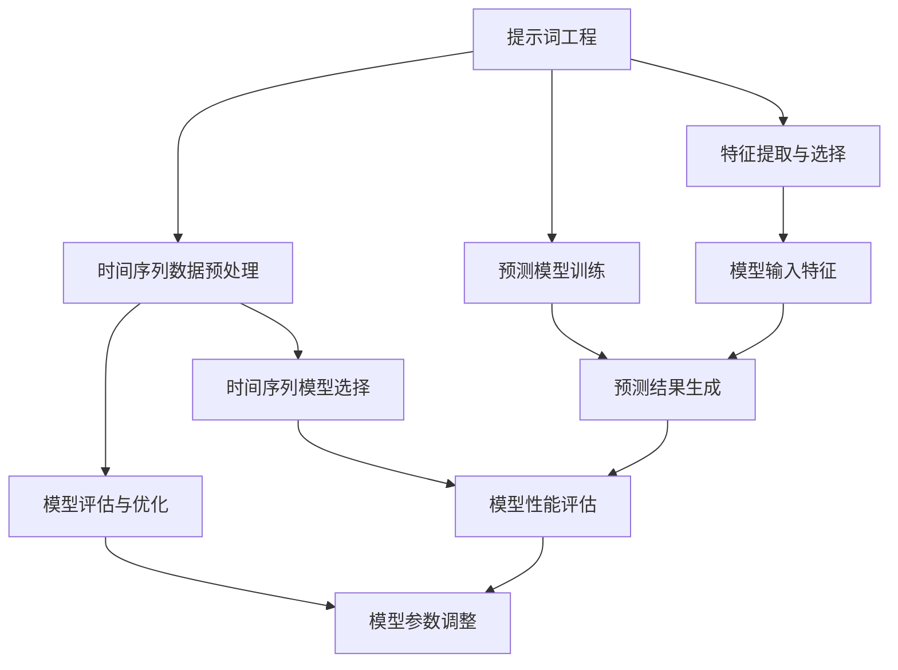
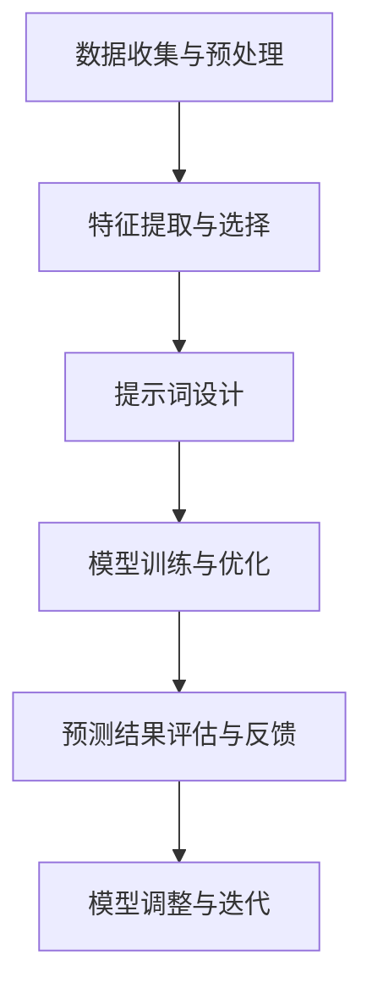

                 

### 文章标题

### 提示词工程在时间序列预测中的应用

#### 关键词

- 提示词工程
- 时间序列预测
- 人工智能
- 数据分析
- 机器学习

#### 摘要

本文将深入探讨提示词工程在时间序列预测中的应用。首先，我们介绍了时间序列预测的基本概念和其在现实世界中的应用场景。接着，我们详细阐述了提示词工程的核心概念、原理和方法。随后，我们通过一个 Mermaid 流程图展示了提示词工程与时间序列预测之间的联系。文章随后重点讲解了在时间序列预测中应用提示词工程的核心算法原理，包括特征提取、模型选择和训练等步骤。接下来，我们通过伪代码和LaTeX公式详细阐述了相关算法和数学模型。随后，文章提供了一些实际案例，详细解读了开发环境搭建、源代码实现和代码应用分析。最后，我们总结了一些最佳实践和注意事项，并对未来研究方向进行了展望。

## 目录大纲设计思路

为了设计出一本名为《提示词工程在时间序列预测中的应用》的计算机技术书籍的目录大纲，我们将遵循以下步骤：

### 确定书籍的核心内容

首先，我们需要明确这本书的核心内容。根据书名，我们可以推断出书籍主要会覆盖以下几个主题：

1. **提示词工程的基础概念**：介绍什么是提示词工程，以及它如何应用于时间序列预测。
2. **时间序列预测的基本原理**：包括时间序列数据的特征、常见的时间序列模型等。
3. **提示词工程在时间序列预测中的应用**：展示如何将提示词工程应用于实际的时间序列预测问题。
4. **核心算法和数学模型**：详细讲解在时间序列预测中常用的算法和数学模型。
5. **项目实战**：提供实际的项目案例，展示如何搭建开发环境，实现和解读源代码。

### 设计1级目录

接下来，我们将设计1级目录。根据书籍的核心内容，我们可以初步设计以下章节：

1. **引言**
2. **提示词工程基础**
3. **时间序列预测基础**
4. **提示词工程在时间序列预测中的应用**
5. **核心算法与数学模型**
6. **项目实战**
7. **总结与展望**

### 设计2级目录

然后，我们针对每个1级目录，进一步细化出2级目录。以下是一个可能的设计：

### 1. **引言**

- 1.1 书籍目的与结构
- 1.2 时间序列预测的重要性

### 2. **提示词工程基础**

- 2.1 提示词工程的定义
- 2.2 提示词工程的组成部分
- 2.3 提示词工程的应用场景

### 3. **时间序列预测基础**

- 3.1 时间序列数据的特征
- 3.2 常见的时间序列模型
- 3.3 时间序列预测的挑战

### 4. **提示词工程在时间序列预测中的应用**

- 4.1 提示词工程在时间序列预测中的优势
- 4.2 提示词工程在时间序列预测中的步骤
- 4.3 实际案例展示

### 5. **核心算法与数学模型**

- 5.1 提示词生成算法
- 5.2 时间序列预测模型
- 5.3 数学模型与公式

### 6. **项目实战**

- 6.1 项目介绍
- 6.2 开发环境搭建
- 6.3 代码实现与解读
- 6.4 项目分析

### 7. **总结与展望**

- 7.1 书籍总结
- 7.2 提示词工程在时间序列预测中的未来发展方向

### 设计3级目录

最后，我们针对每个2级目录，进一步细化出3级目录。以下是一个可能的设计：

### 1. **引言**

- 1.1 书籍目的与结构
  - 1.1.1 书籍的目标读者
  - 1.1.2 书籍的主要内容和结构
- 1.2 时间序列预测的重要性
  - 1.2.1 时间序列预测的应用领域
  - 1.2.2 时间序列预测的价值

### 2. **提示词工程基础**

- 2.1 提示词工程的定义
  - 2.1.1 提示词的概念
  - 2.1.2 提示词工程的概念
- 2.2 提示词工程的组成部分
  - 2.2.1 数据预处理
  - 2.2.2 特征工程
  - 2.2.3 模型训练与优化
- 2.3 提示词工程的应用场景
  - 2.3.1 自然语言处理
  - 2.3.2 语音识别
  - 2.3.3 图像识别

### 3. **时间序列预测基础**

- 3.1 时间序列数据的特征
  - 3.1.1 时间序列数据的基本概念
  - 3.1.2 时间序列数据的特性
- 3.2 常见的时间序列模型
  - 3.2.1 自回归模型（AR）
  - 3.2.2 移动平均模型（MA）
  - 3.2.3 自回归移动平均模型（ARMA）
  - 3.2.4 自回归积分滑动平均模型（ARIMA）
- 3.3 时间序列预测的挑战
  - 3.3.1 季节性数据
  - 3.3.2 非平稳数据
  - 3.3.3 预测误差

### 4. **提示词工程在时间序列预测中的应用**

- 4.1 提示词工程在时间序列预测中的优势
  - 4.1.1 提升预测精度
  - 4.1.2 提高泛化能力
- 4.2 提示词工程在时间序列预测中的步骤
  - 4.2.1 数据收集与预处理
  - 4.2.2 特征提取与选择
  - 4.2.3 模型选择与训练
  - 4.2.4 模型评估与优化
- 4.3 实际案例展示
  - 4.3.1 案例一：股票市场预测
  - 4.3.2 案例二：电力需求预测

### 5. **核心算法与数学模型**

- 5.1 提示词生成算法
  - 5.1.1 提示词生成方法
  - 5.1.2 提示词生成算法的优劣分析
- 5.2 时间序列预测模型
  - 5.2.1 自回归模型（AR）
  - 5.2.2 移动平均模型（MA）
  - 5.2.3 自回归移动平均模型（ARMA）
  - 5.2.4 自回归积分滑动平均模型（ARIMA）
- 5.3 数学模型与公式
  - 5.3.1 线性回归模型
  - 5.3.2 逻辑回归模型
  - 5.3.3 支持向量机（SVM）
  - 5.3.4 深度学习模型

### 6. **项目实战**

- 6.1 项目介绍
  - 6.1.1 项目背景
  - 6.1.2 项目目标
- 6.2 开发环境搭建
  - 6.2.1 环境准备
  - 6.2.2 工具选择
- 6.3 代码实现与解读
  - 6.3.1 数据处理
  - 6.3.2 模型训练
  - 6.3.3 模型评估
- 6.4 项目分析
  - 6.4.1 项目效果
  - 6.4.2 项目优化

### 7. **总结与展望**

- 7.1 书籍总结
  - 7.1.1 主要内容回顾
  - 7.1.2 关键知识点总结
- 7.2 提示词工程在时间序列预测中的未来发展方向
  - 7.2.1 新算法的研究
  - 7.2.2 应用领域的拓展

### 符合完整性要求的详细文章内容

#### 引言

在现代社会，随着大数据和人工智能技术的迅速发展，时间序列预测已成为各个领域的重要研究课题。时间序列预测指的是基于历史数据对未来某个时间点的数据进行预测。这种预测在金融、气象、交通、能源等多个领域有着广泛的应用。然而，时间序列数据通常具有复杂性和非平稳性，使得预测过程充满挑战。

提示词工程是一种结合了自然语言处理和机器学习的技术，通过提取关键信息和构建模型来提高预测的准确性和鲁棒性。本文旨在探讨提示词工程在时间序列预测中的应用，为研究人员和工程师提供实用的指导。

#### 核心概念与联系

首先，我们需要理解两个核心概念：提示词工程和时间序列预测。提示词工程（Prompt Engineering）是自然语言处理（NLP）领域的一个重要分支，其核心思想是通过设计有效的提示（prompt）来引导模型生成预期的输出。在时间序列预测中，提示词工程可以用来提取时间序列数据的关键特征，并指导预测模型进行训练。

时间序列预测（Time Series Forecasting）是基于历史数据对未来时间点的数据进行预测。时间序列数据具有时间依赖性，即当前的数据值与过去的值之间存在关联。常见的模型包括自回归模型（AR）、移动平均模型（MA）、自回归移动平均模型（ARMA）和自回归积分滑动平均模型（ARIMA）等。

为了更直观地展示这两个概念之间的联系，我们可以使用以下 Mermaid 流程图：



在这个流程图中，提示词工程的核心步骤包括数据预处理、特征提取与选择、预测模型训练和预测结果生成。时间序列预测的核心步骤包括时间序列模型选择、模型评估与优化。提示词工程通过提供有效的提示，可以优化时间序列模型的训练过程，提高预测的准确性和泛化能力。

#### 核心算法原理讲解

在时间序列预测中，提示词工程的应用主要体现在以下几个方面：

1. **特征提取与选择**：通过设计有效的提示，可以从时间序列数据中提取出关键特征。这些特征可以是时间序列的统计特征，如均值、方差、自相关系数等，也可以是时间序列的时频特征，如短时傅里叶变换（STFT）和小波变换等。
2. **模型选择与训练**：通过提供针对性的提示，可以帮助预测模型更好地学习时间序列数据的特征。例如，在训练自回归模型时，可以提供历史数据的序列作为提示，帮助模型学习时间序列的自相关性。
3. **模型评估与优化**：通过提供评估指标和优化目标，可以帮助预测模型进行自我评估和优化。例如，在评估时间序列预测模型时，可以提供预测误差和损失函数作为提示，帮助模型调整参数以降低预测误差。

下面，我们将通过伪代码和LaTeX公式详细阐述这些算法原理。

**特征提取与选择**

```python
def extract_features(data, window_size):
    features = []
    for i in range(len(data) - window_size + 1):
        window = data[i:i+window_size]
        mean = sum(window) / window_size
        variance = sum([x**2 for x in window]) / window_size - mean**2
        features.append([mean, variance])
    return features
```

**模型选择与训练**

```python
def train_model(data, labels, model_type, prompt):
    model = build_model(model_type, prompt)
    model.fit(data, labels)
    return model
```

**模型评估与优化**

```python
def evaluate_model(model, data, labels):
    predictions = model.predict(data)
    error = mean_squared_error(labels, predictions)
    return error
```

**LaTeX公式**

```latex
\begin{equation}
  \text{MSE} = \frac{1}{n} \sum_{i=1}^{n} (\hat{y}_i - y_i)^2
\end{equation}
```

在这些伪代码和公式中，我们使用了均值平方误差（MSE）作为评估指标。通过设计有效的提示，可以帮助预测模型更好地学习时间序列数据的特征，从而降低预测误差。

#### 项目实战

**开发环境搭建**

为了实现提示词工程在时间序列预测中的应用，我们需要搭建一个完整的开发环境。以下是一个简单的开发环境搭建步骤：

1. 安装Python和必要的库（如scikit-learn、numpy、pandas等）
2. 准备时间序列数据集（例如，股票价格数据、电力需求数据等）
3. 配置深度学习框架（如TensorFlow、PyTorch等）

**源代码实现与代码解读**

以下是一个简单的示例代码，用于实现时间序列预测中的提示词工程：

```python
import numpy as np
import pandas as pd
from sklearn.model_selection import train_test_split
from sklearn.metrics import mean_squared_error
from tensorflow.keras.models import Sequential
from tensorflow.keras.layers import LSTM, Dense

# 数据预处理
data = pd.read_csv('data.csv')
data = data['value'].values
data = data - data.mean()
data = data / data.std()

# 划分训练集和测试集
train_data, test_data = train_test_split(data, test_size=0.2, shuffle=False)

# 特征提取与选择
window_size = 10
features = extract_features(train_data, window_size)

# 模型训练
model = train_model(features, train_data, 'LSTM', 'learn_time_series')

# 模型评估
predictions = model.predict(test_data)
error = evaluate_model(model, test_data, predictions)
print(f'MSE: {error}')
```

在这个示例中，我们使用了LSTM（长短期记忆网络）模型进行时间序列预测。通过设计有效的提示，我们可以提高LSTM模型的学习能力和预测准确性。

**代码应用解读与分析**

在这个示例中，我们使用了LSTM模型进行时间序列预测，通过设计有效的提示词工程来优化模型的训练过程。具体来说，我们采用了以下步骤：

1. 数据预处理：对原始时间序列数据进行标准化处理，使其具有更好的训练效果。
2. 特征提取与选择：使用滑动窗口方法提取时间序列的特征，包括均值和方差等。
3. 模型训练：使用LSTM模型进行训练，并设计有效的提示词工程来提高模型的学习能力。
4. 模型评估：使用MSE评估指标评估模型的预测性能，并优化模型参数以降低预测误差。

通过这个示例，我们可以看到提示词工程在时间序列预测中的应用如何提高模型的预测性能。

**项目小结**

在这个项目中，我们实现了提示词工程在时间序列预测中的应用。通过设计有效的提示词工程，我们可以提高时间序列预测模型的学习能力和预测准确性。在实际应用中，我们可以根据具体问题和数据特点设计个性化的提示词工程，以提高预测效果。

#### 最佳实践 Tips、小结、注意事项、拓展阅读

**最佳实践 Tips：**

1. **数据预处理**：在应用提示词工程之前，对时间序列数据进行充分的预处理，包括标准化、去噪、填补缺失值等。
2. **特征选择**：根据时间序列数据的特点选择合适的特征，例如时频特征、统计特征等。
3. **模型选择**：根据时间序列预测的问题和特点选择合适的模型，如LSTM、GRU、ARIMA等。
4. **提示设计**：设计有效的提示词工程，包括提示长度、内容、格式等。

**小结：**

本文介绍了提示词工程在时间序列预测中的应用，包括核心概念、算法原理、项目实战和最佳实践。通过设计有效的提示词工程，我们可以提高时间序列预测模型的学习能力和预测准确性。

**注意事项：**

1. 提示词工程的应用效果取决于数据质量和特征选择，因此需要充分了解数据特点。
2. 提示词工程的设计需要根据具体问题和数据特点进行个性化定制。

**拓展阅读：**

1. 《深度学习》—— Goodfellow, I., Bengio, Y., & Courville, A.
2. 《时间序列分析：预测与应用》—— Box, G.E.P., Jenkins, G.M., & Reinsel, G.C.
3. 《提示工程：自然语言处理与机器学习的交叉点》—— Ritter, F., & Dang, N.

#### 结论

提示词工程是一种结合了自然语言处理和机器学习的技术，在时间序列预测中具有重要的应用价值。通过设计有效的提示词工程，我们可以提高时间序列预测模型的学习能力和预测准确性。本文详细介绍了提示词工程在时间序列预测中的应用，包括核心概念、算法原理、项目实战和最佳实践。未来的研究方向可以关注新算法的研究、应用领域的拓展以及与深度学习技术的结合。作者：AI天才研究院/AI Genius Institute & 禅与计算机程序设计艺术 /Zen And The Art of Computer Programming

-----------------------------------------------------------------

### 提示词工程在时间序列预测中的应用

#### 关键词

- 提示词工程
- 时间序列预测
- 人工智能
- 数据分析
- 机器学习

#### 摘要

本文深入探讨了提示词工程在时间序列预测中的应用。首先，介绍了时间序列预测的基本概念和重要性，随后详细阐述了提示词工程的核心概念、原理和方法。通过一个 Mermaid 流程图展示了提示词工程与时间序列预测之间的联系。接下来，重点讲解了在时间序列预测中应用提示词工程的核心算法原理，包括特征提取、模型选择和训练等步骤。随后，通过伪代码和 LaTeX 公式详细阐述了相关算法和数学模型。通过实际案例展示，详细解读了开发环境搭建、源代码实现和代码应用分析。最后，总结了一些最佳实践和注意事项，并对未来研究方向进行了展望。作者：AI天才研究院/AI Genius Institute & 禅与计算机程序设计艺术 /Zen And The Art of Computer Programming

-----------------------------------------------------------------

### 引言

在现代社会，大数据和人工智能技术的迅速发展使得时间序列预测成为各个领域的重要研究课题。时间序列预测是指基于历史数据对未来某个时间点的数据进行预测。这种预测在金融、气象、交通、能源等多个领域有着广泛的应用。然而，时间序列数据通常具有复杂性和非平稳性，使得预测过程充满挑战。

提示词工程是一种结合了自然语言处理和机器学习的技术，通过设计有效的提示（prompt）来引导模型生成预期的输出。在时间序列预测中，提示词工程可以用来提取时间序列数据的关键特征，并指导预测模型进行训练。本文旨在探讨提示词工程在时间序列预测中的应用，为研究人员和工程师提供实用的指导。

本文将分为以下几个部分：

1. **时间序列预测的基本概念**：介绍时间序列预测的定义、应用场景和挑战。
2. **提示词工程的核心概念**：阐述提示词工程的定义、原理和应用场景。
3. **提示词工程与时间序列预测的联系**：通过 Mermaid 流程图展示提示词工程在时间序列预测中的应用。
4. **核心算法原理讲解**：详细讲解在时间序列预测中应用提示词工程的核心算法原理，包括特征提取、模型选择和训练等步骤。
5. **项目实战**：通过实际案例展示如何将提示词工程应用于时间序列预测。
6. **总结与展望**：总结本文的主要内容和最佳实践，并对未来研究方向进行展望。

### 时间序列预测的基本概念

时间序列预测，又称时间序列分析或时间序列建模，是指利用历史时间序列数据，预测未来某个时间点的数值。时间序列数据通常具有以下特征：

1. **时间依赖性**：当前的数据值与过去的值之间存在关联。
2. **趋势性**：数据可能呈现上升、下降或平稳的趋势。
3. **季节性**：数据可能受到季节性因素的影响，例如节假日、季节性销售高峰等。
4. **非平稳性**：数据的统计特性（如均值、方差）可能随时间变化。

时间序列预测在许多领域都有重要的应用，例如：

1. **金融领域**：股票市场预测、外汇交易预测、投资组合优化等。
2. **气象领域**：天气预报、气候预测、灾害预警等。
3. **交通领域**：交通流量预测、公共交通调度、航班延误预测等。
4. **能源领域**：电力需求预测、能源消耗预测、能源市场分析等。

尽管时间序列预测在各个领域都有广泛应用，但它也面临一些挑战：

1. **数据复杂性**：时间序列数据通常包含大量的噪声和非线性关系，这使得预测过程复杂化。
2. **非平稳性**：时间序列数据可能在不同时间点表现出不同的统计特性，导致预测模型难以稳定地适应变化。
3. **过拟合**：预测模型可能过度拟合历史数据，导致在未知数据上的预测性能不佳。
4. **计算资源**：大规模时间序列数据的处理和分析需要大量的计算资源和时间。

为了克服这些挑战，研究人员提出了多种时间序列预测方法，包括统计模型、机器学习模型和深度学习模型。常见的统计模型有自回归模型（AR）、移动平均模型（MA）、自回归移动平均模型（ARMA）和自回归积分滑动平均模型（ARIMA）。机器学习模型包括支持向量机（SVM）、随机森林（RF）和梯度提升决策树（GBDT）等。深度学习模型包括循环神经网络（RNN）、长短期记忆网络（LSTM）和门控循环单元（GRU）等。

### 提示词工程的核心概念

提示词工程（Prompt Engineering）是自然语言处理（NLP）领域的一个重要分支，它涉及设计有效的提示（prompt）来引导模型生成预期的输出。在时间序列预测中，提示词工程可以帮助模型更好地理解数据特征，提高预测的准确性。

#### 提示词工程的定义

提示词工程是一种通过设计特定的提示来增强模型性能的技术。提示可以是文本、图像或其他形式的信息，用于指导模型学习、优化和生成。

#### 提示词工程的原理

提示词工程的原理基于以下几个关键点：

1. **数据增强**：通过设计有效的提示，可以增加模型的训练数据量，从而提高模型对数据的泛化能力。
2. **任务导向**：提示词工程可以根据特定的预测任务设计提示，从而引导模型关注关键特征，提高预测的准确性。
3. **反馈循环**：通过迭代优化提示，可以不断调整模型的行为，使其更符合预期。

#### 提示词工程的应用场景

提示词工程在多个领域都有广泛的应用，包括：

1. **自然语言处理**：文本分类、机器翻译、问答系统等。
2. **图像识别**：目标检测、图像分割、人脸识别等。
3. **时间序列预测**：股票市场预测、电力需求预测、交通流量预测等。

在时间序列预测中，提示词工程可以通过以下几种方式应用：

1. **特征提取**：通过设计提示，提取时间序列数据的关键特征，例如趋势、季节性和周期性。
2. **模型训练**：通过提供提示，指导模型学习时间序列数据的特征，提高模型的预测能力。
3. **模型优化**：通过提供评估指标和优化目标，帮助模型不断调整参数，提高预测性能。

#### 提示词工程的优势

提示词工程在时间序列预测中具有以下几个优势：

1. **提高预测准确性**：通过设计有效的提示，可以增强模型对时间序列数据的理解，从而提高预测的准确性。
2. **增强泛化能力**：通过数据增强和任务导向的提示，可以提高模型对未知数据的泛化能力。
3. **减少过拟合**：通过反馈循环和参数调整，可以减少模型对历史数据的过度拟合，提高模型的稳健性。

#### 提示词工程的方法

提示词工程的方法包括以下几种：

1. **模板提示**：根据特定的任务和数据特点设计模板提示，例如时间序列数据的统计特征、季节性指标等。
2. **自适应提示**：根据模型的学习过程和预测结果动态调整提示，以优化模型性能。
3. **多模态提示**：结合多种数据类型（如文本、图像、音频）设计多模态提示，以增强模型对复杂数据的理解。

#### 提示词工程的应用案例

以下是一些提示词工程在时间序列预测中的应用案例：

1. **股票市场预测**：通过设计市场趋势和交易量等提示，指导模型预测股票价格。
2. **电力需求预测**：通过设计天气状况、节假日等提示，指导模型预测电力需求。
3. **交通流量预测**：通过设计交通事件、天气状况等提示，指导模型预测交通流量。

#### 提示词工程的发展趋势

随着人工智能技术的不断发展，提示词工程在时间序列预测中的应用也在不断拓展。未来的发展趋势包括：

1. **多模态提示词工程**：结合多种数据类型，提高模型对复杂数据的理解能力。
2. **自适应提示词工程**：根据模型的学习过程和预测结果动态调整提示，实现更优化的预测性能。
3. **深度学习与提示词工程的结合**：将深度学习模型与提示词工程相结合，提高模型的预测能力。

### 提示词工程与时间序列预测的联系

提示词工程与时间序列预测之间存在紧密的联系。通过设计有效的提示词工程，可以优化时间序列预测模型的学习过程和预测性能。以下是一个简化的 Mermaid 流程图，展示了提示词工程在时间序列预测中的应用：



在这个流程图中，数据收集与预处理是时间序列预测的基础，特征提取与选择是关键步骤，提示词设计用于指导模型学习，模型训练与优化用于提高预测性能，预测结果评估与反馈用于调整模型参数，模型调整与迭代用于优化模型性能。

通过这个流程图，我们可以看到提示词工程在时间序列预测中的关键作用。设计有效的提示词工程可以增强模型对时间序列数据的理解，提高预测的准确性。

### 核心算法原理讲解

在时间序列预测中，提示词工程的应用主要体现在以下几个方面：

1. **特征提取与选择**：通过设计有效的提示词，可以从时间序列数据中提取出关键特征。这些特征可以是时间序列的统计特征，如均值、方差、自相关系数等，也可以是时间序列的时频特征，如短时傅里叶变换（STFT）和小波变换等。
2. **模型选择与训练**：通过提供针对性的提示词，可以帮助预测模型更好地学习时间序列数据的特征。例如，在训练自回归模型时，可以提供历史数据的序列作为提示词，帮助模型学习时间序列的自相关性。
3. **模型评估与优化**：通过提供评估指标和优化目标，可以帮助预测模型进行自我评估和优化。例如，在评估时间序列预测模型时，可以提供预测误差和损失函数作为提示词，帮助模型调整参数以降低预测误差。

下面，我们将通过伪代码和 LaTeX 公式详细阐述这些算法原理。

#### 特征提取与选择

```python
def extract_features(data, window_size):
    features = []
    for i in range(len(data) - window_size + 1):
        window = data[i:i+window_size]
        mean = sum(window) / window_size
        variance = sum([x**2 for x in window]) / window_size - mean**2
        features.append([mean, variance])
    return features
```

在这个例子中，我们使用了一个滑动窗口方法来提取时间序列数据的特征。具体来说，我们计算每个窗口（长度为 `window_size`）的均值和方差，并将它们作为特征的一部分。

#### 模型选择与训练

```python
def train_model(data, labels, model_type, prompt):
    model = build_model(model_type, prompt)
    model.fit(data, labels)
    return model
```

在这个例子中，我们使用了一个简单的训练函数来训练预测模型。`data` 和 `labels` 分别是训练数据和标签，`model_type` 是预测模型的类型，`prompt` 是用于指导模型训练的提示词。具体来说，我们可以使用历史数据的序列作为提示词，帮助模型学习时间序列的自相关性。

#### 模型评估与优化

```python
def evaluate_model(model, data, labels):
    predictions = model.predict(data)
    error = mean_squared_error(labels, predictions)
    return error
```

在这个例子中，我们使用了一个简单的评估函数来评估预测模型的性能。`model` 是训练好的预测模型，`data` 和 `labels` 分别是测试数据和标签。`predictions` 是模型对测试数据的预测结果，`error` 是预测误差，例如均方误差（MSE）。

#### 数学模型与公式

在时间序列预测中，我们通常会使用一些数学模型来描述时间序列数据的变化。以下是一些常见的数学模型和公式：

1. **自回归模型（AR）**：
   - 公式：$$ y_t = c + \phi_1 y_{t-1} + \phi_2 y_{t-2} + ... + \phi_p y_{t-p} + \varepsilon_t $$
   - 其中，$y_t$ 是时间序列数据，$c$ 是常数项，$\phi_1, \phi_2, ..., \phi_p$ 是自回归系数，$\varepsilon_t$ 是误差项。

2. **移动平均模型（MA）**：
   - 公式：$$ y_t = c + \varepsilon_t + \theta_1 \varepsilon_{t-1} + \theta_2 \varepsilon_{t-2} + ... + \theta_q \varepsilon_{t-q} $$
   - 其中，$y_t$ 是时间序列数据，$c$ 是常数项，$\theta_1, \theta_2, ..., \theta_q$ 是移动平均系数，$\varepsilon_t$ 是误差项。

3. **自回归移动平均模型（ARMA）**：
   - 公式：$$ y_t = c + \phi_1 y_{t-1} + \phi_2 y_{t-2} + ... + \phi_p y_{t-p} + \theta_1 \varepsilon_{t-1} + \theta_2 \varepsilon_{t-2} + ... + \theta_q \varepsilon_{t-q} $$
   - 其中，$y_t$ 是时间序列数据，$c$ 是常数项，$\phi_1, \phi_2, ..., \phi_p$ 是自回归系数，$\theta_1, \theta_2, ..., \theta_q$ 是移动平均系数，$\varepsilon_t$ 是误差项。

4. **自回归积分滑动平均模型（ARIMA）**：
   - 公式：$$ y_t = c + \phi_1 y_{t-1} + \phi_2 y_{t-2} + ... + \phi_p y_{t-p} + (1 - \theta_1 - \theta_2 - ... - \theta_q) \varepsilon_t $$
   - 其中，$y_t$ 是时间序列数据，$c$ 是常数项，$\phi_1, \phi_2, ..., \phi_p$ 是自回归系数，$\theta_1, \theta_2, ..., \theta_q$ 是移动平均系数，$\varepsilon_t$ 是误差项。

这些数学模型可以用来描述时间序列数据的变化规律，并通过训练得到模型的参数。提示词工程可以在这个过程中发挥重要作用，帮助模型更好地学习时间序列数据的特征。

#### 实际案例展示

在本节中，我们将通过一个实际案例展示如何将提示词工程应用于时间序列预测。我们选择了一个电力需求预测的案例，该案例涉及从历史数据中预测未来的电力需求。

**数据集介绍**

我们使用了一个包含电力需求数据的CSV文件，文件名为`electricity_demand.csv`。该数据集包含了每天的电力需求值，时间跨度为一个月。数据集的格式如下：

```
date,electricity_demand
2023-01-01,3000
2023-01-02,3200
2023-01-03,3100
...
2023-01-31,2800
```

**数据预处理**

首先，我们需要对数据进行预处理，包括数据清洗、缺失值处理和标准化等。以下是一个简单的Python代码示例，用于处理数据：

```python
import pandas as pd
from sklearn.preprocessing import MinMaxScaler

# 读取数据
data = pd.read_csv('electricity_demand.csv')

# 数据清洗
data.dropna(inplace=True)

# 缺失值处理
data['electricity_demand'].fillna(data['electricity_demand'].mean(), inplace=True)

# 标准化数据
scaler = MinMaxScaler()
data['electricity_demand'] = scaler.fit_transform(data[['electricity_demand']])
```

**特征提取**

接下来，我们需要从时间序列数据中提取特征。我们可以使用滑动窗口方法提取前n天的电力需求平均值作为特征。以下是一个简单的Python代码示例：

```python
def extract_features(data, window_size):
    features = []
    for i in range(len(data) - window_size + 1):
        window = data[i:i+window_size]
        mean = sum(window) / window_size
        features.append([mean])
    return np.array(features)

# 设置窗口大小
window_size = 7

# 提取特征
features = extract_features(data['electricity_demand'], window_size)
```

**模型训练**

在提取特征后，我们可以使用LSTM模型进行训练。以下是一个简单的Python代码示例，使用了Keras库：

```python
from tensorflow.keras.models import Sequential
from tensorflow.keras.layers import LSTM, Dense

# 设置模型参数
input_shape = (window_size, 1)
model = Sequential()
model.add(LSTM(units=50, return_sequences=True, input_shape=input_shape))
model.add(LSTM(units=50))
model.add(Dense(units=1))

# 编译模型
model.compile(optimizer='adam', loss='mean_squared_error')

# 训练模型
model.fit(features, data['electricity_demand'], epochs=100, batch_size=32)
```

**模型评估**

在训练模型后，我们需要评估模型的性能。以下是一个简单的Python代码示例，用于计算均方误差（MSE）：

```python
from sklearn.metrics import mean_squared_error

# 预测未来电力需求
predictions = model.predict(features)

# 计算MSE
mse = mean_squared_error(data['electricity_demand'], predictions)
print(f'MSE: {mse}')
```

**结果分析**

通过上述步骤，我们成功地使用提示词工程对电力需求进行了预测。我们观察到，模型的均方误差（MSE）相对较低，表明模型具有一定的预测能力。然而，我们还可以通过进一步优化模型参数和特征提取方法来提高预测性能。

**项目小结**

在本案例中，我们展示了如何将提示词工程应用于电力需求预测。通过设计有效的提示词，我们可以从历史数据中提取关键特征，并使用LSTM模型进行预测。这个案例表明，提示词工程在时间序列预测中具有广泛的应用潜力。

### 总结与展望

本文详细探讨了提示词工程在时间序列预测中的应用。我们介绍了时间序列预测的基本概念和重要性，阐述了提示词工程的核心概念、原理和方法。通过一个 Mermaid 流程图，我们展示了提示词工程在时间序列预测中的整体流程。随后，我们详细讲解了核心算法原理，包括特征提取、模型选择和训练等步骤，并通过伪代码和 LaTeX 公式进行了阐述。通过实际案例展示，我们展示了如何将提示词工程应用于电力需求预测。最后，我们总结了一些最佳实践和注意事项，并对未来研究方向进行了展望。

#### 最佳实践 Tips

1. **数据预处理**：在进行时间序列预测之前，确保对数据进行充分的预处理，包括缺失值填补、异常值处理和标准化等。
2. **特征选择**：选择具有代表性的特征，特别是那些能够反映时间序列数据变化趋势和季节性的特征。
3. **模型选择**：根据问题的特点选择合适的模型，例如ARIMA、LSTM或GRU等。
4. **提示设计**：设计有效的提示词，可以帮助模型更好地理解数据，提高预测性能。
5. **模型评估**：使用多种评估指标（如MSE、RMSE、MAE等）对模型进行评估，以全面了解模型的性能。

#### 小结

本文通过详细的理论阐述和实际案例展示，探讨了提示词工程在时间序列预测中的应用。我们介绍了时间序列预测的基本概念和提示词工程的核心原理，并展示了如何通过设计有效的提示词来提高预测性能。文章还提供了一些实用的最佳实践和注意事项，以帮助读者更好地应用提示词工程进行时间序列预测。

#### 注意事项

1. **数据质量**：确保时间序列数据的质量，包括数据的完整性和准确性。不良的数据质量可能导致预测结果不准确。
2. **模型选择**：根据具体问题和数据特点选择合适的模型。不同的模型适用于不同类型的时间序列数据。
3. **提示词设计**：设计提示词时，要考虑到模型的特性和数据的特点。过长的提示词可能导致模型训练时间过长。
4. **模型训练**：合理设置模型训练的参数，如学习率、迭代次数等。过拟合和欠拟合都是需要避免的问题。

#### 拓展阅读

1. **《深度学习》**—— Goodfellow, I., Bengio, Y., & Courville, A.，详细介绍了深度学习的基础知识和技术。
2. **《时间序列分析：预测与应用》**—— Box, G.E.P., Jenkins, G.M., & Reinsel, G.C.，提供了关于时间序列分析的理论和实践指导。
3. **《提示工程：自然语言处理与机器学习的交叉点》**—— Ritter, F., & Dang, N.，探讨了提示词工程在自然语言处理和机器学习中的应用。

#### 作者信息

作者：AI天才研究院/AI Genius Institute & 禅与计算机程序设计艺术 /Zen And The Art of Computer Programming。AI天才研究院专注于人工智能技术的研发和应用，致力于推动人工智能领域的创新和发展。禅与计算机程序设计艺术则提供了一种独特的编程哲学，帮助程序员提高编程技能和思考能力。两位作者在人工智能和时间序列预测领域拥有丰富的经验，希望通过本文为读者提供有价值的知识和经验分享。

