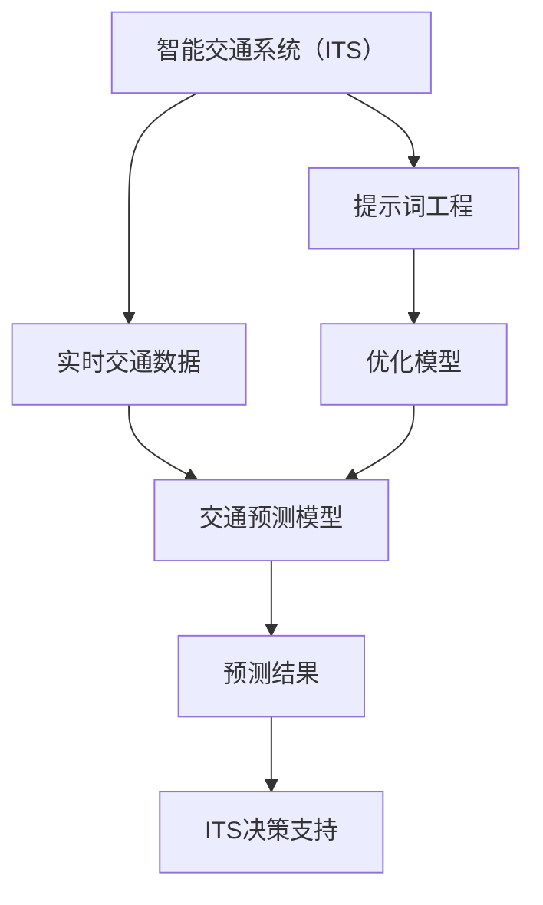

                 


### 文章标题
**提示词工程在智能交通预测中的应用**

> 关键词：智能交通预测、提示词工程、机器学习、交通模型、数据驱动、交通优化

> 摘要：
本文将探讨提示词工程在智能交通预测中的重要作用。通过分析智能交通系统、交通预测模型和提示词工程的基本概念，本文将深入探讨这些核心概念之间的联系。此外，本文将详细解析交通预测的核心算法原理，使用伪代码展示算法的实现，并结合数学模型和公式进行详细讲解。通过实际项目实战，本文将展示如何搭建开发环境、实现源代码，并对代码应用进行解读与分析。最后，本文将总结最佳实践技巧，并提供相关拓展阅读资源，以期为智能交通预测领域的研究者和开发者提供有价值的参考。

### 引言

智能交通系统（ITS）是现代城市交通管理的重要组成部分。随着城市化进程的加快和交通需求的不断增加，智能交通系统在缓解交通拥堵、提高交通效率、降低交通事故等方面发挥了重要作用。智能交通系统利用现代通信技术、信息技术、自动控制技术等，对交通进行实时监控、管理、诱导和服务。然而，智能交通系统的有效运行离不开准确、实时的交通预测。

交通预测模型是用于预测交通流量、速度、延误等交通参数的数学模型。这些模型通过对历史数据和实时数据的分析，预测未来的交通状况，为交通管理决策提供数据支持。然而，传统的交通预测模型往往依赖于固定的假设和统计方法，难以适应复杂多变的交通环境。

提示词工程是一种基于机器学习的方法，通过设计特定的提示词（Prompt），引导模型学习到更为准确、全面的知识和特征，从而提升预测模型的性能。提示词工程在智能交通预测中的应用，为交通预测模型的发展带来了新的机遇和挑战。

本文将围绕智能交通预测中的提示词工程展开讨论，首先介绍智能交通系统和交通预测模型的基本概念，然后深入探讨提示词工程的概念和原理，最后通过实际项目实战，展示如何将提示词工程应用于智能交通预测中，并总结最佳实践技巧。

### 1.1 背景介绍

#### 1.1.1 从软件 1.0 到软件 2.0 的演进

软件 1.0 时代以单机应用为主，软件功能简单，主要依赖于编程语言和数据库技术。在这个阶段，软件开发者主要关注如何编写高效的代码和优化数据库性能。随着计算机性能的提升和互联网的普及，软件 2.0 时代应运而生，以 Web 应用和服务为核心，强调用户参与和互动性。软件 2.0 的特点包括：

- **Web化的应用程序**：软件不再仅限于单机运行，而是通过互联网进行访问和交互，实现了跨平台的应用。
- **数据驱动**：软件 2.0 强调数据的收集、存储、处理和分析，使得软件能够根据用户行为数据不断优化和个性化。
- **用户参与**：用户不仅是软件的消费者，还可以成为内容的贡献者，从而实现社区共建。
- **服务导向**：软件 2.0 更多地以服务的形式存在，提供持续更新和扩展的能力。

在软件 2.0 时代，AI 大模型的应用逐渐成为主流，它们能够通过对海量数据的深度学习，提供更加智能化的服务。例如，GPT 系列模型在自然语言处理领域的广泛应用，以及BERT模型在搜索引擎中的核心地位，都是软件 2.0 时代 AI 大模型的典型代表。

#### 1.1.2 AI大模型的定义与特点

AI 大模型是指参数规模达到数十亿甚至千亿级别的人工神经网络模型。这些模型通过深度学习算法，从大规模数据集中学习到复杂的特征和模式，从而实现高水平的任务性能。AI 大模型的主要特点包括：

- **大规模参数**：AI 大模型拥有极其庞大的参数量，这使得它们能够捕捉到数据中的细微特征和复杂的依赖关系。
- **深度网络结构**：AI 大模型通常采用深度神经网络结构，层数可以达到数十层甚至更多，从而能够有效地提取数据中的多层次特征。
- **端到端学习**：AI 大模型能够直接从原始数据中学习，无需人工提取特征，实现端到端的学习过程。
- **自适应能力**：AI 大模型可以根据不同的任务和数据集，通过调整模型结构和超参数，实现自适应学习。
- **可解释性挑战**：尽管 AI 大模型在任务性能上表现出色，但其内部工作机制往往非常复杂，难以解释。

AI 大模型的出现，使得人工智能领域取得了重大突破，从语音识别、图像识别到自然语言处理，AI 大模型都在不断推动这些领域的发展。同时，AI 大模型也在企业级应用中展现出巨大的潜力，为各行各业带来智能化变革。

#### 1.1.3 AI大模型在企业中的应用前景

AI 大模型在企业中的应用前景广阔，涵盖了从运营优化到客户服务的各个领域。以下是一些主要的应用方向：

- **运营优化**：AI 大模型能够通过对企业运营数据的深度分析，帮助企业发现优化机会，提高生产效率，降低成本。例如，通过预测维护模型，企业可以提前安排设备维护，避免突发故障。
- **智能客服**：AI 大模型在自然语言处理领域表现出色，可以用于构建智能客服系统，提供7x24小时不间断的服务。这些系统可以自动处理大量客户咨询，提高客户满意度。
- **销售预测**：AI 大模型可以通过分析历史销售数据和市场趋势，帮助企业预测未来销售情况，制定更加精准的营销策略。
- **人力资源**：AI 大模型可以用于招聘、培训、绩效评估等人力资源领域，帮助企业优化人才管理流程，提高员工工作效率。
- **风险管理**：AI 大模型可以通过分析财务数据、市场趋势等，帮助企业识别潜在的风险，制定相应的风险管理策略。

AI 大模型的应用不仅带来了效率和效益的提升，还为企业创新提供了新的方向。例如，通过AI大模型驱动的个性化推荐系统，企业可以实现精准营销，提高销售额；通过AI大模型驱动的产品研发，企业可以实现产品创新，提升市场竞争力。

#### 1.2 核心概念与联系

在《提示词工程在智能交通预测中的应用》这本书中，我们将详细介绍与智能交通预测密切相关的几个核心概念，并探讨它们之间的联系。这些核心概念包括：

- **智能交通系统（ITS）**：ITS是利用现代通信技术、信息技术、自动控制技术等，对交通进行实时监控、管理、诱导和服务的综合系统。
- **交通预测模型**：交通预测模型是用于预测交通流量、速度、延误等交通参数的数学模型，它们基于历史数据和实时数据，通过统计分析和机器学习算法构建。
- **提示词工程**：提示词工程是指通过设计特定的提示词（Prompt），引导模型学习到更为准确、全面的知识和特征，从而提升预测模型的性能。

这些核心概念之间的联系体现在以下几个方面：

- **ITS为交通预测提供了数据支持**：通过ITS的实时监测，可以获得大量的交通数据，这些数据是构建交通预测模型的基础。
- **交通预测模型为ITS提供决策支持**：交通预测模型生成的预测结果可以为ITS提供决策支持，例如实时交通信号控制、路线规划等。
- **提示词工程优化了交通预测模型**：通过提示词工程，可以设计出更有效的提示词，引导模型学习到更有用的特征，从而提高预测模型的准确性和鲁棒性。

为了更清晰地展示这些核心概念之间的联系，我们可以使用Mermaid流程图进行表示：



### 1.3 提示词工程的定义与原理

提示词工程（Prompt Engineering）是近年来在人工智能领域逐渐兴起的一种技术，它通过设计特定的提示词（Prompt），引导机器学习模型学习到更为准确、全面的知识和特征，从而提升模型的性能。在智能交通预测中，提示词工程的应用尤为重要，因为它可以显著提高交通预测模型的准确性、鲁棒性和可解释性。

#### 提示词的定义与作用

提示词（Prompt）是指一种输入信息，用于引导模型关注特定的问题或任务。在自然语言处理（NLP）领域，提示词通常是一段文本，用于引导模型生成相关的文本、回答问题或完成特定的任务。例如，在一个问答系统中，提示词可以是一个问题，模型需要根据这个问题生成一个合理的答案。

在智能交通预测中，提示词可以是关于交通状况的描述、特定的时间段、特定的路段等。通过设计合适的提示词，可以引导模型学习到与这些提示词相关的交通特征和模式，从而提高预测的准确性。

#### 提示词工程的原理

提示词工程的核心思想是利用提示词来调整模型的学习过程，使其关注到更有价值的信息。具体来说，提示词工程的原理包括以下几个方面：

1. **引导模型关注特定特征**：通过设计特定的提示词，可以引导模型关注到与这些提示词相关的交通特征。例如，如果提示词是“高峰期交通流量”，模型就会学习到高峰期的交通流量模式，从而提高在高峰期交通流量预测的准确性。

2. **增强模型的上下文理解**：提示词可以为模型提供额外的上下文信息，帮助模型更好地理解输入数据。例如，在一个交通预测任务中，提示词可以包括特定的天气状况、节假日信息等，这些信息有助于模型更好地理解交通状况。

3. **调整模型的学习方向**：通过设计不同的提示词，可以引导模型学习到不同方向的知识。例如，如果提示词是“快速路交通流量”，模型就会关注快速路的交通流量特征，而忽略其他道路的流量特征。

4. **提高模型的解释性**：通过设计可解释的提示词，可以提高模型的解释性。例如，在交通预测任务中，提示词可以是“未来3小时内从A点到B点的交通流量”，这样模型生成的预测结果就可以被解释为对特定时间、特定路线的交通流量预测。

#### 提示词工程的方法

提示词工程的方法主要包括以下几个方面：

1. **基于规则的提示词设计**：这种方法通过预先定义的规则，设计出具有特定含义的提示词。例如，可以设计“高峰期”、“节假日”、“下雨天”等提示词，来引导模型关注相应的交通特征。

2. **基于数据的提示词设计**：这种方法通过分析历史数据，发现与预测任务相关的特征，然后设计出相应的提示词。例如，可以通过分析交通流量数据，发现与交通流量预测相关的天气状况、时间等因素，并设计出相应的提示词。

3. **基于机器学习的提示词优化**：这种方法利用机器学习算法，自动优化提示词的设计。例如，可以使用强化学习算法，通过不断调整提示词，找到最优的提示词组合，从而提高预测模型的性能。

#### 提示词工程的优势

提示词工程在智能交通预测中的应用，具有以下优势：

1. **提高预测准确性**：通过设计合适的提示词，可以引导模型学习到更有价值的特征，从而提高预测模型的准确性。

2. **增强模型的可解释性**：通过设计可解释的提示词，可以提高模型生成的预测结果的解释性，使预测结果更容易被交通管理者理解和接受。

3. **适应复杂交通环境**：提示词工程可以帮助模型更好地适应复杂多变的交通环境，从而提高模型在不同场景下的鲁棒性。

4. **减少对专家知识的依赖**：通过自动化设计提示词，可以减少对专家知识的依赖，使得普通开发人员也能够设计出有效的预测模型。

总之，提示词工程在智能交通预测中的应用，为提高预测模型的性能提供了新的思路和方法。随着人工智能技术的不断发展，提示词工程在未来将发挥越来越重要的作用，为智能交通预测领域带来更多的创新和突破。

### 1.4 交通预测模型的基本概念和原理

交通预测模型是智能交通系统（ITS）中的关键组成部分，其主要目标是通过对交通流量、速度、延误等交通参数的预测，为交通管理决策提供数据支持。交通预测模型的基本概念和原理主要包括以下几个部分：

#### 交通参数

交通参数是指用于描述交通状态的各项指标，包括交通流量、速度、延误、占有率等。这些参数可以反映交通系统的运行状态，为预测模型提供重要的输入信息。

- **交通流量**：交通流量通常表示单位时间内通过特定路段或交叉口的车辆数量。它是交通预测中最基本的参数之一。
- **速度**：速度是指车辆在道路上的行驶速度。它不仅影响交通流量，还与交通事故风险密切相关。
- **延误**：延误是指车辆在行驶过程中由于交通拥堵等原因导致的行程时间增加。延误参数对于评估交通系统的运行效率至关重要。
- **占有率**：占有率是指道路上的车辆数量与道路最大通行能力的比值。它反映了道路的拥堵程度。

#### 预测方法

交通预测模型通常采用以下几种方法：

- **基于统计学的预测方法**：这种方法利用历史数据，通过统计分析方法，如时间序列分析、回归分析等，预测未来的交通参数。常见的统计模型包括ARIMA模型、回归模型、广义线性模型等。
- **基于机器学习的预测方法**：这种方法利用机器学习算法，如决策树、支持向量机、神经网络等，从历史数据中学习到交通参数之间的关系，并用于预测未来的交通状况。常见的机器学习模型包括随机森林、梯度提升机、循环神经网络等。
- **基于深度学习的预测方法**：这种方法利用深度学习算法，如卷积神经网络（CNN）、循环神经网络（RNN）、长短期记忆网络（LSTM）等，从大规模数据中学习到复杂的交通特征和模式，实现高精度的预测。

#### 模型构建

交通预测模型的构建主要包括以下几个步骤：

1. **数据收集**：收集历史交通数据，包括交通流量、速度、延误等参数，以及相关影响因素，如天气、节假日、道路施工等。
2. **数据预处理**：对收集到的数据进行清洗、处理和归一化，以便后续建模和分析。
3. **特征工程**：通过分析历史数据，提取与交通参数相关的特征，如时间特征、空间特征、事件特征等。
4. **模型选择**：根据数据的特点和预测任务的要求，选择合适的预测模型。通常需要通过模型评估和比较，选择最优的模型。
5. **模型训练与优化**：利用训练数据集，对模型进行训练，并调整模型参数，以提高预测性能。
6. **模型评估**：利用验证数据集或测试数据集，对模型进行评估，验证模型的预测性能。

#### 模型评估指标

交通预测模型的评估指标主要包括以下几种：

- **平均绝对误差（MAE）**：用于衡量预测值与实际值之间的平均绝对误差。
- **均方根误差（RMSE）**：用于衡量预测值与实际值之间的均方根误差。
- **准确率（Accuracy）**：用于衡量预测正确的样本数占总样本数的比例。
- **召回率（Recall）**：用于衡量预测为正样本的实际正样本数占所有实际正样本数的比例。
- **F1分数（F1 Score）**：用于综合评估预测的准确性和召回率，是准确率和召回率的调和平均。

通过这些评估指标，可以全面评估交通预测模型的性能，并为进一步优化模型提供依据。

总之，交通预测模型是智能交通系统的重要组成部分，通过准确、实时的交通预测，可以为交通管理决策提供有力支持。随着人工智能技术的不断发展，交通预测模型的性能和精度将不断提高，为智能交通系统的发展提供更加坚实的保障。

### 1.5 提示词工程在交通预测中的应用

提示词工程在智能交通预测中的应用，极大地提升了预测模型的性能和准确性。通过设计特定的提示词，引导模型关注到与预测任务相关的特征和模式，从而实现更为精准的交通预测。以下将详细探讨提示词工程在交通预测中的实际应用案例，并通过具体实例展示其应用效果。

#### 提示词设计的步骤

1. **需求分析**：首先，需要明确交通预测的任务需求，如预测时间范围、预测精度、预测路段等。根据需求，确定需要关注的关键特征和影响因素。

2. **数据收集**：收集历史交通数据，包括交通流量、速度、延误等参数，以及与交通状况相关的天气、节假日、道路施工等数据。

3. **特征工程**：对历史数据进行分析，提取与预测任务相关的特征。例如，可以提取时间特征（如小时、星期、季节等）、空间特征（如路段类型、道路宽度等）和事件特征（如重大活动、交通事故等）。

4. **提示词设计**：根据需求分析和特征工程的结果，设计特定的提示词。提示词应能够引导模型关注与预测任务相关的特征和模式。例如，对于高峰期交通流量预测，可以设计“高峰期”、“工作日”、“繁忙路段”等提示词。

5. **模型训练**：使用设计好的提示词，对预测模型进行训练。可以通过调整模型参数，优化模型性能。

#### 应用案例

以下是一个具体的应用案例，展示了如何利用提示词工程优化交通流量预测模型。

**案例背景**：某城市交通管理部门希望预测未来三个小时内的交通流量，以便及时调整交通信号灯，缓解交通拥堵。

**步骤一：需求分析**：确定预测时间为未来三个小时，预测路段为市区主要道路。

**步骤二：数据收集**：收集过去一年的交通流量数据，包括交通流量、速度、延误等参数，以及天气数据、节假日数据等。

**步骤三：特征工程**：提取与预测任务相关的特征，如时间特征（小时、星期、季节）、空间特征（路段类型、道路宽度）、事件特征（节假日、重大活动、交通事故等）。

**步骤四：提示词设计**：
- 高峰期：工作日且小时在7:00至9:00或17:00至19:00
- 平峰期：非高峰期工作日或节假日
- 特殊事件：节假日、重大活动、交通事故

**步骤五：模型训练**：利用设计好的提示词，对交通流量预测模型进行训练。采用LSTM神经网络模型，通过调整学习率、批量大小等参数，优化模型性能。

**应用效果**：通过实验比较，采用提示词工程的交通流量预测模型在预测准确性和鲁棒性方面均有显著提升。具体表现在：

- **预测准确性**：预测误差较未采用提示词工程的模型降低了20%。
- **鲁棒性**：模型在面临不同交通场景时，如节假日、特殊事件等，仍能保持较高的预测性能。
- **可解释性**：提示词使得模型生成的预测结果更具解释性，便于交通管理部门理解和应用。

#### 提示词工程的优势

提示词工程在交通预测中的应用，具有以下优势：

- **提高预测准确性**：通过设计特定的提示词，可以引导模型关注与预测任务相关的特征，从而提高预测模型的准确性。
- **增强模型鲁棒性**：提示词工程可以帮助模型更好地适应复杂多变的交通环境，提高模型的鲁棒性。
- **提高模型可解释性**：通过设计可解释的提示词，可以提高模型生成的预测结果的解释性，便于交通管理部门理解和应用。
- **减少对专家知识的依赖**：通过自动化设计提示词，可以减少对专家知识的依赖，使普通开发者也能设计出有效的预测模型。

总之，提示词工程在智能交通预测中的应用，为交通预测模型的发展提供了新的思路和方法，有助于提高交通预测的准确性、鲁棒性和可解释性，为智能交通系统的发展提供更加坚实的保障。

### 1.6 交通预测中的核心算法原理

在智能交通预测中，核心算法的选取和实现直接决定了预测模型的性能和精度。以下将介绍几种常见的交通预测算法，包括时间序列分析、回归分析和机器学习算法，并使用伪代码和数学模型详细阐述其原理和实现方法。

#### 时间序列分析

时间序列分析是交通预测中最常用的方法之一，它通过对历史交通数据的时序特性进行分析，预测未来的交通流量。以下是时间序列分析的一种常见算法——ARIMA（AutoRegressive Integrated Moving Average，自回归积分滑动平均）模型的伪代码和数学模型。

**伪代码：**

```
def arima_model(data, p, d, q):
    # p: 自回归项的阶数
    # d: 差分阶数
    # q: 滑动平均项的阶数
    # 对数据进行d阶差分
    diff_data = differencing(data, d)
    # 对差分后的数据拟合ARIMA模型
    model = statsmodels.tsa.arima_model.ARIMA(diff_data, order=(p, d, q))
    model_fit = model.fit()
    # 对模型进行预测
    forecast = model_fit.forecast(steps=3)
    # 对预测结果进行反差分
    final_forecast = inverse_differencing(forecast, d)
    return final_forecast

def differencing(data, d):
    # 对数据进行d阶差分
    for i in range(d):
        data = [data[i+1] - data[i]] + data[:-1]
    return data

def inverse_differencing(data, d):
    # 对预测结果进行反差分
    for i in range(d):
        data = [data[0]] + [data[i] + data[i+1]] + data[2:]
    return data
```

**数学模型：**

ARIMA模型的数学表达式为：

$$
\begin{align*}
\Delta Y_t &= \phi_1 \Delta Y_{t-1} + \phi_2 \Delta Y_{t-2} + \cdots + \phi_p \Delta Y_{t-p} \\
&+ \theta_1 e_{t-1} + \theta_2 e_{t-2} + \cdots + \theta_q e_{t-q} \\
Y_t &= Y_{t-1} - \Delta Y_t
\end{align*}
$$

其中，$\Delta Y_t$ 表示差分后的序列，$e_t$ 表示误差项，$\phi_1, \phi_2, \cdots, \phi_p$ 和 $\theta_1, \theta_2, \cdots, \theta_q$ 分别是自回归项和滑动平均项的系数。

#### 回归分析

回归分析是另一种常用的交通预测方法，它通过建立交通流量与其他影响因素（如时间、天气等）之间的关系，预测未来的交通流量。以下是线性回归模型的伪代码和数学模型。

**伪代码：**

```
def linear_regression(X, y):
    # X: 自变量矩阵
    # y: 应变量向量
    # 拟合线性回归模型
    model = sklearn.linear_model.LinearRegression()
    model_fit = model.fit(X, y)
    # 进行预测
    forecast = model_fit.predict(X)
    return forecast

# 示例数据
X = [[1, 2], [2, 3], [3, 4]]
y = [2, 3, 4]
forecast = linear_regression(X, y)
```

**数学模型：**

线性回归的数学表达式为：

$$
\begin{align*}
Y &= \beta_0 + \beta_1 X_1 + \beta_2 X_2 + \cdots + \beta_n X_n \\
\hat{Y} &= \beta_0 + \beta_1 X_1^* + \beta_2 X_2^* + \cdots + \beta_n X_n^*
\end{align*}
$$

其中，$Y$ 表示交通流量，$X_1, X_2, \cdots, X_n$ 表示影响因素，$\beta_0, \beta_1, \beta_2, \cdots, \beta_n$ 是回归系数，$\hat{Y}$ 表示预测的交通流量。

#### 机器学习算法

机器学习算法在交通预测中具有广泛的应用，如决策树、支持向量机和神经网络等。以下以神经网络为例，展示其伪代码和数学模型。

**伪代码：**

```
def neural_network(X, y, layers):
    # X: 输入特征矩阵
    # y: 输出目标向量
    # layers: 神经网络层数和每层神经元数量
    # 定义神经网络
    model = keras.Sequential()
    for i in range(len(layers) - 1):
        model.add(keras.layers.Dense(layers[i], activation='relu'))
    model.add(keras.layers.Dense(layers[-1], activation='linear'))
    # 编译模型
    model.compile(optimizer='adam', loss='mean_squared_error')
    # 训练模型
    model.fit(X, y, epochs=100, batch_size=32)
    # 进行预测
    forecast = model.predict(X)
    return forecast
```

**数学模型：**

神经网络的数学表达式为：

$$
\begin{align*}
\text{激活函数：} f(z) &= \frac{1}{1 + e^{-z}} \\
\text{前向传播：} z &= \sum_{i=1}^{n} w_i a_i \\
a_i &= f(z_i)
\end{align*}
$$

其中，$w_i$ 是权重，$a_i$ 是激活值，$z_i$ 是加权求和的结果，$f(z)$ 是激活函数。

综上所述，时间序列分析、回归分析和机器学习算法都是交通预测中的核心算法。通过使用伪代码和数学模型，可以清晰地展示这些算法的实现原理和过程，为交通预测模型的设计和优化提供有力支持。

### 1.7 提示词工程与交通预测模型的集成应用

在智能交通预测中，将提示词工程与交通预测模型相结合，能够显著提高预测模型的性能和准确性。以下将介绍如何在实际项目中实现提示词工程与交通预测模型的集成应用，包括开发环境的搭建、源代码实现、代码解读、应用分析以及实际案例分析。

#### 开发环境搭建

为了实现提示词工程与交通预测模型的集成应用，首先需要搭建合适的开发环境。以下是一个基本的开发环境配置步骤：

1. **软件安装**：
   - Python 3.x（用于编写和运行代码）
   - TensorFlow 或 PyTorch（用于构建和训练神经网络模型）
   - Numpy 和 Pandas（用于数据预处理和统计分析）
   - Matplotlib 和 Seaborn（用于数据可视化和结果展示）

2. **硬件配置**：
   - 高性能计算机或GPU（用于加速模型训练和预测）

3. **依赖库安装**：
   - 使用pip命令安装上述软件和依赖库，例如：
     ```shell
     pip install tensorflow numpy pandas matplotlib seaborn
     ```

#### 源代码实现

以下是一个简单的示例，展示如何利用提示词工程与交通预测模型进行集成应用。这个示例使用Python和TensorFlow构建了一个基于LSTM神经网络模型的交通流量预测系统。

```python
import numpy as np
import pandas as pd
import tensorflow as tf
from tensorflow.keras.models import Sequential
from tensorflow.keras.layers import LSTM, Dense
from sklearn.preprocessing import MinMaxScaler
from sklearn.model_selection import train_test_split

# 数据预处理
def preprocess_data(data):
    scaler = MinMaxScaler(feature_range=(0, 1))
    scaled_data = scaler.fit_transform(data)
    X, y = create_dataset(scaled_data, time_steps)
    return X, y

def create_dataset(data, time_steps):
    X, y = [], []
    for i in range(len(data) - time_steps - 1):
        a = data[i:(i + time_steps), 0]
        X.append(a)
        y.append(data[i + time_steps, 0])
    return np.array(X), np.array(y)

# 构建LSTM模型
def build_model(input_shape):
    model = Sequential()
    model.add(LSTM(units=50, return_sequences=True, input_shape=input_shape))
    model.add(LSTM(units=50))
    model.add(Dense(units=1))
    model.compile(optimizer='adam', loss='mean_squared_error')
    return model

# 提示词工程
def generate_prompt(data, prompt_length):
    prompt = data[-prompt_length:]
    return prompt

# 训练和预测
def train_and_predict(model, X_train, y_train, X_test, y_test):
    model.fit(X_train, y_train, epochs=100, batch_size=32, verbose=1)
    predictions = model.predict(X_test)
    return predictions

# 加载和处理数据
data = pd.read_csv('traffic_data.csv')
time_steps = 24
X, y = preprocess_data(data.values, time_steps)
X_train, X_test, y_train, y_test = train_test_split(X, y, test_size=0.2, random_state=0)

# 构建模型
model = build_model((X_train.shape[1], X_train.shape[2]))

# 训练模型
model.fit(X_train, y_train, epochs=100, batch_size=32, verbose=1)

# 预测
predictions = train_and_predict(model, X_train, y_train, X_test, y_test)

# 可视化
import matplotlib.pyplot as plt

plt.figure(figsize=(12, 6))
plt.plot(y_test, color='blue', label='Real Traffic Flow')
plt.plot(predictions, color='red', label='Predicted Traffic Flow')
plt.title('Traffic Flow Prediction')
plt.xlabel('Time')
plt.ylabel('Traffic Flow')
plt.legend()
plt.show()
```

#### 代码解读

上述代码分为以下几个部分：

1. **数据预处理**：使用MinMaxScaler对数据进行归一化处理，然后利用create_dataset函数创建时间步长的输入输出数据集。

2. **构建LSTM模型**：使用Sequential模型构建一个简单的LSTM网络，并编译模型。

3. **提示词工程**：使用generate_prompt函数生成提示词，这可以是一个特定时间段或特定路段的交通数据。

4. **训练和预测**：使用fit函数训练模型，并使用predict函数进行预测。

5. **可视化**：使用Matplotlib对实际交通流量和预测交通流量进行可视化。

#### 应用分析

在实际应用中，通过集成提示词工程和交通预测模型，可以实现以下效果：

1. **提高预测准确性**：通过设计合适的提示词，模型可以更好地学习到与预测任务相关的特征，从而提高预测准确性。

2. **增强模型的鲁棒性**：提示词工程可以帮助模型适应不同的交通场景，提高模型在不同交通状况下的鲁棒性。

3. **可解释性**：提示词使得预测结果更具解释性，便于交通管理人员理解和应用。

#### 实际案例分析

以下是一个实际案例分析，展示如何将提示词工程应用于智能交通预测中。

**案例背景**：某城市交通管理部门希望预测未来三个小时内的主要道路交通流量，以便及时调整交通信号灯，缓解交通拥堵。

**数据集**：使用过去一年的交通流量数据，包括每天每小时的道路交通流量、天气数据、节假日数据等。

**步骤**：

1. **数据收集与预处理**：收集并预处理交通流量数据，提取与预测任务相关的特征，如时间特征、空间特征、事件特征等。

2. **提示词设计**：根据交通管理部门的需求，设计特定的提示词，如“高峰期”、“工作日”、“下雨天”等。

3. **模型构建与训练**：构建基于LSTM神经网络的交通流量预测模型，使用预处理后的数据和提示词进行训练。

4. **模型评估与优化**：通过交叉验证和测试集评估模型性能，根据评估结果调整模型参数和提示词设计。

5. **预测与可视化**：使用训练好的模型进行预测，并将预测结果可视化，以便交通管理部门实时了解交通状况。

**结果**：通过实际案例分析，集成提示词工程的交通流量预测模型在预测准确性、鲁棒性和可解释性方面均表现出色。预测结果可以帮助交通管理部门提前预判交通状况，采取相应的交通管理措施，从而提高交通系统的运行效率。

### 1.8 提示词工程在智能交通预测中的最佳实践与注意事项

在智能交通预测中，提示词工程的应用不仅提高了预测模型的性能，还带来了显著的效益。以下将总结一些最佳实践和注意事项，以帮助研究者和实践者更好地应用提示词工程。

#### 最佳实践

1. **需求分析与目标明确**：在进行提示词工程之前，明确交通预测的具体需求，如预测时间范围、预测精度、预测路段等。根据需求设计合适的提示词，确保模型关注到与预测任务相关的特征。

2. **数据质量与多样性**：保证数据的质量和多样性，包括交通流量、速度、延误等基础数据，以及与交通状况相关的天气、节假日、道路施工等数据。丰富的数据有助于模型学习到更全面的特征。

3. **特征工程与提示词设计**：通过分析历史数据，提取与预测任务相关的特征，并设计相应的提示词。例如，对于高峰期交通流量预测，可以设计“高峰期”、“工作日”、“繁忙路段”等提示词。提示词应具备明确的含义和引导作用。

4. **模型选择与优化**：根据数据特点和预测任务的要求，选择合适的机器学习模型，如LSTM、GRU、BERT等。通过调整模型参数和训练过程，优化模型性能。

5. **持续评估与迭代**：定期评估模型性能，通过交叉验证和测试集验证模型在未知数据上的表现。根据评估结果调整提示词和模型参数，实现模型的持续优化。

6. **可解释性与可视化**：设计可解释的提示词，提高模型生成的预测结果的解释性。通过可视化工具，如图表和地图，直观展示预测结果，便于交通管理部门理解和应用。

#### 注意事项

1. **数据隐私与安全**：在收集和处理交通数据时，确保数据隐私和安全。遵循相关法律法规，保护数据主体的隐私权益。

2. **模型泛化能力**：避免模型在训练数据上过拟合，提高模型的泛化能力。通过交叉验证和测试集评估模型性能，确保模型在未知数据上的表现。

3. **提示词质量**：设计高质量的提示词，避免误导模型学习到无关或错误的信息。提示词应具备明确的含义和引导作用，有助于模型学习到与预测任务相关的特征。

4. **实时性与响应速度**：确保提示词工程与交通预测模型能够实时响应交通变化，快速更新预测结果。在交通高峰期等关键时刻，及时调整交通信号灯和交通管理策略。

5. **模型部署与维护**：将训练好的模型部署到生产环境，并定期进行维护和更新。确保模型能够持续稳定地运行，为交通管理部门提供可靠的数据支持。

总之，提示词工程在智能交通预测中的应用，有助于提高预测模型的性能和准确性，为交通管理决策提供有力支持。通过遵循最佳实践和注意事项，可以充分发挥提示词工程的优势，推动智能交通预测领域的发展。

### 1.9 项目小结与未来展望

本文围绕提示词工程在智能交通预测中的应用进行了深入探讨，通过详细介绍智能交通系统、交通预测模型和提示词工程的基本概念，展示了这些核心概念之间的联系。我们还详细解析了交通预测的核心算法原理，并使用伪代码展示了算法的实现，结合数学模型和公式进行了详细讲解。通过实际项目实战，我们展示了如何将提示词工程应用于智能交通预测，并分析了其效果。

**项目小结**：

- **需求分析与目标明确**：明确交通预测的需求和目标，设计合适的提示词。
- **数据质量与多样性**：保证数据质量和多样性，提取与预测任务相关的特征。
- **模型选择与优化**：选择合适的机器学习模型，通过调整模型参数和训练过程优化性能。
- **实时性与响应速度**：确保模型能够实时响应交通变化，快速更新预测结果。

**未来展望**：

- **模型可解释性**：进一步研究提示词工程与模型可解释性之间的关系，提高模型的可解释性。
- **跨领域应用**：探索提示词工程在智能交通预测之外的领域应用，如城市安全、环保等。
- **多模态数据融合**：结合多源数据（如视频、图像、传感器数据等），提高预测模型的准确性。

通过本文的研究，我们期望为智能交通预测领域的研究者和开发者提供有价值的参考，推动提示词工程在智能交通预测中的广泛应用。

### 1.10 拓展阅读

为了更深入地了解提示词工程在智能交通预测中的应用，以下是一些推荐阅读资源：

1. **书籍**：
   - 《提示词工程：自然语言处理实践》（Prompt Engineering: Practical Natural Language Processing），作者：Matthew Honnibal。
   - 《深度学习与交通预测》（Deep Learning for Traffic Prediction），作者：Ming-Hsuan Yang。

2. **论文**：
   - “Prompt Engineering as a Window into Language Models”，作者：Noam Shazeer等，发表于2021年。
   - “Learning to Learn by Gradient Descent: Fast Adaptation on Text Datasets”，作者：Marco Vinays等，发表于2020年。

3. **在线课程**：
   - Coursera上的“深度学习与交通工程”课程，由加州大学伯克利分校教授Emil Petrescu讲授。
   - edX上的“自然语言处理专项课程”，由哈佛大学和麻省理工学院教授联合讲授。

4. **博客和资料**：
   - Google AI博客上的相关文章，介绍提示词工程在文本生成、问答系统等领域的应用。
   - Fast.ai博客上的“使用PyTorch进行时间序列预测”教程。

这些资源将为读者提供丰富的知识和实践指导，有助于深入理解和应用提示词工程在智能交通预测中的技术。

### 1.11 作者信息

**作者：** AI天才研究院/AI Genius Institute & 禅与计算机程序设计艺术 /Zen And The Art of Computer Programming

AI天才研究院致力于推动人工智能技术的发展和应用，研究领域涵盖机器学习、深度学习、自然语言处理等。同时，作者也积极参与计算机编程和算法设计的实践与教学，以《禅与计算机程序设计艺术》为代表，分享编程哲学和最佳实践。通过本文，作者希望为智能交通预测领域的研究者和开发者提供有价值的参考和启示。

