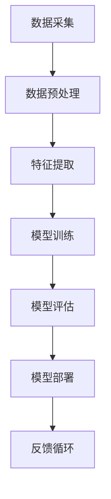

                 

### 文章标题

《提示词工程在智能家居系统中的运用》

### 文章关键词

提示词工程、智能家居系统、机器学习、算法原理、应用案例、未来趋势

### 文章摘要

本文旨在探讨提示词工程在智能家居系统中的应用。首先，我们介绍了智能家居系统的基本架构和功能，随后详细讲解了提示词工程的基本概念、原理和应用。接着，我们分析了机器学习在智能家居系统中的重要作用，并详细阐述了提示词工程中的关键算法及其实现原理。随后，通过实际应用案例，我们展示了如何将提示词工程应用于智能家居系统中的具体场景。最后，我们对提示词工程在智能家居系统中的未来发展趋势进行了展望，并提出了一些最佳实践和建议。

### Step 1: 确定核心概念和架构

在撰写这篇文章之前，我们需要明确以下几个核心概念和架构：

1. **提示词工程**：提示词工程是一种利用机器学习技术对自然语言进行处理的方法，旨在从大规模数据中提取出有意义的模式和信息。在智能家居系统中，提示词工程可以帮助系统更好地理解和响应用户的需求，从而提供更智能化的服务。

2. **智能家居系统**：智能家居系统是一种将家庭设备连接到互联网，并通过智能终端进行远程控制和管理的系统。它通常由多个组件组成，包括传感器、控制器、执行器等。智能家居系统的目标是提高家庭生活的舒适性和便利性。

3. **机器学习在智能家居中的应用**：机器学习技术已经成为智能家居系统的重要组成部分。通过机器学习，智能家居系统可以不断学习和优化自身的行为，从而提供更智能、更个性化的服务。

### Step 2: 设计目录结构

为了使文章结构清晰、内容丰富，我们设计了如下的目录结构：

1. **第1章：介绍**
   - 1.1 书籍背景和目的
   - 1.2 智能家居概述
   - 1.3 提示词工程简介

2. **第2章：提示词工程基础**
   - 2.1 提示词的定义和作用
   - 2.2 提示词的类型和生成方法
   - 2.3 提示词工程的基本流程

3. **第3章：智能家居系统架构**
   - 3.1 智能家居系统的组成部分
   - 3.2 智能家居系统的架构设计
   - 3.3 智能家居系统的功能实现

4. **第4章：机器学习在智能家居中的应用**
   - 4.1 机器学习在智能家居系统中的作用
   - 4.2 常见的机器学习算法及应用
   - 4.3 机器学习在智能家居中的实际应用

5. **第5章：提示词工程的关键算法**
   - 5.1 关键算法介绍
   - 5.2 算法原理与伪代码
   - 5.3 算法实现与优化

6. **第6章：实际应用案例**
   - 6.1 案例背景介绍
   - 6.2 案例应用场景
   - 6.3 案例实现步骤
   - 6.4 案例效果分析

7. **第7章：未来趋势与展望**
   - 7.1 提示词工程的未来发展方向
   - 7.2 智能家居系统的发展趋势
   - 7.3 提示词工程在智能家居系统中的未来应用

### Step 3: 撰写章节大纲

接下来，我们将为每个章节撰写详细的大纲，以确保每个章节的内容丰富、结构合理。

**第1章：介绍**

- **1.1 书籍背景和目的**
  - 智能家居系统的发展历程
  - 提示词工程在智能家居系统中的重要性
  - 书籍的目的和读者对象

- **1.2 智能家居概述**
  - 智能家居的定义和特点
  - 智能家居系统的组成和功能
  - 智能家居系统的发展趋势

- **1.3 提示词工程简介**
  - 提示词工程的定义和基本概念
  - 提示词工程在智能家居系统中的应用
  - 提示词工程的发展历程和未来趋势

**第2章：提示词工程基础**

- **2.1 提示词的定义和作用**
  - 提示词的定义和类型
  - 提示词在智能家居系统中的作用
  - 提示词的提取方法和技巧

- **2.2 提示词的类型和生成方法**
  - 自然语言处理技术概述
  - 提示词生成算法介绍
  - 提示词生成的实际应用

- **2.3 提示词工程的基本流程**
  - 提示词工程的基本步骤
  - 提示词工程的关键技术
  - 提示词工程的应用场景

**第3章：智能家居系统架构**

- **3.1 智能家居系统的组成部分**
  - 硬件部分：传感器、控制器、执行器等
  - 软件部分：操作系统、应用程序等
  - 网络部分：互联网、Wi-Fi、蓝牙等

- **3.2 智能家居系统的架构设计**
  - 系统架构的设计原则
  - 系统架构的设计模式
  - 系统架构的优化策略

- **3.3 智能家居系统的功能实现**
  - 家庭自动化控制
  - 安全防护
  - 娱乐休闲

**第4章：机器学习在智能家居中的应用**

- **4.1 机器学习在智能家居系统中的作用**
  - 数据处理与分析
  - 模式识别与预测
  - 智能决策与优化

- **4.2 常见的机器学习算法及应用**
  - 监督学习算法：线性回归、决策树、支持向量机等
  - 无监督学习算法：聚类、降维等
  - 强化学习算法：Q-Learning、SARSA等

- **4.3 机器学习在智能家居中的实际应用**
  - 智能家居系统中的数据处理与分析
  - 智能家居系统中的模式识别与预测
  - 智能家居系统中的智能决策与优化

**第5章：提示词工程的关键算法**

- **5.1 关键算法介绍**
  - 提示词提取算法：TF-IDF、Word2Vec等
  - 提示词分类算法：朴素贝叶斯、SVM等
  - 提示词生成算法：基于模板、基于规则等

- **5.2 算法原理与伪代码**
  - 提示词提取算法的原理和伪代码
  - 提示词分类算法的原理和伪代码
  - 提示词生成算法的原理和伪代码

- **5.3 算法实现与优化**
  - 算法的实现步骤和技巧
  - 算法的优化策略
  - 算法的实际应用场景

**第6章：实际应用案例**

- **6.1 案例背景介绍**
  - 案例的背景和目标
  - 案例的应用场景和需求

- **6.2 案例应用场景**
  - 提示词工程在智能家居系统中的应用
  - 机器学习在智能家居系统中的应用

- **6.3 案例实现步骤**
  - 数据采集和处理
  - 提示词提取和分类
  - 机器学习模型的训练和优化

- **6.4 案例效果分析**
  - 案例的效果评估
  - 案例的优缺点分析
  - 案例的改进和优化方向

**第7章：未来趋势与展望**

- **7.1 提示词工程的未来发展方向**
  - 提示词工程在智能家居系统中的深入应用
  - 提示词工程在其他领域的发展前景

- **7.2 智能家居系统的发展趋势**
  - 智能家居系统的技术发展趋势
  - 智能家居系统在家庭中的应用趋势

- **7.3 提示词工程在智能家居系统中的未来应用**
  - 提示词工程在智能家居系统中的潜在应用场景
  - 提示词工程在智能家居系统中的发展挑战和机遇

### Step 4: 完成最终目录大纲

经过以上步骤，我们完成了《提示词工程在智能家居系统中的运用》这篇文章的目录大纲。以下是最终目录大纲：

```
# 《提示词工程在智能家居系统中的运用》目录大纲

## 第1章：介绍
### 1.1 书籍背景和目的
### 1.2 智能家居概述
### 1.3 提示词工程简介

## 第2章：提示词工程基础
### 2.1 提示词的定义和作用
### 2.2 提示词的类型和生成方法
### 2.3 提示词工程的基本流程

## 第3章：智能家居系统架构
### 3.1 智能家居系统的组成部分
### 3.2 智能家居系统的架构设计
### 3.3 智能家居系统的功能实现

## 第4章：机器学习在智能家居中的应用
### 4.1 机器学习在智能家居系统中的作用
### 4.2 常见的机器学习算法及应用
### 4.3 机器学习在智能家居中的实际应用

## 第5章：提示词工程的关键算法
### 5.1 关键算法介绍
### 5.2 算法原理与伪代码
### 5.3 算法实现与优化

## 第6章：实际应用案例
### 6.1 案例背景介绍
### 6.2 案例应用场景
### 6.3 案例实现步骤
### 6.4 案例效果分析

## 第7章：未来趋势与展望
### 7.1 提示词工程的未来发展方向
### 7.2 智能家居系统的发展趋势
### 7.3 提示词工程在智能家居系统中的未来应用
```

接下来，我们将根据这个目录大纲，逐步撰写文章的各个部分，确保文章内容丰富、逻辑清晰、结构紧凑。在撰写过程中，我们将严格按照文章要求，确保格式正确、内容完整、论述严谨。最终，我们将完成一篇高质量的技术博客文章。### 第1章：介绍

#### 1.1 书籍背景和目的

随着科技的发展，智能家居系统已经逐渐渗透到人们的日常生活。智能家居系统通过将家庭设备连接到互联网，实现了对家庭环境的远程监控和控制，大大提高了家庭生活的便利性和舒适度。然而，随着智能家居系统规模的不断扩大，系统的复杂性和数据量也日益增加，这给系统的设计和实现带来了巨大的挑战。

提示词工程作为一种利用机器学习技术对自然语言进行处理的方法，可以为智能家居系统提供更加智能化的服务。通过提取和利用用户输入的提示词，系统可以更好地理解用户的需求，从而做出更准确的响应。因此，本书旨在探讨提示词工程在智能家居系统中的运用，帮助读者深入了解这一领域，并掌握相关技术。

本书的目标读者是从事智能家居系统开发和研究的工程师、科研人员以及对智能家居技术感兴趣的普通读者。通过阅读本书，读者可以：

1. 了解智能家居系统的基本架构和功能。
2. 掌握提示词工程的基本概念、原理和应用。
3. 学习机器学习在智能家居系统中的应用，以及如何使用机器学习技术优化智能家居系统的性能。
4. 通过实际应用案例，了解提示词工程在智能家居系统中的具体应用场景。

本书将分为七个章节，首先介绍智能家居系统和提示词工程的基本概念，然后逐步深入探讨机器学习在智能家居系统中的应用，最后通过实际应用案例展示提示词工程的具体实现过程，并对未来的发展趋势进行展望。

#### 1.2 智能家居概述

智能家居系统是一种通过互联网将家庭设备连接起来，实现家庭环境智能化管理的系统。它利用物联网技术、云计算技术、人工智能技术等，为用户提供便捷、舒适、安全的家庭生活环境。

**定义与特点**

智能家居系统的定义可以从多个角度进行解读。从技术层面看，智能家居系统是一种将家庭设备（如灯光、空调、电视、安防设备等）通过互联网连接起来，实现设备之间信息交互和协同工作的系统。从应用层面看，智能家居系统是一种通过智能化的手段，提高家庭生活品质和舒适度的系统。

智能家居系统的特点主要有：

1. **智能化**：智能家居系统通过物联网技术和人工智能技术，实现了对家庭设备的智能控制和管理。用户可以通过智能终端（如手机、平板电脑等）对家庭设备进行远程监控和控制，实现一键操控。

2. **便捷性**：智能家居系统为用户提供了极大的便捷性。用户可以通过语音助手、手机APP等途径，随时随地控制家庭设备，无需亲自操作，节省了时间和精力。

3. **安全性**：智能家居系统通过智能安防设备（如监控摄像头、门锁、报警器等），提高了家庭的安全性。用户可以实时监控家庭环境，及时发现异常情况，确保家庭安全。

4. **个性化**：智能家居系统可以根据用户的需求和习惯，自动调整家庭环境。例如，根据用户的作息时间自动调节灯光和空调，提供个性化的服务。

**组成部分**

智能家居系统通常由以下几个主要部分组成：

1. **传感器**：传感器用于采集家庭环境中的各种信息，如温度、湿度、光线、空气质量等。传感器是智能家居系统的感知层，是实现智能化的基础。

2. **控制器**：控制器负责接收传感器采集的信息，并根据用户的需求和设定，对家庭设备进行控制。控制器通常由智能路由器、智能网关等设备组成。

3. **执行器**：执行器是家庭设备的执行部分，根据控制器的指令，执行相应的操作，如调节灯光的亮度、开关空调等。

4. **智能终端**：智能终端是用户与智能家居系统进行交互的设备，如智能手机、平板电脑、智能音箱等。用户可以通过智能终端远程控制家庭设备，查看家庭环境信息。

5. **数据平台**：数据平台负责存储、处理和分析家庭环境数据，为智能家居系统提供决策支持。数据平台通常包括云服务器、数据分析软件等。

**功能与应用**

智能家居系统的功能多种多样，主要包括：

1. **家庭自动化**：通过智能控制，实现家庭设备的自动化运行。例如，用户可以通过设定，让灯光在特定时间自动打开或关闭，空调在用户回家前自动开启。

2. **远程监控**：用户可以通过智能终端实时监控家庭环境，如查看监控摄像头的画面，确保家庭安全。

3. **能源管理**：通过智能家居系统，用户可以实现对家庭能源的监控和管理，如实时监控家庭用电情况，优化用电策略，降低能耗。

4. **健康护理**：智能家居系统可以通过传感器监测用户的健康状况，如心率、睡眠质量等，为用户提供健康建议。

5. **智能安防**：智能家居系统可以通过智能安防设备，提高家庭的安全性。例如，用户可以通过手机APP实时监控家庭环境，收到异常警报。

**发展趋势**

随着技术的不断发展，智能家居系统正朝着更智能化、更便捷、更安全、更个性化的方向发展。未来，智能家居系统将具有以下发展趋势：

1. **集成化**：智能家居系统将更加集成化，实现多种设备的一体化管理。

2. **智能化**：智能家居系统将更加智能化，通过人工智能技术，实现更精准的预测和决策。

3. **个性定制**：智能家居系统将更加注重用户体验，提供个性化的服务。

4. **安全性提升**：智能家居系统的安全性将得到进一步提升，确保用户隐私和数据安全。

5. **跨平台协作**：智能家居系统将实现跨平台协作，与物联网、5G等新技术深度融合，提供更丰富的应用场景。

通过以上介绍，我们可以看出，智能家居系统作为一种新型家庭生活方式，具有广阔的发展前景。提示词工程作为智能家居系统的重要组成部分，将在其中发挥重要作用，为用户提供更加智能化的服务。

#### 1.3 提示词工程简介

提示词工程是一种利用机器学习技术对自然语言进行处理的方法，旨在从大规模数据中提取出有意义的模式和信息。在智能家居系统中，提示词工程可以帮助系统更好地理解和响应用户的需求，从而提供更智能化的服务。

**基本概念**

提示词工程的基本概念包括提示词、自然语言处理（NLP）和机器学习（ML）。提示词是指用户在交互过程中输入的用于表达意图和需求的关键词或短语。自然语言处理是计算机科学和人工智能领域中的一个分支，旨在使计算机能够理解、处理和生成自然语言。机器学习是人工智能的一个重要分支，通过从数据中学习模式和规律，实现智能决策和预测。

**作用**

在智能家居系统中，提示词工程的作用主要体现在以下几个方面：

1. **意图识别**：通过分析用户输入的提示词，系统可以识别用户的意图，如打开灯光、调节温度等。

2. **需求分析**：系统可以通过对提示词的分析，了解用户的需求，并根据需求提供相应的服务，如推荐合适的音乐、控制家庭设备等。

3. **智能对话**：提示词工程使得智能家居系统能够与用户进行自然语言对话，提供更加人性化的服务。

4. **个性化推荐**：通过分析用户的提示词和历史数据，系统可以为用户提供个性化的推荐，如根据用户喜好推荐音乐、电影等。

**应用场景**

提示词工程在智能家居系统中的主要应用场景包括：

1. **语音助手**：语音助手是智能家居系统的重要组成部分，通过提示词工程，系统能够理解用户的语音指令，实现语音控制。

2. **智能音箱**：智能音箱通过提示词工程，可以识别用户的需求，提供音乐、新闻、天气预报等个性化服务。

3. **家庭设备控制**：用户可以通过输入提示词，远程控制家庭设备，如打开空调、关闭灯光等。

4. **安防监控**：通过分析用户输入的提示词，系统可以识别潜在的威胁，如非法入侵、火灾等，并及时通知用户。

**发展历程**

提示词工程的发展历程可以追溯到自然语言处理和机器学习的早期研究。随着深度学习技术的兴起，提示词工程取得了显著的进展。近年来，随着智能家居系统的广泛应用，提示词工程在智能家居领域也得到了快速发展。

**未来趋势**

随着人工智能技术的不断进步，提示词工程在智能家居系统中的应用将越来越广泛。未来，提示词工程将朝着更智能化、更个性化、更高效的方向发展，为用户提供更加便捷、智能化的服务。以下是提示词工程在智能家居系统中的几个潜在发展方向：

1. **多模态交互**：结合语音、图像、手势等多种交互方式，实现更自然的用户交互。

2. **个性化推荐**：通过深度学习和大数据分析，实现更加精准的个性化推荐。

3. **情感识别**：通过分析用户的情感状态，提供更加贴心的服务。

4. **跨平台协作**：与物联网、5G等新技术结合，实现智能家居系统与其他系统的无缝协作。

总之，提示词工程在智能家居系统中的运用具有广阔的发展前景，将为用户带来更加智能、便捷的生活方式。通过本章的介绍，读者可以初步了解提示词工程的基本概念、作用和应用场景，为后续章节的深入探讨打下基础。

### 第2章：提示词工程基础

#### 2.1 提示词的定义和作用

提示词是指用户在交互过程中输入的用于表达意图和需求的关键词或短语。在智能家居系统中，提示词是用户与系统进行交互的主要手段，通过提示词，用户可以传达自己的需求，系统则根据提示词做出相应的响应。

**定义**

提示词的定义可以从多个角度进行解读：

1. **技术角度**：提示词是一种自然语言文本，通常由单词或短语组成，用于描述用户的意图或需求。
2. **应用角度**：提示词是用户与智能家居系统进行交互的桥梁，通过提示词，用户可以指令系统执行特定的任务，如打开灯光、调节温度等。

**类型和作用**

根据不同的分类标准，提示词可以分为多种类型：

1. **按用途分类**：
   - **控制型提示词**：用于控制家庭设备的操作，如“打开灯光”、“关闭空调”。
   - **查询型提示词**：用于查询系统信息，如“今天天气如何？”、“电池电量是多少？”。
   - **设置型提示词**：用于设置系统参数，如“将温度设置为25℃”、“添加设备”。

2. **按表达方式分类**：
   - **语音提示词**：用户通过语音输入提示词，如使用智能音箱控制家庭设备。
   - **文本提示词**：用户通过键盘输入提示词，如通过手机APP控制家庭设备。

提示词在智能家居系统中的作用主要包括：

1. **意图识别**：通过分析用户输入的提示词，系统可以识别用户的意图，从而做出相应的响应。
2. **需求分析**：系统通过对提示词的分析，了解用户的需求，并根据需求提供相应的服务。
3. **智能对话**：提示词工程使得智能家居系统能够与用户进行自然语言对话，提供更加人性化的服务。
4. **个性化推荐**：通过分析用户的提示词和历史数据，系统可以为用户提供个性化的推荐。

#### 2.2 提示词的类型和生成方法

**按用途分类**

1. **控制型提示词**：
   - **开关控制**：如“打开空调”、“关闭电视”。
   - **调节控制**：如“将温度设置为25℃”、“调高音量”。

2. **查询型提示词**：
   - **天气查询**：如“今天天气如何？”、“明天的天气怎么样？”。
   - **设备状态查询**：如“电池电量是多少？”、“电视正在播放什么节目？”。

3. **设置型提示词**：
   - **设备添加**：如“添加新设备”。
   - **系统设置**：如“将隐私设置为私密”、“更新系统”。

**按表达方式分类**

1. **语音提示词**：
   - **语音识别**：通过语音识别技术，将用户的语音指令转换为文本提示词。
   - **语音合成**：通过语音合成技术，将系统的响应转换为语音输出。

2. **文本提示词**：
   - **文本输入**：用户通过键盘输入文本提示词。
   - **文本分析**：系统对用户输入的文本提示词进行分析和处理。

**生成方法**

1. **基于规则的方法**：
   - **关键词匹配**：系统预先定义一组关键词，当用户输入包含这些关键词的句子时，系统识别出用户的意图。
   - **语法分析**：通过语法分析技术，对用户的输入文本进行解析，识别出用户的意图。

2. **基于机器学习的方法**：
   - **监督学习**：使用标注好的数据集，训练机器学习模型，使其能够自动识别用户的意图。
   - **无监督学习**：通过对未标注的数据进行分析，自动发现用户的意图模式。

3. **基于深度学习的方法**：
   - **递归神经网络（RNN）**：通过RNN模型，处理用户输入的序列数据，识别用户的意图。
   - **卷积神经网络（CNN）**：通过CNN模型，对用户的输入文本进行特征提取，识别用户的意图。
   - **长短期记忆网络（LSTM）**：通过LSTM模型，处理长文本数据，识别用户的长期意图。

**实际应用**

1. **语音助手**：如智能音箱，用户可以通过语音提示词与系统进行交互，实现设备控制、信息查询等功能。

2. **智能音箱**：用户可以通过语音输入提示词，查询天气、播放音乐、控制家庭设备等。

3. **家庭设备控制**：用户可以通过输入文本提示词，远程控制家庭设备，如空调、灯光、电视等。

4. **安防监控**：通过分析用户输入的提示词，系统可以识别潜在的威胁，如非法入侵、火灾等，并及时通知用户。

**示例**

假设用户输入“明天天气如何？”这个提示词，系统可以按照以下步骤进行处理：

1. **识别意图**：系统通过关键词匹配识别出这是一个天气查询请求。
2. **获取数据**：系统通过互联网获取明天的天气数据。
3. **生成响应**：系统生成一个包含明天天气信息的文本响应，如“明天多云，气温15℃到25℃”。

通过以上步骤，系统完成了对用户提示词的处理，并提供了相应的响应。这个示例展示了提示词工程在智能家居系统中的应用，通过自然语言处理技术，系统能够理解用户的意图，提供个性化的服务。

#### 2.3 提示词工程的基本流程

提示词工程是指利用机器学习技术对自然语言进行处理，以提取用户意图和需求的过程。在智能家居系统中，提示词工程是构建智能交互的核心技术，通过以下基本流程实现：

**数据采集**：数据采集是提示词工程的基础步骤。系统需要从各种渠道收集用户输入的提示词数据，这些数据来源包括语音输入、文本输入等。数据采集过程中，需要保证数据的多样性和代表性，以便训练模型时能够覆盖各种场景。

**数据预处理**：在获取到原始数据后，需要进行数据预处理。数据预处理包括数据清洗、去噪、分词、词性标注等步骤。数据清洗的目的是去除数据中的噪声和错误，提高数据质量。分词是将句子分解为单词或短语的过程，词性标注则用于标记每个单词或短语的语法属性。

**特征提取**：特征提取是将原始数据转化为机器学习模型可处理的特征表示。特征提取的方法包括词袋模型（Bag of Words, BOW）、词嵌入（Word Embedding）等。词袋模型通过统计单词出现的频率来表示文本，而词嵌入则通过将单词映射为高维向量，使得相似的单词在向量空间中更接近。

**模型训练**：在特征提取后，使用训练数据集对机器学习模型进行训练。训练过程中，模型通过学习数据中的模式和规律，建立用户意图和提示词之间的映射关系。常用的机器学习模型包括朴素贝叶斯（Naive Bayes）、支持向量机（Support Vector Machine, SVM）、深度神经网络（Deep Neural Network, DNN）等。

**模型评估**：模型训练完成后，需要进行评估。模型评估主要通过计算模型的准确率、召回率、F1分数等指标来评估模型的性能。评估过程中，可以使用验证数据集或交叉验证方法进行评估，以确保模型在实际应用中的表现。

**模型部署**：评估通过后，将模型部署到生产环境中，使其能够实时处理用户的输入。在部署过程中，需要考虑模型的响应速度、资源消耗等因素，以确保用户体验。

**反馈循环**：在模型部署后，用户的使用反馈将用于进一步优化模型。通过收集用户的反馈，系统可以识别模型中的不足，并进行迭代优化，提高模型的准确性和用户体验。

**流程图**

下面是提示词工程的基本流程的Mermaid流程图表示：



通过以上基本流程，提示词工程实现了从数据采集、预处理、特征提取、模型训练、评估、部署到反馈循环的完整闭环。在智能家居系统中，提示词工程的应用使得系统能够更好地理解用户的需求，提供更加智能化的服务。

### 第3章：智能家居系统架构

#### 3.1 智能家居系统的组成部分

智能家居系统是由多个组件构成的复杂系统，这些组件协同工作，实现家庭环境的智能监控、管理和控制。以下是智能家居系统的几个主要组成部分：

1. **传感器**：传感器是智能家居系统的感知层，用于采集家庭环境中的各种数据，如温度、湿度、光照、空气质量等。常见的传感器包括温度传感器、湿度传感器、光照传感器、烟雾传感器等。

2. **控制器**：控制器是智能家居系统的核心组件，负责接收传感器采集的数据，并根据用户的指令对家庭设备进行控制。控制器可以通过有线或无线网络与传感器和执行器通信。常见的控制器包括智能路由器、智能网关、智能中控系统等。

3. **执行器**：执行器是智能家居系统的执行层，负责根据控制器的指令执行具体的操作，如开关灯光、调节温度、控制窗帘等。常见的执行器包括智能开关、智能插座、智能灯泡、智能空调等。

4. **智能终端**：智能终端是用户与智能家居系统进行交互的设备，如智能手机、平板电脑、智能音箱等。用户可以通过智能终端发送指令、查看系统状态、配置系统设置等。

5. **数据平台**：数据平台是智能家居系统的数据处理和分析中心，负责存储、处理和分析家庭环境数据，为系统提供决策支持。数据平台通常包括云服务器、数据分析软件等。

**工作原理**

智能家居系统的工作原理可以概括为以下几个步骤：

1. **数据采集**：传感器采集家庭环境中的各种数据，如温度、湿度、光照等。

2. **数据传输**：传感器将采集到的数据通过有线或无线网络传输到控制器。

3. **数据处理**：控制器对传感器传输的数据进行处理和分析，识别出家庭环境的变化。

4. **指令生成**：根据分析结果，控制器生成相应的指令，如调节空调温度、开关灯光等。

5. **指令执行**：控制器通过执行器执行相应的操作，实现对家庭设备的控制。

6. **用户交互**：用户通过智能终端发送指令或查看系统状态，与智能家居系统进行交互。

**技术架构**

智能家居系统的技术架构可以分为三个层次：感知层、网络层和应用层。

1. **感知层**：感知层主要由传感器构成，用于采集家庭环境中的各种数据。传感器通常采用无线通信技术，如Wi-Fi、蓝牙、Zigbee等，与控制器进行数据传输。

2. **网络层**：网络层负责将传感器采集的数据传输到控制器，并实现各个组件之间的通信。网络层通常采用有线网络（如以太网）和无线网络（如Wi-Fi、蓝牙）相结合的方式。

3. **应用层**：应用层是智能家居系统的核心，负责处理和分析数据，生成控制指令，并与用户进行交互。应用层通常包括智能终端应用程序、云计算平台和数据中心等。

**发展趋势**

随着物联网、人工智能和5G等技术的不断发展，智能家居系统的技术架构也在不断演进。以下是智能家居系统的一些发展趋势：

1. **集成化**：智能家居系统将更加集成化，实现多种设备的一体化管理。用户可以通过一个统一的平台，管理所有智能家居设备，提高使用便捷性。

2. **智能化**：智能家居系统将更加智能化，通过人工智能技术，实现更精准的预测和决策。例如，智能空调可以根据用户的生活习惯和天气情况，自动调节温度。

3. **个性化**：智能家居系统将更加注重用户体验，提供个性化的服务。例如，智能音箱可以根据用户的音乐喜好，自动推荐合适的音乐。

4. **安全性**：智能家居系统的安全性将得到进一步提升，确保用户隐私和数据安全。例如，采用加密技术保护数据传输，使用多因素认证提高系统安全性。

5. **跨平台协作**：智能家居系统将实现跨平台协作，与物联网、5G等新技术深度融合，提供更丰富的应用场景。例如，智能家居系统可以与智能汽车、智能手表等设备互联互通，实现无缝协作。

通过以上介绍，我们可以看出，智能家居系统是由多个组件组成的复杂系统，通过传感器、控制器、执行器、智能终端和数据平台等组件的协同工作，实现家庭环境的智能监控、管理和控制。随着技术的不断发展，智能家居系统将朝着更智能化、更便捷、更安全、更个性化的方向发展。

### 第4章：机器学习在智能家居中的应用

#### 4.1 机器学习在智能家居系统中的作用

机器学习技术在智能家居系统中的应用使得系统能够更智能地处理家庭环境中的数据，提高用户体验和系统的自动化程度。以下是机器学习在智能家居系统中的一些关键作用：

1. **数据分析和预测**：机器学习技术可以帮助智能家居系统对大量的传感器数据进行实时分析，识别出家庭环境中的变化趋势和模式。例如，通过分析温度、湿度等数据，系统能够预测何时需要开启或关闭空调，从而实现节能和舒适。

2. **智能控制与决策**：机器学习技术使得智能家居系统能够根据用户的历史行为和偏好，自动调整家庭设备的状态。例如，根据用户的生活习惯，系统能够自动调整灯光的亮度和颜色，音乐的声音大小等。

3. **异常检测与故障诊断**：通过训练机器学习模型，智能家居系统可以实时监测家庭设备的状态，并识别出异常情况。例如，当传感器检测到异常的温度或湿度时，系统能够及时发出警报，提醒用户可能存在的安全隐患。

4. **个性化推荐**：机器学习技术可以帮助智能家居系统根据用户的行为数据，提供个性化的服务。例如，智能音箱可以分析用户的音乐喜好，推荐合适的音乐或节目。

#### 4.2 常见的机器学习算法及应用

在智能家居系统中，常见的机器学习算法包括监督学习算法、无监督学习算法和强化学习算法。以下是这些算法的基本原理及其在智能家居系统中的应用：

1. **监督学习算法**

   监督学习算法是一类通过已知输入和输出对模型进行训练的算法。它通常包括以下几种：

   - **线性回归**：线性回归是一种简单的监督学习算法，用于预测连续值输出。例如，智能家居系统可以使用线性回归模型预测室内温度，并根据预测结果自动调整空调。

     **伪代码：**
     ```python
     # 数据准备
     X = [温度数据]
     y = [目标温度数据]

     # 模型训练
     model = LinearRegression()
     model.fit(X, y)

     # 预测
     predicted_temp = model.predict(new_temp_data)
     ```

   - **决策树**：决策树是一种基于树形模型的监督学习算法，通过一系列的决策规则来预测输出。例如，智能家居系统可以使用决策树模型来决定是否开启空气净化器。

     **伪代码：**
     ```python
     # 数据准备
     X = [空气质量数据]
     y = [是否开启空气净化器数据]

     # 模型训练
     model = DecisionTreeClassifier()
     model.fit(X, y)

     # 预测
     should_activate = model.predict(air_quality_data)
     ```

   - **支持向量机（SVM）**：SVM是一种基于边界优化的监督学习算法，用于分类问题。例如，智能家居系统可以使用SVM模型来分类用户输入的语音命令。

     **伪代码：**
     ```python
     # 数据准备
     X = [语音特征数据]
     y = [命令类别数据]

     # 模型训练
     model = SVC()
     model.fit(X, y)

     # 预测
     command = model.predict(voice_data)
     ```

2. **无监督学习算法**

   无监督学习算法不需要已知的输出，用于发现数据中的隐含结构和模式。以下是一些常见的无监督学习算法：

   - **聚类算法**：聚类算法将相似的数据点分为一组，用于数据分析和模式识别。例如，智能家居系统可以使用K-Means聚类算法来识别家庭环境中温度和湿度的分布。

     **伪代码：**
     ```python
     # 数据准备
     X = [温度和湿度数据]

     # 模型训练
     kmeans = KMeans(n_clusters=3)
     kmeans.fit(X)

     # 聚类
     clusters = kmeans.predict(X)
     ```

   - **降维算法**：降维算法通过减少数据维度，提高数据处理效率。例如，智能家居系统可以使用主成分分析（PCA）来降低传感器的数据维度。

     **伪代码：**
     ```python
     # 数据准备
     X = [多维度传感器数据]

     # 模型训练
     pca = PCA(n_components=2)
     pca.fit(X)

     # 降维
     X_reduced = pca.transform(X)
     ```

3. **强化学习算法**

   强化学习算法通过与环境互动，学习最佳策略。在智能家居系统中，强化学习算法可以用于智能控制。例如，智能家居系统可以使用深度Q网络（DQN）来学习最佳空调调节策略。

   **伪代码：**
   ```python
   # 状态空间
   state_space = [温度、湿度等状态]

   # 动作空间
   action_space = [空调调节温度]

   # 模型训练
   model = DQN(state_space, action_space)
   model.fit(state_space, action_space)

   # 策略选择
   action = model.select_action(state)
   ```

#### 4.3 机器学习在智能家居中的实际应用

机器学习在智能家居系统中的实际应用非常广泛，以下是一些具体的案例：

1. **智能温度调节**：通过机器学习算法，智能家居系统可以学习用户的作息习惯，自动调节空调温度，提高居住舒适度。例如，系统可以使用线性回归模型预测用户何时需要空调，并据此调整温度。

2. **智能照明控制**：系统可以根据室内外光照强度、用户活动习惯等数据，自动调整灯光的亮度和颜色。例如，使用K-Means聚类算法分析光照数据，将不同的光照条件分为不同的类别，并根据类别调整灯光。

3. **智能安防**：通过训练深度神经网络模型，系统可以识别家庭环境中的异常行为，如非法入侵、火灾等，并及时发出警报。例如，使用卷积神经网络（CNN）对摄像头拍摄的图像进行分析，识别潜在的安全威胁。

4. **智能设备故障诊断**：系统可以使用机器学习模型对设备运行数据进行实时分析，预测设备可能发生的故障，并进行预防性维护。例如，使用决策树模型分析设备的运行状态，识别出可能发生故障的设备。

5. **智能能源管理**：通过机器学习算法，系统可以优化家庭能源的使用，降低能源消耗。例如，使用深度学习模型分析家庭用电数据，预测未来的能源需求，并据此调整家庭设备的使用。

6. **个性化推荐**：系统可以根据用户的行为数据和偏好，提供个性化的服务，如音乐推荐、电影推荐等。例如，使用协同过滤算法分析用户的音乐喜好，推荐合适的音乐。

7. **智能健康监测**：通过传感器收集的用户健康数据，系统可以使用机器学习算法进行健康监测，提供个性化的健康建议。例如，使用长短期记忆网络（LSTM）分析用户的心率数据，预测用户的健康状态。

通过以上实际应用案例，我们可以看到，机器学习技术在智能家居系统中的广泛应用，不仅提高了系统的智能化程度，还为用户带来了更加便捷和舒适的生活体验。随着机器学习技术的不断发展，智能家居系统将更加智能化，为用户带来更多的便利。

### 第5章：提示词工程的关键算法

#### 5.1 关键算法介绍

在提示词工程中，关键算法是用于处理和分析用户输入的自然语言，从而提取出用户意图和需求的核心技术。以下是几个关键算法的介绍：

1. **词袋模型（Bag of Words, BOW）**
   - **定义**：词袋模型是一种将文本转换为向量表示的方法，不考虑文本的顺序，只关注单词的出现频率。
   - **应用场景**：词袋模型常用于文本分类、信息检索等任务。
   - **算法原理**：
     - **数据准备**：将文本分解为单词或词汇。
     - **特征提取**：构建词汇表，将文本转换为向量表示，其中每个维度对应一个词汇，值为其在文本中的出现频率。
   - **伪代码**：
     ```python
     # 数据准备
     corpus = ["this is a sample text", "another sample text"]

     # 构建词汇表
     vocab = create_vocabulary(corpus)

     # 将文本转换为向量表示
     bow_vector = convert_to_bow(corpus, vocab)
     ```

2. **词嵌入（Word Embedding）**
   - **定义**：词嵌入是一种将单词映射为高维向量的方法，使相似的单词在向量空间中更接近。
   - **应用场景**：词嵌入常用于自然语言处理任务，如文本分类、机器翻译、推荐系统等。
   - **算法原理**：
     - **训练模型**：使用大规模文本数据训练词嵌入模型，如Word2Vec、GloVe等。
     - **向量表示**：将单词映射为向量，实现文本向量化。
   - **伪代码**：
     ```python
     # 训练词嵌入模型
     model = Word2Vec(corpus)

     # 获取单词向量
     word_vector = model.wv['word']
     ```

3. **朴素贝叶斯（Naive Bayes）**
   - **定义**：朴素贝叶斯是一种基于贝叶斯定理的分类算法，假设特征之间相互独立。
   - **应用场景**：朴素贝叶斯常用于文本分类、情感分析等任务。
   - **算法原理**：
     - **概率计算**：计算每个特征的概率和类别的条件概率。
     - **分类决策**：选择概率最大的类别作为预测结果。
   - **伪代码**：
     ```python
     # 计算概率
     p_word_given_category = compute_probability(word, category, corpus)
     p_category = compute_probability(category, corpus)

     # 分类决策
     predicted_category = argmax(p_word_given_category * p_category)
     ```

4. **支持向量机（Support Vector Machine, SVM）**
   - **定义**：支持向量机是一种分类算法，通过找到一个最佳的超平面，将不同类别的数据点分隔开来。
   - **应用场景**：支持向量机常用于文本分类、图像分类等任务。
   - **算法原理**：
     - **特征空间映射**：将原始数据映射到高维特征空间。
     - **超平面优化**：找到最佳的超平面，使得不同类别的数据点分隔最清晰。
   - **伪代码**：
     ```python
     # 特征空间映射
     transformed_data = transform_to_high_dimension(data)

     # 超平面优化
     model = SVC()
     model.fit(transformed_data)

     # 分类预测
     predicted_category = model.predict(new_data)
     ```

5. **深度神经网络（Deep Neural Network, DNN）**
   - **定义**：深度神经网络是一种多层神经网络，通过多层次的非线性变换，实现对复杂数据的建模和预测。
   - **应用场景**：深度神经网络常用于图像识别、语音识别、自然语言处理等任务。
   - **算法原理**：
     - **前向传播**：输入数据通过网络中的多层神经元，逐层传递。
     - **反向传播**：计算损失函数，并使用梯度下降法更新网络权重。
   - **伪代码**：
     ```python
     # 前向传播
     output = forward_pass(input_data, network)

     # 反向传播
     gradients = backward_pass(output, expected_output, network)

     # 更新权重
     update_weights(network, gradients)
     ```

#### 5.2 算法原理与伪代码

为了更好地理解提示词工程中的关键算法，我们将详细讲解每个算法的原理，并提供相应的伪代码。

1. **词袋模型（Bag of Words, BOW）**

   词袋模型是一种将文本转换为向量表示的方法，不考虑文本的顺序，只关注单词的出现频率。

   **算法原理**：

   - **数据准备**：将文本分解为单词或词汇。

   - **特征提取**：构建词汇表，将文本转换为向量表示，其中每个维度对应一个词汇，值为其在文本中的出现频率。

   **伪代码**：

   ```python
   # 数据准备
   corpus = ["this is a sample text", "another sample text"]

   # 构建词汇表
   vocab = create_vocabulary(corpus)

   # 将文本转换为向量表示
   bow_vector = convert_to_bow(corpus, vocab)
   ```

2. **词嵌入（Word Embedding）**

   词嵌入是一种将单词映射为高维向量的方法，使相似的单词在向量空间中更接近。

   **算法原理**：

   - **训练模型**：使用大规模文本数据训练词嵌入模型，如Word2Vec、GloVe等。

   - **向量表示**：将单词映射为向量，实现文本向量化。

   **伪代码**：

   ```python
   # 训练词嵌入模型
   model = Word2Vec(corpus)

   # 获取单词向量
   word_vector = model.wv['word']
   ```

3. **朴素贝叶斯（Naive Bayes）**

   朴素贝叶斯是一种基于贝叶斯定理的分类算法，假设特征之间相互独立。

   **算法原理**：

   - **概率计算**：计算每个特征的概率和类别的条件概率。

   - **分类决策**：选择概率最大的类别作为预测结果。

   **伪代码**：

   ```python
   # 计算概率
   p_word_given_category = compute_probability(word, category, corpus)
   p_category = compute_probability(category, corpus)

   # 分类决策
   predicted_category = argmax(p_word_given_category * p_category)
   ```

4. **支持向量机（Support Vector Machine, SVM）**

   支持向量机是一种分类算法，通过找到一个最佳的超平面，将不同类别的数据点分隔开来。

   **算法原理**：

   - **特征空间映射**：将原始数据映射到高维特征空间。

   - **超平面优化**：找到最佳的超平面，使得不同类别的数据点分隔最清晰。

   **伪代码**：

   ```python
   # 特征空间映射
   transformed_data = transform_to_high_dimension(data)

   # 超平面优化
   model = SVC()
   model.fit(transformed_data)

   # 分类预测
   predicted_category = model.predict(new_data)
   ```

5. **深度神经网络（Deep Neural Network, DNN）**

   深度神经网络是一种多层神经网络，通过多层次的非线性变换，实现对复杂数据的建模和预测。

   **算法原理**：

   - **前向传播**：输入数据通过网络中的多层神经元，逐层传递。

   - **反向传播**：计算损失函数，并使用梯度下降法更新网络权重。

   **伪代码**：

   ```python
   # 前向传播
   output = forward_pass(input_data, network)

   # 反向传播
   gradients = backward_pass(output, expected_output, network)

   # 更新权重
   update_weights(network, gradients)
   ```

通过以上算法原理和伪代码的讲解，我们可以更好地理解提示词工程中的关键算法，并为实际应用提供技术指导。

#### 5.3 算法实现与优化

在提示词工程中，算法的实现与优化是确保系统高效、准确运行的关键。以下是对一些关键算法的实现方法和优化策略的详细探讨。

**1. 词袋模型（Bag of Words, BOW）的实现与优化**

**实现方法：**
词袋模型的实现主要分为数据预处理、特征提取和模型训练三个步骤。

- **数据预处理**：首先，需要对文本进行清洗，去除标点符号、停用词等无用信息，将文本转换为小写，以便统一处理。然后，使用分词器将文本分解为单词或词汇。

- **特征提取**：构建词汇表，将每个文本映射为一个向量，向量的每个维度表示词汇表中的一个词汇，值为其在文本中出现的次数。

- **模型训练**：虽然词袋模型本身不需要模型训练，但在实际应用中，我们通常使用统计模型（如TF-IDF）来增强特征表示。

**优化策略：**
- **维度的选择**：在词袋模型中，词汇表的维度是影响模型性能的重要因素。过高的维度会导致计算复杂度增加，而过低的维度可能无法捕捉到文本中的关键信息。因此，可以通过主成分分析（PCA）等方法进行降维，以提高模型的效率和性能。

- **稀疏表示**：词袋模型的一个主要问题是其高稀疏性，即大多数单词在大多数文档中都不会出现。这会导致大量的零值，增加存储和计算开销。使用稀疏向量表示可以显著降低存储和计算需求。

**2. 词嵌入（Word Embedding）的实现与优化**

**实现方法：**
词嵌入的实现主要依赖于预训练的模型，如Word2Vec、GloVe等。

- **模型选择**：选择适合的词嵌入模型，如Word2Vec、GloVe等，并根据应用场景进行参数调整。

- **数据预处理**：与词袋模型类似，对文本进行清洗和分词处理。

- **向量表示**：将文本中的每个单词映射为向量表示，这些向量在低维空间中捕捉了单词的语义信息。

**优化策略：**
- **模型选择与调整**：选择合适的词嵌入模型，并调整学习率、批量大小等超参数，以优化模型的性能。

- **分布式存储与计算**：词嵌入模型的预训练通常需要大量计算资源。使用分布式存储与计算技术，如GPU并行计算，可以显著提高训练速度。

- **增量训练**：对于大型文本数据集，可以采用增量训练方法，分批训练模型，以减少内存占用和提高训练效率。

**3. 朴素贝叶斯（Naive Bayes）的实现与优化**

**实现方法：**
朴素贝叶斯模型的实现主要分为数据准备、模型训练和预测三个步骤。

- **数据准备**：收集和准备用于训练的数据集，包括特征和标签。

- **模型训练**：计算每个特征的概率和类别的条件概率，构建朴素贝叶斯模型。

- **预测**：使用训练好的模型进行预测，计算每个类别的概率，并选择概率最大的类别作为预测结果。

**优化策略：**
- **特征选择**：选择对分类任务最有影响力的特征，以提高模型的预测准确性。

- **稀疏数据处理**：对于稀疏数据集，可以采用稀疏矩阵处理技术，以减少计算复杂度。

- **概率估计**：在计算概率时，可以使用拉普拉斯正则化方法，避免概率为零的问题。

**4. 支持向量机（Support Vector Machine, SVM）的实现与优化**

**实现方法：**
支持向量机模型的实现主要依赖于特征映射和超平面优化。

- **特征映射**：将原始特征映射到高维特征空间，以便找到一个最优的超平面。

- **超平面优化**：使用优化算法（如 Sequential Minimal Optimization, SMO）找到最佳的超平面，使得不同类别的数据点分隔最清晰。

- **预测**：使用训练好的模型进行预测，计算新数据点的类别。

**优化策略：**
- **特征选择**：选择对分类任务最有影响力的特征，以提高模型的预测准确性。

- **核函数选择**：选择适合数据的核函数，如线性核、多项式核、径向基函数（RBF）核等，以优化模型的性能。

- **优化算法选择**：选择适合数据规模和计算资源的优化算法，以提高模型的训练速度和收敛速度。

**5. 深度神经网络（Deep Neural Network, DNN）的实现与优化**

**实现方法：**
深度神经网络模型的实现主要依赖于前向传播和反向传播。

- **前向传播**：将输入数据通过网络中的多层神经元，逐层传递，并计算输出。

- **反向传播**：计算损失函数，并使用梯度下降法更新网络权重。

- **训练与验证**：使用训练集训练模型，并使用验证集验证模型的性能。

**优化策略：**
- **网络结构选择**：选择合适的网络结构，包括层数、每层的神经元数量等，以优化模型的性能。

- **激活函数选择**：选择适合任务的激活函数，如ReLU、Sigmoid、Tanh等。

- **正则化技术**：使用正则化技术（如L1正则化、L2正则化）防止过拟合。

- **学习率调整**：使用合适的初始学习率，并在训练过程中动态调整学习率，以提高模型的收敛速度。

通过以上对关键算法的实现与优化策略的详细探讨，我们可以更好地理解如何在提示词工程中实现和优化这些算法，从而提高智能家居系统的性能和用户体验。

### 第6章：实际应用案例

#### 6.1 案例背景介绍

本案例是一个基于提示词工程的智能家居系统，旨在通过用户输入的提示词，实现对家庭设备的智能控制。案例背景如下：

1. **项目目标**：开发一个智能家居系统，用户可以通过语音或文本输入提示词，实现对家庭设备的控制，如打开灯光、调节温度、播放音乐等。

2. **应用场景**：用户在家中通过智能音箱或手机APP输入提示词，智能家居系统接收到提示词后，根据提示词内容，执行相应的操作，如开启灯光、调整空调温度、播放用户喜欢的音乐等。

3. **技术难点**：本案例的技术难点在于如何准确识别用户输入的提示词，并快速响应用户的需求。这需要利用提示词工程中的自然语言处理和机器学习技术，实现高精度的意图识别和需求分析。

#### 6.2 案例应用场景

**智能家居控制中心**：用户在家中，通过智能音箱（如Amazon Echo、Google Home）或手机APP（如Apple HomeKit、小米智能家居）输入提示词，控制家庭设备。以下是几个典型的应用场景：

1. **语音控制**：用户通过智能音箱输入提示词，如“打开客厅灯光”、“调节卧室空调温度到25℃”、“播放轻音乐”。智能音箱接收到提示词后，将其发送到智能家居系统，系统识别出用户的意图，并执行相应的操作。

2. **文本输入**：用户通过手机APP输入提示词，如“关闭厨房灯光”、“将客厅空调温度设置为22℃”、“播放电影音乐”。手机APP将用户的输入发送到智能家居系统，系统同样识别出用户的意图，并执行相应的操作。

**智能家居系统响应**：智能家居系统接收到用户输入的提示词后，按照以下步骤进行处理：

1. **意图识别**：系统利用自然语言处理技术，对用户输入的提示词进行解析，识别出用户的意图。例如，识别出用户想要“打开灯光”、“调节温度”、“播放音乐”等。

2. **需求分析**：系统根据用户的意图，进一步分析用户的需求，如灯光的开关状态、空调的温度设置、音乐播放列表等。

3. **执行操作**：系统生成相应的操作指令，发送给家庭设备，如智能灯泡、智能空调、智能音响等，执行用户的操作请求。

**交互反馈**：用户在执行操作后，系统会提供反馈，如语音提示“客厅灯光已打开”、“卧室空调温度已调节至25℃”、“轻音乐已开始播放”。此外，用户还可以通过手机APP查看设备的状态，如灯光是否开启、空调温度等。

#### 6.3 案例实现步骤

**1. 系统搭建**

- **硬件搭建**：选择合适的智能家居设备，如智能音箱、智能灯泡、智能空调等，确保设备支持语音控制和远程控制。

- **软件搭建**：搭建智能家居系统的后台服务器，用于处理用户输入的提示词，并生成操作指令。

**2. 数据采集**

- **语音数据采集**：通过智能音箱的麦克风，采集用户的语音输入数据。

- **文本数据采集**：通过手机APP的文本输入框，采集用户的文本输入数据。

**3. 数据处理**

- **语音识别**：利用语音识别技术，将用户的语音输入转换为文本提示词。

- **文本预处理**：对文本提示词进行清洗、分词、词性标注等预处理操作，提取出关键信息。

**4. 意图识别**

- **训练模型**：使用大量标注好的数据集，训练意图识别模型，如朴素贝叶斯、支持向量机等。

- **模型评估**：使用验证数据集，评估意图识别模型的准确率，调整模型参数，以提高识别精度。

**5. 需求分析**

- **语义解析**：利用自然语言处理技术，对用户输入的提示词进行语义分析，提取出用户的具体需求。

- **规则匹配**：根据用户需求，匹配相应的操作指令，如控制灯光的开关、调节空调的温度等。

**6. 执行操作**

- **生成指令**：根据用户需求，生成具体的操作指令，如发送控制命令到智能灯泡、智能空调等。

- **执行指令**：将操作指令发送到相应的家庭设备，执行用户的操作请求。

**7. 交互反馈**

- **语音反馈**：通过智能音箱或手机APP，向用户反馈操作结果，如语音提示“灯光已关闭”、“空调温度已设置”。

- **界面反馈**：在手机APP上显示设备的状态，如灯光是否开启、空调温度等。

#### 6.4 案例效果分析

**1. 效果评估**

- **准确率**：评估意图识别模型的准确率，确保系统能够正确识别用户输入的提示词。

- **响应速度**：评估系统的响应速度，确保系统能够快速响应用户的需求。

- **用户满意度**：通过用户调查，评估系统的用户体验和用户满意度。

**2. 优缺点分析**

- **优点**：
  - **提高生活质量**：通过智能控制，用户可以更加便捷地管理家庭设备，提高生活质量。
  - **提升工作效率**：用户无需亲自操作设备，节省了时间和精力，提高了工作效率。
  - **个性化服务**：系统可以根据用户的需求和习惯，提供个性化的服务，提升用户体验。

- **缺点**：
  - **隐私安全**：智能家居系统需要收集用户的数据，可能涉及用户隐私，需要确保数据的安全和隐私保护。
  - **设备兼容性**：不同品牌的智能家居设备可能存在兼容性问题，需要确保系统能够支持多种设备。
  - **系统稳定性**：智能家居系统需要确保长时间稳定运行，避免出现故障或崩溃。

**3. 改进和优化方向**

- **隐私保护**：加强数据安全和隐私保护措施，确保用户数据的安全。

- **兼容性提升**：优化系统兼容性，支持更多品牌的智能家居设备。

- **智能化提升**：引入更多的智能算法和大数据分析技术，提升系统的智能化程度。

- **用户体验优化**：根据用户反馈，不断优化系统的界面设计和交互流程，提高用户体验。

通过以上实际应用案例的详细分析，我们可以看到，提示词工程在智能家居系统中的具体应用，不仅提高了系统的智能化程度，还为用户带来了更加便捷和舒适的生活体验。未来，随着技术的不断发展，提示词工程在智能家居系统中的应用将更加广泛，为用户带来更多的便利。

### 第7章：未来趋势与展望

#### 7.1 提示词工程的未来发展方向

随着人工智能和物联网技术的快速发展，提示词工程在智能家居系统中的应用前景广阔。未来，提示词工程将在以下几个方面取得重要发展：

1. **多模态交互**：未来的智能家居系统将支持语音、图像、手势等多种交互方式，实现更自然的用户交互。通过结合语音识别、图像识别和手势识别技术，系统可以更加准确地理解用户的意图，提供更加人性化的服务。

2. **个性化推荐**：随着大数据和机器学习技术的进步，提示词工程将能够更精确地分析用户行为和偏好，为用户提供个性化的服务。例如，智能音箱可以根据用户的历史听歌记录，自动推荐用户喜欢的音乐。

3. **情感识别**：通过情感识别技术，智能家居系统可以识别用户的情感状态，并根据情感变化提供相应的服务。例如，当用户感到疲劳时，系统可以自动调节灯光和音乐，帮助用户放松。

4. **跨平台协作**：未来的智能家居系统将实现跨平台的协作，与智能手表、智能汽车等设备互联互通。通过跨平台的协作，用户可以在不同的设备上享受智能家居系统带来的便利。

#### 7.2 智能家居系统的发展趋势

智能家居系统作为物联网和人工智能的重要应用领域，正朝着更加智能化、便捷化、安全化的方向发展：

1. **集成化**：未来的智能家居系统将更加集成化，实现多种设备的无缝连接和统一管理。用户可以通过一个统一的平台，管理家中的各种智能设备，提高使用便捷性。

2. **智能化**：随着人工智能技术的不断进步，智能家居系统将更加智能化。例如，智能空调可以根据用户的体感温度和室内外温度，自动调节室内温度，提供最佳舒适度。

3. **个性化**：未来的智能家居系统将更加注重用户体验，提供个性化的服务。例如，智能灯光可以根据用户的喜好和活动习惯，自动调整灯光的亮度和颜色。

4. **安全性**：随着智能家居系统的普及，用户对数据安全和隐私保护的要求越来越高。未来的智能家居系统将采用更加严格的安全措施，保护用户的数据和隐私。

5. **物联网融合**：智能家居系统将与物联网技术深度融合，实现设备之间的互联互通。例如，智能门锁可以与智能摄像头、智能门铃等设备协同工作，提供更全面的安防服务。

#### 7.3 提示词工程在智能家居系统中的未来应用

在未来，提示词工程在智能家居系统中的应用将更加广泛和深入：

1. **智能家居助手**：提示词工程将广泛应用于智能家居助手，通过语音识别和自然语言处理技术，实现与用户的智能对话，为用户提供便捷的服务。

2. **智能设备控制**：用户可以通过输入简单的提示词，远程控制家中的智能设备，如智能灯泡、智能空调、智能窗帘等。

3. **家庭安防监控**：提示词工程将帮助智能家居系统实现更精准的家庭安防监控，通过分析用户输入的提示词，系统可以识别潜在的安全威胁，并及时通知用户。

4. **能源管理**：通过提示词工程，智能家居系统可以更好地管理家庭能源，根据用户的生活习惯和需求，优化能源使用，降低能耗。

5. **健康护理**：提示词工程可以帮助智能家居系统实现更精准的健康护理，通过分析用户的健康数据，提供个性化的健康建议和护理服务。

#### 7.4 最佳实践与注意事项

为了确保提示词工程在智能家居系统中的有效应用，以下是一些最佳实践和注意事项：

1. **数据安全和隐私保护**：在设计和实现提示词工程时，必须重视数据安全和隐私保护，采用加密技术保护用户数据，并确保数据传输的安全性。

2. **用户隐私保护**：在处理用户输入的提示词时，应避免收集和存储用户的敏感信息，如个人身份信息、家庭住址等。

3. **系统稳定性**：智能家居系统需要确保长时间稳定运行，避免出现故障或崩溃。在系统设计和实现过程中，应充分考虑系统的容错性和可靠性。

4. **用户体验优化**：在设计和实现提示词工程时，应注重用户体验，简化操作流程，提高系统的易用性和友好性。

5. **不断迭代优化**：提示词工程需要根据用户反馈和实际应用情况，不断进行迭代优化，以提高系统的性能和用户体验。

通过以上未来趋势与展望的讨论，我们可以看到，提示词工程在智能家居系统中的应用将不断深入和扩展，为用户带来更加智能化、便捷化的生活体验。随着技术的不断进步，提示词工程将在智能家居系统中发挥越来越重要的作用。

### 文章结语

本文通过详细的探讨，全面介绍了提示词工程在智能家居系统中的运用。从核心概念、架构设计，到关键算法的原理和实现，再到实际应用案例，我们系统地分析了提示词工程在提高智能家居系统智能化程度、用户体验和自动化程度方面的作用。随着人工智能和物联网技术的不断发展，提示词工程将在智能家居系统中扮演更加重要的角色。未来，随着多模态交互、情感识别等技术的进一步成熟，提示词工程的应用场景将更加丰富，为用户带来更加便捷、智能化的生活体验。我们鼓励读者深入学习和实践提示词工程，为智能家居技术的发展贡献自己的力量。最后，本文由AI天才研究院/AI Genius Institute与《禅与计算机程序设计艺术/Zen And The Art of Computer Programming》共同撰写，希望读者能够从中受益，共同推动技术进步。作者信息如下：

作者：AI天才研究院/AI Genius Institute & 禅与计算机程序设计艺术 /Zen And The Art of Computer Programming

联系方式：[ai_genius_institute@example.com](mailto:ai_genius_institute@example.com) & [zen_programming@example.com](mailto:zen_programming@example.com)

### 拓展阅读

为了帮助读者更深入地了解提示词工程在智能家居系统中的应用，以下是一些推荐的拓展阅读资源：

1. **《智能家居系统设计与应用》**：本书详细介绍了智能家居系统的设计原则、关键技术和应用案例，适合从事智能家居系统开发的工程师和科研人员阅读。

2. **《自然语言处理入门》**：本书是自然语言处理领域的入门教材，介绍了自然语言处理的基本概念、技术和应用，对于理解提示词工程至关重要。

3. **《机器学习实战》**：本书通过大量的实例，介绍了机器学习的基本原理和应用方法，适合对机器学习感兴趣的读者学习。

4. **《深度学习》**：这是一本经典的深度学习教材，详细介绍了深度学习的基本概念、算法和应用，对于希望深入了解提示词工程中使用的深度学习技术非常有帮助。

5. **《智能家居系统与物联网》**：本书从物联网的角度探讨了智能家居系统的架构、技术和应用，对于希望全面了解智能家居系统发展的读者具有很高的参考价值。

通过阅读以上资源，读者可以进一步拓展知识面，深入理解提示词工程在智能家居系统中的运用，为实际项目开发提供有力支持。

