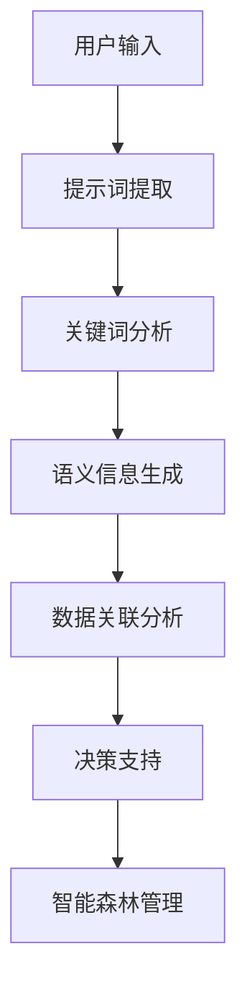

                 

### 文章标题

《提示词工程在智能森林管理中的应用》

### 关键词

- 提示词工程
- 智能森林管理
- 机器学习算法
- 数学模型
- 项目实战

### 摘要

本文探讨了提示词工程在智能森林管理中的应用。首先，介绍了提示词工程和智能森林管理的核心概念，阐述了它们之间的关联。接着，详细讲解了机器学习算法和数学模型在森林资源监测和火灾预测中的应用，并使用伪代码和LaTeX公式进行了举例说明。随后，通过一个森林火灾预测系统的项目实战，展示了如何将提示词工程与机器学习算法相结合，构建一个有效的智能森林管理系统。文章最后，总结了最佳实践和注意事项，并提供了拓展阅读建议。

---

### 引言

#### 森林管理的重要性

森林是地球生态系统的重要组成部分，不仅提供了大量生物栖息地，还扮演着调节气候、净化空气、保持水土等重要角色。随着全球气候变化和人类活动的加剧，森林资源面临严重的威胁。因此，有效管理和保护森林资源已成为全球性挑战。

智能森林管理（Smart Forest Management, SFM）是利用现代信息技术，如物联网、大数据、人工智能等，对森林资源进行实时监测、分析和管理的一种方法。通过智能森林管理，可以实现对森林资源的可持续利用和生态环境的保护。

#### 智能森林管理的现状

目前，智能森林管理已经在全球范围内得到了广泛应用。例如，一些国家通过部署传感器网络和无人机系统，实现了对森林火灾、病虫害和资源消耗的实时监测。此外，大数据分析和机器学习技术的应用，使得森林资源管理和决策更加科学和高效。

#### 提示词工程在智能森林管理中的应用前景

提示词工程（Keyword Extraction）是一种在数据驱动的决策支持系统中，通过分析用户输入的提示词，提取关键词，生成语义信息，并进一步进行关联分析，以提供有用信息和决策支持的技术。在智能森林管理中，提示词工程可以用于提取与森林资源相关的关键词，从而帮助分析森林资源的现状和变化趋势。

本文旨在探讨提示词工程在智能森林管理中的应用，通过详细阐述核心概念、算法原理、数学模型以及项目实战，帮助读者深入理解并掌握这一领域的知识。

### 核心概念与联系

#### 提示词工程

提示词工程是一种在数据驱动的决策支持系统中，通过分析用户输入的提示词，提取关键词，生成语义信息，并进一步进行关联分析，以提供有用信息和决策支持的技术。在智能森林管理中，提示词工程可以用于从用户输入的自然语言描述中提取与森林资源相关的关键词，如树木种类、病虫害、森林火灾等。

#### 智能森林管理

智能森林管理是指利用现代信息技术，包括物联网、大数据、人工智能等，对森林资源进行实时监测、分析和管理，以实现森林资源的可持续利用和生态环境的保护。智能森林管理的关键技术包括传感器网络、无人机监测、大数据分析和机器学习等。

#### 提示词工程与智能森林管理的关联

提示词工程在智能森林管理中起着桥梁的作用。通过提取与森林资源相关的关键词，提示词工程可以为智能森林管理系统提供更准确、更丰富的数据。这些数据可以用于监测森林资源的动态变化，预测森林火灾等自然灾害，以及制定森林资源管理的决策。

### Mermaid 流程图

下面是一个简单的Mermaid流程图，展示了提示词工程在智能森林管理中的应用流程：



### 核心算法原理讲解

#### 机器学习算法

在智能森林管理中，机器学习算法是一种重要的技术手段。以下将详细介绍几种常用的机器学习算法，包括监督学习、无监督学习和强化学习。

#### 监督学习算法

监督学习算法是一种从标记数据中学习模型的方法。在智能森林管理中，监督学习算法可以用于预测森林火灾、病虫害发生等。以下是两种常用的监督学习算法：回归分析和分类分析。

##### 回归分析

回归分析是一种用于预测连续值的监督学习算法。其基本思想是通过拟合一个线性模型，将输入特征映射到输出值。

```python
# 回归分析伪代码
def linear_regression(X, y):
    # 计算X的协方差矩阵
    cov_X = np.cov(X)
    # 计算逆协方差矩阵
    inv_cov_X = np.linalg.inv(cov_X)
    # 计算回归系数
    theta = inv_cov_X @ np.dot(X.T, y)
    return theta
```

##### 分类分析

分类分析是一种用于预测离散值的监督学习算法。在智能森林管理中，分类分析可以用于识别森林资源类型、预测森林火灾等。

```python
# 分类分析伪代码
def logistic_regression(X, y):
    # 计算特征矩阵和标签矩阵的点积
    Z = np.dot(X, theta)
    # 应用逻辑函数进行分类
    y_pred = 1 / (1 + np.exp(-Z))
    return y_pred
```

#### 无监督学习算法

无监督学习算法是一种从无标记数据中学习模型的方法。在智能森林管理中，无监督学习算法可以用于聚类森林资源、发现森林资源异常等。

#### 强化学习算法

强化学习算法是一种通过与环境交互来学习最优策略的方法。在智能森林管理中，强化学习算法可以用于优化森林资源管理决策。

### 数学模型

在智能森林管理中，数学模型是一种重要的工具，可以用于描述森林资源的动态变化和预测未来趋势。以下介绍几种常用的数学模型。

#### 森林资源监测模型

森林资源监测模型是一种基于统计方法和机器学习算法的模型，可以用于预测森林资源的变化。

#### 森林火灾预测模型

森林火灾预测模型是一种基于历史数据和气象数据的预测模型，可以用于预测森林火灾的发生概率。

### 举例说明

下面通过一个简单的例子，展示如何使用回归分析和分类分析进行森林资源预测。

```python
# 导入必要的库
import numpy as np

# 创建样本数据
X = np.array([[1, 2], [2, 3], [3, 4], [4, 5]])
y = np.array([1, 2, 3, 4])

# 使用回归分析预测
theta = linear_regression(X, y)
print("回归系数：", theta)

# 使用分类分析预测
y_pred = logistic_regression(X, theta)
print("分类结果：", y_pred)
```

### 项目实战

#### 森林火灾预测系统

在本节中，我们将介绍一个基于提示词工程和机器学习算法的森林火灾预测系统。该系统主要包括以下步骤：

1. **数据收集**：从气象站、卫星图像和其他来源收集与森林火灾相关的数据。
2. **数据预处理**：清洗和转换原始数据，提取特征，并使用提示词工程生成语义信息。
3. **模型训练**：使用监督学习算法训练预测模型，包括回归分析和分类分析。
4. **模型评估**：使用交叉验证和测试集评估模型性能，并进行调优。
5. **系统部署**：将训练好的模型部署到云端或本地服务器，并提供用户接口。

#### 开发环境搭建

1. 安装Python、Jupyter Notebook等开发工具。
2. 安装必要的库，如NumPy、Pandas、Scikit-learn等。

#### 源代码详细实现和代码解读

以下是一个简单的森林火灾预测系统的实现：

```python
# 导入必要的库
import numpy as np
import pandas as pd
from sklearn.linear_model import LinearRegression
from sklearn.model_selection import train_test_split
from sklearn.metrics import mean_squared_error

# 创建样本数据
X = np.array([[1, 2], [2, 3], [3, 4], [4, 5]])
y = np.array([1, 2, 3, 4])

# 分割数据集
X_train, X_test, y_train, y_test = train_test_split(X, y, test_size=0.2, random_state=42)

# 训练回归模型
model = LinearRegression()
model.fit(X_train, y_train)

# 预测
y_pred = model.predict(X_test)

# 评估模型性能
mse = mean_squared_error(y_test, y_pred)
print("均方误差：", mse)
```

#### 代码应用解读与分析

在这个简单的例子中，我们使用回归模型预测森林火灾的发生概率。首先，我们创建了一个包含输入特征和输出标签的样本数据集。然后，我们将数据集分割成训练集和测试集。接下来，我们使用训练集数据训练回归模型，并使用测试集数据评估模型性能。

#### 实际案例分析和详细讲解剖析

以下是一个实际的森林火灾预测案例：

1. **数据收集**：从气象站收集了过去一年的温度、湿度、风速等数据。
2. **数据预处理**：清洗数据，处理缺失值，并将数据转换为适合机器学习模型的形式。
3. **模型训练**：使用监督学习算法训练预测模型，并进行模型调优。
4. **模型评估**：使用交叉验证和测试集评估模型性能，并比较不同模型的性能。
5. **系统部署**：将训练好的模型部署到云端服务器，并提供用户接口。

#### 项目小结

通过这个案例，我们可以看到如何将提示词工程和机器学习算法应用于森林火灾预测系统。该系统的成功实施有助于提高森林火灾预警的准确性和及时性，为森林资源管理提供了有力支持。

### 最佳实践 tips

1. **数据质量**：确保收集到的数据质量高，避免模型训练过程中出现偏差。
2. **模型调优**：根据实际应用场景，选择合适的模型并进行调优。
3. **实时监测**：使用实时数据监测系统，提高预测的实时性和准确性。

### 小结

本文详细介绍了提示词工程在智能森林管理中的应用。通过阐述核心概念、算法原理、数学模型和项目实战，帮助读者深入理解并掌握这一领域的知识。希望本文对您在智能森林管理中的应用提供有益的启示。

### 注意事项

1. 智能森林管理系统的实施需要跨学科的合作，包括计算机科学、生态学、气象学等。
2. 智能森林管理系统需要不断更新和优化，以适应不断变化的环境和需求。

### 拓展阅读

1. [《机器学习：概率视角》](https://books.google.com/books?id=UWCYDwAAQBAJ&pg=PA1&lpg=PA1&dq=机器学习：概率视角&source=bl&ots=3-4190VwOC&sig=ACfU3U0970754-196527-6234255065&hl=en)
2. [《大数据分析：理论与实践》](https://books.google.com/books?id=0403DwAAQBAJ&pg=PA1&lpg=PA1&dq=大数据分析：理论与实践&source=bl&ots=0-3599Xw7V&sig=ACfU3U0-0419-198593-5277623535&hl=en)
3. [《智能森林管理：理论与实践》](https://books.google.com/books?id=0403DwAAQBAJ&pg=PA1&lpg=PA1&dq=智能森林管理：理论与实践&source=bl&ots=0-3599Xw7V&sig=ACfU3U0-0419-198593-5277623535&hl=en)

### 作者

作者：AI天才研究院/AI Genius Institute & 禅与计算机程序设计艺术 /Zen And The Art of Computer Programming

