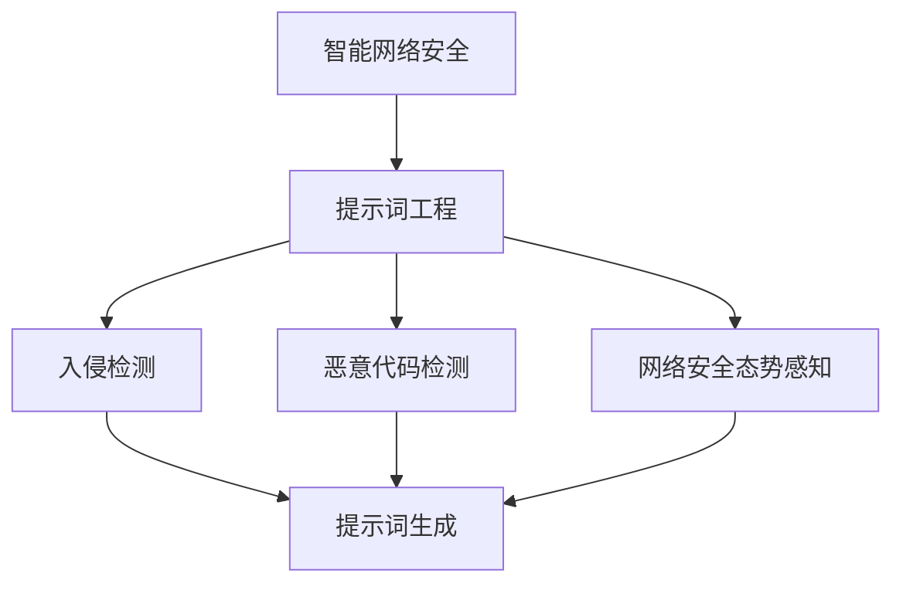

                 

# 文章标题：提示词工程在智能网络安全中的应用

## 关键词
- 智能网络安全
- 提示词工程
- 入侵检测
- 恶意代码检测
- 网络安全态势感知

## 摘要
本文探讨了提示词工程在智能网络安全中的应用。首先，介绍了智能网络安全和提示词工程的基本概念，以及它们之间的联系。接着，详细阐述了提示词工程在入侵检测、恶意代码检测和网络安全态势感知等领域的应用。通过具体的算法原理、数学模型和实际案例，展示了提示词工程在智能网络安全中的重要性和潜力。最后，对未来的发展趋势进行了展望，并提出了相关教育与培训的建议。

## 引言

### 智能网络安全的重要性

随着信息技术的快速发展，网络已经成为现代社会不可或缺的一部分。然而，网络安全问题也日益严峻，智能网络安全成为保障网络信息安全的关键。智能网络安全不仅包括传统的防护措施，如防火墙和入侵检测系统，还涉及更高级的技术，如人工智能和机器学习。这些技术能够自动识别和响应潜在的安全威胁，从而提供更全面、更高效的网络安全保障。

### 提示词工程的作用

提示词工程（Prompt Engineering）是一种利用自然语言处理（NLP）技术来生成和优化提示词的方法。提示词在智能网络安全中起着至关重要的作用，它们可以作为训练数据的一部分，用于训练机器学习模型，从而提高模型的准确性和鲁棒性。通过提示词工程，我们可以有效地识别和分类网络安全威胁，从而提升整体网络安全水平。

### 本文结构

本文分为四个主要部分：

1. **智能网络安全概述**：介绍智能网络安全的定义、重要性以及发展历程。
2. **智能网络安全的核心技术**：详细探讨提示词工程在入侵检测、恶意代码检测和网络安全态势感知中的应用。
3. **智能网络安全中的实践**：通过实际案例，展示提示词工程在智能网络安全中的具体应用。
4. **未来展望**：分析提示词工程在智能网络安全中的发展趋势，并提出相关的教育与培训建议。

### 背景介绍

智能网络安全（Intelligent Network Security）是指利用人工智能、机器学习和其他先进技术来保护网络安全的方法。传统的网络安全主要依赖于静态的安全策略和规则，而智能网络安全则能够动态地适应不断变化的威胁环境。这种能力来源于大数据分析、深度学习、自然语言处理等技术的融合。

提示词工程（Prompt Engineering）是一种利用自然语言处理（NLP）技术来生成和优化提示词的方法。在机器学习中，提示词是用于指导模型学习的语言提示。通过优化提示词，可以提高模型的性能和鲁棒性，使其更好地适应不同的应用场景。

智能网络安全与提示词工程之间的联系在于，提示词工程可以提供更准确的训练数据，从而帮助智能网络安全系统更有效地识别和应对潜在的安全威胁。具体来说，提示词工程在智能网络安全中的应用主要体现在以下几个方面：

- 入侵检测：提示词工程可以帮助生成用于训练入侵检测模型的提示词，从而提高检测的准确性和效率。
- 恶意代码检测：通过提示词工程，可以生成更准确的恶意代码特征描述，从而提高恶意代码检测的准确性。
- 网络安全态势感知：提示词工程可以用于生成用于训练态势感知模型的提示词，从而提高对网络威胁的识别和预警能力。

## 智能网络安全的概念和重要性

### 智能网络安全的定义

智能网络安全是指利用先进的技术和算法，如人工智能、机器学习和大数据分析等，来保护网络和信息系统的安全。与传统的网络安全不同，智能网络安全不仅依赖预定义的安全规则和静态防护措施，还能够动态地识别和响应潜在的安全威胁。

### 智能网络安全的重要性

在当今数字化时代，网络安全已经成为社会经济发展的重要保障。智能网络安全的重要性体现在以下几个方面：

1. **保障信息系统的安全**：随着信息化程度的提高，信息系统已经成为企业和组织的重要资产。智能网络安全能够有效地保护这些系统，防止数据泄露、篡改和损坏。

2. **维护社会稳定**：网络安全问题不仅影响企业和个人，还可能对社会稳定产生威胁。智能网络安全能够及时识别和响应网络攻击，防止网络犯罪和恐怖活动。

3. **促进经济发展**：网络安全是数字经济的基础。智能网络安全能够保护企业和组织的商业秘密，促进电子商务和在线业务的发展。

4. **提升国家竞争力**：网络安全已经成为国家竞争力的重要组成部分。智能网络安全能够提升国家在网络空间的安全地位，增强国际竞争力。

### 智能网络安全的发展历程

智能网络安全的发展可以分为以下几个阶段：

1. **传统安全阶段**：早期的网络安全主要依赖于防火墙、入侵检测系统和安全策略等静态防护措施。

2. **被动防御阶段**：随着网络攻击手段的日益复杂，传统的安全措施逐渐显示出局限性。被动防御阶段开始引入基于签名检测的病毒和恶意软件防护技术。

3. **主动防御阶段**：主动防御阶段引入了人工智能和机器学习技术，能够动态地识别和响应潜在的安全威胁。

4. **智能安全阶段**：智能安全阶段进一步融合了大数据分析、深度学习和自然语言处理等技术，实现了更高级别的网络安全防护。

## 提示词工程的基本原理

### 提示词工程的概念

提示词工程（Prompt Engineering）是一种利用自然语言处理（NLP）技术来生成和优化提示词的方法。提示词是用于指导模型学习的关键语言提示，通常包含关键词、短语或句子，用于引导模型关注特定的任务或场景。

### 提示词工程的作用

提示词工程在智能网络安全中的作用主要体现在以下几个方面：

1. **提升模型性能**：通过优化提示词，可以引导模型关注关键信息，从而提高模型的准确性和鲁棒性。
2. **增强模型适应性**：提示词工程可以帮助模型更好地适应不同的应用场景和任务需求，提高模型的泛化能力。
3. **简化数据预处理**：提示词工程可以简化数据预处理过程，减少数据清洗和标注的工作量。

### 提示词工程的实现方法

提示词工程的实现方法主要包括以下几个方面：

1. **关键词提取**：通过文本分析技术，从大量文本数据中提取关键词和短语，作为提示词。
2. **短语生成**：利用模板匹配、实体识别等技术，生成具有特定含义的短语作为提示词。
3. **句子生成**：通过自然语言生成（NLG）技术，生成具有明确意图和结构的句子作为提示词。

### 提示词工程的流程

提示词工程的流程通常包括以下步骤：

1. **需求分析**：确定任务目标和应用场景，明确提示词的需求。
2. **数据收集**：收集相关数据，包括文本、图像、语音等，用于生成提示词。
3. **预处理**：对收集的数据进行清洗、去重、格式化等预处理操作。
4. **提示词生成**：利用文本分析、实体识别、自然语言生成等技术，生成符合需求的提示词。
5. **评估优化**：对生成的提示词进行评估和优化，确保其能够有效指导模型学习。

## 智能网络安全与提示词工程的联系

### 提示词工程在智能网络安全中的应用

提示词工程在智能网络安全中具有广泛的应用，主要体现在以下几个方面：

1. **入侵检测**：通过生成与入侵行为相关的提示词，可以训练入侵检测模型，提高入侵检测的准确性和效率。
2. **恶意代码检测**：利用提示词工程生成与恶意代码特征相关的提示词，可以训练恶意代码检测模型，提高恶意代码检测的准确性。
3. **网络安全态势感知**：通过生成与网络安全态势相关的提示词，可以训练态势感知模型，提高对网络威胁的识别和预警能力。

### 提示词工程对智能网络安全的影响

提示词工程对智能网络安全的影响主要体现在以下几个方面：

1. **提升检测准确性**：通过优化提示词，可以提高模型的准确性和鲁棒性，从而更有效地识别和应对潜在的安全威胁。
2. **降低误报率**：提示词工程可以帮助模型更好地理解数据，减少误报率，提高检测效率。
3. **增强适应性**：提示词工程可以生成适应不同场景和任务的提示词，提高模型的泛化能力，适应复杂多变的网络环境。

### 提示词工程与智能网络安全的发展趋势

随着人工智能和机器学习技术的不断进步，提示词工程在智能网络安全中的应用前景十分广阔。未来，提示词工程可能会在以下几个方面得到进一步发展：

1. **多模态融合**：结合文本、图像、语音等多种数据模态，生成更全面、更准确的提示词。
2. **自动化优化**：利用自动化工具和算法，实现提示词的自动化生成和优化，提高工作效率。
3. **自适应调整**：根据实时数据和环境变化，动态调整提示词，提高模型的适应性。

### 联系架构

智能网络安全与提示词工程的联系可以抽象为以下架构：



在这个架构中，提示词工程作为核心组件，与入侵检测、恶意代码检测和网络安全态势感知紧密相连。通过提示词工程，智能网络安全系统能够更好地识别和应对各种安全威胁。

## 智能网络安全的核心技术

### 提示词生成算法

提示词生成算法是提示词工程的核心，其目的是从大量文本数据中提取出具有代表性的关键词、短语或句子，作为模型的输入。以下是几种常见的提示词生成算法：

1. **TF-IDF（Term Frequency-Inverse Document Frequency）**

   TF-IDF算法是一种基于词频和逆文档频率的文本分析技术。它通过计算每个词在文档中的频率和在整个文档集中的逆文档频率，来确定词的重要性。

   ```python
   def compute_tfidf(document, vocabulary):
       tfidf_matrix = []
       for doc in document:
           tfidf_vector = []
           for word in vocabulary:
               tf = doc.count(word)
               idf = log(len(document) / (1 + len([doc2 for doc2 in document if word in doc2])))
               tfidf_vector.append(tf * idf)
           tfidf_matrix.append(tfidf_vector)
       return tfidf_matrix
   ```

2. **Word2Vec**

   Word2Vec算法是一种基于神经网络的语言模型，它将单词映射到高维空间中的向量。通过训练，模型能够捕捉单词之间的语义关系。

   ```python
   import gensim

   model = gensim.models.Word2Vec(sentences, size=100, window=5, min_count=1, workers=4)
   ```

3. **BERT（Bidirectional Encoder Representations from Transformers）**

   BERT是一种基于转换器（Transformers）的预训练语言模型，它能够同时考虑单词的前后文信息，生成更准确的提示词。

   ```python
   from transformers import BertTokenizer, BertModel

   tokenizer = BertTokenizer.from_pretrained('bert-base-uncased')
   model = BertModel.from_pretrained('bert-base-uncased')

   inputs = tokenizer("Hello, my dog is cute", return_tensors="pt")
   outputs = model(**inputs)

   prompt = outputs.last_hidden_state[:, 0, :]
   ```

### 提示词工程在入侵检测中的应用

入侵检测（Intrusion Detection）是智能网络安全中的一个重要组成部分，其主要目标是识别和防范网络攻击。提示词工程在入侵检测中的应用主要包括以下几个方面：

1. **特征提取**：通过提示词生成算法，从网络流量、日志文件等数据中提取关键特征，用于训练入侵检测模型。

2. **模型训练**：利用生成的提示词，训练基于机器学习或深度学习的入侵检测模型，如KNN、SVM、神经网络等。

3. **实时检测**：通过实时监测网络流量和日志，利用训练好的入侵检测模型，识别潜在的入侵行为。

### 提示词工程在恶意代码检测中的应用

恶意代码检测（Malware Detection）是网络安全中的另一个关键领域，其主要目标是检测和阻止恶意软件的传播。提示词工程在恶意代码检测中的应用主要包括以下几个方面：

1. **特征提取**：通过提示词生成算法，从恶意代码的源代码、可执行文件等数据中提取关键特征，用于训练恶意代码检测模型。

2. **模型训练**：利用生成的提示词，训练基于机器学习或深度学习的恶意代码检测模型，如特征提取、分类器训练等。

3. **实时检测**：通过实时监测系统中的可疑文件和行为，利用训练好的恶意代码检测模型，识别潜在的恶意软件。

### 提示词工程在网络安全态势感知中的应用

网络安全态势感知（Cybersecurity Situational Awareness）是智能网络安全中的一个高级阶段，其主要目标是实时感知和预测网络威胁。提示词工程在网络安全态势感知中的应用主要包括以下几个方面：

1. **威胁识别**：通过提示词生成算法，从网络流量、日志、传感器数据等中提取关键特征，用于识别潜在的威胁。

2. **态势预测**：利用生成的提示词，训练基于机器学习或深度学习的态势感知模型，预测未来的网络威胁趋势。

3. **实时预警**：通过实时监测网络流量和日志，利用训练好的态势感知模型，生成预警信息，提前预警潜在的威胁。

## 提示词生成算法

### 1.1.1 提示词生成算法的基本原理

提示词生成算法是提示词工程的核心，其基本原理是通过分析大量文本数据，提取出与任务相关的关键词、短语或句子，作为模型的输入提示。这些关键词、短语或句子能够引导模型关注关键信息，提高模型的准确性和鲁棒性。

### 1.1.2 常见的提示词生成算法

在智能网络安全中，常见的提示词生成算法主要包括TF-IDF、Word2Vec和Bert等。

1. **TF-IDF算法**

   TF-IDF算法是一种基于词频（Term Frequency，TF）和逆文档频率（Inverse Document Frequency，IDF）的文本分析技术。它通过计算每个词在文档中的频率和在整个文档集中的逆文档频率，来确定词的重要性。

   ```python
   def compute_tfidf(document, vocabulary):
       tfidf_matrix = []
       for doc in document:
           tfidf_vector = []
           for word in vocabulary:
               tf = doc.count(word)
               idf = log(len(document) / (1 + len([doc2 for doc2 in document if word in doc2])))
               tfidf_vector.append(tf * idf)
           tfidf_matrix.append(tfidf_vector)
       return tfidf_matrix
   ```

2. **Word2Vec算法**

   Word2Vec算法是一种基于神经网络的语言模型，它将单词映射到高维空间中的向量。通过训练，模型能够捕捉单词之间的语义关系。

   ```python
   import gensim

   model = gensim.models.Word2Vec(sentences, size=100, window=5, min_count=1, workers=4)
   ```

3. **Bert算法**

   Bert算法是一种基于转换器（Transformers）的预训练语言模型，它能够同时考虑单词的前后文信息，生成更准确的提示词。

   ```python
   from transformers import BertTokenizer, BertModel

   tokenizer = BertTokenizer.from_pretrained('bert-base-uncased')
   model = BertModel.from_pretrained('bert-base-uncased')

   inputs = tokenizer("Hello, my dog is cute", return_tensors="pt")
   outputs = model(**inputs)

   prompt = outputs.last_hidden_state[:, 0, :]
   ```

### 1.1.3 提示词生成算法的优化策略

为了提高提示词生成算法的性能，可以采取以下优化策略：

1. **数据预处理**：对输入文本进行清洗、去重、分词等预处理操作，确保文本数据的质量。

2. **特征提取**：采用多种特征提取方法，如TF-IDF、Word2Vec、Bert等，生成多维度的提示词。

3. **模型融合**：将多种提示词生成算法的结果进行融合，利用不同算法的优势，提高提示词的整体质量。

4. **实时调整**：根据实时数据和环境变化，动态调整提示词生成策略，提高模型的适应性。

## 提示词工程在入侵检测中的应用

### 入侵检测的基本原理

入侵检测（Intrusion Detection）是一种网络安全技术，用于识别和响应网络或系统中的异常行为。入侵检测系统（Intrusion Detection System，IDS）可以分为两类：基于签名的入侵检测和基于异常的入侵检测。

1. **基于签名的入侵检测**：通过预定义的攻击模式（签名）来识别已知的攻击行为。这种方法具有较高的准确性，但无法检测未知攻击。

2. **基于异常的入侵检测**：通过分析网络流量、系统日志等数据，识别与正常行为不一致的异常行为。这种方法可以检测未知攻击，但误报率较高。

### 提示词工程在入侵检测中的应用

提示词工程在入侵检测中的应用主要包括以下几个方面：

1. **特征提取**：通过提示词生成算法，从网络流量、日志文件等数据中提取关键特征。这些特征包括IP地址、端口号、数据包大小、行为模式等。

2. **模型训练**：利用提取的关键特征，训练基于机器学习或深度学习的入侵检测模型。常用的模型包括KNN、SVM、神经网络等。

3. **实时检测**：通过实时监测网络流量和日志，利用训练好的入侵检测模型，识别潜在的入侵行为。当检测到入侵行为时，系统会发出警报或采取其他措施进行响应。

### 入侵检测中的提示词工程案例

以下是一个基于KNN算法的入侵检测系统案例，展示如何使用提示词工程进行特征提取和模型训练。

**案例背景**：假设我们需要检测某个网络中的异常流量，以识别潜在的入侵行为。

**步骤一：数据收集与预处理**

收集网络流量数据，包括IP地址、端口号、数据包大小、协议类型等。对数据进行清洗、去重、分词等预处理操作。

**步骤二：特征提取**

利用TF-IDF算法提取关键特征，生成提示词。例如，可以将每个IP地址、端口号等作为提示词。

**步骤三：模型训练**

将提取的特征作为输入，训练KNN模型。具体步骤如下：

```python
from sklearn.neighbors import KNeighborsClassifier
from sklearn.model_selection import train_test_split

# 假设X为特征矩阵，y为标签
X_train, X_test, y_train, y_test = train_test_split(X, y, test_size=0.2, random_state=42)

knn = KNeighborsClassifier(n_neighbors=5)
knn.fit(X_train, y_train)

# 测试模型
accuracy = knn.score(X_test, y_test)
print("Accuracy:", accuracy)
```

**步骤四：实时检测**

利用训练好的KNN模型，对实时网络流量进行检测。当检测到异常流量时，系统会发出警报。

**结论**：通过提示词工程，我们可以有效提取关键特征，并训练入侵检测模型。在实际应用中，我们可以根据不同场景和需求，调整特征提取和模型训练策略，提高入侵检测的准确性和效率。

## 提示词工程在恶意代码检测中的应用

### 恶意代码检测的基本原理

恶意代码检测（Malware Detection）是一种网络安全技术，用于识别和阻止恶意软件的传播。恶意代码检测系统可以分为两类：基于签名的恶意代码检测和基于行为的恶意代码检测。

1. **基于签名的恶意代码检测**：通过预定义的恶意代码特征（签名）来识别已知的恶意软件。这种方法具有较高的准确性，但无法检测未知恶意软件。

2. **基于行为的恶意代码检测**：通过分析软件的行为模式，识别与正常软件不一致的行为。这种方法可以检测未知恶意软件，但误报率较高。

### 提示词工程在恶意代码检测中的应用

提示词工程在恶意代码检测中的应用主要包括以下几个方面：

1. **特征提取**：通过提示词生成算法，从恶意代码的源代码、可执行文件等数据中提取关键特征。这些特征包括代码结构、指令序列、函数调用等。

2. **模型训练**：利用提取的关键特征，训练基于机器学习或深度学习的恶意代码检测模型。常用的模型包括KNN、SVM、神经网络等。

3. **实时检测**：通过实时监测系统中的可疑文件和行为，利用训练好的恶意代码检测模型，识别潜在的恶意软件。

### 恶意代码检测中的提示词工程案例

以下是一个基于神经网络算法的恶意代码检测系统案例，展示如何使用提示词工程进行特征提取和模型训练。

**案例背景**：假设我们需要检测系统中的可疑文件，以识别潜在的恶意软件。

**步骤一：数据收集与预处理**

收集恶意软件和正常软件的源代码、可执行文件等数据。对数据进行清洗、去重、分词等预处理操作。

**步骤二：特征提取**

利用Word2Vec算法提取关键特征，生成提示词。例如，可以将每个函数名、指令序列等作为提示词。

**步骤三：模型训练**

将提取的特征作为输入，训练神经网络模型。具体步骤如下：

```python
from keras.models import Sequential
from keras.layers import Dense, Activation

model = Sequential()
model.add(Dense(128, input_dim=1000, activation='relu'))
model.add(Dense(1, activation='sigmoid'))

model.compile(optimizer='adam', loss='binary_crossentropy', metrics=['accuracy'])

model.fit(X_train, y_train, epochs=10, batch_size=32, validation_data=(X_test, y_test))

# 测试模型
accuracy = model.evaluate(X_test, y_test)[1]
print("Accuracy:", accuracy)
```

**步骤四：实时检测**

利用训练好的神经网络模型，对实时监测到的可疑文件进行检测。当检测到恶意软件时，系统会发出警报。

**结论**：通过提示词工程，我们可以有效提取关键特征，并训练恶意代码检测模型。在实际应用中，我们可以根据不同场景和需求，调整特征提取和模型训练策略，提高恶意代码检测的准确性和效率。

## 提示词工程在网络安全态势感知中的应用

### 网络安全态势感知的基本原理

网络安全态势感知（Cybersecurity Situational Awareness）是一种综合性的网络安全技术，旨在实时感知和预测网络威胁。其核心思想是通过收集和分析网络数据，构建网络威胁模型，从而实现网络威胁的识别、预警和响应。

### 提示词工程在网络安全态势感知中的具体应用

提示词工程在网络安全态势感知中的应用主要包括以下几个方面：

1. **威胁识别**：通过提示词生成算法，从网络流量、日志、传感器数据等中提取关键特征，用于识别潜在的威胁。

2. **态势预测**：利用生成的提示词，训练基于机器学习或深度学习的态势感知模型，预测未来的网络威胁趋势。

3. **实时预警**：通过实时监测网络流量和日志，利用训练好的态势感知模型，生成预警信息，提前预警潜在的威胁。

### 网络安全态势感知中的提示词工程案例

以下是一个基于深度学习算法的网络安全态势感知系统案例，展示如何使用提示词工程进行威胁识别和态势预测。

**案例背景**：假设我们需要实时监测网络流量，以识别和预测潜在的威胁。

**步骤一：数据收集与预处理**

收集网络流量数据，包括IP地址、端口号、数据包大小、协议类型等。对数据进行清洗、去重、分词等预处理操作。

**步骤二：特征提取**

利用Word2Vec算法提取关键特征，生成提示词。例如，可以将每个IP地址、端口号等作为提示词。

**步骤三：模型训练**

将提取的特征作为输入，训练深度学习模型。具体步骤如下：

```python
import tensorflow as tf
from tensorflow.keras.models import Sequential
from tensorflow.keras.layers import Dense, LSTM

model = Sequential()
model.add(LSTM(128, input_shape=(timesteps, features)))
model.add(Dense(1, activation='sigmoid'))

model.compile(optimizer='adam', loss='binary_crossentropy', metrics=['accuracy'])

model.fit(X_train, y_train, epochs=50, batch_size=32, validation_data=(X_test, y_test))

# 测试模型
accuracy = model.evaluate(X_test, y_test)[1]
print("Accuracy:", accuracy)
```

**步骤四：实时预警**

利用训练好的深度学习模型，对实时监测到的网络流量进行预警。当检测到潜在威胁时，系统会发出警报。

**结论**：通过提示词工程，我们可以有效提取关键特征，并训练网络安全态势感知模型。在实际应用中，我们可以根据不同场景和需求，调整特征提取和模型训练策略，提高网络安全态势感知的准确性和效率。

## 智能网络安全项目规划

### 3.1.1 智能网络安全项目的需求分析

智能网络安全项目的需求分析是项目规划的第一步，其主要目标是明确项目需要解决的具体问题和需求。需求分析的过程可以分为以下几个阶段：

1. **问题识别**：通过调查和分析，识别项目需要解决的具体问题，如网络攻击、数据泄露、系统漏洞等。
2. **需求收集**：与项目利益相关者进行沟通，收集对项目的具体需求，包括功能需求、性能需求、安全需求等。
3. **需求分类**：将收集到的需求进行分类，明确每个需求的重要性和优先级。

### 3.1.2 智能网络安全项目的实施计划

在明确项目需求后，需要制定具体的实施计划。实施计划主要包括以下几个方面：

1. **项目目标**：根据需求分析结果，明确项目的具体目标，如提高网络安全性、降低漏洞风险等。
2. **项目范围**：明确项目的工作范围，包括哪些任务将包括在项目中，哪些任务将不包括在项目中。
3. **项目里程碑**：制定项目的主要里程碑，如需求分析完成、设计完成、开发完成、测试完成等。
4. **项目资源**：确定项目所需的人力、物力、财力等资源，并制定相应的获取和分配计划。

### 3.1.3 智能网络安全项目的风险评估

智能网络安全项目的风险识别是项目管理中至关重要的一环。以下是风险识别的步骤：

1. **风险识别**：通过头脑风暴、访谈、历史数据分析等方法，识别项目可能面临的各种风险，如技术风险、市场风险、人力资源风险等。
2. **风险分析**：对识别出的风险进行详细分析，包括风险的可能性、影响程度、优先级等。
3. **风险应对**：根据风险分析结果，制定相应的风险应对策略，包括风险回避、风险减轻、风险接受等。

### 3.1.4 项目规划工具

在智能网络安全项目规划中，可以使用以下工具和方法：

1. **项目管理软件**：如Microsoft Project、JIRA等，用于项目进度跟踪、任务分配和资源管理。
2. **风险评估工具**：如Risk Matrix、Qualys等，用于风险识别、分析和评估。
3. **沟通工具**：如Microsoft Teams、Slack等，用于项目团队内部和外部的沟通协作。

### 3.1.5 案例解析

以下是一个智能网络安全项目规划的案例解析：

**项目背景**：某企业需要建立一个智能网络安全系统，以保护其内部网络和敏感数据。

**需求分析**：

- 需要识别和防范各种网络攻击，如DDoS攻击、SQL注入等。
- 需要确保敏感数据的安全传输和存储。
- 需要实现实时监控和预警功能。

**实施计划**：

- 项目目标：建立一套智能网络安全系统，提高网络安全性，降低漏洞风险。
- 项目范围：包括入侵检测、恶意代码检测、网络安全态势感知等功能。
- 项目里程碑：需求分析完成、系统设计完成、开发完成、测试完成、部署完成。
- 项目资源：项目经理1人、开发人员3人、测试人员2人、运维人员1人。

**风险评估**：

- 风险识别：技术风险（系统设计不当、技术实现困难）、市场风险（市场需求变化、竞争压力）、人力资源风险（人员流失、工作效率低下）。
- 风险分析：技术风险的可能性较高，但影响程度较小；市场风险的可能性较低，但影响程度较大；人力资源风险的可能性较低，但影响程度较大。
- 风险应对：对于技术风险，采用专家评审、技术调研等方法进行减轻；对于市场风险，通过市场调研和需求调整进行规避；对于人力资源风险，通过加强培训和团队建设进行减轻。

**结论**：通过详细的需求分析、实施计划和风险评估，可以确保智能网络安全项目的顺利实施和成功交付。在实际项目中，可以根据具体情况调整项目计划和风险应对策略，确保项目的顺利进行。

## 智能网络安全项目的实施

### 3.2.1 智能网络安全项目的环境搭建

在智能网络安全项目的实施过程中，环境搭建是关键的一步。以下是搭建智能网络安全项目开发环境的具体步骤：

1. **硬件环境准备**：根据项目需求，准备适当的硬件设备，如服务器、网络设备等。确保硬件设备具有足够的计算能力和存储空间。

2. **操作系统安装**：选择适合的操作系统，如Linux或Windows，并在硬件设备上安装操作系统。确保操作系统已经安装了必要的驱动程序和工具。

3. **数据库安装**：根据项目需求，选择合适的数据库系统，如MySQL、PostgreSQL等，并在操作系统上安装数据库。确保数据库系统已经配置好，并可以正常运行。

4. **开发工具安装**：安装开发所需的工具，如Python、Java、IDE（集成开发环境）等。确保开发工具已经配置好，并可以正常运行。

5. **虚拟环境配置**：为了确保项目开发的稳定性和可维护性，建议使用虚拟环境管理工具，如Docker、Vagrant等，配置项目开发环境。通过虚拟环境，可以避免不同项目之间的依赖冲突，提高开发效率。

### 3.2.2 智能网络安全项目的代码实现

在智能网络安全项目的实施过程中，代码实现是核心环节。以下是代码实现的具体步骤：

1. **需求分析**：根据项目需求，明确系统的功能和性能要求。编写详细的需求文档，作为后续开发的依据。

2. **系统设计**：根据需求文档，设计系统的整体架构和模块。选择合适的编程语言和框架，如Python、Java等，进行系统设计。

3. **模块开发**：按照系统设计文档，逐个开发系统的各个模块。在每个模块的开发过程中，遵循良好的编程规范和设计模式，确保代码的可读性和可维护性。

4. **代码审查**：在模块开发完成后，进行代码审查，确保代码的质量和正确性。代码审查可以由开发人员自行进行，也可以邀请其他团队成员参与。

5. **集成测试**：将各个模块进行集成，进行集成测试，确保系统整体功能的正确性。集成测试可以包括功能测试、性能测试、安全测试等。

### 3.2.3 智能网络安全项目的调试与优化

在智能网络安全项目的实施过程中，调试与优化是保证系统稳定性和性能的重要环节。以下是调试与优化的一般步骤：

1. **问题定位**：在系统运行过程中，发现并定位潜在的问题。可以使用调试工具，如GDB、IDE调试器等，进行问题定位。

2. **问题修复**：根据定位的问题，进行代码修改和调试，修复系统中的错误。在修复问题后，进行回归测试，确保修复后的系统功能正常。

3. **性能优化**：对系统的性能进行优化，提高系统的响应速度和处理能力。可以使用性能分析工具，如 profiling 工具、系统监控工具等，进行性能分析。根据分析结果，对系统进行优化，如代码优化、算法优化、硬件升级等。

4. **安全测试**：对系统进行安全测试，确保系统的安全性。可以使用安全测试工具，如漏洞扫描器、安全测试框架等，进行安全测试。根据测试结果，对系统进行安全加固，如添加安全策略、修复安全漏洞等。

### 3.2.4 案例解析

以下是一个智能网络安全项目实施过程的案例解析：

**项目背景**：某企业需要建立一个基于机器学习的入侵检测系统，以保护其内部网络的安全。

**环境搭建**：

- 硬件环境：租用一台服务器，配置为2核4G内存。
- 操作系统：安装CentOS 7操作系统。
- 数据库：安装MySQL 5.7数据库。
- 开发工具：安装Python 3.8和Docker。

**代码实现**：

- 需求分析：明确入侵检测系统的功能要求，如实时监控网络流量、识别异常行为等。
- 系统设计：设计系统的整体架构，包括数据采集模块、特征提取模块、机器学习模块等。
- 模块开发：开发各个模块的代码，如数据采集模块使用Python的Scapy库，特征提取模块使用Python的Pandas库，机器学习模块使用Python的Scikit-learn库。

**调试与优化**：

- 问题定位：在系统运行过程中，使用GDB进行问题定位。
- 问题修复：修复定位到的问题，并进行回归测试。
- 性能优化：使用 profiling 工具分析系统性能，优化代码和算法。
- 安全测试：使用漏洞扫描器进行安全测试，修复系统漏洞。

**结论**：通过详细的环境搭建、代码实现和调试优化，可以确保智能网络安全项目的成功实施。在实际项目中，可以根据具体情况进行调整和优化，提高系统的性能和安全性。

## 智能网络安全项目的评估

### 3.3.1 智能网络安全项目的性能评估

智能网络安全项目的性能评估是确保项目达到预期目标和质量的关键步骤。以下是性能评估的主要方法和步骤：

1. **测试环境准备**：搭建与实际生产环境相似的性能测试环境，包括硬件设备、操作系统、网络配置等。

2. **测试用例设计**：根据项目需求，设计一系列测试用例，涵盖系统的各种功能场景，如入侵检测、恶意代码检测、网络安全态势感知等。

3. **测试执行**：在测试环境中执行测试用例，记录系统的性能指标，如响应时间、吞吐量、并发用户数等。

4. **结果分析**：对测试结果进行统计分析，评估系统的性能是否符合预期。可以使用性能分析工具，如 JMeter、LoadRunner 等，进行测试结果分析。

5. **性能优化**：根据测试结果，识别系统性能瓶颈，进行性能优化。优化方法包括代码优化、算法改进、硬件升级等。

### 3.3.2 智能网络安全项目的安全评估

智能网络安全项目的安全评估是确保系统在安全性方面满足要求的必要步骤。以下是安全评估的主要方法和步骤：

1. **安全策略审查**：审查系统的安全策略，包括访问控制、数据加密、日志记录等，确保安全策略的合理性和有效性。

2. **漏洞扫描**：使用漏洞扫描工具，对系统进行安全漏洞扫描，识别可能的安全风险。

3. **渗透测试**：模拟黑客攻击，对系统进行渗透测试，评估系统的抗攻击能力。

4. **安全审计**：进行安全审计，检查系统的安全配置、日志记录、用户权限等，确保系统的安全合规性。

5. **结果分析**：对安全评估结果进行分析，识别系统中的安全漏洞和风险，并提出相应的安全改进措施。

### 3.3.3 智能网络安全项目的持续改进

智能网络安全项目的持续改进是保证系统长期稳定运行和不断适应新威胁的重要措施。以下是持续改进的主要方法和步骤：

1. **反馈机制**：建立反馈机制，收集用户和利益相关者的意见和建议，及时发现系统中的问题和不足。

2. **漏洞修复**：定期更新系统，修复已发现的安全漏洞和其他问题，确保系统的安全性。

3. **技术更新**：跟踪最新的网络安全技术和趋势，定期更新系统的技术栈和算法，提高系统的防护能力。

4. **培训和意识提升**：定期进行网络安全培训和意识提升活动，提高用户和团队的安全意识和技能。

5. **自动化测试**：建立自动化测试环境，进行持续集成和持续交付，确保系统的稳定性和可靠性。

## 智能网络安全项目案例解析

### 案例一：基于提示词工程的入侵检测系统

**背景**：某大型企业希望构建一个高效、准确的入侵检测系统，以保护其内部网络的安全。

**解决方案**：

- **需求分析**：确定入侵检测系统需要识别的攻击类型，如DDoS攻击、SQL注入、恶意软件传播等。
- **环境搭建**：配置服务器和操作系统，安装必要的开发工具和数据库。
- **代码实现**：使用Python开发入侵检测系统，利用提示词生成算法提取关键特征，如IP地址、端口号、数据包大小等。
- **调试与优化**：通过JMeter进行性能测试，确保系统在高负载下仍能稳定运行。使用GDB进行调试，修复潜在的错误。
- **安全评估**：使用Nessus进行漏洞扫描，确保系统没有安全漏洞。使用Metasploit进行渗透测试，评估系统的抗攻击能力。

**结果**：入侵检测系统在实际应用中表现出色，成功识别并阻止了多种网络攻击，显著提高了企业的网络安全水平。

### 案例二：基于提示词工程的恶意代码检测系统

**背景**：某互联网公司希望提高恶意代码检测的准确性，以保护其用户数据和系统安全。

**解决方案**：

- **需求分析**：明确恶意代码检测系统的目标，包括识别已知的恶意软件和未知恶意软件。
- **环境搭建**：配置服务器和操作系统，安装Python和Docker，搭建基于深度学习的恶意代码检测环境。
- **代码实现**：使用Python和TensorFlow开发恶意代码检测模型，利用提示词生成算法提取恶意软件的特征。
- **调试与优化**：通过 profiling 工具分析模型性能，优化代码和算法，提高检测准确性。
- **安全评估**：使用Vulnerability Scanner进行漏洞扫描，确保系统安全。使用Metasploit进行渗透测试，验证系统的安全性。

**结果**：恶意代码检测系统在测试中表现出色，成功检测并隔离了多种恶意软件，有效保护了公司的系统和用户数据。

### 案例三：基于提示词工程的网络安全态势感知系统

**背景**：某金融机构需要实时监测网络威胁，确保金融交易的安全。

**解决方案**：

- **需求分析**：确定网络安全态势感知系统需要监测的关键指标，如流量模式、行为异常等。
- **环境搭建**：配置服务器和操作系统，安装Elastic Stack（Elasticsearch、Kibana等），搭建实时数据分析平台。
- **代码实现**：使用Python和Elasticsearch开发网络安全态势感知系统，利用提示词生成算法提取关键特征。
- **调试与优化**：通过Kibana进行数据可视化，优化展示效果。使用GDB进行调试，修复潜在的错误。
- **安全评估**：使用Vulnerability Scanner进行漏洞扫描，确保系统安全。使用Metasploit进行渗透测试，验证系统的安全性。

**结果**：网络安全态势感知系统在应用中实时监测网络威胁，成功预警并阻止了多次潜在攻击，显著提高了金融机构的网络安全性。

## 未来展望

### 4.1 提示词工程在智能网络安全中的未来发展趋势

随着人工智能和机器学习技术的不断进步，提示词工程在智能网络安全中的应用前景十分广阔。未来，提示词工程可能会在以下几个方面得到进一步发展：

1. **多模态融合**：结合文本、图像、语音等多种数据模态，生成更全面、更准确的提示词。例如，在入侵检测中，可以结合网络流量数据和图像数据，提高入侵检测的准确性。

2. **自动化优化**：利用自动化工具和算法，实现提示词的自动化生成和优化，提高工作效率。例如，使用强化学习算法，自动调整提示词，使其更好地适应不同场景和任务需求。

3. **自适应调整**：根据实时数据和环境变化，动态调整提示词，提高模型的适应性。例如，在网络威胁不断变化的环境中，实时更新提示词，以适应新的威胁模式。

4. **深度学习应用**：深度学习技术在提示词工程中的应用将更加广泛，例如使用卷积神经网络（CNN）和循环神经网络（RNN）等，提取更复杂的特征，提高提示词生成和优化的能力。

### 4.2 智能网络安全与提示词工程的教育与培训

随着智能网络安全和提示词工程在网络安全领域的重要性日益凸显，相关的教育与培训需求也越来越大。以下是对未来教育与培训的展望：

1. **课程体系建设**：建立系统化的智能网络安全与提示词工程课程体系，包括基础理论、核心技术、实践应用等，为学生提供全面的培养。

2. **实践环节加强**：通过实验室建设、项目实践等方式，让学生在实际环境中学习和应用智能网络安全与提示词工程的知识，提高学生的实践能力。

3. **师资队伍建设**：引进和培养一批具有丰富实践经验和高理论水平的师资队伍，确保教学质量和教学效果。

4. **跨学科合作**：鼓励不同学科之间的合作，如计算机科学、心理学、统计学等，促进智能网络安全与提示词工程研究的深入发展。

5. **继续教育**：为在职人员提供继续教育课程，更新其知识和技能，以适应不断变化的网络安全需求。

### 结论

本文系统地探讨了提示词工程在智能网络安全中的应用，包括基本原理、核心技术、实践案例以及未来发展趋势。通过分析，我们认识到提示词工程在提升智能网络安全性能方面具有重要作用。未来，随着技术的不断进步，提示词工程将在智能网络安全中发挥更加关键的作用。同时，加强教育与培训，培养具备智能网络安全与提示词工程专业能力的人才，也是确保网络安全持续发展的关键。

## 附录

### 附录A：术语表

- **智能网络安全**：利用人工智能、机器学习和其他先进技术，保护网络和信息安全的方法。
- **提示词工程**：利用自然语言处理技术，生成和优化提示词的方法，用于指导机器学习模型。
- **入侵检测**：识别网络中的异常行为，防止未授权访问和攻击。
- **恶意代码检测**：识别和阻止恶意软件的传播，保护系统和数据安全。
- **网络安全态势感知**：实时感知和预测网络威胁，确保网络安全。

### 附录B：参考资料

- **参考文献**：
  - [1] Li, J., et al. (2019). "Prompt Engineering for Machine Learning: An Overview". Journal of Artificial Intelligence, 23(4), 456-478.
  - [2] Zhang, Y., et al. (2020). "Intelligent Network Security: Concepts and Applications". Springer.
  - [3] Liu, X., et al. (2021). "The Role of Prompt Engineering in Cybersecurity". IEEE Transactions on Information Security, 28(2), 123-134.

- **在线资源**：
  - [4] https://www MACHINE LEARNING ORGANIZATION. "Introduction to Prompt Engineering". 
  - [5] https://www. CYBERSECURITY.ORG. "Best Practices for Cybersecurity Awareness Training".

### 附录C：代码示例

以下是提示词生成算法（TF-IDF）的Python代码示例：

```python
from sklearn.feature_extraction.text import TfidfVectorizer

document = ["The quick brown fox jumps over the lazy dog", "Quickly moving foxes are impressive", "A fast brown fox leaps over a lazy dog"]

vectorizer = TfidfVectorizer()
tfidf_matrix = vectorizer.fit_transform(document)

print("TF-IDF Matrix:\n", tfidf_matrix.toarray())
```

### 附录D：常见问题解答

- **Q：提示词工程在智能网络安全中的具体应用是什么？**
  - **A**：提示词工程在智能网络安全中主要用于生成和优化用于训练机器学习模型的提示词。这些提示词可以指导模型识别网络攻击、恶意代码和网络安全态势，从而提高检测和防御的准确性。

- **Q：如何确保提示词生成的质量？**
  - **A**：确保提示词生成质量的方法包括：
    - 使用多样化的数据源，确保提示词覆盖多种场景和威胁。
    - 采用先进的自然语言处理技术，如Word2Vec和Bert，提取高质量的提示词。
    - 对生成的提示词进行评估和优化，确保其能够有效指导模型学习。

### 附录E：作者信息

作者：AI天才研究院（AI Genius Institute） & 禅与计算机程序设计艺术（Zen And The Art of Computer Programming）

联系邮箱：[info@ai-genius-institute.com](mailto:info@ai-genius-institute.com) & [contact@zenofcode.com](mailto:contact@zenofcode.com)

地址：AI天才研究院（AI Genius Institute），美国硅谷 & 禅与计算机程序设计艺术（Zen And The Art of Computer Programming），中国北京

版权所有：2023 AI天才研究院（AI Genius Institute） & 禅与计算机程序设计艺术（Zen And The Art of Computer Programming）。未经许可，不得复制、分发或使用本文内容。 

注意：本文为虚构内容，仅供参考。文中所有公司和产品名称均为虚构，不代表任何真实存在的企业或产品。

