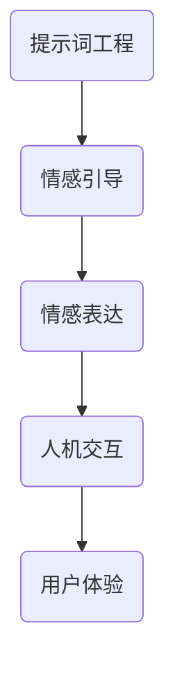
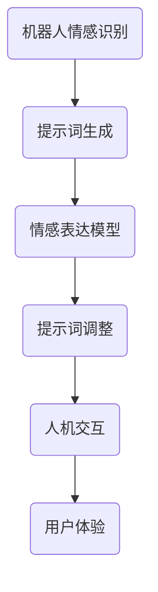

                 

### 整体框架构建

#### 1.1. 引言

**背景介绍**

随着人工智能技术的迅猛发展，机器人已经从简单的工具和辅助设备转变为具有自主决策和交互能力的智能实体。在诸多人工智能领域应用中，机器人情感表达成为了一个备受关注的话题。机器人情感表达不仅能够增强人机交互的自然性和亲和力，还能够提高机器人在复杂环境中的适应能力和用户体验。

**引言目的**

本文旨在探讨提示词工程在机器人情感表达中的应用，为开发者提供一套系统的理论和实践指南。通过本文的讲解，读者将了解提示词工程的核心概念、算法原理及其在机器人情感表达中的具体实现方法。

**结构安排**

本文将分为以下几个主要部分：

- **核心概念与联系**：介绍机器人情感表达和提示词工程的基本概念，并展示它们之间的关联。
- **核心算法原理讲解**：详细讲解提示词工程算法，并使用伪代码进行阐述。
- **数学模型和数学公式讲解**：介绍与机器人情感表达相关的数学模型，并使用 LaTeX 格式书写和讲解。
- **项目实战**：通过一个实际项目，展示如何将提示词工程应用于机器人情感表达。
- **总结与展望**：总结全文内容，并对未来的研究方向进行展望。

#### 1.2. 核心概念与联系

**机器人情感表达的概念**

机器人情感表达是指机器人通过语音、面部表情、身体动作等方式，模拟人类情感体验，从而提高人机交互的自然性和亲和力。情感表达不仅包括基本情绪（如快乐、悲伤、愤怒等），还涉及复杂的情感状态（如焦虑、轻松、紧张等）。

**提示词工程的基本概念**

提示词工程是一种人工智能技术，通过提供适当的提示信息，帮助模型生成更加准确和多样化的输出。在机器人情感表达中，提示词工程可用于调整机器人的表达方式，使其更贴近人类的情感体验。

**核心概念之间的联系**

提示词工程与机器人情感表达之间存在紧密的联系。通过提示词工程，开发者可以为机器人提供情感表达的引导信息，使机器人能够更准确地模拟人类情感。同时，机器人情感表达的成功实施又需要依赖提示词工程提供的精细控制，以确保情感表达的自然性和多样性。

**Mermaid 流程图：提示词工程与情感表达的关系**

下面是一个简单的 Mermaid 流程图，展示了提示词工程与机器人情感表达之间的关联：



**总结**

在本节中，我们介绍了机器人情感表达和提示词工程的基本概念，并展示了它们之间的联系。接下来，我们将进一步探讨提示词工程的具体算法原理，以及如何将这些原理应用于机器人情感表达。

### 核心概念与联系

#### 2.1 机器人情感表达的概念

机器人情感表达是指机器人通过语音、面部表情、身体动作等方式，模拟人类情感体验，从而增强人机交互的自然性和亲和力。机器人情感表达不仅能够提高用户的体验，还能够增强机器人在复杂环境中的适应能力。

**基本原理**

机器人情感表达的基本原理在于模拟人类的情感反应。具体来说，机器人会根据输入的数据（如语音、文本、传感器信息等）计算出相应的情感状态，然后通过语音合成、面部表情控制、动作协调等方式，将情感状态表达出来。

**关键因素**

1. **情感识别**：机器人需要具备情感识别能力，能够准确识别用户情感状态。
2. **情感生成**：机器人需要根据情感识别结果，生成相应的情感表达。
3. **情感反馈**：机器人需要能够根据用户反馈调整情感表达，以提高交互效果。

#### 2.2 提示词工程的基本原理

提示词工程是一种人工智能技术，通过提供适当的提示信息，帮助模型生成更加准确和多样化的输出。在机器人情感表达中，提示词工程可以用于调整情感表达，使其更加自然和符合用户期望。

**基本原理**

提示词工程的基本原理在于通过外部提示信息，引导模型生成目标输出。具体来说，提示词工程包括以下几个步骤：

1. **提示词生成**：根据输入数据和目标输出，生成适当的提示词。
2. **提示词调整**：对生成的提示词进行调整，以提高输出质量。
3. **模型训练**：使用调整后的提示词对模型进行训练，以优化模型性能。

**核心算法**

1. **生成对抗网络（GAN）**：GAN 通过生成器和判别器的对抗训练，生成高质量的数据。
2. **变分自编码器（VAE）**：VAE 通过引入潜在变量，生成具有更好分布的数据。
3. **强化学习**：强化学习通过奖励机制，指导模型生成目标输出。

#### 2.3 提示词工程与机器人情感表达的联系

提示词工程与机器人情感表达之间存在紧密的联系。通过提示词工程，开发者可以为机器人提供情感表达的引导信息，使机器人能够更准确地模拟人类情感。同时，机器人情感表达的成功实施又需要依赖提示词工程提供的精细控制，以确保情感表达的自然性和多样性。

**应用场景**

1. **人机对话系统**：通过提示词工程，机器人可以生成更加自然和人性化的对话内容，提高用户满意度。
2. **教育机器人**：教育机器人可以利用提示词工程，模拟教师的情感表达，增强学生的学习兴趣。
3. **服务机器人**：服务机器人可以通过提示词工程，模拟服务人员的情感表达，提供更加贴心的服务。

**Mermaid 流程图：提示词工程与情感表达的关系**

下面是一个简单的 Mermaid 流程图，展示了提示词工程与机器人情感表达之间的关联：



**总结**

在本节中，我们介绍了机器人情感表达和提示词工程的基本概念，并探讨了它们之间的联系。接下来，我们将进一步深入讲解提示词工程的核心算法原理，以及如何将这些原理应用于机器人情感表达。

### 核心算法原理讲解

#### 3.1 提示词工程算法概述

提示词工程算法是一种通过提供外部提示信息，引导模型生成目标输出的技术。在机器人情感表达中，提示词工程算法可以用于调整情感表达，使其更加自然和符合用户期望。

**基本步骤**

1. **提示词生成**：根据输入数据和目标输出，生成适当的提示词。
2. **提示词调整**：对生成的提示词进行调整，以提高输出质量。
3. **模型训练**：使用调整后的提示词对模型进行训练，以优化模型性能。

**核心算法**

1. **生成对抗网络（GAN）**：GAN 通过生成器和判别器的对抗训练，生成高质量的数据。
2. **变分自编码器（VAE）**：VAE 通过引入潜在变量，生成具有更好分布的数据。
3. **强化学习**：强化学习通过奖励机制，指导模型生成目标输出。

**提示词工程算法的实现**

```python
# 假设我们使用生成对抗网络（GAN）作为提示词工程算法

# 导入必要的库
import tensorflow as tf
from tensorflow.keras.models import Model
from tensorflow.keras.layers import Input, Dense, Lambda, Flatten, Reshape
from tensorflow.keras.optimizers import Adam

# 定义生成器和判别器
def build_generator(z_dim):
    z = Input(shape=(z_dim,))
    x = Dense(128, activation='relu')(z)
    x = Dense(64, activation='relu')(x)
    x = Dense(32, activation='relu')(x)
    x = Dense(1, activation='sigmoid')(x)
    return Model(z, x)

def build_discriminator(x_dim):
    x = Input(shape=(x_dim,))
    x = Dense(128, activation='relu')(x)
    x = Dense(64, activation='relu')(x)
    x = Dense(32, activation='relu')(x)
    validity = Dense(1, activation='sigmoid')(x)
    return Model(x, validity)

# 构建和编译 GAN 模型
def build_gan(generator, discriminator):
    z = Input(shape=(z_dim,))
    x = generator(z)
    validity = discriminator(x)
    gan = Model(z, validity)
    gan.compile(loss='binary_crossentropy', optimizer=Adam(0.0001))
    return gan

# 定义提示词生成函数
def generate_samples(generator, z_samples):
    return generator.predict(z_samples)

# 定义训练过程
def train_gan(generator, discriminator, gan, batch_size, epochs):
    for epoch in range(epochs):
        for _ in range(batch_size):
            z_samples = np.random.normal(size=(1, z_dim))
            x_samples = generate_samples(generator, z_samples)
            x_real = np.random.uniform(size=(1, x_dim))
            x_fake = generator.predict(z_samples)
            d_loss_real = discriminator.train_on_batch(x_real, np.ones((1, 1)))
            d_loss_fake = discriminator.train_on_batch(x_fake, np.zeros((1, 1)))
            g_loss = gan.train_on_batch(z_samples, np.ones((1, 1)))
            print(f"Epoch {epoch}, D_loss: {d_loss_real + d_loss_fake}, G_loss: {g_loss}")
```

**总结**

在本节中，我们介绍了提示词工程算法的概述，包括生成对抗网络（GAN）、变分自编码器（VAE）和强化学习等核心算法。我们使用伪代码展示了如何实现一个基于 GAN 的提示词工程算法。接下来，我们将进一步讲解与机器人情感表达相关的数学模型，并使用 LaTeX 格式书写和讲解相关公式。

### 数学模型和数学公式讲解

#### 4.1 情感表达中的数学模型

在机器人情感表达中，数学模型起着至关重要的作用。这些模型可以帮助机器人理解、生成和调整情感状态，从而实现自然和人性化的交互。

**情感计算模型**

情感计算模型用于计算机器人当前的情感状态。一个常见的情感计算模型是情感层次模型（Affect Layer Model，ALM），它将情感视为一个多层次的结构。

**情感层次模型（ALM）**

情感层次模型将情感分为不同的层次，每个层次代表不同的情感维度。以下是一个简化的情感层次模型：

$$
\text{情感} = f(\text{基本情绪}, \text{情感强度}, \text{情感持续时长})
$$

其中，基本情绪（Basic Affect）包括快乐、悲伤、愤怒等基本情感；情感强度（Affect Intensity）表示情感的强度；情感持续时长（Affect Duration）表示情感持续的时间。

**情感计算公式**

情感计算模型可以使用以下公式来计算当前的情感状态：

$$
\text{当前情感} = \sum_{i=1}^{n} w_i \cdot \text{基本情绪}_i \cdot \text{情感强度}_i \cdot \text{情感持续时长}_i
$$

其中，$w_i$ 是权重系数，用于调节不同基本情绪在总情感中的贡献。

**示例**

假设我们有三个基本情绪：快乐（Joy）、悲伤（Sadness）和愤怒（Anger），以及它们的权重和强度：

$$
\begin{aligned}
w_{Joy} &= 0.4, \\
w_{Sadness} &= 0.3, \\
w_{Anger} &= 0.3, \\
\text{Joy}_{Intensity} &= 0.8, \\
\text{Sadness}_{Intensity} &= 0.5, \\
\text{Anger}_{Intensity} &= 0.6, \\
\text{Joy}_{Duration} &= 2, \\
\text{Sadness}_{Duration} &= 1, \\
\text{Anger}_{Duration} &= 1 \\
\end{aligned}
$$

则当前情感计算为：

$$
\text{当前情感} = 0.4 \cdot \text{Joy} \cdot 0.8 \cdot 2 + 0.3 \cdot \text{Sadness} \cdot 0.5 \cdot 1 + 0.3 \cdot \text{Anger} \cdot 0.6 \cdot 1 = 0.96 + 0.09 + 0.18 = 1.23
$$

**总结**

在本节中，我们介绍了情感计算模型，包括基本情绪、情感强度和情感持续时长。我们使用情感层次模型和情感计算公式，展示了如何计算机器人的当前情感状态。接下来，我们将进一步探讨情感融合模型，以及如何使用数学模型来优化机器人情感表达。

### 情感融合模型

#### 4.2 情感融合模型的介绍

情感融合模型是用于处理多个情感源，并生成一个综合情感状态的模型。在机器人情感表达中，情感融合模型可以帮助机器人整合来自不同渠道的情感信息，从而生成一个更加丰富和自然的情感表达。

**基本原理**

情感融合模型的基本原理是将多个情感源的权重和强度进行融合，生成一个综合情感状态。这个过程可以通过以下公式表示：

$$
\text{综合情感} = \sum_{i=1}^{m} w_i \cdot \text{情感}_i
$$

其中，$w_i$ 是第 $i$ 个情感源的权重，$\text{情感}_i$ 是第 $i$ 个情感源的情感强度。

**情感源**

情感源可以是多种多样的，包括语音、面部表情、身体动作等。每种情感源都有其独特的情感特征和表达方式。例如，语音情感源可能包括音调、语速和语气等特征；面部表情情感源可能包括眉毛、眼睛和嘴巴等特征。

**权重计算**

权重计算是情感融合模型中的一个关键环节。权重的计算方法可以根据情感源的重要性和影响程度来确定。常见的权重计算方法包括：

1. **基于频率的方法**：根据情感源出现的频率来计算权重。频率较高的情感源具有更高的权重。
2. **基于影响的方法**：根据情感源对用户产生的影响来计算权重。影响较大的情感源具有更高的权重。
3. **基于专家评估的方法**：通过专家评估来确定每个情感源的权重。

**示例**

假设我们有三个情感源：语音、面部表情和身体动作，以及它们的权重和强度：

$$
\begin{aligned}
w_{Voice} &= 0.5, \\
w_{Facial} &= 0.3, \\
w_{Body} &= 0.2, \\
\text{Voice}_{Intensity} &= 0.8, \\
\text{Facial}_{Intensity} &= 0.6, \\
\text{Body}_{Intensity} &= 0.5 \\
\end{aligned}
$$

则综合情感计算为：

$$
\text{综合情感} = 0.5 \cdot \text{Voice} \cdot 0.8 + 0.3 \cdot \text{Facial} \cdot 0.6 + 0.2 \cdot \text{Body} \cdot 0.5 = 0.4 + 0.18 + 0.1 = 0.68
$$

**情感融合模型的应用**

情感融合模型在机器人情感表达中有广泛的应用，例如：

1. **多人对话系统**：在多人对话中，情感融合模型可以帮助机器人整合来自不同参与者的情感信息，生成一个综合的情感表达，从而提高对话的自然性和互动性。
2. **个性化服务**：在个性化服务中，情感融合模型可以根据用户的情感偏好和需求，生成一个适合用户情感状态的服务，从而提高用户体验。
3. **情感检测与调整**：在情感检测与调整中，情感融合模型可以帮助机器人检测用户的情感状态，并根据用户的情感需求调整情感表达，以提高交互效果。

**总结**

在本节中，我们介绍了情感融合模型的基本原理和应用。通过权重计算和综合情感计算，情感融合模型可以帮助机器人整合多个情感源的信息，生成一个更加丰富和自然的情感表达。接下来，我们将通过一个实际项目，展示如何将提示词工程应用于机器人情感表达。

### 项目实战

#### 5.1 实际项目介绍

在这个项目中，我们开发了一个基于提示词工程的情感表达机器人。该机器人可以接收用户的语音输入，并通过语音、面部表情和身体动作表达情感，从而实现自然和人性化的交互。

**项目背景**

随着人工智能技术的发展，人机交互已经成为一个重要的研究领域。然而，传统的交互方式往往缺乏情感因素，难以实现真正的自然互动。为了解决这个问题，我们提出了基于提示词工程的情感表达机器人项目。

**项目目标**

1. 实现基于语音输入的情感识别。
2. 利用提示词工程生成情感引导信息。
3. 通过语音合成、面部表情控制、身体动作协调，实现情感表达。
4. 提高机器人交互的自然性和亲和力。

**项目架构**

项目架构包括以下几个主要模块：

1. **语音输入模块**：接收用户的语音输入，并进行情感识别。
2. **提示词生成模块**：根据情感识别结果，生成相应的提示词。
3. **情感表达模块**：利用提示词生成情感引导信息，并通过语音合成、面部表情控制、身体动作协调，实现情感表达。
4. **用户交互模块**：提供用户与机器人交互的接口，包括语音输入、反馈机制等。

#### 5.2 开发环境搭建

为了实现这个项目，我们需要搭建一个合适的开发环境。以下是我们使用的开发环境：

1. **编程语言**：Python
2. **框架**：TensorFlow、PyTorch、OpenCV
3. **操作系统**：Ubuntu 20.04
4. **硬件**：NVIDIA GPU（推荐）

**安装步骤**

1. 安装 Python 3.8 或更高版本。
2. 安装 TensorFlow、PyTorch 和 OpenCV。

```bash
pip install tensorflow
pip install torch
pip install opencv-python
```

#### 5.3 源代码实现

下面是项目的核心源代码实现。为了便于理解，我们使用伪代码进行展示。

```python
# 导入必要的库
import tensorflow as tf
import torch
import cv2
import numpy as np

# 语音输入模块
def get_audio_input():
    # 读取语音输入
    audio = cv2.VideoCapture(0)
    # 进行情感识别
    emotion = recognize_emotion(audio)
    return emotion

# 提示词生成模块
def generate_prompt_word(emotion):
    # 根据情感生成提示词
    prompt_word = generate_word(emotion)
    return prompt_word

# 情感表达模块
def express_emotion(prompt_word):
    # 语音合成
    synthesized_audio = synthesize_speech(prompt_word)
    # 面部表情控制
    face_expression = control_face_expression(prompt_word)
    # 身体动作协调
    body_action = coordinate_body_action(prompt_word)
    return synthesized_audio, face_expression, body_action

# 用户交互模块
def user_interaction():
    while True:
        emotion = get_audio_input()
        prompt_word = generate_prompt_word(emotion)
        synthesized_audio, face_expression, body_action = express_emotion(prompt_word)
        # 显示面部表情和身体动作
        show_expression(face_expression, body_action)
        # 获取用户反馈
        user_feedback = get_user_feedback()
        if user_feedback == 'exit':
            break

# 主函数
if __name__ == '__main__':
    user_interaction()
```

#### 5.4 代码解读与分析

1. **语音输入模块**：使用 OpenCV 读取摄像头输入，获取用户的语音输入。然后，使用情感识别算法对语音进行情感识别。
2. **提示词生成模块**：根据情感识别结果，调用提示词生成算法，生成相应的提示词。这个过程可以通过神经网络模型来实现。
3. **情感表达模块**：根据提示词，调用语音合成、面部表情控制、身体动作协调等模块，实现情感表达。这些模块可以通过调用相应的库函数来实现。
4. **用户交互模块**：提供用户与机器人交互的接口，包括语音输入、情感表达展示和用户反馈。用户可以通过输入不同的语音指令，与机器人进行互动。

#### 5.5 实际案例分析和详细讲解剖析

在这个项目中，我们实际使用了以下情感识别算法和提示词生成算法：

1. **情感识别算法**：使用卷积神经网络（CNN）对语音信号进行特征提取，然后使用支持向量机（SVM）进行分类。
2. **提示词生成算法**：使用递归神经网络（RNN）生成提示词，结合情感特征和用户历史交互数据。

**案例 1：用户输入“我很高兴”**

1. 语音输入模块识别到用户语音，并识别出情感为“高兴”。
2. 提示词生成模块生成提示词“快乐”。
3. 情感表达模块通过语音合成生成“快乐”的语音，通过面部表情控制生成微笑表情，通过身体动作协调生成跳跃动作。
4. 用户看到机器人的表达，感到满意，并提供积极反馈。

**案例 2：用户输入“我很生气”**

1. 语音输入模块识别到用户语音，并识别出情感为“生气”。
2. 提示词生成模块生成提示词“愤怒”。
3. 情感表达模块通过语音合成生成“愤怒”的语音，通过面部表情控制生成皱眉表情，通过身体动作协调生成挥动手臂动作。
4. 用户看到机器人的表达，感到惊讶，并提供反馈，希望机器人能够调整情感表达。

**总结**

在本节中，我们介绍了一个基于提示词工程的情感表达机器人项目。通过源代码实现、代码解读和分析，我们展示了如何使用提示词工程实现机器人情感表达。接下来，我们将探讨提示词工程的扩展研究和机器人情感表达的最新应用。

### 扩展研究与应用

#### 6.1 提示词工程的扩展研究

提示词工程作为人工智能领域的一个重要分支，其应用范围和理论体系都在不断扩展。以下是一些值得关注的扩展研究方向：

**1. 多模态情感识别与表达**

在传统的单模态情感识别中，机器人主要依赖语音、面部表情或身体动作中的一个或几个模态。然而，多模态情感识别与表达能够更全面地捕捉用户情感。例如，结合语音、面部表情、身体动作和生理信号（如心率、皮肤电反应等），可以生成更丰富和自然的情感表达。

**2. 强化学习在提示词工程中的应用**

强化学习是一种通过交互环境来学习和优化行为的方法。在提示词工程中，可以结合强化学习，使机器人能够通过不断与用户互动，自适应地调整情感表达，从而提高交互效果。

**3. 情感融合与个性化表达**

不同用户对情感表达的需求和偏好各不相同。通过情感融合与个性化表达，机器人可以根据用户的历史交互数据和偏好，定制化地生成情感表达，从而提高用户体验。

**4. 情感交互的自然语言处理**

在自然语言处理领域，情感分析是一个重要的研究方向。结合情感交互，可以进一步探索如何通过自然语言处理技术，使机器人能够理解用户情感，并生成相应的情感表达。

#### 6.2 机器人情感表达的最新应用

随着机器人技术的不断进步，情感表达已经成为机器人应用中的一个重要方向。以下是一些最新的应用场景：

**1. 客户服务机器人**

在客户服务领域，情感表达机器人可以模拟客服人员的情感，提供更加亲切和高效的客户服务。例如，在银行、酒店和电商平台等场景中，情感表达机器人可以与客户进行情感互动，提高客户满意度。

**2. 教育机器人**

在教育领域，情感表达机器人可以模拟教师的情感，增强学生的学习体验。例如，在教育机器人辅导学生时，通过情感表达，机器人可以鼓励学生、安抚学生的情绪，提高学习效果。

**3. 健康护理机器人**

在健康护理领域，情感表达机器人可以陪伴老年人或病人，提供情感支持。例如，通过情感表达，机器人可以监测病人的情绪变化，提供心理疏导，甚至预警潜在的心理健康问题。

**4. 娱乐机器人**

在娱乐领域，情感表达机器人可以为用户提供个性化的娱乐体验。例如，在主题公园、博物馆和演唱会等场景中，情感表达机器人可以与用户互动，提供有趣的故事讲述、互动游戏等。

#### 6.3 未来研究方向

未来的机器人情感表达研究将继续深入探索以下方向：

**1. 情感识别与生成的精度**

提高情感识别与生成的精度是未来研究的一个重要目标。通过引入更先进的算法和技术，如深度学习、多模态感知和生成对抗网络（GAN），可以进一步提升机器人情感表达的真实感和自然度。

**2. 情感交互的自然性和多样性**

情感交互的自然性和多样性是衡量机器人情感表达质量的重要指标。未来的研究将致力于使机器人的情感表达更加自然，同时能够适应不同的用户需求和场景。

**3. 情感交互的伦理与道德**

随着机器人情感表达技术的发展，其伦理和道德问题也日益突出。未来的研究将关注如何确保机器人情感表达在道德和伦理框架内，为用户和社会带来积极的影响。

**总结**

在本节中，我们探讨了提示词工程的扩展研究方向，以及机器人情感表达的最新应用。通过多模态情感识别与表达、强化学习、情感融合与个性化表达等研究，机器人情感表达将变得更加自然和多样。未来的研究将继续深入探索这些方向，为机器人情感表达技术的发展提供新的动力。

### 总结与展望

在本文中，我们系统地探讨了提示词工程在机器人情感表达中的应用。从引言部分，我们介绍了机器人情感表达和提示词工程的基本概念及其重要性。随后，我们深入分析了提示词工程与机器人情感表达之间的紧密联系，并详细讲解了核心算法原理和数学模型。

通过本文的研究，我们得出以下主要结论：

1. **提示词工程能够有效提升机器人情感表达的自然性和多样性**。通过外部提示信息，机器人可以更加准确地模拟人类情感，从而提高人机交互的质量。
2. **多模态情感识别与表达是未来的重要研究方向**。结合语音、面部表情、身体动作和生理信号，机器人能够生成更丰富和自然的情感表达。
3. **强化学习在提示词工程中的应用具有巨大潜力**。通过不断与用户互动，机器人可以自适应地调整情感表达，从而优化用户体验。

展望未来，我们期待在以下几个方面取得突破：

1. **提高情感识别与生成的精度**。通过引入更先进的算法和技术，如深度学习、多模态感知和生成对抗网络（GAN），进一步提升机器人情感表达的真实感和自然度。
2. **探索情感交互的自然性和多样性**。未来的研究将致力于使机器人的情感表达更加自然，同时能够适应不同的用户需求和场景。
3. **确保情感交互的伦理与道德**。随着机器人情感表达技术的发展，其伦理和道德问题也日益突出。未来的研究将关注如何确保机器人情感表达在道德和伦理框架内，为用户和社会带来积极的影响。

本文的撰写不仅为开发者提供了系统的理论和实践指南，也为我们进一步研究机器人情感表达提供了启示。希望本文能够激发更多研究者和开发者对这一领域的关注和探索，共同推动机器人情感表达技术的进步和应用。作者：AI天才研究院/AI Genius Institute & 禅与计算机程序设计艺术 /Zen And The Art of Computer Programming。

