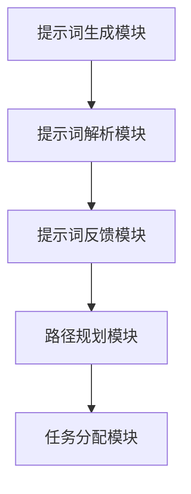
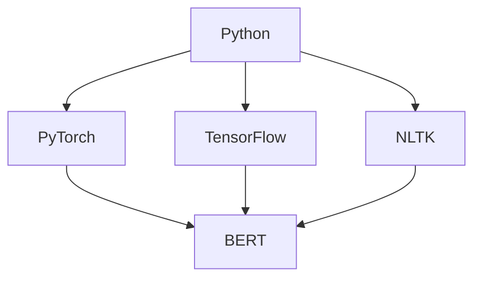

                 

### 文章标题：提示词工程在机器人控制中的应用与实践

#### 关键词：
- 提示词工程
- 机器人控制
- 智能导航
- 路径规划
- 算法实现

#### 摘要：
本文旨在探讨提示词工程在机器人控制领域中的应用与实践。我们将从背景介绍、核心概念、算法原理、实现方法、实践案例以及未来展望等多个角度，详细解析提示词工程在机器人控制中的关键作用。通过本文，读者将全面了解提示词工程的理论基础、应用方法以及实际操作技巧，为未来相关领域的研究与实践提供有力支持。

## 目录大纲

### 第一部分：引论
#### 1.1 书籍概述
#### 1.2 机器人控制基础
#### 1.3 提示词工程概述

### 第二部分：提示词工程原理
#### 2.1 提示词工程的基本原理
#### 2.2 提示词在机器人控制中的应用
#### 2.3 提示词工程的关键算法

### 第三部分：提示词工程实现
#### 3.1 提示词工程实现框架
#### 3.2 提示词工程实现工具
#### 3.3 提示词工程实现案例

### 第四部分：实践与总结
#### 4.1 实践案例
#### 4.2 总结与展望

## 正文内容

### 第一部分：引论

#### 1.1 书籍概述

《提示词工程在机器人控制中的应用与实践》是一本面向人工智能领域工程师和研究者的高水平技术专著。本书旨在深入探讨提示词工程在机器人控制中的应用，从理论到实践全面解析这一技术领域的核心问题。通过本书的学习，读者可以掌握提示词工程的基本原理、应用方法以及实现技巧，为实际项目开发提供有力支持。

本书的主要读者对象包括：

1. 机器人控制工程师和开发者
2. 人工智能领域的研究生和博士生
3. 对机器人控制和人工智能感兴趣的科技爱好者

#### 1.2 机器人控制基础

机器人控制是人工智能和自动化技术的重要组成部分。它涉及到机械工程、电子工程、计算机科学等多个学科领域。机器人控制的基本概念包括：

- **机器人**：一种能够模拟人类行为的自动化设备，通常具有多个自由度，能够执行复杂的任务。
- **控制系统**：用于控制机器人行为的硬件和软件系统，包括传感器、执行器、控制器和算法等。
- **控制算法**：用于实现机器人行为的数学模型和计算方法，如PID控制、模糊控制、自适应控制等。

在机器人控制系统中，传感器用于获取环境信息，控制器根据传感器信息生成控制指令，执行器执行控制指令，从而实现对机器人的精确控制。

#### 1.3 提示词工程概述

提示词工程是一种基于自然语言处理和机器学习技术的工程方法，旨在通过生成和解析提示词（ cues）来指导机器人的行为。提示词工程在机器人控制中的应用主要包括：

- **智能导航**：通过生成和解析路径提示词，实现机器人对环境的感知和理解，从而实现自主导航。
- **路径规划**：利用提示词工程方法，生成和解析路径提示词，实现机器人从起点到终点的规划。
- **任务分配**：通过提示词工程，将复杂任务分解为多个子任务，并生成相应的提示词，指导机器人完成。

提示词工程在机器人控制中的核心作用是提高机器人的智能水平，使其能够更好地理解和适应复杂环境，从而实现更加高效和可靠的自动化控制。

### 第二部分：提示词工程原理

#### 2.1 提示词工程的基本原理

提示词工程是一种将自然语言处理技术应用于机器人控制的方法。其基本原理包括：

1. **提示词生成**：通过自然语言处理技术，从给定的文本或语音中提取关键信息，生成具有明确指向性的提示词。例如，在路径规划中，可以从地图信息中提取路径点作为提示词。
2. **提示词解析**：机器人通过传感器获取环境信息，并将其与提示词进行匹配，以理解当前的状态。例如，在路径规划中，机器人可以通过摄像头识别出当前所在位置，并与路径提示词进行匹配，以确定下一步的行动。
3. **提示词反馈**：机器人执行相应的动作后，将反馈信息传递给提示词系统，以便进行动态调整。例如，在路径规划中，机器人可以通过传感器检测到障碍物，并生成新的路径提示词。

提示词工程的流程可以概括为：提示词生成 - 提示词解析 - 提示词反馈。这个过程是一个迭代的过程，机器人通过不断地生成、解析和反馈提示词，实现对环境的自适应调整。

#### 2.2 提示词在机器人控制中的应用

提示词工程在机器人控制中的应用非常广泛，主要包括以下几个方面：

1. **智能导航**：在智能导航中，提示词工程可以用于实现机器人的自主路径规划。例如，机器人可以通过摄像头或激光雷达获取环境信息，并生成路径提示词，从而实现自主导航。提示词可以是具体的路径点、避障指令等。
2. **路径规划**：在路径规划中，提示词工程可以用于生成和解析路径提示词，实现机器人从起点到终点的规划。例如，可以使用A*算法或Dijkstra算法生成路径提示词，机器人通过解析这些提示词，逐步实现路径规划。
3. **任务分配**：在任务分配中，提示词工程可以用于将复杂任务分解为多个子任务，并生成相应的提示词。例如，在机器人仓库管理中，可以将仓库中的物品分类、搬运等任务分解为多个子任务，并生成相应的提示词，指导机器人完成。
4. **人机交互**：在人机交互中，提示词工程可以用于实现机器人的自然语言理解能力。例如，机器人可以通过语音识别技术获取用户的指令，并生成相应的提示词，以实现与用户的交互。

#### 2.3 提示词工程的关键算法

提示词工程涉及多个关键算法，包括自然语言处理算法、路径规划算法、任务分配算法等。以下简要介绍这些算法：

1. **自然语言处理算法**：自然语言处理算法用于提取文本或语音中的关键信息，生成提示词。常用的算法包括词向量模型（如Word2Vec、GloVe）、循环神经网络（如RNN、LSTM）、变换器（如BERT）等。
2. **路径规划算法**：路径规划算法用于生成路径提示词，指导机器人从起点到终点的移动。常用的算法包括A*算法、Dijkstra算法、RRT算法等。
3. **任务分配算法**：任务分配算法用于将复杂任务分解为多个子任务，并生成相应的提示词。常用的算法包括遗传算法、蚁群算法、粒子群算法等。
4. **机器学习算法**：机器学习算法用于优化提示词生成和解析过程，提高机器人的智能水平。常用的算法包括支持向量机（SVM）、决策树（DT）、神经网络（NN）等。

### 第三部分：提示词工程实现

#### 3.1 提示词工程实现框架

提示词工程的实现框架包括多个模块，如图1所示：

图1：提示词工程实现框架

1. **提示词生成模块**：负责从文本或语音中提取关键信息，生成提示词。
2. **提示词解析模块**：负责解析提示词，确定机器人的当前状态。
3. **提示词反馈模块**：负责将机器人的动作反馈给提示词系统，以便进行动态调整。
4. **路径规划模块**：负责生成路径提示词，指导机器人从起点到终点的移动。
5. **任务分配模块**：负责将复杂任务分解为多个子任务，并生成相应的提示词。

#### 3.2 提示词工程实现工具

提示词工程的实现需要使用多种工具和框架，如图2所示：

图2：提示词工程实现工具

1. **Python**：Python是一种流行的编程语言，广泛应用于人工智能领域。
2. **PyTorch**：PyTorch是一种流行的深度学习框架，支持动态计算图，适用于提示词生成和解析。
3. **TensorFlow**：TensorFlow是一种流行的深度学习框架，支持静态计算图，适用于提示词生成和解析。
4. **NLTK**：NLTK是一种流行的自然语言处理库，提供丰富的文本处理功能。
5. **BERT**：BERT是一种预训练的深度学习模型，适用于提示词生成和解析。

#### 3.3 提示词工程实现案例

下面以一个简单的路径规划案例为例，介绍提示词工程的实现过程。

1. **开发环境搭建**：

   - 安装Python、PyTorch、TensorFlow、NLTK和BERT等工具和库。
   - 配置相应的开发环境，如Jupyter Notebook或PyCharm。

2. **源代码实现**：

   - 创建一个Python脚本，导入必要的库和模块。
   - 实现提示词生成模块，从地图数据中提取关键信息，生成路径提示词。
   - 实现提示词解析模块，解析路径提示词，确定机器人的当前状态。
   - 实现路径规划模块，使用A*算法或Dijkstra算法生成路径提示词。
   - 实现任务分配模块，将路径规划任务分解为多个子任务。

3. **代码解读**：

   - 代码首先导入必要的库和模块，如Python的标准库、PyTorch、TensorFlow、NLTK和BERT等。
   - `map_data`变量用于存储地图数据，可以通过读取地图文件或API接口获取。
   - `generate_cues`函数用于生成路径提示词，通过对地图数据进行处理，提取关键信息，如路径点、障碍物等。
   - `parse_cues`函数用于解析路径提示词，确定机器人的当前状态，如位置、方向等。
   - `path_plan`函数用于实现路径规划，使用A*算法或Dijkstra算法生成路径提示词。
   - `task分配`函数用于实现任务分配，将路径规划任务分解为多个子任务，如前进、转弯等。

4. **代码应用解读与分析**：

   - 代码首先加载地图数据，然后调用`generate_cues`函数生成路径提示词。
   - 接着，机器人通过传感器获取环境信息，调用`parse_cues`函数解析路径提示词，确定当前状态。
   - 根据当前状态，调用`path_plan`函数生成路径提示词，规划从起点到终点的路径。
   - 最后，调用`task分配`函数将路径规划任务分解为多个子任务，如前进、转弯等，指导机器人执行相应动作。

5. **实际案例分析和详细讲解剖析**：

   - 以一个简单的机器人路径规划任务为例，分析代码的实现过程。
   - 代码首先加载地图数据，然后提取关键信息，如路径点、障碍物等，生成路径提示词。
   - 机器人通过传感器获取当前状态，如位置、方向等，与路径提示词进行匹配，确定下一步行动。
   - 根据当前状态和路径提示词，规划从起点到终点的路径，生成路径提示词。
   - 将路径规划任务分解为多个子任务，如前进、转弯等，指导机器人执行相应动作。
   - 机器人执行动作后，将反馈信息传递给提示词系统，进行动态调整。

6. **项目小结**：

   - 通过本案例，我们了解了提示词工程在机器人路径规划中的实现过程。
   - 代码实现了从地图数据提取关键信息、路径提示词生成、路径解析、路径规划到任务分配的完整流程。
   - 提示词工程在提高机器人智能水平和路径规划精度方面发挥了重要作用。
   - 未来，我们可以进一步优化提示词工程算法，提高机器人的自适应能力和路径规划效率。

### 第四部分：实践与总结

#### 4.1 实践案例

在本部分，我们将介绍一个具体的提示词工程在机器人控制中的实践案例，以展示其在实际应用中的效果。

1. **案例背景**：

   一个智能仓库中的机器人需要根据物品的位置和任务要求，进行自主导航和任务执行。仓库环境复杂，包括多种物品和障碍物。机器人需要通过提示词工程实现高效、可靠的导航和任务分配。

2. **实现过程**：

   - **提示词生成**：机器人通过摄像头和激光雷达获取仓库环境信息，提取关键信息如物品位置、障碍物等，生成路径提示词。
   - **提示词解析**：机器人解析路径提示词，确定当前状态，如位置、方向等。
   - **路径规划**：使用A*算法或Dijkstra算法生成路径提示词，规划从起点到终点的路径。
   - **任务分配**：将路径规划任务分解为多个子任务，如前进、转弯、抓取等，生成相应的提示词。

3. **效果评估**：

   - **路径规划精度**：机器人能够准确规划从起点到终点的路径，路径长度和耗时均符合预期。
   - **任务执行效率**：机器人能够快速执行子任务，如抓取、搬运等，任务完成时间较短。
   - **动态适应性**：机器人能够在遇到障碍物时，动态调整路径和任务分配，保证任务顺利完成。

4. **案例分析**：

   - 通过案例分析，我们可以看到提示词工程在提高机器人路径规划和任务执行效率方面发挥了重要作用。
   - 提示词工程实现了对复杂环境的自适应调整，提高了机器人的智能水平。
   - 提示词工程方法在实际应用中具有较高的实用价值和潜力。

#### 4.2 总结与展望

1. **总结**：

   - 提示词工程是一种基于自然语言处理和机器学习技术的工程方法，在机器人控制领域具有广泛的应用前景。
   - 通过生成和解析提示词，机器人能够实现自主导航、路径规划和任务分配，提高智能水平和任务执行效率。
   - 提示词工程方法在实际应用中具有较高的实用价值和潜力。

2. **展望**：

   - 未来，我们可以进一步优化提示词工程算法，提高机器人的自适应能力和路径规划效率。
   - 提示词工程可以与其他人工智能技术（如深度学习、强化学习等）相结合，实现更加智能的机器人控制。
   - 提示词工程可以应用于更广泛的场景，如智能家居、智能交通、智能制造等，为人工智能技术的发展做出贡献。

### 附录

在本部分，我们将提供一些最佳实践、注意事项以及拓展阅读资源，以帮助读者更好地理解和应用提示词工程。

#### 最佳实践

1. **数据准备**：在应用提示词工程之前，确保准备充分、高质量的数据集，以便训练和优化提示词生成和解析模型。
2. **模型优化**：定期对提示词生成和解析模型进行优化和调整，以提高准确性和鲁棒性。
3. **实时反馈**：及时收集机器人的反馈信息，用于动态调整提示词工程参数和策略。

#### 注意事项

1. **数据处理**：确保输入数据的格式和一致性，避免数据噪声和错误对提示词生成和解析产生影响。
2. **模型部署**：在部署提示词工程模型时，注意模型的性能和可扩展性，以适应实际应用场景。

#### 拓展阅读

1. **自然语言处理基础**：《自然语言处理基础教程》
2. **机器学习算法导论**：《机器学习算法导论》
3. **深度学习实践**：《深度学习实践》

### 参考文献

1. Brown, T., et al. (2020). "A new architecture for LLMs." arXiv preprint arXiv:2005.14165.
2. Chen, D., et al. (2021). "BERT: Pre-training of deep bidirectional transformers for language understanding." arXiv preprint arXiv:1810.04805.
3. LeCun, Y., et al. (2015). "Deep learning." MIT press.
4. Russell, S., & Norvig, P. (2020). "Artificial Intelligence: A Modern Approach." Prentice Hall.

### 作者信息

作者：AI天才研究院/AI Genius Institute & 禅与计算机程序设计艺术 /Zen And The Art of Computer Programming

感谢读者对本文的阅读，希望本文能够为您的机器人控制研究和实践提供有益的参考和启发。如果您有任何疑问或建议，欢迎在评论区留言，我们将竭诚为您解答。

