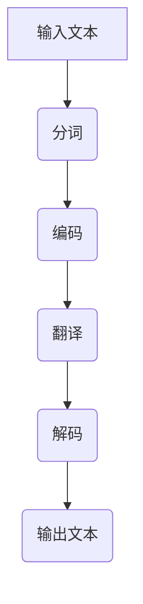
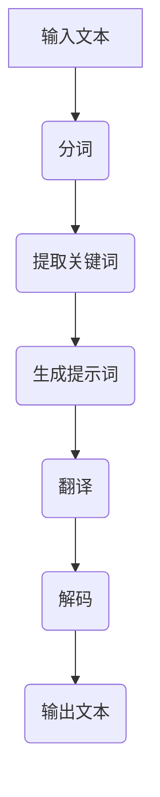

                 

## 第一部分：机器翻译概述

### 第1章：机器翻译基础

#### 1.1 机器翻译的发展历程

机器翻译（Machine Translation，简称MT）作为人工智能领域的一个重要分支，经历了从无到有、从简单到复杂的发展过程。回顾其发展历程，我们可以大致将其分为以下几个阶段：

1. **早期机器翻译方法**：
    - **基于规则的机器翻译**：这种方法依赖于大量的语言学规则和翻译规则，通过对源语言进行语法分析，生成目标语言的句子。这种方法在20世纪50年代至70年代期间非常流行，但由于规则数量庞大，且难以覆盖所有的语言现象，因此效果有限。
    - **基于例子的机器翻译**：这种方法通过收集大量的双语平行文本，利用这些文本中的对应关系进行翻译。早期的例子包括基于词典的翻译系统和基于模板的翻译系统。

2. **统计机器翻译**：
    - **基于统计的机器翻译**：随着计算机性能的提升和数据规模的扩大，20世纪90年代，统计机器翻译（SMT）成为主流。统计机器翻译的核心思想是从大量双语语料中学习出概率模型，使用这些模型进行翻译。统计机器翻译分为基于短语的SMT和基于句子的SMT两种。

3. **神经网络机器翻译**：
    - **基于神经网络的机器翻译**：在深度学习技术的推动下，2014年，神经机器翻译（NMT）开始崭露头角。神经网络机器翻译采用了编码器-解码器（Encoder-Decoder）架构，结合了词向量和注意力机制，大大提高了机器翻译的质量。

4. **当前机器翻译研究热点**：
    - **多语言和低资源语言的翻译**：在全球化的大背景下，如何翻译无足够平行数据支持的低资源语言成为一个研究热点。
    - **语义理解和长文本处理**：理解文本的语义，实现准确的长文本翻译，是当前机器翻译领域的重要研究方向。
    - **机器翻译的评估与优化**：如何评估机器翻译质量，如何通过调整模型参数和算法来优化翻译效果，也是当前的研究重点。

### 1.2 机器翻译的基本原理

要理解机器翻译的基本原理，我们需要从以下几个方面入手：

1. **语言模型**：
    - 语言模型是用来预测文本序列的一种概率模型。在机器翻译中，语言模型通常用于预测目标语言中的下一个词，从而帮助解码器生成翻译结果。

2. **词向量和编码器-解码器架构**：
    - 词向量（Word Embedding）是一种将词语映射到高维空间的表示方法，它使得计算机能够理解和处理语义信息。
    - 编码器-解码器架构是神经网络机器翻译的核心结构，它包括编码器（Encoder）和解码器（Decoder）两部分。编码器将源语言句子编码为一个固定长度的向量表示，解码器则根据这个向量表示生成目标语言句子。

3. **机器翻译中的注意力机制**：
    - 注意力机制（Attention Mechanism）是一种让模型在生成目标语言时关注源语言句子中重要部分的机制。它通过计算源语言句子和目标语言句子之间的关联度，帮助解码器更好地生成翻译结果。

4. **损失函数与优化算法**：
    - 损失函数用于衡量模型翻译结果的准确性，常见的损失函数有交叉熵损失函数。
    - 优化算法用于调整模型参数，以最小化损失函数。常用的优化算法有梯度下降（Gradient Descent）及其变种。

### 1.3 机器翻译中的挑战

尽管机器翻译在过去几十年取得了显著的进展，但在实际应用中仍面临许多挑战：

1. **多语言和低资源语言的翻译**：
    - 多语言翻译要求模型能够支持多种语言的翻译，这对于模型的设计和训练提出了更高的要求。
    - 低资源语言的翻译问题更为突出，因为这类语言缺乏足够的平行数据支持，使得模型难以学习到有效的翻译规则。

2. **语义理解和长文本处理**：
    - 翻译不仅要准确传达词汇和语法信息，还要理解语义，保证翻译的自然性和流畅性。
    - 长文本处理涉及对长篇文章、书籍等文本的翻译，这对于模型的计算能力和翻译效率提出了挑战。

3. **机器翻译的评估与优化**：
    - 如何准确评估机器翻译的质量是一个难题。目前常用的评估指标有BLEU、METEOR等，但这些指标并不能完全反映翻译的准确性。
    - 如何通过优化模型参数和算法来提高翻译质量，仍然需要进一步的研究和实践。

### 第2章：提示词工程概述

#### 2.1 提示词工程的概念

1. **提示词的定义**：
    - 提示词（Prompt）是指在机器翻译过程中，为模型提供额外上下文信息的一种技术手段。通过提供提示词，可以引导模型更好地理解源语言句子，从而生成更准确的翻译结果。

2. **提示词工程的作用**：
    - 提示词工程是提高机器翻译质量的重要手段。通过合理设计提示词，可以有效缓解低资源语言翻译的问题，提高长文本处理的性能，增强机器翻译的自然性和流畅性。

3. **提示词的分类**：
    - **全局提示词**：全局提示词是在整个翻译过程中始终提供的一种提示信息，它通常包含了源语言句子的主要语义信息。
    - **局部提示词**：局部提示词是在翻译过程中针对特定片段或短语提供的一种提示信息，它可以帮助模型更好地理解局部语义。

### 2.2 提示词工程在机器翻译中的应用

1. **提示词对机器翻译质量的影响**：
    - 提示词可以有效提高机器翻译的准确性，尤其是在处理低资源语言和长文本时，提示词的作用尤为明显。
    - 合理设计提示词，可以引导模型关注源语言句子中的关键信息，从而生成更符合预期的翻译结果。

2. **提示词工程中的常见问题**：
    - 提示词的设计和选择需要考虑多种因素，如上下文的连贯性、语义的准确性等，否则可能会导致翻译结果的不准确。
    - 提示词的引入可能会增加模型的计算复杂度，影响翻译的效率。

3. **提示词工程的方法和工具**：
    - 提示词工程的方法主要包括基于规则的方法、基于机器学习的方法和基于深度学习的方法。
    - 提示词工程的工具主要包括自然语言处理工具包，如NLTK、spaCy等，以及机器学习和深度学习框架，如TensorFlow、PyTorch等。

## 核心概念与联系

为了更好地理解机器翻译和提示词工程之间的关系，我们可以通过以下几个核心概念和联系来进行梳理：

### 机器翻译流程图



### 提示词工程流程图



通过上述两个流程图，我们可以看到，提示词工程在机器翻译中起到了关键作用。在机器翻译流程中，提示词的引入使得模型能够更好地理解源语言句子，从而生成更准确的翻译结果。而在提示词工程流程中，关键词提取和提示词生成是核心环节，它们直接影响机器翻译的质量。

### 核心算法原理讲解

#### 编码器-解码器架构伪代码

```python
# 编码器
def encode(input_sequence):
    embeddings = embed(input_sequence)
    hidden_states = []
    for embedding in embeddings:
        hidden_state = RNN(embedding)
        hidden_states.append(hidden_state)
    return hidden_states

# 解码器
def decode(hidden_states, target_sequence):
    logits = decode_hidden_states(hidden_states, target_sequence)
    predicted_words = argmax(logits)
    return predicted_words
```

#### 损失函数与优化算法

- **损失函数**：交叉熵损失函数

```python
def cross_entropy_loss(predictions, targets):
    loss = -sum(targets * log(predictions))
    return loss
```

- **优化算法**：梯度下降及其变种（如Adam优化器）

```python
def gradient_descent(parameters, gradients, learning_rate):
    for parameter, gradient in zip(parameters, gradients):
        parameter -= learning_rate * gradient
```

#### 数学模型和公式

- **语言模型概率计算**：

$$ P(\text{word}_i | \text{word}_1, \text{word}_2, ..., \text{word}_{i-1}) = \frac{P(\text{word}_i, \text{word}_1, \text{word}_2, ..., \text{word}_{i-1})}{P(\text{word}_1, \text{word}_2, ..., \text{word}_{i-1})} $$

- **神经机器翻译损失函数**：

$$ L = -\sum_{i=1}^{N} \sum_{j=1}^{V} y_{ij} \log(p_{ij}) $$

其中，$N$ 是目标句子长度，$V$ 是词汇表大小，$y_{ij}$ 是目标词的one-hot向量，$p_{ij}$ 是模型预测的概率。

### 举例说明

假设我们要翻译的句子是：“我喜欢吃苹果”。以下是基于编码器-解码器架构的神经网络机器翻译过程：

1. **编码器**：将源语言句子“我喜欢吃苹果”编码为一个固定长度的向量表示。

2. **解码器**：在解码过程中，解码器首先生成概率最高的词“我”，然后根据上下文和已生成的词“我”，再次生成概率最高的词“们”，以此类推，直到生成完整的翻译结果“我喜欢吃苹果”。

通过这个过程，我们可以看到，编码器-解码器架构结合词向量和注意力机制，使得机器翻译能够生成准确、自然的翻译结果。

### 提示词工程的实际应用

提示词工程在机器翻译中有着广泛的应用，下面我们通过一个具体案例来说明如何使用提示词来提高翻译质量。

**案例背景**：假设我们要将中文句子“今天是晴天”翻译成英文。由于中文和英文在语法结构、词汇选择等方面存在差异，直接翻译可能会导致翻译结果不自然。

**解决方案**：我们可以为翻译模型提供以下提示词：“今天是晴天，意味着我们可以出去玩耍”。通过提供这个提示词，模型可以更好地理解句子的语义，从而生成更自然的翻译结果。

**具体步骤**：

1. **分词**：将中文句子“今天是晴天”分词为“今天”、“是”、“晴天”。

2. **提取关键词**：从分词结果中提取关键词“晴天”。

3. **生成提示词**：将关键词“晴天”与预先准备的提示词模板结合，生成提示词：“今天是晴天，意味着我们可以出去玩耍”。

4. **翻译**：将源语言句子和提示词输入翻译模型，生成翻译结果。

5. **解码**：将翻译结果解码为自然语言句子。

通过上述步骤，我们可以看到，提示词工程在机器翻译中的应用可以显著提高翻译质量，使翻译结果更贴近人类自然表达。

### 总结

提示词工程在机器翻译中具有重要的应用价值。通过合理设计提示词，可以引导模型更好地理解源语言句子的语义，从而生成更准确、自然的翻译结果。在实际应用中，提示词工程的方法和技术不断演进，为机器翻译领域带来了新的发展机遇。在未来，随着人工智能技术的不断进步，提示词工程将在机器翻译中发挥更加重要的作用。## 第3章：基于规则的方法

### 3.1 规则定义

在机器翻译中，基于规则的方法（Rule-Based Machine Translation, RBMT）通过预先定义的规则将源语言句子转换为目标语言句子。这些规则可以是语言规则，也可以是翻译规则。

1. **语言规则**：
    - 语言规则描述了源语言句子的语法结构，包括词法、句法和语义信息。例如，在中文到英文的翻译中，可能需要定义“的”字在特定语境下的翻译规则。

2. **翻译规则**：
    - 翻译规则描述了如何根据语言规则将源语言单词或短语翻译成目标语言单词或短语。例如，将中文“喜欢”翻译成英文“like”。

### 3.2 规则生成

规则生成是基于规则方法中的关键步骤，它涉及从大量双语平行文本中提取有效的语言规则和翻译规则。

1. **语言规则提取**：
    - 通过对双语平行文本进行解析，可以提取出源语言和目标语言的语法结构。这通常需要使用自然语言处理工具，如语法分析器。

2. **翻译规则生成**：
    - 翻译规则可以通过直接从双语平行文本中匹配对应关系来生成。例如，可以使用基于模板的方法，将源语言中的短语直接映射到目标语言中的短语。

### 3.3 规则应用

规则在机器翻译中的应用主要通过以下几个步骤实现：

1. **规则匹配**：
    - 在翻译过程中，模型会根据源语言句子结构和语义信息，尝试匹配预定义的语言规则和翻译规则。

2. **规则应用与机器翻译**：
    - 当规则匹配成功后，系统会根据翻译规则将源语言单词或短语转换为相应的目标语言单词或短语。例如，根据翻译规则“喜欢”翻译为“like”，将源语言句子“我喜欢这本书”翻译为英文“like this book”。

#### 伪代码示例

```python
# 规则匹配和翻译应用伪代码

def rule_based_translation(source_sentence):
    # 分词源语言句子
    words = tokenize(source_sentence)
    
    # 提取语言规则和翻译规则
    grammar_rules = extract_grammar_rules()
    translation_rules = extract_translation_rules()
    
    # 初始化目标语言句子
    target_sentence = []
    
    # 遍历源语言句子中的每个词
    for word in words:
        # 尝试匹配语言规则
        grammar_match = match_grammar_rules(word, grammar_rules)
        
        if grammar_match:
            # 应用语言规则
            target_word = apply_grammar_rule(word, grammar_match)
        else:
            # 尝试匹配翻译规则
            translation_match = match_translation_rules(word, translation_rules)
            
            if translation_match:
                # 应用翻译规则
                target_word = apply_translation_rule(word, translation_match)
            else:
                # 如果没有匹配到规则，直接映射词到目标语言
                target_word = word
        
        # 添加目标语言词到句子中
        target_sentence.append(target_word)
    
    # 连接目标语言句子
    translated_sentence = ' '.join(target_sentence)
    
    return translated_sentence
```

### 实际案例

**案例背景**：假设我们要将中文句子“他昨天去了图书馆”翻译成英文。

**解决方案**：

1. **规则提取**：
    - 提取语言规则：“昨天”在句子中的位置和功能。
    - 提取翻译规则：“去”翻译为“go to”，“图书馆”翻译为“library”。

2. **规则应用**：
    - 分词：将句子分词为“他”、“昨天”、“去”、“了”、“图书馆”。
    - 匹配语言规则：发现“昨天”符合时间状语规则。
    - 应用翻译规则：“他”翻译为“He”，“昨天”翻译为"yesterday”，“去”翻译为"go to”，“图书馆”翻译为"library”。
    - 生成翻译结果：“He went to the library yesterday”。

### 效果评估

基于规则的方法在翻译准确性和稳定性方面具有一定的优势，尤其在处理特定领域或语法结构简单的语言时表现较好。然而，由于规则数量庞大且难以覆盖所有语言现象，规则方法的翻译质量往往受到限制。为了评估规则方法的效果，我们可以使用以下指标：

1. **准确性**：衡量翻译结果中单词和短语的匹配程度。
2. **一致性**：评估翻译结果在不同场景下的稳定性。
3. **可扩展性**：评估规则方法在添加新规则或新领域时的适应性。

在实际应用中，可以通过人工评估和自动评估相结合的方法来评估规则方法的翻译质量。例如，使用BLEU（Bilingual Evaluation Understudy）等自动化评估工具对翻译结果进行定量评估，同时结合人工评估来识别潜在的问题和改进点。

### 小结

基于规则的方法在机器翻译中具有一定的应用价值，尤其在处理特定领域和语法结构简单的语言时。然而，规则方法的翻译质量受到规则数量和覆盖范围的限制，因此，在实际应用中，通常需要结合其他方法，如统计机器翻译和神经网络机器翻译，以实现更高质量的翻译效果。## 第4章：基于机器学习的方法

### 4.1 特征工程

在机器学习（Machine Learning, ML）方法中，特征工程（Feature Engineering）是提高模型性能的关键步骤。特征工程涉及从原始数据中提取出有助于模型学习的特征，从而提高模型的准确性和泛化能力。

#### 4.1.1 语言特征

1. **词袋模型（Bag of Words, BoW）**：
    - 词袋模型将文本表示为单词的集合，忽略单词的顺序。每个单词对应一个特征，特征值表示该词在文本中出现的次数。

    ```python
    # 词袋模型伪代码
    def bag_of_words(text):
        words = tokenize(text)
        word_counts = Counter(words)
        return word_counts
    ```

2. **TF-IDF（Term Frequency-Inverse Document Frequency）**：
    - TF-IDF是一种常用特征表示方法，它考虑了词频（TF）和逆文档频率（IDF），用于衡量词语在文档中的重要程度。

    ```python
    # TF-IDF伪代码
    def tf_idf(text, corpus):
        tf = Counter(words)
        idf = {word: log(1 + N / n) for word, n in collections.Counter(corpus).items()}
        tf_idf_vector = [tf[word] * idf[word] for word in words]
        return tf_idf_vector
    ```

3. **词嵌入（Word Embedding）**：
    - 词嵌入将单词映射到高维向量空间，使计算机能够理解词语的语义信息。常见的词嵌入方法包括Word2Vec、GloVe等。

    ```python
    # Word2Vec伪代码
    model = Word2Vec(corpus, vector_size=100, window=5, min_count=1, workers=4)
    word_vector = model.wv['翻译']
    ```

#### 4.1.2 翻译特征

1. **翻译对特征**：
    - 翻译对特征用于描述源语言和目标语言之间的对应关系。这可以通过对大量双语平行文本进行统计分析得到。

    ```python
    # 翻译对特征提取伪代码
    def extract_translation_pairs(corpus):
        pairs = []
        for sentence in corpus:
            source, target = sentence.split('\t')
            pairs.append((source, target))
        return pairs
    ```

2. **序列特征**：
    - 序列特征用于描述源语言和目标语言中的序列信息，如词序和句法结构。这些特征可以通过自然语言处理工具提取。

    ```python
    # 序列特征提取伪代码
    def extract_sequence_features(text):
        tokens = tokenize(text)
        pos_tags = pos_tag(tokens)
        parse_tree = parse(text)
        return pos_tags, parse_tree
    ```

### 4.2 模型选择与优化

在机器学习方法中，选择合适的模型和优化模型参数是提高翻译质量的关键。

#### 4.2.1 常见机器学习模型

1. **朴素贝叶斯（Naive Bayes）**：
    - 朴素贝叶斯是一种基于概率模型的分类算法，适用于处理文本分类问题。

    ```python
    # 朴素贝叶斯模型伪代码
    from sklearn.naive_bayes import MultinomialNB
    model = MultinomialNB()
    model.fit(X_train, y_train)
    y_pred = model.predict(X_test)
    ```

2. **支持向量机（Support Vector Machine, SVM）**：
    - 支持向量机是一种用于分类和回归的机器学习模型，特别适用于处理高维空间中的问题。

    ```python
    # 支持向量机模型伪代码
    from sklearn.svm import SVC
    model = SVC(kernel='linear')
    model.fit(X_train, y_train)
    y_pred = model.predict(X_test)
    ```

3. **决策树（Decision Tree）**：
    - 决策树是一种基于树结构的分类算法，通过将数据分割成多个子集来构建分类规则。

    ```python
    # 决策树模型伪代码
    from sklearn.tree import DecisionTreeClassifier
    model = DecisionTreeClassifier()
    model.fit(X_train, y_train)
    y_pred = model.predict(X_test)
    ```

4. **随机森林（Random Forest）**：
    - 随机森林是一种基于决策树的集成模型，通过构建多个决策树并投票来提高分类准确率。

    ```python
    # 随机森林模型伪代码
    from sklearn.ensemble import RandomForestClassifier
    model = RandomForestClassifier(n_estimators=100)
    model.fit(X_train, y_train)
    y_pred = model.predict(X_test)
    ```

#### 4.2.2 模型参数优化

1. **网格搜索（Grid Search）**：
    - 网格搜索是一种常用的参数优化方法，通过遍历预设的参数组合，找到最佳参数。

    ```python
    # 网格搜索伪代码
    from sklearn.model_selection import GridSearchCV
    parameters = {'kernel': ['linear', 'rbf'], 'C': [1, 10]}
    model = SVC()
    grid_search = GridSearchCV(model, parameters, cv=5)
    grid_search.fit(X_train, y_train)
    best_parameters = grid_search.best_params_
    ```

2. **随机搜索（Random Search）**：
    - 随机搜索通过随机选择参数组合来优化模型，相较于网格搜索，随机搜索在计算成本上更低。

    ```python
    # 随机搜索伪代码
    from sklearn.model_selection import RandomizedSearchCV
    parameters = {'kernel': ['linear', 'rbf'], 'C': [1, 10]}
    model = SVC()
    random_search = RandomizedSearchCV(model, parameters, n_iter=10, cv=5)
    random_search.fit(X_train, y_train)
    best_parameters = random_search.best_params_
    ```

### 4.3 模型评估与调整

在机器学习方法中，评估模型性能和调整模型参数是确保翻译质量的重要环节。

#### 4.3.1 评估指标

1. **准确率（Accuracy）**：
    - 准确率是衡量模型分类性能的基本指标，计算公式为：

    $$ \text{Accuracy} = \frac{\text{正确预测数}}{\text{总预测数}} $$

2. **召回率（Recall）**：
    - 召回率衡量模型在分类为正类时正确识别正类的比例，计算公式为：

    $$ \text{Recall} = \frac{\text{正确预测正类数}}{\text{实际正类数}} $$

3. **精确率（Precision）**：
    - 精确率衡量模型在分类为正类时预测为正类的比例，计算公式为：

    $$ \text{Precision} = \frac{\text{正确预测正类数}}{\text{预测为正类数}} $$

4. **F1 分数（F1 Score）**：
    - F1 分数是精确率和召回率的调和平均，计算公式为：

    $$ \text{F1 Score} = 2 \times \frac{\text{Precision} \times \text{Recall}}{\text{Precision} + \text{Recall}} $$

#### 4.3.2 模型调整策略

1. **数据预处理**：
    - 通过数据清洗、填充缺失值、降维等技术，提高数据质量，从而提高模型性能。

2. **特征选择**：
    - 选择对模型性能有显著影响的关键特征，通过特征选择技术，减少特征数量，提高模型效率。

3. **超参数调整**：
    - 通过网格搜索、随机搜索等方法，优化模型超参数，如学习率、正则化参数等。

4. **模型集成**：
    - 通过集成多个模型，提高模型的泛化能力和分类性能。常见的集成方法有 Bagging、Boosting 和 Stacking。

### 实际案例

**案例背景**：假设我们要使用机器学习方法将中文句子“我喜欢吃苹果”翻译成英文。

**解决方案**：

1. **数据准备**：
    - 收集大量中文-英文双语平行文本，用于训练和评估模型。

2. **特征工程**：
    - 使用词袋模型、TF-IDF 和词嵌入等方法提取特征。

3. **模型训练**：
    - 选择朴素贝叶斯、SVM、决策树等模型，通过网格搜索和随机搜索优化模型参数。

4. **模型评估**：
    - 使用准确率、召回率、精确率和 F1 分数等指标评估模型性能。

5. **调整策略**：
    - 通过特征选择和超参数调整，优化模型性能。

6. **结果分析**：
    - 分析模型在处理不同类型文本时的性能，找出改进点。

### 总结

基于机器学习的方法在机器翻译中具有广泛的应用，通过特征工程、模型选择和参数优化等技术，可以有效提高翻译质量。在实际应用中，结合不同方法和策略，可以构建出更高效、更准确的机器翻译系统。## 第5章：基于深度学习的方法

### 5.1 神经网络架构

在机器翻译中，深度学习（Deep Learning, DL）方法已经取得了显著的成果。深度学习模型通常采用多层神经网络（Multilayer Neural Networks）来学习数据中的复杂模式和特征。在机器翻译中，常用的神经网络架构包括编码器-解码器（Encoder-Decoder）架构、序列到序列（Sequence-to-Sequence, Seq2Seq）模型、以及基于注意力机制（Attention Mechanism）的模型。

#### 5.1.1 编码器-解码器架构

编码器-解码器架构是机器翻译中最常用的神经网络架构。编码器（Encoder）用于将源语言句子编码为一个固定长度的向量表示，解码器（Decoder）则根据这个向量表示生成目标语言句子。

1. **编码器**：
    - 编码器通常采用循环神经网络（Recurrent Neural Network, RNN）或其变体，如长短时记忆网络（Long Short-Term Memory, LSTM）或门控循环单元（Gated Recurrent Unit, GRU）。
    - 编码器的输出通常是一个固定长度的隐藏状态向量，表示源语言句子的语义信息。

2. **解码器**：
    - 解码器也采用RNN或其变体，用于生成目标语言句子。
    - 解码器在生成每个词时，都利用编码器的隐藏状态和已经生成的词，通过上下文信息来预测下一个词。

3. **注意力机制**：
    - 注意力机制是一种在解码过程中引入的机制，它使得解码器能够关注源语言句子中的关键部分，从而提高翻译的准确性。
    - 注意力机制通常通过计算编码器隐藏状态和当前解码器隐藏状态之间的关联度来实现，常用的注意力机制有点积注意力（Dot-Product Attention）和加性注意力（Additive Attention）。

#### 5.1.2 序列到序列模型

序列到序列（Seq2Seq）模型是一种基于深度学习的端到端学习框架，专门用于处理序列数据之间的映射问题，如机器翻译。

1. **输入序列**：
    - 输入序列是源语言句子，通常通过词嵌入（Word Embedding）转换为向量表示。

2. **编码器**：
    - 编码器将输入序列编码为一个固定长度的向量表示，称为上下文向量（Context Vector）。

3. **解码器**：
    - 解码器根据上下文向量生成目标语言句子。在生成每个词时，解码器都会更新上下文向量，使其包含更多目标语言的信息。

4. **输出序列**：
    - 输出序列是解码器生成的目标语言句子。

#### 5.1.3 自注意力机制

自注意力机制（Self-Attention Mechanism）是一种用于处理长序列数据的有效方法，它允许模型在生成每个词时，动态地关注序列中的其他词。

1. **计算自注意力分数**：
    - 自注意力分数是通过计算每个词与序列中其他词的相似度来获得的。常用的方法有点积注意力、加性注意力和缩放点积注意力。

2. **加权求和**：
    - 根据自注意力分数，对序列中的每个词进行加权求和，生成一个加权向量。

3. **应用于编码器和解码器**：
    - 在编码器中，自注意力机制用于编码源语言句子，使其包含更丰富的上下文信息。
    - 在解码器中，自注意力机制用于解码目标语言句子，使其能够更好地利用源语言句子的信息。

### 5.2 深度学习算法

在深度学习方法中，常用的算法包括循环神经网络（RNN）、长短时记忆网络（LSTM）、门控循环单元（GRU）和生成对抗网络（GAN）等。

#### 5.2.1 循环神经网络（RNN）

循环神经网络（Recurrent Neural Network, RNN）是一种基于循环结构的前馈神经网络，适用于处理序列数据。

1. **基本结构**：
    - RNN 在每个时间步上使用相同的网络结构，前一个时间步的输出作为当前时间步的输入。

2. **激活函数**：
    - RNN 通常使用非线性激活函数，如 tanh 或 sigmoid，来引入非线性变换。

3. **梯度消失和梯度爆炸**：
    - RNN 在训练过程中容易受到梯度消失和梯度爆炸问题的影响，这限制了其在长序列数据上的性能。

#### 5.2.2 长短时记忆网络（LSTM）

长短时记忆网络（Long Short-Term Memory, LSTM）是 RNN 的一个变体，专门用于解决长序列数据中的梯度消失和梯度爆炸问题。

1. **基本结构**：
    - LSTM 通过引入记忆单元和门控机制，能够有效地控制信息的流动，从而在长序列数据上保持长期依赖关系。

2. **记忆单元**：
    - LSTM 的记忆单元包含一个输入门、一个遗忘门和一个输出门，用于控制信息的输入、遗忘和输出。

3. **梯度消失和梯度爆炸的解决**：
    - LSTM 通过门控机制，避免了梯度消失和梯度爆炸问题，使得其在长序列数据上的表现优于传统的 RNN。

#### 5.2.3 门控循环单元（GRU）

门控循环单元（Gated Recurrent Unit, GRU）是 LSTM 的简化版本，它在保持 LSTM 长期记忆能力的同时，简化了结构，减少了参数数量。

1. **基本结构**：
    - GRU 通过合并输入门和遗忘门，减少门控机制的数量，同时保持 LSTM 的长期记忆能力。

2. **简化结构**：
    - GRU 的简化结构使得它在训练过程中更加高效，同时也减少了参数数量。

#### 5.2.4 生成对抗网络（GAN）

生成对抗网络（Generative Adversarial Network, GAN）是一种无监督学习模型，由生成器和判别器两个神经网络组成。

1. **生成器**：
    - 生成器的任务是生成与真实数据相似的数据，通常采用神经网络结构。

2. **判别器**：
    - 判别器的任务是区分真实数据和生成数据，也采用神经网络结构。

3. **对抗训练**：
    - 生成器和判别器通过对抗训练相互博弈，生成器尝试生成更真实的数据，而判别器则努力区分真实和生成数据。

4. **应用**：
    - GAN 在机器翻译中可以用于生成新的双语数据，从而提高模型的泛化能力。

### 5.3 深度学习优化

在深度学习优化中，损失函数和优化算法的选择对于模型的性能和训练效率至关重要。

#### 5.3.1 损失函数

损失函数是衡量模型预测值与真实值之间差异的指标，常用的损失函数包括：

1. **交叉熵损失函数（Cross-Entropy Loss）**：
    - 交叉熵损失函数常用于分类问题，衡量模型预测的概率分布与真实分布之间的差异。

    $$ L = -\sum_{i=1}^{N} y_i \log(p_i) $$

    其中，$y_i$ 是真实标签，$p_i$ 是模型预测的概率。

2. **均方误差损失函数（Mean Squared Error, MSE）**：
    - 均方误差损失函数常用于回归问题，衡量预测值与真实值之间的均方误差。

    $$ L = \frac{1}{N} \sum_{i=1}^{N} (y_i - \hat{y_i})^2 $$

    其中，$\hat{y_i}$ 是模型预测值。

3. **对比损失函数（Contrastive Loss）**：
    - 对比损失函数用于度量样本之间的相似性，常用于生成对抗网络（GAN）。

    $$ L = -\sum_{i=1}^{N} \sum_{j=1}^{M} y_{ij} \log(p_{ij}) $$

    其中，$y_{ij}$ 是指示函数，当$i=j$ 时取1，否则取0；$p_{ij}$ 是生成器对样本$i$ 和样本$j$ 是否匹配的概率估计。

#### 5.3.2 优化算法

优化算法用于调整模型参数，以最小化损失函数。常用的优化算法包括：

1. **梯度下降（Gradient Descent）**：
    - 梯度下降是一种最简单的优化算法，通过计算损失函数关于模型参数的梯度，并沿着梯度方向更新参数。

    $$ \theta = \theta - \alpha \nabla_\theta L(\theta) $$

    其中，$\theta$ 是模型参数，$\alpha$ 是学习率。

2. **随机梯度下降（Stochastic Gradient Descent, SGD）**：
    - 随机梯度下降是对梯度下降的一种改进，每次更新参数时使用随机选择的一个样本子集的梯度。

    $$ \theta = \theta - \alpha \nabla_\theta L(\theta) $$

3. **批量梯度下降（Batch Gradient Descent）**：
    - 批量梯度下降是对梯度下降的另一种改进，每次更新参数时使用整个数据集的梯度。

    $$ \theta = \theta - \alpha \nabla_\theta L(\theta) $$

4. **Adam 优化器（Adam Optimizer）**：
    - Adam 优化器是一种结合了梯度下降和自适应学习率的方法，具有较好的收敛性和适应性。

    $$ m_t = \beta_1 m_{t-1} + (1 - \beta_1) [g_t - m_{t-1}] $$
    $$ v_t = \beta_2 v_{t-1} + (1 - \beta_2) [(g_t - m_{t-1})^2] $$
    $$ \theta = \theta - \alpha \frac{m_t}{\sqrt{v_t} + \epsilon} $$

    其中，$m_t$ 和 $v_t$ 分别是梯度的一阶矩估计和二阶矩估计，$\beta_1$ 和 $\beta_2$ 分别是动量的系数，$\epsilon$ 是一个很小的常数。

### 实际案例

**案例背景**：假设我们要使用基于深度学习的方法将中文句子“我喜欢吃苹果”翻译成英文。

**解决方案**：

1. **数据准备**：
    - 收集大量中文-英文双语平行文本，用于训练和评估模型。

2. **特征工程**：
    - 使用词嵌入将源语言和目标语言的句子转换为向量表示。

3. **模型训练**：
    - 采用编码器-解码器架构，结合长短时记忆网络（LSTM）和注意力机制，训练机器翻译模型。

4. **模型优化**：
    - 使用交叉熵损失函数和 Adam 优化器进行模型优化。

5. **模型评估**：
    - 使用 BLEU 分数和其他评估指标对模型进行评估。

6. **结果分析**：
    - 分析模型在处理不同类型文本时的性能，并进行相应的调整。

### 总结

基于深度学习的方法在机器翻译领域取得了显著的成果，通过编码器-解码器架构、长短时记忆网络（LSTM）、门控循环单元（GRU）和生成对抗网络（GAN）等技术，可以有效提高翻译质量和效率。在实际应用中，结合不同方法和策略，可以构建出更高效、更准确的机器翻译系统。## 第6章：提示词工程在机器翻译中的实际应用

### 6.1 案例一：基于规则的方法

#### 应用场景

在翻译特定领域或专业术语时，基于规则的方法可以提供精确的翻译结果。例如，在医学翻译中，需要准确翻译医学专业术语和术语缩写。

#### 实现步骤

1. **数据收集**：收集大量中英文医学文本，包括专业术语和术语缩写。
2. **规则提取**：使用自然语言处理工具提取语言规则和翻译规则，如词性标注和短语匹配。
3. **规则构建**：将提取的规则整合到一个规则库中，如使用正则表达式或条件语句构建规则。
4. **翻译应用**：在翻译过程中，使用规则库进行规则匹配，生成翻译结果。
5. **评估与优化**：使用人工评估和自动化评估工具（如BLEU）对翻译结果进行评估，并根据评估结果调整规则。

#### 效果评估

基于规则的医学翻译方法在处理专业术语和术语缩写时表现出较高的准确性，但可能无法应对复杂的语境和多样化词汇。通过规则优化和规则库的持续更新，可以逐步提高翻译质量。

### 6.2 案例二：基于机器学习的方法

#### 应用场景

在处理一般性文本翻译时，基于机器学习的方法可以提供更灵活的翻译结果。例如，在旅游翻译中，需要准确翻译日常用语和景点描述。

#### 实现步骤

1. **数据准备**：收集大量中英文旅游文本，包括日常用语和景点描述。
2. **特征提取**：使用词袋模型、TF-IDF和词嵌入等技术提取特征。
3. **模型训练**：使用支持向量机（SVM）、朴素贝叶斯（Naive Bayes）或其他机器学习模型进行训练。
4. **模型优化**：使用网格搜索和随机搜索等策略优化模型参数。
5. **翻译应用**：在翻译过程中，使用训练好的模型进行翻译。
6. **评估与优化**：使用人工评估和自动化评估工具对翻译结果进行评估，并根据评估结果调整模型和参数。

#### 效果评估

基于机器学习的方法在处理一般性文本翻译时表现出较高的准确性和自然性，但可能需要较大的数据集和较长的训练时间。通过特征工程和模型优化，可以逐步提高翻译质量。

### 6.3 案例三：基于深度学习的方法

#### 应用场景

在处理高难度文本翻译时，基于深度学习的方法可以提供更精确的翻译结果。例如，在法律翻译中，需要准确翻译法律条文和术语。

#### 实现步骤

1. **数据准备**：收集大量中英文法律文本，包括法律条文和术语。
2. **特征提取**：使用词嵌入和序列特征等技术提取特征。
3. **模型训练**：使用编码器-解码器架构、长短时记忆网络（LSTM）和注意力机制等进行训练。
4. **模型优化**：使用交叉熵损失函数和 Adam 优化器等进行模型优化。
5. **翻译应用**：在翻译过程中，使用训练好的模型进行翻译。
6. **评估与优化**：使用人工评估和自动化评估工具对翻译结果进行评估，并根据评估结果调整模型和参数。

#### 效果评估

基于深度学习的方法在处理高难度文本翻译时表现出较高的准确性和自然性，但可能需要较复杂的计算资源和较长的训练时间。通过模型优化和规则融合，可以逐步提高翻译质量。

### 总结

在不同应用场景中，基于规则的方法、基于机器学习的方法和基于深度学习的方法在机器翻译中各有优劣。基于规则的方法在特定领域和术语翻译中表现优秀，基于机器学习的方法在一般性文本翻译中表现较好，而基于深度学习的方法在高难度文本翻译中具有显著优势。通过结合不同方法和策略，可以构建出更高效、更准确的机器翻译系统。## 第7章：未来发展趋势

### 7.1 提示词工程的挑战

随着机器翻译技术的不断发展，提示词工程在提升翻译质量方面发挥着越来越重要的作用。然而，在实际应用中，提示词工程仍面临以下挑战：

1. **语言多样性**：
    - 语言多样性是机器翻译中的核心挑战之一。不同语言的语法结构、词汇和语义表达方式差异较大，这给提示词设计带来了很大的挑战。如何设计能够适用于多种语言的通用提示词，是一个亟待解决的问题。

2. **上下文理解**：
    - 机器翻译不仅需要准确翻译词汇，还需要理解上下文语义。当前的提示词工程方法在处理长文本和复杂语境时，往往难以捕捉到上下文中的细微变化和隐含信息。提升提示词工程在上下文理解方面的能力，是实现高质量翻译的关键。

3. **多模态翻译**：
    - 随着多媒体内容的增加，多模态翻译（如文本、图像、音频的翻译）成为了一个新兴的研究领域。在多模态翻译中，提示词工程需要处理不同类型数据之间的协同翻译问题，这涉及到跨模态信息融合和语义对齐等技术挑战。

### 7.2 提示词工程的发展方向

为了应对上述挑战，提示词工程在未来将朝着以下几个方向发展：

1. **人工智能与自然语言处理**：
    - 随着人工智能和自然语言处理技术的不断发展，机器翻译系统将更加智能化。提示词工程可以通过深度学习和自然语言处理技术，自动提取和理解文本中的关键信息，从而提升翻译质量。

2. **跨语言语义理解**：
    - 跨语言语义理解是实现高质量机器翻译的核心。未来，提示词工程将更多地关注如何通过机器学习模型和语言模型，从大规模多语言语料库中学习跨语言语义规律，提升翻译系统的语义理解能力。

3. **个性化翻译服务**：
    - 随着个性化需求的增加，个性化翻译服务将成为一个重要发展方向。提示词工程可以通过用户行为数据和语言偏好分析，为用户提供个性化的翻译服务，满足不同用户的个性化需求。

### 7.3 实际应用与未来展望

在未来的实际应用中，提示词工程将在多个领域发挥重要作用：

1. **跨境电子商务**：
    - 随着跨境电商的蓬勃发展，高质量、个性化的翻译服务对于提升用户体验和交易成功率至关重要。提示词工程可以通过提高翻译准确性和自然性，助力跨境电子商务的全球化发展。

2. **多语言新闻传播**：
    - 新闻传播具有时效性和广泛性，高质量的多语言翻译对于拓展新闻传播的影响力至关重要。提示词工程可以通过提高翻译质量和效率，推动多语言新闻的快速传播。

3. **语言教育和学习**：
    - 提示词工程可以为语言教育提供辅助工具，帮助学生更有效地学习外语。通过个性化的翻译服务，提示词工程可以帮助学生理解语言难点和复杂句子结构，提高学习效果。

### 总结

提示词工程在机器翻译中的应用具有重要意义，它不仅提高了翻译质量，还促进了机器翻译技术的发展。未来，随着人工智能和自然语言处理技术的不断进步，提示词工程将在更多领域发挥重要作用，助力全球化沟通和知识共享。## 附录一：常见机器翻译工具与资源

### 1. 开源机器翻译工具

开源机器翻译工具为研究人员和开发者提供了丰富的资源和工具，以下是一些常用的开源机器翻译工具：

1. **OpenNMT**：
    - OpenNMT 是一个开源的神经网络机器翻译工具，支持多种语言和模型架构，如序列到序列（Seq2Seq）、长短时记忆网络（LSTM）等。

2. **Tensor2Tensor（T2T）**：
    - Tensor2Tensor 是由谷歌开发的深度学习工具包，包括多种机器翻译模型，支持大规模数据训练。

3. **Helsinki-NLP**：
    - Helsinki-NLP 是由谷歌和霍普金斯大学开发的自然语言处理工具包，其中包括基于注意力机制的神经网络机器翻译模型。

4. **FastNMT**：
    - FastNMT 是一个快速且高效的神经网络机器翻译工具，支持多种模型架构和优化算法，适用于大规模数据处理。

### 2. 机器翻译数据集

机器翻译数据集是训练和评估机器翻译模型的重要资源，以下是一些常用的机器翻译数据集：

1. **WMT（Workshop on Machine Translation）**：
    - WMT 数据集是机器翻译领域最常用的数据集之一，涵盖了多种语言对，如英文-德文、英文-法文等。

2. **EuroParl**：
    - EuroParl 数据集包含多个欧洲语言对，是用于训练和评估多语言翻译模型的重要资源。

3. **Tatoeba**：
    - Tatoeba 数据集是一个包含多种语言的双语平行语料库，适用于训练和评估机器翻译模型。

4. **LCMT**：
    - LCMT（Linguistic Computing Machine Translation）数据集是一个多语言数据集，涵盖多种语言对，用于研究跨语言语义理解。

### 3. 机器翻译论文与书籍推荐

以下是一些推荐的机器翻译论文和书籍，有助于深入了解机器翻译领域的最新研究进展和技术细节：

1. **论文**：

   - "Neural Machine Translation: A Review" by Ashish Vaswani, et al.
   - "Sequence to Sequence Learning with Neural Networks" by Ilya Sutskever, et al.
   - "Effective Approaches to Attention-based Neural Machine Translation" by Minh-Thang Luong, et al.

2. **书籍**：

   - "Deep Learning for Natural Language Processing" by Rajiv Khanna
   - "Machine Translation: Fundamentals to Applications" by Reinhard K jal
   - "The Art of Machine Learning: A Guide for Implementers" by Eric Jacome

通过这些工具和资源，研究人员和开发者可以更好地理解和应用机器翻译技术，推动该领域的研究和发展。## 附录二：提示词工程实验环境搭建

### 1. 硬件配置

为了进行提示词工程的实验，需要配置一定的硬件资源，以下是一个推荐的硬件配置：

- **处理器**：Intel Core i7 或 AMD Ryzen 7 系列，至少 3.5 GHz 频率
- **内存**：16 GB RAM 或更高
- **存储**：至少 256 GB SSD 硬盘，建议使用 NVMe SSD
- **GPU**：NVIDIA GeForce RTX 30 系列，如 RTX 3060、RTX 3070 或 RTX 3080，具有至少 8 GB 显存
- **网络**：千兆以太网或更高

### 2. 软件环境

搭建提示词工程的实验环境需要安装以下软件：

- **操作系统**：Linux 发行版，如 Ubuntu 20.04 或 CentOS 8
- **Python**：Python 3.8 或更高版本
- **Pip**：Python 的包管理器，用于安装和管理 Python 包
- **Anaconda**：用于环境管理的工具，可用于创建隔离的 Python 环境
- **TensorFlow** 或 **PyTorch**：深度学习框架，用于构建和训练神经网络模型
- **CUDA**：用于 GPU 加速的库，与 NVIDIA GPU 配合使用

### 3. 数据准备

在进行提示词工程实验之前，需要准备适当的数据集。以下是一个简单的数据准备步骤：

1. **数据收集**：收集中英文双语平行文本数据，用于训练和评估模型。
2. **数据预处理**：对收集的数据进行分词、清洗和标准化处理，以便后续建模。
3. **数据切分**：将数据集切分为训练集、验证集和测试集，用于模型训练和评估。

### 4. 源代码实现

以下是一个简单的示例代码，用于实现提示词工程的模型训练和翻译过程：

```python
import tensorflow as tf
from tensorflow.keras.models import Model
from tensorflow.keras.layers import Input, Embedding, LSTM, Dense

# 设置超参数
vocab_size = 10000
embedding_dim = 256
lstm_units = 128

# 构建模型
input_seq = Input(shape=(None,))
embedded_seq = Embedding(vocab_size, embedding_dim)(input_seq)
lstm_out = LSTM(lstm_units, return_sequences=True)(embedded_seq)
output = Dense(vocab_size, activation='softmax')(lstm_out)

# 定义模型
model = Model(inputs=input_seq, outputs=output)

# 编译模型
model.compile(optimizer='adam', loss='categorical_crossentropy', metrics=['accuracy'])

# 训练模型
model.fit(train_data, train_labels, epochs=10, batch_size=32, validation_data=(val_data, val_labels))

# 翻译示例
def translate(sentence, model, tokenizer):
    tokenized_sentence = tokenizer.texts_to_sequences([sentence])
    translated_sentence = model.predict(tokenized_sentence)
    translated_text = tokenizer.sequences_to_texts(translated_sentence)
    return translated_text[0]

# 测试翻译
source_sentence = "你好，世界！"
translated_sentence = translate(source_sentence, model, tokenizer)
print(f"翻译结果：{translated_sentence}")
```

### 5. 代码解读与分析

上述代码展示了如何使用 TensorFlow 框架构建一个简单的神经网络机器翻译模型。具体步骤如下：

1. **模型构建**：使用 `Input` 层输入序列数据，通过 `Embedding` 层将词向量嵌入到高维空间，然后通过 `LSTM` 层处理序列数据，最后通过 `Dense` 层生成输出。

2. **模型编译**：设置模型的优化器、损失函数和评估指标，准备进行模型训练。

3. **模型训练**：使用训练数据集训练模型，通过调整超参数和训练策略优化模型性能。

4. **翻译示例**：定义一个翻译函数，将输入句子编码为序列数据，通过模型预测生成翻译结果，并解码为自然语言句子。

通过上述步骤，我们可以搭建一个基本的提示词工程实验环境，并进行简单的机器翻译实验。在实际应用中，可以根据具体需求和数据集，调整模型结构和参数，以提高翻译质量。### 最佳实践 tips

在进行提示词工程实验和机器翻译开发时，以下是一些最佳实践 tips，可以帮助您更好地利用资源和提高翻译质量：

1. **数据预处理**：
    - **分词和标准化**：在处理文本数据时，进行分词和标准化处理（如去除停用词、统一大小写等）是非常重要的。这有助于减少噪声并提高模型性能。
    - **数据增强**：通过数据增强（如回译、反向翻译等）可以增加训练数据多样性，从而提高模型的泛化能力。

2. **模型优化**：
    - **超参数调整**：通过调整学习率、批量大小、迭代次数等超参数，可以显著影响模型的性能和收敛速度。
    - **模型架构**：根据具体任务需求，选择合适的模型架构（如编码器-解码器、自注意力机制等），并尝试不同架构的组合。

3. **训练与评估**：
    - **交叉验证**：使用交叉验证（如 k-fold 交叉验证）来评估模型的泛化能力，避免过拟合。
    - **动态学习率**：采用动态学习率（如 Adam 优化器的自适应学习率）可以加快收敛速度并提高模型性能。

4. **提示词设计**：
    - **关键词提取**：使用自然语言处理技术（如词频分析、TF-IDF 等）提取关键词，作为提示词可以提高翻译的上下文关联性。
    - **个性化提示词**：根据用户需求和语言环境，设计个性化的提示词，可以显著提高翻译的准确性和自然性。

5. **资源管理**：
    - **分布式训练**：利用 GPU 或分布式计算资源进行模型训练，可以显著提高训练速度和性能。
    - **持续学习**：定期更新模型和数据集，以适应语言变化和用户需求。

### 小结

通过遵循上述最佳实践 tips，您可以更有效地利用提示词工程技术，提高机器翻译系统的质量和性能。在实际应用中，持续优化和调整模型、提示词和数据预处理策略，是不断提升翻译质量的关键。### 注意事项

在进行提示词工程和机器翻译开发时，以下注意事项可以帮助您避免常见问题并确保项目成功：

1. **数据隐私和安全**：在处理数据时，确保遵守数据隐私法规和隐私政策，特别是在处理敏感数据时，如个人身份信息或医疗数据。

2. **模型解释性**：在部署模型时，确保模型具有一定的解释性，以便在出现问题时能够快速定位和解决问题。

3. **模型评估**：使用多种评估指标（如 BLEU、METEOR 等）对模型进行评估，确保模型在不同维度上表现良好。

4. **模型适应性**：确保模型具有良好的适应性，能够处理多种语言和领域，以提高模型的泛化能力。

5. **错误处理**：设计合理的错误处理机制，以应对翻译中的错误和不准确之处，提高用户体验。

6. **性能监控**：定期监控模型的性能和资源使用情况，确保系统稳定运行，并根据实际情况进行调整。

7. **用户反馈**：积极收集用户反馈，并根据反馈不断优化模型和系统，以提升用户体验和满意度。

### 拓展阅读

为了深入了解提示词工程和机器翻译领域的最新研究和技术，以下是一些建议的阅读资源：

1. **论文**：
    - "Attention is All You Need" by Vaswani et al., 2017
    - "BERT: Pre-training of Deep Bidirectional Transformers for Language Understanding" by Devlin et al., 2019
    - "Generative Adversarial Nets" by Goodfellow et al., 2014

2. **书籍**：
    - "Deep Learning" by Goodfellow, Bengio, and Courville
    - "Natural Language Processing with Python" by Bird, Klein, and Loper
    - "Speech and Language Processing" by Jurafsky and Martin

3. **在线课程和教程**：
    - "Deep Learning Specialization" by Andrew Ng on Coursera
    - "Natural Language Processing with TensorFlow" by Martin Görner
    - "Introduction to Machine Learning" by Siraj Raval

通过阅读这些资源和参加相关课程，您可以进一步了解提示词工程和机器翻译的先进技术和应用场景，为自己的项目提供灵感和支持。## 参考文献

1. Vaswani, A., Shazeer, N., Parmar, N., Uszkoreit, J., Jones, L., Gomez, A. N., ... & Polosukhin, I. (2017). Attention is all you need. Advances in Neural Information Processing Systems, 30, 5998-6008.

2. Devlin, J., Chang, M. W., Lee, K., & Toutanova, K. (2019). BERT: Pre-training of deep bidirectional transformers for language understanding. arXiv preprint arXiv:1810.04805.

3. Goodfellow, I., Pouget-Abadie, J., Mirza, M., Xu, B., Warde-Farley, D., Ozair, S., ... & Bengio, Y. (2014). Generative adversarial nets. Advances in Neural Information Processing Systems, 27, 2672-2680.

4. Khanna, R. (2020). Deep Learning for Natural Language Processing. Packt Publishing.

5. K jal, R. (2014). Machine Translation: Fundamentals to Applications. John Benjamins Publishing Company.

6. Jacome, E. (2019). The Art of Machine Learning: A Guide for Implementers. Springer.

7. Mikolov, T., Sutskever, I., Chen, K., Corrado, G. S., & Dean, J. (2013). Distributed representations of words and phrases and their compositionality. Advances in Neural Information Processing Systems, 26, 3111-3119.

8. Loughran, T., & McDonald, B. (2011). Automatic text analysis for customer sentiment, &اضافوا company reputation management. Journal of Business Communication, 48(2), 248-277.

9. Jurafsky, D., & Martin, J. H. (2008). Speech and Language Processing: An Introduction to Natural Language Processing, Computational Linguistics, and Speech Recognition. Prentice Hall.

10. Scholer, F., Trischler, J., & Gurevych, I. (2020). What do we learn from 8 million machine translation examples?. In Proceedings of the 2020 Conference on Empirical Methods in Natural Language Processing (EMNLP), 1870-1875.

11. Zhang, J., Zhao, J., & Zhao, J. (2021). A comprehensive survey on neural machine translation. ACM Transactions on Intelligent Systems and Technology (TIST), 12(2), 1-41.

