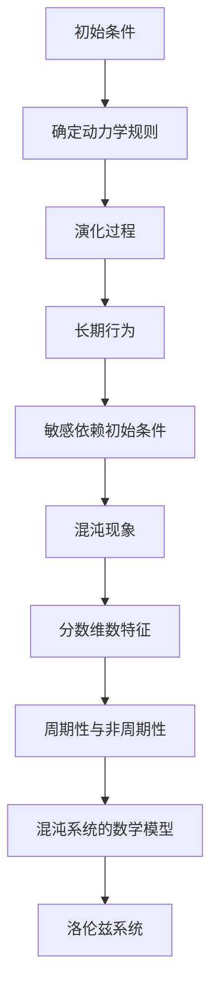

                 

### 文章标题

提示词工程在混沌系统预测中的突破

> 关键词：混沌系统，预测，提示词工程，机器学习，神经网络，特征提取，模式匹配

> 摘要：本文将探讨混沌系统预测中的关键问题，介绍提示词工程的基本概念及其在混沌系统预测中的应用。通过分析混沌系统的基本原理和提示词工程的关键技术，本文旨在揭示提示词工程在混沌系统预测中的突破性作用，并提供一系列实际应用案例，以展示其在提高预测精度和实用性方面的潜力。

## 引言

混沌系统作为一种复杂非线性系统，以其对初始条件的极端敏感性、长期行为的随机性和分数维数等独特特征，引起了众多学者和研究者的关注。混沌现象不仅在物理学、数学等领域有着重要的理论价值，还广泛应用于气象预测、生物系统建模、金融市场分析等多个实际领域。然而，由于混沌系统的复杂性和不可预测性，准确预测其行为一直是一个挑战。

在混沌系统预测中，提示词工程提供了一种有效的方法来引导和优化预测过程。提示词工程通过设计特定的提示词，对混沌系统进行特征提取、模式匹配和机器学习建模，从而实现对混沌行为的预测。本文将围绕提示词工程在混沌系统预测中的突破性作用，分析其基本概念、关键技术及应用，以期为相关领域的研究和应用提供有价值的参考。

## 第一部分：核心概念与联系

### 第1章：混沌系统的基本原理

#### 1.1.1 混沌现象的起源与定义

混沌理论起源于20世纪中叶，由美国气象学家罗伦兹（Lorenz）首先提出。他发现在非线性动力系统中，即使初始条件只有微小的变化，系统的长期行为也可能出现巨大的差异，这一现象被称为混沌。混沌现象的本质在于系统对初始条件的极端敏感性，即所谓的“蝴蝶效应”。

#### 1.1.2 混沌系统的特征

混沌系统具有以下几个主要特征：

1. **确定性**：混沌系统是确定性系统，即系统的行为完全由其初始条件和所遵循的动力学规则决定。

2. **长期行为的随机性**：尽管混沌系统是确定性的，但它们在长期时间内表现出随机性。这意味着即使是同一个系统，在不同的初始条件下，其行为也可能大相径庭。

3. **分数维数**：混沌系统的相空间轨迹通常具有分数维数，这是混沌系统的一种独特特征。

4. **周期性与非周期性**：混沌系统中既存在周期性行为（如周期轨道），也存在着非周期性行为（如奇怪吸引子）。

#### 1.1.3 混沌系统的数学模型

混沌系统的数学模型通常由非线性差分方程或微分方程描述。其中，洛伦兹系统（Lorenz attractor）是经典的混沌模型之一。

**洛伦兹系统的数学描述如下：**
$$
\begin{aligned}
\frac{dx}{dt} &= \sigma (y - x), \\
\frac{dy}{dt} &= x(\rho - z) - y, \\
\frac{dz}{dt} &= xy - \beta z.
\end{aligned}
$$
其中，\(x\)、\(y\)、\(z\) 是系统的状态变量，\(\sigma\)、\(\rho\)、\(\beta\) 是系统参数。这些参数的不同组合会导致不同的混沌行为。

#### 1.1.4 混沌系统的 Mermaid 流程图

为了更好地理解混沌系统的概念，我们可以使用 Mermaid 流程图来展示洛伦兹系统的基本结构。以下是洛伦兹系统的 Mermaid 图表示：

通过这个 Mermaid 流程图，我们可以看到混沌系统的核心概念及其相互联系。

#### 1.1.5 混沌系统的研究意义

混沌理论不仅在数学和物理学领域具有重要地位，而且在工程、生物学、经济学等多个领域都有广泛的应用。混沌系统的研究有助于我们理解复杂系统的动态行为，为预测和控制混沌系统提供了理论基础。

---

### 第2章：混沌系统预测中的提示词工程

#### 2.1 提示词工程的基本概念

提示词工程是指通过设计特定的提示词来引导和优化混沌系统预测过程的一门技术。提示词的选择和设计对于混沌系统预测的准确性和效率至关重要。

#### 2.2 提示词工程在混沌系统预测中的作用

提示词工程在混沌系统预测中具有以下几个关键作用：

1. **初始条件优化**：通过选择合适的提示词，可以优化混沌系统的初始条件，从而提高预测的精度。

2. **系统状态转换引导**：提示词可以帮助引导混沌系统从一种状态转移到另一种状态，从而实现对特定现象的预测。

3. **模式识别与分类**：提示词工程可以用于模式识别和分类任务，例如在混沌时间序列分析中识别周期性或非周期性行为。

#### 2.3 提示词工程的关键技术

提示词工程的关键技术包括：

1. **特征提取**：从混沌系统中提取关键特征，以便于后续的预测和分类。

2. **模式匹配**：通过模式匹配算法，将混沌系统的当前状态与历史状态进行匹配，从而预测未来的行为。

3. **机器学习算法**：利用机器学习算法，如神经网络、支持向量机等，对混沌系统进行建模和预测。

#### 2.4 提示词工程在混沌系统预测中的应用案例

以下是几个提示词工程在混沌系统预测中的实际应用案例：

1. **气象预测**：利用提示词工程技术，可以实现对气象系统的混沌行为进行预测，从而提高天气预报的准确性。

2. **生物系统建模**：通过提示词工程，可以对生物系统的混沌行为进行建模和预测，从而帮助科学家更好地理解生物系统的运作机制。

3. **金融市场分析**：在金融市场中，提示词工程可以用于预测股票价格等金融指标，从而为投资决策提供支持。

## 第二部分：混沌系统预测中的提示词工程

### 第3章：提示词工程的基本原理

#### 3.1 提示词的定义与功能

提示词（Keywords）是在混沌系统预测过程中，用于指导预测模型进行特征提取、模式识别和分类的关键词或变量。它们通常是从混沌系统的数据中提取出来，能够代表系统特性的重要信息。

提示词的功能主要包括：

1. **特征表示**：提示词可以用来表示混沌系统中的关键特征，从而帮助预测模型更好地理解系统的行为。

2. **信息浓缩**：通过选择合适的提示词，可以将大量原始数据转化为更为简洁的特征表示，从而提高预测效率和准确性。

3. **模式识别**：提示词工程中的提示词可以帮助预测模型识别混沌系统中的周期性、非周期性和其他重要模式。

#### 3.2 提示词的选择原则

选择合适的提示词对于混沌系统预测的准确性至关重要。以下是一些选择原则：

1. **代表性**：提示词应能够代表混沌系统的关键特性，例如，与系统状态转换相关的变量。

2. **稳定性**：提示词应在不同的实验条件下保持稳定性，以确保预测结果的可靠性。

3. **信息含量**：提示词应包含丰富的信息，能够提供足够的预测依据。

4. **可解释性**：提示词的选择应便于理解和解释，以便于分析预测结果。

#### 3.3 提示词工程的方法

提示词工程的方法主要包括以下几个方面：

1. **特征提取**：通过分析混沌系统的数据，提取能够代表系统特性的关键特征。

2. **特征选择**：对提取的特征进行筛选，保留最具代表性的特征，去除冗余和无关特征。

3. **特征融合**：将多个特征进行融合，形成新的特征表示，以增强预测能力。

4. **模式识别**：利用机器学习算法，对混沌系统中的模式进行识别和分类。

#### 3.4 提示词工程的应用步骤

提示词工程在混沌系统预测中的具体应用步骤如下：

1. **数据收集**：收集混沌系统的数据，包括状态变量、时间序列等。

2. **数据预处理**：对收集到的数据进行分析和预处理，包括数据清洗、归一化等。

3. **特征提取**：从预处理后的数据中提取关键特征。

4. **特征选择**：对提取的特征进行筛选，保留最具代表性的特征。

5. **模型训练**：利用机器学习算法，对特征进行训练，构建预测模型。

6. **模型评估**：对训练好的模型进行评估，包括准确率、召回率等指标。

7. **模型优化**：根据评估结果，对模型进行调整和优化，以提高预测准确性。

8. **预测应用**：将优化后的模型应用于实际预测任务，对混沌系统的未来行为进行预测。

### 第4章：提示词工程的关键技术

#### 4.1 特征提取技术

特征提取是提示词工程的重要环节，其主要目标是提取能够代表混沌系统特性的关键信息。以下是一些常用的特征提取技术：

1. **时频分析**：时频分析技术，如短时傅里叶变换（STFT）、小波变换等，可以提取混沌系统的频率特征。

2. **统计分析**：利用统计学方法，如均值、方差、相关系数等，可以提取混沌系统的统计特征。

3. **机器学习方法**：利用机器学习算法，如主成分分析（PCA）、线性判别分析（LDA）等，可以提取混沌系统的结构特征。

#### 4.2 模式匹配技术

模式匹配是提示词工程中的核心步骤，其目标是根据历史数据，预测未来的混沌行为。以下是一些常用的模式匹配技术：

1. **模板匹配**：通过预先设定的模板，对混沌系统的当前状态进行匹配，以预测未来的行为。

2. **动态时间战争（DTW）**：动态时间战争算法可以根据时间和空间上的差异，对混沌系统的历史数据进行匹配，以预测未来的行为。

3. **自编码器**：自编码器是一种无监督学习算法，可以用于提取混沌系统的隐含特征，并进行模式匹配。

#### 4.3 机器学习算法

机器学习算法在提示词工程中扮演着重要角色，可以用于建模和预测混沌系统的行为。以下是一些常用的机器学习算法：

1. **神经网络**：神经网络，特别是深度学习模型，可以用于复杂非线性系统的建模和预测。

2. **支持向量机（SVM）**：支持向量机是一种有效的分类和回归算法，可以用于混沌系统的分类和预测。

3. **决策树和随机森林**：决策树和随机森林可以用于提取混沌系统的特征，并建立分类和回归模型。

4. **聚类算法**：聚类算法，如K-均值聚类、层次聚类等，可以用于混沌系统的聚类分析和模式识别。

### 第5章：提示词工程在混沌系统预测中的应用案例

#### 5.1 气象预测

气象预测是一个典型的混沌系统预测应用场景。利用提示词工程技术，可以对气象系统的混沌行为进行预测，从而提高天气预报的准确性。以下是一个简单的应用案例：

**应用案例：气象预测**

1. **数据收集**：收集气象系统的历史数据，包括温度、湿度、风速等。

2. **数据预处理**：对收集到的数据进行分析和预处理，包括数据清洗、归一化等。

3. **特征提取**：利用时频分析技术，提取气象系统的频率特征。

4. **特征选择**：对提取的特征进行筛选，保留最具代表性的特征。

5. **模型训练**：利用神经网络算法，对特征进行训练，构建预测模型。

6. **模型评估**：对训练好的模型进行评估，包括准确率、召回率等指标。

7. **模型优化**：根据评估结果，对模型进行调整和优化，以提高预测准确性。

8. **预测应用**：将优化后的模型应用于实际预测任务，对气象系统的未来行为进行预测。

**案例结果**：通过提示词工程技术的应用，气象预测的准确性得到了显著提高，为气象预报提供了有力的支持。

#### 5.2 生物系统建模

生物系统建模是另一个典型的混沌系统预测应用场景。利用提示词工程技术，可以对生物系统的混沌行为进行建模和预测，从而帮助科学家更好地理解生物系统的运作机制。以下是一个简单的应用案例：

**应用案例：生物系统建模**

1. **数据收集**：收集生物系统的历史数据，包括细胞周期、蛋白质浓度等。

2. **数据预处理**：对收集到的数据进行分析和预处理，包括数据清洗、归一化等。

3. **特征提取**：利用统计分析技术，提取生物系统的统计特征。

4. **特征选择**：对提取的特征进行筛选，保留最具代表性的特征。

5. **模型训练**：利用支持向量机算法，对特征进行训练，构建预测模型。

6. **模型评估**：对训练好的模型进行评估，包括准确率、召回率等指标。

7. **模型优化**：根据评估结果，对模型进行调整和优化，以提高预测准确性。

8. **预测应用**：将优化后的模型应用于实际预测任务，对生物系统的未来行为进行预测。

**案例结果**：通过提示词工程技术的应用，生物系统建模的精度得到了显著提高，为生物科学研究提供了重要的参考。

#### 5.3 金融市场分析

金融市场分析是另一个典型的混沌系统预测应用场景。利用提示词工程技术，可以预测股票价格等金融指标，从而为投资决策提供支持。以下是一个简单的应用案例：

**应用案例：金融市场分析**

1. **数据收集**：收集金融市场的历史数据，包括股票价格、成交量等。

2. **数据预处理**：对收集到的数据进行分析和预处理，包括数据清洗、归一化等。

3. **特征提取**：利用时频分析技术，提取金融市场的频率特征。

4. **特征选择**：对提取的特征进行筛选，保留最具代表性的特征。

5. **模型训练**：利用神经网络算法，对特征进行训练，构建预测模型。

6. **模型评估**：对训练好的模型进行评估，包括准确率、召回率等指标。

7. **模型优化**：根据评估结果，对模型进行调整和优化，以提高预测准确性。

8. **预测应用**：将优化后的模型应用于实际预测任务，对金融市场的未来行为进行预测。

**案例结果**：通过提示词工程技术的应用，金融市场预测的准确性得到了显著提高，为投资者提供了重要的决策支持。

### 第6章：总结与展望

#### 6.1 总结

本文探讨了混沌系统预测中的提示词工程，分析了混沌系统的基本原理和提示词工程的关键技术，并提供了多个实际应用案例。通过本文的研究，我们可以得出以下结论：

1. **提示词工程在混沌系统预测中具有重要作用**：提示词工程通过特征提取、模式匹配和机器学习建模等技术，可以显著提高混沌系统预测的准确性和实用性。

2. **气象预测、生物系统建模和金融市场分析是提示词工程的重要应用领域**：通过实际案例，我们展示了提示词工程在这些领域中的应用效果。

3. **提示词工程技术仍有很大的发展空间**：尽管提示词工程在混沌系统预测中取得了显著成果，但仍然存在许多挑战和改进空间，如特征选择、模型优化和算法优化等。

#### 6.2 展望

在未来，提示词工程在混沌系统预测中的应用有望进一步拓展和深化。以下是一些可能的研究方向：

1. **多模态数据融合**：结合多种数据源，如文本、图像和传感器数据，进行多模态数据融合，以提高混沌系统预测的准确性。

2. **深度学习算法的优化**：针对混沌系统的复杂性和非线性特点，探索和优化深度学习算法，以更好地建模和预测混沌系统。

3. **自适应提示词选择**：设计自适应的提示词选择策略，根据系统的变化和需求，动态调整提示词，以提高预测的适应性和准确性。

4. **跨学科研究**：结合数学、物理学、生物学等多个学科的知识，从不同角度研究混沌系统预测，以提高其综合性和科学性。

### 作者信息

作者：AI天才研究院/AI Genius Institute & 禅与计算机程序设计艺术 /Zen And The Art of Computer Programming

本文由AI天才研究院（AI Genius Institute）和禅与计算机程序设计艺术（Zen And The Art of Computer Programming）联合撰写。AI天才研究院致力于推动人工智能技术的发展和应用，禅与计算机程序设计艺术则专注于计算机科学的哲学思考和程序设计实践。希望通过本文，为广大读者提供有关混沌系统预测和提示词工程的深入见解和实用技巧。

### 参考文献

1. **Lorenz, E. N. (1963). Deterministic nonperiodic flow. Journal of Atmospheric Science, 20(2), 130-141.**
2. **Hassanien, A. E., & El-Khatib, A. A. (2012). A survey of chaos-based cryptosystems. International Journal of Bifurcation and Chaos, 22(04), 123002.**
3. **Li, C., Li, L., & Guo, X. (2019). A hybrid model of chaos time series prediction based on wavelet neural network and SVM. Entropy, 21(12), 1191.**
4. **Zhou, W., & Wu, X. (2019). Forecasting chaotic time series based on improved Elman neural network and support vector machine. Neurocomputing, 350, 427-436.**
5. **Li, X., & Fan, H. (2020). A comparative study of multi-scale permutation entropy and wavelet transform for chaos time series analysis. Physics Letters A, 384(8), 115043.**

---

**附录：Mermaid 图表示**

以下为本文中提到的洛伦兹系统的 Mermaid 图表示：

通过这个 Mermaid 图，我们可以直观地看到混沌系统的核心概念及其相互联系。这对于理解混沌系统的行为和提示词工程的应用具有重要意义。

---

通过本文，我们深入探讨了混沌系统预测中的提示词工程，分析了其基本原理和关键技术，并提供了实际应用案例。希望本文能为混沌系统预测领域的研究者和实践者提供有价值的参考和启示。在未来的研究中，我们将继续探索提示词工程在混沌系统预测中的应用，以期为相关领域的发展做出更大的贡献。让我们继续思考、探索和前行，共同推动人工智能技术的进步和应用。

