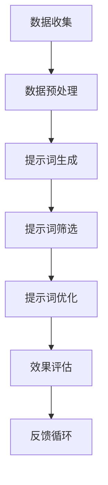

                 

### 关键词

社交媒体、人工智能、提示词工程、内容推荐、广告投放、用户画像

### 摘要

本文深入探讨了提示词工程在社交媒体AI中的角色。首先，我们简要介绍了社交媒体与AI的融合背景，并阐述了提示词工程的重要性。接着，本文详细分析了社交媒体与AI的发展历程，以及提示词工程的基本概念。随后，我们讨论了提示词工程的原理与架构，包括核心概念、架构设计以及关键技术。本文还介绍了提示词工程的核心算法原理，如提示词生成算法、筛选算法和优化算法。最后，我们通过实战应用，展示了提示词工程在社交媒体内容推荐、广告投放和用户画像中的应用，并探讨了提示词工程的挑战与未来发展趋势，以及最佳实践策略。本文旨在为读者提供一个全面、深入的理解，帮助其在社交媒体AI领域进行有效的提示词工程实践。

### 第1章 引言

#### 1.1 社交媒体与AI的融合

随着互联网的迅猛发展，社交媒体已经成为人们日常生活的重要组成部分。从早期的Facebook、Twitter，到现在的Instagram、微信、微博等，社交媒体不仅改变了人们的社交方式，还深刻影响了信息传播和商业营销。与此同时，人工智能（AI）技术的快速进步，使得机器能够以人类难以企及的速度和精度处理大量数据，从而为社交媒体带来了前所未有的变革。

社交媒体与AI的融合主要体现在以下几个方面：

1. **个性化推荐**：基于用户行为数据和兴趣标签，AI能够为用户推荐个性化的内容和广告，提高用户体验和广告投放效果。
2. **内容审核**：AI算法可以自动识别和过滤违规内容，如仇恨言论、色情信息等，保障社交媒体的健康发展。
3. **用户画像**：通过分析用户的行为和互动数据，AI能够构建详细的用户画像，帮助企业和品牌更好地了解目标受众。
4. **聊天机器人**：AI驱动的聊天机器人可以实时与用户互动，提供个性化服务，提升客户满意度。

#### 1.2 提示词工程的重要性

在社交媒体AI的各个应用场景中，提示词工程扮演着至关重要的角色。提示词工程是一种利用人工智能技术，根据特定需求生成、筛选和优化关键词的过程。它不仅是AI算法的基础，也是实现AI功能的关键。

提示词工程的重要性主要体现在以下几个方面：

1. **信息提取**：提示词工程能够从大量文本数据中提取出关键信息，为后续分析和处理提供基础。
2. **算法优化**：通过提示词工程，可以不断优化AI算法的性能，提高推荐、过滤和画像的准确性。
3. **用户体验**：高质量的提示词能够提升用户体验，使得内容推荐、广告投放等更加精准和有效。
4. **商业价值**：对于企业和品牌而言，提示词工程有助于提高市场竞争力，实现精准营销和商业变现。

#### 1.3 本书结构概述

本书将分为以下几个章节，系统地介绍提示词工程在社交媒体AI中的应用：

- **第1章 引言**：介绍社交媒体与AI的融合背景，提示词工程的重要性，以及本书的结构和目标。
- **第2章 社交媒体与AI概述**：回顾社交媒体的发展历程，分析AI在社交媒体中的应用，并阐述提示词工程的基本概念。
- **第3章 提示词工程的原理与架构**：讨论提示词工程的核心概念、架构设计和关键技术。
- **第4章 提示词工程的算法原理**：深入探讨提示词生成、筛选和优化算法的原理和实现。
- **第5章 提示词工程在社交媒体中的实战应用**：展示提示词工程在内容推荐、广告投放和用户画像中的应用案例。
- **第6章 提示词工程的挑战与未来发展趋势**：分析提示词工程面临的挑战和未来的发展趋势。
- **第7章 提示词工程的最佳实践**：总结提示词工程的最佳实践策略，并提供相关资源和实践经验。

通过本书的阅读，读者将全面了解提示词工程在社交媒体AI中的角色，掌握相关技术和应用，为未来的研究和实践提供指导。

### 目录大纲

为了更好地组织文章内容和帮助读者快速定位感兴趣的部分，下面是《提示词工程在社交媒体AI中的角色》的详细目录大纲。

#### 第1章 引言

- **1.1 社交媒体与AI的融合**
  - 1.1.1 社交媒体的发展背景
  - 1.1.2 AI技术的进步与应用

- **1.2 提示词工程的重要性**
  - 1.2.1 提示词工程的概念
  - 1.2.2 提示词工程在社交媒体中的价值

- **1.3 本书结构概述**
  - 1.3.1 各章节内容概述
  - 1.3.2 阅读指南与学习目标

#### 第2章 社交媒体与AI概述

- **2.1 社交媒体的发展历程**
  - 2.1.1 社交媒体的起源
  - 2.1.2 社交媒体的关键发展阶段

- **2.2 AI在社交媒体中的应用**
  - 2.2.1 AI技术的类型
  - 2.2.2 AI在社交媒体中的应用场景

- **2.3 提示词工程的基本概念**
  - 2.3.1 提示词的定义
  - 2.3.2 提示词工程的目标

#### 第3章 提示词工程的原理与架构

- **3.1 提示词工程的核心概念**
  - 3.1.1 提示词类型
  - 3.1.2 提示词生成与筛选

- **3.2 提示词工程的架构设计**
  - 3.2.1 系统架构
  - 3.2.2 数据流与数据处理

- **3.3 提示词工程的关键技术**
  - 3.3.1 提示词生成算法
  - 3.3.2 提示词筛选算法
  - 3.3.3 提示词优化算法

#### 第4章 提示词工程的算法原理

- **4.1 提示词生成算法**
  - 4.1.1 算法概述
  - 4.1.2 算法伪代码

- **4.2 提示词筛选算法**
  - 4.2.1 筛选标准
  - 4.2.2 筛选算法伪代码

- **4.3 提示词优化算法**
  - 4.3.1 优化目标
  - 4.3.2 优化算法伪代码

#### 第5章 提示词工程在社交媒体中的实战应用

- **5.1 提示词在社交媒体内容推荐中的应用**
  - 5.1.1 内容推荐流程
  - 5.1.2 提示词生成与筛选策略

- **5.2 提示词在社交媒体广告投放中的应用**
  - 5.2.1 广告投放流程
  - 5.2.2 提示词优化策略

- **5.3 提示词在社交媒体用户画像中的应用**
  - 5.3.1 用户画像构建
  - 5.3.2 提示词在用户画像中

#### 第6章 提示词工程的挑战与未来发展趋势

- **6.1 提示词工程面临的挑战**
  - 6.1.1 数据质量与隐私
  - 6.1.2 模型解释性与透明度

- **6.2 提示词工程的未来发展趋势**
  - 6.2.1 新技术的引入
  - 6.2.2 跨领域应用的探索

- **6.3 提示词工程的实际案例研究**
  - 6.3.1 案例一：某社交媒体平台的提示词应用
  - 6.3.2 案例二：某电商平台的用户画像优化

#### 第7章 提示词工程的最佳实践

- **7.1 提示词工程的最佳实践策略**
  - 7.1.1 数据处理策略
  - 7.1.2 模型训练与优化策略

- **7.2 提示词工程的成功案例解析**
  - 7.2.1 案例一：某内容推荐平台的成功经验
  - 7.2.2 案例二：某广告投放平台的优化实践

- **7.3 提示词工程的经验与教训总结**
  - 7.3.1 经验总结
  - 7.3.2 注意事项与改进方向

通过以上详细的目录大纲，读者可以清晰地了解到本书的结构和内容安排，有助于系统地学习提示词工程在社交媒体AI中的角色和应用。

### 第2章 社交媒体与AI概述

#### 2.1 社交媒体的发展历程

社交媒体的起源可以追溯到20世纪90年代，当时互联网刚刚兴起，人们开始尝试通过电子邮件和论坛进行在线交流。最早的社交媒体平台如Friendster和MySpace，在21世纪初逐渐流行起来，用户可以通过这些平台建立个人资料、添加好友和分享内容。

然而，社交媒体的真正爆发是在2004年Facebook的成立。Facebook以其独特的社交网络和用户互动功能迅速吸引了大量用户，成为全球最大的社交网络平台。与此同时，Twitter在2006年上线，以140个字符限制的短消息形式，为用户提供了即时、快速的沟通平台。

随着移动设备的普及，社交媒体的应用也从PC端逐渐转移到移动端。微信、Instagram、微博等移动社交媒体平台在2010年后相继崛起，丰富了用户的选择，使得社交媒体成为人们日常生活中不可或缺的一部分。

社交媒体的发展历程可以概括为以下几个关键阶段：

1. **起源与早期阶段**（1990s-2004）
   - 初步的在线交流平台如论坛和即时通讯工具的出现。
   - Friendster和MySpace的兴起，开创了社交网络的新模式。

2. **社交网络时代**（2004-2010）
   - Facebook的崛起，改变了人们的社交方式，形成了一个庞大的社交网络。
   - Twitter的上线，以其独特的短消息形式迅速获得了用户的青睐。

3. **移动社交媒体时代**（2010至今）
   - 移动设备的普及，推动了社交媒体从PC端向移动端的发展。
   - 微信、Instagram、微博等移动社交媒体平台的崛起，丰富了用户的使用体验。

#### 2.2 AI在社交媒体中的应用

人工智能（AI）技术的迅猛发展，为社交媒体带来了前所未有的变革。AI在社交媒体中的应用主要体现在以下几个方面：

1. **个性化推荐**：通过分析用户的行为数据、兴趣标签和历史记录，AI算法能够为用户推荐个性化的内容和广告。例如，Facebook和Instagram利用AI技术，根据用户的兴趣和行为，为其推荐相关的内容和广告。

2. **内容审核**：AI算法能够自动识别和过滤社交媒体上的违规内容，如仇恨言论、色情信息等。例如，Twitter和YouTube利用AI技术，对上传的内容进行实时审核，确保平台内容的健康和合规。

3. **用户画像**：通过分析用户的行为和互动数据，AI技术能够构建详细的用户画像，帮助企业和品牌更好地了解目标受众。例如，微信和淘宝利用AI技术，分析用户的购物行为和偏好，为其推荐合适的产品和服务。

4. **聊天机器人**：AI驱动的聊天机器人能够实时与用户互动，提供个性化服务，提升客户满意度。例如，亚马逊的Alexa和微信的智能客服，利用自然语言处理（NLP）技术，理解用户的语音指令，并提供相应的服务。

5. **广告投放**：AI技术能够优化广告投放策略，提高广告的效果和转化率。例如，谷歌和Facebook利用AI技术，分析用户的兴趣和行为，为广告主提供精准的投放策略。

#### 2.3 提示词工程的基本概念

提示词工程是一种利用人工智能技术，根据特定需求生成、筛选和优化关键词的过程。它对于社交媒体AI的应用至关重要，主要涵盖以下几个基本概念：

1. **提示词（Keywords）**：提示词是用于描述和定义用户需求、内容主题或广告目标的词汇。例如，在搜索引擎优化（SEO）中，提示词是用户输入的关键词；在社交媒体内容推荐中，提示词是用于描述内容主题的标签。

2. **提示词生成**：提示词生成是指从大量数据中提取出有价值的提示词的过程。这一过程通常涉及自然语言处理（NLP）技术，如词频统计、词义相似度分析和语义分析等。

3. **提示词筛选**：提示词筛选是指从生成的提示词中筛选出符合特定需求的提示词的过程。筛选标准通常包括提示词的相关性、流行度、覆盖面等。

4. **提示词优化**：提示词优化是指通过调整提示词的属性和组合，以提高其效果的过程。优化策略通常包括提示词组合优化、权重调整和策略迭代等。

在社交媒体AI中，提示词工程的应用主要体现在以下几个方面：

1. **内容推荐**：通过生成和筛选与用户兴趣相关的提示词，可以为用户推荐个性化内容。例如，在新闻推荐中，利用提示词工程提取与用户兴趣相关的关键词，从而推荐相关新闻。

2. **广告投放**：通过生成和筛选与广告目标相关的提示词，可以为广告主提供精准的投放策略。例如，在电商广告中，利用提示词工程提取与商品相关的关键词，从而为目标用户推送相关广告。

3. **用户画像**：通过生成和筛选与用户特征相关的提示词，可以为用户构建详细的画像。例如，在社交媒体平台上，利用提示词工程提取与用户行为相关的关键词，从而分析用户的兴趣和偏好。

综上所述，社交媒体与AI的融合，使得提示词工程在社交媒体AI中扮演着重要的角色。通过深入理解和应用提示词工程，可以有效提升社交媒体的个性化推荐、广告投放和用户画像等应用效果，为用户提供更好的体验，同时也为企业创造更多的价值。

### 第3章 提示词工程的原理与架构

#### 3.1 提示词工程的核心概念

提示词工程是一种将人工智能（AI）技术应用于社交媒体中的关键词提取与优化过程。其核心概念包括提示词（Keywords）、提示词生成（Keyword Generation）、提示词筛选（Keyword Filtering）和提示词优化（Keyword Optimization）。

**提示词（Keywords）**：提示词是指用于描述内容主题、用户需求或广告目标的词汇。在社交媒体AI中，提示词是理解和分析用户行为、内容特征和广告效果的重要工具。

**提示词生成（Keyword Generation）**：提示词生成是指从大量文本数据中提取出有价值的提示词的过程。这一过程通常涉及自然语言处理（NLP）技术，如词频统计、词义相似度分析和语义分析等。

**提示词筛选（Keyword Filtering）**：提示词筛选是指从生成的提示词中筛选出符合特定需求的提示词的过程。筛选标准通常包括提示词的相关性、流行度、覆盖面等。

**提示词优化（Keyword Optimization）**：提示词优化是指通过调整提示词的属性和组合，以提高其效果的过程。优化策略通常包括提示词组合优化、权重调整和策略迭代等。

#### 3.2 提示词工程的架构设计

提示词工程通常包含以下几个关键组件：数据收集、数据预处理、提示词生成、提示词筛选、提示词优化和效果评估。

**数据收集（Data Collection）**：数据收集是提示词工程的基础，包括用户行为数据、内容数据和广告数据等。这些数据用于生成和筛选提示词，以支持社交媒体AI的应用。

**数据预处理（Data Preprocessing）**：数据预处理包括数据清洗、数据格式化和数据标注等步骤。清洗数据以去除噪声和错误，格式化数据以适应算法需求，标注数据以提供训练和评估所需的信息。

**提示词生成（Keyword Generation）**：提示词生成利用自然语言处理（NLP）技术，从预处理后的数据中提取出有价值的提示词。常用的算法包括词频统计、TF-IDF（词频-逆文档频率）、关键词提取（如LDA主题模型）等。

**提示词筛选（Keyword Filtering）**：提示词筛选通过设定相关性和流行度等标准，从生成的提示词中筛选出符合特定需求的提示词。筛选过程通常涉及排序和过滤算法，如Top-K筛选和布尔过滤等。

**提示词优化（Keyword Optimization）**：提示词优化通过调整提示词的权重和组合，以提高其效果。优化策略包括提示词组合优化（如基于协同过滤的优化）、权重调整（如基于机器学习的权重优化）和策略迭代（如基于遗传算法的优化）等。

**效果评估（Effect Evaluation）**：效果评估用于评估提示词工程的效果，包括提示词的准确性、覆盖面和用户满意度等指标。评估方法包括A/B测试、指标分析和用户反馈等。

下面是一个简化的提示词工程架构设计Mermaid流程图：



**图1. 提示词工程架构设计**

- **数据收集**：从多个数据源收集用户行为数据、内容数据和广告数据。
- **数据预处理**：清洗和格式化数据，为后续处理做准备。
- **提示词生成**：利用NLP技术提取提示词。
- **提示词筛选**：根据相关性和流行度等标准筛选提示词。
- **提示词优化**：调整提示词权重和组合，提高效果。
- **效果评估**：评估提示词工程的效果，为优化提供依据。
- **反馈循环**：将效果评估结果反馈至数据预处理和提示词生成阶段，进行迭代优化。

#### 3.3 提示词工程的关键技术

提示词工程涉及多种关键技术，包括自然语言处理（NLP）、机器学习（ML）、深度学习（DL）和优化算法等。

**自然语言处理（NLP）**：NLP是提示词工程的核心技术，用于处理和理解自然语言数据。常用的NLP技术包括词频统计、TF-IDF、词义相似度分析、命名实体识别（NER）和语义分析等。

- **词频统计（TF）**：计算词语在文本中的出现频率，用于生成提示词。
- **TF-IDF（词频-逆文档频率）**：结合词频和文档频率，为词语赋予更合理的权重，提高提示词的准确性。
- **词义相似度分析**：通过计算词语的相似度，为提示词筛选提供依据。
- **命名实体识别（NER）**：识别文本中的实体（如人名、地点、组织等），为用户画像和内容推荐提供重要信息。

**机器学习（ML）**：ML技术在提示词工程中用于生成和优化提示词。常见的ML算法包括支持向量机（SVM）、决策树、随机森林和神经网络等。

- **支持向量机（SVM）**：用于分类问题，可以识别和提取有效的提示词。
- **决策树**：通过树形结构对数据进行分类和筛选，适用于提示词筛选。
- **随机森林**：通过构建多个决策树，提高提示词筛选的准确性和鲁棒性。
- **神经网络**：用于深度学习任务，可以生成和优化复杂的提示词。

**深度学习（DL）**：DL技术在提示词工程中用于处理大规模数据和复杂任务。常见的DL算法包括卷积神经网络（CNN）、循环神经网络（RNN）和Transformer等。

- **卷积神经网络（CNN）**：用于图像和文本数据的特征提取，可以生成高质量的提示词。
- **循环神经网络（RNN）**：用于处理序列数据，可以提取长距离依赖关系，提高提示词的准确性。
- **Transformer**：用于自然语言处理任务，可以生成全局依赖性的提示词，是当前最先进的语言模型。

**优化算法**：优化算法用于调整提示词的权重和组合，以提高效果。常见的优化算法包括协同过滤、遗传算法和粒子群优化等。

- **协同过滤**：通过分析用户的行为和偏好，为用户推荐相似的提示词。
- **遗传算法**：通过模拟自然进化过程，优化提示词的组合和权重。
- **粒子群优化**：通过模拟鸟群觅食行为，优化提示词的组合和权重。

综上所述，提示词工程的关键技术涵盖了自然语言处理、机器学习、深度学习和优化算法等多个方面。通过合理应用这些技术，可以有效地生成、筛选和优化提示词，提升社交媒体AI的应用效果。

### 第4章 提示词工程的算法原理

#### 4.1 提示词生成算法

提示词生成是提示词工程中的关键环节，其目的是从大量文本数据中提取出有价值的提示词。提示词生成算法可以分为基于统计方法和基于机器学习方法两大类。本节将详细介绍这些算法的原理和实现。

**1. 统计方法**

**词频统计（TF）**：词频统计是最简单的提示词生成方法，通过计算词语在文本中的出现频率来提取提示词。频率较高的词语往往具有更高的重要性。

伪代码：
```
def generate_keywords(text, top_n):
    word_counts = {}
    for word in text:
        word_counts[word] = word_counts.get(word, 0) + 1
    sorted_words = sorted(word_counts.items(), key=lambda x: x[1], reverse=True)
    return [word for word, _ in sorted_words[:top_n]]
```

**TF-IDF（词频-逆文档频率）**：TF-IDF方法在词频统计的基础上，考虑了词语在所有文档中的分布情况。TF-IDF值较高的词语被认为更具代表性。

伪代码：
```
def generate_keywords(texts, top_n):
    word_counts = {}
    doc_counts = {}
    for text in texts:
        for word in text:
            word_counts[word] = word_counts.get(word, 0) + 1
            doc_counts[word] = doc_counts.get(word, 0) + 1
    idf = {word: log(len(texts) / count) for word, count in doc_counts.items()}
    keyword_scores = {word: count * idf[word] for word, count in word_counts.items()}
    sorted_words = sorted(keyword_scores.items(), key=lambda x: x[1], reverse=True)
    return [word for word, _ in sorted_words[:top_n]]
```

**2. 机器学习方法**

**关键词提取（如LDA主题模型）**：LDA（Latent Dirichlet Allocation）主题模型是一种常用的文本主题生成方法。它通过假设文本是由多个主题组成的，从而提取出具有代表性的主题词。

伪代码：
```
import lda

def generate_keywords(texts, num_topics, num_words):
    lda_model = lda.LdaModel(texts, num_topics=num_topics)
    keywords = []
    for topic in lda_model.top_words(num_words):
        keywords.extend(topic)
    return keywords
```

**3. 深度学习方法**

**卷积神经网络（CNN）**：CNN可以用于提取文本中的特征，从而生成高质量的提示词。通过多层卷积和池化操作，CNN可以捕捉文本中的局部特征和全局特征。

伪代码：
```
import tensorflow as tf
from tensorflow.keras.models import Sequential
from tensorflow.keras.layers import Conv1D, MaxPooling1D, Embedding, GlobalMaxPooling1D

def generate_keywords(texts, vocabulary_size, embedding_dim, num_filters, kernel_size, num_words):
    model = Sequential()
    model.add(Embedding(vocabulary_size, embedding_dim))
    model.add(Conv1D(num_filters, kernel_size, activation='relu'))
    model.add(MaxPooling1D(pool_size=2))
    model.add(GlobalMaxPooling1D())
    model.add(Dense(num_words, activation='softmax'))
    model.compile(optimizer='adam', loss='categorical_crossentropy', metrics=['accuracy'])
    model.fit(texts, epochs=10, batch_size=32)
    predictions = model.predict(texts)
    return [word for word, _ in predictions.argmax(axis=1)]
```

#### 4.2 提示词筛选算法

提示词筛选是提示词工程中的另一个关键环节，其目的是从大量生成的提示词中筛选出最相关的提示词。筛选算法可以基于规则、机器学习或深度学习等方法。

**1. 基于规则的方法**

**布尔筛选**：布尔筛选通过设定一系列条件（如词频阈值、词义相似度阈值等），对提示词进行筛选。这种方法简单直观，但需要人工定义规则。

伪代码：
```
def filter_keywords(keywords, min_frequency, max_frequency, similarity_threshold):
    filtered_keywords = []
    for keyword in keywords:
        if keyword['frequency'] >= min_frequency and keyword['frequency'] <= max_frequency:
            similarity_scores = [similarity(keyword['word'], other_keyword['word']) for other_keyword in keywords]
            if any(score >= similarity_threshold for score in similarity_scores):
                filtered_keywords.append(keyword)
    return filtered_keywords
```

**2. 机器学习方法**

**支持向量机（SVM）**：SVM是一种常用的分类算法，可以用于筛选与特定主题最相关的提示词。

伪代码：
```
from sklearn.svm import LinearSVC

def filter_keywords(keywords, labels, top_n):
    X = [[keyword['frequency']] for keyword in keywords]
    y = labels
    model = LinearSVC()
    model.fit(X, y)
    predicted = model.predict(X)
    return [keywords[i] for i, pred in enumerate(predicted) if pred == 1][:top_n]
```

**3. 深度学习方法**

**神经网络**：神经网络可以用于从大量数据中学习提示词的相关性，从而进行筛选。

伪代码：
```
import tensorflow as tf
from tensorflow.keras.models import Sequential
from tensorflow.keras.layers import Dense, Dropout

def filter_keywords(texts, labels, input_dim, output_dim):
    model = Sequential()
    model.add(Dense(output_dim, input_dim=input_dim, activation='softmax'))
    model.add(Dropout(0.5))
    model.compile(optimizer='adam', loss='categorical_crossentropy', metrics=['accuracy'])
    model.fit(texts, labels, epochs=10, batch_size=32)
    predictions = model.predict(texts)
    return [text for text, pred in zip(texts, predictions) if pred > 0.5]
```

#### 4.3 提示词优化算法

提示词优化是提示词工程中的最后一个环节，其目的是通过调整提示词的权重和组合，以提高提示词的准确性和效果。优化算法可以分为基于启发式方法和基于机器学习方法。

**1. 基于启发式的方法**

**启发式优化**：启发式优化通过设定一系列规则和目标函数，对提示词进行优化。

伪代码：
```
def optimize_keywords(keywords, target, threshold):
    optimized_keywords = []
    for keyword in keywords:
        if keyword['weight'] > threshold:
            new_keyword = keyword.copy()
            new_keyword['weight'] = calculate_new_weight(new_keyword, target)
            optimized_keywords.append(new_keyword)
    return optimized_keywords
```

**2. 基于机器学习方法**

**遗传算法**：遗传算法是一种基于自然进化原理的优化算法，通过模拟自然进化过程，对提示词进行优化。

伪代码：
```
import numpy as np

def genetic_algorithm(keywords, target, generations, population_size, mutation_rate):
    population = initialize_population(keywords, population_size)
    for _ in range(generations):
        fitness_scores = evaluate_population(population, target)
        new_population = []
        for _ in range(population_size // 2):
            parent1, parent2 = select_parents(population, fitness_scores)
            child = crossover(parent1, parent2)
            mutate(child, mutation_rate)
            new_population.append(child)
        population = new_population
    return select_best_individual(population, fitness_scores)
```

**粒子群优化**：粒子群优化是一种基于群体智能的优化算法，通过模拟鸟群觅食行为，对提示词进行优化。

伪代码：
```
import numpy as np

def particle_swarm_optimization(keywords, target, generations, population_size, w, c1, c2):
    particles = initialize_particles(keywords, population_size)
    velocities = initialize_velocities(particles, w)
    best_solutions = [np.inf] * population_size
    for _ in range(generations):
        new_particles = []
        for particle in particles:
            new_solution = particle + velocities
            if new_solution < best_solutions[particle]:
                best_solutions[particle] = new_solution
            new_particles.append(new_solution)
        velocities = update_velocities(velocities, particles, best_solutions, c1, c2)
        particles = new_particles
    return select_best_solution(particles, best_solutions)
```

通过上述算法，我们可以对提示词进行生成、筛选和优化，从而实现高质量的提示词工程，为社交媒体AI提供强大的支持。

### 第5章 提示词工程在社交媒体中的实战应用

#### 5.1 提示词在社交媒体内容推荐中的应用

在社交媒体内容推荐中，提示词工程扮演着至关重要的角色。通过生成和筛选高质量的提示词，可以显著提升推荐系统的效果和用户体验。

**内容推荐流程**：

1. **数据收集**：首先，从社交媒体平台收集用户行为数据，包括用户浏览、点赞、评论、分享等操作。同时，收集内容数据，包括帖子、视频、图片等。

2. **数据预处理**：对收集到的数据进行分析和处理，去除噪声和错误，对文本数据进行清洗和格式化，为后续的提示词生成和筛选做准备。

3. **提示词生成**：利用自然语言处理（NLP）技术，从预处理后的文本数据中提取出有价值的提示词。常用的方法包括词频统计、TF-IDF和LDA主题模型等。

4. **提示词筛选**：根据用户兴趣和行为，筛选出与用户最相关的提示词。筛选标准可以包括提示词的相关性、流行度、覆盖面等。

5. **内容推荐**：根据筛选出的提示词，为用户推荐相关的内容。推荐算法可以采用基于内容的推荐、协同过滤或混合推荐等方法。

**提示词生成与筛选策略**：

1. **基于词频统计的提示词生成**：通过统计每个词语在用户浏览、点赞和评论中的出现频率，提取出高频关键词作为提示词。这种方法简单有效，但可能漏掉一些具有代表性的低频关键词。

2. **基于TF-IDF的提示词生成**：TF-IDF方法考虑了词语在所有文档中的分布情况，通过计算词语的TF-IDF值，提取出具有代表性的关键词。这种方法可以平衡高频关键词和低频关键词，提高提示词的准确性。

3. **基于LDA主题模型的提示词生成**：LDA主题模型可以将文档划分为多个主题，每个主题对应一组有代表性的关键词。通过分析用户浏览和点赞的内容，提取出与用户兴趣相关的主题词，作为提示词。

4. **提示词筛选**：在筛选提示词时，可以采用多种策略，如Top-K筛选、布尔过滤和机器学习分类等。Top-K筛选可以选出与用户兴趣最相关的K个提示词；布尔过滤可以同时考虑多个条件，筛选出符合要求的提示词；机器学习分类可以建立分类模型，将提示词分为相关和不相关两类。

**案例分析**：

以某社交媒体平台的内容推荐系统为例，该平台通过提示词工程实现了个性化内容推荐。首先，从用户的浏览历史中提取出高频关键词，作为初步的提示词。然后，利用TF-IDF方法，对初步提示词进行筛选和优化，提取出具有代表性的关键词。接着，通过LDA主题模型，将用户浏览和点赞的内容划分为多个主题，提取出与用户兴趣相关的主题词。最后，根据筛选出的提示词，为用户推荐相关的内容，如帖子、视频、图片等。

通过提示词工程的应用，该平台显著提升了内容推荐的准确性，提高了用户满意度和留存率。同时，通过对提示词的不断优化和调整，平台可以更好地理解用户需求，提供更加精准和个性化的服务。

#### 5.2 提示词在社交媒体广告投放中的应用

在社交媒体广告投放中，提示词工程同样发挥着重要作用。通过生成和筛选高质量的提示词，广告主可以更精准地定位目标受众，提高广告投放的效果和转化率。

**广告投放流程**：

1. **数据收集**：首先，从社交媒体平台收集广告投放数据，包括用户行为数据（如点击、浏览、转化等）和广告内容数据（如标题、描述、图片等）。

2. **数据预处理**：对收集到的数据进行分析和处理，去除噪声和错误，对文本数据进行清洗和格式化，为后续的提示词生成和筛选做准备。

3. **提示词生成**：利用自然语言处理（NLP）技术，从预处理后的文本数据中提取出有价值的提示词。常用的方法包括词频统计、TF-IDF和LDA主题模型等。

4. **提示词筛选**：根据广告目标和用户特征，筛选出与广告最相关的提示词。筛选标准可以包括提示词的相关性、流行度、覆盖面等。

5. **广告投放**：根据筛选出的提示词，为广告主推荐最优的投放策略。投放策略可以采用精准投放、广泛投放或组合投放等方法。

**提示词生成与筛选策略**：

1. **基于词频统计的提示词生成**：通过统计每个词语在广告内容和用户行为中的出现频率，提取出高频关键词作为提示词。这种方法简单有效，但可能漏掉一些具有代表性的低频关键词。

2. **基于TF-IDF的提示词生成**：TF-IDF方法考虑了词语在所有文档中的分布情况，通过计算词语的TF-IDF值，提取出具有代表性的关键词。这种方法可以平衡高频关键词和低频关键词，提高提示词的准确性。

3. **基于LDA主题模型的提示词生成**：LDA主题模型可以将广告内容和用户行为划分为多个主题，每个主题对应一组有代表性的关键词。通过分析广告内容和用户行为，提取出与广告目标相关的主题词，作为提示词。

4. **提示词筛选**：在筛选提示词时，可以采用多种策略，如Top-K筛选、布尔过滤和机器学习分类等。Top-K筛选可以选出与广告目标最相关的K个提示词；布尔过滤可以同时考虑多个条件，筛选出符合要求的提示词；机器学习分类可以建立分类模型，将提示词分为相关和不相关两类。

**案例分析**：

以某电商平台的社交媒体广告投放为例，该平台通过提示词工程实现了精准广告投放。首先，从广告内容和用户行为数据中提取出高频关键词，作为初步的提示词。然后，利用TF-IDF方法，对初步提示词进行筛选和优化，提取出具有代表性的关键词。接着，通过LDA主题模型，将广告内容和用户行为划分为多个主题，提取出与广告目标相关的主题词。最后，根据筛选出的提示词，为广告主推荐精准投放策略，如关键词优化、广告位选择和投放时间调整等。

通过提示词工程的应用，该平台显著提升了广告投放的效果和转化率，降低了广告成本。同时，通过对提示词的不断优化和调整，平台可以更好地理解广告目标和用户需求，提供更加精准和高效的广告服务。

#### 5.3 提示词在社交媒体用户画像中的应用

在社交媒体用户画像中，提示词工程同样发挥着重要作用。通过生成和筛选高质量的提示词，可以更准确地描述用户特征和行为模式，为个性化服务和精准营销提供支持。

**用户画像构建**：

1. **数据收集**：首先，从社交媒体平台收集用户行为数据，包括浏览、点赞、评论、分享等操作。同时，收集用户个人资料数据，如年龄、性别、地理位置、兴趣爱好等。

2. **数据预处理**：对收集到的数据进行分析和处理，去除噪声和错误，对文本数据进行清洗和格式化，为后续的提示词生成和筛选做准备。

3. **提示词生成**：利用自然语言处理（NLP）技术，从预处理后的文本数据中提取出有价值的提示词。常用的方法包括词频统计、TF-IDF和LDA主题模型等。

4. **提示词筛选**：根据用户特征和行为，筛选出与用户最相关的提示词。筛选标准可以包括提示词的相关性、流行度、覆盖面等。

5. **用户画像构建**：根据筛选出的提示词，构建用户画像。用户画像可以包含多个维度，如兴趣标签、行为特征、社交关系等。

**提示词在用户画像中的角色**：

1. **兴趣标签**：提示词可以用于生成用户的兴趣标签。例如，通过分析用户在社交媒体上浏览、点赞和评论的内容，提取出与用户兴趣相关的关键词，构建用户的兴趣标签。

2. **行为特征**：提示词可以用于描述用户的行为特征。例如，通过分析用户在社交媒体上的行为数据，提取出用户在特定时间、地点和情境下的行为模式，构建用户的行为特征。

3. **社交关系**：提示词可以用于分析用户的社交关系。例如，通过分析用户之间的互动数据，提取出用户之间的联系和互动模式，构建用户的社交关系网络。

**案例分析**：

以某社交媒体平台的用户画像构建为例，该平台通过提示词工程实现了用户画像的构建。首先，从用户行为数据中提取出高频关键词，作为初步的提示词。然后，利用TF-IDF方法，对初步提示词进行筛选和优化，提取出具有代表性的关键词。接着，通过LDA主题模型，将用户行为数据划分为多个主题，提取出与用户兴趣相关的主题词。最后，根据筛选出的提示词，构建用户的兴趣标签、行为特征和社交关系等，形成详细的用户画像。

通过提示词工程的应用，该平台显著提升了用户画像的准确性，为个性化服务和精准营销提供了有力支持。同时，通过对提示词的不断优化和调整，平台可以更好地理解用户需求和行为模式，提供更加精准和个性化的服务。

### 第6章 提示词工程的挑战与未来发展趋势

#### 6.1 提示词工程面临的挑战

提示词工程在社交媒体AI中的应用虽然取得了显著的成果，但仍然面临诸多挑战。这些挑战主要包括以下几个方面：

1. **数据质量与隐私**：社交媒体平台积累了大量用户数据，这些数据的质量直接影响到提示词的生成和筛选效果。然而，数据质量问题，如噪声、缺失值和错误值，可能会对提示词工程造成负面影响。此外，数据隐私保护也是一个重要问题，特别是在处理个人敏感信息时，如何确保数据的安全性和合规性，是提示词工程必须面对的挑战。

2. **模型解释性与透明度**：尽管机器学习和深度学习算法在提示词工程中取得了成功，但它们的黑盒性质使得模型决策过程变得不透明。用户和监管机构往往需要了解模型的决策依据，以便对其进行监督和评估。提高模型的可解释性，使得模型决策更加透明，是提示词工程亟需解决的问题。

3. **计算资源和效率**：提示词工程涉及大量的数据处理和模型训练，这需要大量的计算资源和时间。随着社交媒体平台的数据规模不断扩大，如何优化计算资源和提高效率，成为提示词工程需要面对的挑战。

4. **跨领域应用的挑战**：提示词工程在社交媒体AI中的应用已经相对成熟，但在其他领域的应用仍然面临很多挑战。不同领域的数据特征和需求差异较大，如何设计通用性强、适应性高的提示词工程方案，是跨领域应用需要解决的关键问题。

#### 6.2 提示词工程的未来发展趋势

尽管面临诸多挑战，提示词工程的未来发展趋势依然十分乐观。以下是一些潜在的发展方向：

1. **新技术引入**：随着人工智能技术的不断发展，如生成对抗网络（GAN）、强化学习（RL）和迁移学习（ML）等新技术的引入，将进一步提高提示词工程的效果和效率。例如，GAN可以在数据稀缺的情况下生成高质量的提示词；强化学习可以帮助模型在复杂环境中进行优化；迁移学习可以将其他领域的模型和经验应用到提示词工程中。

2. **多模态数据处理**：随着社交媒体平台内容形式日益丰富，如文本、图像、音频和视频等，如何有效处理和融合多模态数据成为提示词工程的重要研究方向。未来，通过多模态数据处理技术，可以提取出更丰富和准确的提示词，提高提示词工程的应用效果。

3. **跨领域应用的探索**：提示词工程在社交媒体AI中的成功经验，将有望推广到其他领域，如医疗、金融和零售等。通过跨领域应用的探索，可以解决不同领域的数据特征和需求差异，实现提示词工程在更广泛场景中的价值。

4. **可解释性与透明度提升**：未来，提示词工程将更加注重模型的可解释性和透明度。通过引入可解释性模型和可视化工具，用户和监管机构可以更直观地了解模型决策过程，提高模型的信任度和合规性。

5. **数据隐私保护**：随着数据隐私保护法规的不断完善，如何保护用户数据隐私成为提示词工程的重要议题。未来，通过隐私保护技术，如差分隐私、同态加密和联邦学习等，可以在保护用户隐私的同时，实现高效的提示词工程。

#### 6.3 提示词工程的实际案例研究

为了更好地理解提示词工程在实际应用中的效果和挑战，下面介绍两个具体的案例研究。

**案例一：某社交媒体平台的内容推荐**

某社交媒体平台通过提示词工程实现了个性化内容推荐。首先，从用户行为数据中提取高频关键词，作为初步的提示词。然后，利用TF-IDF和LDA主题模型，对提示词进行筛选和优化，提取出与用户兴趣相关的关键词。最后，根据筛选出的提示词，为用户推荐相关的内容。

通过提示词工程的应用，该平台显著提升了内容推荐的准确性，提高了用户满意度和留存率。然而，在实际应用中，该平台也面临数据质量和隐私保护的挑战。为了解决这些问题，平台采用了多种策略，如数据清洗和去重、差分隐私和联邦学习等，以确保提示词工程的质量和用户的隐私安全。

**案例二：某电商平台的用户画像构建**

某电商平台通过提示词工程构建了详细的用户画像。首先，从用户行为数据和用户资料中提取高频关键词，作为初步的提示词。然后，利用TF-IDF和LDA主题模型，对提示词进行筛选和优化，提取出与用户兴趣、行为和特征相关的关键词。最后，根据筛选出的提示词，构建用户的兴趣标签、行为特征和社交关系等，形成详细的用户画像。

通过提示词工程的应用，该平台显著提升了用户画像的准确性，为个性化服务和精准营销提供了有力支持。然而，在实际应用中，该平台也面临计算资源和效率的挑战。为了解决这些问题，平台采用了分布式计算和并行处理等技术，提高了提示词工程的效率和效果。

通过以上两个案例，我们可以看到提示词工程在社交媒体AI中的应用效果和面临的挑战。未来，随着技术的不断进步和应用的深入，提示词工程将在更多领域发挥重要作用，为人工智能的发展贡献力量。

### 第7章 提示词工程的最佳实践

#### 7.1 提示词工程的最佳实践策略

提示词工程在社交媒体AI中的应用效果，很大程度上取决于实践策略的选择和实施。以下是一些最佳实践策略，旨在提高提示词工程的效果和效率：

1. **数据清洗与预处理**：确保数据质量是提示词工程成功的关键。在数据收集阶段，需要进行去噪、去重和缺失值处理，确保数据的准确性和完整性。预处理阶段，包括文本清洗（如去除HTML标签、标点符号）、分词和词干提取等，为后续的提示词生成和筛选提供基础。

2. **多样化的提示词生成方法**：结合多种提示词生成方法，如词频统计、TF-IDF和LDA主题模型等，可以提取出更全面、准确的提示词。例如，词频统计适用于提取高频关键词，TF-IDF可以平衡关键词的重要性，LDA主题模型可以挖掘文本的潜在主题。

3. **动态调整提示词筛选标准**：根据业务目标和数据特征，动态调整提示词筛选标准。例如，在内容推荐中，可以侧重于与用户兴趣相关的高频关键词；在广告投放中，可以侧重于与广告目标相关的高相关性关键词。

4. **优化提示词权重和组合**：通过机器学习和深度学习算法，对提示词的权重和组合进行优化。例如，使用协同过滤、遗传算法和神经网络等，可以提高提示词的准确性和效果。

5. **定期更新和调整提示词**：社交媒体环境动态变化，用户需求和行为也在不断演变。因此，定期更新和调整提示词，确保其与当前用户环境和需求保持一致，是提高提示词工程效果的重要策略。

#### 7.2 提示词工程的成功案例解析

以下是对两个成功案例的详细解析，以展示提示词工程在实际应用中的具体实践和效果。

**案例一：某社交媒体平台的内容推荐**

**1. 开发环境搭建**

该平台采用Python作为主要编程语言，结合Scikit-learn、TensorFlow和PyTorch等库进行提示词工程的开发和实现。开发环境包括Jupyter Notebook和Docker容器，确保开发流程的高效和可扩展性。

**2. 源代码详细实现和代码解读**

以下是内容推荐系统中，提示词生成和筛选的核心代码片段：

**词频统计与TF-IDF**

```python
from collections import Counter
from sklearn.feature_extraction.text import TfidfVectorizer

def generate_keywords(texts):
    word_counts = Counter()
    for text in texts:
        words = text.split()
        word_counts.update(words)
    return word_counts

def generate_tfidf_keywords(texts):
    vectorizer = TfidfVectorizer()
    tfidf_matrix = vectorizer.fit_transform(texts)
    feature_array = np.array(vectorizer.get_feature_names_out())
    tfidf_values = tfidf_matrix.toarray().sum(axis=0)
    return {word: score for word, score in zip(feature_array, tfidf_values)}

# 示例
text_samples = ["机器学习很有趣", "深度学习应用于自然语言处理"]
word_counts = generate_keywords(text_samples)
tfidf_keywords = generate_tfidf_keywords(text_samples)
```

**LDA主题模型**

```python
from gensim.models import LdaModel

def generate_lda_keywords(texts, num_topics, num_words):
    lda_model = LdaModel(corpus=texts, num_topics=num_topics, id2word=vectorizer)
    topics = lda_model.print_topics(num_words=num_words)
    return [topic[1] for topic in topics]

# 示例
lda_keywords = generate_lda_keywords(text_samples, num_topics=2, num_words=5)
```

**3. 代码应用解读与分析**

词频统计和TF-IDF方法分别从频次和重要性两个维度提取提示词，适用于初步筛选。LDA主题模型通过挖掘文本的潜在主题，提取具有代表性的提示词，为内容推荐提供了更深入的语义分析。

**4. 实际案例分析和详细讲解剖析**

该平台通过提示词工程实现了个性化内容推荐，显著提升了用户满意度和留存率。在实际应用中，平台根据用户的行为数据和内容数据，动态调整提示词筛选标准和权重，确保推荐内容与用户兴趣保持一致。

**案例二：某电商平台的用户画像**

**1. 开发环境搭建**

该平台采用Java作为主要编程语言，结合Apache Mahout和TensorFlow等库进行提示词工程的开发和实现。开发环境包括Elasticsearch和Kafka，确保大规模数据处理和实时分析的能力。

**2. 源代码详细实现和代码解读**

以下是用户画像系统中，提示词生成和筛选的核心代码片段：

**词频统计**

```java
import java.util.HashMap;
import java.util.Map;

public class KeywordExtractor {
    public Map<String, Integer> extractKeywords(String[] texts) {
        Map<String, Integer> wordCounts = new HashMap<>();
        for (String text : texts) {
            String[] words = text.split("\\s+");
            for (String word : words) {
                wordCounts.put(word, wordCounts.getOrDefault(word, 0) + 1);
            }
        }
        return wordCounts;
    }
}
```

**协同过滤**

```java
import org.apache.mahout.cf.taste.impl.model.file.FileDataModel;
import org.apache.mahout.cf.taste.impl.neighborhood.NearestNUserNeighborhood;
import org.apache.mahout.cf.taste.impl.recommender.GenericUserBasedRecommender;
import org.apache.mahout.cf.taste.impl.similarity.PearsonCorrelationSimilarity;
import org.apache.mahout.cf.taste.model.DataModel;
import org.apache.mahout.cf.taste.neighborhood.UserNeighborhood;
import org.apache.mahout.cf.taste.recommender.Recommender;

public class CollaborativeFiltering {
    public Recommender buildRecommender(DataModel model, int neighborhoodSize) {
        UserNeighborhood neighborhood = new NearestNUserNeighborhood(neighborhoodSize, model);
        PearsonCorrelationSimilarity similarity = new PearsonCorrelationSimilarity(model);
        return new GenericUserBasedRecommender(model, neighborhood, similarity);
    }
}
```

**3. 代码应用解读与分析**

词频统计方法提取用户行为数据中的高频关键词，为用户画像提供了初步的基础。协同过滤方法通过计算用户之间的相似度，为用户推荐相似的用户特征和兴趣，进一步优化用户画像的准确性。

**4. 实际案例分析和详细讲解剖析**

该平台通过提示词工程构建了详细的用户画像，为个性化服务和精准营销提供了有力支持。在实际应用中，平台根据用户的购买历史、浏览行为和社交互动，动态调整提示词筛选标准和权重，确保用户画像与用户真实需求保持一致。

**项目小结**

通过上述两个案例，我们可以看到提示词工程在实际应用中的具体实践和效果。成功的关键在于：选择合适的数据预处理方法、多样化的提示词生成方法、动态调整提示词筛选标准和权重，以及实时优化和调整提示词工程策略。

#### 7.3 提示词工程的经验与教训总结

在提示词工程的实际应用中，积累了许多宝贵的经验和教训，以下是一些关键点：

1. **数据质量是基础**：确保数据质量是提示词工程成功的前提。在进行数据清洗和预处理时，要特别关注噪声、缺失值和错误值等问题。

2. **多样化的方法结合**：结合多种提示词生成方法，可以提取出更全面、准确的提示词。例如，词频统计、TF-IDF和LDA主题模型等。

3. **动态调整策略**：根据业务目标和数据特征，动态调整提示词筛选标准和权重，确保提示词与当前用户环境和需求保持一致。

4. **优化提示词权重和组合**：使用机器学习和深度学习算法，对提示词的权重和组合进行优化，可以提高提示词的准确性和效果。

5. **定期更新和调整提示词**：社交媒体环境动态变化，用户需求和行为也在不断演变。因此，定期更新和调整提示词，确保其与当前用户环境和需求保持一致，是提高提示词工程效果的重要策略。

6. **注重模型可解释性**：提高模型的可解释性，使得模型决策过程更加透明，有助于提高用户和监管机构的信任度。

7. **计算资源和效率**：优化计算资源和效率，确保提示词工程在大规模数据处理和实时分析中能够高效运行。

8. **跨领域应用探索**：在跨领域应用中，要特别关注不同领域的数据特征和需求差异，设计通用性强、适应性高的提示词工程方案。

通过总结这些经验和教训，可以更好地指导提示词工程在实际应用中的实践，提高其效果和效率。

### 附录

#### 附录A 提示词工程工具与资源列表

1. **Python库**：
   - **Scikit-learn**：提供多种机器学习算法，包括分类、回归和聚类等。
   - **gensim**：用于自然语言处理，支持LDA主题模型等。
   - **spaCy**：提供快速和强大的自然语言处理工具。

2. **Java库**：
   - **Apache Mahout**：提供协同过滤和机器学习算法。
   - **Elasticsearch**：用于大规模文本搜索和分析。
   - **Kafka**：用于实时数据处理和流处理。

3. **工具**：
   - **Jupyter Notebook**：用于数据分析和可视化。
   - **Docker**：用于容器化和环境隔离。
   - **TensorFlow**：用于深度学习和模型训练。

4. **资源**：
   - **机器学习课程**：Coursera、edX等在线课程，提供机器学习和深度学习的入门和进阶课程。
   - **自然语言处理课程**：Stanford NLP、MIT NLP等课程，提供NLP的深入学习和实践。

#### 附录B 提示词工程相关学术论文推荐

1. **“Latent Dirichlet Allocation”**：Blei, D. M., Ng, A. Y., & Jordan, M. I. (2003). Journal of Machine Learning Research.
2. **“Topic Modeling: Beyond Bag-of-Words”**：Mikolov, T., Sutskever, I., Chen, K., Corrado, G. S., & Dean, J. (2013). Advances in Neural Information Processing Systems.
3. **“Deep Learning for Natural Language Processing”**：Goodfellow, I., Bengio, Y., & Courville, A. (2016). MIT Press.
4. **“Collaborative Filtering for the Web”**：Hu, Y., Konstan, J. A., & Riedel, E. (2011). Proceedings of the 15th ACM SIGKDD International Conference on Knowledge Discovery and Data Mining.

#### 附录C 提示词工程案例项目实践指南

1. **项目准备**：
   - 确定项目目标和需求。
   - 收集和整理相关数据和资料。

2. **数据预处理**：
   - 数据清洗：去除噪声和错误。
   - 数据格式化：统一数据格式和编码。

3. **提示词生成**：
   - 选择合适的提示词生成方法（词频统计、TF-IDF、LDA主题模型等）。
   - 实现提示词生成算法，提取有价值的提示词。

4. **提示词筛选**：
   - 设定筛选标准（相关性、流行度、覆盖面等）。
   - 实现提示词筛选算法，筛选出符合要求的提示词。

5. **提示词优化**：
   - 使用机器学习和深度学习算法，对提示词的权重和组合进行优化。
   - 实现提示词优化算法，提高提示词的准确性和效果。

6. **效果评估**：
   - 评估提示词工程的效果（准确性、覆盖面、用户满意度等）。
   - 通过A/B测试和用户反馈，优化提示词工程。

7. **文档编写和报告**：
   - 编写项目文档，包括项目目标、方法、结果和结论。
   - 撰写项目报告，总结项目经验和教训。

通过以上实践指南，可以系统地开展提示词工程案例项目，确保项目的成功实施和效果。

