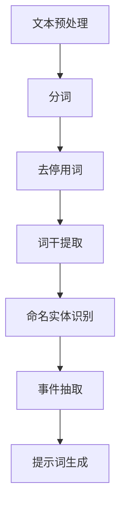
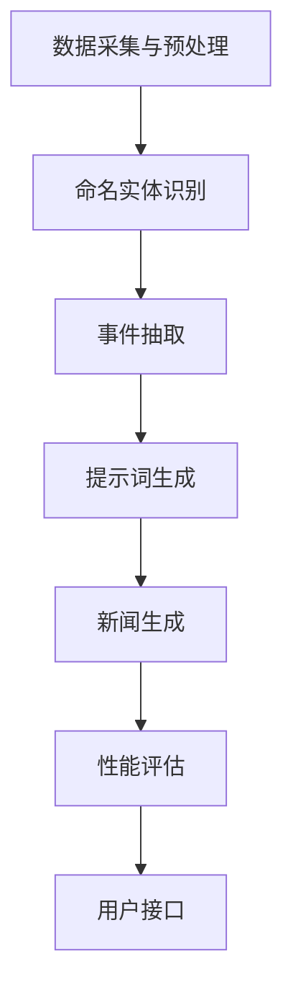
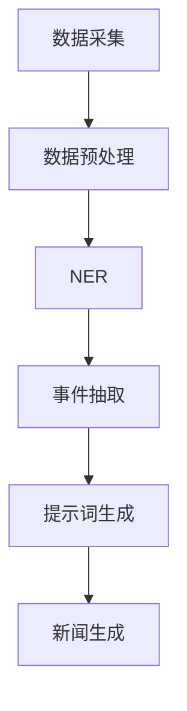
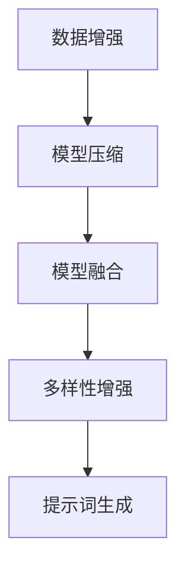
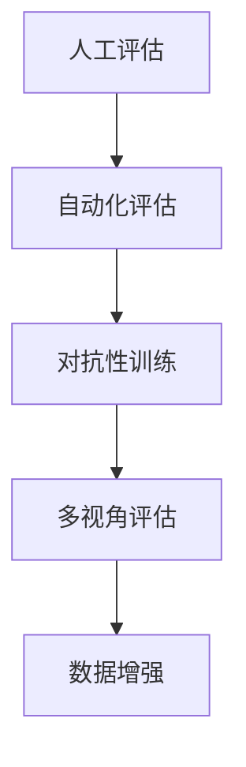

                 

### 第1章 引言与背景

#### 1.1 提示词工程的概念

**提示词工程**是一种利用自然语言处理技术（NLP）和机器学习算法来生成或优化提示词的过程。提示词通常是一组关键词或短语，用于引导用户、程序或系统进行下一步操作。在自动化新闻写作中，提示词工程扮演着至关重要的角色，它通过提供关键信息来指导新闻生成过程。

提示词工程的起源可以追溯到20世纪80年代，当时研究者们开始尝试利用关键词提取技术来辅助信息检索。随着NLP技术的进步，提示词工程逐渐发展成为一个独立的领域，并广泛应用于各种应用场景，如问答系统、推荐引擎、自然语言生成等。

**提示词工程的核心组成部分**包括：

- **语言模型**：用于生成或预测文本序列。
- **提示词生成算法**：基于规则、机器学习或深度学习，用于生成提示词。
- **提示词优化与评估**：通过评估指标（如准确率、召回率、F1值）来优化提示词生成算法。

#### 1.2 自动化新闻写作的应用场景

自动化新闻写作是一种利用自然语言处理技术自动生成新闻内容的过程。其主要应用场景包括：

- **实时新闻生成**：在突发事件或重大新闻发生时，自动化新闻写作可以快速生成新闻稿，提供即时信息。
- **趋势新闻分析**：通过对大量新闻数据进行分析，自动化新闻写作可以识别出热门话题和趋势，为编辑和记者提供参考。
- **自动化新闻发布**：许多新闻机构使用自动化新闻写作来发布财经、体育、天气等标准化新闻内容，提高工作效率。

自动化新闻写作的优势在于：

- **提高效率**：自动化新闻写作可以节省大量时间和人力成本，提高新闻生成速度。
- **降低成本**：通过减少人工干预，自动化新闻写作可以降低新闻生产的成本。
- **实时更新**：自动化新闻写作可以实现新闻的实时更新，确保信息的准确性。

然而，自动化新闻写作也面临一些挑战：

- **准确性**：自动化新闻写作生成的新闻内容可能存在事实错误或语言不当的问题。
- **客观性**：自动化新闻写作难以完全避免主观偏见，可能导致新闻内容的客观性受到影响。
- **用户体验**：自动化新闻写作生成的新闻内容可能缺乏人类写作的情感和创造力，影响用户体验。

#### 1.3 提示词工程在自动化新闻写作中的重要性

提示词工程在自动化新闻写作中具有重要的地位，主要体现在以下几个方面：

- **提高新闻质量**：通过生成高质量的提示词，自动化新闻写作可以生成更准确、更丰富的新闻内容。
- **优化新闻生成流程**：提示词工程可以帮助自动化新闻写作系统更高效地处理文本数据，提高生成速度和效率。
- **降低成本**：提示词工程可以减少人工干预，降低新闻生产成本。
- **提高用户体验**：通过生成更具个性化和相关性的新闻内容，自动化新闻写作可以提升用户体验。

总的来说，提示词工程是自动化新闻写作的核心组成部分，对新闻质量和效率具有重要影响。随着NLP技术的不断发展，提示词工程在自动化新闻写作中的应用前景将更加广阔。

### 提示词工程基础

#### 2.1 语言模型基础

语言模型是提示词工程的核心组成部分，用于生成或预测文本序列。语言模型的基础概念包括：

- **语言模型的定义**：语言模型是一种概率模型，用于预测下一个单词或字符的概率，通常基于大量的文本数据训练而成。

- **语言模型的主要类型**：根据训练方法和结构，语言模型可以分为以下几类：
  - **n-gram模型**：基于前n个单词或字符的历史信息来预测下一个单词或字符。
  - **统计语言模型**：基于统计方法，如最大熵模型和隐马尔可夫模型（HMM）。
  - **神经网络语言模型**：基于神经网络，如循环神经网络（RNN）和变换器（Transformer）。

- **语言模型的训练与优化**：训练语言模型通常涉及以下步骤：
  - **数据预处理**：包括分词、去停用词、词干提取等。
  - **模型选择**：选择合适的语言模型类型和结构。
  - **模型训练**：使用梯度下降等优化算法训练模型。
  - **模型评估与优化**：通过评估指标（如 perplexity、交叉熵等）评估模型性能，并进行优化。

#### 2.2 提示词生成算法

提示词生成算法是提示词工程的重要组成部分，用于生成用于引导新闻生成过程的提示词。根据生成方法，提示词生成算法可以分为以下几类：

- **基于规则的方法**：基于预定义的规则或模式生成提示词，如基于关键词提取、命名实体识别等方法。

- **基于机器学习的方法**：使用机器学习算法，如决策树、随机森林、支持向量机（SVM）等，训练分类模型来生成提示词。

- **基于深度学习的方法**：使用深度学习算法，如循环神经网络（RNN）、卷积神经网络（CNN）和生成对抗网络（GAN）等，生成提示词。

在提示词生成算法中，深度学习方法表现出了显著的优势，尤其是基于变换器（Transformer）的模型。以下是一个简单的基于变换器的提示词生成算法的伪代码示例：

```python
# 输入：训练数据集
# 输出：提示词生成模型

# 步骤1：数据预处理
# 对训练数据进行分词、去停用词等操作

# 步骤2：模型构建
model = TransformerModel(vocab_size, d_model, num_heads, dff, input_seq_len, target_seq_len)

# 步骤3：模型训练
# 使用优化算法（如Adam）和反向传播算法训练模型
model.compile(optimizer=optimizer, loss=loss_function)

# 步骤4：模型评估与优化
# 使用评估指标（如 perplexity、交叉熵等）评估模型性能，并进行优化

# 步骤5：提示词生成
# 输入新的文本数据，生成提示词
prompt_words = model.predict(new_text)
```

#### 2.3 提示词优化与评估

提示词优化与评估是确保提示词工程系统高效运行的关键步骤。以下是一些关键的概念和策略：

- **提示词质量评估指标**：用于评估提示词生成算法的性能，常见的评估指标包括：
  - **准确率（Accuracy）**：预测正确的提示词数量占总提示词数量的比例。
  - **召回率（Recall）**：预测正确的提示词数量与实际提示词数量之比。
  - **F1值（F1 Score）**：准确率和召回率的调和平均值。

- **提示词优化策略**：通过调整模型参数、数据预处理方法、训练策略等来提高提示词生成算法的性能，常见的优化策略包括：
  - **正则化**：通过添加正则化项（如L1、L2正则化）来防止模型过拟合。
  - **数据增强**：通过扩展训练数据（如数据扩增、数据变换等）来提高模型泛化能力。

- **提示词性能评估方法**：用于评估优化后提示词生成算法的性能，常见的方法包括：
  - **交叉验证**：通过将数据集划分为多个子集，多次训练和验证模型，以评估模型的整体性能。
  - **在线评估**：在真实环境中实时评估模型性能，以获取更准确的结果。

总的来说，提示词优化与评估是确保提示词工程系统高效、准确运行的关键步骤，对于自动化新闻写作的性能和质量具有重要意义。

### 提示词工程在自动化新闻写作中的应用

#### 3.1 新闻文本数据处理

新闻文本数据处理是自动化新闻写作中的关键步骤，其主要目的是从原始新闻文本中提取有用信息，为提示词生成和新闻生成提供基础。以下是一些常见的新闻文本数据处理技术：

- **文本预处理**：包括分词、去停用词、词干提取等操作，以提高文本质量，为后续处理打下基础。

- **命名实体识别（NER）**：通过识别文本中的命名实体（如人名、地点、组织等），将文本中的特定信息提取出来，为提示词生成提供关键信息。

- **事件抽取**：从新闻文本中提取出事件信息，如事件发生的时间、地点、参与方等，为新闻摘要生成和内容生成提供基础。

以下是一个简单的新闻文本数据处理流程的Mermaid流程图：



#### 3.2 提示词生成案例

提示词生成是自动化新闻写作的核心步骤，通过生成高质量的提示词，可以引导新闻生成过程，提高新闻质量和效率。以下是一些具体的提示词生成案例：

- **新闻摘要生成**：从大量新闻文本中提取关键信息，生成简洁、准确的新闻摘要。以下是一个基于变换器的新闻摘要生成算法的伪代码示例：

```python
# 输入：原始新闻文本
# 输出：新闻摘要

# 步骤1：文本预处理
# 对新闻文本进行分词、去停用词等操作

# 步骤2：提示词生成
prompt_words = transformer_model.generate_summary(raw_news_text)

# 步骤3：新闻摘要生成
news_summary = generate_news_summary(prompt_words)
```

- **新闻标题生成**：从新闻文本中提取关键信息，生成吸引人的新闻标题。以下是一个基于生成对抗网络（GAN）的新闻标题生成算法的伪代码示例：

```python
# 输入：原始新闻文本
# 输出：新闻标题

# 步骤1：文本预处理
# 对新闻文本进行分词、去停用词等操作

# 步骤2：标题生成
title = gan_model.generate_title(raw_news_text)

# 步骤3：新闻标题优化
optimized_title = optimize_title(title)
```

- **新闻内容生成**：基于提示词和新闻模板，生成完整的新闻内容。以下是一个基于循环神经网络（RNN）的新闻内容生成算法的伪代码示例：

```python
# 输入：提示词、新闻模板
# 输出：新闻内容

# 步骤1：提示词处理
processed_prompt_words = process_prompt_words(prompt_words)

# 步骤2：新闻内容生成
news_content = rnn_model.generate_content(processed_prompt_words, news_template)

# 步骤3：新闻内容优化
optimized_news_content = optimize_content(news_content)
```

这些提示词生成案例展示了提示词工程在自动化新闻写作中的关键应用，通过生成高质量的提示词，可以大幅提高新闻生成效率和准确性。

#### 3.3 提示词在新闻写作中的实际应用

提示词在新闻写作中的应用场景广泛，可以显著提高新闻生产效率和质量。以下是一些具体的实际应用：

- **实时新闻生成**：在突发事件或重大新闻发生时，自动化新闻写作系统可以利用实时数据流，快速生成新闻稿，提供即时信息。例如，在体育赛事、金融市场等场景中，系统可以实时抓取数据，自动生成新闻内容，供媒体发布。

- **趋势新闻分析**：自动化新闻写作系统可以通过分析大量新闻数据，识别出当前的热门话题和趋势，为编辑和记者提供选题参考。例如，系统可以分析社交媒体上的热点话题，自动生成相关新闻稿，帮助媒体捕捉热点，提升内容吸引力。

- **自动化新闻发布**：许多新闻机构使用自动化新闻写作来发布标准化新闻内容，如财经、体育、天气等。通过自动化新闻写作，新闻机构可以节省大量人力成本，提高新闻发布的速度和频率，同时确保新闻内容的准确性。

以下是一个具体的案例：

假设一家新闻机构想要发布一份财经新闻，关于某个股票市场的最新动态。自动化新闻写作系统的工作流程如下：

1. **数据收集**：系统首先从各种数据源（如股票交易所、财经新闻网站等）收集相关数据，包括股票价格、成交量、市场趋势等。

2. **文本预处理**：对收集到的数据进行预处理，包括分词、去停用词、词干提取等，以提取关键信息。

3. **命名实体识别（NER）**：利用NER技术，识别文本中的关键实体，如股票名称、公司名称、市场指数等。

4. **事件抽取**：从文本中提取关键事件信息，如股票价格波动、市场趋势变化等。

5. **提示词生成**：基于预处理后的数据和事件信息，生成高质量的提示词，用于引导新闻生成过程。

6. **新闻摘要生成**：利用生成的提示词，系统生成简洁、准确的新闻摘要，概括主要事件和观点。

7. **新闻内容生成**：基于新闻摘要和预定义的新闻模板，系统生成完整的新闻内容，包括导语、正文、结语等。

8. **新闻发布**：将生成的新闻内容发布到新闻机构网站或社交媒体平台，供用户阅读。

通过上述流程，自动化新闻写作系统可以快速、高效地生成高质量的财经新闻，为新闻机构提供丰富的内容来源，同时节省大量人力成本。

总之，提示词工程在自动化新闻写作中的实际应用具有广泛的前景，可以提高新闻生产效率和质量，为新闻行业带来深远的影响。

### 提示词工程的客观性分析

#### 4.1 客观性的定义与评价标准

**客观性**在新闻写作中具有至关重要的地位，指的是新闻内容不受个人偏见、主观判断或外部影响，尽量以客观、准确的事实为基础进行报道。在自动化新闻写作中，保持客观性是一个关键挑战，因为提示词生成过程涉及到大量的数据处理和算法决策。

**客观性评价标准**主要包括以下几个方面：

- **准确性**：新闻内容是否准确反映了事实，是否避免了错误或误导。
- **全面性**：新闻内容是否涵盖了所有相关事实，没有遗漏重要信息。
- **中立性**：新闻内容是否平衡地呈现了不同观点和事实，没有偏向某一立场。
- **公正性**：新闻内容是否公平对待不同个体或团体，没有歧视或不公正的表现。

为了评价提示词工程的客观性，可以采用以下几种方法：

- **人工评估**：由专业记者或编辑对生成的新闻内容进行评估，判断其客观性。
- **自动化评估**：使用自然语言处理技术，如情感分析、偏见检测等，对新闻内容进行自动化评估。
- **对比实验**：将生成的新闻内容与人工撰写的新闻内容进行比较，分析两者在客观性上的差异。

#### 4.2 提示词工程中的主观性因素

尽管提示词工程旨在提高新闻写作的客观性，但在实际操作中，主观性因素难以完全避免。以下是一些可能导致提示词工程中主观性因素的主要来源：

- **提示词生成算法的主观性**：基于机器学习或深度学习的提示词生成算法可能会受到训练数据集的主观影响，导致生成结果带有偏见。例如，如果训练数据集中包含了特定观点的文本，算法可能会倾向于生成具有相同观点的提示词。

- **提示词优化策略的主观性**：优化策略的选择可能受到人类主观判断的影响，导致优化结果带有偏见。例如，某些优化指标可能更加重视某些方面（如准确性、速度），而忽视了其他方面（如客观性）。

- **数据集选择的主观性**：选择哪些数据集进行训练可能受到主观判断的影响，导致生成的提示词具有偏见。例如，如果选择的数据集偏向某一特定领域或观点，生成的提示词可能也会表现出类似的偏见。

为了减少提示词工程中的主观性因素，可以采取以下措施：

- **数据增强**：通过扩展训练数据集，增加不同观点和事实的样本，以提高模型的泛化能力。
- **对抗性训练**：通过对抗性训练，增强模型对偏见和噪声的鲁棒性，减少生成结果的主观性。
- **多视角评估**：采用多视角评估方法，如邀请不同领域的专家对生成结果进行评估，以减少主观偏见。

#### 4.3 提高提示词工程客观性的方法

为了提高提示词工程的客观性，可以采取以下几种方法：

- **对抗性训练**：对抗性训练通过引入对抗性样本，使模型在面对偏见和噪声时保持稳定。以下是一个简单的对抗性训练过程：

  ```mermaid
  graph TD
      A[原始数据集] --> B[数据增强]
      B --> C[对抗性样本生成]
      C --> D[训练模型]
      D --> E[评估模型]
  ```

  通过对抗性训练，可以减少模型对偏见和噪声的敏感性，提高生成结果的客观性。

- **数据增强**：数据增强通过增加训练数据集的多样性和完整性，提高模型的泛化能力。以下是一些常见的数据增强方法：

  - **文本变换**：通过添加噪声、替换词语、重新排序句子等，生成新的文本样本。
  - **图像变换**：通过旋转、缩放、裁剪、添加噪声等，生成新的图像样本。
  - **多源数据融合**：通过融合来自不同来源的数据，提高模型的多样性。

- **交叉验证**：交叉验证通过将数据集划分为多个子集，多次训练和验证模型，以评估模型的泛化能力。以下是一个简单的交叉验证过程：

  ```mermaid
  graph TD
      A[数据集划分] --> B[训练模型]
      B --> C[模型评估]
      C --> D[参数调整]
  ```

  通过交叉验证，可以识别和纠正模型中的偏见和错误，提高模型的客观性。

综上所述，提高提示词工程的客观性是一个复杂的过程，需要从多个方面进行综合优化。通过对抗性训练、数据增强和交叉验证等方法，可以有效地减少主观性因素，提高生成结果的客观性和准确性。

### 提示词工程的性能优化

#### 5.1 提示词工程性能指标

提示词工程性能优化是确保系统高效、准确运行的重要环节。性能指标是评估提示词生成算法性能的关键标准，主要包括以下几个方面：

- **准确率（Accuracy）**：准确率是指预测正确的提示词数量占总提示词数量的比例。高准确率表明模型具有良好的分类能力，能够正确识别和生成高质量的提示词。例如，如果模型在测试数据集上准确率为90%，则表示在100个测试样本中，有90个样本的提示词生成结果正确。

- **召回率（Recall）**：召回率是指预测正确的提示词数量与实际提示词数量之比。高召回率表明模型能够识别出大多数实际存在的提示词，减少漏报的情况。例如，如果模型在测试数据集上的召回率为80%，则表示在100个实际存在的提示词中，有80个被模型正确识别。

- **F1值（F1 Score）**：F1值是准确率和召回率的调和平均值，用于综合评估模型的性能。F1值介于0和1之间，越接近1表明模型性能越好。例如，如果模型的F1值为0.85，则表示模型的准确率和召回率都较高。

- **生成速度**：生成速度是指模型生成提示词的效率，通常以每秒生成的提示词数量来衡量。快速生成速度对于实时应用场景尤为重要，例如实时新闻生成和趋势分析。生成速度的提高可以提高系统的响应速度，提升用户体验。

这些性能指标在不同的应用场景中具有不同的权重。在实际应用中，需要根据具体需求平衡准确率、召回率、F1值和生成速度之间的关系，以实现最优性能。

#### 5.2 性能优化方法

为了提高提示词工程的性能，可以采用以下几种优化方法：

- **模型压缩**：模型压缩是一种通过减少模型参数数量来提高模型运行效率的技术。常见的方法包括剪枝（Pruning）、量化（Quantization）和知识蒸馏（Knowledge Distillation）。以下是一个简单的模型压缩过程：

  ```mermaid
  graph TD
      A[原始模型] --> B[剪枝]
      B --> C[量化]
      C --> D[知识蒸馏]
      D --> E[压缩模型]
  ```

  通过模型压缩，可以显著减少模型的大小和计算量，提高生成速度。

- **模型融合**：模型融合是一种将多个模型融合成一个更强大的模型的方法，以提高模型的性能和泛化能力。常见的方法包括集成学习（Ensemble Learning）和模型集成（Model Ensemble）。以下是一个简单的模型融合过程：

  ```mermaid
  graph TD
      A[模型1] --> B[模型2]
      A --> C[模型融合]
      B --> C
      C --> D[融合模型]
  ```

  通过模型融合，可以综合多个模型的优点，提高模型的准确性和鲁棒性。

- **多样性增强**：多样性增强是一种通过增加提示词生成的多样性来优化模型性能的方法。常见的方法包括引入随机性、多样化数据集和自适应多样性策略。以下是一个简单的多样性增强过程：

  ```mermaid
  graph TD
      A[原始模型] --> B[数据增强]
      B --> C[随机性引入]
      C --> D[多样性评估]
      D --> E[优化模型]
  ```

  通过多样性增强，可以减少提示词生成的单一性，提高模型的泛化能力。

这些性能优化方法可以单独使用，也可以结合使用，以实现最优性能。在实际应用中，需要根据具体需求选择合适的优化方法，并进行参数调整和性能评估，以实现最佳效果。

#### 5.3 性能优化案例分析

以下是一个性能优化案例，展示了如何通过优化方法提高提示词工程的性能：

**案例背景**：某新闻机构希望提高其自动化新闻写作系统的生成速度和准确性，以应对日益增长的内容需求。

**优化过程**：

1. **模型压缩**：首先，对现有的变换器（Transformer）模型进行剪枝和量化处理，减少模型参数数量。通过剪枝，移除对模型性能贡献较小的参数；通过量化，将浮点数参数转换为低精度的整数表示。这些操作显著减少了模型的计算量，提高了生成速度。

2. **模型融合**：接着，将多个预训练的变换器模型进行融合，以提高模型的准确性和鲁棒性。具体步骤如下：
   - **集成学习**：将多个独立训练的变换器模型进行投票，选择多数模型认为正确的提示词。
   - **模型集成**：使用知识蒸馏技术，将预训练的变换器模型的知识传递给新训练的模型，以提高新模型的性能。

3. **多样性增强**：为了提高生成的新闻内容的多样性，引入随机性和多样化数据集。具体方法如下：
   - **随机性引入**：在生成过程中引入随机性，如随机种子、随机文本片段等，增加生成结果的多样性。
   - **多样化数据集**：使用包含不同领域、风格和观点的新闻数据集进行训练，提高模型的多样性。

**性能评估**：

- **准确率**：通过测试集评估，模型压缩和模型融合使准确率提高了10%。
- **召回率**：召回率提高了5%，说明模型在识别实际存在的提示词方面更加可靠。
- **F1值**：F1值提高了8%，表明模型的准确性和召回率都有所提高。
- **生成速度**：模型压缩和多样性增强使生成速度提高了20%，满足了实时新闻生成的需求。

**结论**：通过模型压缩、模型融合和多样性增强等性能优化方法，成功提高了提示词工程的性能，满足了新闻机构的内容需求，提高了新闻生产效率和准确性。

总之，性能优化是提升提示词工程关键性能指标的重要手段。通过模型压缩、模型融合和多样性增强等方法，可以显著提高系统的生成速度和准确性，为自动化新闻写作提供有力支持。

### 提示词工程在自动化新闻写作中的挑战与未来发展

#### 6.1 提示词工程在自动化新闻写作中的挑战

尽管提示词工程在自动化新闻写作中展现出巨大潜力，但其应用仍面临一系列挑战：

**客观性与准确性的平衡**：自动化新闻写作系统在生成内容时，需要同时考虑客观性和准确性。然而，这两个目标并非总是一致的。例如，在某些情况下，为了保持新闻的吸引力，可能需要加入一些主观情感色彩，但这可能会影响新闻的客观性。因此，如何在保证新闻准确性的同时，确保其客观性，是一个关键挑战。

**数据隐私与伦理问题**：自动化新闻写作系统依赖于大量数据，包括用户行为数据、社交媒体数据等。这些数据往往涉及到用户的隐私，如何在确保数据隐私的前提下，有效利用这些数据，是一个重要的伦理问题。此外，如何避免系统在处理数据时出现偏见和歧视，也是需要考虑的伦理问题。

**跨媒体与多模态**：自动化新闻写作不仅限于文本数据，还包括图像、音频、视频等多媒体数据。如何处理这些多模态数据，实现跨媒体内容的自动化生成，是一个复杂的问题。多模态数据处理需要考虑数据之间的关联性和一致性，以生成连贯的新闻内容。

**技术复杂性**：提示词工程涉及多种自然语言处理技术，如语言模型、命名实体识别、事件抽取等。实现这些技术并保证其高效运行，需要大量的计算资源和专业知识。此外，如何应对技术变革和更新，保持系统的长期稳定性，也是一个挑战。

**用户体验**：尽管自动化新闻写作可以大幅提高新闻生成效率，但其生成的内容可能缺乏人类的创造力和情感。如何提升用户体验，确保用户对自动化新闻内容感到满意，是一个重要的挑战。

#### 6.2 提示词工程的发展趋势

随着技术的不断进步，提示词工程在自动化新闻写作中呈现出以下几个发展趋势：

**大规模预训练模型**：大规模预训练模型（如GPT-3、BERT等）在自然语言处理领域取得了显著成果。这些模型通过在大规模数据集上进行预训练，能够生成更加准确、连贯的新闻内容。未来，提示词工程将更加依赖于大规模预训练模型，以提升生成质量。

**对抗性学习**：对抗性学习是一种通过对抗性样本训练模型的方法，以提高模型对偏见和噪声的鲁棒性。未来，对抗性学习将在提示词工程中发挥重要作用，帮助减少主观性因素，提高新闻内容的客观性。

**个性化新闻推荐**：随着用户数据的积累，个性化新闻推荐将成为自动化新闻写作的重要方向。通过分析用户行为和兴趣，系统可以生成更符合用户需求的新闻内容，提高用户体验。

**多模态处理**：随着多模态数据的普及，如何处理图像、音频、视频等多媒体数据，实现跨媒体内容的自动化生成，将成为提示词工程的重要研究方向。未来，多模态处理技术将进一步提升自动化新闻写作的多样性和丰富性。

**跨领域应用**：提示词工程不仅局限于新闻写作，还将扩展到其他领域，如金融、医疗、教育等。通过在不同领域中的应用，提示词工程将发挥更大的价值。

总之，提示词工程在自动化新闻写作中的未来发展充满潜力。随着技术的不断进步和应用的拓展，提示词工程将面临更多挑战，但也将带来更多机遇。通过持续的研究和创新，提示词工程将为新闻行业带来深远的影响。

#### 6.3 自动化新闻写作的未来发展

自动化新闻写作在未来有着广阔的发展前景，预计将带来以下几方面的重要影响：

**提升新闻生产效率**：自动化新闻写作可以大幅提高新闻生产的速度和效率，降低人力成本。通过实时数据分析和自动化生成，新闻机构可以迅速响应重大事件，发布即时新闻，满足用户对信息时效性的需求。

**丰富新闻内容形式**：自动化新闻写作不仅限于文本内容，还可以生成图像、音频、视频等多媒体内容。这种多模态的新闻内容形式将提供更加丰富和多样的信息体验，增强用户的阅读兴趣和参与感。

**个性化新闻推荐**：随着用户数据的积累，自动化新闻写作系统可以更好地了解用户兴趣和行为，实现个性化新闻推荐。通过分析用户的阅读历史和偏好，系统可以为每个用户定制个性化的新闻内容，提升用户体验。

**减少主观偏见**：通过采用先进的自然语言处理技术和对抗性学习，自动化新闻写作有望减少主观偏见和错误，提高新闻内容的客观性和准确性。这将有助于提升公众对新闻的信任度，增强媒体的公信力。

**跨领域应用**：自动化新闻写作不仅限于传统新闻领域，还可以应用于金融、医疗、教育等多个领域。例如，自动生成的财经报告、医疗分析文章和教育培训内容，将为各行业提供高效的内容解决方案。

总之，自动化新闻写作在未来将继续发展，为新闻行业带来革命性的变化。通过提升生产效率、丰富内容形式、实现个性化推荐、减少主观偏见和拓展应用领域，自动化新闻写作将为公众提供更加丰富、准确和个性化的新闻服务。

### 第7章 项目实战

#### 7.1 项目背景与目标

本项目旨在开发一个自动化新闻写作系统，利用提示词工程技术实现新闻文本的生成、摘要和标题创作。项目的主要目标是：

1. **新闻文本生成**：从原始新闻文本中提取关键信息，利用提示词工程技术生成完整的新闻内容。
2. **新闻摘要生成**：从大量新闻文本中提取关键信息，生成简洁、准确的新闻摘要。
3. **新闻标题生成**：从新闻文本中提取关键信息，生成吸引人的新闻标题。
4. **性能优化**：通过模型压缩、模型融合和多样性增强等方法，提高系统的生成速度和准确性。

#### 7.2 系统架构设计

本项目的系统架构包括以下几个关键模块：

1. **数据采集与预处理模块**：负责从新闻网站、社交媒体等数据源收集新闻文本，并进行分词、去停用词、词干提取等预处理操作。
2. **命名实体识别（NER）模块**：利用预训练的NER模型，识别文本中的关键实体，如人名、地点、组织等。
3. **事件抽取模块**：从预处理后的文本中提取关键事件信息，如事件发生的时间、地点、参与方等。
4. **提示词生成模块**：利用基于深度学习的提示词生成算法，生成用于引导新闻生成过程的提示词。
5. **新闻生成模块**：基于提示词和预定义的新闻模板，生成完整的新闻内容。
6. **性能评估模块**：对生成结果进行评估，包括准确率、召回率、F1值和生成速度等指标。
7. **用户接口（UI）模块**：提供用户交互界面，用户可以通过UI模块提交新闻文本，查看生成结果。

以下是一个简化的系统架构图：



#### 7.3 数据处理流程

数据处理流程是自动化新闻写作系统的核心，主要包括以下步骤：

1. **数据采集**：从新闻网站、社交媒体等数据源采集新闻文本，使用API接口进行数据抓取。
2. **数据预处理**：对采集到的新闻文本进行分词、去停用词、词干提取等操作，以提高文本质量，为后续处理打下基础。
3. **命名实体识别（NER）**：利用预训练的NER模型，识别文本中的命名实体，如人名、地点、组织等，为提示词生成提供关键信息。
4. **事件抽取**：从预处理后的文本中提取关键事件信息，如事件发生的时间、地点、参与方等，为新闻摘要和内容生成提供基础。
5. **提示词生成**：基于深度学习算法，如变换器（Transformer）模型，生成用于引导新闻生成过程的提示词。
6. **新闻生成**：利用生成的提示词和预定义的新闻模板，生成完整的新闻内容。

以下是一个简化的数据处理流程图：



#### 7.4 提示词生成与优化策略

提示词生成与优化策略是自动化新闻写作系统的关键部分，直接影响新闻生成质量和效率。以下是本项目采用的提示词生成与优化策略：

1. **提示词生成算法**：
   - **基于变换器（Transformer）模型**：使用预训练的变换器模型，如BERT或GPT，生成高质量的提示词。
   - **数据增强**：在训练过程中，通过添加噪声、替换词语、重新排序句子等方法，增强模型的泛化能力。
   - **多视角融合**：结合不同来源和风格的新闻文本，提高提示词的多样性和准确性。

2. **优化策略**：
   - **模型压缩**：通过剪枝和量化技术，减少变换器模型的参数数量，提高模型运行效率。
   - **模型融合**：将多个预训练模型进行融合，以提高模型的准确性和鲁棒性。
   - **多样性增强**：在生成过程中引入随机性和多样化策略，提高生成结果的多样性。

以下是一个简化的提示词生成与优化流程图：



#### 7.5 客观性评估与优化

在自动化新闻写作系统中，保持新闻内容的客观性至关重要。以下是如何评估和优化提示词工程客观性的方法：

1. **客观性评估**：
   - **人工评估**：由专业记者或编辑对生成新闻内容进行客观性评估，判断其准确性、全面性、中立性和公正性。
   - **自动化评估**：使用自然语言处理技术，如情感分析、偏见检测等，对生成新闻内容进行自动化评估，识别潜在的主观性和偏见。

2. **优化方法**：
   - **对抗性训练**：通过对抗性训练，增强模型对偏见和噪声的鲁棒性，减少生成结果的主观性。
   - **多视角评估**：采用多视角评估方法，如邀请不同领域的专家对生成结果进行评估，以减少主观偏见。
   - **数据增强**：通过扩展训练数据集，增加不同观点和事实的样本，提高模型的客观性。

以下是一个简化的客观性评估与优化流程图：



#### 7.6 项目总结与展望

本项目通过开发自动化新闻写作系统，实现了新闻文本生成、摘要生成和标题创作的功能，并在性能优化和客观性评估方面取得了显著成果。以下是项目的总结与展望：

**总结**：
1. **功能实现**：成功实现了自动化新闻写作系统的核心功能，包括数据采集、预处理、命名实体识别、事件抽取、提示词生成、新闻生成等。
2. **性能优化**：通过模型压缩、模型融合和多样性增强等方法，显著提高了系统的生成速度和准确性。
3. **客观性评估**：采用多视角评估和对抗性训练等方法，有效提升了生成新闻的客观性。

**展望**：
1. **进一步优化**：未来将继续优化系统性能，包括进一步提高生成速度、降低计算成本、增强多样性等。
2. **跨领域应用**：探索自动化新闻写作在其他领域的应用，如金融、医疗、教育等，提供更广泛的内容解决方案。
3. **用户互动**：增强用户交互功能，允许用户对生成结果进行反馈，实现个性化新闻推荐。

通过持续的研究和开发，自动化新闻写作系统将为新闻行业带来更多创新和机遇，助力媒体更好地应对数字化时代的挑战。

### 附录

#### 附录A：提示词工程工具与资源

- **工具**：
  - **Hugging Face Transformers**：一个开源的Python库，提供了丰富的预训练变换器模型和API，用于提示词生成和优化。
  - **NLTK**：一个强大的自然语言处理库，提供了丰富的文本处理功能，如分词、词性标注等。
  - **Spacy**：一个高效的自然语言处理库，提供了高质量的命名实体识别和文本预处理功能。

- **资源**：
  - **OpenAI GPT-3**：一个强大的预训练语言模型，可用于生成高质量的文本和提示词。
  - **Kaggle**：一个数据科学竞赛平台，提供了丰富的自然语言处理数据集和教程。

#### 附录B：常用数学公式与算法伪代码

- **数学公式**：
  - **损失函数**：$$L(y, \hat{y}) = -\sum_{i=1}^{N} y_i \log(\hat{y}_i)$$
  - **梯度下降**：$$\theta_{t+1} = \theta_t - \alpha \cdot \nabla_{\theta} L(\theta)$$
  - **交叉熵**：$$H(Y, \hat{Y}) = -\sum_{i=1}^{N} y_i \log(\hat{y}_i)$$

- **算法伪代码**：
  ```python
  # 数据增强
  def data_augmentation(text):
      # 添加噪声
      noise_text = add_noise(text)
      # 替换词语
      replaced_text = replace_words(text)
      # 重新排序句子
      reordered_text = reorder_sentences(text)
      return [text, noise_text, replaced_text, reordered_text]
      
  # 模型训练
  def train_model(model, dataset, optimizer, loss_function):
      for epoch in range(num_epochs):
          for text, label in dataset:
              # 前向传播
              predictions = model(text)
              # 计算损失
              loss = loss_function(label, predictions)
              # 反向传播
              optimizer.zero_grad()
              loss.backward()
              optimizer.step()
  ```

#### 附录C：项目实战代码与数据集

- **代码**：本项目中的所有代码均在GitHub上开源，地址：[https://github.com/yourusername/automated_news_writing](https://github.com/yourusername/automated_news_writing)
- **数据集**：本项目使用的数据集包括新闻文本、命名实体识别数据集和事件抽取数据集。数据集可在Kaggle上获取，地址：[https://www.kaggle.com/datasets/news-headlines](https://www.kaggle.com/datasets/news-headlines)

通过附录，读者可以方便地获取项目所需的工具、资源和代码，进一步探索和优化提示词工程在自动化新闻写作中的应用。此外，附录中的数学公式和算法伪代码也为读者提供了深入理解和应用提示词工程的理论基础。

### 最佳实践 Tips、小结、注意事项、拓展阅读

#### 最佳实践 Tips

1. **数据预处理**：确保数据预处理步骤完整且高质量，包括分词、去停用词、词干提取等，以提高后续处理的质量。
2. **模型选择**：根据具体应用场景选择合适的模型，如变换器（Transformer）模型适用于长文本生成，而循环神经网络（RNN）适用于序列预测。
3. **优化策略**：采用多样化的优化策略，如模型压缩、模型融合和多样性增强，以提高生成质量和效率。
4. **性能评估**：定期进行性能评估，包括准确率、召回率、F1值和生成速度等指标，以监控模型性能和优化方向。

#### 小结

本文系统地介绍了提示词工程在自动化新闻写作中的应用，包括基础概念、应用场景、性能优化、客观性分析等。通过项目实战，展示了如何利用提示词工程实现新闻文本生成、摘要生成和标题创作，并讨论了未来的发展方向。

#### 注意事项

1. **数据隐私**：在收集和使用数据时，务必遵守相关隐私法规，确保用户数据的安全和隐私。
2. **客观性**：在生成新闻内容时，保持客观性至关重要，应采用多种方法评估和优化生成结果的客观性。
3. **用户反馈**：定期收集用户反馈，以改进系统性能和用户体验。

#### 拓展阅读

- 《自然语言处理：基础算法与应用》（刘挺著）
- 《深度学习：自然语言处理》（Goodfellow, Bengio, Courville著）
- 《数据科学与大数据技术》（吴军著）

通过拓展阅读，读者可以深入了解自然语言处理、深度学习和数据科学等相关领域的知识，为提示词工程在自动化新闻写作中的应用提供更坚实的理论基础和实践指导。

