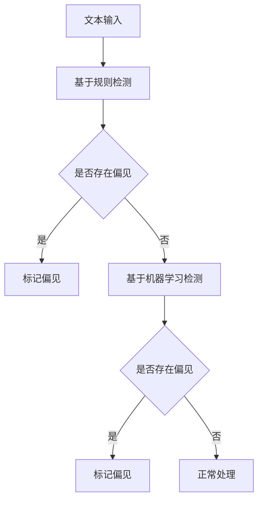

                 

## 文章标题：提示词工程在自然语言处理中的偏见检测

### 关键词：自然语言处理，偏见检测，提示词工程，机器学习，深度学习，模型解释性

### 摘要：
本文旨在探讨自然语言处理（NLP）中提示词工程的作用及其在偏见检测方面的应用。随着NLP技术的不断进步，偏见检测成为确保模型公平性和透明性的关键环节。通过分析提示词工程的基本概念、方法和技术，本文揭示了其在自然语言处理偏见检测中的重要性。本文将逐步探讨偏见检测的基础概念、自然语言处理中的偏见问题、传统与现代化偏见检测方法、提示词工程的优势和实践案例，并展望偏见检测的未来趋势。希望通过本文，读者能够更好地理解提示词工程在自然语言处理偏见检测中的关键作用，并为实际应用提供有价值的参考。

## 第一部分：偏见检测的基础概念

### 1.1 偏见检测的定义与重要性

偏见检测是指在数据、算法和模型中识别并纠正偏见的过程。这些偏见可能来源于数据集的构建、算法设计或模型训练过程中的不当操作，从而影响模型的预测结果，造成不公平或不准确的判断。在自然语言处理（NLP）领域中，偏见检测尤为重要，因为文本数据中往往包含了大量的社会、文化、历史背景等信息，这些信息可能带有偏见，从而影响模型的性能和解释性。

偏见检测的重要性主要体现在以下几个方面：

1. **保障模型公平性**：偏见的存在可能导致模型对某些群体或特定个体产生不公平的待遇，从而损害社会公正。通过偏见检测，可以发现并纠正这些不公平现象，确保模型在处理不同数据时能够保持公平性。

2. **提高模型解释性**：偏见检测有助于揭示模型中的偏见来源，从而提高模型的透明度和解释性。这有助于用户理解模型的决策过程，增加模型的信任度。

3. **避免法律风险**：在商业和政府等应用场景中，模型偏见可能导致法律责任和声誉风险。通过偏见检测，可以降低这些风险，确保模型符合法律法规要求。

### 1.2 偏见检测的挑战与机遇

#### 1.2.1 数据偏差

数据偏差是偏见检测的主要挑战之一。数据集的构建过程中可能存在人为干预或数据收集不完整、不公正等问题，导致数据集中出现偏见。例如，训练数据集中可能存在性别、种族、地域等偏见，从而影响模型的预测结果。

#### 1.2.2 模型偏差

模型偏差是指模型在训练过程中对某些特征或数据点过于敏感，导致预测结果产生偏差。这种偏差可能来源于算法设计、特征选择或训练过程的不当操作。

#### 1.2.3 技术挑战

偏见检测技术本身也面临一些挑战。首先，检测算法的准确性和效率需要提高，以确保在实际应用中能够快速、准确地检测偏见。其次，不同领域的偏见检测方法可能存在差异，需要针对具体应用场景进行优化。

#### 1.2.4 应对机遇

尽管偏见检测面临挑战，但同时也存在机遇。随着人工智能技术的发展，偏见检测方法不断优化，为解决偏见问题提供了新的可能性。此外，越来越多的研究人员和从业者关注偏见检测问题，推动了相关领域的研究和应用。

### 1.3 自然语言处理中的偏见问题

自然语言处理中的偏见问题主要包括以下几个方面：

1. **性别偏见**：在文本分类、情感分析等任务中，模型可能对男性和女性产生不同的反应，导致性别歧视。

2. **种族偏见**：某些模型可能对特定种族或民族群体的描述产生偏见，影响预测结果。

3. **文化偏见**：跨文化交流中的文化差异可能导致模型在处理不同文化背景的文本时产生偏见。

4. **地域偏见**：地域偏见可能影响模型对不同地区数据的处理，导致地区歧视。

通过本文的进一步探讨，我们将深入了解自然语言处理中的偏见检测方法，以及提示词工程在其中的关键作用。

## 第二部分：自然语言处理中的偏见检测方法

自然语言处理（NLP）中的偏见检测是一项重要的研究课题，它涉及到如何识别、评估和纠正模型中的偏见。本部分将介绍偏见检测的传统方法和现代化方法，包括基于规则的偏见检测、基于统计的偏见检测、基于机器学习的偏见检测和基于深度学习的偏见检测。通过这些方法的详细分析，我们将了解它们各自的优势、局限性和应用场景。

### 2.1 传统方法

传统方法主要依赖于规则和统计分析，这些方法在早期NLP应用中发挥了重要作用。尽管它们在处理简单任务时具有一定的效果，但在面对复杂的数据和模型时，它们的局限性逐渐显现。

#### 2.1.1 基于规则的偏见检测

基于规则的偏见检测方法通过定义一系列规则来识别和纠正模型中的偏见。这些规则通常由领域专家根据经验和常识制定，然后应用在模型预测过程中。

- **规则构建**：领域专家根据具体应用场景，分析可能导致偏见的因素，并制定相应的规则。例如，在性别偏见检测中，可以定义以下规则：
  - 如果文本中包含“女性”一词，则标记为可能存在性别偏见。
  - 如果文本中包含“黑人”一词，则标记为可能存在种族偏见。

- **规则应用**：在模型预测过程中，根据定义的规则对文本进行扫描，标记出可能存在偏见的部分。例如，在文本分类任务中，如果某个类别被频繁标记为存在偏见，则可以对该类别进行进一步分析或调整。

  ```mermaid
  graph TD
  A[文本输入] --> B[规则匹配]
  B --> C{是否存在偏见}
  C -->|是| D[标记偏见]
  C -->|否| E[正常处理]
  ```

- **优点**：基于规则的偏见检测方法简单、直观，易于理解和实现。

- **缺点**：由于规则依赖人工制定，难以覆盖所有可能的偏见情况，且规则的更新和维护成本较高。

#### 2.1.2 基于统计的偏见检测

基于统计的偏见检测方法通过分析文本数据中的统计特征来识别和纠正偏见。这些方法通常利用统计学原理和算法，如概率模型、支持向量机（SVM）等，来检测偏见。

- **统计模型**：在基于统计的偏见检测中，常用的统计模型包括逻辑回归、朴素贝叶斯等。这些模型通过分析文本数据中的特征，预测是否存在偏见。

  ```python
  # 伪代码：逻辑回归模型用于偏见检测
  def logistic_regression(text_data, bias_labels):
      # 训练逻辑回归模型
      model = train_logistic_regression(text_data, bias_labels)
      # 预测是否存在偏见
      predictions = model.predict(text_data)
      return predictions
  ```

- **模型训练与评估**：在训练过程中，将带有偏见标签的文本数据输入模型，训练模型以识别偏见。在评估阶段，通过交叉验证和测试集，评估模型的偏见检测性能。

  ```python
  # 伪代码：评估模型性能
  from sklearn.model_selection import train_test_split
  from sklearn.metrics import accuracy_score

  # 数据分割
  train_data, test_data, train_labels, test_labels = train_test_split(text_data, bias_labels, test_size=0.2)

  # 训练模型
  model = logistic_regression(train_data, train_labels)

  # 预测
  predictions = model.predict(test_data)

  # 评估
  accuracy = accuracy_score(test_labels, predictions)
  print(f"Model accuracy: {accuracy}")
  ```

- **优点**：基于统计的偏见检测方法相对于基于规则的检测方法，能够自动学习文本数据中的特征，提高检测的准确性。

- **缺点**：统计模型通常需要大量的训练数据和计算资源，且对噪声数据和异常值较为敏感。

### 2.2 现代方法

随着机器学习和深度学习技术的发展，偏见检测方法也趋向于更加复杂和智能化。现代方法利用机器学习和深度学习算法，从大量数据中自动学习特征，从而提高偏见检测的性能和准确性。

#### 2.2.1 基于机器学习的偏见检测

基于机器学习的偏见检测方法通过训练模型来自动识别偏见。这些方法通常使用监督学习算法，如决策树、随机森林和支持向量机（SVM）等。

- **偏见检测算法**：在基于机器学习的偏见检测中，常用的算法包括决策树、随机森林和SVM等。这些算法通过分析文本数据，学习偏见特征，并预测是否存在偏见。

  ```python
  # 伪代码：使用决策树进行偏见检测
  from sklearn.tree import DecisionTreeClassifier

  # 训练决策树模型
  model = DecisionTreeClassifier()
  model.fit(text_data, bias_labels)

  # 预测
  predictions = model.predict(text_data)
  ```

- **模型训练与评估**：与基于统计的方法类似，基于机器学习的偏见检测方法也通过训练和评估过程来优化模型性能。在训练过程中，使用带有偏见标签的文本数据训练模型；在评估过程中，使用测试集验证模型性能。

  ```python
  # 伪代码：评估模型性能
  from sklearn.model_selection import train_test_split
  from sklearn.metrics import accuracy_score

  # 数据分割
  train_data, test_data, train_labels, test_labels = train_test_split(text_data, bias_labels, test_size=0.2)

  # 训练模型
  model = DecisionTreeClassifier()
  model.fit(train_data, train_labels)

  # 预测
  predictions = model.predict(test_data)

  # 评估
  accuracy = accuracy_score(test_labels, predictions)
  print(f"Model accuracy: {accuracy}")
  ```

- **优点**：基于机器学习的偏见检测方法能够自动学习复杂的特征，提高检测的准确性。

- **缺点**：训练过程需要大量数据和计算资源，且对数据预处理和特征选择有较高要求。

#### 2.2.2 基于深度学习的偏见检测

基于深度学习的偏见检测方法利用深度神经网络，从大量数据中自动学习特征和模式。这些方法在处理复杂任务时表现出色，成为偏见检测研究的重要方向。

- **深度学习模型**：在基于深度学习的偏见检测中，常用的模型包括卷积神经网络（CNN）、循环神经网络（RNN）和变换器（Transformer）等。这些模型能够处理复杂的文本数据，学习其中的特征和模式。

  ```python
  # 伪代码：使用变换器进行偏见检测
  import tensorflow as tf
  from tensorflow.keras.layers import Embedding, Transformer

  # 构建变换器模型
  model = tf.keras.Sequential([
      Embedding(input_dim=vocab_size, output_dim=embedding_dim),
      Transformer(num_heads=4, d_model=embedding_dim),
      tf.keras.layers.Dense(1, activation='sigmoid')
  ])

  # 编译模型
  model.compile(optimizer='adam', loss='binary_crossentropy', metrics=['accuracy'])

  # 训练模型
  model.fit(text_data, bias_labels, epochs=10, batch_size=32)
  ```

- **模型训练与评估**：与传统的机器学习方法类似，基于深度学习的偏见检测方法也通过训练和评估过程来优化模型性能。在训练过程中，使用带有偏见标签的文本数据训练模型；在评估过程中，使用测试集验证模型性能。

  ```python
  # 伪代码：评估模型性能
  from sklearn.model_selection import train_test_split
  from sklearn.metrics import accuracy_score

  # 数据分割
  train_data, test_data, train_labels, test_labels = train_test_split(text_data, bias_labels, test_size=0.2)

  # 训练模型
  model.fit(train_data, train_labels, epochs=10, batch_size=32)

  # 预测
  predictions = model.predict(test_data)

  # 评估
  accuracy = accuracy_score(test_labels, predictions)
  print(f"Model accuracy: {accuracy}")
  ```

- **优点**：基于深度学习的偏见检测方法能够自动学习复杂的特征，处理大规模文本数据，提高检测的准确性。

- **缺点**：训练过程需要大量数据和计算资源，模型参数调优复杂。

### 2.3 结合多种方法的偏见检测

在实际应用中，不同方法的结合往往能够提高偏见检测的效果。例如，可以结合基于规则的检测方法和基于机器学习的检测方法，利用规则的快速检测能力与机器学习的复杂特征学习能力，实现更高效的偏见检测。



通过结合多种偏见检测方法，可以更全面地识别和纠正模型中的偏见，提高检测的准确性和可靠性。

## 第三部分：提示词工程在偏见检测中的应用

### 3.1 提示词工程的基本概念

提示词工程（Prompt Engineering）是一种设计提示词（prompt）以优化模型性能的方法。提示词是一种引导模型输出的文本，通常用于提示模型关注特定信息或执行特定任务。在自然语言处理（NLP）中，提示词工程可以用于多种任务，如文本分类、问答系统和语言生成等。通过精心设计的提示词，可以提高模型的性能、解释性和可靠性。

### 3.2 提示词工程在偏见检测中的优势

提示词工程在偏见检测中具有显著的优势，主要体现在以下几个方面：

#### 3.2.1 提高模型的泛化能力

通过提示词工程，可以引导模型关注更加多样化的数据，从而提高模型的泛化能力。例如，在设计偏见检测模型时，可以使用多样化的提示词来涵盖不同性别、种族、地域和文化背景的文本，帮助模型学习到更加全面和公正的特征。

#### 3.2.2 避免数据偏差

提示词工程可以帮助减少数据偏差对模型的影响。在数据集构建过程中，可以使用提示词来引导数据收集和标注，从而避免人为偏见。例如，在性别偏见检测中，可以设计包含男性和女性角色平等对话的提示词，确保数据集的多样性。

#### 3.2.3 提高模型解释性

提示词工程可以增强模型的可解释性，帮助用户理解模型的决策过程。通过分析提示词的响应，用户可以更好地了解模型在处理特定任务时的思考逻辑和特征关注点。这有助于提高模型的信任度和透明度，特别是在涉及伦理和法律问题的场景中。

#### 3.2.4 支持个性化需求

提示词工程支持根据用户需求和场景动态调整模型。通过设计不同类型的提示词，模型可以适应不同的应用场景，例如法律文件审查、新闻内容筛选和社交网络监控等。这种灵活性有助于提高模型的适用性和实用性。

### 3.3 提示词工程的实践案例

为了更好地理解提示词工程在偏见检测中的应用，以下列举两个具体的实践案例。

#### 3.3.1 案例一：文本分类中的偏见检测

在文本分类任务中，使用提示词工程可以有效地检测和纠正模型中的偏见。以下是一个简单的示例：

- **提示词设计**：设计一组包含不同性别、种族和文化背景的文本片段，作为分类任务的提示词。例如：

  ```plaintext
  - 文本A：男性领导在公共演讲中的表现。
  - 文本B：女性领导在公共演讲中的表现。
  - 文本C：黑人社区活动报道。
  - 文本D：白人社区活动报道。
  - 文本E：传统节日庆祝活动。
  - 文本F：现代节日庆祝活动。
  ```

- **模型训练与评估**：使用这些提示词训练文本分类模型，并评估模型在不同类别上的表现。通过对比不同类别之间的分类准确率和F1分数，可以识别模型中可能存在的偏见。

  ```python
  # 伪代码：训练和评估文本分类模型
  from sklearn.feature_extraction.text import CountVectorizer
  from sklearn.naive_bayes import MultinomialNB
  from sklearn.metrics import classification_report

  # 数据预处理
  vectorizer = CountVectorizer()
  X = vectorizer.fit_transform(templates)

  # 数据分割
  X_train, X_test, y_train, y_test = train_test_split(X, labels, test_size=0.2)

  # 训练模型
  model = MultinomialNB()
  model.fit(X_train, y_train)

  # 预测
  predictions = model.predict(X_test)

  # 评估
  report = classification_report(y_test, predictions)
  print(report)
  ```

- **结果分析**：通过分析分类报告，可以识别模型在特定类别上的偏差，并采取相应的措施进行调整。例如，如果模型在分类女性领导表现时准确率较低，可以增加包含女性领导表现的提示词，以帮助模型学习。

#### 3.3.2 案例二：情感分析中的偏见检测

在情感分析任务中，使用提示词工程可以有效地检测和纠正情感偏见。以下是一个简单的示例：

- **提示词设计**：设计一组包含积极和消极情感表达的文本片段，作为情感分析的提示词。例如：

  ```plaintext
  - 文本A：我非常喜欢这个新产品。
  - 文本B：这个产品真的太差了。
  - 文本C：今天天气非常好，我很高兴。
  - 文本D：今天天气非常糟糕，我很郁闷。
  - 文本E：这次旅行真是太棒了。
  - 文本F：这次旅行真是太糟糕了。
  ```

- **模型训练与评估**：使用这些提示词训练情感分析模型，并评估模型在不同情感类别上的表现。通过对比不同类别之间的准确率和混淆矩阵，可以识别模型中可能存在的偏见。

  ```python
  # 伪代码：训练和评估情感分析模型
  from sklearn.feature_extraction.text import TfidfVectorizer
  from sklearn.svm import LinearSVC
  from sklearn.metrics import accuracy_score, confusion_matrix

  # 数据预处理
  vectorizer = TfidfVectorizer()
  X = vectorizer.fit_transform(templates)

  # 数据分割
  X_train, X_test, y_train, y_test = train_test_split(X, labels, test_size=0.2)

  # 训练模型
  model = LinearSVC()
  model.fit(X_train, y_train)

  # 预测
  predictions = model.predict(X_test)

  # 评估
  accuracy = accuracy_score(y_test, predictions)
  cm = confusion_matrix(y_test, predictions)
  print(f"Accuracy: {accuracy}")
  print(f"Confusion Matrix:\n{cm}")
  ```

- **结果分析**：通过分析准确率和混淆矩阵，可以识别模型在特定情感类别上的偏见。例如，如果模型在检测消极情感时准确率较低，可以增加包含消极情感表达的提示词，以提高模型的准确性。

通过这些实践案例，可以看出提示词工程在自然语言处理中的偏见检测中具有重要的作用。通过精心设计提示词，可以引导模型学习到更加全面和公正的特征，从而提高模型的性能和可靠性。

## 第四部分：偏见检测的挑战与未来趋势

### 4.1 偏见检测的挑战

尽管偏见检测在自然语言处理（NLP）中具有重要意义，但实际应用中仍面临诸多挑战：

#### 4.1.1 数据集质量

偏见检测依赖于高质量的数据集。然而，现有的数据集可能存在数据不平衡、样本选择偏差等问题，这会影响检测结果的准确性。此外，数据集可能缺乏代表性，无法全面覆盖不同群体和情境，从而限制偏见检测的效果。

#### 4.1.2 模型解释性

现有的偏见检测方法往往难以提供充分的解释性。虽然机器学习和深度学习方法在性能上取得显著进展，但其决策过程复杂，难以解释。缺乏透明度和解释性可能降低模型的信任度，特别是在涉及法律、医疗等敏感领域时。

#### 4.1.3 模型评估

偏见检测模型的评估是一个复杂的过程。评估指标需要平衡准确性、公平性和解释性等多方面因素。此外，评估过程中的误差可能源自数据集的选择、模型的复杂性和评估方法的不确定性。

### 4.2 未来趋势

未来，偏见检测在NLP领域的发展将朝着以下几个趋势前进：

#### 4.2.1 自动化偏见检测

随着人工智能技术的发展，自动化偏见检测将成为可能。通过利用深度学习和其他机器学习算法，可以自动识别和纠正模型中的偏见，减少人工干预，提高检测效率。

#### 4.2.2 多语言偏见检测

语言多样性是NLP领域的一个重要特点。未来的偏见检测将逐渐扩展到多语言环境，为不同语言和文化背景提供公平和准确的检测方法。

#### 4.2.3 深度学习模型的可解释性

提高深度学习模型的可解释性是未来的一个重要研究方向。通过发展新的方法和技术，如可视化工具和解释性算法，可以更好地理解模型的决策过程，增加模型的透明度和信任度。

#### 4.2.4 集成多种方法

结合多种偏见检测方法，如基于规则的、基于统计的、基于机器学习和基于深度学习的方法，可以更全面地识别和纠正模型中的偏见，提高检测的准确性和可靠性。

## 第五部分：总结与展望

### 5.1 偏见检测的总结

偏见检测在自然语言处理（NLP）中具有重要意义，它有助于确保模型的公平性、提高模型的可解释性并降低法律和声誉风险。通过分析偏见检测的基础概念、传统方法、现代化方法和提示词工程的应用，本文揭示了偏见检测在NLP中的关键作用。

### 5.2 偏见检测的展望

未来，偏见检测在NLP领域的发展将面临一系列挑战，同时也充满机遇。自动化偏见检测、多语言偏见检测、深度学习模型的可解释性以及多种方法的集成将是未来的重要研究方向。通过不断探索和创新，偏见检测技术将变得更加成熟和实用，为构建公平、透明和可靠的人工智能系统提供有力支持。

### 5.3 结论

偏见检测是自然语言处理（NLP）领域的关键问题，通过提示词工程的应用，我们可以有效地识别和纠正模型中的偏见。本文通过详细的分析和案例，展示了提示词工程在偏见检测中的重要性。未来的研究应继续探索自动化、多语言和可解释性等方面的技术，以推动偏见检测技术的发展，为构建公正和透明的人工智能系统做出贡献。

### 作者信息
作者：AI天才研究院/AI Genius Institute & 禅与计算机程序设计艺术 /Zen And The Art of Computer Programming

