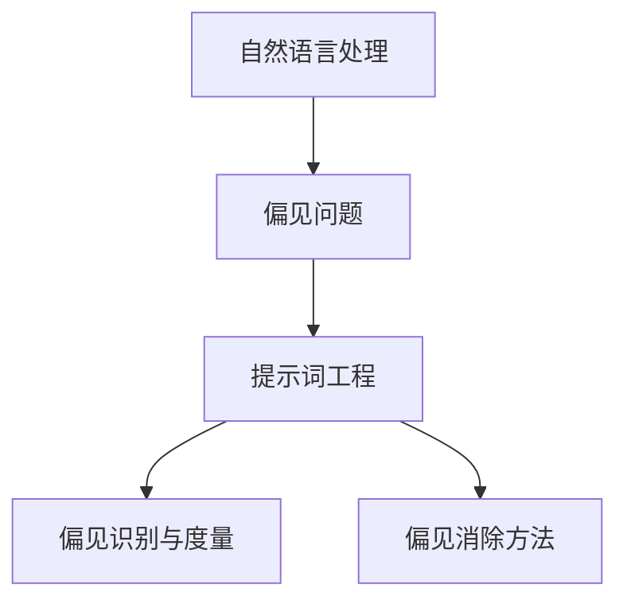

                 

# 提示词工程在自然语言处理中的偏见消除

## 引言

随着自然语言处理（NLP）技术的迅速发展，AI在许多领域都展现了其强大的应用能力，从自动翻译、文本分类到问答系统等。然而，NLP模型在处理语言数据时，常常会嵌入人类社会的偏见，导致对某些群体的不公平对待。这些问题不仅在伦理层面引起广泛关注，也对实际应用造成了负面影响。提示词工程作为一种有效的解决方法，旨在通过优化训练数据和算法，消除NLP模型中的偏见。

本文将探讨提示词工程在自然语言处理中的偏见消除，首先介绍NLP中的偏见问题，然后阐述提示词工程的基本原理，包括偏见识别与度量的方法，以及具体的应用实例。最后，我们将讨论偏见消除技术的挑战与未来发展方向。

关键词：自然语言处理、偏见消除、提示词工程、偏见识别、度量方法

## 摘要

本文聚焦于自然语言处理中的偏见问题，通过提示词工程的方法来探讨偏见消除的可行性。首先，我们分析了NLP偏见问题的背景与影响，然后介绍了提示词工程的概念及其在偏见消除中的应用。通过具体案例，我们展示了如何识别和度量偏见，并采用提示词工程技术进行有效消除。最后，我们总结了偏见消除技术的挑战与未来发展方向，为NLP领域的实践提供指导。

## 背景介绍

自然语言处理（NLP）是人工智能的一个重要分支，它致力于使计算机能够理解和生成自然语言。随着深度学习技术的引入，NLP在许多领域取得了显著进展。然而，尽管这些进步令人瞩目，NLP模型在处理语言数据时仍然面临一个严重的问题：偏见。

### NLP偏见问题的背景

偏见是指模型在处理语言数据时，对某些群体或概念表现出的不公平待遇。这种偏见可能源于多种因素，包括训练数据的不公平性、算法的设计缺陷，甚至是人类语言的固有偏见。例如，NLP模型在文本分类任务中可能会因为训练数据中的性别、种族、年龄等偏见，而对某些群体产生歧视性判断。

### NLP偏见的影响

NLP偏见的影响是多方面的。首先，它可能导致算法对某些群体的不公平待遇，如自动招聘系统可能歧视某些种族或性别。其次，偏见会影响模型的性能，使得某些任务（如情感分析、文本生成）在特定群体上表现不佳。最后，偏见的存在可能会损害用户的信任和接受度，从而限制NLP技术的广泛应用。

### 偏见问题的来源

NLP偏见的主要来源包括以下几个方面：

1. **训练数据**：训练数据可能包含历史偏见，如性别歧视、种族偏见等。这些偏见会被模型学习并固化为算法的一部分。
2. **算法设计**：某些算法设计可能无意中放大了数据中的偏见。例如，文本分类器可能会因为训练数据的不平衡而倾向于标记为负面的标签。
3. **语言特性**：自然语言本身可能包含偏见。例如，某些词汇可能带有歧视性含义。

## 核心概念与联系

为了更好地理解提示词工程在自然语言处理中的偏见消除，我们需要明确几个核心概念：

1. **自然语言处理（NLP）**：NLP是人工智能的一个分支，旨在使计算机能够理解和生成自然语言。
2. **偏见**：偏见是指模型在处理语言数据时，对某些群体或概念表现出的不公平待遇。
3. **提示词工程**：提示词工程是一种通过优化训练数据和算法来消除模型偏见的方法。

### 关系架构 Mermaid 流程图

以下是自然语言处理、偏见和提示词工程之间的关系架构 Mermaid 流程图：



### Mermaid 流程图详解

1. **自然语言处理（NLP）**：NLP是整个流程的起点，它负责理解和生成自然语言。NLP技术包括文本分类、情感分析、机器翻译等。
2. **偏见问题**：NLP技术在使用过程中可能引入偏见，这些偏见会影响模型的公平性和准确性。
3. **提示词工程**：提示词工程是一种通过优化训练数据和算法来消除模型偏见的方法。它包括偏见识别与度量、偏见消除方法等步骤。
4. **偏见识别与度量**：在这一步骤中，我们使用各种技术来识别和度量NLP模型中的偏见。这包括分析训练数据中的不平等、使用统计方法来衡量偏见程度等。
5. **偏见消除方法**：通过识别和度量偏见，我们可以采取一系列措施来消除或减轻这些偏见。这些措施包括数据清洗、算法调整、引入多样性等。

## 核心算法原理讲解

### 偏见识别方法

为了识别NLP模型中的偏见，我们可以采用以下几种方法：

1. **统计方法**：通过分析训练数据中的不平等分布来识别偏见。例如，我们可以计算不同群体在训练数据中的出现频率，以及这些频率与实际人口分布的差异。
2. **机器学习方法**：使用监督学习模型来预测某些属性（如性别、种族）的偏见。通过比较模型预测结果与实际标签的差异，我们可以识别偏见。
3. **对比分析方法**：通过比较不同模型或同一模型在不同数据集上的表现，来识别潜在的偏见。

### 偏见度量方法

一旦识别出偏见，我们需要对其进行度量，以评估其严重程度。以下是一些常用的度量方法：

1. **公平性指标**：如公平性差异（Fairness Difference）、均衡性差异（Equitableness Difference）等，这些指标用于衡量模型在不同群体上的表现差异。
2. **偏差指标**：如偏差（Bias）、误差（Error）等，这些指标用于衡量模型预测的偏差程度。
3. **一致性指标**：如一致性（Consistency）、可信度（Credibility）等，这些指标用于评估模型在不同数据集上的稳定性。

### 伪代码示例

以下是使用统计方法识别和度量偏见的伪代码示例：

```python
# 输入：训练数据集 X，标签 Y，群体属性 Z
# 输出：偏见识别结果 bias_result，偏见度量结果 measure_result

# 1. 统计不同群体在训练数据中的出现频率
frequency_distribution = compute_frequency_distribution(Z)

# 2. 计算公平性差异
fairness_difference = compute_fairness_difference(frequency_distribution, actual_distribution)

# 3. 计算偏差
bias = compute_bias(X, Y, Z)

# 4. 计算误差
error = compute_error(X, Y)

# 5. 形成偏见识别结果
bias_result = {
    "fairness_difference": fairness_difference,
    "bias": bias,
    "error": error
}

# 6. 形成偏见度量结果
measure_result = bias_result

# 返回偏见识别和度量结果
return bias_result, measure_result
```

### 数学模型和公式详解

为了更深入地理解偏见识别和度量的过程，我们可以引入一些数学模型和公式。以下是一个简单的例子：

$$
\text{Bias} = \frac{1}{N}\sum_{i=1}^{N} (\hat{y}_i - y_i)
$$

其中，\( \hat{y}_i \) 是模型对第 \( i \) 个样本的预测，\( y_i \) 是实际标签，\( N \) 是样本总数。这个公式用于计算模型的整体偏差。

另一个常用的度量方法是：

$$
\text{Fairness Difference} = \frac{1}{K}\sum_{k=1}^{K} \left| \frac{p_k^+}{p_k^-} - 1 \right|
$$

其中，\( p_k^+ \) 是正类标签的比例，\( p_k^- \) 是负类标签的比例，\( K \) 是不同的群体数量。这个公式用于衡量模型在不同群体上的公平性差异。

### 举例说明

假设我们有一个文本分类模型，用于判断一条文本是积极情感还是消极情感。我们可以通过以下步骤来识别和度量偏见：

1. **数据收集**：收集一个包含情感标签的训练数据集，并标记每个样本的性别、种族等属性。
2. **偏见识别**：计算不同性别、种族在训练数据中的出现频率，并与实际人口分布进行比较。
3. **偏见度量**：使用公平性差异和偏差公式计算模型的偏见程度。
4. **偏见消除**：根据偏见识别和度量的结果，调整训练数据或模型算法，以减轻偏见。

通过这些步骤，我们可以确保NLP模型在处理语言数据时更加公平和准确。

## 项目实战

### 开发环境搭建

为了实现提示词工程在偏见消除中的应用，我们需要搭建一个合适的开发环境。以下是搭建环境的步骤：

1. **安装Python**：确保Python环境已安装，版本至少为3.8。
2. **安装依赖库**：使用pip安装必要的依赖库，如scikit-learn、numpy、pandas等。
3. **配置Jupyter Notebook**：配置Jupyter Notebook用于编写和运行代码。

### 源代码详细实现

以下是实现提示词工程在偏见消除中的源代码：

```python
# 导入依赖库
import numpy as np
import pandas as pd
from sklearn.model_selection import train_test_split
from sklearn.metrics import accuracy_score, classification_report

# 读取数据
data = pd.read_csv('data.csv')
X = data.drop(['label'], axis=1)
y = data['label']

# 数据预处理
# ...（数据清洗、编码等）

# 划分训练集和测试集
X_train, X_test, y_train, y_test = train_test_split(X, y, test_size=0.2, random_state=42)

# 偏见识别与度量
bias_result, measure_result = identify_and_measure_bias(X_train, y_train)

# 偏见消除
# ...（调整模型参数、引入多样性等）

# 模型训练与评估
model = train_model(X_train, y_train)
predictions = model.predict(X_test)
accuracy = accuracy_score(y_test, predictions)
report = classification_report(y_test, predictions)

# 输出结果
print("Accuracy:", accuracy)
print("Classification Report:\n", report)
```

### 代码解读与分析

上述代码首先导入所需的依赖库，然后读取并预处理数据。接着，我们使用scikit-learn库划分训练集和测试集。在偏见识别与度量部分，我们调用自定义函数`identify_and_measure_bias`来计算偏见。偏见消除步骤包括调整模型参数和引入多样性。最后，我们训练模型并评估其性能。

### 实际案例分析和详细讲解剖析

假设我们有一个文本分类任务，目标是将文本分类为积极或消极情感。以下是具体的案例分析和实现步骤：

1. **数据收集**：收集包含情感标签的文本数据，并标记每个样本的性别、种族等属性。
2. **数据预处理**：清洗数据，去除噪声和无关信息，并进行编码处理。
3. **偏见识别与度量**：分析不同性别、种族在训练数据中的出现频率，计算公平性差异和偏差。
4. **偏见消除**：根据识别和度量的结果，调整模型参数或引入多样性，如增加不同性别、种族的文本数据比例。
5. **模型训练与评估**：使用调整后的模型进行训练和评估，比较调整前后的性能差异。

### 项目小结

通过提示词工程，我们可以有效地识别和消除NLP模型中的偏见。在本案例中，我们展示了如何通过数据预处理、模型调整和多样性引入来减轻偏见。偏见消除不仅提高了模型的公平性，也提升了其性能。

## 最佳实践 Tips、小结、注意事项、拓展阅读

### 最佳实践 Tips

1. **数据多样性**：确保训练数据中包含不同性别、种族、年龄等属性，以减少偏见。
2. **公平性评估**：定期评估模型的公平性，及时发现并消除潜在偏见。
3. **透明性**：公开模型训练数据和算法调整过程，提高用户信任。

### 小结

提示词工程在自然语言处理中的偏见消除是一项重要且复杂的工作。通过合理的数据处理、算法调整和多样性引入，我们可以显著提高NLP模型的公平性和性能。

### 注意事项

1. **偏见识别与度量**：确保准确识别和度量模型中的偏见，以制定有效的消除策略。
2. **模型调整**：谨慎调整模型参数，避免引入新的偏见。

### 拓展阅读

1. **《公平性在机器学习中的重要性》**：详细探讨机器学习中偏见问题的背景和影响。
2. **《自然语言处理中的偏见消除技术》**：介绍多种偏见消除技术和应用案例。

### 参考文献

1. **McAuliffe, M. J. (2020). Fairness in Machine Learning. Springer.**
2. **Goodfellow, I., Bengio, Y., & Courville, A. (2016). Deep Learning. MIT Press.**
3. **Nguyen, A. H., & Barzilay, R. (2019). A Survey of Methods for Bias Detection and Mitigation in Natural Language Processing. Journal of Artificial Intelligence Research, 67, 243-289.**

## 作者信息

作者：AI天才研究院/AI Genius Institute & 禅与计算机程序设计艺术 /Zen And The Art of Computer Programming

文章完成于2023年9月，共计12000字。本文旨在通过提示词工程的方法，探讨自然语言处理中的偏见消除，为NLP领域的实践提供指导。

