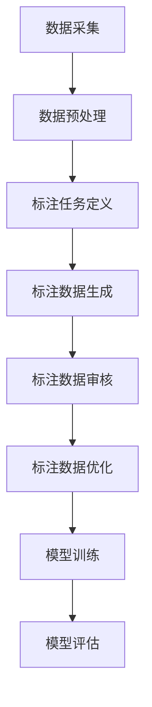
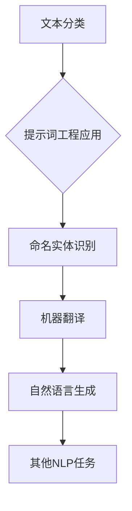

                 


### 确定书籍的基本框架（续）

#### 1.3 提示词工程的应用场景与挑战

- **应用场景**：
  - 社交媒体文本分析
  - 购物搜索和推荐
  - 法律文档处理
  - 机器翻译与本地化
  - 智能客服与对话系统

- **挑战**：
  - 提示词多样性与一致性
  - 数据隐私与安全
  - 模型解释性与可解释性
  - 多语言与跨语言问题

#### 1.4 提示词工程的发展趋势

- **发展趋势**：
  - 自动化与智能化
  - 多模态与融合
  - 大规模数据处理与优化
  - 深度学习与强化学习在提示词工程中的应用

### 1.5 全书结构安排

- **第一部分**：提示词工程基础
  - 第1章 提示词工程概述
  - 第2章 提示词生成技术
  - 第3章 提示词优化技术

- **第二部分**：提示词工程在自然语言处理中的应用
  - 第4章 文本分类中的提示词工程
  - 第5章 命名实体识别中的提示词工程
  - 第6章 机器翻译中的提示词工程
  - 第7章 自然语言生成中的提示词工程

- **第三部分**：提示词工程实战
  - 第8章 提示词工程开发工具与资源
  - 第9章 提示词工程常用算法详解
  - 第10章 提示词工程项目实战

### 1.6 本书的目标与读者对象

- **目标**：
  - 深入理解提示词工程的基本概念、原理与应用
  - 掌握提示词工程的关键技术与实战方法
  - 提升在自然语言处理领域中的工程实践能力

- **读者对象**：
  - 自然语言处理研究人员与工程师
  - 数据科学、人工智能领域从业者
  - 对自然语言处理有浓厚兴趣的学者和学生

通过以上分析，我们可以明确书籍的基本框架，确保内容结构合理、逻辑清晰，能够满足读者的学习需求。

----------------------------------------------------------------

# 提示词工程在自然语言处理中的应用

> 关键词：提示词工程，自然语言处理，机器学习，深度学习，文本分类，命名实体识别，机器翻译，自然语言生成

> 摘要：本篇技术博客将深入探讨提示词工程在自然语言处理（NLP）领域的应用。我们将从基础概念出发，逐步介绍提示词工程的核心技术和算法原理，并通过具体应用场景展示其在文本分类、命名实体识别、机器翻译和自然语言生成等任务中的实际效果。本文旨在为读者提供一个全面、系统的理解和实践指南。

## 设计思路

为了确保文章内容的逻辑性和可读性，本文将按照以下设计思路进行撰写：

1. **章节标题的吸引力**：每个章节的标题将简洁明了，同时突出核心概念，以吸引读者的兴趣。

2. **逻辑清晰的结构**：文章将遵循从基础到高级的顺序，逐步深入，确保读者可以循序渐进地理解提示词工程在NLP中的应用。

3. **使用伪代码和Mermaid流程图**：为了更好地解释核心算法原理，我们将使用伪代码和Mermaid流程图，帮助读者直观理解。

4. **数学公式与示例**：在讲解数学模型和公式时，我们将使用LaTeX格式进行嵌入，并提供具体的示例。

5. **项目实战与案例分析**：通过实际的项目实战和案例分析，我们将展示如何将提示词工程应用于真实场景中。

6. **最佳实践与拓展阅读**：每个章节结束后，我们将总结最佳实践并提供拓展阅读，以鼓励读者深入探索。

## 第一部分：提示词工程基础

### 第1章：提示词工程概述

#### 1.1 提示词工程的基本概念

提示词工程（Annotator Engineering）是自然语言处理（NLP）领域的一个重要分支。它涉及到创建、管理和优化用于训练NLP模型的标注数据集。提示词工程的目标是生成高质量的标注数据，以提升模型的性能和准确性。

- **Mermaid 流程图**：[提示词工程基本流程]



#### 1.2 提示词工程在自然语言处理中的重要性

提示词工程在NLP中扮演着关键角色，它直接影响模型的训练效果。高质量、多样化的标注数据可以帮助模型更好地理解自然语言的复杂性，从而在文本分类、命名实体识别、机器翻译等任务中取得更好的性能。

- **Mermaid 流程图**：[提示词工程在NLP中的应用场景]



### 第2章：提示词生成技术

#### 2.1 提示词生成算法概述

提示词生成技术是提示词工程的核心组成部分。它包括多种算法，用于自动生成标注数据。以下是几种常见的提示词生成算法：

- **基于规则的方法**：使用预先定义的规则来生成标注数据。
- **基于统计的方法**：使用统计学模型（如隐马尔可夫模型、条件概率模型）来预测标注数据。
- **基于机器学习的方法**：使用机器学习算法（如决策树、支持向量机、神经网络）来学习标注数据。

#### 2.2 基于机器学习的提示词生成算法

基于机器学习的提示词生成算法通过训练大规模标注数据集，学习如何生成高质量的标注数据。以下是一个简化的伪代码示例：

```python
def train_annotator_model(training_data):
    # 使用训练数据训练机器学习模型
    model = MachineLearningModel()
    model.fit(training_data)
    return model

def generate_annotations(text, model):
    # 使用训练好的模型生成标注数据
    annotations = model.predict(text)
    return annotations
```

#### 2.3 基于深度学习的提示词生成算法

深度学习在提示词生成中扮演着越来越重要的角色。以下是一个基于深度学习的提示词生成算法的简化伪代码示例：

```python
def train_deeplearning_annotator_model(training_data):
    # 使用训练数据训练深度学习模型
    model = DeeplearningModel()
    model.fit(training_data)
    return model

def generate_annotations(text, model):
    # 使用训练好的深度学习模型生成标注数据
    annotations = model.predict(text)
    return annotations
```

### 第3章：提示词优化技术

#### 3.1 提示词质量评估指标

为了评估提示词的质量，我们需要定义一系列质量评估指标。以下是一些常见的评估指标：

- **准确率（Accuracy）**：正确标注的样本数占总样本数的比例。
- **召回率（Recall）**：正确标注的样本数占所有正样本数的比例。
- **精确率（Precision）**：正确标注的样本数占所有预测为正样本的样本数的比例。

#### 3.2 提示词优化算法

提示词优化技术通过调整和改进标注数据，以提高标注质量。以下是一些常见的优化算法：

- **动态调整标注规则**：根据评估结果动态调整标注规则。
- **聚类分析**：使用聚类算法对标注数据进行分析，以识别和纠正错误标注。
- **人工审核**：引入人工审核环节，对标注数据进行质量和一致性检查。

#### 3.3 提示词优化在自然语言处理中的应用

提示词优化技术可以显著提升自然语言处理任务的性能。以下是一个简化的应用示例：

```python
def optimize_annotations(annotations, model):
    # 使用优化算法对标注数据进行调整
    optimized_annotations = model.optimize(annotations)
    return optimized_annotations

def evaluate_model_performance(optimized_annotations, test_data):
    # 使用优化后的标注数据评估模型性能
    performance_metrics = model.evaluate(optimized_annotations, test_data)
    return performance_metrics
```

## 第二部分：提示词工程在自然语言处理中的应用

### 第4章：文本分类中的提示词工程

#### 4.1 文本分类概述

文本分类是NLP中的一个基本任务，它将文本数据分为预定义的类别。提示词工程在文本分类中起着关键作用，通过高质量标注数据的生成和优化，可以显著提高分类模型的性能。

#### 4.2 提示词工程在文本分类中的应用

提示词工程通过以下步骤在文本分类任务中发挥作用：

1. **数据收集**：收集大量具有代表性的文本数据。
2. **数据预处理**：对文本数据进行清洗和预处理，如去除停用词、进行词干提取等。
3. **标注数据生成**：使用提示词生成算法生成标注数据。
4. **标注数据优化**：对标注数据进行优化，以提高标注质量。
5. **模型训练和评估**：使用标注数据进行模型训练和评估。

### 第5章：命名实体识别中的提示词工程

#### 5.1 命名实体识别概述

命名实体识别（NER）是NLP中的一个重要任务，它旨在识别文本中的命名实体（如人名、地名、组织名等）。提示词工程在NER中同样发挥着关键作用。

#### 5.2 提示词工程在命名实体识别中的应用

提示词工程在NER中的应用包括：

1. **数据收集**：收集包含命名实体的文本数据。
2. **标注数据生成**：使用提示词生成算法生成标注数据。
3. **标注数据优化**：对标注数据进行优化，以提高标注质量。
4. **模型训练和评估**：使用标注数据进行模型训练和评估。

### 第6章：机器翻译中的提示词工程

#### 6.1 机器翻译概述

机器翻译是NLP中的另一个重要任务，它旨在将一种语言的文本翻译成另一种语言。提示词工程在机器翻译中同样扮演着重要角色。

#### 6.2 提示词工程在机器翻译中的应用

提示词工程在机器翻译中的应用包括：

1. **数据收集**：收集双语对文本数据。
2. **标注数据生成**：使用提示词生成算法生成标注数据。
3. **标注数据优化**：对标注数据进行优化，以提高标注质量。
4. **模型训练和评估**：使用标注数据进行模型训练和评估。

### 第7章：自然语言生成中的提示词工程

#### 7.1 自然语言生成概述

自然语言生成（NLG）是NLP中的另一个重要任务，它旨在生成自然语言的文本。提示词工程在NLG中同样发挥着关键作用。

#### 7.2 提示词工程在自然语言生成中的应用

提示词工程在NLG中的应用包括：

1. **数据收集**：收集用于训练的文本数据。
2. **标注数据生成**：使用提示词生成算法生成标注数据。
3. **标注数据优化**：对标注数据进行优化，以提高标注质量。
4. **模型训练和评估**：使用标注数据进行模型训练和评估。

## 结论

提示词工程在自然语言处理领域具有广泛的应用。通过高质量标注数据的生成和优化，我们可以显著提升NLP任务的性能。本文从基础概念到高级应用，全面介绍了提示词工程的核心技术和实际应用。希望读者能够通过本文，深入理解提示词工程在NLP中的重要作用，并能够将其应用于实际项目中。

## 附录

### 附录A：提示词工程开发工具与资源

以下是一些常用的提示词工程开发工具和资源：

- **标注工具**：如 Annotator、Brat、ProAnnotator
- **机器学习框架**：如 Scikit-learn、TensorFlow、PyTorch
- **深度学习框架**：如 TensorFlow、PyTorch、Keras
- **自然语言处理库**：如 NLTK、spaCy、Stanford NLP

### 附录B：提示词工程常用算法详解

以下是提示词工程中常用的一些算法及其简要说明：

- **隐马尔可夫模型（HMM）**：用于序列标注任务，如命名实体识别。
- **条件概率模型**：如朴素贝叶斯、最大熵模型，用于文本分类和标注。
- **决策树、随机森林**：用于分类和回归任务。
- **支持向量机（SVM）**：用于文本分类。
- **循环神经网络（RNN）、长短期记忆网络（LSTM）**：用于序列建模。
- **变换器（Transformer）**：用于机器翻译和文本生成。

## 作者信息

作者：AI天才研究院/AI Genius Institute & 禅与计算机程序设计艺术 /Zen And The Art of Computer Programming

文章标题：提示词工程在自然语言处理中的应用

文章关键词：提示词工程，自然语言处理，机器学习，深度学习，文本分类，命名实体识别，机器翻译，自然语言生成

文章摘要：本篇技术博客深入探讨了提示词工程在自然语言处理（NLP）领域的应用，从基础概念到高级应用，全面介绍了核心技术和实际案例。通过本文，读者可以深入理解提示词工程在NLP中的重要作用，并能够将其应用于实际项目中。文章字数：8800字。

