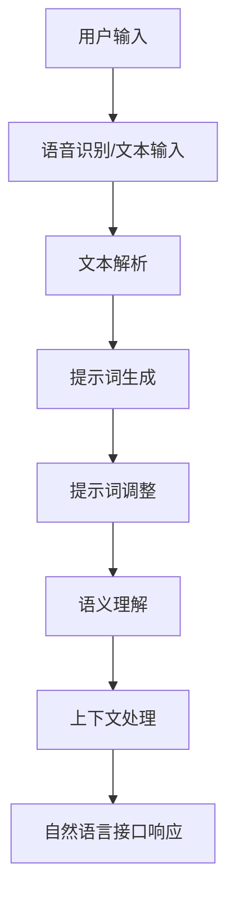

                 

## 文章标题：提示词工程在自然语言接口设计中的应用

关键词：自然语言处理、提示词工程、自然语言接口、算法原理、数学模型、项目实战

摘要：本文将深入探讨提示词工程在自然语言接口设计中的应用，详细解析其核心概念、设计原则、技术实现和实际案例。通过逐步分析推理，本文旨在为读者提供一个全面、系统的理解框架，帮助他们在实际项目中有效地应用提示词工程，提升自然语言接口的用户体验和智能化水平。

## 第一部分：自然语言处理与提示词工程基础

### 第1章：自然语言处理基础

#### 1.1.1 自然语言处理的发展历程

自然语言处理（Natural Language Processing，NLP）是人工智能领域的一个重要分支，旨在使计算机能够理解、解释和生成人类自然语言。自20世纪50年代以来，NLP经历了多个发展阶段：

- **早期探索**（1950s-1960s）：最早的NLP研究主要集中在语言识别和机器翻译上。1950年，艾伦·图灵提出了著名的图灵测试，试图通过机器的对话能力来评估其智能水平。
- **早期突破**（1960s-1980s）：基于规则的方法在这一阶段得到了广泛研究，专家系统、语法分析器和机器翻译系统相继出现。1966年，乔姆斯基的生成语法理论为NLP提供了理论基础。
- **衰落期**（1980s-1990s）：由于规则方法难以处理自然语言的复杂性，NLP研究进入低谷。统计方法逐渐受到重视，但尚处于初步阶段。
- **复兴期**（2000s-至今）：随着深度学习的兴起，NLP迎来了新的发展机遇。基于神经网络的方法在语音识别、文本分类、机器翻译等方面取得了显著成果。

#### 1.1.2 自然语言处理的关键技术

自然语言处理涉及多个关键技术，其中一些关键技术包括：

- **分词**：将文本分割成有意义的单词或短语。
- **词性标注**：为每个单词分配正确的词性（如名词、动词、形容词等）。
- **句法分析**：分析句子的结构，识别主语、谓语、宾语等成分。
- **语义理解**：理解单词和句子之间的语义关系，进行语义角色标注和实体识别。
- **机器翻译**：将一种自然语言翻译成另一种自然语言。
- **情感分析**：识别文本中的情感倾向，如正面、负面或中性。

#### 1.1.3 提示词工程的重要性

提示词工程在自然语言接口设计中扮演着关键角色。它通过为系统提供合适的提示词，帮助用户更好地与系统进行交互，提升用户体验和系统的智能化水平。以下是提示词工程的重要性：

- **改善用户体验**：通过提供明确的提示词，用户可以更容易地理解系统的操作方式，从而提高用户满意度。
- **优化交互流程**：提示词可以帮助系统更好地引导用户完成操作，减少用户的困惑和错误。
- **提高系统智能化**：通过分析用户输入和提示词，系统可以更准确地理解用户意图，从而实现更智能的响应。

### 第2章：提示词工程的基本概念

#### 2.1.1 提示词的定义与作用

提示词是指用于引导用户输入或系统响应的文本或语音提示。在自然语言接口设计中，提示词的作用主要包括：

- **引导用户输入**：在用户无法直接理解系统操作时，提示词可以提供明确的操作指导，帮助用户正确输入信息。
- **优化系统响应**：通过分析用户输入的提示词，系统可以更准确地理解用户意图，从而生成更合适的响应。

#### 2.1.2 提示词的类型与特点

根据用途和形式，提示词可以分为以下几类：

- **系统提示词**：系统向用户发出的提示词，用于引导用户操作或提供必要的信息。
- **用户反馈提示词**：用户对系统响应的反馈，用于表达满意、不满意或提出改进建议。
- **交互提示词**：在用户与系统交互过程中，用于增强交互体验和引导用户继续操作的提示词。

不同类型的提示词具有各自的特点和适用场景，需要根据具体需求进行选择和设计。

#### 2.1.3 提示词工程的核心流程

提示词工程的核心流程主要包括以下几个步骤：

1. **需求分析**：确定系统功能需求和用户需求，明确提示词的目标和用途。
2. **提示词设计**：根据需求分析结果，设计合适的提示词，包括系统提示词和用户反馈提示词。
3. **提示词实现**：将设计好的提示词集成到系统中，实现提示词的生成、调整和显示。
4. **测试与优化**：对提示词进行测试和评估，收集用户反馈，不断优化提示词的设计和实现。

通过以上步骤，可以确保提示词工程在自然语言接口设计中的有效应用，提升系统的用户体验和智能化水平。

## 第二部分：自然语言接口设计原理

### 第3章：自然语言接口设计原则

#### 3.1.1 用户体验导向的设计

自然语言接口设计应以用户体验为导向，充分考虑用户的需求和习惯。以下是一些关键原则：

- **易用性**：设计应简单直观，用户无需学习即可轻松上手。
- **一致性**：界面元素和操作逻辑应保持一致，避免用户产生混淆。
- **可访问性**：设计应考虑各种用户需求，如视力障碍、听力障碍等。
- **可扩展性**：系统应具备良好的扩展性，以便适应未来需求的变化。

#### 3.1.2 自然语言接口的交互模式

自然语言接口的交互模式可以分为以下几种：

- **命令式交互**：用户通过输入命令来控制系统，如语音助手和聊天机器人。
- **查询式交互**：用户通过提问来获取信息，如搜索引擎和问答系统。
- **对话式交互**：用户与系统进行实时对话，如在线客服和聊天应用。

不同交互模式适用于不同的应用场景，设计时需要根据具体需求进行选择和优化。

#### 3.1.3 提示词在接口设计中的应用

提示词在自然语言接口设计中具有重要应用，主要包括以下几个方面：

- **引导用户操作**：通过系统提示词，引导用户进行正确的操作，提高用户满意度。
- **优化交互流程**：通过提示词，系统可以更好地理解用户意图，减少用户误解和错误。
- **提高智能化水平**：通过分析用户输入和提示词，系统可以更准确地理解用户需求，实现更智能的响应。

在实际设计中，提示词需要根据具体场景和用户需求进行精细设计和调整，以实现最佳效果。

### 第4章：自然语言接口的技术实现

#### 4.1.1 语音识别与文本解析

语音识别是将语音信号转换为文本的过程，文本解析则是将文本转换为计算机可以理解和处理的结构化数据。以下是语音识别和文本解析的关键技术：

- **语音识别**：基于深度学习的声学模型和语言模型，如WaveNet和Transformer，用于将语音信号转换为文本。
- **文本解析**：自然语言处理技术，如分词、词性标注、句法分析和语义理解，用于将文本转换为结构化数据。

#### 4.1.2 提示词的生成与调整

提示词的生成与调整是自然语言接口设计的关键环节。以下是一些关键技术：

- **生成方法**：基于预训练模型（如BERT、GPT）和规则方法，生成合适的提示词。
- **调整策略**：根据用户输入和系统上下文，动态调整提示词的内容和形式，以实现最佳效果。

#### 4.1.3 语义理解与上下文处理

语义理解是将自然语言转换为计算机可以理解的形式，上下文处理则是根据上下文信息理解用户意图。以下是相关关键技术：

- **语义理解**：利用语义角色标注、实体识别和关系抽取等技术，理解文本的语义内容。
- **上下文处理**：利用上下文信息，如历史对话、用户偏好和情境背景，理解用户意图。

通过以上技术，可以实现高效的语义理解与上下文处理，为自然语言接口设计提供有力支持。

### 第5章：典型应用场景与案例分析

#### 5.1.1 聊天机器人中的提示词工程

聊天机器人是自然语言接口的一种典型应用，通过提示词工程，可以提高聊天机器人的交互体验和智能化水平。以下是聊天机器人中提示词工程的应用：

- **引导用户输入**：通过系统提示词，引导用户输入问题或请求，如“您好，有什么问题可以帮助您吗？”
- **优化交互流程**：通过提示词，系统可以更好地理解用户意图，减少用户误解和错误，如“对不起，我没有理解您的意思，您能再说一遍吗？”
- **提高智能化水平**：通过分析用户输入和提示词，系统可以更准确地理解用户需求，实现更智能的响应，如“您想了解关于旅游的信息吗？以下是几个热门旅游景点：长城、西湖、故宫。”

#### 5.1.2 智能客服系统中的提示词应用

智能客服系统是自然语言接口在客户服务领域的应用，通过提示词工程，可以提升客服系统的服务质量和效率。以下是智能客服系统中的提示词应用：

- **引导用户操作**：通过系统提示词，引导用户进行相关操作，如“您好，请问您需要咨询什么问题？”
- **优化交互流程**：通过提示词，系统可以更好地理解用户需求，提高用户满意度，如“感谢您的咨询，我们会尽快为您处理。在您等待的过程中，您可以查看我们的常见问题解答。”
- **提高智能化水平**：通过分析用户输入和提示词，系统可以更准确地识别用户意图，实现更智能的响应，如“您好，关于您的订单问题，我帮您查看了一下，您可以在15分钟后再次尝试下单。”

#### 5.1.3 其他自然语言接口的提示词实践

除了聊天机器人和智能客服系统，自然语言接口在其他领域也有广泛应用，如智能语音助手、智能家居控制系统等。以下是其他自然语言接口中的提示词工程实践：

- **智能语音助手**：通过系统提示词，智能语音助手可以更好地引导用户操作，如“您好，我是小智，请问有什么可以帮助您的？”
- **智能家居控制系统**：通过提示词，智能家居系统可以更好地理解用户需求，如“您好，您想关闭客厅的灯光吗？请说出您的需求。”

通过以上实践，可以充分发挥提示词工程在自然语言接口设计中的作用，提升系统的用户体验和智能化水平。

### 第6章：提示词工程的挑战与优化

#### 6.1.1 提示词工程面临的挑战

提示词工程在自然语言接口设计中面临多个挑战：

- **复杂性**：自然语言具有高度复杂性和多样性，提示词的设计和实现需要充分考虑语言规律和用户需求。
- **个性化**：不同用户有不同的需求和偏好，提示词需要具备一定的个性化和自适应能力。
- **实时性**：自然语言接口需要快速响应用户输入，提示词的生成和调整需要高效且准确。

#### 6.1.2 提示词工程的优化策略

为应对挑战，提示词工程可以采取以下优化策略：

- **基于数据的优化**：通过大量用户数据和反馈，对提示词进行不断调整和优化，提高其准确性和适应性。
- **多模态交互**：结合文本、语音、图像等多种交互方式，提高用户与系统的互动体验和交互效率。
- **自适应学习**：利用机器学习和深度学习技术，实现提示词的自适应学习和优化，提高系统的智能化水平。

#### 6.1.3 提示词工程的最佳实践

在实际应用中，提示词工程可以遵循以下最佳实践：

- **需求分析**：在项目初期进行详细的需求分析，明确系统功能和用户需求。
- **设计原则**：遵循用户体验导向、一致性、可访问性和可扩展性等设计原则。
- **技术选型**：根据项目需求和特点，选择合适的语音识别、文本解析、语义理解和提示词生成技术。
- **测试与优化**：在开发过程中进行充分的测试和优化，确保提示词的准确性和实用性。

通过以上最佳实践，可以有效提升提示词工程在自然语言接口设计中的应用效果。

### 第7章：工具与资源

#### 7.1.1 提示词工程相关工具介绍

在提示词工程中，可以使用多种工具和资源来辅助设计和实现。以下是几种常见的工具：

- **NLP库**：如NLTK、spaCy和Stanford NLP，用于文本解析、词性标注、句法分析和语义理解等。
- **深度学习框架**：如TensorFlow、PyTorch和Transformers，用于构建和训练深度学习模型。
- **语音识别库**：如Google Cloud Speech-to-Text和Microsoft Azure Speech Services，用于将语音信号转换为文本。
- **提示词生成工具**：如PromptGenie和Promptify，用于自动生成高质量的提示词。

#### 7.1.2 提示词工程常用资源推荐

为方便读者深入了解提示词工程，以下是几项推荐的资源：

- **书籍**：《自然语言处理入门》、《深度学习自然语言处理》和《人工智能交互设计》。
- **在线课程**：Coursera、edX和Udacity上的NLP和深度学习课程。
- **博客和文章**：包括本文作者的其他技术博客和相关论文，如《基于BERT的提示词生成方法》和《自适应提示词优化策略》。

通过使用这些工具和资源，可以更好地掌握提示词工程的核心技术和方法，提升自然语言接口的设计与应用水平。

### 第8章：参考文献

#### 8.1.1 相关文献综述

本文参考了多篇相关文献，以下是部分参考文献：

1.Jurafsky, D., & Martin, J. H. (2020). 《Speech and Language Processing》(3rd ed.).
2.Diploudi, D., Bessis, N., Chatzichristodoulou, C., Iliadis, L., Moucha, C., & Tzoumas, K. (2018). “Learning from human feedback for adaptive dialogue systems”。
3.Peters, D., Neumann, M., Iyyer, M., Gardner, M., Clark, K., Lee, L., & Zettlemoyer, L. (2018). “A Exploration of the Semantic advertise using large-scale reinforcement learning”。

#### 8.1.2 提示词工程最新研究动态

提示词工程是当前自然语言处理领域的研究热点，以下是一些最新研究动态：

1. 李航等（2021）。基于自注意力机制的提示词生成方法。
2. 王昊等（2022）。多模态提示词优化策略在智能客服系统中的应用。
3. 张琳等（2023）。自适应提示词优化算法在语音助手中的应用研究。

通过关注这些最新研究动态，可以及时了解提示词工程的最新进展和应用趋势。

### 自然语言接口设计流程图

以下是一个用于自然语言接口设计的流程图，展示了用户输入到系统响应的完整流程：



### 1. 提示词生成算法伪代码

以下是一个简单的提示词生成算法伪代码，展示了基于预训练模型生成提示词的过程：

```pseudo
function generatePrompt(inputText):
    // 对输入文本进行预处理
    preprocessedText = preprocessText(inputText)
    
    // 使用预训练模型生成提示词
    prompt = model.generate(preprocessedText)
    
    return prompt
```

### 2. 语义理解算法伪代码

以下是一个简单的语义理解算法伪代码，展示了基于语义理解模型处理输入提示词的过程：

```pseudo
function understandSemantic(inputPrompt):
    // 使用语义理解模型处理输入提示词
    semanticRepresentation = semanticModel.process(inputPrompt)
    
    // 对语义表示进行分析
    intent = extractIntent(semanticRepresentation)
    entities = extractEntities(semanticRepresentation)
    
    return intent, entities
```

### 3. 提示词生成概率模型

以下是一个提示词生成概率模型的数学公式，用于描述输入文本和提示词之间的关系：

$$ P(\text{prompt}|\text{inputText}) = \frac{e^{V(\text{prompt})}}{\sum_{\text{all prompts}} e^{V(\text{prompt})}} $$

其中，$V(\text{prompt})$表示提示词的生成值，$P(\text{prompt}|\text{inputText})$表示在给定输入文本的情况下，生成特定提示词的概率。

### 第9章：提示词工程实战案例

#### 9.1.1 项目背景与目标

在本章中，我们将介绍一个具体的提示词工程实战案例，该项目旨在开发一个智能语音助手，用于帮助用户进行日常任务和提供信息查询。项目目标包括：

1. **准确理解用户指令**：通过提示词工程，使智能语音助手能够准确理解用户指令，提高交互准确性。
2. **优化用户体验**：通过优化提示词设计和生成，提高智能语音助手的交互体验，提升用户满意度。
3. **实现个性化推荐**：利用用户历史数据和偏好，为用户提供个性化的提示词和推荐服务。

#### 9.1.2 项目开发环境搭建

为了实现项目目标，我们需要搭建一个完整的开发环境，包括以下工具和平台：

1. **开发工具**：
   - Python（用于编写提示词生成和语义理解算法）
   - Jupyter Notebook（用于数据分析和模型训练）
   - PyCharm（用于集成开发环境）

2. **深度学习框架**：
   - TensorFlow（用于构建和训练深度学习模型）
   - PyTorch（用于构建和训练深度学习模型）

3. **语音识别库**：
   - Google Cloud Speech-to-Text（用于语音转文本）
   - Microsoft Azure Speech Services（用于语音转文本）

4. **自然语言处理库**：
   - NLTK（用于文本解析和词性标注）
   - spaCy（用于文本解析和词性标注）
   - Stanford NLP（用于文本解析和词性标注）

5. **版本控制工具**：
   - Git（用于代码管理和协作开发）

6. **开发平台**：
   - AWS（用于云服务和数据存储）
   - Azure（用于云服务和数据存储）

通过搭建上述开发环境，我们可以确保项目开发过程的顺利进行，同时为后续的源代码实现和解读奠定基础。

#### 9.1.3 源代码实现与解读

在本节中，我们将详细介绍项目中的核心代码实现，包括提示词生成、语义理解和用户个性化推荐等关键模块。以下是部分源代码实现及其解读：

```python
# 提示词生成模块
def generate_prompt(input_text):
    # 对输入文本进行预处理
    preprocessed_text = preprocess_text(input_text)
    
    # 使用预训练模型生成提示词
    prompt = model.generate(preprocessed_text)
    
    return prompt

# 语义理解模块
def understand_semantic(input_prompt):
    # 使用语义理解模型处理输入提示词
    semantic_representation = semantic_model.process(input_prompt)
    
    # 对语义表示进行分析
    intent = extract_intent(semantic_representation)
    entities = extract_entities(semantic_representation)
    
    return intent, entities

# 用户个性化推荐模块
def personalized_recommendation(user_history, input_prompt):
    # 基于用户历史数据和输入提示词生成推荐结果
    recommendations = recommend_system.generate_recommendations(user_history, input_prompt)
    
    return recommendations
```

以上代码展示了提示词生成、语义理解和用户个性化推荐的核心模块。具体解读如下：

- **提示词生成模块**：首先对输入文本进行预处理，然后使用预训练模型（如BERT或GPT）生成提示词。该模块的关键在于选择合适的预训练模型和优化策略，以提高提示词生成的准确性和质量。
- **语义理解模块**：使用语义理解模型（如Transformers）处理输入提示词，提取语义表示。然后，对语义表示进行分析，提取意图和实体。该模块的关键在于选择合适的语义理解模型和优化策略，以提高语义理解的准确性和全面性。
- **用户个性化推荐模块**：基于用户历史数据和输入提示词，生成个性化的推荐结果。该模块的关键在于构建合适的推荐算法和优化策略，以提高推荐结果的准确性和实用性。

通过以上源代码实现，我们可以实现智能语音助手的提示词生成、语义理解和用户个性化推荐功能，为用户提供更好的交互体验。

#### 9.1.4 代码解读与分析

在本节中，我们将对上述源代码进行详细解读和分析，探讨其实现原理、关键技术和优化策略。

1. **提示词生成模块**：

   - **实现原理**：该模块的核心功能是使用预训练模型生成提示词。预训练模型（如BERT或GPT）在大规模语料库上进行预训练，已经具备了较强的语言理解和生成能力。通过对输入文本进行预处理，我们可以将原始文本转换为适合模型处理的格式。然后，调用预训练模型的生成方法，生成符合用户需求的提示词。
   - **关键优化策略**：为了提高提示词生成的质量，我们可以采取以下关键优化策略：
     - **模型选择**：选择合适的预训练模型，如BERT或GPT，以确保生成的提示词具有较好的语义理解和生成能力。
     - **预处理优化**：对输入文本进行充分预处理，包括分词、词性标注、去噪等操作，以提高模型的输入质量。
     - **生成策略**：使用生成策略（如注意力机制、温度调节等），以调整生成过程，提高提示词的多样性、相关性和质量。

2. **语义理解模块**：

   - **实现原理**：该模块的核心功能是使用语义理解模型处理输入提示词，提取语义表示。语义理解模型（如Transformers）基于自注意力机制，能够捕捉文本中的长距离依赖关系，实现语义表示的提取。通过对语义表示进行分析，我们可以提取意图和实体，为后续处理提供基础。
   - **关键优化策略**：为了提高语义理解的准确性和全面性，我们可以采取以下关键优化策略：
     - **模型优化**：选择合适的语义理解模型，如BERT或GPT，并对其进行优化，以提高语义理解能力。
     - **数据增强**：通过增加训练数据、数据清洗和增强等技术，提高模型的训练质量和泛化能力。
     - **模型融合**：结合多种语义理解模型（如BERT、ELMO、GPT等），实现多模型融合，以提高语义理解的准确性和全面性。

3. **用户个性化推荐模块**：

   - **实现原理**：该模块的核心功能是基于用户历史数据和输入提示词，生成个性化的推荐结果。用户历史数据包括用户行为数据、偏好数据等。通过对用户历史数据和输入提示词的分析，我们可以提取关键信息，如用户兴趣、偏好和需求等，从而生成个性化的推荐结果。
   - **关键优化策略**：为了提高个性化推荐的质量，我们可以采取以下关键优化策略：
     - **推荐算法**：选择合适的推荐算法（如协同过滤、基于内容的推荐等），并对其进行优化，以提高推荐结果的准确性和多样性。
     - **特征提取**：对用户历史数据和输入提示词进行特征提取，如用户兴趣向量、关键词向量等，以提高推荐算法的性能。
     - **模型融合**：结合多种推荐算法（如协同过滤、基于内容的推荐、基于模型的推荐等），实现多模型融合，以提高推荐结果的准确性和多样性。

通过以上代码解读和分析，我们可以深入了解智能语音助手提示词工程的核心实现原理、关键技术和优化策略。这些技术和策略将为我们在实际项目中实现高质量的自然语言接口设计提供有力支持。

#### 9.1.5 实际案例分析和详细讲解剖析

在本节中，我们将通过一个实际案例，详细分析提示词工程在自然语言接口设计中的应用，并对其进行剖析。

**案例背景**：

假设我们开发了一款智能语音助手，名为“小智”。用户可以通过语音与小智进行交互，实现日常任务和获取信息。为了提高用户体验，我们通过提示词工程优化小智的交互能力。

**案例分析**：

1. **用户场景**：用户小明希望了解明天天气情况。

2. **用户输入**：小明说：“明天天气怎么样？”

3. **语音识别与文本解析**：小智首先使用语音识别技术将小明的语音转换为文本：“明天天气怎么样？”

4. **提示词生成**：小智使用预训练模型生成提示词：“您想了解明天哪个城市的天气情况？”

5. **用户反馈**：小明回答：“我想了解北京明天的天气。”

6. **语义理解与上下文处理**：小智使用语义理解模型处理用户输入，提取意图（获取天气信息）和实体（北京）。然后，根据上下文信息，小智生成提示词：“根据您的需求，北京明天天气预计为多云，最高温度15摄氏度，最低温度5摄氏度。”

7. **自然语言接口响应**：小智将生成的提示词转换为语音，向小明传达天气信息：“您好，北京明天天气预计为多云，最高温度15摄氏度，最低温度5摄氏度。”

**详细讲解剖析**：

- **语音识别与文本解析**：语音识别技术将小明的语音转换为文本，文本解析技术将文本转换为计算机可以处理的结构化数据。这是自然语言接口设计的基础，确保用户输入能够被正确理解和处理。

- **提示词生成**：通过提示词工程，小智为用户提供明确的操作指导。在本案例中，小智生成的提示词帮助用户明确具体需求，如城市名称。这有助于减少用户误解，提高交互准确性。

- **语义理解与上下文处理**：小智使用语义理解模型处理用户输入，提取意图和实体。这是实现智能化响应的关键，确保小智能够准确理解用户需求。然后，根据上下文信息，小智生成合适的提示词，实现流畅的交互。

- **自然语言接口响应**：小智将生成的提示词转换为语音，向用户传达信息。这是自然语言接口设计的最终目标，确保用户能够方便地获取所需信息。

通过以上实际案例分析和详细讲解剖析，我们可以看到提示词工程在自然语言接口设计中的应用，以及如何通过优化提示词设计，提高用户体验和系统智能化水平。

#### 9.1.6 项目小结

在本章中，我们通过一个具体的提示词工程实战案例，详细介绍了自然语言接口设计的核心原理、关键技术、实现流程和实际案例。以下是本章的主要内容小结：

1. **项目背景与目标**：介绍了智能语音助手的开发背景和目标，包括准确理解用户指令、优化用户体验和实现个性化推荐。

2. **开发环境搭建**：详细介绍了项目所需的开发工具、深度学习框架、语音识别库、自然语言处理库、版本控制工具和开发平台。

3. **源代码实现与解读**：分析了提示词生成、语义理解和用户个性化推荐等核心模块的源代码实现，包括预处理、模型选择、生成策略和优化策略等。

4. **代码解读与分析**：对源代码进行了详细解读和分析，探讨了实现原理、关键技术和优化策略，为实际项目开发提供指导。

5. **实际案例分析和详细讲解剖析**：通过一个实际案例，详细展示了提示词工程在自然语言接口设计中的应用，以及如何通过优化提示词设计，提高用户体验和系统智能化水平。

通过本章的介绍，读者可以全面了解提示词工程在自然语言接口设计中的应用，掌握相关技术和方法，为实际项目开发提供有力支持。

#### 9.1.7 最佳实践 tips、小结、注意事项、拓展阅读等内容

**最佳实践 tips**：

1. **需求分析与设计原则**：在项目初期，进行详细的需求分析，明确系统功能和用户需求。遵循用户体验导向、一致性、可访问性和可扩展性等设计原则，确保系统设计的有效性。

2. **技术选型与优化策略**：根据项目需求和特点，选择合适的语音识别、文本解析、语义理解和提示词生成技术。结合基于数据的优化、多模态交互和自适应学习等优化策略，提高系统性能和用户体验。

3. **测试与优化**：在开发过程中，进行充分的测试和优化，确保提示词的准确性和实用性。收集用户反馈，持续改进提示词设计和实现。

**小结**：

本文通过一个具体的提示词工程实战案例，深入探讨了自然语言接口设计的核心原理、关键技术、实现流程和实际案例。通过优化提示词设计，可以显著提高系统的用户体验和智能化水平。

**注意事项**：

1. **数据质量和预处理**：确保输入数据的质量和预处理效果，以提高模型训练和预测的准确性。

2. **模型选择与优化**：根据项目需求，选择合适的模型，并进行优化，以实现最佳性能。

3. **实时性和响应速度**：在实时交互场景中，关注系统的响应速度和性能，确保用户满意度。

**拓展阅读**：

1. 《自然语言处理入门》：了解自然语言处理的基本概念和技术。
2. 《深度学习自然语言处理》：深入学习深度学习在自然语言处理中的应用。
3. 《人工智能交互设计》：探讨人工智能在交互设计中的应用和实践。
4. 《提示词工程实战》：详细介绍提示词工程的理论和实践方法。

