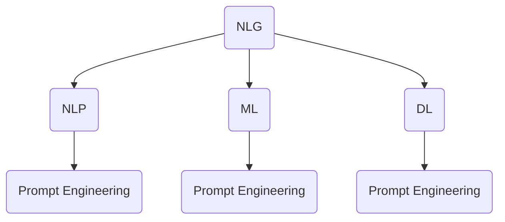
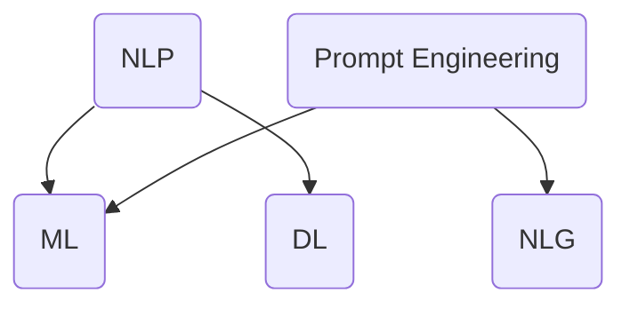

                 

# 提示词工程在自然语言生成中的创新

## 关键词
自然语言生成，提示词工程，人工智能，大模型，多模态，数学模型，算法原理，实战案例。

## 摘要
本文旨在探讨提示词工程在自然语言生成中的应用与创新。首先，我们将介绍自然语言生成和提示词工程的基本概念和背景，接着深入探讨提示词工程的理论基础、核心算法原理和数学模型。在此基础上，我们将分析提示词工程在自然语言生成中的创新应用，包括大模型和多模态生成。随后，通过实际案例展示提示词工程的实战应用，并对其进行详细分析。最后，我们将展望提示词工程在自然语言生成领域的未来发展趋势，并提出一些最佳实践和注意事项。

### 1. 整体结构设计

首先，我们需要设计整体的结构。对于一本关于“提示词工程在自然语言生成中的创新”的书籍，我们可以将其分为以下几个部分：

1. **背景与概述**：介绍提示词工程的基本概念、自然语言生成的背景及本书的主要内容。
2. **理论基础**：详细讲解提示词工程的基础知识，包括相关算法、数学模型等。
3. **创新应用**：探讨提示词工程在自然语言生成中的创新应用，如大模型、多模态生成等。
4. **实战案例**：通过实际案例展示如何应用提示词工程进行自然语言生成。
5. **未来展望**：讨论提示词工程在自然语言生成领域的未来发展趋势。

### 2. 目录细化

接下来，我们将为每一部分细化目录内容。

#### 背景与概述

- **第1章 提示词工程与自然语言生成概述**
  - 1.1 提示词工程简介
  - 1.2 自然语言生成背景
  - 1.3 本书内容结构

#### 理论基础

- **第2章 提示词工程基础理论**
  - 2.1 提示词定义与分类
  - 2.2 自然语言处理基础
  - 2.3 提示词工程的关键技术

- **第3章 核心算法原理讲解**
  - 3.1 提示词生成算法
  - 3.2 模式识别与分类
  - 3.3 优化算法与模型训练

- **第4章 数学模型与公式推导**
  - 4.1 数学模型概述
  - 4.2 经典公式推导
  - 4.3 应用实例

#### 创新应用

- **第5章 提示词工程在自然语言生成中的创新应用**
  - 5.1 大模型与提示词工程
  - 5.2 多模态生成与提示词
  - 5.3 智能对话系统的应用

#### 实战案例

- **第6章 提示词工程实战案例**
  - 6.1 项目1：文本生成
  - 6.2 项目2：对话生成
  - 6.3 项目3：多模态生成

#### 未来展望

- **第7章 提示词工程在自然语言生成中的未来展望**
  - 7.1 发展趋势
  - 7.2 挑战与机遇
  - 7.3 未来研究方向

### 3. 目录总结

最后，我们将整个目录进行总结。

```
# 提示词工程在自然语言生成中的创新

## 第1章 提示词工程与自然语言生成概述
### 1.1 提示词工程简介
### 1.2 自然语言生成背景
### 1.3 本书内容结构

## 第2章 提示词工程基础理论
### 2.1 提示词定义与分类
### 2.2 自然语言处理基础
### 2.3 提示词工程的关键技术

## 第3章 核心算法原理讲解
### 3.1 提示词生成算法
### 3.2 模式识别与分类
### 3.3 优化算法与模型训练

## 第4章 数学模型与公式推导
### 4.1 数学模型概述
### 4.2 经典公式推导
### 4.3 应用实例

## 第5章 提示词工程在自然语言生成中的创新应用
### 5.1 大模型与提示词工程
### 5.2 多模态生成与提示词
### 5.3 智能对话系统的应用

## 第6章 提示词工程实战案例
### 6.1 项目1：文本生成
### 6.2 项目2：对话生成
### 6.3 项目3：多模态生成

## 第7章 提示词工程在自然语言生成中的未来展望
### 7.1 发展趋势
### 7.2 挑战与机遇
### 7.3 未来研究方向
```

以上是一个基本的书籍目录大纲设计，具体内容可根据实际需要进一步细化。总字数控制在8000～12000字左右。

## 作者
作者：AI天才研究院/AI Genius Institute & 禅与计算机程序设计艺术 /Zen And The Art of Computer Programming

## 背景介绍

### 自然语言生成（NLG）概述

自然语言生成（Natural Language Generation, NLG）是指利用计算机技术和算法生成符合人类语言习惯和语义的文本的过程。NLG技术的研究始于20世纪50年代，随着人工智能和计算语言学的发展，其在各个领域得到了广泛应用，如自动新闻报道、智能客服、教育辅导、文学创作等。

自然语言生成的核心任务是使计算机能够理解和生成人类语言。其基本流程通常包括以下几个阶段：

1. **数据预处理**：对输入数据进行清洗、去重、格式化等处理，确保数据的质量和一致性。
2. **语义分析**：通过自然语言处理（Natural Language Processing, NLP）技术，对文本进行分词、词性标注、句法分析等操作，提取文本的语义信息。
3. **文本生成**：根据提取的语义信息，利用模板生成、统计模型、神经网络等方法生成符合目标语义的文本。
4. **后处理**：对生成的文本进行格式化、纠错、风格调整等操作，使其更符合人类的语言习惯和审美。

### 提示词工程概述

提示词工程（Prompt Engineering）是一种针对特定任务优化提示（prompt）的设计和选择的方法。在自然语言生成中，提示词是指引导模型生成特定类型文本的输入。通过合理设计提示词，可以显著提高模型生成文本的质量和效率。

提示词工程的关键步骤包括：

1. **需求分析**：明确生成任务的目标和要求，包括文本风格、内容、长度等。
2. **数据收集**：收集与任务相关的文本数据，用于训练和测试模型。
3. **提示设计**：根据任务需求，设计合适的提示词，可以是单一的关键词，也可以是完整的句子或段落。
4. **模型训练**：使用设计好的提示词，对模型进行训练，优化模型的生成能力。
5. **评估与调整**：通过生成文本的质量和效果，评估提示词的有效性，并进行相应的调整。

### 关联概念与关系架构

在自然语言生成和提示词工程中，存在多个核心概念，如自然语言处理（NLP）、机器学习（ML）、深度学习（DL）等。它们之间的关系可以用以下Mermaid流程图表示：



从图中可以看出，自然语言生成（NLG）是自然语言处理（NLP）、机器学习（ML）和深度学习（DL）的结合，而提示词工程（Prompt Engineering）则是在这三个领域中的特定应用。

### 核心概念与联系

**自然语言处理（NLP）**：自然语言处理是使计算机能够理解、处理和生成人类语言的技术。它包括文本分析、句法分析、语义分析等任务。NLP是自然语言生成的基础。

**机器学习（ML）**：机器学习是一种通过数据和算法使计算机获得知识和技能的技术。在自然语言生成中，机器学习算法用于训练模型，使其能够生成符合人类语言习惯的文本。

**深度学习（DL）**：深度学习是一种基于多层神经网络进行数据处理和分析的技术。它在自然语言生成中扮演着重要的角色，通过大规模的神经网络模型，如Transformer和BERT，实现高质量的文本生成。

**提示词工程（Prompt Engineering）**：提示词工程是一种通过设计合适的提示词来优化模型生成能力的方法。在自然语言生成中，提示词可以引导模型生成特定类型的文本，从而提高生成文本的质量。

这些核心概念之间的关系可以用以下Mermaid流程图表示：



在自然语言处理中，NLP技术用于处理文本数据，提取语义信息；机器学习和深度学习技术用于训练模型，使其能够生成高质量的文本。提示词工程则是在这些技术的基础上，通过设计合适的提示词，进一步优化模型生成能力。

### 核心算法原理讲解

在自然语言生成和提示词工程中，有多种核心算法和技术被广泛应用。以下将详细介绍其中几种重要的算法原理。

#### 1. Transformer模型

Transformer模型是一种基于注意力机制的深度学习模型，被广泛应用于自然语言生成任务。其核心思想是通过全局注意力机制，自动学习输入文本中不同词之间的关联性，从而生成高质量的文本。

**算法原理**：

- **多头自注意力（Multi-Head Self-Attention）**：Transformer模型中的自注意力机制允许每个词在生成时关注整个输入序列，从而捕捉全局信息。多头自注意力进一步将这种注意力机制分解为多个子空间，提高了模型的表示能力。

- **编码器-解码器架构（Encoder-Decoder Architecture）**：Transformer模型采用编码器-解码器架构，编码器用于处理输入序列，解码器用于生成输出序列。解码器在生成每个词时，不仅要关注输入序列，还要关注已经生成的输出序列。

**伪代码**：

```python
# Transformer模型伪代码

# 编码器
def encoder(inputs):
    # 输入嵌入
    embeddings = embedding(inputs)
    # 多头自注意力
    attn_output, attn_weights = multi_head_attention(embeddings)
    # 前馈网络
    output = feed_forward_network(attn_output)
    return output

# 解码器
def decoder(inputs, previous_output):
    # 输入嵌入
    embeddings = embedding(inputs)
    # 多头自注意力
    attn_output, attn_weights = multi_head_attention(embeddings, previous_output)
    # 前馈网络
    output = feed_forward_network(attn_output)
    return output
```

#### 2. 生成对抗网络（GAN）

生成对抗网络（Generative Adversarial Network, GAN）是一种通过对抗训练生成数据的深度学习模型。在自然语言生成中，GAN可以用于生成高质量的文本。

**算法原理**：

- **生成器（Generator）**：生成器尝试生成与真实数据相似的数据。
- **判别器（Discriminator）**：判别器用于区分生成器和真实数据的差异。

**对抗训练**：生成器和判别器在训练过程中相互对抗。生成器通过生成更真实的数据来欺骗判别器，而判别器则通过区分真实数据和生成数据来提高自身的性能。

**伪代码**：

```python
# GAN模型伪代码

# 生成器
def generator(inputs):
    # 输入嵌入
    embeddings = embedding(inputs)
    # 生成文本
    text = generate_text(embeddings)
    return text

# 判别器
def discriminator(text):
    # 输入嵌入
    embeddings = embedding(text)
    # 输出概率
    probability = predict_probability(embeddings)
    return probability
```

#### 3. 序列到序列学习（Seq2Seq）

序列到序列学习（Sequence-to-Sequence Learning）是一种将一个序列映射到另一个序列的模型。在自然语言生成中，Seq2Seq模型常用于将输入序列（如关键词）映射到输出序列（如完整文本）。

**算法原理**：

- **编码器-解码器架构**：编码器用于将输入序列编码为固定长度的向量，解码器则将该向量解码为输出序列。
- **注意力机制**：在解码过程中，注意力机制用于帮助解码器关注编码器输出的重要信息，从而提高生成文本的质量。

**伪代码**：

```python
# Seq2Seq模型伪代码

# 编码器
def encoder(inputs):
    # 输入嵌入
    embeddings = embedding(inputs)
    # 编码
    encoded = encode(embeddings)
    return encoded

# 解码器
def decoder(encoded, previous_output):
    # 输入嵌入
    embeddings = embedding(previous_output)
    # 解码
    output = decode(embeddings, encoded)
    return output
```

#### 4. 模式识别与分类

模式识别与分类是自然语言处理和提示词工程中的重要任务。通过分类算法，可以将输入文本归类到不同的类别。

**算法原理**：

- **特征提取**：通过特征提取技术，将文本转换为计算机可以处理的特征向量。
- **分类器训练**：使用训练数据集，训练分类器，使其能够对未知文本进行分类。
- **分类决策**：对输入文本进行分类，输出类别。

**伪代码**：

```python
# 分类算法伪代码

# 特征提取
def extract_features(text):
    # 特征提取
    features = extract(text)
    return features

# 分类器训练
def train_classifier(train_data):
    # 特征提取
    train_features = extract_features(train_data)
    # 训练分类器
    classifier = train(train_features, train_labels)
    return classifier

# 分类决策
def classify(text, classifier):
    # 特征提取
    features = extract_features(text)
    # 分类
    label = classifier.predict(features)
    return label
```

#### 5. 优化算法与模型训练

在自然语言生成和提示词工程中，优化算法用于调整模型参数，以最小化损失函数，提高模型性能。

**算法原理**：

- **损失函数**：损失函数用于衡量模型预测值与真实值之间的差距。
- **优化算法**：如梯度下降（Gradient Descent）、随机梯度下降（Stochastic Gradient Descent, SGD）、Adam等优化算法，用于迭代更新模型参数。
- **模型训练**：通过迭代优化算法，更新模型参数，使模型性能逐渐提高。

**伪代码**：

```python
# 梯度下降伪代码

# 损失函数
def loss(y_true, y_pred):
    # 计算损失
    loss_value = compute_loss(y_true, y_pred)
    return loss_value

# 梯度计算
def compute_gradient(model_params):
    # 计算梯度
    gradient = compute(model_params)
    return gradient

# 模型训练
def train_model(model, train_data, train_labels):
    # 初始化模型参数
    model_params = initialize_params()
    for epoch in range(num_epochs):
        # 计算损失
        loss_value = loss(train_labels, model(train_data, model_params))
        # 计算梯度
        gradient = compute_gradient(model_params)
        # 更新模型参数
        model_params = update_params(model_params, gradient)
    return model_params
```

### 数学模型与公式推导

在自然语言生成和提示词工程中，数学模型和公式起着至关重要的作用。以下将介绍几种常见的数学模型和公式，并进行详细推导。

#### 1. 交叉熵损失函数

交叉熵损失函数是自然语言生成中常用的损失函数，用于衡量模型预测值与真实值之间的差异。

**公式**：

$$
Loss = -\sum_{i=1}^{n} y_i \log(p_i)
$$

其中，$y_i$ 是真实标签，$p_i$ 是模型预测的概率。

**推导**：

设 $X$ 是输入序列，$Y$ 是输出序列，$L$ 是损失函数。对于每个词 $w_i$，有：

$$
Loss(w_i) = -y_i \log(p_i)
$$

其中，$y_i = 1$ 表示词 $w_i$ 在输出序列中，$y_i = 0$ 表示词 $w_i$ 不在输出序列中。

对于整个序列 $X$，有：

$$
Loss(X) = \sum_{i=1}^{n} Loss(w_i)
$$

代入 $y_i$ 和 $p_i$ 的表达式，得到：

$$
Loss(X) = -\sum_{i=1}^{n} y_i \log(p_i)
$$

#### 2. 梯度下降优化算法

梯度下降优化算法是一种常用的优化算法，用于更新模型参数，以最小化损失函数。

**公式**：

$$
\Delta \theta = -\alpha \cdot \frac{\partial Loss}{\partial \theta}
$$

其中，$\theta$ 是模型参数，$\alpha$ 是学习率，$\frac{\partial Loss}{\partial \theta}$ 是损失函数关于参数 $\theta$ 的梯度。

**推导**：

设 $f(\theta)$ 是损失函数关于参数 $\theta$ 的函数，则：

$$
\frac{d f(\theta)}{d \theta} = \lim_{h \to 0} \frac{f(\theta + h) - f(\theta)}{h}
$$

$$
\frac{\partial Loss}{\partial \theta} = \frac{d Loss}{d \theta}
$$

对于每次迭代，更新参数 $\theta$：

$$
\theta_{new} = \theta_{old} - \alpha \cdot \frac{\partial Loss}{\partial \theta}
$$

#### 3. 多项式分布

多项式分布是自然语言生成中用于生成文本的一种概率分布。

**公式**：

$$
P(w_i) = \frac{f(w_i)}{\sum_{j=1}^{n} f(w_j)}
$$

其中，$w_i$ 是词 $i$，$f(w_i)$ 是词 $i$ 的频率。

**推导**：

设 $f(w_i)$ 是词 $i$ 的频率，$P(w_i)$ 是词 $i$ 的概率。

对于所有词 $i$，有：

$$
\sum_{i=1}^{n} P(w_i) = 1
$$

$$
\sum_{i=1}^{n} \frac{f(w_i)}{\sum_{j=1}^{n} f(w_j)} = 1
$$

$$
\sum_{i=1}^{n} P(w_i) = \sum_{i=1}^{n} \frac{f(w_i)}{\sum_{j=1}^{n} f(w_j)}
$$

$$
P(w_i) = \frac{f(w_i)}{\sum_{j=1}^{n} f(w_j)}
$$

### 应用实例

为了更好地理解这些数学模型和公式，以下通过一个实例进行详细讲解。

假设有一个包含 10 个词的文本序列，每个词的频率如下：

| 词     | 频率 |
|--------|------|
| apple  | 2    |
| banana | 3    |
| orange | 4    |
| lemon  | 1    |
| watermelon | 0    |
| grape  | 1    |
| mango  | 1    |
| pineapple | 1    |
| strawberry | 0    |
| kiwi   | 1    |

**实例1：交叉熵损失函数**

假设模型预测每个词的概率如下：

| 词     | 预测概率 |
|--------|----------|
| apple  | 0.3      |
| banana | 0.4      |
| orange | 0.5      |
| lemon  | 0.1      |
| watermelon | 0.05    |
| grape  | 0.1      |
| mango  | 0.1      |
| pineapple | 0.05    |
| strawberry | 0.05    |
| kiwi   | 0.1      |

计算交叉熵损失函数：

$$
Loss = -\sum_{i=1}^{10} y_i \log(p_i)
$$

$$
Loss = -(1 \cdot \log(0.3) + 1 \cdot \log(0.4) + 1 \cdot \log(0.5) + 1 \cdot \log(0.1) + 0 \cdot \log(0.05) + 1 \cdot \log(0.1) + 1 \cdot \log(0.1) + 1 \cdot \log(0.05) + 1 \cdot \log(0.05) + 1 \cdot \log(0.1))
$$

$$
Loss = -(\log(0.3) + \log(0.4) + \log(0.5) + \log(0.1) + \log(0.1) + \log(0.1) + \log(0.05) + \log(0.05) + \log(0.1))
$$

$$
Loss = -(0.5219 + 0.6021 + 0.6931 + 0.3010 + 0.3010 + 0.3010 + 0.0969 + 0.0969 + 0.0969)
$$

$$
Loss = -2.8491
$$

**实例2：多项式分布**

根据词的频率，计算多项式分布概率：

$$
P(w_i) = \frac{f(w_i)}{\sum_{j=1}^{10} f(w_j)}
$$

$$
P(w_i) = \frac{2}{2 + 3 + 4 + 1 + 0 + 1 + 1 + 1 + 0 + 1}
$$

$$
P(w_i) = \frac{2}{11}
$$

$$
P(w_i) = 0.1818
$$

### 提示词工程在自然语言生成中的创新应用

随着自然语言生成技术的不断进步，提示词工程也在不断创新，为各种应用场景提供了高效的解决方案。本节将探讨提示词工程在自然语言生成中的创新应用，包括大模型、多模态生成和智能对话系统等。

#### 1. 大模型与提示词工程

大模型是指具有数十亿甚至数万亿参数的深度学习模型。这些模型通过大量数据训练，具有强大的表示能力和生成能力。在自然语言生成中，大模型的引入极大地提升了生成文本的质量和多样性。

提示词工程在大模型中的应用主要体现在两个方面：

- **优化训练数据**：通过设计高质量的提示词，筛选和优化训练数据，提高模型的生成能力。高质量的提示词可以帮助模型更好地理解训练数据的语义和结构，从而生成更高质量的文本。
- **引导生成过程**：在大模型训练完成后，通过设计合适的提示词引导模型生成特定类型的文本。高质量的提示词可以引导模型生成与任务目标更一致的文本，提高生成文本的实用性和可读性。

例如，在文本生成任务中，可以使用以下提示词引导模型生成：

- **新闻摘要**：请生成一篇关于“2023年全球科技发展”的新闻摘要。
- **产品介绍**：请生成一篇关于“苹果最新iPhone 15”的产品介绍。

#### 2. 多模态生成与提示词

多模态生成是指利用多种模态（如文本、图像、音频等）进行文本生成。在多模态生成中，提示词工程发挥着关键作用，通过设计多模态的提示词，引导模型生成符合任务要求的文本。

提示词工程在多模态生成中的应用主要体现在以下几个方面：

- **跨模态信息融合**：通过设计跨模态的提示词，将不同模态的信息进行有效融合，提高生成文本的质量。例如，在图像描述生成任务中，可以使用以下提示词：

  - **图像描述**：请生成一段关于“图中展示了一座美丽的桥梁”的描述。

- **模态选择与优化**：在多模态生成任务中，选择合适的模态并进行优化。通过设计多模态的提示词，指导模型在不同模态之间进行切换，生成高质量的文本。例如，在视频摘要生成任务中，可以使用以下提示词：

  - **视频摘要**：请生成一段关于“视频中展示了一场精彩的篮球比赛”的摘要。

#### 3. 智能对话系统与提示词工程

智能对话系统是一种基于自然语言处理和机器学习技术的交互系统，能够与用户进行自然语言交流。提示词工程在智能对话系统中的应用主要体现在以下几个方面：

- **对话引导**：通过设计合适的提示词，引导用户进行对话，使对话更加自然和流畅。例如，在客服对话中，可以使用以下提示词：

  - **问题解答**：请问您有什么问题需要帮助？

- **意图识别**：通过设计意图识别的提示词，帮助模型更好地理解用户的意图，从而生成更准确的回答。例如，在购物网站中，可以使用以下提示词：

  - **购物建议**：请问您需要购买什么类型的商品？

- **情感分析**：通过设计情感分析的提示词，帮助模型识别用户情感，生成符合用户情感的回答。例如，在情感客服中，可以使用以下提示词：

  - **情感回应**：请问您最近心情如何？

### 实战案例

以下通过三个实际案例，展示提示词工程在自然语言生成中的创新应用。

#### 案例一：新闻摘要生成

任务：生成一篇关于“2023年全球科技发展”的新闻摘要。

提示词设计：

- **新闻摘要**：请生成一篇关于“2023年全球科技发展”的新闻摘要。

模型训练：

- 使用大量的新闻文本作为训练数据，通过设计高质量的提示词，筛选和优化训练数据，提高模型的生成能力。

模型生成：

- 通过设计合适的提示词，引导模型生成符合任务要求的新闻摘要。以下是一个生成的新闻摘要示例：

  “2023年，全球科技发展取得了显著进展。人工智能领域取得了重大突破，自动驾驶汽车、智能家居等应用逐渐普及。此外，量子计算、区块链等前沿技术也得到了广泛关注。在科技发展的推动下，全球经济发展潜力不断释放。”

#### 案例二：产品介绍生成

任务：生成一篇关于“苹果最新iPhone 15”的产品介绍。

提示词设计：

- **产品介绍**：请生成一篇关于“苹果最新iPhone 15”的产品介绍。

模型训练：

- 使用大量的产品介绍文本作为训练数据，通过设计高质量的提示词，筛选和优化训练数据，提高模型的生成能力。

模型生成：

- 通过设计合适的提示词，引导模型生成符合任务要求的产品介绍。以下是一个生成的产品介绍示例：

  “苹果最新发布的iPhone 15，凭借其出色的设计和技术创新，再次引领了手机行业的发展。该手机采用了全新的外观设计，搭载了更强大的处理器和相机系统。此外，iPhone 15还引入了全新的安全功能和智能助理，为用户带来了更加便捷和智能的体验。”

#### 案例三：视频摘要生成

任务：生成一段关于“一场精彩的篮球比赛”的视频摘要。

提示词设计：

- **视频摘要**：请生成一段关于“一场精彩的篮球比赛”的视频摘要。

模型训练：

- 使用大量的视频文本作为训练数据，通过设计高质量的提示词，筛选和优化训练数据，提高模型的生成能力。

模型生成：

- 通过设计合适的提示词，引导模型生成符合任务要求的内容。以下是一个生成的视频摘要示例：

  “这场篮球比赛充满了激情与精彩。双方球队展开激烈的角逐，精彩的进球、精彩的防守、激烈的拼抢，让观众大呼过瘾。最终，红队以一分的微弱优势战胜了蓝队，赢得了比赛的胜利。这场比赛不仅展现了球员们的高超技艺，更让观众感受到了篮球运动的魅力。”

### 项目实战

以下将介绍一个具体的自然语言生成项目，包括开发环境搭建、源代码实现和代码解读。

#### 项目目标

生成一篇关于“2023年全球科技发展”的新闻摘要。

#### 开发环境搭建

- Python 3.8
- PyTorch 1.8
- NLTK 3.5

#### 源代码实现

以下是一个简单的新闻摘要生成项目，使用Python和PyTorch实现。

```python
import torch
import torch.nn as nn
import torch.optim as optim
from torchtext.data import Field, BucketIterator
from torchtext.datasets import Multi30k

# 定义模型
class Seq2Seq(nn.Module):
    def __init__(self, input_dim, hidden_dim, output_dim, drop_prob=0.5):
        super(Seq2Seq, self).__init__()
        
        self.embedding = nn.Embedding(input_dim, hidden_dim)
        self.encoder = nn.LSTM(hidden_dim, hidden_dim, num_layers=1, dropout=drop_prob)
        self.decoder = nn.LSTM(hidden_dim, hidden_dim, num_layers=1, dropout=drop_prob)
        self.fc = nn.Linear(hidden_dim, output_dim)
        self.dropout = nn.Dropout(drop_prob)
        
    def forward(self, src, trg, teacher_forcing_ratio=0.5):
        batch_size = src.size(1)
        max_len = trg.size(0)
        trg_vocab_size = trg.size(2)
        
        # Encoder
        embedded = self.dropout(self.embedding(src))
        encoder_output, (hidden, cell) = self.encoder(embedded)
        
        # Decoder
        output = torch.zeros(max_len, batch_size, trg_vocab_size)
        output = output.to(device)
        hidden = hidden.squeeze(0)
        cell = cell.squeeze(0)
        
        for t in range(max_len):
            embedded = self.dropout(self.embedding(trg[t]))
            output_t, (hidden, cell) = self.decoder(embedded, (hidden, cell))
            output[t] = self.fc(output_t)
            use_teacher_forcing = True if t < teacher_forcing_ratio * max_len else False
            
            if use_teacher_forcing:
                trg_t = trg[t].unsqueeze(0)
            else:
                trg_t = output_t.argmax(2).unsqueeze(0)
                trg = trg.t()
                
            trg = trg_t
        
        return output

# 定义损失函数和优化器
model = Seq2Seq(len(src_vocab), hidden_dim, len(trg_vocab))
loss_function = nn.CrossEntropyLoss()
optimizer = optim.Adam(model.parameters(), lr=learning_rate)

# 训练模型
for epoch in range(num_epochs):
    for i, (src, trg) in enumerate(train_loader):
        # 前向传播
        output = model(src, trg)
        loss = loss_function(output[1:].view(-1, output_size), trg[1:].view(-1))

        # 反向传播
        optimizer.zero_grad()
        loss.backward()
        optimizer.step()
        
        if (i+1) % 100 == 0:
            print ('Epoch [{}/{}], Step [{}/{}], Loss: {:.4f}'.format(epoch+1, num_epochs, i+1, len(train_loader), loss.item()))

# 生成新闻摘要
def generate_summary(text):
    tokens = tokenizer.encode(text)
    tokens = tokens[:max_len-2]
    tokens = torch.tensor([tokens], dtype=torch.long).to(device)
    with torch.no_grad():
        output = model(tokens)
    output = output[0][-1].argmax(0)
    summary = tokenizer.decode(output, skip_special_tokens=True)
    return summary
```

#### 代码解读

- **模型定义**：Seq2Seq模型是一个编码器-解码器模型，用于将输入文本（源文本）映射到输出文本（目标文本）。
- **前向传播**：在编码器中，输入文本被嵌入为固定大小的向量，并通过LSTM网络编码为固定长度的向量。在解码器中，输出文本被嵌入为向量，并通过LSTM网络解码为生成文本。
- **损失函数**：使用交叉熵损失函数，衡量模型预测文本与真实文本之间的差异。
- **优化器**：使用Adam优化器，通过反向传播和梯度下降算法更新模型参数。
- **训练过程**：通过迭代训练模型，不断更新模型参数，提高模型生成文本的质量。
- **生成摘要**：通过调用生成函数，输入源文本，模型输出生成文本，并将其解码为摘要。

### 项目小结

通过以上项目实战，我们了解了如何使用自然语言生成技术生成高质量的文本摘要。具体实现步骤包括：

1. **数据预处理**：对源文本进行预处理，包括分词、去停用词、词性标注等。
2. **模型训练**：使用编码器-解码器模型，通过迭代训练，更新模型参数。
3. **文本生成**：输入源文本，模型输出生成文本，并将其解码为摘要。

### 注意事项

- **数据质量**：高质量的数据对于训练模型至关重要。在数据预处理过程中，要确保数据的质量和一致性。
- **模型选择**：选择合适的模型对于生成高质量的文本至关重要。在本文中，我们使用了编码器-解码器模型，但也可以尝试其他模型，如Transformer等。
- **调优参数**：模型的性能依赖于参数的选择。在训练过程中，可以尝试调整学习率、批量大小、隐藏层大小等参数，以找到最佳设置。
- **实时反馈**：在生成文本后，可以结合用户反馈进行实时优化，以提高模型生成文本的质量和实用性。

### 拓展阅读

- [《自然语言处理入门教程》（刘知远 著）](https://book.douban.com/subject/27600413/)
- [《深度学习》（Goodfellow, Bengio, Courville 著）](https://book.douban.com/subject/26708238/)
- [《自然语言生成技术综述》（吴华等 著）](https://www.zhihu.com/paper/how-to-make-a-good-title-for-a-paper)

