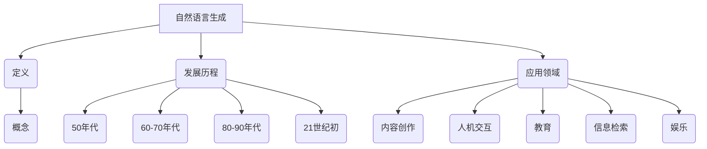
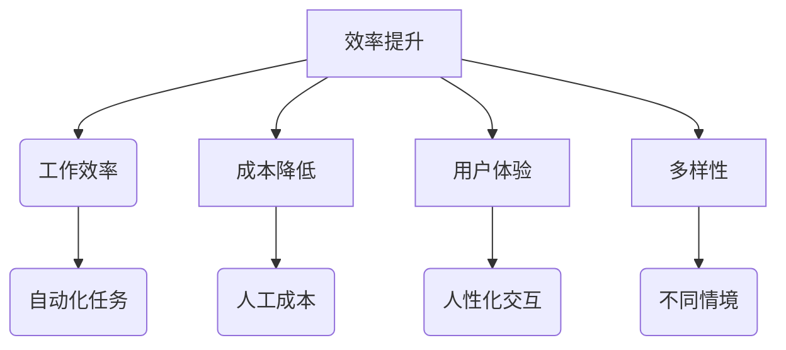
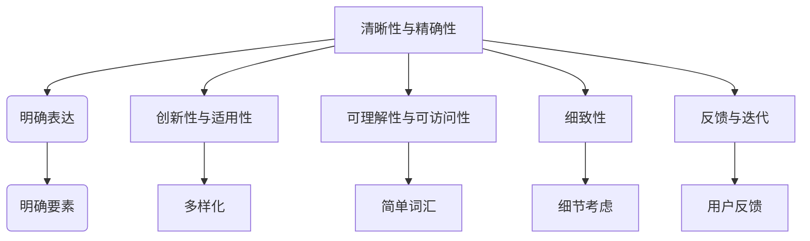
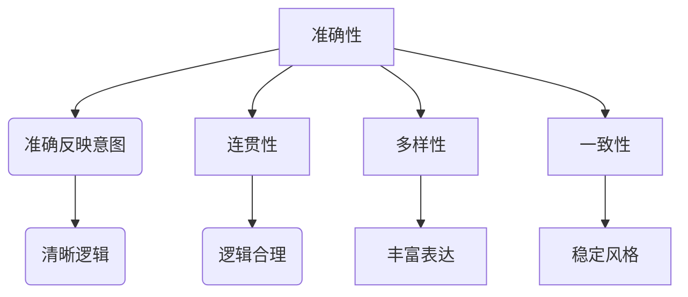

                 

### 1.1 自然语言生成的概念与历史

#### 自然语言生成的定义

自然语言生成（Natural Language Generation，简称NLG）是指通过计算机程序生成自然语言文本的技术。这种技术旨在使计算机能够理解和生成类似于人类语言的文本，以满足信息处理、人机交互、内容创作等需求。自然语言生成的核心是能够将计算机内部的逻辑和数据结构转换为易于理解的人类语言。

#### 自然语言生成的发展历程

自然语言生成的发展可以追溯到20世纪50年代。1950年，艾伦·图灵提出了著名的图灵测试，这是对机器是否能够表现出与人类相似的智能行为的最早探讨。随后，自然语言处理（NLP）作为人工智能的一个分支开始受到关注。在60年代和70年代，基于规则的方法和模板匹配技术被广泛使用，但由于其复杂性和可扩展性受限，进展缓慢。

进入80年代，随着计算机性能的提升和知识的积累，基于模板的自然语言生成技术开始兴起。这种方法利用预定义的模板和规则来生成文本，尽管在一定程度上提高了生成效率，但仍难以处理复杂的语言结构和多样性。

90年代和21世纪初，统计方法和基于机器学习的技术开始应用于自然语言生成，取得了显著的进展。统计方法通过分析大量语料库来学习语言模型，提高了生成文本的自然性和准确性。机器学习方法，如序列到序列（Seq2Seq）模型和变分自编码器（VAE），进一步提升了自然语言生成的性能。

#### 自然语言生成的应用领域

自然语言生成技术在多个领域得到了广泛应用：

1. **内容创作**：自动生成新闻文章、博客、书籍摘要等。
2. **人机交互**：虚拟助手、客服机器人、聊天机器人等，用于自动回复用户提问、提供信息服务等。
3. **教育**：自动生成教学材料、练习题和答案。
4. **信息检索**：生成搜索引擎摘要、相关推荐等内容。
5. **娱乐**：自动生成故事、游戏剧情等。

#### 未来展望

随着深度学习技术的不断发展，自然语言生成有望在更多领域实现突破。未来，自然语言生成系统将更加智能化、多样化，能够处理更加复杂的语言结构和上下文关系，提高生成文本的质量和准确性。

#### Mermaid 流程图



### 1.2 自然语言生成的重要性

#### 对人类交流的补充

自然语言生成技术为人类交流提供了强有力的补充。在信息爆炸的时代，人们需要处理大量复杂的信息，而自然语言生成能够帮助用户更高效地获取和理解信息。例如，自动生成的新闻报道可以快速提供事件的最新动态，使读者能够迅速掌握关键信息。此外，自然语言生成还可以为听力障碍者提供文字形式的交流支持，使得他们能够更轻松地参与社会活动。

#### 对信息处理的优化

自然语言生成技术在信息处理方面发挥着重要作用。传统的信息处理方法往往需要人工介入，耗时耗力。而自然语言生成技术可以自动化地生成文本，从而大大减轻了人工的工作负担。例如，在法律文件生成、合同起草等场景中，自然语言生成可以快速生成高质量的文档，提高工作效率。同时，自然语言生成还可以用于数据报告的自动化生成，使得数据分析师能够将更多精力投入到深度分析上。

#### 对自动化领域的推动

自然语言生成技术对自动化领域的发展具有深远影响。在虚拟助手、客服机器人、聊天机器人等自动化系统中，自然语言生成技术是关键组成部分。通过自然语言生成，系统可以与用户进行自然语言交互，提供个性化服务。这不仅提升了用户体验，还降低了运营成本。此外，自然语言生成还可以用于自动化内容创作，例如生成广告文案、营销邮件等，使得企业能够更灵活地响应市场变化。

#### 核心概念与联系

自然语言生成的重要性可以从以下几个方面来理解：

1. **效率提升**：自然语言生成可以自动化地完成许多原本需要人工完成的任务，从而提高工作效率。
2. **成本降低**：自动化生成文本可以减少人工成本，特别是在处理大量文本数据时。
3. **用户体验**：自然语言生成技术能够提供更人性化的交互方式，提升用户体验。
4. **多样性**：自然语言生成可以生成丰富多样、符合不同情境的文本，满足不同用户的需求。

以下是自然语言生成核心概念的Mermaid流程图：



### 1.3 自然语言生成系统的主要类型

自然语言生成系统可以根据生成方法的不同分为多种类型，每种类型都有其独特的特点和应用场景。以下是对几种主要类型的介绍：

#### 生成式文本生成

生成式文本生成（Generative Text Generation）是指利用模型生成全新的文本内容，而不是简单地从已有的文本中抽取信息。这种类型的系统通常采用深度学习技术，如循环神经网络（RNN）、长短期记忆网络（LSTM）和Transformer等。生成式文本生成在内容创作和故事生成等场景中具有广泛应用。

#### 端到端的序列生成

端到端的序列生成（End-to-End Sequence Generation）是一种直接将输入序列映射到输出序列的生成方法。这种方法避免了传统方法中需要手动定义模板和规则的问题，使得系统更加灵活和高效。端到端的序列生成在机器翻译、问答系统和对话生成等领域表现出色。

#### 机器翻译

机器翻译（Machine Translation）是指将一种自然语言文本自动翻译成另一种自然语言。机器翻译系统可以分为基于规则的翻译、基于统计的翻译和基于神经网络的翻译。基于规则的翻译依赖于人工编写的规则，而基于统计的翻译则利用大规模的平行语料库来学习翻译模型。神经网络翻译（NMT）通过深度学习技术，特别是序列到序列（Seq2Seq）模型，实现了高精度的翻译效果。

#### 核心算法原理讲解

每种自然语言生成系统都依赖于特定的算法原理。以下是对几种核心算法原理的讲解：

1. **生成式文本生成**：生成式文本生成通常使用变分自编码器（VAE）、生成对抗网络（GAN）和自回归模型（AR）等算法。变分自编码器通过编码器和解码器之间的交互生成新的文本序列，而生成对抗网络则通过对抗训练生成高质量的数据。自回归模型则通过逐步生成每个时间步骤的输出，形成完整的文本。

2. **端到端的序列生成**：端到端的序列生成主要依赖于序列到序列（Seq2Seq）模型和注意力机制（Attention Mechanism）。Seq2Seq模型通过编码器和解码器的协同工作，将输入序列映射到输出序列。注意力机制则允许模型在解码过程中关注输入序列的特定部分，提高了生成的准确性和连贯性。

3. **机器翻译**：机器翻译的核心算法是神经网络翻译（NMT），特别是基于Transformer的模型。Transformer模型通过自注意力机制（Self-Attention）和多头注意力（Multi-Head Attention）实现了对输入序列的全局理解和上下文关联。此外，结合编码器和解码器的结构，NMT能够高效地完成翻译任务。

以下是生成式文本生成的伪代码示例：

```python
# 伪代码：生成式文本生成
def generate_text(model, seed_sequence, length):
    # 使用预训练的模型生成文本
    generated_sequence = model.generate(sequence=seed_sequence, length=length)
    return generated_sequence
```

以下是机器翻译的伪代码示例：

```python
# 伪代码：神经网络翻译
def translate(source_sentence, model):
    # 编码器解码器模型翻译
    encoded_sentence = model.encode(source_sentence)
    translated_sentence = model.decode(encoded_sentence)
    return translated_sentence
```

通过以上核心算法原理的讲解和伪代码示例，我们可以更好地理解自然语言生成系统的工作原理和实现方法。这些算法和技术为自然语言生成的研究和应用提供了坚实的基础。

### 2.1 提示词工程的基本原理

#### 提示词的定义

提示词（Prompt）是指在自然语言生成过程中，用于引导模型生成目标文本的输入信息。提示词的设计和质量对生成文本的质量和准确性具有直接影响。一个有效的提示词应当清晰、精确且具有针对性，以便模型能够准确理解并生成预期的文本。

#### 提示词工程的目标

提示词工程的目标是设计出高质量的提示词，以优化自然语言生成系统的性能。具体目标包括：

1. **提高生成文本的质量**：设计出能够引导模型生成高质量、符合实际需求的文本。
2. **增强模型的泛化能力**：使模型能够处理不同类型和领域的提示词，提高其泛化能力。
3. **降低计算资源需求**：通过优化提示词设计，减少模型在生成过程中的计算资源消耗。
4. **提高生成效率**：使模型能够更快地生成文本，提高系统的响应速度。

#### 提示词工程的重要性

提示词工程在自然语言生成中具有重要的地位。首先，高质量的提示词能够有效引导模型，使其生成更加准确和自然的文本。其次，提示词工程可以优化模型的训练和推理过程，降低计算资源的消耗，提高生成效率。此外，通过设计多样化的提示词，模型能够更好地适应不同场景和应用需求，增强其泛化能力。

### 2.2 提示词工程的目标与挑战

#### 质量控制目标

提示词工程的核心目标是确保生成文本的质量。具体来说，质量控制目标包括：

1. **准确性**：生成文本应准确反映输入提示词的含义和意图。
2. **连贯性**：生成文本应具有流畅的语言表达和逻辑结构。
3. **多样性**：生成文本应在语言风格、内容表达和表达方式上具有多样性，以适应不同的用户需求和情境。
4. **一致性**：生成文本应保持一致的风格和语言特点，避免出现突兀的变化。

#### 语言多样性挑战

在提示词工程中，语言多样性是一个重要的挑战。不同的语言和文化背景会导致表达方式和语义理解的差异，这给提示词设计带来了困难。为了应对这一挑战，需要：

1. **文化敏感性**：在设计提示词时，考虑目标用户的文化背景和语言习惯。
2. **多语言支持**：开发能够处理多种语言输入和输出的自然语言生成系统。
3. **数据多样性**：利用多样化的数据集进行模型训练，以增强模型的泛化能力。

#### 时间敏感性挑战

自然语言生成系统通常需要在短时间内生成大量文本，这要求提示词工程必须具备高效率。时间敏感性挑战包括：

1. **快速响应**：系统应能够迅速生成文本，以满足用户实时交互的需求。
2. **计算优化**：通过优化算法和模型结构，减少生成过程中的计算资源消耗。
3. **并行处理**：利用并行计算和分布式系统，提高生成效率。

#### 质量控制目标与挑战的联系

质量控制目标和语言多样性、时间敏感性挑战密切相关。高质量的提示词有助于提高生成文本的准确性、连贯性和多样性，从而更好地应对语言多样性和时间敏感性的挑战。同时，解决这些挑战也是实现质量控制目标的重要途径。

### 2.3 提示词工程的框架与流程

#### 数据收集与预处理

数据收集与预处理是提示词工程的重要环节。首先，需要收集大量的高质量数据，包括文本数据、语音数据等。这些数据应覆盖不同的主题、领域和语言风格，以丰富模型的训练素材。

预处理过程包括数据清洗、去重、分词、词性标注等操作。清洗数据可以去除无效信息和噪声，提高数据质量。去重可以避免重复数据对模型训练的影响。分词和词性标注有助于模型更好地理解文本内容和上下文关系。

#### 提示词生成策略

提示词生成策略是提示词工程的核心。根据不同的应用场景和需求，可以采用多种提示词生成方法。

1. **基于模板的方法**：这种方法使用预定义的模板和规则来生成提示词。模板可以包含变量，用于动态填充具体信息。基于模板的方法简单直观，但灵活性较低。

2. **基于规则的方法**：这种方法使用人工编写的规则来生成提示词。规则可以根据语言结构和语义关系进行复杂设计，以生成符合要求的提示词。基于规则的方法灵活性较高，但需要大量专业知识和经验。

3. **基于数据的方法**：这种方法通过分析大量语料库来学习生成高质量的提示词。基于数据的方法可以利用机器学习和深度学习技术，如生成对抗网络（GAN）和自回归模型（AR），实现自动化生成。

#### 提示词评估与优化

提示词评估与优化是确保提示词质量的重要环节。评估指标包括准确性、连贯性、多样性和用户满意度等。评估过程可以采用自动化评估方法，如基于规则的评估指标和基于机器学习的评估模型。

优化过程包括调整提示词设计策略、修改模型参数和改进数据集等。通过反复评估和优化，可以逐步提高提示词的质量和生成文本的准确性。

#### 数据收集与预处理

数据收集与预处理是提示词工程的重要环节。首先，需要收集大量的高质量数据，包括文本数据、语音数据等。这些数据应覆盖不同的主题、领域和语言风格，以丰富模型的训练素材。

预处理过程包括数据清洗、去重、分词、词性标注等操作。清洗数据可以去除无效信息和噪声，提高数据质量。去重可以避免重复数据对模型训练的影响。分词和词性标注有助于模型更好地理解文本内容和上下文关系。

#### 提示词生成策略

提示词生成策略是提示词工程的核心。根据不同的应用场景和需求，可以采用多种提示词生成方法。

1. **基于模板的方法**：这种方法使用预定义的模板和规则来生成提示词。模板可以包含变量，用于动态填充具体信息。基于模板的方法简单直观，但灵活性较低。

2. **基于规则的方法**：这种方法使用人工编写的规则来生成提示词。规则可以根据语言结构和语义关系进行复杂设计，以生成符合要求的提示词。基于规则的方法灵活性较高，但需要大量专业知识和经验。

3. **基于数据的方法**：这种方法通过分析大量语料库来学习生成高质量的提示词。基于数据的方法可以利用机器学习和深度学习技术，如生成对抗网络（GAN）和自回归模型（AR），实现自动化生成。

#### 提示词评估与优化

提示词评估与优化是确保提示词质量的重要环节。评估指标包括准确性、连贯性、多样性和用户满意度等。评估过程可以采用自动化评估方法，如基于规则的评估指标和基于机器学习的评估模型。

优化过程包括调整提示词设计策略、修改模型参数和改进数据集等。通过反复评估和优化，可以逐步提高提示词的质量和生成文本的准确性。

### 3.1 提示词设计的基本原则

提示词设计是自然语言生成系统中的一个关键环节，其质量直接影响到生成文本的准确性、连贯性和多样性。以下是设计高质量提示词应遵循的基本原则：

#### 清晰性与精确性

一个有效的提示词应当清晰明确，避免模糊和多义性。提示词中应使用精确的语言表达，确保模型能够准确理解其含义。例如，在生成新闻报道时，应明确指出事件的主要要素，如时间、地点、人物和事件性质，以避免生成错误或模糊的文本。

#### 创新性与适用性

提示词设计应在遵循基本原则的基础上，具有一定的创新性。创新性的提示词能够激发模型生成更具创意和多样化的文本。同时，提示词还应具有适用性，能够适应不同的应用场景和用户需求。例如，在生成故事时，提示词应涵盖不同角色、情节和背景，以生成丰富多样的故事情节。

#### 可理解性与可访问性

提示词应具备良好的可理解性和可访问性，确保不同用户群体都能轻松理解和使用。对于面向公众的应用，提示词应尽量使用简单的词汇和句式，避免专业术语和复杂结构。此外，对于有特定需求的用户群体，如儿童、老年人或外语学习者，提示词应考虑其语言能力和认知水平，提供相应的辅助说明和解释。

#### 细致性

提示词设计应细致入微，考虑语言环境中的各种细节。例如，在生成医疗建议时，提示词应详细描述病情、治疗方案和注意事项，以确保生成文本的准确性和实用性。此外，提示词还应考虑语言风格和语气，使其符合具体情境和应用需求。

#### 反馈与迭代

提示词设计过程中，应重视用户反馈，不断优化和迭代提示词。通过收集用户使用数据和反馈意见，分析生成文本的质量和用户满意度，识别存在的问题和改进方向。根据反馈结果，调整提示词设计策略，优化模型参数，提高生成文本的整体质量。

#### Mermaid 流程图



通过遵循这些基本原则，可以设计出高质量的提示词，从而提高自然语言生成系统的性能和用户体验。

### 3.2 不同的提示词生成方法

在自然语言生成系统中，提示词的生成方法直接影响生成文本的质量和多样性。以下是几种主要的提示词生成方法及其特点：

#### 基于模板的方法

基于模板的方法是一种传统的提示词生成方法，它使用预定义的模板和规则来生成提示词。这种方法的主要优点是简单直观，开发成本低，适用于固定结构和格式的要求。例如，在生成简历或新闻报道时，可以使用预定义的模板来填充具体信息。

```python
# 伪代码：基于模板的提示词生成
def generate_prompt(template, variables):
    prompt = template
    for var in variables:
        prompt = prompt.replace("[VARIABLE]", var)
    return prompt
```

然而，基于模板的方法也存在一些缺点，如灵活性较低，难以适应复杂多变的语言结构和语义需求。

#### 基于规则的方法

基于规则的方法通过人工编写的规则来生成提示词，这些规则可以根据语言结构和语义关系进行复杂设计。这种方法具有高度的灵活性，适用于生成需要特定语言风格和表达方式的文本。

```python
# 伪代码：基于规则的提示词生成
def generate_prompt(rules, input_context):
    for rule in rules:
        if rule.matches(input_context):
            return rule.apply(input_context)
    return "No rule matched"
```

基于规则的方法的优点是能够生成高质量的、符合特定要求的文本，但缺点是需要大量专业知识和经验来编写和维护规则。

#### 基于数据的方法

基于数据的方法通过分析大量语料库来学习生成高质量的提示词。这种方法利用机器学习和深度学习技术，如生成对抗网络（GAN）和自回归模型（AR），能够自动生成丰富多样、符合语言习惯的提示词。

```python
# 伪代码：基于数据的提示词生成
def generate_prompt(model, context):
    return model.predict(context)
```

基于数据的方法的优点是能够自动适应不同的语言风格和语义需求，生成高质量的提示词。然而，这种方法需要大量的训练数据和计算资源。

#### 混合方法

混合方法结合了基于模板、基于规则和基于数据的方法，通过融合多种生成策略来提高提示词的质量和多样性。这种方法通常采用不同的算法和技术，如模板填充、规则匹配和神经网络生成等。

```python
# 伪代码：混合方法的提示词生成
def generate_prompt(template, context, model):
    prompt = template
    for var in context:
        prompt = prompt.replace("[VARIABLE]", var)
    refined_prompt = model.refine(prompt)
    return refined_prompt
```

混合方法的优点是能够充分利用不同方法的优点，生成高质量的、适应多种场景的提示词。然而，这种方法的设计和实现较为复杂，需要综合考虑多种因素。

### 3.3 提示词设计中的问题与解决策略

#### 多样性问题

在提示词设计中，多样性是一个重要的挑战。生成过于单一或重复的文本会导致用户体验下降，降低系统的实用性。为了解决多样性问题，可以采取以下策略：

1. **数据多样性**：使用多样化的数据集进行模型训练，确保模型能够学习到丰富的语言表达方式。
2. **扩展词汇**：在提示词中增加多样的词汇和表达方式，避免使用过于简单的词汇。
3. **随机性引入**：在生成过程中引入随机性，如随机选择词汇、句式和段落结构，以增加文本的多样性。

#### 措辞不当问题

措辞不当可能导致生成文本存在歧义、不准确或令人不适的内容。为了解决措辞不当问题，可以采取以下策略：

1. **语言规范**：制定严格的语言规范，确保提示词和生成文本遵循语法和语义规则。
2. **敏感词过滤**：在提示词生成和文本生成过程中，使用敏感词过滤技术，避免生成不当的内容。
3. **语义分析**：利用自然语言处理技术进行语义分析，识别并处理潜在的语义歧义和不当表达。

#### 语言障碍问题

对于面向多语言用户的应用，语言障碍是一个重要的挑战。为了解决语言障碍问题，可以采取以下策略：

1. **多语言支持**：开发支持多种语言输入和输出的自然语言生成系统。
2. **翻译机制**：集成高质量的机器翻译模块，将生成的文本自动翻译成多种语言。
3. **文化敏感性**：在提示词设计和文本生成过程中，考虑目标用户的文化背景和语言习惯。

#### 质量控制策略

为了确保提示词的质量，可以采取以下质量控制策略：

1. **自动化评估**：使用自动化评估方法，如基于规则的评估指标和基于机器学习的评估模型，对生成的文本进行质量评估。
2. **用户反馈**：收集用户使用数据和反馈意见，识别存在的问题和改进方向。
3. **迭代优化**：根据评估结果和用户反馈，不断优化提示词设计策略和模型参数，提高生成文本的整体质量。

### 3.3 提示词设计中的问题与解决策略

在自然语言生成系统中，提示词的设计至关重要，但往往伴随着多样性问题、措辞不当问题和语言障碍问题。以下是这些问题及其解决策略的详细探讨：

#### 多样性问题

在提示词设计中，多样性是一个重要的挑战。如果生成的文本过于单一或重复，将导致用户体验下降，系统的实用性也会受到影响。为了增加文本的多样性，可以采取以下策略：

1. **数据多样性**：首先，确保训练数据集的多样性。使用涵盖多种主题、风格和情感的数据，使模型能够学习到丰富的语言表达方式。可以通过收集不同的文本来源，如新闻、博客、社交媒体等，来丰富数据集。
   
   ```mermaid
   graph TD
   A[数据多样性] --> B(多种主题)
   A --> C(多种风格)
   A --> D(多种情感)
   B --> E(新闻)
   B --> F(博客)
   B --> G(社交媒体)
   C --> H(幽默)
   C --> I(正式)
   C --> J(非正式)
   D --> K(积极)
   D --> L(消极)
   D --> M(中性)
   ```

2. **扩展词汇**：在提示词中引入更多的词汇和表达方式，避免使用过于简单的词汇。例如，可以引入同义词、短语和比喻，以增加文本的丰富性。

3. **随机性引入**：在生成过程中引入随机性，例如随机选择词汇、句式和段落结构。这种方法可以有效地避免文本生成中的模式化，增加多样性。

   ```python
   # 伪代码：随机性引入
   import random
   def add_randomness(prompt):
       words = prompt.split()
       random.shuffle(words)
       return ' '.join(words)
   ```

#### 措辞不当问题

措辞不当可能导致生成文本存在歧义、不准确或令人不适的内容，影响用户体验和系统的信任度。为了解决措辞不当问题，可以采取以下策略：

1. **语言规范**：制定严格的语言规范，确保提示词和生成文本遵循语法和语义规则。规范应涵盖常见错误、禁忌用语和不当表达，以确保生成文本的准确性和适当性。

2. **敏感词过滤**：在提示词生成和文本生成过程中，使用敏感词过滤技术，自动识别并过滤掉可能引发负面影响的词汇。敏感词库应定期更新，以覆盖最新的社会热点和敏感话题。

3. **语义分析**：利用自然语言处理技术进行语义分析，识别并处理潜在的语义歧义和不当表达。通过深度学习模型，可以识别文本中的隐含意图和情感色彩，从而避免生成不合适的内容。

   ```mermaid
   graph TD
   A[语言规范] --> B(语法规则)
   A --> C(语义规则)
   A --> D(禁忌用语)
   A --> E(不当表达)
   B --> F(常见错误)
   B --> G(语法正确)
   C --> H(意图识别)
   C --> I(情感分析)
   D --> J(负面词汇)
   D --> K(敏感话题)
   ```

#### 语言障碍问题

对于面向多语言用户的应用，语言障碍是一个重要的挑战。不同语言之间的词汇、语法和语义差异可能导致生成文本的不准确或不合适。为了解决语言障碍问题，可以采取以下策略：

1. **多语言支持**：开发支持多种语言输入和输出的自然语言生成系统。对于每种语言，应使用相应的语言模型和词汇库，以确保生成文本的准确性。

2. **翻译机制**：集成高质量的机器翻译模块，将生成的文本自动翻译成多种语言。选择合适的翻译模型和策略，确保翻译结果的准确性和流畅性。

3. **文化敏感性**：在提示词设计和文本生成过程中，考虑目标用户的文化背景和语言习惯。避免使用特定文化或语言的俚语、习语和隐喻，确保生成文本在全球范围内的适用性。

   ```mermaid
   graph TD
   A[多语言支持] --> B(多种语言模型)
   A --> C(翻译机制)
   A --> D(文化敏感性)
   B --> E(语言模型)
   B --> F(词汇库)
   C --> G(翻译模型)
   C --> H(翻译策略)
   D --> I(文化背景)
   D --> J(语言习惯)
   ```

#### 质量控制策略

为了确保提示词的质量，可以采取以下质量控制策略：

1. **自动化评估**：使用自动化评估方法，如基于规则的评估指标和基于机器学习的评估模型，对生成的文本进行质量评估。常见的评估指标包括准确性、连贯性、多样性等。

2. **用户反馈**：收集用户使用数据和反馈意见，识别存在的问题和改进方向。通过用户反馈，可以及时调整和优化提示词设计策略。

3. **迭代优化**：根据评估结果和用户反馈，不断优化提示词设计策略和模型参数，提高生成文本的整体质量。迭代优化是一个持续的过程，应定期进行评估和调整。

   ```mermaid
   graph TD
   A[自动化评估] --> B(评估指标)
   A --> C(用户反馈)
   A --> D[迭代优化]
   B --> E(准确性)
   B --> F(连贯性)
   B --> G(多样性)
   C --> H(用户意见)
   C --> I(问题识别)
   D --> J(策略调整)
   D --> K(参数优化)
   ```

通过采取这些策略，可以有效地解决提示词设计中的多样性问题、措辞不当问题和语言障碍问题，提高自然语言生成系统的整体质量和用户体验。

### 4.1 质量控制的重要性

在自然语言生成（NLG）系统中，质量控制（Quality Control，简称QC）是确保生成文本准确性和可靠性的关键环节。高质量的控制措施能够显著提升用户的满意度和系统的整体性能，以下是质量控制的重要性的详细解析。

#### 提高用户满意度

用户满意度是衡量自然语言生成系统成功与否的重要指标。高质量的控制措施能够确保生成文本的准确性和流畅性，从而提高用户对系统的满意度和信任度。例如，在生成新闻报道时，准确传达事件的关键信息能够满足读者的需求；在虚拟助手和客服机器人中，准确理解和回应用户的问题能够提供良好的用户体验。

#### 保障系统可靠性

自然语言生成系统在许多实际应用中扮演着重要角色，如客户服务、自动化内容生成和智能助手等。系统的可靠性直接影响到业务流程的顺畅进行。通过严格的质量控制，可以确保系统在处理大量数据和复杂任务时保持稳定和高效，避免因生成文本错误导致的服务中断或业务损失。

#### 优化业务效率

质量控制能够识别和消除生成文本中的错误和缺陷，从而提高业务效率。例如，在法律文件生成、合同起草和报告撰写等场景中，高质量的自然语言生成系统能够自动化生成大量文档，减少人工工作量，提高生产效率。此外，通过持续优化生成文本的质量，系统可以更好地适应不同业务需求，提高整体业务效率。

#### 促进技术发展

高质量的控制措施能够推动自然语言生成技术的持续发展和创新。通过不断优化生成文本的质量，研究人员和工程师可以探索更先进的算法和模型，从而推动自然语言生成领域的进步。例如，通过分析和解决生成文本中的常见问题，可以改进现有模型的设计和实现，提高系统的性能和鲁棒性。

#### 核心概念与联系

质量控制的重要性可以从以下几个方面理解：

1. **准确性**：高质量的控制措施能够确保生成文本的准确性，准确反映输入信息的意图和内容。
2. **连贯性**：质量控制可以保障生成文本的连贯性，使文本在逻辑上清晰、合理，避免混乱或不一致的表述。
3. **多样性**：通过质量控制，可以优化生成文本的多样性，使其在表达方式和语言风格上丰富多样，满足不同用户的需求。
4. **一致性**：质量控制有助于确保生成文本的一致性，保持文本风格和语言特点的稳定性，避免突变或突兀的变化。

以下是自然语言生成质量控制核心概念的Mermaid流程图：



### 4.2 质量评估指标

在自然语言生成（NLG）系统中，质量评估指标是衡量生成文本质量的关键工具。通过设定和衡量这些指标，可以全面了解生成文本的准确性、流畅性和多样性。以下是对几种常见质量评估指标的详细解释：

#### 准确性

准确性是衡量生成文本是否符合输入意图的重要指标。高准确性的文本应准确传达输入信息的核心内容和意图。准确性评估通常通过对比生成文本与原始文本或参考文本，计算匹配度或错误率。

- **匹配度计算**：可以使用简单的字符串匹配算法，如编辑距离（Levenshtein Distance）或Jaccard相似度，来评估生成文本与参考文本的匹配度。
- **错误率**：通过计算生成文本中的错误单词、句子或语法结构，评估文本的准确性。错误率通常表示为错误数量与总单词或句子数量的比例。

```python
# 伪代码：准确性评估
def calculate_accuracy(generated_text, reference_text):
    # 计算字符串匹配度
    similarity = string_similarity(generated_text, reference_text)
    # 计算错误率
    error_rate = (len(reference_text) - similarity) / len(reference_text)
    return similarity, error_rate
```

#### 流畅性

流畅性是衡量生成文本在语言表达上的自然度和连贯性的指标。高流畅性的文本应具有良好的语法结构、恰当的词汇搭配和合理的句子衔接。

- **语法正确性**：通过语法检查工具或规则，评估生成文本中的语法错误和不当表达。
- **词汇搭配**：检查生成文本中的词汇搭配是否自然，避免生硬或不符合语言习惯的表达。
- **句子衔接**：评估句子之间的衔接是否合理，确保文本在逻辑上连贯一致。

```python
# 伪代码：流畅性评估
def assess_fluency(generated_text):
    # 检查语法错误
    grammar_errors = check_grammar(generated_text)
    # 检查词汇搭配
    awkward_phrases = detect_awkward_phrases(generated_text)
    # 检查句子衔接
    sentence_fluency = check_sentence衔接(generated_text)
    return grammar_errors, awkward_phrases, sentence_fluency
```

#### 多样性

多样性是衡量生成文本在表达方式、语言风格和内容上的丰富程度的指标。高多样性的文本应避免重复和单一的表达，提供多样的视角和语言风格。

- **词汇多样性**：通过计算生成文本中使用的不同词汇数量和比例，评估词汇的多样性。
- **句式多样性**：检查生成文本中的句式结构，确保文本中使用不同的句型，避免模式化。
- **内容多样性**：评估生成文本的内容是否丰富，涵盖不同的主题和观点。

```python
# 伪代码：多样性评估
def calculate_diversity(generated_text):
    # 计算不同词汇数量
    unique_words = len(set(generated_text.split()))
    # 计算总词汇数量
    total_words = len(generated_text.split())
    # 计算词汇多样性
    diversity = unique_words / total_words
    return diversity
```

#### 一致性

一致性是衡量生成文本在风格、语气和内容上是否保持一致性的指标。高一致性的文本应具有稳定的语言风格和逻辑结构，避免突兀的变化。

- **风格一致性**：通过分析生成文本中的语言风格，如正式、非正式、幽默等，评估其是否保持一致。
- **语气一致性**：检查生成文本的语气是否一致，如严肃、友好、中立等，避免出现不一致的语气。
- **内容一致性**：确保生成文本在内容上保持一致，避免出现矛盾或重复的信息。

```python
# 伪代码：一致性评估
def assess_consistency(generated_text):
    # 检查风格一致性
    style一致性 = check_style一致性(generated_text)
    # 检查语气一致性
    tone一致性 = check_tone一致性(generated_text)
    # 检查内容一致性
    content一致性 = check_content一致性(generated_text)
    return style一致性, tone一致性, content一致性
```

通过设定和衡量这些质量评估指标，可以全面评估自然语言生成系统的性能，识别存在的问题，并采取相应的优化措施，提高生成文本的整体质量。

### 4.3 自动化质量评估方法

在自然语言生成（NLG）系统中，自动化质量评估方法是一种高效且可靠的手段，能够确保生成文本的准确性、流畅性和多样性。以下是几种常见的自动化质量评估方法及其详细解释：

#### 基于规则的评估方法

基于规则的评估方法通过预定义的语法、语义和风格规则来评估生成文本的质量。这种方法的优势在于其简单性和可解释性，但缺点是需要大量人工规则编写，且难以适应复杂多样的语言现象。

- **语法规则**：使用语法分析工具，如部分解析器（Parser）和语法检查工具，评估生成文本的语法正确性。常见的语法规则包括主谓一致、时态一致性、名词单复数等。
- **语义规则**：通过语义分析工具，如WordNet和语义角色标注（Semantic Role Labeling，SRL），评估生成文本的语义正确性。语义规则包括名词、动词、形容词的正确使用和语义关系。
- **风格规则**：使用风格指南和语言规范，评估生成文本的语言风格和表达方式。例如，正式文本应避免使用俚语和缩写，而娱乐文本可以更加随意。

```python
# 伪代码：基于规则的评估方法
def rule_based_evaluation(generated_text, grammar_rules, semantic_rules, style_rules):
    grammar_errors = check_grammar(generated_text, grammar_rules)
    semantic_errors = check_semantics(generated_text, semantic_rules)
    style_issues = check_style(generated_text, style_rules)
    return grammar_errors, semantic_errors, style_issues
```

#### 基于机器学习的评估方法

基于机器学习的评估方法利用大量标注数据，训练分类模型来评估生成文本的质量。这种方法的优势在于其自适应性和高效性，但需要大量高质量的数据和计算资源。

- **文本分类模型**：使用文本分类算法，如支持向量机（SVM）、随机森林（Random Forest）和深度学习模型（如CNN和LSTM），对生成文本进行分类评估。常见的分类任务包括语法错误检测、语义错误检测和风格评估。
- **序列标注模型**：使用序列标注算法，如CRF（条件随机场）和BiLSTM-CRF（双向长短期记忆网络-条件随机场），对生成文本进行细粒度评估。序列标注可以用于检测句子级别的错误，如主谓不一致或时态错误。
- **生成对抗网络（GAN）**：使用生成对抗网络（GAN）评估生成文本的真实性和质量。GAN通过生成和判别器的对抗训练，可以评估生成文本的连贯性和真实性。

```python
# 伪代码：基于机器学习的评估方法
def ml_based_evaluation(generated_text, labeled_data, model):
    predictions = model.predict(generated_text)
    evaluation_metrics = evaluate_predictions(predictions, labeled_data)
    return evaluation_metrics
```

#### 基于深度学习的评估方法

基于深度学习的评估方法利用深度学习模型，如卷积神经网络（CNN）和Transformer，进行端到端的文本质量评估。这种方法的优势在于其强大的建模能力和端到端的学习能力。

- **端到端的文本质量评估**：使用Transformer模型，如BERT（Bidirectional Encoder Representations from Transformers）和GPT（Generative Pre-trained Transformer），进行端到端的文本质量评估。这些模型可以捕捉长距离依赖和上下文信息，提供全面的文本质量评估。
- **注意力机制**：通过引入注意力机制（Attention Mechanism），模型可以关注文本中的关键信息，提高质量评估的准确性。注意力机制可以帮助模型识别生成文本中的关键错误和潜在问题。
- **多任务学习**：通过多任务学习（Multi-Task Learning），模型可以同时进行多种质量评估任务，如语法错误检测、语义错误检测和风格评估，提高整体评估效果。

```python
# 伪代码：基于深度学习的评估方法
def deep_learning_evaluation(generated_text, model):
    quality_scores = model.evaluate(generated_text)
    return quality_scores
```

通过综合运用这些自动化质量评估方法，可以高效、准确地评估自然语言生成系统的生成文本质量，从而优化系统的性能和用户体验。

### 5.1 社交媒体上的自然语言生成

#### 微博自动回复

在社交媒体平台上，如微博，自动回复功能可以显著提高用户互动效率。微博自动回复系统通过分析用户发布的内容，自动生成合适的回复。这个过程包括以下几个关键步骤：

1. **内容分析**：系统首先对用户发布的微博内容进行分析，提取关键词和主题。使用自然语言处理技术，如分词、词性标注和实体识别，可以更准确地理解用户意图。
   
2. **模板匹配**：系统根据提取的关键词和主题，从预定义的回复模板库中选择合适的模板。模板库中包含多种预设的回复句子和短语，以应对不同的情境和需求。

3. **生成回复**：系统将选定的模板与用户内容进行动态匹配，填充具体的变量，生成个性化的自动回复。例如，如果用户提到“推荐美食”，系统可以从美食推荐模板中选择合适的句子。

4. **回复发送**：生成的回复通过微博平台发送给用户。这个过程可以自动化进行，以实现快速响应。

以下是一个简单的伪代码示例：

```python
# 伪代码：微博自动回复
def generate_weibo_reply(user_content, template库):
    keywords = extract_keywords(user_content)
    template = select_template(keywords, template库)
    reply = fill_template_variables(template, user_content)
    send_reply(reply)
```

#### 抖音自动生成

抖音等短视频平台上的自动生成功能主要用于创建吸引人的内容。抖音自动生成系统通过分析用户上传的视频，自动生成相应的文案和标题，以提高视频的观看率和分享率。以下是自动生成过程的几个关键步骤：

1. **视频分析**：系统对上传的视频进行多层次的深度分析，包括视频内容识别、情感分析、视觉内容分析等。通过这些分析，系统可以理解视频的主题、情感和视觉特点。

2. **文本生成**：基于视频分析的结果，系统生成相应的文案和标题。文本生成可以通过生成式模型，如GPT-3或BERT，生成富有创意和吸引力的内容。

3. **文本优化**：生成的文本可能需要进一步的优化，以确保其符合语言规范和情感需求。可以通过自然语言处理技术，如语法检查和情感分析，对生成的文本进行优化。

4. **内容发布**：优化后的文本与视频内容相结合，发布到抖音平台，以吸引更多用户观看和互动。

以下是一个简单的伪代码示例：

```python
# 伪代码：抖音自动生成
def generate_douyin_content(video, model):
    video_analysis = analyze_video(video)
    generated_text = model.generate_text(video_analysis)
    optimized_text = optimize_text(generated_text)
    publish_content(video, optimized_text)
```

#### 社交媒体生成挑战

在社交媒体上应用自然语言生成技术面临一些挑战：

1. **多样性与个性化**：生成内容需要既保持多样性，又要满足用户的个性化需求。这要求生成模型能够灵活地适应不同的语言风格和表达方式。
   
2. **文化敏感性**：社交媒体用户来自不同的文化背景，生成内容需要考虑文化差异和语言习惯，避免出现冒犯或不合适的表达。

3. **实时性**：社交媒体平台要求快速响应，生成模型需要在短时间内生成高质量的文本，这需要高效的算法和优化策略。

4. **隐私与安全**：社交媒体上的生成内容需要保护用户的隐私和信息安全，避免泄露用户个人信息或生成敏感内容。

通过不断优化和改进自然语言生成技术，可以克服这些挑战，实现更高效、更智能的社交媒体内容生成。

### 5.2 虚拟助手与客服机器人

#### 虚拟助手的应用场景

虚拟助手（Virtual Assistant）是一种基于自然语言生成技术的智能系统，旨在通过自然语言交互为用户提供帮助和便利。以下是一些常见的虚拟助手应用场景：

1. **个人日程管理**：虚拟助手可以协助用户管理日程，包括提醒会议、安排约会和设置提醒等。例如，用户可以询问“明天有哪些会议？”系统会生成相应的日程列表。

2. **信息查询**：虚拟助手可以快速提供各种信息查询服务，如天气查询、新闻摘要、股票信息等。用户可以通过自然语言提问，如“今天北京的天气如何？”系统会生成相应的天气报告。

3. **智能推荐**：虚拟助手可以根据用户的兴趣和偏好，提供个性化推荐服务，如电影推荐、美食推荐、旅游攻略等。例如，用户可以询问“我最近想去看一部电影，有什么推荐吗？”系统会生成推荐列表。

4. **任务自动化**：虚拟助手可以协助用户完成日常任务，如预约挂号、购买机票、酒店预订等。用户只需通过简单指令，如“帮我预订下周五的机票到北京”，系统会自动完成预订流程。

#### 客服机器人的实现方法

客服机器人（Customer Service Robot）是另一种基于自然语言生成技术的智能系统，旨在提供高效、自动化的客户服务。以下是一些常见的客服机器人实现方法：

1. **基于规则的方法**：这种方法使用预定义的规则和流程来处理客户请求。系统根据用户输入的问题或请求，匹配相应的规则，自动生成回复。这种方法简单直观，但灵活性较低，难以处理复杂和多变的客户请求。

2. **基于机器学习的方法**：这种方法使用机器学习模型，特别是序列到序列（Seq2Seq）模型，从大量历史对话数据中学习生成合适的回复。这种方法可以处理更复杂和多样化的客户请求，但需要大量的训练数据和计算资源。

3. **混合方法**：这种方法结合了基于规则和基于机器学习的方法，通过融合多种生成策略来提高生成文本的质量和多样性。例如，系统可以先使用基于规则的方法生成初步回复，然后使用机器学习模型进行优化和调整。

#### 实现案例

以下是一个具体的客服机器人实现案例：

1. **需求分析**：确定客服机器人的目标和功能，例如提供常见问题的自动回复、处理订单查询、提供产品咨询等。

2. **数据收集与预处理**：收集大量的历史对话数据，包括常见问题及其回答。对数据进行预处理，包括分词、去停用词、词性标注等，以供模型训练使用。

3. **模型选择与训练**：选择合适的机器学习模型，如Seq2Seq模型或Transformer模型，进行训练。使用预处理的对话数据进行模型训练，优化模型的参数。

4. **系统实现**：实现客服机器人的核心功能，包括用户输入处理、对话生成、回复发送等。通过集成自然语言处理和生成技术，确保系统能够准确理解和生成适当的回复。

5. **测试与优化**：对客服机器人进行测试，评估其性能和用户体验。根据测试结果，优化模型参数和系统设计，提高生成文本的质量和准确性。

通过上述步骤，可以构建一个高效、智能的客服机器人，为用户提供优质的客户服务。

### 5.3 文档生成与报告撰写

#### 文档生成

文档生成是自然语言生成技术的一个重要应用领域，旨在自动化生成各种类型的文档，如合同、报告、提案等。以下是文档生成的基本流程：

1. **需求分析**：首先，明确文档生成系统的目标和需求。这包括文档类型、内容结构、格式要求等。

2. **数据收集与预处理**：收集相关的文档模板和数据，如合同模板、报告模板等。对数据进行预处理，包括文本清洗、去停用词、分词和词性标注，以供模型训练使用。

3. **模板库建立**：建立包含各种文档模板的库，以便系统在生成文档时能够根据需求选择合适的模板。模板应包含变量，用于动态填充具体信息。

4. **模型选择与训练**：选择合适的自然语言生成模型，如生成对抗网络（GAN）或Transformer，进行训练。使用预处理后的数据集，优化模型的参数。

5. **文档生成**：在生成文档时，系统根据用户输入的需求和模板库，动态填充模板中的变量，生成完整的文档。生成的文档可以包含文本、图表、表格等多种元素。

6. **格式化与输出**：将生成的文档进行格式化，确保其符合规定的格式要求，如字体、字号、行距等。最终将文档输出为所需的格式，如PDF、Word等。

以下是一个简单的伪代码示例：

```python
# 伪代码：文档生成
def generate_document(template, data):
    filled_template = fill_template_variables(template, data)
    formatted_document = format_document(filled_template)
    return formatted_document
```

#### 报告撰写

报告撰写是文档生成的一个典型应用场景，旨在自动化生成各种类型的报告，如市场分析报告、项目进展报告、年度报告等。以下是报告撰写的具体流程：

1. **需求分析**：明确报告的目的、受众、内容结构和格式要求。例如，市场分析报告可能需要包含市场趋势分析、竞争情况、用户需求分析等部分。

2. **数据收集与预处理**：收集报告所需的数据，如市场调研数据、财务数据、项目进度数据等。对数据进行预处理，包括数据清洗、去停用词、分词和词性标注。

3. **模板库建立**：建立包含各种报告模板的库，以便系统在生成报告时能够根据需求选择合适的模板。模板应包含变量，用于动态填充具体信息。

4. **模型选择与训练**：选择合适的自然语言生成模型，如生成对抗网络（GAN）或Transformer，进行训练。使用预处理后的数据集，优化模型的参数。

5. **报告生成**：在生成报告时，系统根据用户输入的需求和模板库，动态填充模板中的变量，生成完整的报告。报告可以包含文本、图表、表格等多种元素。

6. **格式化与输出**：将生成的报告进行格式化，确保其符合规定的格式要求，如字体、字号、行距等。最终将报告输出为所需的格式，如PDF、Word等。

7. **审查与优化**：生成后的报告应经过审查和优化，确保内容准确、逻辑清晰、格式规范。根据审查结果，对报告进行必要的修改和完善。

以下是一个简单的伪代码示例：

```python
# 伪代码：报告撰写
def generate_report(template, data, model):
    filled_template = fill_template_variables(template, data, model)
    formatted_report = format_document(filled_template)
    reviewed_report = review_and_optimize(formatted_report)
    return reviewed_report
```

通过上述步骤，可以构建一个高效、智能的文档生成与报告撰写系统，为用户提供高质量的文档生成服务。

### 6.1 提示词工程的未来发展方向

自然语言生成（NLG）技术的不断进步，使得提示词工程（Prompt Engineering）成为了一个重要的研究方向。未来，提示词工程将朝着以下几个方向发展：

#### 多模态融合

随着人工智能技术的不断发展，多模态数据（如文本、图像、音频等）的融合处理将成为提示词工程的一个重要方向。通过融合多模态数据，系统可以更全面地理解用户的意图和需求，从而生成更加准确和自然的文本。例如，在生成广告文案时，系统可以结合产品的图像和用户的购买历史，生成更具针对性的广告内容。

#### 个性化推荐

个性化推荐是自然语言生成技术的一个重要应用领域。未来，提示词工程将更加注重个性化推荐，通过分析用户的兴趣和行为，生成符合用户需求的个性化内容。例如，在社交媒体平台上，系统可以根据用户的浏览历史和偏好，自动生成个性化推荐内容，如文章、视频和产品推荐。

#### 上下文感知

上下文感知能力是自然语言生成系统的一个重要特性。未来，提示词工程将进一步提升系统的上下文感知能力，通过更精细地理解上下文信息，生成更加符合上下文语境的文本。例如，在生成对话内容时，系统可以更好地理解对话的背景和用户情绪，生成更加自然和连贯的对话。

#### 自动化与智能化

未来，提示词工程将朝着更加自动化和智能化的方向发展。通过引入更多的自动化工具和智能算法，系统可以更加高效地设计和优化提示词。例如，自动化的提示词生成工具可以快速生成大量高质量的提示词，智能化的提示词优化工具可以根据用户反馈和生成效果，自动调整和优化提示词。

#### 可解释性和可追溯性

随着自然语言生成系统的广泛应用，其可解释性和可追溯性变得越来越重要。未来，提示词工程将注重提高系统的可解释性和可追溯性，使得用户能够更好地理解系统的生成过程和结果。例如，通过可视化技术，系统可以展示生成过程中的关键步骤和决策依据，帮助用户更好地理解和信任系统。

#### 多语言支持

自然语言生成技术在国际交流中的重要性日益增加。未来，提示词工程将更加注重多语言支持，开发能够处理多种语言的提示词生成系统。通过引入多语言数据集和跨语言模型，系统可以生成符合不同语言和文化背景的文本。

### 6.2 技术挑战与解决方案

尽管提示词工程在自然语言生成领域展现出巨大潜力，但仍面临一些技术挑战。以下是这些挑战及其可能的解决方案：

#### 数据不足与数据不平衡

提示词工程依赖于大量的高质量数据集。然而，获取这些数据集通常是一个耗时且成本高昂的过程。此外，数据集往往存在不平衡现象，某些主题或领域的数据量远少于其他领域。

**解决方案**：
1. **数据增强**：通过数据增强技术，如数据扩增、数据合成和数据对齐，可以扩充数据集的规模和多样性。
2. **迁移学习**：利用迁移学习技术，将预训练模型应用于不同的任务和数据集，以提高数据稀缺场景下的性能。
3. **数据共享与开放**：鼓励数据共享和开放，构建更加丰富的公共数据集，为研究者提供更多资源。

#### 语言多样性与文化差异

不同语言和文化背景的用户对文本内容有不同的期望和偏好。这给提示词工程带来了挑战，尤其是在跨语言和跨文化应用场景中。

**解决方案**：
1. **多语言训练**：在训练过程中使用多语言数据集，训练能够处理多种语言的模型。
2. **文化敏感性**：在提示词设计过程中，考虑目标用户的文化背景和语言习惯，确保生成文本符合当地文化和语言规范。
3. **用户反馈**：通过收集用户反馈，不断优化和调整提示词，使其更符合用户期望。

#### 文本生成质量

生成文本的质量直接影响到用户体验和系统的实用性。高质量的文本应具备准确性、流畅性、多样性和一致性等特点。

**解决方案**：
1. **多模态融合**：结合图像、音频等多模态信息，提高文本生成的准确性和自然性。
2. **端到端模型**：使用端到端的生成模型，如Transformer，可以更好地捕捉文本之间的复杂关系，提高生成质量。
3. **连续优化**：通过持续的训练和优化，不断改进生成模型，提高文本生成质量。

#### 可解释性和可追溯性

随着自然语言生成系统的广泛应用，用户对系统的可解释性和可追溯性要求越来越高。然而，当前的生成模型往往是一个“黑箱”，难以解释其生成过程和决策依据。

**解决方案**：
1. **可视化技术**：通过可视化技术，展示生成过程中的关键步骤和决策依据，帮助用户更好地理解系统。
2. **可解释性模型**：开发可解释性模型，如决策树、规则提取等，使其生成过程更加透明。
3. **日志记录与分析**：记录系统的运行日志，进行详细分析，为用户提供详细的生成过程和结果说明。

### 6.3 社会影响与伦理问题

随着自然语言生成技术的广泛应用，其社会影响和伦理问题也日益凸显。以下是这些问题的详细讨论：

#### 信息准确性

自然语言生成技术有可能导致信息不准确或误导用户。例如，自动生成的新闻文章可能因模型错误而传播错误信息。

**解决方案**：
1. **多来源验证**：在生成文本前，对信息来源进行多方面验证，确保文本的准确性。
2. **事实核查**：建立事实核查机制，对生成文本进行事实核查，确保其真实性。

#### 隐私保护

自然语言生成技术可能会涉及用户隐私信息的处理，如个人身份信息、财务信息等。不当处理可能导致隐私泄露。

**解决方案**：
1. **隐私保护机制**：在设计和实现过程中，引入隐私保护机制，如数据加密、匿名化处理等，确保用户隐私安全。
2. **透明度**：向用户明确说明数据收集和使用的目的，获得用户明确同意。

#### 偏见与歧视

自然语言生成系统可能会因为数据集的偏见而导致生成文本中的偏见和歧视现象。

**解决方案**：
1. **公平性评估**：在训练和生成过程中，进行公平性评估，确保系统不带有偏见。
2. **多文化数据**：使用涵盖多种文化背景的数据集进行训练，提高系统的公平性和包容性。

#### 用户信任

生成文本的质量直接影响用户对系统的信任。如果生成文本质量不佳，用户可能会对系统产生怀疑和不信任。

**解决方案**：
1. **高质量生成**：通过不断优化和改进生成模型，提高生成文本的质量和准确性。
2. **用户反馈**：积极收集用户反馈，根据反馈优化系统和生成文本，增强用户信任。

通过上述措施，可以有效地应对自然语言生成技术在社会影响和伦理方面面临的挑战，确保技术的健康发展和社会福祉。

### 7.1 提示词工程工具与资源

在自然语言生成领域，提示词工程是一个关键环节。以下是几种常用的提示词工程工具和资源，供研究人员和开发者参考：

#### Hugging Face

Hugging Face 是一个开源的自然语言处理库，提供了丰富的预训练模型和工具，如Transformer、BERT和GPT。用户可以使用Hugging Face库快速构建和部署自然语言生成系统。该库支持多种编程语言，包括Python、R和JavaScript。

- **官方网站**：[Hugging Face](https://huggingface.co/)
- **文档**：[Hugging Face Documentation](https://huggingface.co/docs)

#### NLTK

NLTK（Natural Language Toolkit）是一个强大的自然语言处理库，适用于多种编程语言，包括Python。NLTK提供了丰富的文本处理功能，如分词、词性标注、句法分析等，非常适合进行提示词工程。

- **官方网站**：[NLTK](https://www.nltk.org/)
- **文档**：[NLTK Documentation](https://www.nltk.org/howto.html)

#### SpaCy

SpaCy 是一个快速且易于使用的自然语言处理库，适用于Python。SpaCy 提供了高质量的文本处理功能，如分词、词性标注、实体识别等，适用于各种自然语言生成任务。

- **官方网站**：[SpaCy](https://spacy.io/)
- **文档**：[SpaCy Documentation](https://spacy.io/usage/spacy-arguments)

#### JAX

JAX 是一个用于机器学习的开源库，由Google开发。JAX 提供了自动微分、硬件加速等功能，适合进行大规模的自然语言生成任务。用户可以使用JAX库训练和部署深度学习模型。

- **官方网站**：[JAX](https://jax.readthedocs.io/)
- **文档**：[JAX Documentation](https://jax.readthedocs.io/en/latest/)

#### OpenAI

OpenAI 是一个专注于人工智能研究的前沿机构，提供了多个高质量的预训练模型，如GPT-3、BERT等。用户可以通过OpenAI API访问这些模型，进行各种自然语言生成任务。

- **官方网站**：[OpenAI](https://openai.com/)
- **文档**：[OpenAI API Documentation](https://beta.openai.com/docs/api-reference)

#### GitHub

GitHub 是一个流行的代码托管和协作平台，许多自然语言生成项目的源代码和文档都托管在GitHub上。用户可以在这里找到各种开源项目，学习提示词工程的实现方法和技巧。

- **官方网站**：[GitHub](https://github.com/)
- **自然语言生成资源**：[GitHub Natural Language Generation Projects](https://github.com/search?q=natural+language+generation)

通过这些工具和资源，用户可以方便地进行提示词工程的研究和开发，提高自然语言生成系统的性能和效果。

### 7.2 常见问题解答

在自然语言生成（NLG）和提示词工程中，研究人员和开发者经常会遇到一些常见问题。以下是针对这些问题的一些解答，以帮助用户更好地理解和应用这些技术。

#### 如何提高生成文本的准确性？

**解答**：提高生成文本的准确性需要从多个方面进行优化。首先，确保训练数据的质量和多样性，使用丰富的语料库进行训练。其次，采用端到端的深度学习模型，如Transformer和BERT，这些模型具有强大的表征能力。此外，可以引入注意力机制，使模型能够更好地捕捉文本中的上下文信息。最后，进行持续的模型优化和调试，根据实际应用场景调整模型参数。

#### 如何确保生成文本的流畅性？

**解答**：确保生成文本的流畅性需要关注语法结构和句子连贯性。可以使用语法检查工具来识别和纠正语法错误。此外，可以引入长距离依赖捕捉机制，如Transformer中的多头注意力，以改善句子间的衔接。同时，可以结合语音识别和生成技术，生成更加自然和流畅的语音输出。

#### 如何解决生成文本中的重复性问题？

**解答**：解决生成文本中的重复性问题可以通过以下方法：

1. **数据增强**：通过数据增强技术，如数据合成和图像文本对齐，扩充训练数据集，以提高模型的多样性。
2. **引入随机性**：在生成过程中引入随机性，如随机选择词汇、句式和段落结构，避免生成模式化的文本。
3. **文本多样性评估**：使用文本多样性评估指标，如词汇多样性、句式多样性和内容多样性，实时监测生成文本的多样性。

#### 如何处理跨语言和跨文化应用中的挑战？

**解答**：在跨语言和跨文化应用中，需要考虑以下策略：

1. **多语言训练**：使用多语言训练数据集，训练能够处理多种语言的模型。
2. **文化敏感性**：在提示词设计过程中，考虑目标用户的文化背景和语言习惯，确保生成文本符合当地文化和语言规范。
3. **多语言API**：使用支持多语言处理的API，如OpenAI的GPT-3和Google的翻译API，实现跨语言生成和翻译。
4. **用户反馈**：积极收集用户反馈，根据反馈优化和调整提示词和模型，确保生成文本符合用户期望。

#### 如何确保生成文本的隐私和安全？

**解答**：确保生成文本的隐私和安全需要采取以下措施：

1. **数据加密**：在传输和存储数据时使用加密技术，保护用户隐私。
2. **匿名化处理**：对敏感信息进行匿名化处理，避免在生成文本中暴露用户个人信息。
3. **隐私政策**：制定明确的隐私政策，向用户说明数据收集和使用的目的，并获取用户明确同意。
4. **审查机制**：建立审查机制，对生成的文本进行审查，确保其不包含敏感或违法内容。

通过上述解答，可以更好地应对自然语言生成和提示词工程中常见的问题，提高系统的性能和用户体验。

### 7.3 进一步阅读资料

对于希望深入了解自然语言生成和提示词工程的读者，以下是几本推荐的书籍和论文，涵盖核心概念、技术原理和应用实例。

#### 书籍推荐

1. **《自然语言处理：技术与方法》**
   作者：克里斯·迪克（Chris Dyer）、诺姆·夏皮罗（Noam Shazeer）等
   简介：这本书详细介绍了自然语言处理（NLP）的核心概念和技术方法，包括语言模型、词嵌入、序列到序列模型等，对提示词工程提供了深入的理论和实践指导。

2. **《生成式模型：自然语言处理的未来》**
   作者：丹·布卢姆（Dan Jurafsky）、克里斯·迪克（Chris Dyer）
   简介：本书探讨了生成式模型在自然语言生成中的应用，包括变分自编码器（VAE）和生成对抗网络（GAN），为提示词工程提供了实用的技术框架。

3. **《深度学习自然语言处理》**
   作者：艾尔·萨米尔（Ali Farhadi）、哈维尔·赫尔南德斯（Juan P. Hernández）
   简介：这本书详细介绍了深度学习在NLP中的应用，包括卷积神经网络（CNN）和循环神经网络（RNN），以及如何将这些技术应用于提示词工程。

#### 论文推荐

1. **“A Theoretical Survey of Natural Language Generation”**
   作者：Marco Nürnberger 和 Hinrich Schütze
   简介：这篇综述文章详细探讨了自然语言生成的理论基础，包括语法、语义和语用等层面，为提示词工程提供了全面的视角。

2. **“Attention Is All You Need”**
   作者：Ashish Vaswani、Noam Shazeer、Niki Parmar等
   简介：这篇论文提出了Transformer模型，这是一种基于注意力机制的深度学习模型，广泛应用于自然语言生成任务，对提示词工程具有深远影响。

3. **“BERT: Pre-training of Deep Bidirectional Transformers for Language Understanding”**
   作者：Jacob Devlin、Ming-Wei Chang、Kaiming He等
   简介：这篇论文介绍了BERT（双向编码器表征）模型，这是一种基于Transformer的预训练模型，被广泛应用于各种NLP任务，包括提示词工程。

通过阅读这些书籍和论文，读者可以深入了解自然语言生成和提示词工程的核心概念和技术原理，为实际应用提供坚实的理论基础和技术支持。

