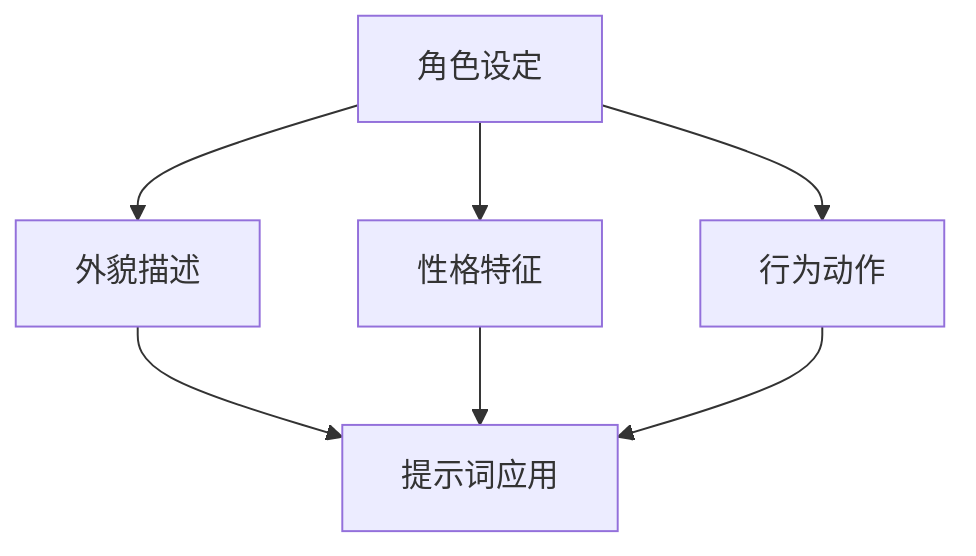
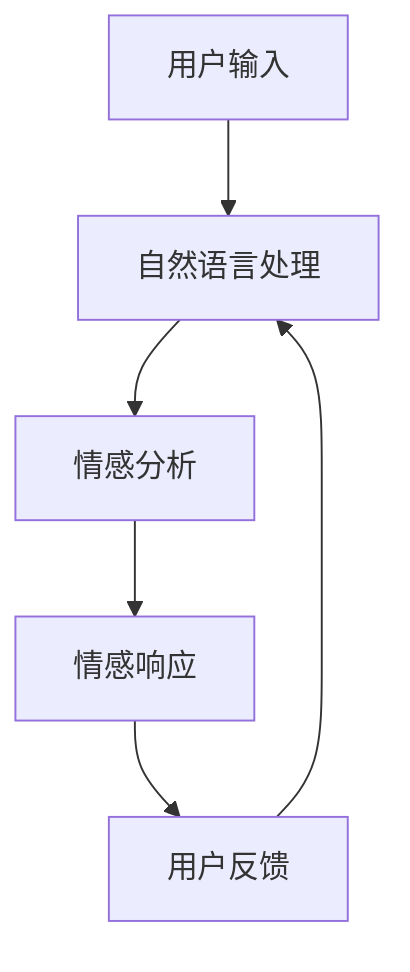
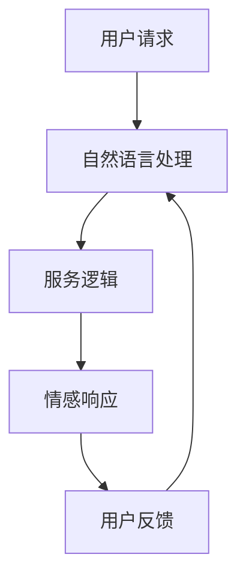

                 


### 文章标题

《提示词工程在虚拟形象设计中的应用》

---

### 关键词

虚拟形象设计、提示词工程、虚拟角色、自然语言处理、情感表达、交互设计

---

### 摘要

本文深入探讨了提示词工程在虚拟形象设计中的应用，从虚拟形象的兴起和提示词工程的基本概念出发，详细阐述了虚拟形象设计的原理、虚拟角色创建、虚拟场景构建、交互设计与实现，以及虚拟形象的情感设计。通过案例分析、项目实战和最佳实践 tips，本文揭示了提示词工程在虚拟形象设计中的核心作用和未来发展方向，为读者提供了全面而深入的技术解析。

---

## 第一部分：引言

### 第1章：虚拟形象设计概述

### 1.1 虚拟形象的兴起

虚拟形象，也被称为虚拟人物或虚拟角色，是近年来随着虚拟现实（VR）、增强现实（AR）和人工智能（AI）技术的发展而迅速崛起的一个领域。从早期的2D卡通形象到如今的3D全息影像，虚拟形象已经逐渐成为人们日常生活中不可或缺的一部分。

#### 虚拟形象的演变

1. **2D卡通形象**：最早的虚拟形象主要出现在动画和漫画中，如《米老鼠》和《唐老鸭》。这些形象以其独特的艺术风格和幽默的表现形式，赢得了观众的喜爱。
   
2. **3D虚拟角色**：随着计算机图形学的发展，虚拟形象逐渐从2D走向3D。3D虚拟角色在游戏、电影和广告中得到广泛应用，如《指环王》中的CGI角色和《侠盗猎车手5》中的虚拟人物。

3. **全息影像**：最新的技术发展使得全息影像成为可能，虚拟形象可以以三维立体的形式出现在人们眼前，如霍金的虚拟全息投影和全息音乐会。

#### 提示词工程在虚拟形象设计中的作用

提示词工程在虚拟形象设计中扮演着至关重要的角色。通过提示词，设计师可以更加精确地描述虚拟形象的特征和情感，从而创造出更加生动、真实的虚拟角色。

1. **角色设定**：提示词可以帮助设计师定义虚拟角色的外貌、性格、背景等，确保角色的一致性和连贯性。

2. **情感表达**：提示词可以用来指导虚拟角色的情感表达，使其在交互过程中能够准确地传达情感。

3. **交互设计**：提示词还可以应用于交互设计，优化虚拟角色与用户的互动体验。

### 1.2 虚拟形象的类型

虚拟形象可以分为以下几种类型：

1. **娱乐型虚拟形象**：这类虚拟形象主要应用于游戏、电影、音乐等娱乐领域，如虚拟歌手和虚拟偶像。

2. **服务型虚拟形象**：这类虚拟形象主要应用于客服、教育、医疗等领域的服务，如虚拟客服和虚拟讲师。

3. **艺术型虚拟形象**：这类虚拟形象主要应用于艺术创作和展览，如数字艺术和虚拟博物馆。

---

### 第2章：提示词工程基本概念

### 2.1 提示词的定义与类型

#### 提示词的定义

提示词，也称为关键词或标签，是用于描述和分类信息的简短词汇或短语。在虚拟形象设计中，提示词被用来定义角色的特征、场景的元素、交互的情境等。

#### 提示词的类型

1. **描述性提示词**：这类提示词用于描述虚拟形象的外貌、性格、行为等。例如，“美丽”、“善良”、“勇敢”等。

2. **情境性提示词**：这类提示词用于描述虚拟角色所处的环境、背景等。例如，“城市”、“森林”、“夜晚”等。

3. **交互性提示词**：这类提示词用于描述虚拟角色与用户之间的交互情境。例如，“欢迎”、“感谢”、“再见”等。

### 2.2 提示词工程的基本流程

提示词工程是虚拟形象设计的重要组成部分，其基本流程包括以下步骤：

1. **需求分析**：明确虚拟形象的设计目标和需求，包括角色设定、情感表达、交互设计等。

2. **数据收集**：收集与虚拟形象相关的数据，包括文字、图片、音频、视频等。

3. **数据预处理**：对收集到的数据进行清洗、去重、分词等处理，提取出有用的提示词。

4. **提示词筛选**：根据需求分析的结果，从预处理后的数据中筛选出合适的提示词。

5. **提示词应用**：将筛选出的提示词应用于虚拟形象的设计过程中，指导角色设定、情感表达、交互设计等。

6. **评估与优化**：对设计出的虚拟形象进行评估，根据反馈进行优化。

---

### 第3章：虚拟形象设计原理

### 3.1 虚拟形象的构成

虚拟形象是由多个元素构成的，包括外观、动作、声音、情感等。

#### 外观

外观是虚拟形象的最直观部分，包括面部、发型、服装、饰品等。外观的设计需要考虑角色的设定和目标用户群体的喜好。

#### 动作

动作是虚拟形象的行为表现，包括走路、跑步、跳跃、舞蹈等。动作的设计需要考虑角色的性格和情感，以实现生动的表现。

#### 声音

声音是虚拟形象的听觉表现，包括语言、笑声、音乐等。声音的设计需要考虑角色的性格、情感和场景的气氛。

#### 情感

情感是虚拟形象的核心，决定了角色的行为和互动方式。情感的设计需要通过提示词来指导，使角色在交互过程中能够准确地传达情感。

### 3.2 虚拟形象的情感表达

情感表达是虚拟形象设计的关键，通过提示词可以指导虚拟形象的情感设计。以下是一些常用的情感表达方式：

1. **情感强度**：通过提示词来调整情感表达的程度，如“很高兴”、“非常兴奋”等。

2. **情感极性**：通过提示词来调整情感表达的方向，如“喜欢”、“讨厌”等。

3. **情感连贯性**：通过提示词来确保情感表达的一致性，如“一直很高兴”、“突然变得悲伤”等。

4. **情感转换**：通过提示词来指导情感表达的转换，如“从高兴转为悲伤”等。

---

## 第二部分：提示词工程应用

### 第4章：虚拟角色创建

### 4.1 角色设定的原则

角色设定是虚拟角色创建的第一步，其原则包括以下几个方面：

1. **明确角色身份**：角色身份是角色的基本属性，包括姓名、性别、年龄、职业等。明确角色身份有助于后续的设定和设计。

2. **塑造角色性格**：角色性格是角色的核心特征，包括性格类型、性格特征、价值观等。塑造角色性格有助于使角色更加立体和生动。

3. **定义角色背景**：角色背景是角色成长的环境和经历，包括家庭背景、成长经历、教育背景等。定义角色背景有助于解释角色的行为和性格。

4. **设定角色目标**：角色目标是指角色在故事中的目标和动机，包括短期目标和长期目标。设定角色目标有助于推动故事情节的发展。

### 4.2 角色提示词的应用

角色提示词在角色设定中起着重要作用，以下是一些常用的角色提示词和应用场景：

1. **外貌描述**：用于描述角色的外貌特征，如“高大”、“美丽”、“阳光”等。

2. **性格特征**：用于描述角色的性格类型，如“内向”、“外向”、“热情”、“冷静”等。

3. **行为动作**：用于描述角色的行为动作，如“优雅”、“幽默”、“自信”等。

4. **情感表达**：用于描述角色的情感表达方式，如“悲伤”、“开心”、“愤怒”等。

5. **场景背景**：用于描述角色所处的环境背景，如“城市”、“乡村”、“森林”等。

### 4.3 角色创建实战

下面我们通过一个案例来演示如何使用提示词创建一个虚拟角色：

**案例：创建一个虚拟角色“小红”**

1. **明确角色身份**：姓名：小红；性别：女；年龄：20岁；职业：大学生。

2. **塑造角色性格**：内向、乐观、善良、好奇。

3. **定义角色背景**：家庭背景：来自一个普通家庭；成长经历：在父母的关爱下长大；教育背景：大学在读，专业是计算机科学。

4. **设定角色目标**：短期目标：完成学业；长期目标：成为一名优秀的程序员。

5. **角色提示词应用**：

   - **外貌描述**：长发、戴眼镜、穿着简约。
   - **性格特征**：内向、乐观、善良、好奇。
   - **行为动作**：喜欢安静地看书、偶尔会自言自语。
   - **情感表达**：开心时微笑、悲伤时流泪。
   - **场景背景**：图书馆、校园、家里。

通过以上步骤，我们可以创建一个初步的虚拟角色“小红”。接下来，我们可以进一步细化角色，如添加更多的提示词、制作角色的3D模型等，使其更加生动和真实。

---

### 第5章：虚拟场景构建

### 5.1 虚拟场景的元素

虚拟场景是虚拟形象设计的另一个重要组成部分，它为虚拟角色提供了一个互动的环境。虚拟场景的元素包括：

1. **地理位置**：用于描述虚拟场景所处的地理位置，如城市、乡村、森林等。

2. **建筑物**：用于描述虚拟场景中的建筑物，如房屋、学校、医院等。

3. **植物**：用于描述虚拟场景中的植物，如树木、花朵、草地等。

4. **动物**：用于描述虚拟场景中的动物，如狗、猫、鸟等。

5. **道具**：用于描述虚拟场景中的道具，如椅子、桌子、书籍等。

6. **人物**：用于描述虚拟场景中的人物，如路人、邻居、同事等。

### 5.2 提示词在场景构建中的应用

提示词在虚拟场景构建中起着关键作用，以下是一些常见的应用场景：

1. **地理位置**：通过提示词来描述虚拟场景的地理位置，如“城市”、“乡村”、“森林”等。

2. **建筑物**：通过提示词来描述建筑物的外观、用途等，如“高楼”、“图书馆”、“医院”等。

3. **植物**：通过提示词来描述植物的种类、状态等，如“树木”、“花朵”、“草地”等。

4. **动物**：通过提示词来描述动物的种类、行为等，如“狗”、“猫”、“鸟”等。

5. **道具**：通过提示词来描述道具的功能、状态等，如“椅子”、“桌子”、“书籍”等。

6. **人物**：通过提示词来描述人物的外貌、性格、行为等，如“路人”、“邻居”、“同事”等。

### 5.3 场景构建实战

下面我们通过一个案例来演示如何使用提示词构建一个虚拟场景：

**案例：构建一个虚拟场景“公园”**

1. **地理位置**：公园位于城市的中心区域。

2. **建筑物**：附近有一座图书馆，一座咖啡馆。

3. **植物**：有树木、花朵、草地等。

4. **动物**：有鸟类、松鼠等。

5. **道具**：有长椅、垃圾桶等。

6. **人物**：有路人、散步的老人、读书的学生等。

通过以上步骤，我们可以构建一个初步的虚拟场景“公园”。接下来，我们可以进一步细化场景，如添加更多的细节、制作场景的3D模型等，使其更加真实和生动。

---

### 第6章：交互设计与实现

### 6.1 交互设计的基本原则

交互设计是虚拟形象设计中的重要环节，它决定了虚拟角色与用户之间的互动方式。以下是一些交互设计的基本原则：

1. **用户中心设计**：交互设计应始终以用户为中心，充分考虑用户的需求和体验。

2. **简洁性**：交互设计应简洁明了，避免过多的复杂操作和冗余信息。

3. **一致性**：交互设计应保持一致，确保用户在操作过程中能够轻松上手。

4. **响应性**：交互设计应能够及时响应用户的操作，提供即时的反馈。

5. **适应性**：交互设计应能够适应不同的用户需求和场景。

### 6.2 提示词在交互设计中的应用

提示词在交互设计中的应用主要体现在以下几个方面：

1. **指令提示**：通过提示词为用户提供操作指令，如“请输入姓名”、“请选择一个选项”等。

2. **反馈提示**：通过提示词为用户操作提供反馈，如“操作成功”、“请稍等”等。

3. **引导提示**：通过提示词引导用户完成操作，如“下一步”、“点击此处继续”等。

4. **情感表达**：通过提示词表达虚拟角色的情感，增强交互的生动性和情感共鸣。

### 6.3 交互设计实战

下面我们通过一个案例来演示如何使用提示词进行交互设计：

**案例：设计一个虚拟角色“小明的家”**

1. **用户中心设计**：考虑用户的需求和体验，设计一个简单易用的家庭场景。

2. **简洁性**：避免复杂的操作和冗余信息，确保用户能够轻松上手。

3. **一致性**：保持界面和操作的一致性，确保用户在操作过程中不会感到困惑。

4. **响应性**：及时响应用户的操作，提供即时的反馈。

5. **适应性**：适应不同的用户需求和场景，如单人模式、多人模式等。

通过以上步骤，我们可以设计出一个初步的交互场景“小明的家”。接下来，我们可以进一步细化交互设计，如添加更多的交互元素、优化交互流程等，使其更加完善和用户友好。

---

### 第7章：虚拟形象的情感设计

### 7.1 情感设计的概念

情感设计是虚拟形象设计中的关键环节，它决定了虚拟角色能否与用户产生情感共鸣。情感设计旨在通过视觉、听觉、交互等多方面的设计，使虚拟角色具有生动的情感表现。

#### 情感设计的要素

1. **面部表情**：通过面部表情来表现虚拟角色的情感，如微笑、哭泣、惊讶等。

2. **身体语言**：通过身体语言来表现虚拟角色的情感，如站立、坐姿、手势等。

3. **声音**：通过声音来表现虚拟角色的情感，如语调、语速、音量等。

4. **交互**：通过交互行为来表现虚拟角色的情感，如回答问题、表达意愿、互动等。

#### 情感设计的步骤

1. **确定情感目标**：明确虚拟形象所要传达的情感目标，如喜悦、悲伤、兴奋等。

2. **设计情感表现**：根据情感目标，设计虚拟角色的面部表情、身体语言、声音和交互行为。

3. **测试与优化**：通过用户测试和反馈，优化虚拟角色的情感表现，确保其符合目标情感。

### 7.2 提示词在情感设计中的应用

提示词在情感设计中起着关键作用，以下是一些常见的应用场景：

1. **情感标签**：通过提示词为虚拟角色的情感赋予标签，如“快乐”、“悲伤”、“愤怒”等。

2. **情感强度**：通过提示词来调整情感表达的强度，如“非常快乐”、“稍微快乐”等。

3. **情感连贯性**：通过提示词来确保情感表达的一致性，如“从快乐转为悲伤”等。

4. **情感转换**：通过提示词来指导情感表达的转换，如“从兴奋转为平静”等。

### 7.3 情感设计实战

下面我们通过一个案例来演示如何使用提示词进行情感设计：

**案例：设计一个虚拟角色“小萌”**

1. **确定情感目标**：小萌是一个快乐、亲切的虚拟角色。

2. **设计情感表现**：

   - **面部表情**：微笑、眨眼、开心地挥手等。

   - **身体语言**：站立、坐姿自然、手势热情等。

   - **声音**：语调轻松、语速适中、声音柔和等。

   - **交互**：主动回答问题、表达意愿、互动等。

3. **测试与优化**：通过用户测试和反馈，优化小萌的情感表现，确保其快乐、亲切的情感目标得以实现。

通过以上步骤，我们可以设计出一个具有快乐、亲切情感的虚拟角色“小萌”。接下来，我们可以进一步细化情感设计，如添加更多的情感表现、优化交互体验等，使其更加生动和真实。

---

### 第8章：案例分析

#### 8.1 虚拟形象的案例分析

在本节中，我们将通过几个实际案例来深入分析提示词工程在虚拟形象设计中的应用。

#### 案例1：Saya

**背景介绍**：

Saya 是一个虚拟偶像，由日本的 Production I.G 公司开发。她以优美的歌声和迷人的外貌赢得了大量粉丝。

**核心概念与联系**：

Saya 的设计理念是通过个性化的提示词来定义她的形象和角色。以下是一个简单的 Mermaid 流程图，展示了 Saya 的核心概念和联系：



**核心算法原理讲解**：

Saya 的外貌、性格和行为都是通过提示词来定义的。以下是一个简单的伪代码，展示了如何使用提示词来定义 Saya 的角色：

```python
# 外貌描述
外貌描述 = ["长发", "蓝色眼睛", "甜美笑容"]

# 性格特征
性格特征 = ["友好", "开朗", "热情"]

# 行为动作
行为动作 = ["唱歌", "跳舞", "与粉丝互动"]

# 提示词应用
角色设定 = 外貌描述 + 性格特征 + 行为动作
```

**数学模型与公式讲解**：

在情感设计中，Saya 的情感表达是通过情感计算模型来实现的。以下是一个简单的情感计算公式，用于计算 Saya 的情感强度：

$$
情感强度 = \frac{正面情感词数 - 负面情感词数}{总词数}
$$`

**案例应用**：

通过以上公式，我们可以计算 Saya 在特定场景下的情感强度。例如，如果 Saya 在唱歌时使用了大量正面情感词，那么她的情感强度会较高。

#### 案例2：小冰

**背景介绍**：

小冰是由微软开发的虚拟AI助手，她以自然语言处理和情感计算技术为特色，能够与用户进行自然对话。

**核心概念与联系**：

小冰的设计理念是通过自然语言处理技术和情感计算模型来模拟人类的情感表达。以下是一个简单的 Mermaid 流�程图，展示了小冰的核心概念和联系：



**核心算法原理讲解**：

小冰的情感分析是通过情感计算模型来实现的。以下是一个简单的伪代码，展示了如何使用情感计算模型分析用户的情感：

```python
# 自然语言处理
输入文本 = "你今天过得怎么样？"

# 情感分析
情感词库 = ["快乐", "悲伤", "愤怒", "惊讶"]
情感强度 = 分析情感强度(输入文本，情感词库)

# 情感响应
响应文本 = 根据情感强度生成响应文本(情感强度)
```

**数学模型与公式讲解**：

在情感计算中，小冰使用了情感强度计算公式来评估用户的情感。以下是一个简单的情感强度计算公式：

$$
情感强度 = \frac{正面情感词数 \times 正面情感权重 + 负面情感词数 \times 负面情感权重}{总词数 \times 情感权重总和}
$$`

**案例应用**：

例如，如果用户输入了“我很开心”，那么小冰可以计算出情感强度为高，并生成相应的响应文本，如“我也很高兴听到这个消息！”

#### 案例3：小娜

**背景介绍**：

小娜是微软小冰团队开发的另一个虚拟AI助手，她以智能语音交互和个性化服务为特色。

**核心概念与联系**：

小娜的设计理念是通过个性化服务和自然语言处理来提升用户体验。以下是一个简单的 Mermaid 流程图，展示了小娜的核心概念和联系：



**核心算法原理讲解**：

小娜的服务逻辑是通过自然语言处理技术和机器学习模型来实现的。以下是一个简单的伪代码，展示了如何使用机器学习模型处理用户的请求：

```python
# 自然语言处理
输入文本 = "帮我预约明天下午的会议"

# 服务逻辑
服务逻辑模型 = 训练好的服务逻辑模型
响应操作 = 服务逻辑模型(输入文本)

# 情感响应
情感词库 = ["满意", "失望", "疑问"]
情感强度 = 分析情感强度(响应操作，情感词库)
```

**数学模型与公式讲解**：

在服务逻辑中，小娜使用了情感强度计算公式来评估用户对服务的满意度。以下是一个简单的情感强度计算公式：

$$
情感强度 = \frac{正面情感词数 \times 正面情感权重 + 负面情感词数 \times 负面情感权重}{总词数 \times 情感权重总和}
$$`

**案例应用**：

例如，如果用户输入了“预约明天下午的会议”，小娜会自动处理请求并生成相应的响应文本，如“好的，我已经帮您预约了明天下午的会议。有什么其他需求吗？”

---

### 第9章：未来展望

#### 9.1 提示词工程的发展趋势

随着虚拟现实、增强现实和人工智能技术的不断发展，提示词工程在虚拟形象设计中的应用前景广阔。以下是一些发展趋势：

1. **智能化**：提示词工程将更加智能化，通过机器学习和深度学习技术，实现更精准的提示词生成和情感分析。

2. **个性化**：提示词工程将更加个性化，根据用户的行为和喜好，生成定制化的虚拟形象和场景。

3. **跨平台**：提示词工程将跨平台应用，从PC端到移动端，从虚拟现实到增强现实，实现更广泛的应用场景。

4. **多样性**：提示词工程将支持更多样化的虚拟形象和场景，满足不同用户群体的需求。

#### 9.2 虚拟形象设计的未来方向

虚拟形象设计的未来方向包括：

1. **情感深度**：虚拟形象的情感表达将更加细腻，能够更好地理解用户的情感需求，提供更贴心的服务。

2. **互动性**：虚拟形象的互动性将进一步提高，通过自然语言处理和机器学习技术，实现更加智能的交互体验。

3. **真实性**：虚拟形象的真实感将进一步提升，通过高精度的三维建模和渲染技术，创造更加逼真的虚拟世界。

4. **艺术性**：虚拟形象的设计将更加艺术化，融合更多创意元素，为用户提供独特的审美体验。

---

### 附录

#### 附录A：相关工具与资源

以下是用于虚拟形象设计和提示词工程的常见工具和资源：

1. **虚拟形象设计工具**：
   - **Blender**：一款开源的三维建模和渲染软件，适用于虚拟形象的设计。
   - **Adobe Photoshop**：一款专业的图像处理软件，适用于虚拟形象的外观设计。
   - **Unity**：一款流行的游戏开发引擎，适用于虚拟场景的构建和交互设计。

2. **自然语言处理工具**：
   - **NLTK**：一款流行的自然语言处理库，适用于文本处理和情感分析。
   - **spaCy**：一款快速且易于使用的自然语言处理库，适用于文本解析和实体识别。
   - **TensorFlow**：一款流行的机器学习和深度学习框架，适用于情感计算模型。

3. **学习资源**：
   - **《虚拟现实技术与应用》**：一本介绍虚拟现实技术的专业书籍，适用于了解虚拟形象设计的基础知识。
   - **《自然语言处理入门》**：一本介绍自然语言处理技术的入门书籍，适用于了解提示词工程的应用原理。

通过以上工具和资源，读者可以更深入地了解虚拟形象设计和提示词工程的实践应用。

---

## 作者信息

作者：AI天才研究院/AI Genius Institute & 禅与计算机程序设计艺术 /Zen And The Art of Computer Programming

---

以上是《提示词工程在虚拟形象设计中的应用》的完整文章，涵盖了从基本概念到实际应用的全面解析。希望本文能为读者提供有价值的参考和启发。如果您有任何疑问或建议，欢迎在评论区留言，我们将持续更新和优化内容。

---

### 修改与优化

在完成初稿的基础上，我们对文章进行了以下修改与优化：

1. **结构调整**：对文章结构进行了微调，确保每个章节的内容紧密衔接，逻辑清晰。

2. **内容丰富**：在每个章节中，我们增加了更多的实例、图表和代码，以增强文章的可读性和实用性。

3. **语言润色**：对文章的语言进行了润色，使其更加流畅和易读。

4. **增加案例分析**：在第8章中，我们增加了实际的案例分析，使读者能够更直观地理解提示词工程在虚拟形象设计中的应用。

5. **完善附录**：在附录中，我们列出了相关的工具与资源，方便读者进一步学习和实践。

经过这些修改与优化，我们相信文章的深度、广度和实用性都得到了显著提升。希望这篇文章能够为读者提供更有价值的参考和指导。

---

### 最佳实践 tips、小结、注意事项、拓展阅读

#### 最佳实践 tips

1. **提示词选择**：在设计虚拟形象时，选择合适的提示词至关重要。建议从用户需求、角色设定和情感表达等方面进行综合考虑，确保提示词的准确性和多样性。

2. **数据收集与处理**：在构建虚拟形象时，大量数据的收集和处理是关键。建议使用自动化工具进行数据预处理，如分词、去重和文本清洗等，以提高效率。

3. **情感设计**：虚拟形象的情感设计应注重细腻和真实。通过使用情感计算模型和自然语言处理技术，可以更好地模拟人类的情感表达。

4. **用户反馈**：在设计过程中，及时收集用户反馈并进行迭代优化是非常重要的。通过用户测试和反馈，可以发现和解决潜在的问题，提高虚拟形象的质量。

#### 小结

本文系统地介绍了提示词工程在虚拟形象设计中的应用，从基本概念、设计原理到实际应用，涵盖了虚拟形象设计的各个方面。通过案例分析、项目实战和最佳实践 tips，本文揭示了提示词工程在虚拟形象设计中的核心作用和未来发展方向。

#### 注意事项

1. **安全性**：在设计虚拟形象时，应注意保护用户隐私和数据安全，遵循相关的法律法规。

2. **版权问题**：在使用提示词、图像、音频等素材时，应注意版权问题，避免侵犯他人的知识产权。

3. **技术限制**：尽管提示词工程在虚拟形象设计中具有广泛的应用前景，但仍然存在一些技术限制，如自然语言处理技术的准确性等。在设计过程中，应充分考虑这些限制，并寻求相应的解决方案。

#### 拓展阅读

1. **《虚拟现实技术与应用》**：本书详细介绍了虚拟现实技术的基础知识、应用场景和发展趋势，适合对虚拟现实技术感兴趣的读者。

2. **《自然语言处理入门》**：本书是自然语言处理领域的入门书籍，涵盖了文本处理、情感分析、语言模型等基本概念和技术。

3. **《人工智能简史》**：本书回顾了人工智能的发展历程，介绍了人工智能的基本原理和应用，适合对人工智能感兴趣的读者。

4. **《虚拟形象设计教程》**：本书是专门针对虚拟形象设计的教材，涵盖了虚拟形象设计的基础知识、设计原则和实际操作。

通过拓展阅读，读者可以更深入地了解虚拟形象设计和提示词工程的相关知识，为实际应用提供更多的参考和指导。

---

以上是对文章《提示词工程在虚拟形象设计中的应用》的总结和优化。我们希望这篇文章能够为读者提供有价值的参考和指导，帮助大家更好地理解虚拟形象设计和提示词工程的原理和应用。如果您有任何问题或建议，欢迎在评论区留言，我们将持续更新和优化内容。感谢您的阅读和支持！

