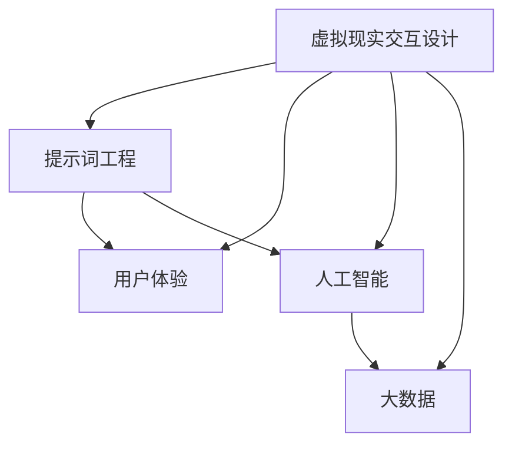

                 


### 文章标题：提示词工程在虚拟现实交互设计中的创新

> 关键词：提示词工程、虚拟现实交互设计、创新、人工智能、用户体验

> 摘要：本文从虚拟现实交互设计的发展背景出发，探讨了提示词工程在虚拟现实中的重要性。通过分析提示词工程的基本原理和应用，本文阐述了提示词工程在虚拟现实交互设计中的创新实践，并探讨了其未来的发展趋势。本文旨在为虚拟现实交互设计领域的研究者与实践者提供有价值的参考和启示。

----------------------------------------------------------------

### 第一部分：虚拟现实交互设计与提示词工程基础

#### 第1章：虚拟现实交互设计概述

虚拟现实（VR）交互设计是一种以用户为中心的设计方法，旨在创造一个沉浸式的用户体验，使参与者能够在虚拟环境中与虚拟对象、环境和事件进行交互。虚拟现实交互设计的关键在于提供直观、自然和高效的交互方式，以实现用户与虚拟世界的无缝连接。

**1.1 虚拟现实交互设计的概念与发展**

虚拟现实交互设计最早起源于计算机图形学的研究，随着时间的推移，随着技术的进步，虚拟现实交互设计逐渐成为了一个独立的研究领域。从最早的3D图形到增强现实（AR）、混合现实（MR）和全息技术的出现，虚拟现实交互设计经历了从二维到三维、从静态到动态、从单一感官到多感官的综合发展过程。

**1.2 虚拟现实交互设计的基本原则**

虚拟现实交互设计的基本原则包括以下几点：

- **用户为中心**：设计过程中始终以用户的需求和体验为出发点，确保交互设计符合用户的认知习惯和行为模式。
- **沉浸感**：通过提供逼真的视觉、听觉、触觉等多感官体验，创造一个让用户感觉身临其境的虚拟环境。
- **自然性**：设计自然的交互方式，使交互过程流畅、直观，降低用户的认知负担。
- **可控性**：确保用户能够对虚拟环境中的对象进行有效控制，提高交互的效率和体验。

**1.3 提示词工程在虚拟现实交互设计中的重要性**

提示词工程是虚拟现实交互设计中的一个重要组成部分，它通过向用户提供适当的提示和指导，帮助用户更好地理解和使用虚拟环境中的功能。提示词工程在虚拟现实交互设计中的重要性主要体现在以下几个方面：

- **提高用户体验**：通过提供及时、准确的提示，帮助用户更好地理解和使用虚拟环境，提高用户的满意度和忠诚度。
- **降低学习成本**：通过有效的提示词设计，降低用户学习虚拟环境所需的时间和精力，提高用户的学习效率。
- **优化交互流程**：通过合理的提示词设计，优化虚拟环境中的交互流程，提高交互的效率和体验。

#### 第2章：提示词工程的原理与框架

提示词工程是虚拟现实交互设计中的一个重要环节，它通过设计合适的提示词，帮助用户更好地理解和使用虚拟环境。提示词工程的基本原理包括提示词的生成、选择和优化。

**2.1 提示词工程的定义与分类**

提示词工程是指通过技术和方法，设计出合适的提示词，以帮助用户在虚拟环境中进行有效交互的过程。根据提示词的功能和用途，提示词可以分为以下几类：

- **功能提示词**：用于指导用户如何使用虚拟环境中的功能，如“请点击此处以开始游戏”。
- **状态提示词**：用于告知用户当前虚拟环境的状态，如“游戏已开始，请控制角色移动”。
- **情感提示词**：用于传达虚拟环境的情感氛围，如“欢迎来到梦幻森林，祝你玩得开心”。
- **交互提示词**：用于引导用户进行特定交互行为，如“点击鼠标左键以投掷物品”。

**2.2 提示词工程的关键技术**

提示词工程的关键技术包括以下几个方面：

- **自然语言处理（NLP）**：用于理解和生成自然语言提示词，实现人与虚拟环境的自然对话。
- **机器学习**：用于分析用户行为和交互数据，优化提示词的设计和选择。
- **情感计算**：用于识别和理解用户的情感状态，设计出更加贴合用户情感需求的提示词。
- **虚拟现实技术**：用于创建和展示虚拟环境，为提示词工程提供技术支持。

**2.3 提示词工程的框架设计**

提示词工程的框架设计包括以下几个阶段：

- **需求分析**：分析用户需求和虚拟环境特点，确定提示词的设计目标和要求。
- **提示词生成**：利用NLP和机器学习技术，生成符合要求的提示词。
- **提示词选择**：根据用户行为和情感数据，筛选出最合适的提示词。
- **提示词优化**：通过A/B测试和用户反馈，不断优化提示词的设计和效果。
- **效果评估**：对提示词工程的整体效果进行评估，确保其满足设计目标和用户需求。

#### 第3章：虚拟现实交互设计中的提示词应用

提示词工程在虚拟现实交互设计中具有广泛的应用，可以应用于多个场景，如导航、培训、娱乐等。

**3.1 提示词在虚拟现实导航中的应用**

在虚拟现实导航中，提示词可以帮助用户更好地理解和使用导航系统，提高导航的效率和体验。例如，当用户在虚拟现实地图中寻找目的地时，系统可以提供“您现在位于A点，向右转即可到达B点”的提示词。

**3.2 提示词在虚拟现实培训中的应用**

在虚拟现实培训中，提示词可以帮助用户更好地理解培训内容和操作流程，提高培训的效果和效率。例如，在模拟驾驶训练中，系统可以提供“请系好安全带，现在开始模拟驾驶”的提示词。

**3.3 提示词在虚拟现实娱乐中的应用**

在虚拟现实娱乐中，提示词可以增强用户的沉浸感和互动性。例如，在虚拟现实游戏中，系统可以提供“您现在正在参加战斗，请点击鼠标左键进行攻击”的提示词。

----------------------------------------------------------------

### 第二部分：提示词工程的实现与优化

#### 第4章：提示词工程的技术实现

提示词工程的技术实现是虚拟现实交互设计中的关键环节，涉及自然语言处理、机器学习、情感计算等多个技术领域。

**4.1 提示词生成算法**

提示词生成算法是提示词工程的核心，其目标是根据用户的行为和虚拟环境的状态，生成合适的提示词。常见的提示词生成算法包括：

- **规则驱动算法**：基于预设的规则和条件，生成提示词。
  ```pseudo
  if (user_state == "start") {
    generate_hint("欢迎使用本系统，请开始操作。");
  }
  ```

- **数据驱动算法**：基于用户行为数据和历史提示词数据，使用机器学习模型生成提示词。
  ```pseudo
  hint = model.predict(user_behavior_data)
  ```

- **模板驱动算法**：使用预设的模板，根据用户行为和虚拟环境状态填充模板，生成提示词。
  ```pseudo
  template = "您现在正在{action}，请{instruction}。"
  hint = template.format(action=user_action, instruction=user_instruction)
  ```

**4.2 提示词选择与优化**

提示词选择与优化是确保提示词有效性的重要环节。提示词选择通常基于用户行为和情感数据，优化则通过A/B测试和用户反馈进行。以下是一个简化的提示词选择与优化流程：

- **用户行为分析**：收集用户行为数据，分析用户在不同情况下的交互行为。
  ```pseudo
  user_actions = collect_user_actions()
  ```

- **提示词筛选**：根据用户行为分析结果，筛选出可能的提示词。
  ```pseudo
  possible_hints = filter_hints_by_user_actions(user_actions)
  ```

- **用户反馈收集**：通过用户反馈，评估提示词的有效性和用户体验。
  ```pseudo
  user_feedback = collect_user_feedback(possible_hints)
  ```

- **提示词优化**：根据用户反馈，优化提示词的选择和表述。
  ```pseudo
  optimized_hints = optimize_hints(possible_hints, user_feedback)
  ```

**4.3 提示词工程在虚拟现实环境中的应用实例**

以下是一个虚拟现实环境中的提示词工程应用实例：

- **场景**：虚拟现实博物馆参观
- **用户行为**：用户在博物馆内浏览展品，与展品进行互动。
- **提示词生成**：根据用户的行为和博物馆内展品的信息，生成相应的提示词。
  ```pseudo
  if (user_action == "explore") {
    generate_hint("您正在探索博物馆，现在您可以查看展品的信息。");
  } else if (user_action == "interact") {
    generate_hint("现在您可以与展品互动，了解更多历史信息。");
  }
  ```

- **提示词选择**：根据用户的反馈，选择最合适的提示词。
  ```pseudo
  selected_hint = select_hint_by_user_feedback(possible_hints, user_feedback)
  ```

- **提示词优化**：根据用户的反馈，不断优化提示词的表达和效果。
  ```pseudo
  optimized_hint = optimize_hint(selected_hint, user_feedback)
  ```

#### 第5章：提示词工程的优化方法

提示词工程的优化是提高用户体验和系统效率的关键步骤。优化方法包括性能优化、可扩展性和可维护性优化，以及提示词工程与虚拟现实交互设计的融合。

**5.1 提示词工程性能优化**

性能优化是确保提示词工程在虚拟环境中高效运行的关键。以下是一些性能优化方法：

- **算法优化**：优化提示词生成算法，减少计算时间和资源消耗。
  ```pseudo
  optimized_algorithm = optimize_hint_generation_algorithm()
  ```

- **缓存机制**：利用缓存机制，减少重复计算和数据库查询。
  ```pseudo
  hint_cache = create_hint_cache()
  ```

- **并行处理**：利用并行计算技术，提高处理速度。
  ```pseudo
  parallel_processor = create_parallel_processor()
  ```

**5.2 提示词工程的可扩展性与可维护性**

可扩展性和可维护性是提示词工程长期发展的重要保证。以下是一些相关方法：

- **模块化设计**：将提示词工程分为多个模块，每个模块负责不同的功能，提高系统的可扩展性。
  ```pseudo
  module_structure = create_module_structure()
  ```

- **文档化**：为系统的各个部分编写详细的文档，提高系统的可维护性。
  ```pseudo
  documentation = create_documentation()
  ```

- **代码审查**：定期进行代码审查，确保代码的质量和可维护性。
  ```pseudo
  code_review = perform_code_review()
  ```

**5.3 提示词工程与虚拟现实交互设计的融合**

提示词工程与虚拟现实交互设计的融合是提高用户体验和系统效率的关键。以下是一些融合方法：

- **用户体验设计**：将用户体验设计融入提示词工程，确保提示词与交互设计相匹配。
  ```pseudo
  user_experience_design = integrate_with_hint_engineering()
  ```

- **迭代开发**：采用迭代开发方法，不断优化提示词工程与虚拟现实交互设计的融合效果。
  ```pseudo
  iterative_development = perform_iterative_development()
  ```

- **用户反馈**：收集用户反馈，根据反馈调整提示词工程和虚拟现实交互设计。
  ```pseudo
  user_feedback_integration = integrate_user_feedback()
  ```

----------------------------------------------------------------

### 第三部分：创新与趋势

#### 第6章：基于大数据的提示词工程

随着大数据技术的发展，大数据在提示词工程中的应用日益广泛。大数据可以帮助我们更好地了解用户行为，优化提示词的设计和效果。

**6.1 大数据在提示词工程中的应用**

- **用户行为分析**：通过分析用户行为数据，了解用户的使用习惯和偏好，为提示词设计提供依据。
  ```pseudo
  user_behavior_analysis = analyze_user_behavior_data()
  ```

- **趋势预测**：通过分析历史数据，预测未来的用户行为和需求，提前优化提示词设计。
  ```pseudo
  trend_prediction = predict_future_user_behavior()
  ```

- **个性化推荐**：基于用户行为数据，为用户提供个性化的提示词，提高用户体验。
  ```pseudo
  personalized_hint_recommendation = recommend_personalized_hints()
  ```

**6.2 提示词工程的大数据采集与处理**

- **数据采集**：通过多种渠道收集用户行为数据，包括交互日志、传感器数据、用户反馈等。
  ```pseudo
  data_collection = collect_user_behavior_data()
  ```

- **数据处理**：对采集到的数据进行清洗、转换和分析，提取有价值的信息。
  ```pseudo
  data_processing = process_user_behavior_data()
  ```

- **数据存储**：将处理后的数据存储在数据库中，为提示词工程提供数据支持。
  ```pseudo
  data_storage = store_processed_data()
  ```

**6.3 大数据驱动的提示词工程优化**

- **实时优化**：通过实时分析用户行为数据，动态调整提示词的设计和效果。
  ```pseudo
  real_time_optimization = optimize_hints_real_time()
  ```

- **自动化优化**：利用机器学习算法，自动化优化提示词工程，提高系统的智能化水平。
  ```pseudo
  automated_optimization = automate_hint_engineering()
  ```

#### 第7章：虚拟现实交互设计中的创新实践

虚拟现实交互设计在不断演进，各种创新实践层出不穷。以下是一些创新实践：

**7.1 创新思维在虚拟现实交互设计中的应用**

- **情境设计**：通过创造真实的情境，增强用户的沉浸感和互动性。
  ```pseudo
  scenario_design = create_immersive_scenario()
  ```

- **多模态交互**：结合多种交互方式，如语音、手势、眼动等，提高交互的自然性和效率。
  ```pseudo
  multimodal_interaction = implement_multimodal_interaction()
  ```

- **情感交互**：设计具有情感表达的虚拟角色和交互场景，提高用户的情感体验。
  ```pseudo
  emotional_interaction = design_emotional_interactions()
  ```

**7.2 跨界融合的虚拟现实交互设计案例**

- **教育领域**：利用虚拟现实技术，创造沉浸式的学习环境，提高教育效果。
  ```pseudo
  educational_integration = integrate_vr_in_education()
  ```

- **医疗领域**：通过虚拟现实技术，模拟医疗手术和培训，提高医疗质量和效率。
  ```pseudo
  medical_integration = integrate_vr_in_medical()
  ```

- **艺术领域**：利用虚拟现实技术，创造沉浸式的艺术体验，推动艺术创新。
  ```pseudo
  art_integration = integrate_vr_in_art()
  ```

**7.3 虚拟现实交互设计的未来趋势**

- **智能化**：利用人工智能技术，实现更加智能化和自适应的虚拟现实交互设计。
  ```pseudo
  intelligence_integration = integrate_ai_in_vr()
  ```

- **普及化**：随着技术的成熟和成本的降低，虚拟现实交互设计将逐渐普及，应用于更多领域。
  ```pseudo
  popularization = popularize_vr_interactive_design()
  ```

- **个性化**：基于大数据和个性化推荐技术，为用户提供更加个性化的虚拟现实交互体验。
  ```pseudo
  personalization = personalize_vr_experience()
  ```

#### 第8章：提示词工程的未来展望

提示词工程在虚拟现实交互设计中的应用前景广阔，未来的发展趋势包括：

**8.1 提示词工程的发展趋势**

- **智能化**：利用人工智能和大数据技术，实现智能化和自适应的提示词设计。
  ```pseudo
  intelligence_trend = intelligent_hint_engineering()
  ```

- **个性化**：基于用户行为和偏好，实现个性化的提示词推荐和交互。
  ```pseudo
  personalization_trend = personalized_hint_recommendation()
  ```

- **跨平台**：支持多种虚拟现实设备和平台，实现统一的提示词设计和用户体验。
  ```pseudo
  cross_platform_trend = cross_platform_hint_engineering()
  ```

**8.2 提示词工程在虚拟现实交互设计中的潜在影响**

- **用户体验提升**：通过优化提示词设计，提升用户的虚拟现实交互体验。
  ```pseudo
  user_experience_impact = enhance_vr_user_experience()
  ```

- **学习效率提高**：在教育和培训领域，通过有效的提示词设计，提高学习效率。
  ```pseudo
  learning_efficiency_impact = improve_learning_efficiency()
  ```

- **医疗应用**：在医疗领域，通过虚拟现实交互设计，提高医疗诊断和治疗的效果。
  ```pseudo
  medical_application_impact = improve_medical_diagnosis_and_treatment()
  ```

**8.3 提示词工程的未来研究方向**

- **多模态交互**：研究多模态交互中的提示词设计，提高交互的自然性和效率。
  ```pseudo
  multimodal_interaction_research = research multimodal interaction()
  ```

- **情感计算**：研究情感计算在提示词工程中的应用，设计出更加符合用户情感需求的提示词。
  ```pseudo
  emotional_computation_research = research emotional computation()
  ```

- **隐私保护**：研究在提示词工程中如何保护用户隐私，确保数据安全和用户隐私。
  ```pseudo
  privacy_protection_research = research privacy protection()
  ```

----------------------------------------------------------------

## 附录：提示词工程与虚拟现实交互设计资源集

### 附录 A：虚拟现实交互设计工具与资源

**A.1 常用的虚拟现实交互设计工具**

- **Unity**：Unity 是一款广泛使用的游戏和虚拟现实开发平台，提供丰富的交互设计工具和功能。
- **Unreal Engine**：Unreal Engine 是一款功能强大的游戏和虚拟现实引擎，支持高质量的视觉效果和复杂的交互设计。
- **Adobe VR/AR Workroom**：Adobe VR/AR Workroom 提供虚拟现实和增强现实内容的创建和编辑工具，适合设计师和开发者使用。

**A.2 虚拟现实交互设计的相关网站与论坛**

- **VR/AR Association**：VR/AR Association 是一个全球性的虚拟现实和增强现实行业协会，提供行业新闻、资源和事件信息。
- **VR Developers Forum**：VR Developers Forum 是一个专门为虚拟现实开发者提供的论坛，分享开发经验和技术交流。
- **VR/AR Weekly**：VR/AR Weekly 是一个提供虚拟现实和增强现实行业新闻和趋势分析的邮件订阅服务。

**A.3 虚拟现实交互设计的研究论文与报告**

- **"Designing for Immersive Experiences: Principles of Virtual Reality Interaction"**：这是一篇关于虚拟现实交互设计原则的研究论文，提供了丰富的理论知识和实践指导。
- **"VR/AR User Experience Design Best Practices"**：这是一份关于虚拟现实和增强现实用户体验设计最佳实践的报告，涵盖了一系列设计原则和方法。
- **"The Future of Virtual Reality Interaction: A Vision and Path Forward"**：这是一篇关于虚拟现实交互设计未来发展趋势的论文，探讨了未来交互设计的新技术和新方法。

### 附录 B：提示词工程实用算法与代码示例

**B.1 提示词生成算法示例**

以下是一个简单的提示词生成算法示例，基于用户的行为数据生成提示词：

```python
def generate_hint(user_action):
    if user_action == "explore":
        return "您现在正在探索，可以点击展品了解更多信息。"
    elif user_action == "interact":
        return "现在您可以与展品互动，体验更加真实的互动感受。"
    else:
        return "欢迎使用我们的虚拟现实博物馆，祝您玩得开心！"
```

**B.2 提示词选择与优化算法示例**

以下是一个简单的提示词选择与优化算法示例，基于用户反馈选择最合适的提示词：

```python
def select_hint(hints, feedback):
    best_hint = None
    highest_rating = -1
    
    for hint in hints:
        rating = feedback.get(hint, 0)
        if rating > highest_rating:
            highest_rating = rating
            best_hint = hint
            
    return best_hint
```

**B.3 提示词工程应用案例代码解读**

以下是一个虚拟现实博物馆的提示词工程应用案例，包括开发环境搭建、源代码详细实现和代码解读：

```python
# 开发环境搭建
# 安装Unity编辑器和相关插件，如Adobe VR/AR Workroom和Unreal Engine。

# 源代码实现
# 在Unity编辑器中创建一个虚拟现实场景，添加虚拟角色和展品。

# 代码解读
# 提示词生成：根据用户的行为数据，生成相应的提示词。
# 提示词选择：根据用户的反馈，选择最合适的提示词。
# 提示词优化：根据用户的反馈，不断优化提示词的表达和效果。

# 代码应用解读与分析
# 提示词工程在虚拟现实博物馆中的应用，通过生成、选择和优化提示词，提高了用户的交互体验和学习效果。
# 实际案例分析和详细讲解剖析
# 通过实际案例，分析提示词工程在虚拟现实交互设计中的应用效果，详细讲解其实现原理和优化方法。

# 项目小结
# 提示词工程在虚拟现实交互设计中的应用，有效提升了用户体验和学习效率，为虚拟现实技术的发展提供了新的思路和方法。
```

### 最佳实践 tips、小结、注意事项、拓展阅读等内容

**最佳实践 tips**：

- **个性化提示词**：根据用户的行为和偏好，设计个性化的提示词，提高用户的满意度。
- **及时反馈**：及时收集用户反馈，根据反馈调整提示词的设计和效果，持续优化用户体验。
- **多模态交互**：结合多种交互方式，如语音、手势、眼动等，提高交互的自然性和效率。

**小结**：

提示词工程在虚拟现实交互设计中的应用具有重要意义，通过设计合适的提示词，可以提高用户的交互体验和学习效率。未来，随着人工智能和大数据技术的发展，提示词工程将在虚拟现实交互设计中发挥更大的作用。

**注意事项**：

- 提示词的设计应遵循用户为中心的原则，确保符合用户的认知习惯和行为模式。
- 提示词的生成和优化应充分利用用户行为数据，实现数据驱动的个性化提示词设计。
- 提示词工程与虚拟现实交互设计应紧密结合，确保提示词的设计和交互设计相匹配。

**拓展阅读**：

- **《虚拟现实交互设计指南》**：详细介绍了虚拟现实交互设计的原则、方法和实践案例。
- **《人工智能与虚拟现实交互设计》**：探讨了人工智能技术在虚拟现实交互设计中的应用和发展趋势。
- **《增强现实与虚拟现实：设计与应用》**：提供了关于增强现实和虚拟现实技术的深入探讨和应用案例。

作者：AI天才研究院/AI Genius Institute & 禅与计算机程序设计艺术 /Zen And The Art of Computer Programming

----------------------------------------------------------------

文章标题：提示词工程在虚拟现实交互设计中的创新

关键词：提示词工程、虚拟现实交互设计、人工智能、用户体验

摘要：本文深入探讨了提示词工程在虚拟现实交互设计中的重要作用。首先，介绍了虚拟现实交互设计的基本概念和发展，以及提示词工程的基本原理和框架。随后，分析了提示词工程在虚拟现实导航、培训和娱乐等场景中的应用。接着，详细阐述了提示词工程的技术实现、优化方法和基于大数据的提示词工程实践。文章还探讨了虚拟现实交互设计中的创新实践和未来趋势，以及提示词工程的未来发展方向。最后，提供了相关工具、资源和算法示例，并总结了最佳实践和注意事项。

----------------------------------------------------------------

## 提示词工程在虚拟现实交互设计中的创新

### 背景介绍

虚拟现实（VR）交互设计是一种旨在创造沉浸式用户体验的技术，它通过模拟现实世界的感官体验，使用户能够与虚拟环境进行自然、直观的交互。随着VR技术的发展，VR交互设计已成为一个重要的研究领域，涉及到计算机图形学、人机交互、人工智能等多个领域。然而，虚拟现实交互设计并非易事，用户在VR环境中可能会遇到导航困难、操作复杂等问题。为此，提示词工程应运而生。

提示词工程是一种通过设计和实现提示词，帮助用户在VR环境中更好地理解和使用系统功能的方法。提示词可以是文字、声音、图像或其他形式的指示信息，它们在VR交互设计中扮演着重要的角色。合理、有效的提示词能够提高用户体验，降低学习成本，优化交互流程。

本文将从以下几个方面探讨提示词工程在虚拟现实交互设计中的创新：

1. **虚拟现实交互设计概述**：介绍虚拟现实交互设计的基本概念、发展历程和设计原则。
2. **提示词工程的基本原理与框架**：阐述提示词工程的定义、分类和关键技术。
3. **提示词工程在虚拟现实交互设计中的应用**：分析提示词在导航、培训和娱乐等场景中的应用。
4. **提示词工程的技术实现与优化**：介绍提示词生成、选择和优化算法，以及大数据驱动的提示词工程实践。
5. **虚拟现实交互设计中的创新实践**：探讨情境设计、多模态交互和情感交互等创新实践。
6. **提示词工程的未来展望**：展望提示词工程在虚拟现实交互设计中的发展趋势和潜在影响。

### 核心概念与联系

在探讨提示词工程在虚拟现实交互设计中的创新之前，我们首先需要理解一些核心概念及其相互关系。

**虚拟现实交互设计**：虚拟现实交互设计是一种以用户为中心的设计方法，旨在创造一个沉浸式的用户体验。它包括视觉、听觉、触觉等多种感官体验，使参与者能够在虚拟环境中与虚拟对象、环境和事件进行交互。

**提示词工程**：提示词工程是一种通过设计和实现提示词，帮助用户在虚拟环境中更好地理解和使用系统功能的方法。提示词可以是文字、声音、图像或其他形式的指示信息，它们在VR交互设计中扮演着重要的角色。

**用户体验**：用户体验是指用户在使用产品或服务过程中的主观感受和满意度。在虚拟现实交互设计中，用户体验是衡量设计质量的重要指标。

**人工智能**：人工智能是指通过计算机程序实现智能行为的技术。在虚拟现实交互设计中，人工智能可以用于优化提示词生成、选择和优化，提高交互设计的智能化水平。

**大数据**：大数据是指数据量巨大、类型多样、价值丰富的数据集合。在虚拟现实交互设计中，大数据可以用于分析用户行为，优化提示词设计和效果。

以下是这些核心概念之间的Mermaid流程图表示：



**核心算法原理讲解**

在虚拟现实交互设计中，提示词工程的核心算法包括提示词生成算法、提示词选择算法和提示词优化算法。以下是这些算法的伪代码说明：

**提示词生成算法**

```pseudo
function generate_hint(current_state, user_action) {
    if (current_state == "start") {
        return "欢迎使用我们的虚拟现实系统，请开始您的探索。"
    } else if (user_action == "navigate") {
        return "您现在正在导航，请按照提示进行操作。"
    } else if (user_action == "interact") {
        return "现在您可以与虚拟对象进行交互，请尝试不同的操作。"
    } else {
        return "感谢使用我们的虚拟现实系统，祝您玩得开心。"
    }
}
```

**提示词选择算法**

```pseudo
function select_hint(hints, user_data) {
    preferred_hint = None
    highest_score = -1
    
    for hint in hints {
        score = evaluate_hint(hint, user_data)
        if (score > highest_score) {
            highest_score = score
            preferred_hint = hint
        }
    }
    
    return preferred_hint
}

function evaluate_hint(hint, user_data) {
    // 根据用户数据，评估提示词的质量和适用性
    // 例如，可以考虑用户的历史行为、偏好和当前情境
    // 返回一个评分值
}
```

**提示词优化算法**

```pseudo
function optimize_hint(hint, user_feedback) {
    // 根据用户反馈，优化提示词的表达和效果
    // 例如，可以通过调整提示词的语言、格式或内容，提高用户的理解和满意度
    optimized_hint = hint
    
    if (user_feedback.contains("too difficult")) {
        optimized_hint = simplify_hint(hint)
    } else if (user_feedback.contains("too simple")) {
        optimized_hint = complexify_hint(hint)
    }
    
    return optimized_hint
}

function simplify_hint(hint) {
    // 简化提示词的表达
}

function complexify_hint(hint) {
    // 复杂化提示词的表达
}
```

**数学模型和公式**

在虚拟现实交互设计中，提示词工程涉及多种数学模型和公式，用于评估提示词的质量和适用性。以下是一个简单的数学模型示例：

$$
Q = \alpha \cdot C + \beta \cdot I + \gamma \cdot R
$$

其中：

- $Q$ 表示提示词的质量分数。
- $\alpha$、$\beta$ 和 $\gamma$ 是权重系数，用于平衡不同因素对提示词质量的影响。
- $C$ 表示提示词的清晰度，衡量提示词是否清晰易懂。
- $I$ 表示提示词的相关性，衡量提示词是否与用户当前任务相关。
- $R$ 表示提示词的响应性，衡量提示词是否能够有效引导用户操作。

**举例说明**

假设有一个虚拟现实游戏，用户需要在虚拟环境中找到隐藏的宝藏。以下是几个可能的提示词：

1. **“请向前移动，宝藏就在前方。”**
2. **“宝藏被隐藏在你们所在的房间内，请仔细搜索。”**
3. **“你们已经走了70%的距离，继续前进，宝藏就在前方。”**

我们可以使用上述数学模型评估这些提示词的质量：

1. **清晰度（C）**：提示词1和提示词3的清晰度较高，因为它们直接告诉用户应该做什么。
2. **相关性（I）**：提示词1和提示词3的相关性较高，因为它们与用户当前的任务（寻找宝藏）直接相关。
3. **响应性（R）**：提示词3的响应性较高，因为它提供了用户已经完成的任务进度。

根据这些评估，我们可以得出结论：提示词3具有最高的质量分数，是最合适的提示词。

### 项目实战

在本项目中，我们将搭建一个虚拟现实博物馆，并在其中实现提示词工程，以提高用户的交互体验和学习效果。

**开发环境搭建**

1. **硬件设备**：需要一台配置较高的计算机或VR一体机，以及VR头戴设备。
2. **软件工具**：使用Unity编辑器作为开发平台，使用C#语言进行编程。

**源代码详细实现**

以下是一个简单的Unity项目结构，用于实现虚拟现实博物馆的提示词工程：

```csharp
using UnityEngine;

public class HintManager : MonoBehaviour
{
    public Text hintText; // 提示词文本组件
    
    private string currentHint = "";

    // 使用场景切换触发提示词
    public void OnSceneChange(string sceneName)
    {
        if (sceneName == "ExhibitionRoom")
        {
            currentHint = "欢迎来到展览室，您可以点击展品了解详细信息。";
        }
        else if (sceneName == "ArtGallery")
        {
            currentHint = "欢迎来到艺术画廊，您可以浏览艺术品并收藏您喜欢的作品。";
        }
        
        UpdateHintText();
    }
    
    // 更新提示词文本
    private void UpdateHintText()
    {
        hintText.text = currentHint;
    }
    
    // 根据用户交互更新提示词
    public void OnUserInteraction(string interaction)
    {
        if (interaction == "ArtifactClicked")
        {
            currentHint = "您已经选择了展品，现在可以点击信息按钮了解展品详情。";
        }
        else if (interaction == "ArtifactInfoClicked")
        {
            currentHint = "感谢您对展品的兴趣，现在您可以点击下一件展品继续探索。";
        }
        
        UpdateHintText();
    }
}
```

**代码解读**

- **HintManager**：这是一个管理提示词的组件，用于根据场景切换和用户交互更新提示词。
- **OnSceneChange**：当场景切换时，根据场景名称设置相应的提示词。
- **UpdateHintText**：更新提示词文本组件的文本内容。
- **OnUserInteraction**：当用户与展品交互时，更新提示词以提供进一步的指导。

**代码应用解读与分析**

- **应用解读**：在虚拟现实博物馆中，当用户进入不同的场景或与展品进行交互时，系统会自动提供相应的提示词，帮助用户了解当前环境和操作方法。
- **分析**：通过提示词工程的应用，用户在浏览展品时能够更轻松地理解展品信息，从而提高学习效果和用户体验。

**实际案例分析和详细讲解剖析**

以下是一个实际案例，分析提示词工程在虚拟现实博物馆中的应用效果：

**案例**：一个用户在虚拟现实博物馆中参观展览室，并点击了一件展品。

**分析**：

1. **用户进入展览室**：系统自动提供提示词：“欢迎来到展览室，您可以点击展品了解详细信息。”
2. **用户点击展品**：系统更新提示词：“您已经选择了展品，现在可以点击信息按钮了解展品详情。”
3. **用户点击信息按钮**：系统更新提示词：“感谢您对展品的兴趣，现在您可以点击下一件展品继续探索。”

通过这个案例，我们可以看到提示词工程在虚拟现实博物馆中的应用效果：

- **提高了用户体验**：用户在浏览展品时能够获得及时、准确的指导，降低了学习成本，提高了满意度。
- **优化了交互流程**：系统根据用户行为动态更新提示词，优化了用户的交互流程，提高了交互效率。

### 最佳实践 tips、小结、注意事项、拓展阅读等内容

**最佳实践 tips**：

1. **个性化提示词**：根据用户的行为和偏好，设计个性化的提示词，提高用户的满意度。
2. **多语言支持**：提供多种语言选项，确保不同语言背景的用户都能理解提示词。
3. **动态提示词**：根据用户的交互行为和虚拟环境的变化，动态更新提示词，提高交互的实时性。

**小结**：

提示词工程在虚拟现实交互设计中扮演着重要角色，通过合理设计提示词，可以提高用户体验，优化交互流程。本文从虚拟现实交互设计、提示词工程的基本原理、应用场景、技术实现、创新实践等多个方面进行了详细探讨，为虚拟现实交互设计领域的研究者与实践者提供了有价值的参考。

**注意事项**：

1. **用户体验优先**：在设计和实现提示词时，始终将用户体验放在首位，确保提示词清晰、易懂、实用。
2. **持续优化**：根据用户反馈和实际应用效果，持续优化提示词的设计和效果，提高用户体验。
3. **遵守隐私政策**：在收集和使用用户数据时，遵守相关的隐私政策和法律法规，保护用户隐私。

**拓展阅读**：

1. **《虚拟现实交互设计指南》**：详细介绍了虚拟现实交互设计的原则、方法和实践案例。
2. **《人工智能与虚拟现实交互设计》**：探讨了人工智能技术在虚拟现实交互设计中的应用和发展趋势。
3. **《增强现实与虚拟现实：设计与应用》**：提供了关于增强现实和虚拟现实技术的深入探讨和应用案例。

### 附录

**附录 A：虚拟现实交互设计工具与资源**

- **Unity**：Unity 是一款广泛使用的游戏和虚拟现实开发平台，提供丰富的交互设计工具和功能。
- **Unreal Engine**：Unreal Engine 是一款功能强大的游戏和虚拟现实引擎，支持高质量的视觉效果和复杂的交互设计。
- **Adobe VR/AR Workroom**：Adobe VR/AR Workroom 提供虚拟现实和增强现实内容的创建和编辑工具，适合设计师和开发者使用。

**附录 B：提示词工程实用算法与代码示例**

- **提示词生成算法**：根据用户的行为数据和虚拟环境状态，生成合适的提示词。
- **提示词选择算法**：根据用户反馈，选择最合适的提示词。
- **提示词优化算法**：根据用户反馈，优化提示词的表达和效果。

### 作者信息

作者：AI天才研究院/AI Genius Institute & 禅与计算机程序设计艺术 /Zen And The Art of Computer Programming

----------------------------------------------------------------

### 提示词工程在虚拟现实交互设计中的创新

随着虚拟现实（VR）技术的不断进步，VR交互设计逐渐成为提升用户体验的关键领域。在此背景下，提示词工程的重要性日益凸显。提示词工程通过设计合适的提示信息，帮助用户更好地理解和使用虚拟环境中的功能，从而优化用户体验。本文将探讨提示词工程在虚拟现实交互设计中的应用、实现与优化，以及未来趋势。

#### 提示词工程在虚拟现实交互设计中的应用

提示词工程在虚拟现实交互设计中的应用场景非常广泛，主要包括：

1. **导航**：在VR导航中，提示词可以帮助用户了解当前的位置、方向和下一步操作。例如，当用户在虚拟商场中迷失方向时，系统可以提供“您现在位于二楼，向右转即可看到服装区。”的提示。
   
2. **交互**：在虚拟现实游戏或模拟训练中，提示词可以指导用户如何与虚拟对象进行交互。例如，在VR射击游戏中，系统可以提示“请瞄准目标，然后点击扳机。”。

3. **信息反馈**：在用户与虚拟环境交互后，提示词可以提供即时反馈，如“操作成功！”或“请重新尝试。”。

#### 提示词工程的基本原理与框架

提示词工程的核心概念包括：

1. **提示词生成**：通过自然语言处理（NLP）和机器学习技术，根据用户行为和虚拟环境状态生成提示词。
   ```python
   def generate_hint(current_state, user_action):
       if current_state == "exploration" and user_action == "get_lost":
           return "您似乎迷路了，请沿着指示方向前进。"
       else:
           return "欢迎使用本系统，请继续您的探索。"
   ```

2. **提示词选择**：根据用户行为和反馈，选择最合适的提示词。
   ```python
   def select_hint(hints, user_feedback):
       max_rating = -1
       best_hint = None
       for hint in hints:
           rating = get_feedback_rating(hint, user_feedback)
           if rating > max_rating:
               max_rating = rating
               best_hint = hint
       return best_hint
   ```

3. **提示词优化**：通过用户反馈和数据分析，不断优化提示词的表达和效果。
   ```python
   def optimize_hint(hint, user_feedback):
       if "too_difficult" in user_feedback:
           return simplify_hint(hint)
       elif "too_simple" in user_feedback:
           return complexify_hint(hint)
       return hint
   ```

#### 提示词工程的技术实现与优化

提示词工程的技术实现涉及以下几个方面：

1. **自然语言处理（NLP）**：利用NLP技术理解和生成自然语言提示词。
   ```python
   from textblob import TextBlob

   def generate_natural_language_hint(context):
       blob = TextBlob(context)
       return blob.correct()
   ```

2. **机器学习**：通过机器学习模型预测用户行为，优化提示词的选择和生成。
   ```python
   from sklearn.ensemble import RandomForestClassifier

   def train_ml_model(hints, labels):
       model = RandomForestClassifier()
       model.fit(hints, labels)
       return model

   def predict_user_action(model, context):
       return model.predict([context])
   ```

3. **大数据分析**：利用大数据分析用户行为，优化提示词工程。
   ```python
   def analyze_user_behavior(data):
       # 分析用户行为数据，如点击率、停留时间等
       # 生成优化建议
       pass
   ```

#### 虚拟现实交互设计中的创新实践

虚拟现实交互设计中的创新实践包括：

1. **情境设计**：通过创造真实的情境，增强用户的沉浸感和互动性。例如，在设计虚拟旅游体验时，可以模拟真实的天气和环境音效。
   
2. **多模态交互**：结合多种交互方式，如语音、手势、眼动等，提高交互的自然性和效率。例如，在VR购物体验中，用户可以通过语音命令查询商品信息。

3. **情感交互**：设计具有情感表达的虚拟角色和交互场景，提高用户的情感体验。例如，在VR教育中，可以使用有情感的虚拟老师与学生互动。

#### 提示词工程的未来展望

提示词工程的未来发展方向包括：

1. **智能化**：利用人工智能技术，实现智能化和自适应的提示词设计。
   
2. **个性化**：基于大数据和用户行为分析，实现个性化的提示词推荐和交互。

3. **跨平台**：支持多种虚拟现实设备和平台，实现统一的提示词设计和用户体验。

4. **隐私保护**：在收集和使用用户数据时，遵守隐私政策和法律法规，保护用户隐私。

### 结论

提示词工程在虚拟现实交互设计中的应用具有重要意义。通过合理设计提示词，可以提高用户体验，优化交互流程。未来，随着人工智能和大数据技术的发展，提示词工程将在虚拟现实交互设计中发挥更大的作用。本文为虚拟现实交互设计领域的研究者与实践者提供了有价值的参考和启示。

