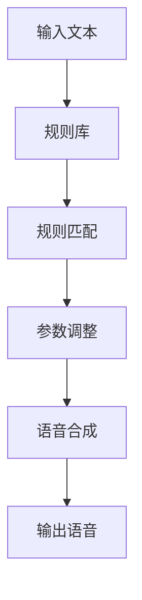
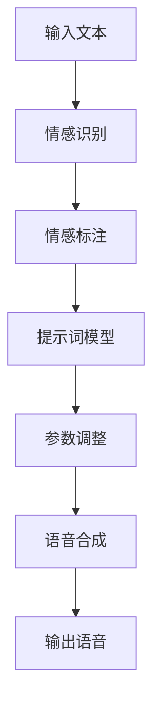
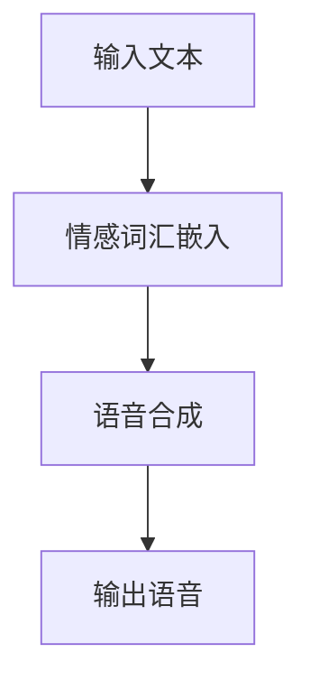
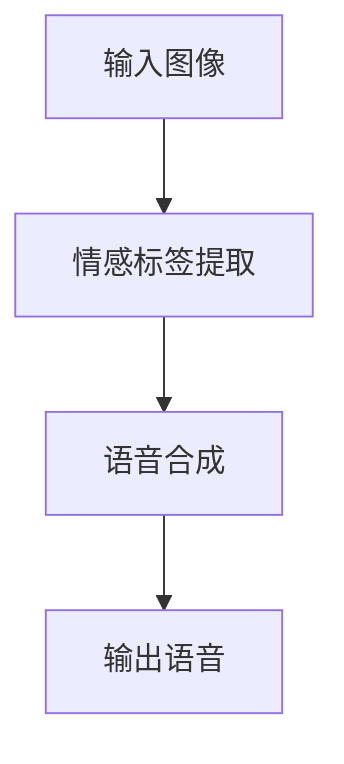
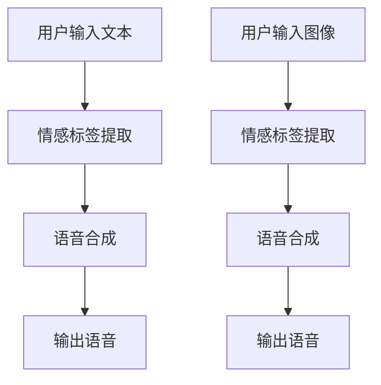
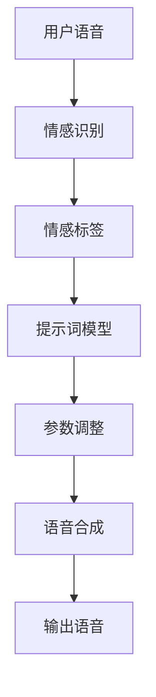
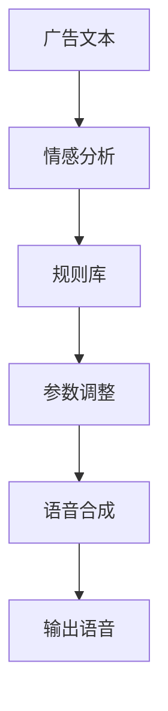
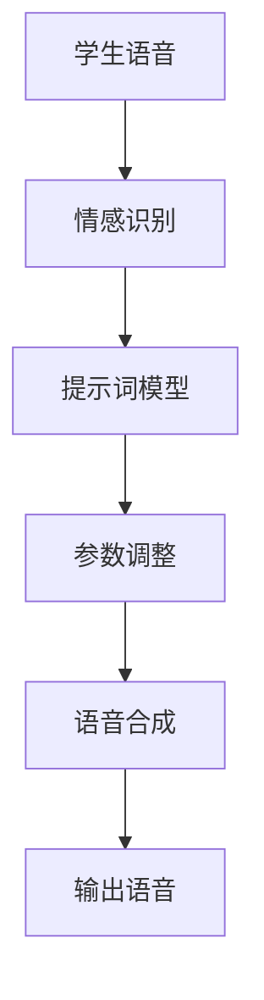

                 

### 文章标题：提示词工程在语音合成情感表达中的应用

> 关键词：提示词工程、语音合成、情感表达、人工智能、机器学习

> 摘要：本文探讨了提示词工程在语音合成情感表达中的应用，从理论基础、设计原则到实现方法，全面解析了提示词工程的关键技术和实际应用，旨在为人工智能领域的语音合成研究者和开发者提供有价值的参考。

---

## 第1章 引言

### 1.1.1 书籍背景和意义

随着人工智能技术的飞速发展，语音合成作为其中的一项关键技术，越来越受到关注。然而，传统的语音合成技术往往缺乏情感表达能力，难以满足用户对个性化、情感化交互的需求。《提示词工程在语音合成情感表达中的应用》这本书旨在探讨如何通过提示词工程来提升语音合成的情感表达效果，具有重要的理论和实际应用价值。

### 1.1.2 主要内容与结构

本书分为四个部分，共七个章节。第一部分介绍了语音合成与情感表达的基础知识，包括语音合成的原理、情感表达的分类与特征提取方法。第二部分详细讲解了提示词工程的理论基础，包括提示词的定义、作用及设计原则。第三部分则针对不同的情感表达需求，介绍了多种提示词工程方法，并通过实例展示了这些方法的实际应用。第四部分探讨了语音合成情感表达中的关键技术，如自适应控制、音色转换等，并提供了相关的实现方案。

### 1.1.3 目标读者与适用范围

本书适用于对人工智能、语音合成等领域有一定了解的技术人员，特别是从事语音合成应用开发的研究人员和工程师。通过阅读本书，读者可以了解提示词工程在语音合成情感表达中的应用，掌握相关技术和方法，为实际项目提供有力支持。

---

## 第2章 语音合成与情感表达基础

### 2.1 语音合成原理

语音合成是将文本信息转化为语音信号的技术，主要分为三个步骤：文本预处理、语音合成引擎和音频后处理。本节将介绍语音合成的基本原理和主要方法。

#### 2.1.1 文本预处理

文本预处理主要包括分词、句法分析和语音编码。分词是将连续的文本序列切分成有意义的词汇单元；句法分析则是理解文本的语法结构，为语音合成提供句法信息；语音编码是将文本信息转化为语音信号的形式。

#### 2.1.2 语音合成引擎

语音合成引擎是语音合成系统的核心，主要负责根据文本信息和语音编码规则生成语音信号。常见的语音合成引擎包括拼接式合成、规则合成和统计合成。拼接式合成通过将预先录制好的语音片段拼接起来生成语音信号；规则合成根据语音合成规则生成语音信号；统计合成则通过大量语音数据训练生成语音信号。

#### 2.1.3 音频后处理

音频后处理主要是对生成的语音信号进行优化，如去噪、增强、音色调整等。这些处理有助于提升语音质量，使其更加自然、流畅。

### 2.2 情感表达分类与特征提取

情感表达是语音合成的关键要素之一，根据情感表达的形式，可以分为语调、语速、音量、音色等。情感表达特征提取是情感识别和情感增强的基础。

#### 2.2.1 语调特征提取

语调是情感表达的重要手段，通过分析语音信号的频率、时长等特征，可以提取出语调变化规律。常用的语调特征包括音高、音长、音强等。

#### 2.2.2 语速特征提取

语速是情感表达的一个重要维度，通过分析语音信号的时长变化，可以提取出语速特征。语速变化可以反映说话者的情绪状态，如兴奋、紧张等。

#### 2.2.3 音量特征提取

音量是情感表达的另一个重要特征，通过分析语音信号的振幅变化，可以提取出音量特征。音量变化可以反映说话者的情感强度，如高兴、愤怒等。

#### 2.2.4 音色特征提取

音色是区分不同声音的主要特征，通过分析语音信号的频谱特征，可以提取出音色特征。音色变化可以反映说话者的情感色彩，如温柔、严厉等。

---

## 第3章 提示词工程理论基础

### 3.1 提示词定义与作用

提示词是在语音合成过程中用来引导情感表达的关键参数，通过调整提示词，可以实现对语音情感的精确控制。提示词的作用主要体现在以下几个方面：

#### 3.1.1 提高情感表达的准确性

提示词可以指导语音合成引擎生成更符合情感需求的语音信号，从而提高情感表达的准确性。

#### 3.1.2 优化情感表达的多样性

通过调整提示词，可以丰富语音合成系统的情感表达，使其在不同场景下表现出不同的情感色彩。

#### 3.1.3 提升用户的交互体验

在语音交互场景中，准确的情感表达可以提升用户的交互体验，增强用户的满意度。

### 3.2 提示词设计原则

设计提示词需要遵循以下原则：

#### 3.2.1 可调性

提示词应具备良好的可调性，以便在语音合成过程中进行实时调整，适应不同的情感需求。

#### 3.2.2 精确性

提示词应能够准确反映情感表达的细微变化，确保情感表达的自然、流畅。

#### 3.2.3 可扩展性

提示词应具备良好的可扩展性，以适应未来情感表达需求的变化。

### 3.3 提示词设计方法

提示词的设计方法主要包括基于规则的提示词设计、基于机器学习的提示词设计等。本节将详细介绍这些方法。

#### 3.3.1 基于规则的提示词设计

基于规则的提示词设计是一种简单有效的提示词设计方法，通过预先定义一系列规则，来指导语音合成引擎生成情感表达。该方法的主要优点是易于实现和调整，但可能缺乏灵活性。

#### 3.3.2 基于机器学习的提示词设计

基于机器学习的提示词设计利用大量语音数据，通过机器学习算法来训练提示词模型。该方法具有较好的泛化能力和灵活性，但可能需要较大的训练数据集。

### 3.4 提示词工程框架

提示词工程框架是提示词设计的整体架构，包括数据预处理、特征提取、模型训练、模型评估等步骤。本节将介绍一个典型的提示词工程框架，并说明每个步骤的作用和实现方法。

#### 3.4.1 数据预处理

数据预处理是提示词工程的第一步，主要包括语音数据的采集、标注和清洗。采集到的语音数据需要经过标注，以便用于后续的特征提取和模型训练。

#### 3.4.2 特征提取

特征提取是将语音信号转化为数值特征的过程，常见的特征包括音高、音长、音强等。特征提取的质量直接影响提示词模型的性能。

#### 3.4.3 模型训练

模型训练是提示词工程的核心步骤，通过机器学习算法，将特征与情感标签进行关联，训练出提示词模型。常见的机器学习算法包括线性回归、支持向量机、神经网络等。

#### 3.4.4 模型评估

模型评估是验证提示词模型性能的重要环节，通过评估指标，如准确率、召回率、F1值等，来判断模型的优劣。评估结果可用于优化模型参数，提高模型性能。

### 3.5 提示词工程在语音合成中的应用

提示词工程在语音合成中的应用主要体现在情感增强和个性化语音交互方面。通过调整提示词，可以实现对语音情感的高效控制，满足不同场景下的情感表达需求。此外，提示词工程还可以结合用户行为数据，实现个性化语音交互，提升用户体验。

---

## 第4章 提示词工程方法

### 4.1 基于规则的提示词工程方法

基于规则的提示词工程方法是一种简单有效的提示词设计方法，通过预先定义一系列规则，来指导语音合成引擎生成情感表达。该方法的主要优点是易于实现和调整，但可能缺乏灵活性。

#### 4.1.1 规则定义

规则定义是提示词工程的关键步骤，根据情感表达的需求，设计一系列规则。这些规则可以是基于语音信号特征的，如音高、音长、音强等；也可以是基于文本语义的，如情感词、语气词等。

#### 4.1.2 规则实现

规则实现是将定义好的规则应用到语音合成系统中，通过条件判断和参数调整，实现情感表达的控制。常见的实现方法包括语音合成引擎的API调用、自定义规则引擎等。

#### 4.1.3 案例分析

以一个简单的情感增强语音合成系统为例，介绍基于规则的提示词工程方法。系统根据输入文本，通过规则判断，调整语音合成引擎的参数，实现情感增强。

### 4.2 基于机器学习的提示词工程方法

基于机器学习的提示词工程方法利用大量语音数据，通过机器学习算法来训练提示词模型。该方法具有较好的泛化能力和灵活性，但可能需要较大的训练数据集。

#### 4.2.1 数据集构建

数据集构建是提示词工程的基础步骤，需要收集大量的语音数据，并进行情感标注。常见的情感标签包括快乐、悲伤、愤怒等。

#### 4.2.2 特征提取

特征提取是将语音信号转化为数值特征的过程，常见的特征包括音高、音长、音强等。特征提取的质量直接影响提示词模型的性能。

#### 4.2.3 模型训练

模型训练是提示词工程的核心步骤，通过机器学习算法，将特征与情感标签进行关联，训练出提示词模型。常见的机器学习算法包括线性回归、支持向量机、神经网络等。

#### 4.2.4 模型评估

模型评估是验证提示词模型性能的重要环节，通过评估指标，如准确率、召回率、F1值等，来判断模型的优劣。评估结果可用于优化模型参数，提高模型性能。

#### 4.2.5 案例分析

以一个情感识别语音合成系统为例，介绍基于机器学习的提示词工程方法。系统首先通过情感识别模块，对输入文本进行情感标注，然后通过提示词模型，调整语音合成引擎的参数，实现情感增强。

### 4.3 结合多模态数据的提示词工程方法

多模态数据融合是提升提示词工程效果的一种有效手段，通过结合文本、语音和视觉等多模态数据，可以实现更精准的情感表达。

#### 4.3.1 文本与语音融合

文本与语音融合可以通过语音合成系统的API，将文本信息和语音信号进行融合。例如，在文本中嵌入情感词汇和语气词，通过语音合成引擎生成语音信号。

#### 4.3.2 视觉与语音融合

视觉与语音融合可以通过图像识别和语音合成技术，将视觉信息和语音信号进行融合。例如，通过图像识别技术，提取图像的情感标签，然后通过语音合成引擎生成语音信号。

### 4.4 案例分析

以一个智能客服系统为例，介绍结合多模态数据的提示词工程方法。系统首先通过图像识别技术，提取用户表情的情感标签，然后通过语音合成引擎，结合文本信息，生成具有情感表达的语音回复。

---

## 第5章 提示词工程在语音合成情感表达中的应用

### 5.1 自适应控制

自适应控制是一种根据用户反馈实时调整语音合成参数的方法，以实现更好的情感表达效果。通过自适应控制，语音合成系统可以更好地适应不同用户、不同场景的情感需求。

#### 5.1.1 工作原理

自适应控制的核心是反馈机制，系统通过监测用户的交互行为和情感反馈，实时调整语音合成参数。例如，当用户表现出不满情绪时，系统可以降低语速、降低音量，以缓解用户的不适。

#### 5.1.2 实现方法

自适应控制的实现方法主要包括以下几种：

1. **用户行为分析**：通过分析用户的点击、浏览等行为，预测用户的情感状态，从而调整语音合成参数。

2. **情感反馈收集**：通过用户问卷调查、语音交互记录等方式，收集用户的情感反馈，用于优化语音合成参数。

3. **实时调整**：在语音合成过程中，根据用户反馈，实时调整语音合成参数，如语调、语速、音量等。

#### 5.1.3 案例分析

以一个智能客服系统为例，介绍自适应控制在语音合成情感表达中的应用。系统根据用户的反馈，如满意度评分、点击行为等，实时调整语音合成参数，以提升用户的满意度。

### 5.2 音色转换

音色转换是一种将语音信号从一种音色转换为另一种音色的技术，常用于实现语音合成的个性化效果。通过音色转换，语音合成系统可以生成具有不同音色的语音信号，满足不同用户的需求。

#### 5.2.1 工作原理

音色转换的核心是音色特征提取和转换，通过提取源语音信号的音色特征，并将其转换为目标语音信号的音色特征，实现音色转换。

1. **音色特征提取**：通过分析语音信号的频谱特征，提取出音色特征。

2. **音色特征转换**：通过机器学习算法，将源语音信号的音色特征转换为目标语音信号的音色特征。

#### 5.2.2 实现方法

音色转换的实现方法主要包括以下几种：

1. **频谱变换**：通过对语音信号的频谱进行变换，实现音色转换。

2. **神经网络**：通过训练神经网络模型，实现音色特征转换。

3. **深度学习**：利用深度学习算法，如卷积神经网络（CNN）和生成对抗网络（GAN），实现音色转换。

#### 5.2.3 案例分析

以一个个性化语音助手为例，介绍音色转换在语音合成情感表达中的应用。用户可以根据自己的喜好，选择不同的音色，语音助手会根据用户的选择，生成具有相应音色的语音信号。

### 5.3 情感增强

情感增强是一种通过调整语音合成参数，增强语音信号情感表达的技术。通过情感增强，语音合成系统可以生成更富有情感色彩的语音信号，提升用户体验。

#### 5.3.1 工作原理

情感增强的核心是情感特征提取和增强，通过提取输入文本的情感特征，并调整语音合成参数，实现情感增强。

1. **情感特征提取**：通过分析输入文本的语义和情感词汇，提取出情感特征。

2. **情感特征增强**：通过调整语音合成参数，如语调、语速、音量等，实现情感增强。

#### 5.3.2 实现方法

情感增强的实现方法主要包括以下几种：

1. **规则调整**：通过设计一系列规则，调整语音合成参数，实现情感增强。

2. **机器学习**：通过训练机器学习模型，将情感特征与语音合成参数关联，实现情感增强。

3. **深度学习**：利用深度学习算法，如循环神经网络（RNN）和长短时记忆网络（LSTM），实现情感增强。

#### 5.3.3 案例分析

以一个智能语音聊天机器人为例，介绍情感增强在语音合成情感表达中的应用。系统根据用户输入的文本，分析情感特征，并调整语音合成参数，生成富有情感色彩的语音回复。

### 5.4 情感识别

情感识别是一种通过分析语音信号，识别出其中蕴含的情感的技术。通过情感识别，语音合成系统可以更好地理解用户的情感需求，实现更精准的情感表达。

#### 5.4.1 工作原理

情感识别的核心是情感特征提取和分类，通过分析语音信号的频谱特征、时长特征等，提取出情感特征，并使用分类算法进行情感识别。

1. **情感特征提取**：通过分析语音信号的时频特征、时长特征等，提取出情感特征。

2. **情感分类**：使用分类算法，如支持向量机（SVM）、决策树等，对情感特征进行分类，识别出情感标签。

#### 5.4.2 实现方法

情感识别的实现方法主要包括以下几种：

1. **传统机器学习**：使用传统机器学习算法，如支持向量机（SVM）、决策树等，进行情感识别。

2. **深度学习**：利用深度学习算法，如卷积神经网络（CNN）、循环神经网络（RNN）等，进行情感识别。

#### 5.4.3 案例分析

以一个智能客服系统为例，介绍情感识别在语音合成情感表达中的应用。系统通过分析用户语音信号，识别出用户情感，并调整语音合成参数，实现更符合用户情感需求的语音回复。

---

## 第6章 实际应用案例

### 6.1 智能语音助手

智能语音助手是提示词工程在语音合成情感表达中的典型应用场景。通过提示词工程，智能语音助手可以实现个性化的语音交互，提升用户体验。

#### 6.1.1 应用场景

智能语音助手广泛应用于智能家居、智能客服、智能驾驶等领域。在这些场景中，语音助手需要根据用户的指令和情感需求，生成相应的语音回复。

#### 6.1.2 实现方法

智能语音助手采用基于机器学习的提示词工程方法，结合情感识别和情感增强技术。系统首先通过情感识别模块，识别出用户语音中的情感特征，然后通过提示词模型，调整语音合成参数，实现情感增强。

#### 6.1.3 案例分析

以一个智能家居语音助手为例，介绍提示词工程在智能语音助手中的应用。系统通过情感识别模块，识别出用户的情感状态，如愉快、愤怒等，然后通过提示词模型，调整语音合成参数，实现情感增强，生成具有相应情感的语音回复。

### 6.2 情感化语音广告

情感化语音广告是一种通过提示词工程，实现更具吸引力的语音广告的技术。通过情感化语音广告，企业可以更好地传递产品信息和品牌理念，提升广告效果。

#### 6.2.1 应用场景

情感化语音广告广泛应用于电视广告、网络广告、广播广告等领域。在这些场景中，广告需要根据不同的情感需求，生成相应的语音广告。

#### 6.2.2 实现方法

情感化语音广告采用基于规则的提示词工程方法和基于机器学习的提示词工程方法。系统首先通过情感分析，确定广告的情感目标，然后通过提示词模型，调整语音合成参数，实现情感表达。

#### 6.2.3 案例分析

以一个电视广告为例，介绍提示词工程在情感化语音广告中的应用。系统通过情感分析，确定广告的情感目标为愉快、兴奋等，然后通过提示词模型，调整语音合成参数，实现情感增强，生成具有相应情感的语音广告。

### 6.3 教育领域的情感化语音教学

情感化语音教学是一种通过提示词工程，实现更具吸引力和互动性的语音教学的技术。通过情感化语音教学，教师可以更好地激发学生的学习兴趣和情感共鸣。

#### 6.3.1 应用场景

情感化语音教学广泛应用于在线教育、远程教育、课堂教育等领域。在这些场景中，教师需要根据学生的情感需求，生成相应的语音教学内容。

#### 6.3.2 实现方法

情感化语音教学采用基于机器学习的提示词工程方法和基于多模态数据融合的方法。系统首先通过情感识别模块，识别出学生的情感状态，然后通过提示词模型，调整语音合成参数，实现情感增强。

#### 6.3.3 案例分析

以一个在线教育平台为例，介绍提示词工程在情感化语音教学中的应用。系统通过情感识别模块，识别出学生的情感状态，如快乐、焦虑等，然后通过提示词模型，调整语音合成参数，实现情感增强，生成具有相应情感的语音教学内容。

---

## 第7章 总结与展望

### 7.1 总结

本文围绕提示词工程在语音合成情感表达中的应用，系统地介绍了语音合成与情感表达基础、提示词工程理论基础、提示词工程方法、实际应用案例等内容。通过本文的阐述，读者可以全面了解提示词工程在语音合成领域的应用价值和技术原理。

### 7.2 展望

随着人工智能技术的不断发展和应用，提示词工程在语音合成情感表达中的应用将更加广泛。未来，我们将看到更多创新的提示词工程方法和应用场景的出现，为人工智能领域的发展带来新的机遇和挑战。以下是一些可能的展望：

1. **多模态情感识别与表达**：结合文本、语音、图像等多模态数据，实现更精准、更自然的情感识别与表达。

2. **个性化情感交互**：通过深度学习等算法，实现基于用户行为和情感数据的个性化情感交互，提升用户体验。

3. **情感增强与语音生成**：研究更多高效、实用的情感增强方法，实现具有高度情感色彩的语音生成技术。

4. **跨领域应用**：将提示词工程应用于更多的领域，如医疗、金融、法律等，实现更广泛的应用价值。

### 7.3 注意事项与拓展阅读

在研究和应用提示词工程时，需要注意以下几点：

1. **数据质量**：高质量的情感数据是提示词工程的基础，需要注重数据采集和标注的质量。

2. **模型优化**：针对不同的应用场景，不断优化提示词模型，提高情感表达的准确性和自然度。

3. **用户隐私**：在应用提示词工程时，要关注用户隐私保护，避免泄露用户个人信息。

拓展阅读：

1. 《语音合成技术与应用》

2. 《情感计算：技术、方法与应用》

3. 《人工智能语音交互设计》

---

## 作者信息

作者：AI天才研究院/AI Genius Institute & 禅与计算机程序设计艺术 /Zen And The Art of Computer Programming

感谢您阅读本文，希望对您在语音合成情感表达领域的研究和应用有所帮助。如果您有任何问题或建议，欢迎随时与我们联系。祝您在人工智能领域取得丰硕的成果！

