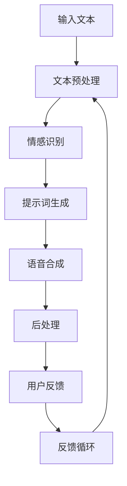

                 

### 文章标题

《提示词工程在语音情感合成中的应用》

### 关键词

- 提示词工程
- 语音情感合成
- 自然语言处理
- 语音合成技术
- 情感表达
- 智能应用

### 摘要

本文旨在深入探讨提示词工程在语音情感合成领域的应用，解析其核心概念、技术原理及实现方法。通过介绍提示词工程的基础知识，语音情感合成的核心概念和技术，以及提示词工程与语音情感合成之间的关系，本文为读者提供了一个系统且全面的理解框架。此外，通过实际案例分析和未来发展趋势的展望，本文旨在为相关领域的研究和应用提供有益的启示。

## 引言

### 提示词工程的概念

提示词工程是一种结合自然语言处理（NLP）和语音合成技术的跨领域工程，其核心在于通过生成或优化提示词（prompt words）来引导语音情感合成的过程。提示词工程的目标是使得生成的语音不仅准确传达文本内容，还能表达出适当的情感色彩。这一过程涉及文本分析、情感识别、语音合成等多个技术环节，对提高语音合成的情感表现力和用户满意度具有重要意义。

### 语音情感合成的概念

语音情感合成是指通过计算机技术生成带有特定情感色彩的语音，使其在听觉上能够引起听者相应的情感反应。情感合成不仅关注语音的音调、语速等基本属性，更注重情感内容的传达，如快乐、悲伤、愤怒等。语音情感合成在交互式语音服务、娱乐、教育等领域具有广泛的应用前景。

### 提示词工程在语音情感合成中的应用

提示词工程在语音情感合成中的应用主要表现在以下几个方面：

1. **情感识别与分类**：通过分析输入文本，识别其中蕴含的情感信息，为语音合成提供情感标签。
2. **提示词生成**：根据情感标签，生成能够引导情感表达的提示词，如情感词汇、短语等。
3. **语音优化**：根据提示词，调整语音的音调、节奏等参数，使其更符合情感表达的需求。
4. **反馈循环**：通过用户反馈，不断优化提示词和语音合成的效果，提高情感表达的准确性和自然性。

### 全书结构

本书将按照以下结构展开：

1. **引入和概述**：介绍提示词工程和语音情感合成的概念及全书结构。
2. **提示词工程基础**：详细阐述提示词工程的定义、应用背景及基本技术。
3. **语音情感合成的核心概念**：探讨语音情感合成的定义、相关技术和实现方法。
4. **提示词工程与语音情感合成的关系**：分析提示词工程在语音情感合成中的作用和关键挑战。
5. **提示词工程实现方法**：介绍提示词生成技术和优化策略。
6. **实际应用案例分析**：通过具体应用场景和案例分析，展示提示词工程在实际项目中的应用效果。
7. **未来的发展趋势**：展望提示词工程和语音情感合成的未来发展。
8. **总结与展望**：对全书内容进行总结，并对未来研究提出展望。

通过上述结构，本书旨在为读者提供一个全面、系统的提示词工程在语音情感合成中的应用指南，帮助读者深入理解和掌握这一领域的关键技术。

## 提示词工程基础

### 提示词工程的定义

提示词工程是一种结合自然语言处理（NLP）和语音合成技术的跨领域工程，其核心在于通过生成或优化提示词（prompt words）来引导语音情感合成的过程。提示词工程的目标是使得生成的语音不仅准确传达文本内容，还能表达出适当的情感色彩。

在自然语言处理领域，提示词通常用于引导模型生成文本或摘要。而在语音合成领域，提示词则扮演着类似的角色，但需要更精细地调整以适应情感表达的需求。例如，在生成带有喜悦情感的语音时，提示词可能包括“高兴”、“快乐”、“欢乐”等词汇，而在生成悲伤情感的语音时，提示词则可能包含“悲伤”、“难过”、“痛心”等词汇。

### 提示词工程的应用背景

提示词工程在语音情感合成中的应用背景主要源于对高质量、自然互动语音需求的不断增加。随着人工智能技术的快速发展，语音合成技术已经取得了显著进步，但传统的语音合成方法在情感表达方面仍存在一定的局限性。具体来说，传统语音合成技术往往仅关注语音的音调、语速等基本属性，而较少考虑情感内容的传达。这使得生成的语音在听觉上虽然准确，但往往缺乏情感共鸣。

为了解决这一问题，提示词工程应运而生。通过生成或优化能够引导情感表达的提示词，提示词工程能够有效地提升语音合成的情感表现力，使得生成的语音更贴近人类自然的表达方式。这种技术不仅能够提高用户的交互体验，还能在娱乐、教育、医疗等多个领域发挥重要作用。

### 提示词工程在语音情感合成中的应用

在语音情感合成中，提示词工程的应用主要包括以下几个方面：

1. **情感识别与分类**：首先，通过情感识别技术，对输入文本进行情感分析，识别出其中蕴含的情感信息。常见的情感分类包括正面情感（如喜悦、兴奋）、负面情感（如悲伤、愤怒）和中性情感。情感识别的准确性和全面性对于后续的提示词生成和优化至关重要。

2. **提示词生成**：在情感识别的基础上，根据情感标签生成相应的提示词。例如，对于识别出的喜悦情感，可以生成“欢乐”、“高兴”、“快乐”等提示词；对于悲伤情感，可以生成“悲伤”、“难过”、“痛心”等提示词。提示词的生成不仅需要考虑情感标签，还需要结合上下文语境，以确保生成的提示词既符合情感标签，又能与文本内容保持一致。

3. **语音优化**：生成提示词后，根据提示词调整语音的音调、节奏等参数，使其更符合情感表达的需求。例如，对于喜悦情感，可以适当提高音调，增加节奏感；对于悲伤情感，可以降低音调，放缓节奏。此外，语音优化还可以包括对语音音色的调整，以使其更贴近人类自然的情感表达方式。

4. **反馈循环**：在生成和优化语音的过程中，通过用户反馈不断调整提示词和语音合成的效果，以提高情感表达的准确性和自然性。用户反馈可以是显式的，如用户对语音情感的满意度评分，也可以是隐式的，如用户在特定情境下的行为分析。通过分析用户反馈，可以进一步优化提示词和语音合成的策略，提高系统的自适应能力。

### 提示词工程的基本技术

提示词工程涉及多种技术，主要包括自然语言处理技术、语音合成技术以及情感识别与分类技术。以下是这些技术的基本概念和原理：

1. **自然语言处理技术**：自然语言处理（NLP）是人工智能的一个重要分支，旨在使计算机能够理解和处理人类语言。在提示词工程中，NLP技术主要用于情感分析和文本生成。情感分析是指通过算法分析文本中的情感倾向，识别出文本的情感色彩。文本生成则是指根据给定的输入文本，生成与之相关的文本摘要、问答或续写等内容。

2. **语音合成技术**：语音合成技术（Text-to-Speech, TTS）是指将文本转化为自然语音的技术。常见的语音合成方法包括规则基方法、统计基方法和端对端深度学习方法。规则基方法通过预定义的语音合成规则生成语音，统计基方法则通过统计语言模型和发音模型生成语音，而端对端深度学习方法则通过深度神经网络直接将文本转化为语音信号。

3. **情感识别与分类技术**：情感识别与分类技术是指通过算法分析语音或文本中的情感信息，并将其分类为不同的情感类别。情感识别技术通常基于情感词典、情感分析模型和情感分类算法。情感词典是一种包含情感标签和对应词汇的资源库，情感分析模型则通过机器学习算法从文本中提取情感特征，情感分类算法则用于对情感特征进行分类。

### 提示词工程的实现步骤

提示词工程的实现通常包括以下几个步骤：

1. **情感识别**：首先，对输入文本进行情感识别，确定其情感标签。常用的情感识别方法包括基于词典的方法、基于规则的方法和基于机器学习的方法。

2. **提示词生成**：根据情感标签生成相应的提示词。提示词生成方法可以基于规则，如从情感词典中选取合适的词汇；也可以基于数据，如从大量带有情感标注的语料库中提取提示词。

3. **语音优化**：根据生成的提示词调整语音的音调、节奏等参数，使其更符合情感表达的需求。语音优化方法可以基于规则，如调整音调的振幅和频率；也可以基于数据，如通过深度学习模型对语音信号进行动态调整。

4. **反馈循环**：收集用户反馈，如对语音情感的满意度评分或用户行为分析，用于进一步优化提示词和语音合成的效果。反馈循环可以采用在线学习或离线学习的方法，以不断提高系统的自适应能力和情感表达能力。

通过以上步骤，提示词工程能够有效地提升语音情感合成的质量和用户体验。在实际应用中，提示词工程可以根据具体需求进行调整和优化，以实现更好的情感表达效果。

### 提示词工程的优势和挑战

#### 优势

1. **提高情感表达的自然性和准确性**：通过生成和优化提示词，提示词工程能够更精准地表达情感，提高语音合成的自然性和用户体验。

2. **增强交互式语音服务的质量**：在智能客服、语音助手等应用场景中，提示词工程能够提供更贴近人类表达方式的语音服务，提升用户的满意度。

3. **拓展语音合成技术的应用领域**：提示词工程的应用使得语音合成技术能够在更多领域发挥作用，如教育、娱乐、医疗等。

#### 挑战

1. **情感识别的准确性**：情感识别的准确性直接影响到提示词的生成效果。在复杂语境和模糊情感表达中，准确识别情感仍然是一个挑战。

2. **提示词生成的多样性**：为了适应不同情感和情境，提示词需要具备多样性。然而，生成丰富多样的提示词并非易事，尤其是在大规模数据集上训练模型时。

3. **语音优化的复杂性**：语音优化需要结合情感信息和语音参数，进行精细调整。这要求模型具备强大的表达能力和计算能力。

4. **用户反馈的处理**：用户反馈的处理需要高效且准确的算法，以快速适应用户需求，提高系统的自适应能力。

通过深入了解提示词工程的基础知识，读者可以为后续章节的学习打下坚实的基础，进一步探索语音情感合成的核心技术及其应用。

### 语音情感合成的核心概念

#### 语音情感合成的定义

语音情感合成（Voice Emotional Synthesis）是指通过计算机技术生成带有特定情感色彩的语音，使其在听觉上能够引起听者相应的情感反应。语音情感合成的核心在于模拟人类情感表达，使生成的语音不仅准确传达文本内容，还能表达出相应的情感，如快乐、悲伤、愤怒等。这种技术不仅在娱乐和游戏领域有广泛应用，还在教育、医疗和智能客服等场景中发挥着重要作用。

#### 语音情感合成的相关技术

语音情感合成涉及多个技术环节，包括文本处理、情感识别、语音合成和后处理等。以下是这些技术的基本概念和原理：

1. **文本处理**：文本处理是指对输入文本进行预处理，包括分词、词性标注、实体识别等操作。这些操作有助于提取文本中的重要信息，为后续的情感分析和语音合成提供基础。

2. **情感识别**：情感识别（Sentiment Analysis）是通过算法分析文本中的情感倾向，识别出文本的情感色彩。情感识别通常分为正面情感、负面情感和中性情感三个类别。情感识别的准确性直接影响语音情感合成的效果。

3. **语音合成**：语音合成（Text-to-Speech, TTS）是指将文本转化为自然语音的技术。常见的语音合成方法包括规则基方法、统计基方法和端对端深度学习方法。这些方法通过将文本转化为语音信号，实现语音情感合成的最终目标。

4. **后处理**：后处理是指对合成的语音进行进一步优化，以增强其情感表现力。后处理技术包括语音参数调整、情感增强和音频编辑等。这些技术能够使合成的语音更自然、更具情感共鸣。

#### 情感表达的实现

情感表达在语音情感合成中至关重要，其实现方法主要包括以下几方面：

1. **音调调整**：通过改变音调的振幅和频率，可以使语音表达出不同的情感。例如，提高音调可以表达喜悦，降低音调可以表达悲伤。

2. **节奏变化**：通过调整语音的节奏，可以使语音表达出不同的情感。例如，加快节奏可以表达兴奋，减慢节奏可以表达沉稳。

3. **语音音色**：通过改变语音的音色，可以使语音表达出不同的情感。例如，柔和的音色可以表达温暖，尖锐的音色可以表达愤怒。

4. **情感词汇选择**：选择具有特定情感色彩的词汇，可以使语音直接传达情感。例如，使用“高兴”、“快乐”等词汇可以表达喜悦，使用“悲伤”、“难过”等词汇可以表达悲伤。

#### 语音情感合成的工作流程

语音情感合成的工作流程通常包括以下步骤：

1. **文本预处理**：对输入文本进行分词、词性标注等处理，提取文本中的重要信息。

2. **情感识别**：通过情感识别技术，对预处理后的文本进行情感分析，确定文本的情感标签。

3. **提示词生成**：根据情感标签，生成能够引导情感表达的提示词。提示词可以是情感词汇、短语或整个句子。

4. **语音合成**：根据生成的提示词，使用语音合成技术生成语音信号。

5. **后处理**：对合成的语音进行音调、节奏、音色等调整，以增强其情感表现力。

6. **反馈循环**：收集用户反馈，如对语音情感的满意度评分或用户行为分析，用于进一步优化语音情感合成的效果。

通过上述流程，语音情感合成能够生成具有情感色彩的语音，满足不同应用场景的需求。在实际应用中，语音情感合成技术可以根据具体场景和需求进行调整和优化，以提高情感表达的准确性和自然性。

### 提示词工程与语音情感合成的关系

#### 提示词工程在语音情感合成中的作用

提示词工程在语音情感合成中扮演着至关重要的角色，其核心作用主要体现在以下几个方面：

1. **情感引导**：提示词工程通过生成与情感标签相对应的提示词，引导语音合成系统在合成过程中传达特定的情感色彩。例如，当文本情感标签为“喜悦”时，提示词可以是“高兴”、“欢乐”等词汇；当文本情感标签为“悲伤”时，提示词则可以是“悲伤”、“难过”等词汇。通过这种方式，提示词工程能够确保合成的语音在情感表达上与输入文本保持一致。

2. **情感增强**：提示词工程通过优化语音参数，如音调、节奏和音色等，增强语音的情感表现力。例如，对于喜悦情感，可以通过提高音调、加快节奏和采用明亮音色来增强情感的表达；对于悲伤情感，则可以通过降低音调、放缓节奏和使用柔和音色来增强情感的表达。通过这些调整，提示词工程能够使合成的语音更自然、更具有感染力。

3. **情感适应性**：提示词工程通过收集用户反馈，如情感满意度评分或用户行为分析，不断优化提示词和语音合成的效果，提高系统的情感适应性。例如，如果用户对某种情感表达的满意度较低，提示词工程可以调整提示词或语音参数，以找到更合适的情感表达方式。通过这种自适应优化，提示词工程能够使语音情感合成系统更加智能、更符合用户需求。

#### 提示词工程的关键挑战

尽管提示词工程在语音情感合成中具有重要作用，但其实现过程也面临诸多挑战：

1. **情感识别的准确性**：情感识别是提示词工程的核心环节之一，其准确性能直接影响到提示词生成的质量。然而，情感识别在复杂语境和模糊情感表达中仍然存在一定的难度。例如，同一句话在不同情境下可能表达出不同的情感，这需要情感识别模型具备较高的泛化能力和复杂性。

2. **提示词生成的多样性**：为了满足不同情感和情境的需求，提示词需要具备多样性。然而，生成丰富多样的提示词并非易事。一方面，提示词的生成需要依赖大规模的情感标注语料库；另一方面，提示词的生成算法需要能够从大量数据中提取具有情感代表性的词汇和短语。

3. **语音优化的复杂性**：语音优化需要结合情感信息和语音参数进行精细调整，这要求语音合成模型具备强大的表达能力和计算能力。例如，音调、节奏和音色的调整不仅需要考虑情感标签，还需要考虑上下文语境和语音自然流畅度。

4. **用户反馈的处理**：用户反馈是提示词工程优化的重要依据，但处理用户反馈也面临挑战。一方面，用户反馈可能存在延迟性和不准确性；另一方面，用户反馈的数据量庞大，需要高效且准确的算法来分析处理。

#### 提示词工程与语音情感合成的相互关系架构

为了更清晰地理解提示词工程与语音情感合成的关系，可以使用Mermaid流程图来展示其相互关系和实现步骤。以下是一个简化的Mermaid流程图：



在这个流程图中，输入文本经过文本预处理后进入情感识别环节，情感识别的结果用于生成提示词。生成的提示词再用于语音合成，合成的语音经过后处理以增强情感表现力。用户对合成语音的反馈进入反馈循环，用于进一步优化提示词和语音合成的效果。

通过这种相互关系架构，我们可以看到提示词工程与语音情感合成在各个环节中的紧密联系，以及它们共同作用实现高质量语音情感合成的过程。

### 提示词工程实现方法

#### 提示词生成技术

提示词生成是提示词工程中的核心步骤，其目的是根据输入文本的情感标签生成相应的提示词，以引导情感表达。提示词生成技术可以分为基于规则的方法和基于数据的方法。

##### 基于规则的方法

基于规则的方法是通过预定义的规则库来生成提示词。这种方法的主要优点是实现简单、效率高，但缺点是灵活性差，难以适应复杂的情感表达。

**基本原理**：
1. **情感词典**：创建一个包含情感标签和对应提示词的词典。例如，对于喜悦情感，词典中可能包含“高兴”、“欢乐”、“开心”等词汇。
2. **规则库**：根据情感标签和上下文，从情感词典中选择合适的提示词。例如，如果文本中包含“成功”一词，且情感标签为“喜悦”，则可以选择“喜悦”、“高兴”等作为提示词。

**伪代码示例**：
```python
def generate_prompt_word(text, emotion):
    emotion_dict = {
        "joy": ["高兴", "欢乐", "开心"],
        "sadness": ["悲伤", "难过", "痛心"],
        "anger": ["愤怒", "恼怒", "烦躁"]
    }
    
    context = extract_context(text)
    if context in ["成功", "胜利"]:
        return emotion_dict[emotion][0]
    else:
        return random.choice(emotion_dict[emotion])
```

##### 基于数据的方法

基于数据的方法是通过机器学习模型从大规模语料库中学习生成提示词。这种方法的主要优点是灵活性强、适应性强，但实现复杂度较高。

**基本原理**：
1. **情感标注语料库**：收集大量带有情感标注的语料库，用于训练提示词生成模型。
2. **机器学习模型**：使用情感标注语料库训练机器学习模型，如循环神经网络（RNN）、变换器（Transformer）等。模型能够根据输入文本和情感标签自动生成提示词。

**伪代码示例**：
```python
from transformers import pipeline

def generate_prompt_word(text, emotion):
    prompt_generator = pipeline("text-generation", model="gpt2")

    prompt = f"{text}，情感为{emotion}。请生成相应的提示词："
    generated_words = prompt_generator(prompt, max_length=10)
    return generated_words[0]
```

#### 提示词优化策略

提示词优化的目的是提高提示词生成和语音合成的质量和自然性。提示词优化策略主要包括以下几个方面：

##### 提示词预训练

提示词预训练是指使用大规模无标注数据对提示词生成模型进行预训练，以提高模型的泛化能力和情感表达能力。

**基本原理**：
1. **大规模数据集**：收集包含多种情感和语境的文本数据集。
2. **预训练模型**：使用预训练模型（如GPT-2、BERT等）对提示词生成模型进行预训练。
3. **微调**：在预训练的基础上，使用带有情感标注的数据集对模型进行微调，以适应具体的情感合成任务。

**伪代码示例**：
```python
from transformers import TrainingArguments, Trainer

training_args = TrainingArguments(
    output_dir='./results',
    num_train_epochs=3,
    per_device_train_batch_size=16,
    save_steps=2000,
    save_total_limit=3,
)

trainer = Trainer(
    model=model,
    args=training_args,
    train_dataset=train_dataset,
    eval_dataset=eval_dataset,
)

trainer.train()
```

##### 提示词多样性策略

提示词多样性策略旨在生成具有多样性的提示词，以满足不同情感和情境的需求。

**基本原理**：
1. **词汇扩展**：通过同义词替换、短语扩展等方式，增加提示词的多样性。
2. **情感融合**：将不同情感特征的提示词进行融合，生成具有混合情感的提示词。
3. **上下文关联**：结合上下文信息，生成与情感标签和文本内容一致的提示词。

**伪代码示例**：
```python
def generate_diverse_prompt_word(text, emotion):
    synonyms = get_synonyms(emotion)
    context = extract_context(text)
    
    # 同义词替换
    for word in synonyms:
        if word in text:
            text = text.replace(word, random.choice(synonyms))
    
    # 上下文关联
    fused_prompt = f"{text}，同时感受{emotion}的情感。"
    return fused_prompt
```

##### 提示词适应性优化

提示词适应性优化是指根据用户反馈和实际应用场景，动态调整提示词生成策略，提高情感表达的准确性和自然性。

**基本原理**：
1. **用户反馈**：收集用户对语音情感的满意度评分或行为分析数据。
2. **自适应调整**：根据用户反馈，调整提示词生成策略，如增加或删除特定类型的提示词。
3. **在线学习**：使用在线学习算法，实时更新和优化提示词生成模型。

**伪代码示例**：
```python
def adapt_prompt_word(prompt, user_feedback):
    if user_feedback["satisfaction"] < threshold:
        # 减少特定情感提示词的生成
        adjusted_prompt = remove_specific_prompt_words(prompt, emotion="sadness")
    else:
        # 增加特定情感提示词的生成
        adjusted_prompt = add_specific_prompt_words(prompt, emotion="joy")
    return adjusted_prompt
```

通过这些提示词生成技术和优化策略，提示词工程能够有效地提高语音情感合成的质量和自然性，满足不同应用场景的需求。

### 实际应用案例分析

#### 案例一：智能客服系统

智能客服系统是一种利用人工智能技术实现自动回答用户问题的系统。在智能客服系统中，语音情感合成技术被广泛应用于提高用户的交互体验。以下是一个关于智能客服系统中语音情感合成的应用案例。

**系统架构**

智能客服系统的架构通常包括以下几个部分：

1. **文本解析模块**：负责解析用户的输入文本，提取关键信息，如问题类型、情感色彩等。
2. **情感识别模块**：通过情感识别技术，对解析后的文本进行情感分析，确定其情感标签。
3. **提示词生成模块**：根据情感识别结果，生成相应的提示词，以引导语音合成系统的情感表达。
4. **语音合成模块**：根据生成的提示词，使用语音合成技术生成自然流畅的语音。
5. **用户反馈模块**：收集用户对语音情感的满意度评分或行为分析数据，用于进一步优化系统。

**实现细节**

1. **文本解析模块**：采用自然语言处理技术，如词性标注和命名实体识别，从用户输入中提取关键信息。例如，如果一个用户询问“最近天气怎么样？”，文本解析模块可以提取出“天气”和“最近”两个关键词。

2. **情感识别模块**：使用基于深度学习的情感识别模型，如Bert，对解析后的文本进行情感分析。模型训练数据集通常包含大量带有情感标注的语料，以训练模型识别不同情感标签的能力。

3. **提示词生成模块**：根据情感识别结果，生成相应的提示词。例如，如果情感标签为“喜悦”，提示词可以是“很高兴听到您这样说”；如果情感标签为“愤怒”，提示词可以是“我理解您的情绪，我会尽力解决问题”。

4. **语音合成模块**：使用基于深度神经网络的语音合成技术，如WaveNet或Tacotron，将生成的提示词转化为自然流畅的语音。这些模型通常经过大量语音数据的训练，以生成高质量的语音。

5. **用户反馈模块**：通过用户满意度评分或行为分析，收集用户对语音情感的反馈。这些反馈数据用于进一步优化提示词生成和语音合成策略。

**代码实现**

以下是智能客服系统中提示词生成和语音合成的部分代码实现：

```python
from transformers import pipeline

# 情感识别模型
emotion_recognizer = pipeline("sentiment-analysis")

# 提示词生成模型
prompt_generator = pipeline("text-generation", model="gpt2")

# 用户输入
user_input = "最近天气怎么样？"

# 情感识别
emotion = emotion_recognizer(user_input)[0]

# 提示词生成
if emotion == "joy":
    prompt = "很高兴听到您这样说"
elif emotion == "anger":
    prompt = "我理解您的情绪，我会尽力解决问题"
else:
    prompt = "谢谢您的提问"

# 语音合成
speech = prompt_generator(prompt, max_length=100)[0]

# 输出语音
print(speech)
```

**应用效果分析**

智能客服系统通过语音情感合成技术，能够根据用户输入文本的情感标签生成相应的提示词，提高语音服务的自然性和用户满意度。在实际应用中，用户对智能客服系统的反馈显示，语音情感合成的应用显著提升了用户的交互体验，使得用户感觉更加亲切和舒适。

#### 案例二：语音助手

语音助手是现代智能设备中广泛应用的一种技术，通过语音交互为用户提供便捷的服务。以下是一个关于语音助手在语音情感合成中的应用案例。

**系统架构**

语音助手的架构通常包括以下几个部分：

1. **语音识别模块**：负责将用户的语音输入转化为文本。
2. **自然语言处理模块**：对转化后的文本进行解析，提取出关键信息。
3. **情感识别模块**：通过情感识别技术，分析文本的情感色彩。
4. **提示词生成模块**：根据情感识别结果，生成相应的提示词。
5. **语音合成模块**：将提示词转化为自然流畅的语音。
6. **用户反馈模块**：收集用户对语音情感的满意度评分或行为分析数据。

**实现细节**

1. **语音识别模块**：采用深度神经网络模型，如深度神经网络声学模型（DNN ASR）和循环神经网络（RNN），实现高精度的语音识别。

2. **自然语言处理模块**：使用自然语言处理技术，如词性标注和命名实体识别，对转化后的文本进行语义解析，提取出关键信息。

3. **情感识别模块**：采用情感识别模型，如Bert或RoBERTa，对解析后的文本进行情感分析，识别出文本的情感标签。

4. **提示词生成模块**：根据情感识别结果，生成相应的提示词。例如，如果文本情感标签为“喜悦”，提示词可以是“好的，马上为您安排”；如果文本情感标签为“愤怒”，提示词可以是“稍等一下，我马上为您解决”。

5. **语音合成模块**：使用深度神经网络语音合成模型，如WaveNet或Tacotron，将生成的提示词转化为自然流畅的语音。

6. **用户反馈模块**：通过用户满意度评分或行为分析，收集用户对语音情感的反馈，用于进一步优化系统。

**代码实现**

以下是语音助手系统中提示词生成和语音合成的部分代码实现：

```python
from transformers import pipeline

# 情感识别模型
emotion_recognizer = pipeline("sentiment-analysis")

# 提示词生成模型
prompt_generator = pipeline("text-generation", model="gpt2")

# 语音识别模型
speech_recognition = pipeline("Speech Recognition")

# 用户语音输入
user_speech = "我累了，想休息一下。"

# 转化为文本
text_input = speech_recognition(user_speech)[0]

# 情感识别
emotion = emotion_recognizer(text_input)[0]

# 提示词生成
if emotion == "joy":
    prompt = "好的，马上为您安排休息时间"
elif emotion == "anger":
    prompt = "好的，我马上为您解决，请稍等一下"
else:
    prompt = "好的，请问您需要休息还是继续工作？"

# 语音合成
speech = prompt_generator(prompt, max_length=100)[0]

# 输出语音
print(speech)
```

**应用效果分析**

语音助手通过语音情感合成技术，能够根据用户输入的情感色彩生成相应的提示词，提高语音服务的互动性和用户满意度。用户在实际使用中反馈，语音助手能够更好地理解其情感需求，提供更加个性化、贴心的服务，从而提升了用户体验。

这两个实际应用案例展示了提示词工程在智能客服系统和语音助手中的具体应用，通过情感识别、提示词生成和语音合成技术，实现了高质量的语音情感表达，提高了用户交互体验。

### 未来的发展趋势

#### 提示词工程的发展方向

随着人工智能技术的不断进步，提示词工程在语音情感合成领域也展现出广阔的发展前景。以下是几个可能的发展方向：

1. **多模态情感识别**：传统的情感识别主要依赖于文本数据，而多模态情感识别则结合了文本、语音、图像等多种数据源。通过整合这些数据，可以更精准地捕捉用户的情感状态，从而生成更符合用户需求的提示词。

2. **个性化情感合成**：基于用户的历史行为和偏好，个性化情感合成可以为用户提供更定制化的语音服务。通过机器学习算法，分析用户的情感偏好，动态调整提示词和语音合成策略，实现更个性化的情感表达。

3. **实时情感反馈**：实时收集用户的情感反馈，通过反馈循环机制，快速调整提示词和语音合成效果。这种实时优化的能力将使语音情感合成系统更加智能，更好地适应用户需求。

4. **跨语言情感合成**：随着全球化的发展，跨语言情感合成将成为重要方向。通过翻译和本地化技术，实现多语言环境下的一致性情感表达，为全球用户提供高质量的情感合成体验。

#### 语音情感合成的未来展望

语音情感合成技术的未来发展将集中在以下几个方面：

1. **情感细腻度的提升**：未来的语音情感合成将不再局限于基本的情感分类，如喜悦、悲伤等，而将更注重情感细腻度的表达。例如，区分不同程度的快乐或悲伤，使语音表达更加丰富和自然。

2. **智能交互**：随着语音情感合成技术的进步，语音助手和智能客服等应用将更加智能和人性。通过情感理解，这些系统将能够更好地理解用户的意图和情感状态，提供更加高效和贴心的服务。

3. **边缘计算的应用**：随着5G和边缘计算技术的发展，语音情感合成有望在边缘设备上实现。这意味着用户可以在离线环境下享受高质量的语音情感服务，减少对网络带宽的依赖。

4. **虚拟现实与增强现实**：在虚拟现实（VR）和增强现实（AR）领域，语音情感合成技术可以创造更加沉浸式的体验。通过情感表达，虚拟角色能够更好地与用户互动，提升用户体验。

总的来说，提示词工程和语音情感合成技术的未来发展将更加智能化、个性化和细腻化，为用户提供更加丰富和贴心的语音交互体验。通过不断的技术创新和应用拓展，这些技术将在各个领域发挥越来越重要的作用。

### 总结与展望

本文系统性地探讨了提示词工程在语音情感合成中的应用，涵盖了从基本概念到实现方法，再到实际应用和未来发展趋势的全面内容。通过对提示词工程和语音情感合成核心概念、技术原理的深入分析，本文为读者提供了一个清晰的理解框架。

首先，我们介绍了提示词工程的定义和应用背景，详细阐述了其在语音情感合成中的重要作用。接着，我们探讨了语音情感合成的核心概念和相关技术，如文本处理、情感识别和语音合成等。随后，通过提示词工程与语音情感合成的关系架构，我们明确了提示词工程在情感引导、情感增强和情感适应性方面的关键作用。

在实现方法部分，我们介绍了提示词生成技术和优化策略，包括基于规则和基于数据的方法，以及提示词预训练和多样性策略。通过实际应用案例分析，我们展示了提示词工程在智能客服系统和语音助手中的具体应用，并分析了其应用效果。

最后，我们展望了提示词工程和语音情感合成的未来发展趋势，包括多模态情感识别、个性化情感合成、实时情感反馈和跨语言情感合成等。这些方向不仅展示了技术的前景，也为我们未来的研究和应用提供了启示。

通过对提示词工程在语音情感合成中的应用进行深入探讨，本文不仅为相关领域的研究提供了有益的参考，也为实际应用提供了技术指导。随着人工智能技术的不断发展，提示词工程和语音情感合成将在更多场景中发挥重要作用，推动智能语音交互的进一步发展。

### 目录大纲

根据上述章节内容和逻辑结构，以下是《提示词工程在语音情感合成中的应用》的目录大纲：

**第1章 引言**
- 提示词工程的概念
- 语音情感合成的概念
- 提示词工程在语音情感合成中的应用

**第2章 提示词工程基础**
- 提示词工程的定义
- 提示词工程的应用背景
- 提示词工程的基本技术

**第3章 语音情感合成的核心概念**
- 语音情感合成的定义
- 情感识别与分类技术
- 语音合成技术

**第4章 提示词工程与语音情感合成的关系**
- 提示词工程在语音情感合成中的作用
- 提示词工程的关键挑战
- 提示词工程与语音情感合成的相互关系架构

**第5章 提示词工程实现方法**
- 提示词生成技术（基于规则和基于数据的方法）
- 提示词优化策略（预训练、多样性策略和适应性优化）

**第6章 实际应用案例分析**
- 智能客服系统中的语音情感合成应用
- 语音助手中的语音情感合成应用

**第7章 未来的发展趋势**
- 提示词工程的发展方向
- 语音情感合成的未来展望

**第8章 总结与展望**
- 对全书内容的总结
- 对未来研究的展望

通过以上详细的目录大纲，读者可以清晰地了解本书的结构和内容，为后续的学习和研究提供明确的指导。每个章节都包含具体的小节，涵盖了从基础概念到实际应用的各个方面，确保读者能够系统地掌握提示词工程在语音情感合成中的应用。

