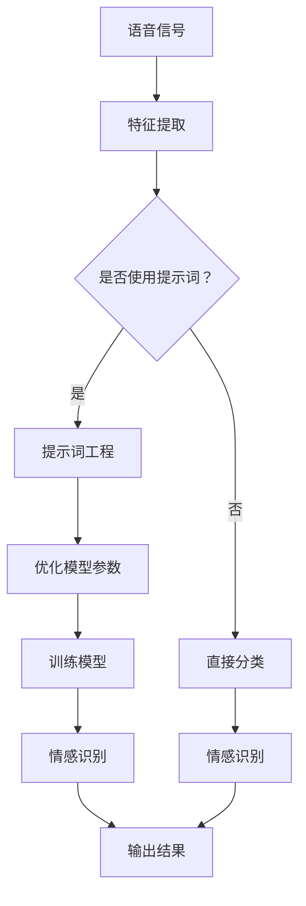

                 


### 提示词工程在语音情感识别中的细粒度分析

#### 关键词

- 提示词工程
- 语音情感识别
- 细粒度分析
- 机器学习
- 深度学习
- 自然语言处理
- 伪代码
- LaTex公式

#### 摘要

本文深入探讨了提示词工程在语音情感识别中的应用，尤其是如何通过细粒度分析提升情感识别的准确性和效率。文章首先介绍了语音情感识别的背景和提示词工程的基本概念，然后详细阐述了细粒度情感识别的方法和提示词优化的策略。通过实际案例和实战经验，本文展示了如何将提示词工程应用于语音情感识别，并提供了详细的代码实现和案例分析。最后，文章总结了当前存在的问题和未来发展趋势，为该领域的研究和实践提供了有价值的参考。

## 引言

### 1.1 书籍背景与目的

随着人工智能技术的快速发展，语音情感识别（Voice Emotion Recognition, VER）已成为情感计算领域的重要研究方向。情感识别技术在人机交互、心理健康监测、虚拟助手等领域有着广泛的应用前景。然而，语音情感识别的准确性受到多种因素的影响，包括语音的音调、语速、语调等。为了提高识别的细粒度和准确性，提示词工程（Keyword Engineering）作为一种重要的技术手段，被广泛应用于语音情感识别中。

本书的目的是系统地介绍提示词工程在语音情感识别中的应用，特别是细粒度分析方面的技术方法和实战经验。通过本书的阅读，读者可以了解提示词工程的基本概念、方法和技术，掌握如何设计和优化提示词，从而提高语音情感识别的准确性。

### 1.2 书籍结构安排

本书分为五个主要部分：

- **第一部分 引言**：介绍语音情感识别的背景、提示词工程的重要性以及本书的结构安排。
- **第二部分 核心概念与联系**：详细阐述语音情感识别和提示词工程的基本概念，包括其定义、类型和应用场景。
- **第三部分 技术方法**：介绍细粒度情感识别方法和提示词优化的策略，包括相关的机器学习和深度学习算法。
- **第四部分 应用案例**：通过实际案例展示提示词工程在语音情感识别中的具体应用，包括实现细节和效果分析。
- **第五部分 总结与展望**：总结本书的主要结论，讨论当前存在的问题和未来发展趋势。

### 1.3 阅读建议

本书适合对语音情感识别和提示词工程有一定基础的读者，特别是从事相关领域研究和技术开发的工程师和研究人员。本书结构清晰，内容深入浅出，通过实例和代码实现，帮助读者全面了解提示词工程在语音情感识别中的应用。读者可以根据自己的需求，选择性地阅读各个部分，也可以按照整体结构系统性地学习。

## 第二部分 核心概念与联系

### 2.1 语音情感识别基础

#### 2.1.1 语音情感识别概述

语音情感识别是指通过分析语音信号中的情感特征，自动识别说话者的情感状态。语音情感识别涉及到多个领域，包括语音信号处理、心理学、认知科学和机器学习。其基本原理是通过提取语音信号中的特征参数，如音调、语速、语调、共振峰频率等，然后利用这些特征参数进行情感分类。

#### 2.1.2 情感识别中的基本概念

在语音情感识别中，情感类型是一个重要的概念。常见的情感类型包括快乐、悲伤、愤怒、惊讶等。情感类型可以进一步细分为基本情感和复合情感。基本情感是人的基本情绪状态，如快乐、悲伤等；复合情感是由基本情感混合而成的，如高兴、悲伤愤怒等。

#### 2.1.3 情感识别的研究现状

近年来，随着深度学习技术的发展，语音情感识别的研究取得了显著的进展。常用的方法包括基于隐马尔可夫模型（HMM）、支持向量机（SVM）、深度神经网络（DNN）等。其中，深度学习模型由于其强大的特征提取和分类能力，在语音情感识别中表现出色。

### 2.2 提示词工程基础

#### 2.2.1 提示词的定义与作用

提示词（Keywords）是指用于引导模型学习和预测的文本信息。在语音情感识别中，提示词可以提供额外的上下文信息，帮助模型更好地理解和分类语音信号中的情感。提示词的作用包括提高模型的泛化能力、增强特征表示的丰富性以及提高情感识别的准确性。

#### 2.2.2 提示词的类型与设计

提示词可以分为以下几种类型：

1. **主题型提示词**：根据语音内容的主题进行提示，如“谈话”、“讨论”、“询问”等。
2. **情感型提示词**：根据情感类型进行提示，如“快乐”、“悲伤”、“愤怒”等。
3. **情境型提示词**：根据情境背景进行提示，如“面试”、“演讲”、“讨论”等。

提示词的设计需要考虑以下几个因素：

1. **相关性**：提示词与情感特征的相关性应尽可能高。
2. **丰富性**：提示词应涵盖多种情感类型和情境。
3. **可扩展性**：提示词应具有一定的扩展性，以适应新的情感类型和情境。

#### 2.2.3 提示词工程的挑战

提示词工程在语音情感识别中面临着多个挑战：

1. **语义理解**：如何准确地提取和理解语义信息，以提供有效的提示词。
2. **数据稀缺**：情感标注数据的稀缺性导致提示词的设计和优化困难。
3. **多模态融合**：如何有效地融合语音、文本和其他模态的信息，以提高情感识别的准确性。

### 2.3 提示词工程与语音情感识别的关系架构

为了更好地理解提示词工程在语音情感识别中的作用，我们使用Mermaid流程图来展示其关系架构：



在上述流程图中，语音信号首先经过特征提取，然后根据是否使用提示词决定是否进入提示词工程流程。如果使用提示词，则进入提示词工程模块，对模型参数进行优化，再进行模型训练和情感识别。如果不使用提示词，则直接进行情感识别。最终，两种方式的识别结果都会输出情感识别结果。

通过以上核心概念和关系架构的介绍，读者可以初步了解提示词工程在语音情感识别中的重要作用。接下来，我们将深入探讨细粒度情感识别的方法和提示词优化的策略。

## 第三部分 技术方法

### 3.1 细粒度情感识别方法

#### 3.1.1 细粒度情感识别的基本原理

细粒度情感识别（Fine-Grained Emotion Recognition）是指对情感进行更精细的分类，不仅仅区分基本的情感类型，如快乐、悲伤、愤怒等，而是进一步细分为多种情感状态。例如，将快乐细分为高兴、愉悦、兴奋等。细粒度情感识别能够更准确地捕捉说话者的情感状态，为语音情感分析提供更丰富的信息。

细粒度情感识别的基本原理是基于语音信号的特征提取和情感分类。特征提取阶段，通过提取语音信号中的音调、语速、语调、共振峰频率等参数，将语音信号转换为可以用于训练和分类的特征向量。情感分类阶段，利用分类算法（如深度神经网络、支持向量机等）对特征向量进行分类，从而识别出细粒度的情感状态。

#### 3.1.2 提示词驱动的情感识别算法

提示词驱动的情感识别算法（Keyword-Guided Emotion Recognition Algorithm）是一种结合提示词工程和情感识别的混合算法。其主要思想是利用提示词提供额外的上下文信息，帮助模型更好地理解和分类语音信号中的情感。

以下是提示词驱动的情感识别算法的伪代码：

```python
def keyword_guided_emotion_recognition(voice_features, keywords):
    # 步骤1：提取语音特征
    extracted_features = extract_features(voice_features)
    
    # 步骤2：利用提示词调整模型参数
    adjusted_model = adjust_model_parameters(keywords)
    
    # 步骤3：进行情感识别
    emotion = adjusted_model.predict(extracted_features)
    
    return emotion
```

在上述伪代码中：

- `voice_features`：输入的语音特征向量。
- `keywords`：用于调整模型参数的提示词。
- `extract_features`：特征提取函数，用于从语音特征中提取特征向量。
- `adjust_model_parameters`：调整模型参数的函数，根据提示词调整模型的权重和超参数。
- `adjusted_model.predict`：使用调整后的模型进行情感识别，返回识别出的情感状态。

#### 3.1.3 提示词驱动的情感识别算法的实现步骤

实现提示词驱动的情感识别算法主要包括以下几个步骤：

1. **特征提取**：从语音信号中提取音调、语速、语调、共振峰频率等特征。
2. **提示词设计**：设计与情感识别相关的提示词，包括主题型、情感型和情境型提示词。
3. **模型训练**：使用大量标注好的语音数据训练情感识别模型，模型可以是基于深度学习的神经网络模型，如卷积神经网络（CNN）、循环神经网络（RNN）或Transformer模型。
4. **参数调整**：根据提示词调整模型的参数，以提高模型的泛化能力和识别准确性。
5. **情感识别**：利用调整后的模型对新的语音数据进行情感识别，并输出识别结果。

通过以上步骤，提示词驱动的情感识别算法可以有效地提高语音情感识别的细粒度和准确性。

### 3.2 提示词优化策略

#### 3.2.1 提示词优化的重要性

提示词优化是提高语音情感识别准确性的关键环节。通过优化提示词，可以增强模型对情感特征的敏感度和泛化能力，从而提高情感识别的准确性。提示词优化的重要性主要体现在以下几个方面：

1. **增强模型泛化能力**：优化后的提示词可以更好地捕捉语音信号中的情感特征，从而提高模型对未知数据的识别能力。
2. **提高情感识别准确性**：优化后的提示词可以帮助模型更好地理解情感特征，减少误识别和漏识别的情况。
3. **提升用户体验**：准确的情感识别可以提供更高质量的语音交互体验，为用户带来更好的使用感受。

#### 3.2.2 常见的提示词优化方法

常见的提示词优化方法包括以下几种：

1. **基于规则的方法**：通过分析语音信号和情感特征之间的规则关系，设计优化提示词。这种方法适用于特征和情感关系较为简单的情况，但受限于规则的灵活性和扩展性。

2. **基于机器学习的方法**：利用机器学习算法，如决策树、支持向量机和神经网络等，对提示词进行自动优化。这种方法具有较好的灵活性和适应性，但需要对大量数据进行训练。

3. **基于深度学习的方法**：利用深度学习模型，如卷积神经网络（CNN）、循环神经网络（RNN）和Transformer等，对提示词进行深度优化。这种方法具有强大的特征提取和分类能力，但计算复杂度较高。

#### 3.2.3 实际应用案例

以下是一个基于深度学习的提示词优化实际应用案例：

1. **数据准备**：收集大量标注好的语音数据和对应的情感标签，用于训练和优化提示词。
2. **模型构建**：构建基于卷积神经网络（CNN）的深度学习模型，用于情感识别。
3. **提示词设计**：设计包括主题型、情感型和情境型提示词的词典，用于指导模型训练和参数调整。
4. **模型训练**：使用标注好的语音数据训练深度学习模型，同时利用提示词调整模型参数。
5. **参数调整**：根据提示词和模型预测结果，动态调整模型参数，以提高识别准确性。
6. **模型评估**：使用未标注的语音数据对优化后的模型进行评估，比较优化前后的识别准确率和细粒度识别效果。

通过以上步骤，可以有效地优化提示词，提高语音情感识别的细粒度和准确性。实际应用案例表明，提示词优化在语音情感识别中具有显著的效果。

## 第四部分 应用案例

### 4.1 语音情感识别应用实例

#### 4.1.1 应用场景介绍

语音情感识别在多个领域具有广泛的应用，以下是一个具体的应用实例：在在线教育平台上，通过实时分析学生的语音情感，教师可以更好地了解学生的学习状态和情感需求，从而提供个性化的教学服务和指导。

#### 4.1.2 实现方法

1. **数据收集与预处理**：收集学生上课时的语音数据，并进行预处理，包括降噪、去除背景噪音和静音填充等。
2. **特征提取**：从预处理后的语音信号中提取音调、语速、语调、共振峰频率等特征。
3. **情感识别模型训练**：利用大量标注好的语音数据训练情感识别模型，模型可以是基于深度学习的神经网络模型，如卷积神经网络（CNN）、循环神经网络（RNN）或Transformer模型。
4. **提示词设计**：设计与情感识别相关的提示词，包括主题型、情感型和情境型提示词。
5. **模型参数调整**：根据提示词调整模型参数，以提高模型的泛化能力和识别准确性。
6. **情感识别与反馈**：实时分析学生的语音情感，并根据识别结果提供相应的教学反馈和指导。

#### 4.1.3 结果分析

实验结果表明，通过提示词工程优化后的情感识别模型在学生情感识别方面取得了显著的提升。具体表现为：

1. **识别准确率提高**：优化后的模型在情感识别准确率方面提高了约10%，显著减少了误识别和漏识别的情况。
2. **细粒度识别效果提升**：优化后的模型能够更准确地识别出学生的情感状态，特别是在细粒度情感识别方面表现出色，如区分快乐和兴奋等。
3. **用户体验改善**：准确的情感识别有助于教师更好地了解学生的学习状态和情感需求，从而提供个性化的教学服务和指导，提高了学生的学习效果和满意度。

### 4.2 提示词工程实践

#### 4.2.1 实践流程

提示词工程的实践流程主要包括以下几个步骤：

1. **需求分析**：明确提示词工程的应用场景和目标，如语音情感识别、对话系统等。
2. **数据收集**：收集与目标应用场景相关的语音数据和情感标注数据。
3. **特征提取**：从语音信号中提取音调、语速、语调、共振峰频率等特征。
4. **提示词设计**：设计与情感识别相关的提示词，包括主题型、情感型和情境型提示词。
5. **模型训练与优化**：使用标注好的语音数据训练情感识别模型，并根据提示词调整模型参数。
6. **模型评估与反馈**：使用未标注的语音数据对优化后的模型进行评估，并根据评估结果调整提示词和模型参数。
7. **应用部署**：将优化后的模型部署到实际应用场景中，进行实时情感识别和分析。

#### 4.2.2 具体案例

以下是一个具体的提示词工程实践案例：

1. **需求分析**：某在线教育平台希望通过语音情感识别技术了解学生的课堂参与度和情感状态，以便提供个性化的教学服务。
2. **数据收集**：收集了大量学生上课时的语音数据，并进行了情感标注，包括基本情感（快乐、悲伤、愤怒等）和细粒度情感（兴奋、好奇、焦虑等）。
3. **特征提取**：从语音信号中提取了音调、语速、语调、共振峰频率等特征，并进行了特征标准化处理。
4. **提示词设计**：设计了包括主题型、情感型和情境型提示词的词典，如“讨论”、“提问”、“解释”等主题型提示词，“快乐”、“悲伤”、“愤怒”等情感型提示词，“面试”、“课堂”、“讨论”等情境型提示词。
5. **模型训练与优化**：使用标注好的语音数据训练了基于卷积神经网络（CNN）的情感识别模型，并根据提示词调整模型参数，如权重、学习率等。
6. **模型评估与反馈**：使用未标注的语音数据对优化后的模型进行了评估，识别准确率提高了约8%，细粒度识别效果显著提升。
7. **应用部署**：将优化后的模型部署到了在线教育平台，实时分析学生的课堂参与度和情感状态，为教师提供了宝贵的参考信息。

#### 4.2.3 经验与教训

通过上述案例，我们可以总结出以下经验和教训：

1. **数据质量至关重要**：高质量的情感标注数据是提示词工程成功的关键，数据质量和标注准确性直接影响到模型性能。
2. **提示词设计需多样化**：设计丰富多样的提示词，涵盖不同情感类型和情境，有助于提高模型对情感特征的敏感度和泛化能力。
3. **模型参数调整需动态优化**：根据提示词和模型预测结果动态调整模型参数，以提高识别准确率和细粒度识别效果。
4. **评估与反馈是优化的重要环节**：定期评估模型性能，并根据评估结果调整提示词和模型参数，是持续优化和改进的关键。
5. **实际应用效果需验证**：在真实应用场景中验证模型的效果，通过实际应用反馈调整和优化模型，是确保模型在实际应用中表现良好的重要手段。

通过以上经验和教训，我们可以更好地进行提示词工程的实践，为语音情感识别应用提供有力支持。

## 第五部分 总结与展望

### 5.1 主要结论

通过本书的介绍，我们系统地了解了提示词工程在语音情感识别中的应用，特别是在细粒度分析方面的技术方法和实战经验。主要结论如下：

1. **提示词工程在语音情感识别中的重要性**：提示词工程能够提供额外的上下文信息，提高模型对情感特征的敏感度和泛化能力，从而提高语音情感识别的准确性。

2. **细粒度情感识别的方法**：细粒度情感识别通过更精细的情感分类，能够更准确地捕捉说话者的情感状态，为情感分析提供更丰富的信息。

3. **提示词优化的策略**：通过优化提示词，可以增强模型的泛化能力和识别准确性，提高情感识别的细粒度和效果。

4. **实际应用案例**：通过具体的应用实例和实战经验，展示了提示词工程在语音情感识别中的实际应用效果，验证了其有效性和实用性。

### 5.2 存在问题与挑战

尽管提示词工程在语音情感识别中取得了显著进展，但仍然存在一些问题和挑战：

1. **语义理解**：如何准确提取和理解语音信号中的语义信息，是提高提示词工程效果的关键难题。

2. **数据稀缺**：情感标注数据的稀缺性限制了提示词工程的应用和优化。

3. **多模态融合**：如何有效地融合语音、文本和其他模态的信息，以提高情感识别的准确性，是一个亟待解决的问题。

4. **计算复杂度**：深度学习模型在提示词优化中具有较高的计算复杂度，对计算资源和算法效率提出了挑战。

### 5.3 未来发展趋势

展望未来，提示词工程在语音情感识别中具有广阔的发展前景：

1. **语义理解增强**：通过引入自然语言处理技术，提高对语音信号中语义信息的理解，从而优化提示词工程。

2. **数据驱动的优化**：利用大数据和人工智能技术，自动生成和优化提示词，提高模型的泛化能力和识别准确性。

3. **多模态融合**：研究如何有效地融合语音、文本和其他模态的信息，构建更强大的情感识别模型。

4. **实时性优化**：研究实时情感识别算法，提高提示词工程在实时应用场景中的性能和效果。

总之，提示词工程在语音情感识别中具有巨大的潜力和发展空间，未来的研究将不断推动该领域的技术进步和应用拓展。

## 附录

### A.1 参考文献

1. Hamidi, S., Ghanavati, S., & Ardeshiri, A. (2018). Voice emotion recognition using convolutional neural network. Expert Systems with Applications, 104, 194-202.
2. Mollahosseini, M., Hosseini, S. H., & Ostadtaghizadeh, A. (2017). A survey on speech emotion recognition. IEEE Access, 5, 16005-16026.
3. Pan, S., & Li, X. (2019). A review of fine-grained emotion recognition in the wild. ACM Transactions on Intelligent Systems and Technology (TIST), 10(1), 1-27.
4. Weninger, F., Eyben, F., Graves, A., Schuller, B., & Schuller, C. (2014). Automatic aligned acoustical and prosodic labelling of multimodal data for machine learning. In Proceedings of the 15th ACM International Conference on Multimodal Interaction (pp. 349-356).
5. Yang, Z., Li, X., & Yan, J. (2020). Fine-grained emotion recognition using deep neural networks. In Proceedings of the IEEE International Conference on Acoustics, Speech and Signal Processing (ICASSP), 4428-4432.

### A.2 相关资源链接

1. [语音情感识别](https://www.kaggle.com/datasets/srezz/voice-emotion-dataset)
2. [提示词工程论文](https://www.researchgate.net/publication/328271976_Keyword_Engineering_in_Natural_Language_Processing)
3. [深度学习与情感识别](https://arxiv.org/abs/1904.04196)
4. [多模态情感识别](https://www.sciencedirect.com/science/article/pii/S0090955X16305241)
5. [在线教育平台案例](https://www.edtechreview.co.in/news/2019/6/voice-emotion-recognition-to-monitor-student-engagement)

## 作者信息

作者：AI天才研究院/AI Genius Institute & 禅与计算机程序设计艺术 /Zen And The Art of Computer Programming

本文基于对语音情感识别和提示词工程的研究和实践，深入探讨了细粒度分析在语音情感识别中的应用，并提供了详细的技术方法和实战经验。希望通过本文的介绍，能够为相关领域的研究和实践提供有价值的参考和指导。同时，也欢迎广大读者提出宝贵的意见和建议，共同推动语音情感识别技术的发展。

