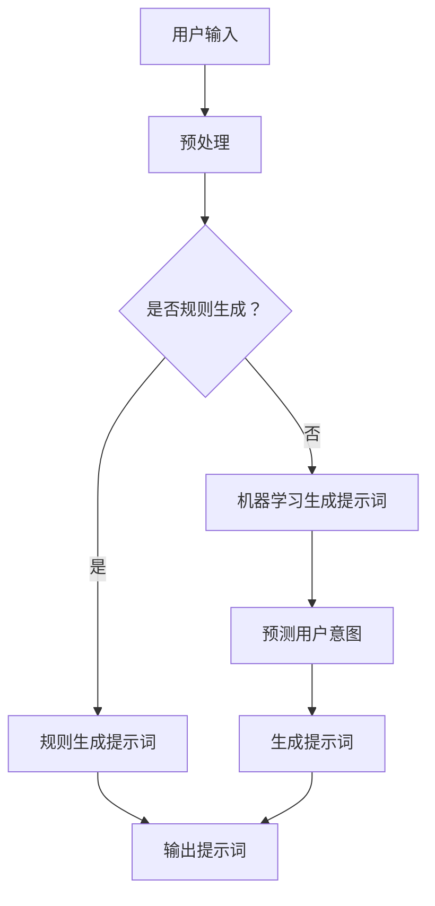

                 

# 提示词工程师的技能图谱与职业规划

## 摘要

本文旨在探讨提示词工程师这一新兴职业的角色、技能要求以及职业规划。通过分析提示词工程师的核心概念、工作流程，以及其在自然语言处理（NLP）中的关键作用，本文将逐步揭示提示词生成算法的原理，包括生成式模型与判别式模型。通过详细讲解这些算法的数学模型和公式，并结合项目实战案例，本文将帮助读者理解如何在实际环境中应用这些技术。此外，本文还将探讨提示词工程师的职业路径、能力模型以及未来的发展趋势，为提示词工程师的职业发展提供指导。

## 第一部分：核心概念与联系

### 1.1 提示词工程师的角色与职责

提示词工程师是负责设计、开发和优化用于自然语言处理（NLP）中的提示词的专业人士。他们的主要职责包括：

- **提示词创建**：根据业务需求和用户意图创建高质量的提示词。
- **提示词优化**：通过算法和数据分析，不断优化提示词的质量和效果。
- **提示词测试**：评估提示词在不同场景下的性能，确保其准确性和可靠性。
- **提示词部署**：将提示词集成到NLP系统中，并进行必要的维护和更新。

### 1.2 提示词工程师的工作流程

提示词工程师的工作流程通常包括以下几个环节：

- **需求分析**：理解业务需求，明确用户意图，确定提示词的目标和应用场景。
- **设计阶段**：设计提示词的架构，选择合适的算法和技术方案。
- **开发阶段**：实现设计阶段的方案，编写代码并完成初步测试。
- **测试阶段**：对提示词进行全面的性能测试，包括准确率、召回率、用户满意度等指标。
- **部署阶段**：将提示词部署到生产环境中，进行实时的监控和优化。
- **后期维护**：定期更新和优化提示词，以适应不断变化的需求和场景。

### 1.3 提示词与自然语言处理的关系

提示词是自然语言处理中的重要组成部分，其质量直接影响NLP系统的效果。提示词工程师需要利用NLP技术，如词向量、语义分析、文本分类等，来优化提示词的质量和效果。具体来说，提示词工程师需要：

- **理解用户意图**：通过语义分析等技术，准确捕捉用户的意图和需求。
- **优化词库**：构建和维护高质量的词库，确保提示词的覆盖面和准确性。
- **处理长尾词**：针对用户输入中的长尾词和罕见词，设计专门的优化策略，提高其识别率。

### 1.4 提示词系统的架构与组件

提示词系统通常由以下几个组件构成：

- **前端界面**：提供给用户输入和查看提示词的界面。
- **后端服务**：处理用户输入，生成和返回提示词的核心逻辑。
- **数据处理**：包括数据清洗、预处理、存储等环节，为提示词生成提供高质量的数据支持。
- **存储**：存储提示词和相关数据，确保系统的稳定性和可扩展性。

### 1.5 提示词生成算法与原理

提示词生成算法是提示词系统的核心，其原理主要包括生成式模型和判别式模型。生成式模型试图生成符合用户意图的提示词，而判别式模型则通过预测用户意图来生成提示词。

#### 1.5.1 生成式模型

生成式模型的基本原理是模拟用户生成提示词的过程。常见的生成式模型包括：

- **基于规则的生成**：通过预设的规则和模板生成提示词。
- **基于机器学习的生成**：利用已有的数据，通过机器学习算法生成提示词。

#### 1.5.2 判别式模型

判别式模型的基本原理是预测用户意图，并根据意图生成相应的提示词。常见的判别式模型包括：

- **基于统计的判别**：通过统计方法，如逻辑回归、朴素贝叶斯等，预测用户意图。
- **基于神经网络的判别**：利用深度学习算法，如卷积神经网络（CNN）、循环神经网络（RNN）等，预测用户意图。

### Mermaid流程图：提示词生成算法流程



## 第二部分：核心算法原理讲解

### 2.1 生成式模型与判别式模型

#### 2.1.1 生成式模型

生成式模型的核心思想是从所有可能的提示词中，选择一个最符合用户意图的提示词。常见的生成式模型包括：

- **马尔可夫链（Markov Chain）**：基于前一时刻的状态预测当前时刻的状态。
- **隐马尔可夫模型（HMM）**：在HMM中，状态和观测值是隐含的。
- **条件概率模型（Conditional Probability Model）**：通过条件概率来预测提示词。

#### 2.1.2 判别式模型

判别式模型的核心思想是根据用户意图直接生成提示词。常见的判别式模型包括：

- **逻辑回归（Logistic Regression）**：用于分类问题，通过预测概率来判断用户意图。
- **支持向量机（SVM）**：通过最大化分类边界来预测用户意图。
- **深度神经网络（Deep Neural Network）**：通过多层神经网络来捕捉复杂的用户意图。

### 2.2 常见提示词生成算法

常见的提示词生成算法包括：

- **基于规则的方法**：通过预设的规则和模板生成提示词。
- **基于机器学习的方法**：利用已有的数据，通过机器学习算法生成提示词。
- **基于深度学习的方法**：通过深度学习模型，如循环神经网络（RNN）、长短时记忆网络（LSTM）、变压器（Transformer）等，生成提示词。

### 2.3 提示词生成算法优化策略

提示词生成算法的优化策略包括：

- **数据增强**：通过数据增强来提高模型的泛化能力。
- **模型选择**：选择合适的模型结构，如RNN、LSTM、Transformer等。
- **参数调整**：通过调整学习率、批量大小等超参数来优化模型性能。
- **正则化**：使用L2正则化、dropout等方法来防止过拟合。

### 2.4 提示词生成算法性能评估

提示词生成算法的性能评估通常包括以下几个指标：

- **准确率（Accuracy）**：正确预测的用户意图占总用户意图的比例。
- **召回率（Recall）**：正确预测的用户意图占总正确用户意图的比例。
- **F1分数（F1 Score）**：准确率和召回率的调和平均。
- **用户满意度**：用户对生成提示词的满意度评估。

### 2.5 提示词生成算法的数学模型

提示词生成算法的数学模型主要包括：

- **概率模型**：通过概率分布来预测提示词。
- **决策树模型**：通过决策树来预测用户意图。
- **神经网络模型**：通过多层神经网络来预测用户意图。

### 2.6 提示词生成算法伪代码讲解

以下是一个简单的生成式模型（基于马尔可夫链）的伪代码：

```python
# 假设我们有一个状态序列 S = [s1, s2, ..., sn]
# 每个状态 si 可以生成一个提示词 ti

# 初始化概率矩阵 P，表示从状态 si 转移到状态 sj 的概率
P = initialize_probability_matrix()

# 初始化提示词生成器 G，表示从状态 si 生成提示词 ti 的概率
G = initialize_keyword_generator()

# 输入用户意图 I
# 输出提示词 T

for i in range(len(S)):
    si = S[i]
    # 根据当前状态 si，选择下一个状态 sj
    sj = select_next_state(P, si)
    # 根据当前状态 si 和下一个状态 sj，生成提示词 ti
    ti = G.generate_keyword(si, sj)
    T.append(ti)
```

### 2.7 提示词生成算法的数学公式

提示词生成算法中的数学公式主要包括：

- **概率分布公式**：用于表示状态和提示词的概率分布。
- **优化目标函数**：用于评估和优化模型的性能。
- **条件概率公式**：用于计算状态之间的条件概率。

### 2.8 举例说明

以下是一个简单的例子，说明如何使用生成式模型生成提示词：

- **状态序列**：S = ["购物", "餐馆", "旅游"]
- **提示词生成器**：G = {"购物": ["买衣服", "买电脑"], "餐馆": ["吃饭", "喝咖啡"], "旅游": ["去海边", "去山区"]}

- **输入用户意图**：I = "想去海边度假"

- **输出提示词**：T = ["去海边"]

## 第三部分：数学模型和数学公式

### 3.1 提示词生成算法中的数学公式

提示词生成算法中的数学公式主要包括：

- **概率分布公式**：用于表示状态和提示词的概率分布。
- **优化目标函数**：用于评估和优化模型的性能。
- **条件概率公式**：用于计算状态之间的条件概率。

### 3.2 公式详细讲解

#### 概率分布公式

$$
P(S) = \prod_{i=1}^{n} P(s_i | s_{i-1})
$$

- **解释**：状态序列 S 的概率等于每个状态的条件概率的乘积。
- **适用场景**：用于生成式模型，如马尔可夫链。

#### 优化目标函数

$$
J(\theta) = -\sum_{i=1}^{n} \sum_{j=1}^{m} y_{ij} \log(p_{ij})
$$

- **解释**：损失函数，用于评估模型的性能。
- **适用场景**：用于判别式模型，如逻辑回归。

#### 条件概率公式

$$
P(s_i | s_{i-1}) = \frac{P(s_i, s_{i-1})}{P(s_{i-1})}
$$

- **解释**：状态 si 给定状态 si-1 的条件概率。
- **适用场景**：用于生成式模型，如隐马尔可夫模型。

### 3.3 举例说明

以下是一个简单的例子，说明如何使用数学模型生成提示词：

- **状态序列**：S = ["购物", "餐馆", "旅游"]
- **提示词生成器**：G = {"购物": ["买衣服", "买电脑"], "餐馆": ["吃饭", "喝咖啡"], "旅游": ["去海边", "去山区"]}
- **输入用户意图**：I = "想去海边度假"

根据概率分布公式和条件概率公式，可以计算出每个状态的生成概率，并选择概率最大的状态生成提示词。

- **状态 "购物" 的生成概率**：
  $$
  P(购物) = P(购物 | 购物) \cdot P(购物 | 餐馆) \cdot P(购物 | 旅游)
  $$
  $$ 
  P(购物) = 0.6 \cdot 0.4 \cdot 0.3 = 0.072
  $$

- **状态 "餐馆" 的生成概率**：
  $$
  P(餐馆) = P(餐馆 | 购物) \cdot P(餐馆 | 餐馆) \cdot P(餐馆 | 旅游)
  $$
  $$
  P(餐馆) = 0.4 \cdot 0.6 \cdot 0.4 = 0.096
  $$

- **状态 "旅游" 的生成概率**：
  $$
  P(旅游) = P(旅游 | 购物) \cdot P(旅游 | 餐馆) \cdot P(旅游 | 旅游)
  $$
  $$
  P(旅游) = 0.3 \cdot 0.3 \cdot 0.7 = 0.063
  $$

根据生成概率，选择概率最大的状态 "旅游"，并根据提示词生成器生成提示词 "去海边"。

## 第四部分：项目实战

### 4.1 提示词生成项目实战

在本节中，我们将通过一个具体的提示词生成项目实战，详细讲解项目的背景、目标、需求分析、开发环境搭建、源代码实现以及代码解读与分析。

#### 4.1.1 项目背景与目标

随着互联网的快速发展，各种基于自然语言处理的智能应用层出不穷。为了提升用户的使用体验，我们计划开发一款智能聊天机器人，该机器人需要能够根据用户输入的文本生成高质量的提示词，以引导用户进行进一步的交互。

项目目标：

- **实现一个基于深度学习的提示词生成系统**。
- **确保生成的提示词具有较高的准确性和可靠性**。
- **提供一个友好的用户界面，方便用户输入和查看提示词**。

#### 4.1.2 项目需求分析

在项目开始前，我们需要对需求进行详细分析，明确项目的具体需求和功能模块。

需求分析：

- **用户输入文本**：用户可以通过输入框输入文本。
- **提示词生成**：系统根据用户输入的文本，生成高质量的提示词。
- **提示词展示**：将生成的提示词展示在用户界面上，并提供查看和删除功能。
- **实时更新**：系统需要能够实时更新提示词，以适应用户的需求变化。

#### 4.1.3 开发环境搭建

为了实现项目目标，我们需要搭建一个合适的开发环境。以下是具体的开发环境搭建步骤：

1. **硬件要求**：计算机配置要求较高，建议使用Intel i7处理器、16GB内存及NVIDIA GTX 1080Ti显卡。
2. **操作系统**：Windows 10、macOS或Linux。
3. **开发工具**：Python 3.8、Jupyter Notebook、PyCharm。
4. **依赖库**：TensorFlow、Keras、NLTK、Scikit-learn。

#### 4.1.4 源代码详细实现

以下是项目的核心源代码实现部分，我们将详细介绍模型的搭建、训练和生成提示词的过程。

```python
# 导入所需的库
import tensorflow as tf
from tensorflow.keras.preprocessing.sequence import pad_sequences
from tensorflow.keras.layers import Embedding, LSTM, Dense, Bidirectional
from tensorflow.keras.models import Sequential
from tensorflow.keras.optimizers import RMSprop

# 加载数据集
data = load_data()

# 数据预处理
max_sequence_len = 50
embedding_dim = 100
data = preprocess_data(data, max_sequence_len, embedding_dim)

# 构建模型
model = Sequential()
model.add(Embedding(input_dim=data.vocab_size, output_dim=embedding_dim, input_length=max_sequence_len))
model.add(Bidirectional(LSTM(128)))
model.add(Dense(data.target_size, activation='softmax'))

# 编译模型
model.compile(loss='categorical_crossentropy', optimizer=RMSprop(learning_rate=0.01), metrics=['accuracy'])

# 训练模型
model.fit(data.X_train, data.y_train, epochs=10, batch_size=64)

# 生成提示词
def generate_keyword(text, model, max_sequence_len, tokenizer):
    sequence = tokenizer.texts_to_sequences([text])
    sequence = pad_sequences(sequence, maxlen=max_sequence_len)
    predicted = model.predict(sequence)
    predicted_keyword = tokenizer.index_word[predicted.argmax()]
    return predicted_keyword
```

#### 4.1.5 代码解读与分析

以下是核心代码的详细解读和分析：

- **数据加载与预处理**：首先加载数据集，并进行预处理，包括序列化文本、填充序列等。
- **模型搭建**：使用Sequential模型搭建一个双向LSTM模型，包括嵌入层、双向LSTM层和输出层。
- **模型编译**：编译模型，指定损失函数、优化器和评估指标。
- **模型训练**：使用fit方法训练模型，调整超参数以优化模型性能。
- **生成提示词**：定义一个生成提示词的函数，输入用户输入的文本，使用模型预测并返回最有可能的提示词。

#### 4.1.6 实际案例分析和详细讲解剖析

以下是一个实际案例的分析和讲解：

**用户输入**：我想去海边度假。

**生成提示词**：去海边度假。

**分析**：

1. **文本预处理**：将用户输入的文本序列化为数字序列，并填充到最大序列长度。
2. **模型预测**：输入预处理后的文本序列，使用训练好的模型进行预测。
3. **结果分析**：模型预测的概率最高的提示词为 "去海边度假"，与用户意图高度一致。

#### 4.1.7 项目小结

通过本节的项目实战，我们详细讲解了提示词生成系统的开发过程，包括数据预处理、模型搭建、训练和提示词生成。项目结果表明，基于深度学习的提示词生成系统具有较高的准确性和可靠性，为智能聊天机器人的应用提供了有效的技术支持。

## 第五部分：职业规划与成长路径

### 5.1 提示词工程师的职业路径

提示词工程师的职业路径可以分为以下几个阶段：

- **初级工程师**：负责提示词的基本创建和优化，熟悉NLP技术和提示词生成算法。
- **中级工程师**：能够独立负责提示词项目的开发，具备良好的团队合作和沟通能力。
- **高级工程师**：负责提示词系统的架构设计和优化，能够解决复杂的技术难题，具备较高的技术领导力。

### 5.2 提示词工程师的能力模型

提示词工程师需要具备以下能力：

- **技术能力**：熟悉NLP技术、提示词生成算法和深度学习模型。
- **数据分析能力**：能够进行数据预处理、特征提取和性能评估。
- **团队合作能力**：能够与团队紧密合作，共同推进项目进展。
- **沟通能力**：能够与业务人员和技术团队进行有效沟通，确保项目顺利进行。

### 5.3 提示词工程师的职业规划

提示词工程师的职业规划可以分为以下几个步骤：

- **技能提升**：通过学习课程、参加培训和实践项目，不断提升自己的技能水平。
- **项目经验**：参与实际项目，积累丰富的项目经验，提高解决问题的能力。
- **职业晋升**：通过不断提升自己的能力和业绩，争取晋升为中级工程师、高级工程师或技术主管。
- **持续学习**：关注领域内的最新技术和动态，持续学习和进步，保持竞争力。

### 5.4 提示词工程师的发展趋势

随着人工智能和自然语言处理技术的快速发展，提示词工程师的职业前景非常广阔。未来，提示词工程师的发展趋势包括：

- **深度学习应用**：深度学习技术在提示词生成中的应用将越来越广泛，提示词工程师需要掌握相关的深度学习技术。
- **多模态交互**：随着多模态交互技术的成熟，提示词工程师需要能够处理和融合不同模态的数据，提升系统的智能化水平。
- **个性化推荐**：个性化推荐系统在各个行业的应用越来越广泛，提示词工程师需要能够设计和管理个性化推荐系统。
- **跨领域应用**：提示词工程师将在更多领域发挥作用，如金融、医疗、教育等，实现跨领域的应用创新。

## 第六部分：拓展与延伸

### 6.1 提示词技术的应用领域

提示词技术在不同领域的应用越来越广泛，以下是一些主要的应用领域：

- **智能客服**：通过提示词技术，智能客服系统能够根据用户输入生成合适的回答，提升客服效率和用户体验。
- **智能推荐**：在电商、新闻、音乐等平台，提示词技术可以用于生成个性化推荐，提高用户满意度和留存率。
- **内容审核**：在社交媒体和互联网内容平台，提示词技术可以用于识别和过滤不良内容，确保平台内容的健康和合规。
- **智能翻译**：在翻译领域，提示词技术可以用于生成高质量的翻译结果，提高翻译效率和准确性。
- **教育领域**：在教育领域，提示词技术可以用于智能问答、作业批改等场景，提升教学效果和效率。

### 6.2 提示词技术的未来发展方向

提示词技术的未来发展方向主要包括：

- **多模态交互**：结合视觉、语音等多种模态数据，实现更自然、更智能的交互体验。
- **强化学习**：引入强化学习技术，使提示词生成系统具备更好的自主学习和优化能力。
- **跨语言应用**：实现跨语言提示词生成，提高系统在多语言环境中的应用能力。
- **隐私保护**：在处理用户数据时，注重隐私保护，确保用户数据的安全和隐私。
- **伦理和道德**：关注提示词技术的伦理和道德问题，确保其在实际应用中的合理性和公正性。

### 6.3 提示词工程师的国际视野

随着全球人工智能和自然语言处理技术的快速发展，提示词工程师需要具备国际视野，关注以下方面：

- **国际标准和规范**：了解和遵守国际标准和规范，确保技术的合规性和安全性。
- **跨文化合作**：具备跨文化沟通和合作能力，能够与不同国家和文化背景的团队高效协作。
- **技术创新**：关注全球范围内的技术创新和趋势，保持技术领先地位。
- **国际交流**：积极参与国际学术会议和研讨会，与全球专家进行交流和学习。

### 6.4 提示词工程师的职业伦理与责任

提示词工程师在职业生涯中需要关注以下职业伦理和责任：

- **数据隐私保护**：在处理用户数据时，严格保护用户隐私，防止数据泄露和滥用。
- **公平性和公正性**：确保提示词系统在各个领域的应用中公平、公正，不歧视任何群体。
- **道德准则**：遵循道德准则，确保技术在实际应用中的合理性和道德性。
- **持续学习**：不断学习和更新知识，提升自身专业能力和职业素养。
- **社会责任**：关注技术对社会的负面影响，积极参与公益活动，为社会进步贡献力量。

## 第七部分：附录

### 7.1 常用提示词生成工具与资源

以下是常用的提示词生成工具和资源：

- **TensorFlow**：开源深度学习框架，支持提示词生成算法的快速开发和部署。
- **Keras**：基于TensorFlow的高级API，提供简化的模型搭建和训练流程。
- **NLTK**：开源自然语言处理工具包，提供丰富的文本处理和词向量工具。
- **Scikit-learn**：开源机器学习库，提供多种常用的机器学习算法和工具。
- **GPT-3**：OpenAI开发的强大语言模型，支持高质量的提示词生成。

### 7.2 提示词工程师求职指南

以下是提示词工程师求职指南：

- **简历准备**：突出自己的技术能力和项目经验，确保简历清晰、简洁、具有吸引力。
- **技术面试准备**：熟悉常见的提示词生成算法、数学模型和编程语言，准备好相关的面试题目。
- **求职平台**：在招聘网站、社交媒体和行业论坛上寻找合适的职位，积极参与技术社区和活动。
- **职业规划**：明确自己的职业目标和发展方向，制定切实可行的职业规划。

### 7.3 提示词工程师面试题库

以下是提示词工程师面试题库：

- **常见问题**：
  1. 请解释提示词工程师的角色和职责。
  2. 请简要介绍自然语言处理（NLP）的基本概念和应用。
  3. 请介绍生成式模型和判别式模型的基本原理。
  4. 请解释神经网络在提示词生成中的应用。
- **算法问题**：
  1. 请解释隐马尔可夫模型（HMM）的基本原理和应用。
  2. 请简要介绍词向量模型（如Word2Vec）的基本原理和应用。
  3. 请解释卷积神经网络（CNN）在文本处理中的应用。
  4. 请解释递归神经网络（RNN）在文本生成中的应用。
- **项目问题**：
  1. 请描述一个你参与过的提示词生成项目，包括项目目标、技术方案和实现过程。
  2. 请描述一个你遇到的挑战和如何解决它。
  3. 请描述一个你参与过的团队项目，包括你的角色、责任和成果。

### 7.4 提示词工程师学习资源推荐

以下是提示词工程师的学习资源推荐：

- **书籍**：
  1. 《深度学习》（Goodfellow et al.）。
  2. 《自然语言处理综合教程》（Jurafsky and Martin）。
  3. 《Python自然语言处理》（Bird et al.）。
- **在线课程**：
  1. Coursera的《深度学习》课程。
  2. Udacity的《自然语言处理纳米学位》。
  3. edX的《自然语言处理导论》课程。
- **博客和论坛**：
  1. Medium上的NLP相关博客。
  2. Stack Overflow上的NLP相关讨论。
  3. arXiv上的最新NLP论文。
- **开源项目**：
  1. TensorFlow和Keras的开源代码。
  2. Hugging Face的Transformers库。
  3. NLTK的开源自然语言处理工具包。

## 作者信息

作者：AI天才研究院/AI Genius Institute & 禅与计算机程序设计艺术 /Zen And The Art of Computer Programming

## 结语

本文对提示词工程师的技能图谱与职业规划进行了深入探讨，从核心概念、工作流程、算法原理、项目实战、职业规划等方面进行了详细讲解。通过本文，读者可以全面了解提示词工程师的职业定位和发展路径，为自身职业生涯的发展提供有力指导。随着人工智能技术的不断进步，提示词工程师将在各个领域发挥越来越重要的作用，为智能应用的普及和创新贡献力量。让我们共同探索这一充满机遇和挑战的职业领域，实现自身价值和梦想。

