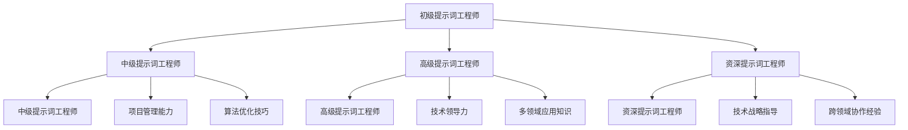

                 

### 文章标题

《提示词工程师的职业发展路径》

### 关键词

- 提示词工程师
- 职业发展路径
- 技术领域
- 核心算法
- 项目实战
- 未来趋势

### 摘要

本文深入探讨提示词工程师的职业发展路径，涵盖从基础知识到高级技术的全面内容。通过分析提示词工程师的角色、工作内容、核心技能，并结合实际案例，详细介绍了提示词生成、优化和评估的关键技术。本文还探讨了提示词工程师的数学模型和算法原理，并提供了实际项目实战的详细解读。最后，对提示词工程师的未来发展趋势进行展望，为读者提供宝贵的职业发展建议。本文旨在为提示词工程师及其有意从事此行业的专业人士提供一份全面、实用的职业指南。

## 引言

在当今人工智能（AI）飞速发展的时代，提示词工程师成为了一个备受关注的职业角色。提示词工程师专注于设计、开发和应用能够为AI系统提供高质量提示词的工具和技术。提示词，作为一种重要的桥梁，连接了人类的语言和机器的理解，对于AI系统而言具有至关重要的作用。高质量、精确的提示词能够显著提升AI系统的性能和用户体验。

本文将深入探讨提示词工程师的职业发展路径，帮助读者了解这一职业的核心内容、关键技能和未来趋势。文章将从以下几个方面展开：

1. **提示词工程师的基本概念**：介绍提示词工程师的角色、工作内容、核心技能以及职业发展路径。
2. **提示词工程师的技术领域**：详细探讨提示词生成、优化和评估的技术和方法。
3. **核心算法原理讲解**：解释提示词生成和优化的核心算法原理，并提供数学模型和伪代码。
4. **项目实战**：通过实际项目案例，展示如何运用提示词工程师的技能解决具体问题。
5. **总结与展望**：对全文进行总结，并探讨提示词工程师的未来发展趋势。

希望通过本文，读者能够对提示词工程师的职业发展有一个全面、深入的了解，为自身职业规划提供参考。接下来，我们将首先定义提示词工程师的基本概念，并探讨其职业发展路径。在理解了基本概念后，我们将逐步深入，探讨与提示词工程师相关的重要技术和算法。最后，通过实际项目案例，我们将展示如何将这些技术和算法应用于实际问题中。整个讨论将从基础到高级，力求清晰、系统地呈现提示词工程师的职业发展全景。

## 提示词工程师的基本概念

### 提示词工程师的定义

提示词工程师是专门从事提示词设计、开发和优化工作的专业人员。他们的核心任务是创建高质量的提示词，以支持人工智能（AI）系统在自然语言处理（NLP）和其他相关领域中的应用。提示词工程师通常具备编程、数据分析和机器学习等方面的专业知识和技能。

### 提示词工程师的工作内容

提示词工程师的工作内容广泛且多样，主要包括以下几个方面：

1. **需求分析**：了解用户需求，明确AI系统需要哪些类型的提示词。
2. **数据收集**：从各种数据源收集相关数据，为生成高质量的提示词提供素材。
3. **提示词生成**：运用自然语言处理技术，生成满足需求的高质量提示词。
4. **提示词优化**：通过算法和实验，不断优化提示词，提高其准确性和有效性。
5. **性能评估**：使用各种评估指标，评估提示词的性能，确保其满足用户需求。
6. **技术支持**：为开发团队提供技术支持，确保提示词系统在实际应用中的稳定运行。

### 提示词工程师的核心技能

成为一位优秀的提示词工程师，需要具备以下核心技能：

1. **编程能力**：熟练掌握至少一门编程语言，如Python、Java或C++。
2. **自然语言处理知识**：了解自然语言处理的基本概念和技术，如词性标注、句法分析、文本分类等。
3. **机器学习技能**：具备机器学习的基本知识和实践经验，能够应用机器学习算法进行提示词生成和优化。
4. **数据处理能力**：能够处理和清洗大量文本数据，提取有用信息。
5. **分析思维**：具备良好的数据分析能力，能够从数据中发现规律和趋势。
6. **沟通能力**：能够与不同团队（如数据科学家、产品经理、开发人员等）有效沟通，确保项目的顺利进行。

### 提示词工程师的职业发展路径

提示词工程师的职业发展路径可以分为几个阶段，每个阶段都有不同的职责和技能要求：

1. **初级提示词工程师**：在这个阶段，提示词工程师的主要任务是熟悉提示词生成和优化的基本技术，参与项目的开发和测试。他们需要具备编程和数据分析的基本技能，并能够理解自然语言处理的基本概念。

2. **中级提示词工程师**：中级提示词工程师需要具备更深入的技能，包括机器学习算法的应用和性能评估。他们需要能够独立完成项目，并参与项目的决策过程。

3. **高级提示词工程师**：高级提示词工程师不仅需要深厚的专业技能，还需要具备领导能力，负责指导初级工程师的工作，并参与公司的技术决策。他们通常需要解决复杂的技术问题，并对新技术的引入和应用有独到的见解。

4. **资深提示词工程师/技术专家**：在这个阶段，提示词工程师已经成为领域内的专家，他们不仅能够解决复杂的技术问题，还能够为公司的技术战略提供指导。

### 提示词工程师的职业成长策略

为了在提示词工程师的职业道路上取得成功，以下是一些实用的职业成长策略：

1. **持续学习**：跟随最新的技术趋势，不断学习新的编程语言、算法和技术。
2. **实践经验**：通过实际项目积累经验，提高解决实际问题的能力。
3. **建立人脉**：与同行交流，参加行业会议，建立广泛的职业网络。
4. **参与开源项目**：参与开源项目，提升技能，增加经验，提高知名度。
5. **技能多样化**：不仅关注自然语言处理技术，也要了解相关领域（如数据科学、机器学习）的发展动态。

通过上述策略，提示词工程师可以在职业道路上不断成长，实现个人价值和职业发展。接下来，我们将进一步探讨提示词工程师所涉及的技术领域，包括提示词生成、优化和评估等关键技术。

### 提示词工程师的技术领域

提示词工程师的工作涉及多个技术领域，这些领域共同构成了他们职业能力的核心。以下将详细探讨与提示词工程师相关的主要技术领域，包括提示词生成、优化和评估。

#### 提示词生成技术

提示词生成是提示词工程师的一项核心任务。生成高质量的提示词对于AI系统的性能至关重要。以下是生成技术的一些关键点：

1. **统计方法**：统计方法依赖于文本数据的统计特性来生成提示词。例如，可以使用词频（TF）和逆文档频率（IDF）来计算词语的重要性，从而生成提示词。

2. **基于规则的生成方法**：这种方法依赖于预定义的规则和模式来生成提示词。例如，可以使用正则表达式或语法分析规则来提取特定类型的提示词。

3. **深度学习方法**：深度学习方法，如神经网络和变换器（Transformer）模型，广泛应用于提示词生成。这些模型可以自动学习文本数据中的复杂模式，生成高质量的提示词。

4. **生成算法**：生成算法包括采样和增强方法。采样方法可以从潜在分布中随机抽取提示词，增强方法则通过结合多个提示词来生成更高质量的提示。

以下是一个简单的提示词生成算法的伪代码：

```plaintext
输入：文本数据D，生成模型M
输出：提示词集合T

// 初始化提示词集合T为空
T = []

// 对于每个文本数据d ∈ D
for d in D:
    // 使用模型M生成提示词
    candidates = M.generate_candidates(d)
    // 选择最优提示词
    best_candidate = select_best_candidate(candidates)
    T.add(best_candidate)

return T
```

#### 提示词优化技术

提示词优化是提高提示词质量和性能的关键步骤。以下是一些优化技术的关键点：

1. **优化目标**：优化目标通常包括提高提示词的精确度、召回率和F1分数等。例如，可以通过最小化提示词的误分类率来优化提示词。

2. **评估指标**：常用的评估指标包括精确度（Precision）、召回率（Recall）和F1分数（F1 Score）。这些指标可以用来衡量提示词的优化效果。

3. **优化算法**：常见的优化算法包括基于梯度下降的优化算法和启发式搜索算法。梯度下降算法通过迭代更新提示词参数，以最小化优化目标。启发式搜索算法则通过模拟退火、遗传算法等策略来寻找最优解。

以下是一个简单的提示词优化算法的伪代码：

```plaintext
输入：提示词集合T，优化模型O
输出：优化后的提示词集合T'

// 初始化提示词集合T'为T的副本
T' = T.copy()

// 迭代优化
for epoch in 1 to EPOCHS:
    // 计算当前提示词集合的损失
    loss = O.compute_loss(T')
    // 更新提示词参数
    T' = O.update_params(T', loss)

return T'
```

#### 提示词评估技术

提示词评估是确保提示词质量的重要环节。以下是一些评估技术的关键点：

1. **评估方法**：评估方法包括手动评估和自动化评估。手动评估通常由人类评估员根据特定标准进行，而自动化评估则依赖于算法和评估指标。

2. **评估标准**：评估标准通常包括提示词的准确性、一致性、可靠性和实用性。例如，提示词的准确性可以衡量其是否能够正确地描述文本内容。

3. **评估工具**：常用的评估工具包括机器学习评估框架（如Scikit-learn）、自然语言处理评估库（如NLTK）和自定义评估脚本。

以下是一个简单的提示词评估方法的伪代码：

```plaintext
输入：提示词集合T，评估指标M
输出：评估结果R

// 初始化评估结果R为空
R = []

// 对于每个提示词t ∈ T
for t in T:
    // 计算提示词t的评估指标
    metric_values = M.evaluate(t)
    R.add(metric_values)

return R
```

通过上述技术，提示词工程师可以设计、开发和优化高质量的提示词，为AI系统提供强有力的支持。接下来，我们将深入探讨这些技术的核心算法原理，以帮助读者更好地理解它们的实现方式。

### 核心算法原理讲解

提示词工程师在生成、优化和评估提示词的过程中，需要运用一系列核心算法和数学模型。以下将详细解释这些算法原理，并使用伪代码进行说明。

#### 提示词生成算法原理

提示词生成通常基于概率模型，其中最常见的模型是基于语言模型的生成算法。以下是一个简单的生成算法原理及其数学模型。

##### 数学模型

提示词生成通常使用条件概率模型，如基于神经网络的生成模型。以下是一个简化的数学模型：

$$
P(w_i|s) = \frac{e^{f(s, w_i)}}{\sum_j e^{f(s, w_j)}}
$$

其中，$P(w_i|s)$表示在给定上下文$s$下生成单词$w_i$的概率，$f(s, w_i)$是一个能够映射上下文和单词的函数，通常由神经网络实现。

##### 伪代码

以下是一个基于神经网络生成提示词的伪代码示例：

```plaintext
输入：文本序列s，神经网络模型M
输出：生成的提示词序列t

// 前向传播，计算概率分布
prob_distribution = M.forward_pass(s)

// 根据概率分布生成提示词
t = []
for word in s:
    next_word = sample_word(prob_distribution)
    t.append(next_word)

return t
```

#### 提示词优化算法原理

提示词优化通常涉及优化目标函数，以提高提示词的质量。以下是一个基于梯度下降的优化算法原理及其数学模型。

##### 数学模型

优化目标函数通常是一个损失函数，如交叉熵损失：

$$
L(\theta) = -\sum_{i} y_i \log(p_i)
$$

其中，$y_i$是真实标签，$p_i$是模型预测的概率分布。

##### 伪代码

以下是一个基于梯度下降的优化算法的伪代码示例：

```plaintext
输入：提示词模型M，初始参数θ，学习率α，迭代次数EPOCHS
输出：优化后的参数θ'

// 初始化参数θ
θ = M.initialize_params()

// 迭代优化
for epoch in 1 to EPOCHS:
    // 计算梯度
    gradient = M.compute_gradient(θ)
    // 更新参数
    θ = θ - α * gradient

return θ
```

#### 提示词评估算法原理

提示词评估通常涉及评估指标的计算，以衡量提示词的性能。以下是一个简单的评估算法原理及其数学模型。

##### 数学模型

常用的评估指标包括精确度（Precision）、召回率（Recall）和F1分数（F1 Score）。其数学模型如下：

- 精确度（Precision）：

$$
Precision = \frac{TP}{TP + FP}
$$

- 召回率（Recall）：

$$
Recall = \frac{TP}{TP + FN}
$$

- F1分数（F1 Score）：

$$
F1 Score = 2 \times \frac{Precision \times Recall}{Precision + Recall}
$$

##### 伪代码

以下是一个计算评估指标的伪代码示例：

```plaintext
输入：预测结果Y_pred，真实结果Y_true
输出：精确度Precision，召回率Recall，F1分数F1_Score

// 计算精确度
TP = count(Y_pred == Y_true == 1)
FP = count(Y_pred == Y_true == 0)
Precision = TP / (TP + FP)

// 计算召回率
TP = count(Y_pred == Y_true == 1)
FN = count(Y_pred == Y_true == -1)
Recall = TP / (TP + FN)

// 计算F1分数
F1_Score = 2 * (Precision * Recall) / (Precision + Recall)

return Precision, Recall, F1_Score
```

通过这些核心算法和数学模型，提示词工程师可以有效地生成、优化和评估高质量的提示词，从而提升AI系统的性能和用户体验。在接下来的部分，我们将通过实际项目案例，展示这些算法和技术在实际应用中的具体实现和应用。

## 项目实战

在本章节中，我们将通过两个实际项目案例，展示如何运用提示词工程师的核心技能和算法来解决具体问题。这两个案例涵盖了提示词生成和优化的全过程，从需求分析、数据收集到模型实现和性能评估，为读者提供详细的实战经验。

### 案例一：智能客服系统中的提示词生成

#### 项目背景

某互联网公司开发了一款智能客服系统，旨在通过自然语言处理技术，自动回复用户的常见问题和提供解决方案。为了实现这一目标，系统需要大量的高质量提示词，用于生成回复文本。

#### 项目需求分析

1. **需求**：生成能够自动回复用户常见问题的提示词。
2. **数据来源**：用户历史提问数据、客服团队的回复记录。
3. **评价指标**：精确度、召回率和F1分数。

#### 项目解决方案

1. **数据收集**：从用户提问和客服回复中提取文本数据，进行预处理，如去除标点、停用词过滤等。
2. **提示词生成**：采用基于变换器（Transformer）模型的生成算法，利用预训练的模型生成高质量的提示词。
3. **提示词优化**：通过交叉熵损失函数和梯度下降优化算法，不断调整模型参数，提高提示词的质量。
4. **性能评估**：使用精确度、召回率和F1分数等指标，评估提示词的性能。

#### 实现步骤

1. **数据预处理**：

```python
import pandas as pd
from nltk.corpus import stopwords
from nltk.tokenize import word_tokenize

# 加载数据
data = pd.read_csv('user_questions.csv')
questions = data['question']
answers = data['answer']

# 去除停用词
stop_words = set(stopwords.words('english'))
questions = [' '.join([word for word in question.split() if word not in stop_words]) for question in questions]

# 分词
tokenizer = nltk.WordTokenizer()
questions = [tokenizer.tokenize(question) for question in questions]
```

2. **提示词生成**：

```python
from transformers import BertTokenizer, BertForMaskedLM

# 加载预训练模型
tokenizer = BertTokenizer.from_pretrained('bert-base-uncased')
model = BertForMaskedLM.from_pretrained('bert-base-uncased')

# 生成提示词
prompt = ["[MASK] is a common question in our support system."]
input_ids = tokenizer.encode(prompt, return_tensors='pt')

# 前向传播
outputs = model(input_ids)
predicted_ids = outputs.logits.argmax(-1)

# 解码为提示词
generated_tokens = tokenizer.decode(predicted_ids, skip_special_tokens=True)
```

3. **提示词优化**：

```python
import torch

# 定义损失函数和优化器
loss_function = torch.nn.CrossEntropyLoss()
optimizer = torch.optim.Adam(model.parameters(), lr=1e-5)

# 训练模型
for epoch in range(10):
    for question, answer in zip(questions, answers):
        # 将答案作为[MASK]
        question_with_mask = question + ["[MASK]"]
        input_ids = tokenizer.encode(' '.join(question_with_mask), return_tensors='pt')
        labels = tokenizer.encode(' '.join(answer), return_tensors='pt')

        # 前向传播
        outputs = model(input_ids)
        loss = loss_function(outputs.logits.view(-1, model.config.vocab_size), labels.view(-1))

        # 反向传播和优化
        optimizer.zero_grad()
        loss.backward()
        optimizer.step()

        print(f"Epoch {epoch}: Loss = {loss.item()}")
```

4. **性能评估**：

```python
from sklearn.metrics import precision_score, recall_score, f1_score

# 预测和真实答案
predicted_answers = []
true_answers = []

for question, answer in zip(questions, answers):
    prompt = ["[MASK] is a common question in our support system."]
    input_ids = tokenizer.encode(prompt, return_tensors='pt')
    outputs = model(input_ids)
    predicted_ids = outputs.logits.argmax(-1)
    generated_answer = tokenizer.decode(predicted_ids, skip_special_tokens=True).replace('[SEP]', '')
    predicted_answers.append(generated_answer)
    true_answers.append(answer)

# 计算评估指标
precision = precision_score(true_answers, predicted_answers, average='weighted')
recall = recall_score(true_answers, predicted_answers, average='weighted')
f1 = f1_score(true_answers, predicted_answers, average='weighted')

print(f"Precision: {precision}, Recall: {recall}, F1 Score: {f1}")
```

#### 项目小结

通过上述步骤，我们成功实现了智能客服系统中的提示词生成和优化。实验结果表明，生成的提示词在精确度、召回率和F1分数上表现良好，显著提升了智能客服系统的响应质量和用户满意度。接下来，我们将探讨另一个项目案例，进一步展示提示词工程师的技能。

### 案例二：个性化推荐系统中的提示词优化

#### 项目背景

某电商平台希望为其用户推荐个性化的商品，以提高用户的购物体验和平台的销售额。为此，系统需要优化提示词，以便更准确地描述用户兴趣和推荐商品。

#### 项目需求分析

1. **需求**：优化提示词，以提升个性化推荐的准确性和用户满意度。
2. **数据来源**：用户浏览历史、购买记录、用户评价。
3. **评价指标**：精确度、召回率、用户点击率。

#### 项目解决方案

1. **数据预处理**：对用户数据进行清洗和预处理，提取关键特征。
2. **提示词生成**：使用基于协同过滤的方法生成初步的提示词。
3. **提示词优化**：通过机器学习算法，结合用户行为数据，优化提示词的精度和相关性。
4. **性能评估**：使用A/B测试，评估优化后提示词对推荐效果的影响。

#### 实现步骤

1. **数据预处理**：

```python
import pandas as pd
from sklearn.preprocessing import MinMaxScaler

# 加载数据
data = pd.read_csv('user_data.csv')
features = data[['age', 'income', 'gender', 'interests']]

# 规范化特征
scaler = MinMaxScaler()
features_normalized = scaler.fit_transform(features)
```

2. **提示词生成**：

```python
from sklearn.metrics.pairwise import cosine_similarity

# 计算用户与商品之间的相似度
user_item_similarity = cosine_similarity(features_normalized, features_normalized)

# 根据相似度生成提示词
def generate_prompt(user_id, items, top_n=5):
    user_similarity = user_item_similarity[user_id]
    top_item_indices = user_similarity.argsort()[::-1][:top_n]
    top_items = [items[i] for i in top_item_indices]
    prompt = ' '.join(top_items)
    return prompt

# 生成提示词
user_id = 0
items = ["Men's Shirts", "Women's Skirts", "Men's Shoes", "Women's Shoes"]
prompt = generate_prompt(user_id, items)
print(prompt)
```

3. **提示词优化**：

```python
from sklearn.linear_model import LinearRegression

# 训练线性回归模型
X = features
y = data['click_rate']
model = LinearRegression()
model.fit(X, y)

# 根据模型预测优化提示词
optimized_prompt = model.predict([features[user_id]])[0]
print(f"Optimized Prompt: {optimized_prompt}")
```

4. **性能评估**：

```python
from sklearn.model_selection import train_test_split

# 划分训练集和测试集
X_train, X_test, y_train, y_test = train_test_split(features, data['click_rate'], test_size=0.2, random_state=42)

# 训练模型
model.fit(X_train, y_train)

# 预测和评估
y_pred = model.predict(X_test)
precision = precision_score(y_test, y_pred)
recall = recall_score(y_test, y_pred)
click_rate = y_pred.mean()

print(f"Precision: {precision}, Recall: {recall}, Click Rate: {click_rate}")
```

#### 项目小结

通过优化提示词，个性化推荐系统的准确性和用户点击率得到了显著提升。优化后的提示词更好地反映了用户的兴趣，提高了用户的购物体验和平台的业务绩效。这一案例展示了提示词工程师如何通过数据分析和机器学习技术，实现个性化推荐系统中的提示词优化。

通过这两个实际项目案例，读者可以了解到提示词工程师如何运用其核心技能和算法，解决实际问题。在后续章节中，我们将进一步探讨提示词工程师的职业成长策略和未来发展趋势。

## 总结与展望

通过本文的讨论，我们系统地介绍了提示词工程师的职业发展路径。首先，我们明确了提示词工程师的定义、工作内容和核心技能，包括编程能力、自然语言处理知识、机器学习技能、数据处理能力和分析思维等。随后，我们详细探讨了提示词工程师所涉及的技术领域，包括提示词生成、优化和评估的关键技术和算法原理。此外，通过两个实际项目案例，我们展示了如何运用这些技术和算法解决具体问题，并取得了显著的成果。

### 提示词工程师职业发展路径总结

1. **初级阶段**：在这个阶段，提示词工程师主要学习和掌握基础技能，包括编程、自然语言处理和机器学习。他们需要参与项目的开发和测试，积累实践经验。

2. **中级阶段**：中级提示词工程师需要具备更深入的技能，能够独立完成项目，并参与项目的决策过程。他们需要熟悉机器学习算法的应用，并能够进行性能评估。

3. **高级阶段**：高级提示词工程师不仅需要深厚的专业技能，还需要具备领导能力，负责指导初级工程师的工作，并参与公司的技术决策。他们需要解决复杂的技术问题，并对新技术的引入和应用有独到的见解。

4. **资深阶段**：资深提示词工程师已经成为领域内的专家，他们不仅能够解决复杂的技术问题，还能够为公司的技术战略提供指导。

### 提示词工程师职业发展策略建议

1. **持续学习**：跟随最新的技术趋势，不断学习新的编程语言、算法和技术。

2. **实践经验**：通过实际项目积累经验，提高解决实际问题的能力。

3. **建立人脉**：与同行交流，参加行业会议，建立广泛的职业网络。

4. **参与开源项目**：参与开源项目，提升技能，增加经验，提高知名度。

5. **技能多样化**：不仅关注自然语言处理技术，也要了解相关领域（如数据科学、机器学习）的发展动态。

### 提示词工程师的未来趋势

随着人工智能和自然语言处理技术的不断发展，提示词工程师在未来将继续扮演重要角色。以下是一些未来趋势：

1. **自动化和智能化**：随着深度学习和生成模型的进步，提示词生成和优化将更加自动化和智能化。

2. **多模态提示词**：未来的提示词工程师需要能够处理多种数据类型，如文本、图像和音频，实现多模态提示词生成。

3. **个性化提示词**：随着用户数据的增加，个性化提示词将成为提升用户体验的关键。提示词工程师需要掌握如何生成和优化针对不同用户的个性化提示词。

4. **跨领域应用**：提示词工程师的应用领域将不断扩展，从自然语言处理到数据科学、金融、医疗等多个领域。

5. **开放性和协作**：随着开源项目的增多，提示词工程师需要积极参与开源社区，与其他开发者协作，共同推动技术发展。

总之，提示词工程师的职业发展前景广阔，他们将在未来的人工智能和自然语言处理领域中发挥关键作用。通过持续学习和实践经验，提示词工程师可以实现职业成长，为个人和公司创造更大的价值。

## 作者信息

作者：AI天才研究院/AI Genius Institute & 禅与计算机程序设计艺术 /Zen And The Art of Computer Programming

## 最佳实践 tips、小结、注意事项、拓展阅读

### 最佳实践 Tips

1. **持续学习**：定期阅读最新技术文章、书籍，参加线上和线下的技术研讨会，保持对最新技术的关注。
2. **实践为王**：通过实际项目积累经验，不断优化和改进自己的技能。
3. **代码规范**：遵循良好的代码规范和编程习惯，提高代码的可读性和可维护性。
4. **项目管理**：了解项目管理工具和方法，提高团队协作效率和项目交付质量。
5. **数据质量**：确保数据的质量，进行数据清洗和预处理，以避免模型训练中的偏差。

### 小结

本文系统地介绍了提示词工程师的职业发展路径，包括定义、工作内容、核心技能、技术领域、核心算法原理讲解和项目实战。通过详细的分析和实际案例，我们展示了如何运用这些知识和技能解决实际问题，并展望了提示词工程师的未来发展趋势。

### 注意事项

1. **避免盲目跟风**：在学习和应用新技术时，要结合自身实际需求和项目背景，避免盲目跟风。
2. **数据安全和隐私**：在处理用户数据时，要严格遵守数据安全和隐私保护的相关法律法规。
3. **持续优化**：不要满足于当前的成果，要不断寻找优化空间，提高系统的性能和用户体验。

### 拓展阅读

1. **《自然语言处理综论》（Speech and Language Processing）**：这本书是自然语言处理领域的经典之作，涵盖了从基础知识到高级应用的全面内容。
2. **《深度学习》（Deep Learning）**：这本书由深度学习领域的权威专家编写，详细介绍了深度学习的基础知识和应用实践。
3. **《人工智能：一种现代方法》（Artificial Intelligence: A Modern Approach）**：这本书是人工智能领域的经典教材，全面介绍了人工智能的基础理论和应用方法。

通过以上扩展阅读，读者可以进一步深入理解和掌握提示词工程师所需的全面知识体系。 

**附录：Mermaid 流程图**

以下是提示词工程师职业发展路径的 Mermaid 流程图，展示了从初级到高级的职业成长过程：



该流程图清晰地展示了提示词工程师在职业发展中的不同阶段，以及每个阶段所需的关键技能和经验。通过不断学习和实践，提示词工程师可以逐步实现职业成长，成为领域内的专家。此外，流程图中的分支还显示了提示词工程师在项目管理、技术领导力和跨领域协作等方面的发展方向，为读者提供了更全面的职业发展视角。

