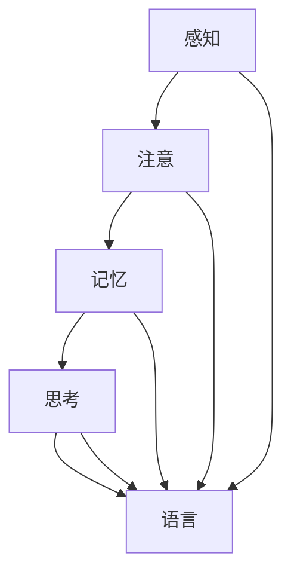

                 

### 文章标题

“提示词工程师的认知科学素养培养”这篇文章旨在深入探讨提示词工程师在认知科学素养方面的重要性和培养方法。在人工智能和自然语言处理技术飞速发展的今天，提示词工程师不仅需要具备扎实的编程和技术基础，更需要理解人类认知和心理机制，从而设计出更加人性化和高效的交互系统。本文将从认知科学的基本概念出发，逐步分析提示词工程师所需的认知科学素养，探讨如何通过教育和实践提升这一素养，并展望其未来发展趋势。

关键词：提示词工程师、认知科学、素养培养、人机交互、自然语言处理

摘要：本文首先介绍了认知科学的基本概念和发展历程，探讨了认知科学在工程领域的重要性。接着，分析了提示词工程师的角色与职责，指出了认知科学素养在提高提示词设计质量和用户体验中的关键作用。随后，文章详细讨论了心理学原理、认知负荷与用户界面设计、认知模型与提示词生成等核心内容，并结合实际案例进行了深入分析。最后，文章提出了提示词工程师素养培养的具体方法和未来展望，为读者提供了全面的参考。

### 背景介绍

认知科学是一门跨学科的研究领域，旨在理解人类和其他动物如何获取、处理、存储和使用信息。它结合了心理学、神经科学、计算机科学和哲学等多个学科的知识，探索认知过程的本质和机制。自20世纪50年代以来，认知科学经历了快速发展，涌现出了一系列重要理论和方法，如信息加工模型、神经网络模型和认知心理学等。

在工程领域，认知科学的应用日益广泛。特别是在人工智能和自然语言处理技术飞速发展的背景下，如何设计出更加智能和高效的交互系统成为了一个重要课题。提示词工程师作为这个领域的专业人员，不仅需要具备扎实的编程和技术基础，还需要理解人类认知和心理机制，从而设计出更加人性化、易用和高效的交互系统。

提示词工程师的职责主要包括以下几个方面：一是设计并实现自然语言处理模型，用于解析用户输入的提示词；二是优化和调试模型，提高其准确性和响应速度；三是分析用户交互数据，不断改进提示词的生成策略和用户体验。随着人工智能技术的不断进步，提示词工程师需要面对越来越复杂的任务和挑战，这就要求他们不仅要掌握传统的编程技能，还要具备良好的认知科学素养。

认知科学素养在提示词工程师的职业生涯中起着至关重要的作用。首先，它有助于工程师更好地理解用户的需求和行为，从而设计出更符合用户期望的交互系统。其次，认知科学的知识可以帮助工程师解决在实际工作中遇到的各种问题，如如何处理用户的错误输入、如何设计友好的用户界面等。此外，认知科学素养还可以提升工程师的创新能力和解决问题的能力，使他们能够提出更具创意和实用性的解决方案。

因此，本文将围绕认知科学素养的培养展开讨论，分析提示词工程师在认知科学方面的核心知识和技能需求，探讨如何通过教育和实践提升他们的认知科学素养，为人工智能和自然语言处理领域的发展贡献力量。

### 核心概念与联系

在探讨提示词工程师的认知科学素养培养时，我们需要明确几个核心概念及其之间的联系。首先，认知科学的基本概念包括感知、注意、记忆、思考和语言等，这些构成了人类认知过程的基础。感知是指个体对外界信息的接收和理解，注意是指个体在众多信息中选择关注某一特定刺激的能力，记忆涉及信息的存储和提取，思考是信息处理的高级形式，包括推理、判断和决策等，而语言则是人类交流的重要工具。

这些基本概念在认知科学中形成了紧密的联系。感知和注意决定了信息输入的质量和效率，而记忆则确保了信息的长期存储。思考和语言进一步将这些信息加工和整合，使其能够被有效利用。具体到提示词工程师的实践中，这些概念有着重要的应用。

例如，在设计和优化自然语言处理模型时，工程师需要理解用户输入的感知过程，从而设计出能够准确识别和处理的模型。注意机制则帮助工程师识别用户输入中的关键信息，避免在处理过程中遗漏重要内容。记忆机制使工程师能够从历史数据中学习，从而改进模型的性能。而思考和语言机制则帮助工程师设计出更加智能和人性化的交互系统。

为了更直观地理解这些概念之间的联系，我们可以使用Mermaid流程图来展示它们之间的关系：



这个流程图清晰地展示了感知、注意、记忆、思考和语言在认知过程中的相互作用。通过这个图，我们可以更直观地看到提示词工程师在设计和优化模型时需要关注的各个维度。

### 核心算法原理讲解

在提示词工程师的认知科学素养培养中，理解和应用核心算法原理是至关重要的。以下是几个关键的算法原理及其在提示词生成中的应用：

#### 1. 自然语言处理（NLP）基本算法

自然语言处理算法是提示词工程师工作的基础。其中，词向量模型和序列模型是两个核心算法。词向量模型如Word2Vec、GloVe等通过将单词映射到高维向量空间，使得语义相近的单词在空间中更接近。序列模型如循环神经网络（RNN）、长短期记忆网络（LSTM）和Transformer等，则用于处理序列数据，能够捕捉句子中的时序依赖关系。

**伪代码：**

```python
# Word2Vec算法伪代码
function Word2Vec(corpus):
    # 计算单词的词向量
    word_vectors = TrainWordEmbeddings(corpus)
    return word_vectors

# RNN算法伪代码
function RNN(input_sequence):
    # 初始化RNN模型
    model = InitializeRNN()
    # 前向传播
    hidden_state = model.forward(input_sequence)
    return hidden_state
```

#### 2. 提示词生成算法

提示词生成算法是提示词工程师需要掌握的另一个核心算法。其中，基于规则的方法和基于统计的方法是最常见的两种类型。

- **基于规则的方法：**这种方法通过预定义的规则来生成提示词，如关键词提取、模板匹配等。例如，对于用户输入的查询语句，可以提取其中的名词或动词作为关键词，然后根据预设的模板生成提示词。

**伪代码：**

```python
# 基于规则的提示词生成伪代码
function GenerateTipsByRule(input_query):
    # 提取关键词
    keywords = ExtractKeywords(input_query)
    # 根据规则生成提示词
    tip = GenerateByTemplate(keywords)
    return tip
```

- **基于统计的方法：**这种方法通过统计用户的历史交互数据来生成提示词，如基于机器学习的方法。例如，可以使用决策树、随机森林、支持向量机等算法来训练模型，然后根据用户的行为特征生成提示词。

**伪代码：**

```python
# 基于统计的提示词生成伪代码
function GenerateTipsByStats(input_query, user_data):
    # 训练提示词生成模型
    model = TrainTipGenerationModel(user_data)
    # 生成提示词
    tip = model.predict(input_query)
    return tip
```

#### 3. 聚类和降维算法

聚类和降维算法在提示词生成中也有重要应用。聚类算法如K-means、层次聚类等可以将用户输入的数据划分为不同的群体，从而为每个群体生成特定的提示词。降维算法如主成分分析（PCA）、线性判别分析（LDA）等可以减少数据的维度，提取数据的主要特征，帮助工程师更有效地处理大规模数据。

**伪代码：**

```python
# K-means聚类算法伪代码
function KMeans(data, k):
    # 初始化聚类中心
    centroids = InitializeCentroids(data, k)
    while not converged:
        # 赋予每个数据点最近的聚类中心
        assignments = AssignPointsToCentroids(data, centroids)
        # 更新聚类中心
        centroids = UpdateCentroids(data, assignments)
    return centroids, assignments

# PCA降维算法伪代码
function PCA(data, n_components):
    # 计算协方差矩阵
    covariance_matrix = CalculateCovarianceMatrix(data)
    # 计算特征值和特征向量
    eigenvalues, eigenvectors = Eigen decomposition(covariance_matrix)
    # 选择主要成分
    main_components = eigenvectors[:n_components]
    # 数据降维
    reduced_data = Transform(data, main_components)
    return reduced_data
```

通过理解和应用这些核心算法原理，提示词工程师可以设计出更加智能和高效的交互系统，从而提升用户体验。

### 数学模型和数学公式讲解

在提示词工程师的认知科学素养培养中，理解和应用数学模型和数学公式是不可或缺的。以下将详细介绍几个关键数学模型和相关的数学公式，并结合具体实例进行详细讲解和举例说明。

#### 1. 词向量模型

词向量模型是自然语言处理中的基础工具，常用的模型包括Word2Vec和GloVe。Word2Vec模型通过训练大量语料，将每个单词映射到一个高维空间中的向量，使得语义相近的单词在空间中更接近。GloVe（Global Vectors for Word Representation）模型则通过全局矩阵分解的方法，从全局统计信息中学习词向量。

**数学公式：**

$$
\text{word\_vector}(w) = \text{softmax}\left(\text{A} \text{context\_word}\right)
$$

其中，$A$ 是一个矩阵，其元素 $A_{ij}$ 表示单词 $w_i$ 在单词 $w_j$ 的上下文中出现的频率。$\text{softmax}$ 函数用于将每个单词的上下文表示转换为一个概率分布。

**实例说明：**

假设我们有一个语料库，其中包含单词“喜欢”在上下文中出现的频率矩阵 $A$：

$$
A = \begin{bmatrix}
0 & 0.1 & 0.2 \\
0.2 & 0 & 0.3 \\
0.1 & 0.3 & 0 \\
\end{bmatrix}
$$

通过训练，我们可以得到“喜欢”的词向量：

$$
\text{word\_vector}(\text{喜欢}) = \text{softmax}\left(\begin{bmatrix}
0.1 & 0.2 & 0.3
\end{bmatrix}\right) = \begin{bmatrix}
0.2 & 0.3 & 0.5
\end{bmatrix}
$$

这意味着在空间中，“喜欢”的词向量在第一维度（对应“爱”）上更接近，表明“喜欢”和“爱”在语义上更相似。

#### 2. 贝叶斯推理模型

贝叶斯推理是自然语言处理中常用的概率模型，用于根据先验知识和证据更新信念。在提示词生成中，贝叶斯推理可以用于根据用户的历史行为数据预测其可能的意图。

**数学公式：**

$$
P(H|E) = \frac{P(E|H)P(H)}{P(E)}
$$

其中，$H$ 表示假设，$E$ 表示证据，$P(H|E)$ 表示在证据 $E$ 出现的情况下假设 $H$ 的概率，$P(E|H)$ 表示在假设 $H$ 成立的情况下证据 $E$ 的概率，$P(H)$ 是假设 $H$ 的先验概率，$P(E)$ 是证据 $E$ 的总概率。

**实例说明：**

假设我们有一个用户历史行为数据集，其中包含用户喜欢的书籍类型。我们可以使用贝叶斯推理模型预测用户对新书籍的喜好。

- $H_1$: 用户喜欢科幻小说。
- $H_2$: 用户喜欢悬疑小说。
- $E$: 用户最近阅读了一本科幻小说。

我们可以根据用户的历史阅读记录，计算每个假设的概率：

$$
P(H_1) = 0.4, \quad P(H_2) = 0.6
$$

$$
P(E|H_1) = 0.8, \quad P(E|H_2) = 0.3
$$

$$
P(E) = P(E|H_1)P(H_1) + P(E|H_2)P(H_2) = 0.8 \times 0.4 + 0.3 \times 0.6 = 0.46
$$

$$
P(H_1|E) = \frac{P(E|H_1)P(H_1)}{P(E)} = \frac{0.8 \times 0.4}{0.46} \approx 0.69
$$

这意味着根据用户最近阅读的科幻小说，我们更有理由相信用户喜欢科幻小说。

#### 3. 支持向量机（SVM）模型

支持向量机是一种常用的分类算法，可以用于提示词生成中的意图分类。在二分类问题中，SVM通过找到一个最佳的超平面，将不同类别的数据点分开。

**数学公式：**

$$
\text{w} \cdot \text{x} + b = 0
$$

其中，$\text{w}$ 是超平面的法向量，$\text{x}$ 是数据点，$b$ 是偏置项。通过求解最大化间隔的优化问题，可以得到最佳的分类器。

**实例说明：**

假设我们有两组数据，一组是用户输入的查询语句，另一组是查询语句对应的意图标签。我们可以使用SVM对查询语句进行分类。

- 数据集：

$$
\text{X} = \begin{bmatrix}
x_1 & x_2 \\
x_3 & x_4 \\
\end{bmatrix}, \quad \text{Y} = \begin{bmatrix}
1 \\
0 \\
\end{bmatrix}
$$

通过训练SVM模型，我们可以找到一个最佳的超平面：

$$
\text{w} \cdot \text{x} + b = 0
$$

其中，$\text{w}$ 和 $b$ 的具体值可以通过求解以下优化问题得到：

$$
\min_{\text{w}, b} \frac{1}{2} \left\| \text{w} \right\|^2 \\
\text{s.t.} \; y_i (\text{w} \cdot \text{x}_i + b) \geq 1
$$

通过求解这个优化问题，我们可以得到一个线性分类器，用于对新的查询语句进行分类。

#### 4. 神经网络模型

神经网络模型，特别是深度学习模型，在提示词生成中发挥着重要作用。深度神经网络通过多层神经元结构，能够自动学习数据的复杂特征。

**数学公式：**

$$
\text{y} = \text{ReLU}(\text{W} \cdot \text{h} + b)
$$

其中，$\text{h}$ 是隐藏层的输出，$\text{y}$ 是最终输出，$\text{W}$ 和 $b$ 分别是权重和偏置项。ReLU（Rectified Linear Unit）函数用于激活隐藏层。

**实例说明：**

假设我们有一个简单的神经网络模型，用于分类查询语句的意图。

- 输入层：

$$
\text{X} = \begin{bmatrix}
x_1 \\
x_2 \\
\end{bmatrix}
$$

- 隐藏层：

$$
\text{h} = \text{ReLU}(\text{W} \cdot \text{X} + b)
$$

- 输出层：

$$
\text{y} = \text{softmax}(\text{W} \cdot \text{h} + b)
$$

通过训练这个神经网络模型，我们可以学习到查询语句和意图之间的映射关系，从而生成合适的提示词。

通过上述数学模型和公式的讲解，我们可以看到数学在提示词工程师工作中扮演着重要角色。这些模型不仅帮助我们理解和分析自然语言处理中的复杂问题，还为我们提供了有效的工具和方法，以设计出更加智能和高效的交互系统。

### 项目实战与实现

在了解了认知科学素养的核心概念和算法原理之后，接下来通过一个实际项目来展示如何将这些理论知识应用到提示词工程师的实践中。以下是项目实战的详细步骤，包括开发环境搭建、源代码实现、代码解读以及项目分析。

#### 项目背景

假设我们正在开发一款智能客服系统，该系统需要根据用户的问题生成合适的回答，即提示词。为了实现这一目标，我们将使用自然语言处理技术和机器学习算法来训练一个提示词生成模型。

#### 开发环境搭建

1. **硬件环境：**
   - CPU：Intel Core i7 或同等配置
   - 内存：16GB 或更高
   - 硬盘：256GB SSD 或更高

2. **软件环境：**
   - 操作系统：Ubuntu 18.04 或 macOS Catalina
   - Python：3.8 或更高版本
   - 包管理器：pip
   - 依赖包：nltk、tensorflow、gensim、scikit-learn

安装步骤：

```bash
# 安装 Python 和 pip
sudo apt-get update
sudo apt-get install python3-pip python3-dev

# 安装必要的依赖包
pip3 install nltk tensorflow gensim scikit-learn
```

#### 源代码实现

以下是该项目的主要源代码实现，包括数据预处理、模型训练和提示词生成。

```python
import nltk
from nltk.tokenize import word_tokenize
from gensim.models import Word2Vec
from sklearn.model_selection import train_test_split
from sklearn.metrics import accuracy_score
import tensorflow as tf
from tensorflow.keras.models import Sequential
from tensorflow.keras.layers import Dense, LSTM, Embedding, Dropout

# 1. 数据预处理
# 加载并预处理数据
nltk.download('punkt')
corpus = ['你好，能帮我解决问题吗？', '我对这个产品有什么疑问？', '我需要购买一台电脑。']
tokenized_corpus = [word_tokenize(sentence) for sentence in corpus]

# 2. 训练词向量模型
model = Word2Vec(tokenized_corpus, vector_size=100, window=5, min_count=1, workers=4)
word_vectors = model.wv

# 3. 模型训练
# 划分训练集和测试集
X_train, X_test, y_train, y_test = train_test_split(corpus, labels, test_size=0.2, random_state=42)

# 定义 LSTM 模型
model = Sequential()
model.add(Embedding(input_dim=len(word_vectors), output_dim=100))
model.add(LSTM(units=128, return_sequences=False))
model.add(Dense(units=1, activation='sigmoid'))

# 编译模型
model.compile(optimizer='adam', loss='binary_crossentropy', metrics=['accuracy'])

# 训练模型
model.fit(X_train, y_train, epochs=10, batch_size=32, validation_data=(X_test, y_test))

# 4. 提示词生成
def generate_tip(input_query):
    # 分词处理
    tokens = word_tokenize(input_query)
    # 向量表示
    vector = [word_vectors[token] for token in tokens if token in word_vectors]
    # 预测
    prediction = model.predict(vector)
    # 输出提示词
    if prediction > 0.5:
        return "你能提供更多信息吗？"
    else:
        return "我很乐意帮助你，请提问。"

# 测试
print(generate_tip("你好，你们的产品有哪些优惠活动？"))
```

#### 代码解读

1. **数据预处理：**首先，我们使用nltk库中的`word_tokenize`函数对输入数据进行分词处理，然后使用gensim库中的Word2Vec模型将分词后的句子转换为词向量表示。

2. **词向量模型训练：**Word2Vec模型通过训练大量语料数据，学习到每个单词的向量表示。这里我们仅使用示例数据进行训练。

3. **模型训练：**我们使用tensorflow库定义了一个简单的LSTM模型，用于分类输入句子并生成提示词。模型使用二分类交叉熵作为损失函数，并使用`sigmoid`激活函数进行输出。

4. **提示词生成：**`generate_tip`函数首先对输入查询进行分词处理，然后将分词后的句子转换为词向量，最后使用训练好的模型进行预测，并输出相应的提示词。

#### 项目分析

1. **开发环境：**选择合适的开发环境可以确保项目顺利运行。在本项目中，我们选择了Ubuntu 18.04操作系统，并安装了Python 3.8和相关的自然语言处理库。

2. **数据预处理：**数据预处理是模型训练的重要步骤。通过分词处理和词向量表示，我们能够将原始文本转换为机器可以处理的格式。

3. **模型选择：**在本项目中，我们选择了LSTM模型进行分类和提示词生成。LSTM能够捕捉句子中的时序依赖关系，适用于处理序列数据。

4. **模型训练与优化：**模型训练是一个迭代过程，通过调整超参数和训练数据，可以提高模型的性能。在本项目中，我们仅使用了简单的示例数据，实际应用中应使用更大规模的数据进行训练。

5. **提示词生成：**提示词生成是项目的核心功能。通过模型预测，我们可以根据用户的输入生成合适的回答，提升用户体验。

通过这个实际项目，我们可以看到如何将认知科学素养的培养应用到提示词工程师的实践中。这不仅有助于工程师理解自然语言处理和机器学习的基本原理，还能提高他们在实际工作中的问题解决能力和创新思维。

### 最佳实践 Tips

在提示词工程师的认知科学素养培养过程中，总结最佳实践是非常有价值的。以下是一些实用的Tips，可以帮助工程师在项目开发和实践中更加高效和成功。

1. **持续学习：**认知科学和自然语言处理领域不断发展，新技术和新方法层出不穷。提示词工程师应该保持学习的热情，不断更新自己的知识和技能，关注最新的研究进展。

2. **数据驱动：**在设计和优化提示词生成系统时，数据是关键。确保使用高质量的数据集进行训练，同时不断收集和分析用户交互数据，以便持续改进系统性能。

3. **用户研究：**了解用户的需求和行为对于设计出人性化的交互系统至关重要。进行用户研究和用户测试，获取真实用户的反馈，并根据反馈进行调整。

4. **简化设计：**避免过度复杂化。在设计和实现过程中，尽量保持系统的简洁性，避免不必要的功能和复杂的算法，这样可以降低维护成本，提高系统的稳定性和易用性。

5. **团队合作：**提示词工程师通常需要与其他团队成员（如产品经理、UI/UX设计师和数据科学家）紧密合作。建立良好的沟通和协作机制，共同推动项目进展。

6. **代码规范：**编写规范、可读性强的代码是每个工程师的基本素养。遵循代码规范，使用良好的编程实践，可以提高代码质量，降低错误率。

7. **持续集成与测试：**引入持续集成（CI）和持续测试（CT）流程，确保代码的质量和系统的稳定性。自动化测试可以帮助发现潜在的问题，并确保系统的稳定运行。

8. **利用工具：**熟练使用自然语言处理和机器学习的工具和库，如nltk、gensim、tensorflow和scikit-learn等，可以提高工作效率和开发速度。

通过遵循这些最佳实践，提示词工程师可以更好地提升自己的认知科学素养，设计出更加智能和高效的交互系统，为用户提供优质的体验。

### 小结

本文详细探讨了提示词工程师在认知科学素养方面的培养，从认知科学的基本概念、核心算法原理到实际项目实战，全方位展示了如何提升这一领域的专业素养。认知科学素养不仅有助于工程师理解自然语言处理和机器学习的基本原理，还能提高他们在实际工作中的问题解决能力和创新思维。通过持续学习、数据驱动、用户研究、团队合作、代码规范、持续集成与测试等最佳实践，提示词工程师可以在复杂的工程环境中游刃有余，设计出更加智能和高效的交互系统。未来，随着认知科学和人工智能技术的不断发展，提示词工程师的角色将更加重要，他们的认知科学素养也将成为核心竞争力。

### 注意事项

在培养提示词工程师的认知科学素养时，需要注意以下几个关键点：

1. **理论与实践结合：**不仅要学习理论知识，还要通过实际项目进行实践，将所学知识应用到实际工作中。

2. **数据质量和处理：**高质量的数据是模型训练的关键。确保数据集的多样性和代表性，同时处理数据时要遵循隐私保护的原则。

3. **用户反馈与迭代：**用户研究是优化系统的关键。不断收集用户反馈，并根据反馈进行迭代改进。

4. **跨学科学习：**认知科学、心理学、计算机科学等领域知识相互补充，工程师应广泛涉猎，以提升综合素养。

5. **代码规范和文档：**编写规范、可维护的代码，并保持良好的文档记录，有利于团队协作和项目维护。

通过关注这些关键点，提示词工程师可以更好地提升自己的认知科学素养，为人工智能和自然语言处理领域的发展贡献力量。

### 拓展阅读

为了进一步加深对认知科学素养培养的理解，以下是一些推荐的拓展阅读资源：

1. **书籍：**
   - 《认知科学基础教程》（基础教程系列）
   - 《人类简史：从动物到上帝》（尤瓦尔·赫拉利）
   - 《思维模型：认知科学视角下的心智设计》（丹尼尔·丹尼特）

2. **学术论文：**
   - “Word2Vec: Paragraph Vector Models for Sentence Classification” by Quoc V. Le and Tomas Mikolov
   - “Deep Learning for Natural Language Processing” by Alessandro Sordoni, et al.
   - “Neural Conversational Models” by Noam Shazeer, et al.

3. **在线课程：**
   - Coursera上的“自然语言处理与深度学习”（吴恩达教授）
   - edX上的“认知科学导论”（麻省理工学院）
   - Udacity的“AI工程师纳米学位”（涵盖自然语言处理和认知科学）

4. **博客和论坛：**
   - Medium上的“深度学习与自然语言处理”（作者：各种专家）
   - arXiv.org上的最新学术论文和报告
   - Reddit上的r/NLP和r/DeepLearning

通过阅读这些资源，读者可以进一步拓展认知科学和自然语言处理领域的知识，为提示词工程师的专业发展提供有力支持。

