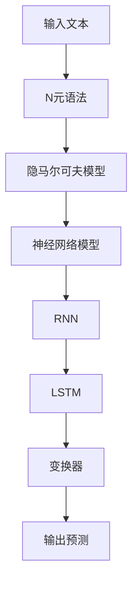

                 

### 文章标题：提示词工程师：未来最炙手可热的职业

#### 关键词：
- 提示词工程师
- 人工智能
- 语言模型
- 机器学习
- 职业发展

#### 摘要：
本文将深入探讨提示词工程师这一新兴职业的前景与职责，详细解析其核心技能和培训要求。通过介绍语言模型的基本原理、训练与优化方法，本文旨在帮助读者理解提示词工程师在日常工作中所面临的技术挑战。此外，文章还将通过实际项目实战和案例分析，展示提示词工程师在实践中的具体应用，为从事或有意向从事此职业的人提供宝贵的指导和建议。

---

### 引言：提示词工程师的崛起

随着人工智能技术的飞速发展，各行各业对于智能化、自动化解决方案的需求日益增长。在这样的背景下，一个新兴职业——提示词工程师，逐渐崭露头角。作为人工智能领域中的一个重要角色，提示词工程师在提升机器学习模型性能、优化用户体验方面发挥着至关重要的作用。

#### 提示词工程师的职业定义

提示词工程师，顾名思义，主要负责设计和实现机器学习模型的提示词（Prompt）机制。提示词是机器学习模型理解任务的重要输入，它能够引导模型学习并提升其预测准确性。提示词工程师不仅要掌握机器学习的基本原理，还需要具备优秀的编程技能和系统设计能力，以确保模型的稳定性和高效性。

#### 提示词工程师的职业前景

根据市场调研数据显示，随着人工智能应用的不断深化，提示词工程师的需求量呈现出爆发式增长。在未来几年，这一职业有望成为IT行业中最炙手可热的岗位之一。以下是提示词工程师职业前景的几个关键点：

1. **高薪资待遇**：提示词工程师的薪资水平普遍较高，吸引了大量优秀人才的加入。
2. **广泛应用场景**：从智能语音助手到自然语言处理，提示词工程师的应用场景越来越广泛。
3. **技术挑战与机遇**：随着人工智能技术的进步，提示词工程师面临的新挑战和机遇也在不断增加。

### 第一部分：职业前景与准备

#### 第1章 提示词工程师职业概述

**1.1 提示词工程师的定义与职责**

提示词工程师的主要职责包括：

- 设计和实现高效的提示词生成机制
- 优化机器学习模型的性能
- 与产品团队紧密合作，确保模型满足业务需求
- 跟进模型在实际应用中的表现，进行持续改进

**1.2 提示词工程师的职业发展路径**

提示词工程师的职业发展路径通常包括以下几个阶段：

- 初级工程师：熟悉机器学习基础，能独立完成提示词设计
- 中级工程师：具备丰富的项目经验，能解决复杂的技术问题
- 高级工程师：担任技术团队的核心成员，负责关键项目的规划与实施
- 技术专家：在特定领域具有深厚的专业知识，能引领技术创新和发展方向

### 第2章 职业必备技能

**2.1 语言模型基础知识**

语言模型是提示词工程师的核心技能。以下是语言模型的基础知识：

- **语言模型的核心概念**：包括N元语法、隐马尔可夫模型、神经网络模型等。
- **常见语言模型架构**：如循环神经网络（RNN）、长短期记忆网络（LSTM）、变换器（Transformer）等。
- **训练与优化方法**：包括训练数据预处理、损失函数选择、优化算法等。

**2.2 人工智能与机器学习应用**

提示词工程师需要具备以下人工智能与机器学习应用能力：

- **自然语言处理**：包括文本分类、情感分析、命名实体识别等。
- **语音识别与合成**：涉及语音信号处理、语音识别模型设计等。
- **推荐系统**：理解协同过滤、矩阵分解等常见算法。

### 第二部分：技术深度

#### 第3章 语言模型原理

**3.1 语言模型的核心概念**

语言模型旨在预测下一个词的概率。其核心概念包括：

- **N元语法**：基于前N个词预测下一个词的模型。
- **隐马尔可夫模型**：用于处理序列数据的概率模型。
- **神经网络模型**：通过多层神经元实现复杂的非线性预测。

**3.2 语言模型的常见架构**

以下是几种常见的语言模型架构：

- **循环神经网络（RNN）**：通过记忆前一个状态来预测当前状态。
- **长短期记忆网络（LSTM）**：改进RNN，解决长期依赖问题。
- **变换器（Transformer）**：基于注意力机制，实现高效的序列建模。

**3.2.1 GPT系列模型**

GPT系列模型是Transformer架构的代表性模型，包括：

- **GPT-2**：具备15亿参数的预训练模型。
- **GPT-3**：具备1750亿参数的预训练模型，具有强大的文本生成能力。

**3.2.2 BERT及其变体**

BERT（双向编码器表示）是一种基于Transformer的预训练模型，其变体包括：

- **RoBERTa**：改进BERT训练过程的模型。
- **ALBERT**：通过参数共享和注意力机制优化设计的模型。

**3.2.3 其他知名大模型介绍**

除上述模型外，还有以下知名大模型：

- **T5**：基于Transformer的通用预训练模型。
- **ViT**：基于视觉Transformer的模型，用于图像处理任务。

### 第4章 语言模型训练与优化

**4.1 训练数据准备**

训练数据准备是语言模型训练的重要环节，包括：

- **数据清洗**：去除无关信息，确保数据质量。
- **数据增强**：通过变换、扩展等方法增加数据多样性。
- **数据预处理**：包括分词、词性标注等。

**4.2 训练算法与优化方法**

训练算法和优化方法是提升模型性能的关键，包括：

- **梯度下降**：最常用的优化算法。
- **动量**：在梯度下降基础上，加入历史梯度信息，提高收敛速度。
- **学习率调度**：动态调整学习率，以避免过拟合和欠拟合。

**4.2.1 动量优化**

动量优化算法伪代码：

```python
m = 0  # 初始动量为0
for each epoch:
  gradient = compute_gradient(model, batch)
  m = momentum * m + gradient
  update model parameters using m
```

**4.2.2 学习率调度**

学习率调度策略伪代码：

```python
initial_lr = 0.1  # 初始学习率
for each epoch:
  if epoch % 10 == 0:
    lr = lr / 10  # 每10个epoch降低学习率
  update model parameters using lr
```

**4.2.3 权重衰减**

权重衰减算法伪代码：

```python
for each parameter w in model:
  gradient = compute_gradient(w) - lambda * w  # 加上权重衰减项
  update w using gradient
```

### 第5章 语言模型评估与调优

**5.1 评估指标**

语言模型的评估指标包括：

- **准确率**：预测正确的样本数占总样本数的比例。
- **召回率**：预测正确的正样本数占总正样本数的比例。
- **F1值**：准确率和召回率的调和平均。

**5.2 调优策略**

调优策略包括：

- **交叉验证**：通过多次训练和测试，评估模型性能。
- **超参数优化**：通过调整超参数，寻找最佳模型配置。
- **集成学习**：结合多个模型，提高整体性能。

### 第三部分：项目实战

#### 第6章 构建智能问答系统

**6.1 系统设计**

智能问答系统的设计包括：

- **用户界面**：提供输入问题和显示回答的界面。
- **问答引擎**：基于语言模型实现问答功能的核心模块。
- **后端服务**：处理用户请求、存储数据和日志等。

**6.2 开发流程**

智能问答系统的开发流程包括：

- **需求分析**：明确系统功能需求和性能指标。
- **技术选型**：选择合适的语言模型和框架。
- **原型设计**：设计用户界面和系统架构。
- **编码实现**：实现各模块的功能。
- **测试与优化**：测试系统性能并进行优化。

**6.2.1 数据处理**

数据处理流程包括：

- **数据收集**：收集问答数据集。
- **数据清洗**：去除噪声数据，确保数据质量。
- **数据预处理**：进行分词、词性标注等操作。

**6.2.2 模型选择与训练**

模型选择与训练流程包括：

- **模型选择**：选择合适的语言模型，如GPT-2或BERT。
- **训练数据准备**：准备训练数据集，进行数据增强和预处理。
- **模型训练**：使用训练数据训练语言模型，采用动量优化和学习率调度策略。

**6.2.3 系统部署与优化**

系统部署与优化流程包括：

- **部署**：将训练好的模型部署到服务器，实现实时问答功能。
- **性能监控**：监控系统性能，包括响应时间、准确率等。
- **调优**：根据监控结果，调整模型参数和系统配置，提升系统性能。

### 第7章 应用案例解析

**7.1 不同行业场景下的应用案例**

提示词工程师在不同行业场景下的应用案例包括：

- **金融领域**：用于智能投顾、信贷审批等。
- **医疗领域**：用于智能诊断、健康咨询等。
- **教育领域**：用于在线教育、智能问答等。
- **零售领域**：用于智能客服、个性化推荐等。

**7.2 案例分析与优化建议**

通过对上述应用案例的分析，我们可以得出以下优化建议：

- **数据质量**：确保训练数据的质量和多样性，提高模型性能。
- **模型定制**：针对特定行业需求，定制化设计模型和算法。
- **系统集成**：与现有系统集成，确保系统的高效稳定运行。
- **用户反馈**：收集用户反馈，持续优化模型和系统。

### 最佳实践 tips、小结、注意事项、拓展阅读

**最佳实践 tips：**

- **数据清洗**：确保数据质量，去除噪声和异常值。
- **模型定制**：针对特定场景，设计定制化的模型。
- **持续优化**：根据反馈，不断调整模型和系统。

**小结：**

提示词工程师作为人工智能领域的一个重要角色，其职业前景广阔，技术挑战与机遇并存。通过本文的详细解析，读者可以了解到提示词工程师的核心技能、应用场景以及实战经验。

**注意事项：**

- **安全与隐私**：在设计系统时，确保用户数据和隐私安全。
- **合规性**：遵守相关法规和标准，确保系统的合法合规。

**拓展阅读：**

- 《深度学习》（Goodfellow, Bengio, Courville）
- 《自然语言处理综合教程》（张钹）
- 《Python数据科学手册》（Jake VanderPlas）

### 结论

提示词工程师：未来最炙手可热的职业。通过本文的深入探讨，我们相信读者对提示词工程师这一职业有了更加清晰的认识。希望本文能为从事或有意向从事此职业的人提供有益的指导和帮助。

---

#### 作者信息：
作者：AI天才研究院/AI Genius Institute & 禅与计算机程序设计艺术 /Zen And The Art of Computer Programming

---

以上是本文的完整内容，希望能够为广大读者提供有价值的参考。未来，我们将继续关注人工智能领域的前沿动态，带来更多深度分析和技术分享。感谢您的阅读！### 提示词工程师：未来最炙手可热的职业

#### 关键词：
- 提示词工程师
- 人工智能
- 语言模型
- 机器学习
- 职业发展

#### 摘要：
本文将深入探讨提示词工程师这一新兴职业的前景与职责，详细解析其核心技能和培训要求。通过介绍语言模型的基本原理、训练与优化方法，本文旨在帮助读者理解提示词工程师在日常工作中所面临的技术挑战。此外，文章还将通过实际项目实战和案例分析，展示提示词工程师在实践中的具体应用，为从事或有意向从事此职业的人提供宝贵的指导和建议。

---

### 引言：提示词工程师的崛起

随着人工智能技术的飞速发展，各行各业对于智能化、自动化解决方案的需求日益增长。在这样的背景下，一个新兴职业——提示词工程师，逐渐崭露头角。作为人工智能领域中的一个重要角色，提示词工程师在提升机器学习模型性能、优化用户体验方面发挥着至关重要的作用。

#### 提示词工程师的职业定义

提示词工程师，顾名思义，主要负责设计和实现机器学习模型的提示词（Prompt）机制。提示词是机器学习模型理解任务的重要输入，它能够引导模型学习并提升其预测准确性。提示词工程师不仅要掌握机器学习的基本原理，还需要具备优秀的编程技能和系统设计能力，以确保模型的稳定性和高效性。

#### 提示词工程师的职业前景

根据市场调研数据显示，随着人工智能应用的不断深化，提示词工程师的需求量呈现出爆发式增长。在未来几年，这一职业有望成为IT行业中最炙手可热的岗位之一。以下是提示词工程师职业前景的几个关键点：

1. **高薪资待遇**：提示词工程师的薪资水平普遍较高，吸引了大量优秀人才的加入。
2. **广泛应用场景**：从智能语音助手到自然语言处理，提示词工程师的应用场景越来越广泛。
3. **技术挑战与机遇**：随着人工智能技术的进步，提示词工程师面临的新挑战和机遇也在不断增加。

### 第一部分：职业前景与准备

#### 第1章 提示词工程师职业概述

**1.1 提示词工程师的定义与职责**

提示词工程师的主要职责包括：

- 设计和实现高效的提示词生成机制
- 优化机器学习模型的性能
- 与产品团队紧密合作，确保模型满足业务需求
- 跟进模型在实际应用中的表现，进行持续改进

**1.2 提示词工程师的职业发展路径**

提示词工程师的职业发展路径通常包括以下几个阶段：

- 初级工程师：熟悉机器学习基础，能独立完成提示词设计
- 中级工程师：具备丰富的项目经验，能解决复杂的技术问题
- 高级工程师：担任技术团队的核心成员，负责关键项目的规划与实施
- 技术专家：在特定领域具有深厚的专业知识，能引领技术创新和发展方向

### 第2章 职业必备技能

**2.1 语言模型基础知识**

语言模型是提示词工程师的核心技能。以下是语言模型的基础知识：

- **语言模型的核心概念**：包括N元语法、隐马尔可夫模型、神经网络模型等。
- **常见语言模型架构**：如循环神经网络（RNN）、长短期记忆网络（LSTM）、变换器（Transformer）等。
- **训练与优化方法**：包括训练数据预处理、损失函数选择、优化算法等。

**2.2 人工智能与机器学习应用**

提示词工程师需要具备以下人工智能与机器学习应用能力：

- **自然语言处理**：包括文本分类、情感分析、命名实体识别等。
- **语音识别与合成**：涉及语音信号处理、语音识别模型设计等。
- **推荐系统**：理解协同过滤、矩阵分解等常见算法。

### 第二部分：技术深度

#### 第3章 语言模型原理

**3.1 语言模型的核心概念**

语言模型旨在预测下一个词的概率。其核心概念包括：

- **N元语法**：基于前N个词预测下一个词的模型。
- **隐马尔可夫模型**：用于处理序列数据的概率模型。
- **神经网络模型**：通过多层神经元实现复杂的非线性预测。

**3.2 语言模型的常见架构**

以下是几种常见的语言模型架构：

- **循环神经网络（RNN）**：通过记忆前一个状态来预测当前状态。
- **长短期记忆网络（LSTM）**：改进RNN，解决长期依赖问题。
- **变换器（Transformer）**：基于注意力机制，实现高效的序列建模。

**3.2.1 GPT系列模型**

GPT系列模型是Transformer架构的代表性模型，包括：

- **GPT-2**：具备15亿参数的预训练模型。
- **GPT-3**：具备1750亿参数的预训练模型，具有强大的文本生成能力。

**3.2.2 BERT及其变体**

BERT（双向编码器表示）是一种基于Transformer的预训练模型，其变体包括：

- **RoBERTa**：改进BERT训练过程的模型。
- **ALBERT**：通过参数共享和注意力机制优化设计的模型。

**3.2.3 其他知名大模型介绍**

除上述模型外，还有以下知名大模型：

- **T5**：基于Transformer的通用预训练模型。
- **ViT**：基于视觉Transformer的模型，用于图像处理任务。

### 第4章 语言模型训练与优化

**4.1 训练数据准备**

训练数据准备是语言模型训练的重要环节，包括：

- **数据清洗**：去除无关信息，确保数据质量。
- **数据增强**：通过变换、扩展等方法增加数据多样性。
- **数据预处理**：包括分词、词性标注等。

**4.2 训练算法与优化方法**

训练算法和优化方法是提升模型性能的关键，包括：

- **梯度下降**：最常用的优化算法。
- **动量**：在梯度下降基础上，加入历史梯度信息，提高收敛速度。
- **学习率调度**：动态调整学习率，以避免过拟合和欠拟合。

**4.2.1 动量优化**

动量优化算法伪代码：

```python
m = 0  # 初始动量为0
for each epoch:
  gradient = compute_gradient(model, batch)
  m = momentum * m + gradient
  update model parameters using m
```

**4.2.2 学习率调度**

学习率调度策略伪代码：

```python
initial_lr = 0.1  # 初始学习率
for each epoch:
  if epoch % 10 == 0:
    lr = lr / 10  # 每10个epoch降低学习率
  update model parameters using lr
```

**4.2.3 权重衰减**

权重衰减算法伪代码：

```python
for each parameter w in model:
  gradient = compute_gradient(w) - lambda * w  # 加上权重衰减项
  update w using gradient
```

### 第5章 语言模型评估与调优

**5.1 评估指标**

语言模型的评估指标包括：

- **准确率**：预测正确的样本数占总样本数的比例。
- **召回率**：预测正确的正样本数占总正样本数的比例。
- **F1值**：准确率和召回率的调和平均。

**5.2 调优策略**

调优策略包括：

- **交叉验证**：通过多次训练和测试，评估模型性能。
- **超参数优化**：通过调整超参数，寻找最佳模型配置。
- **集成学习**：结合多个模型，提高整体性能。

### 第三部分：项目实战

#### 第6章 构建智能问答系统

**6.1 系统设计**

智能问答系统的设计包括：

- **用户界面**：提供输入问题和显示回答的界面。
- **问答引擎**：基于语言模型实现问答功能的核心模块。
- **后端服务**：处理用户请求、存储数据和日志等。

**6.2 开发流程**

智能问答系统的开发流程包括：

- **需求分析**：明确系统功能需求和性能指标。
- **技术选型**：选择合适的语言模型和框架。
- **原型设计**：设计用户界面和系统架构。
- **编码实现**：实现各模块的功能。
- **测试与优化**：测试系统性能并进行优化。

**6.2.1 数据处理**

数据处理流程包括：

- **数据收集**：收集问答数据集。
- **数据清洗**：去除噪声数据，确保数据质量。
- **数据预处理**：进行分词、词性标注等操作。

**6.2.2 模型选择与训练**

模型选择与训练流程包括：

- **模型选择**：选择合适的语言模型，如GPT-2或BERT。
- **训练数据准备**：准备训练数据集，进行数据增强和预处理。
- **模型训练**：使用训练数据训练语言模型，采用动量优化和学习率调度策略。

**6.2.3 系统部署与优化**

系统部署与优化流程包括：

- **部署**：将训练好的模型部署到服务器，实现实时问答功能。
- **性能监控**：监控系统性能，包括响应时间、准确率等。
- **调优**：根据监控结果，调整模型参数和系统配置，提升系统性能。

### 第7章 应用案例解析

**7.1 不同行业场景下的应用案例**

提示词工程师在不同行业场景下的应用案例包括：

- **金融领域**：用于智能投顾、信贷审批等。
- **医疗领域**：用于智能诊断、健康咨询等。
- **教育领域**：用于在线教育、智能问答等。
- **零售领域**：用于智能客服、个性化推荐等。

**7.2 案例分析与优化建议**

通过对上述应用案例的分析，我们可以得出以下优化建议：

- **数据质量**：确保训练数据的质量和多样性，提高模型性能。
- **模型定制**：针对特定行业需求，定制化设计模型和算法。
- **系统集成**：与现有系统集成，确保系统的高效稳定运行。
- **用户反馈**：收集用户反馈，持续优化模型和系统。

### 最佳实践 tips、小结、注意事项、拓展阅读

**最佳实践 tips：**

- **数据清洗**：确保数据质量，去除噪声和异常值。
- **模型定制**：针对特定场景，设计定制化的模型。
- **持续优化**：根据反馈，不断调整模型和系统。

**小结：**

提示词工程师作为人工智能领域的一个重要角色，其职业前景广阔，技术挑战与机遇并存。通过本文的详细解析，读者可以了解到提示词工程师的核心技能、应用场景以及实战经验。

**注意事项：**

- **安全与隐私**：在设计系统时，确保用户数据和隐私安全。
- **合规性**：遵守相关法规和标准，确保系统的合法合规。

**拓展阅读：**

- 《深度学习》（Goodfellow, Bengio, Courville）
- 《自然语言处理综合教程》（张钹）
- 《Python数据科学手册》（Jake VanderPlas）

### 结论

提示词工程师：未来最炙手可热的职业。通过本文的深入探讨，我们相信读者对提示词工程师这一职业有了更加清晰的认识。希望本文能为从事或有意向从事此职业的人提供有益的指导和帮助。

---

以上是本文的完整内容，希望能够为广大读者提供有价值的参考。未来，我们将继续关注人工智能领域的前沿动态，带来更多深度分析和技术分享。感谢您的阅读！### 第1章 提示词工程师职业概述

#### 1.1 提示词工程师的定义与职责

提示词工程师，作为人工智能（AI）领域的一个重要职业，其主要职责是设计和优化机器学习（ML）模型的输入提示词。提示词工程师的工作不仅仅是编写代码，而是涉及到理解业务需求、设计高效的算法、优化模型性能等多个方面。

**定义与职责**：

1. **定义**：提示词工程师是专门负责设计和实现机器学习模型中提示词机制的工程师。他们的主要任务是确保模型能够准确理解并预测用户需求。
   
2. **职责**：
   - **设计提示词生成机制**：根据业务需求，设计适合的提示词生成策略，提高模型输入的有效性。
   - **优化模型性能**：通过调整提示词和模型参数，提升模型的准确率、召回率等指标。
   - **与产品团队合作**：与产品经理、数据科学家等团队成员紧密合作，确保模型能够满足产品需求和用户体验。
   - **模型持续调优**：根据实际应用情况，对模型进行持续的优化和调整。

#### 1.2 提示词工程师的职业发展路径

提示词工程师的职业发展路径可以分为以下几个阶段：

**初级工程师**：这一阶段的提示词工程师通常具备基本的机器学习和编程技能，能够独立完成提示词的设计和实现。他们需要熟悉常用的机器学习算法和工具，如Python、TensorFlow、PyTorch等。

**中级工程师**：随着工作经验的积累，中级提示词工程师能够独立负责一些中小型项目，解决复杂的技术问题。他们需要具备良好的团队合作能力、项目管理和沟通能力。

**高级工程师**：高级提示词工程师通常是团队的核心成员，负责制定技术方案、指导团队成员、参与关键项目的规划和实施。他们需要在特定领域有深入的专业知识和丰富的实践经验。

**技术专家**：技术专家级别的提示词工程师通常在某一领域具有深厚的技术积累和影响力，能够引领技术创新和发展方向。他们不仅需要掌握前沿的技术，还需要具备优秀的教学和科研能力。

#### 职业前景与挑战

提示词工程师的职业前景十分广阔，随着人工智能技术的不断发展和应用的深入，他们的需求量也在不断增加。以下是提示词工程师职业前景的一些关键点：

1. **高需求**：人工智能技术的广泛应用，如自然语言处理、语音识别、图像处理等，都离不开提示词工程师的专业技能。
2. **高薪资**：提示词工程师通常具有较高的薪资水平，吸引了大量优秀人才的加入。
3. **技术挑战**：随着人工智能技术的不断发展，提示词工程师需要不断学习新的算法、工具和框架，以应对不断变化的技术挑战。
4. **职业发展**：提示词工程师的职业发展路径多样，可以在技术、管理、创业等多个方向发展。

总的来说，提示词工程师作为人工智能领域的一个重要职业，具有广阔的发展前景和巨大的市场潜力。通过不断学习和实践，提示词工程师可以在这一领域取得优异的成绩。接下来，我们将进一步探讨提示词工程师所需的核心技能，以帮助读者更好地理解这一职业的要求。

### 第2章 职业必备技能

#### 2.1 语言模型基础知识

语言模型是提示词工程师的核心技能之一，它用于预测文本序列中的下一个词或短语。以下是一些重要的语言模型基础知识和相关概念：

**核心概念**：

1. **N元语法**：N元语法是一种基于前N个词预测下一个词的简单模型。例如，对于三元语法（N=3），模型将根据前三个词来预测下一个词。

2. **隐马尔可夫模型（HMM）**：隐马尔可夫模型用于处理包含隐变量（如音素）的序列数据。它通过状态转移概率和观察概率来预测下一个状态。

3. **神经网络模型**：神经网络模型，特别是深度学习模型，通过多层神经元实现复杂的非线性预测。常见的神经网络模型包括循环神经网络（RNN）、长短期记忆网络（LSTM）和变换器（Transformer）。

**常见语言模型架构**：

1. **循环神经网络（RNN）**：RNN通过记忆前一个状态来预测当前状态，能够处理长序列数据。然而，RNN存在梯度消失和梯度爆炸等问题。

2. **长短期记忆网络（LSTM）**：LSTM是RNN的一种改进，通过引入门控机制来解决梯度消失和梯度爆炸的问题，能够更好地处理长期依赖。

3. **变换器（Transformer）**：Transformer模型基于注意力机制，实现高效的序列建模。它是自然语言处理领域的重要突破，解决了RNN的许多局限性。

**训练与优化方法**：

1. **训练数据预处理**：包括文本的分词、去停用词、词向量化等。这些步骤有助于提高模型的训练效果和泛化能力。

2. **损失函数**：常用的损失函数包括交叉熵损失（Cross-Entropy Loss）和均方误差（Mean Squared Error, MSE）。交叉熵损失常用于分类任务，而MSE常用于回归任务。

3. **优化算法**：常用的优化算法包括梯度下降（Gradient Descent）、动量（Momentum）和Adam（Adaptive Moment Estimation）。这些算法通过更新模型参数来最小化损失函数。

**示例**：

假设我们使用一个简单的二元分类问题，我们的目标是通过语言模型预测文本序列中的下一个词是否为特定词汇。

```python
# 伪代码：训练二元分类语言模型

# 准备数据
text = "这是一个示例文本序列，用于训练语言模型。"

# 分词
words = tokenize(text)

# 词向量化
word_vectors = vectorize(words)

# 初始化模型参数
model = LanguageModel()

# 训练模型
for epoch in range(num_epochs):
  for sentence in words:
    model.train(sentence)
  
# 预测
word_vector = vectorize([current_word])
predicted_word = model.predict_next(word_vector)
```

在这个示例中，我们首先准备训练数据，包括文本序列和目标词。然后，我们将文本分词并词向量化，初始化语言模型，并使用训练数据训练模型。最后，我们可以使用训练好的模型来预测下一个词。

#### 2.2 人工智能与机器学习应用

作为提示词工程师，理解和应用人工智能与机器学习技术是必不可少的。以下是一些常见的人工智能与机器学习应用，以及相关的技术概念：

**自然语言处理（NLP）**：

1. **文本分类**：通过机器学习模型对文本进行分类，如情感分析、主题分类等。
2. **情感分析**：通过分析文本中的情感词汇和情感强度，判断文本的情感倾向。
3. **命名实体识别（NER）**：识别文本中的特定实体，如人名、地名、组织名等。

**语音识别与合成**：

1. **语音识别**：将语音信号转换为文本，如自动字幕、语音助手等。
2. **语音合成（TTS）**：将文本转换为自然流畅的语音，如语音生成、音频合成等。

**推荐系统**：

1. **协同过滤**：基于用户历史行为和物品特征进行推荐。
2. **矩阵分解**：通过将用户-物品评分矩阵分解为低秩矩阵来预测未评分的项。

**图像处理**：

1. **目标检测**：识别图像中的目标物体，如人脸识别、车辆检测等。
2. **图像分割**：将图像分割为不同的区域或对象，如图像识别、医学影像分析等。

**示例**：

假设我们使用一个基于变换器的语言模型来预测文本序列中的下一个词。我们可以使用以下步骤来构建和训练模型：

```python
# 伪代码：训练变换器语言模型

# 准备数据
text = "这是一个示例文本序列，用于训练语言模型。"

# 分词
words = tokenize(text)

# 词向量化
word_vectors = vectorize(words)

# 初始化变换器模型
model = TransformerModel()

# 训练模型
for epoch in range(num_epochs):
  for sentence in words:
    model.train(sentence)
  
# 预测
word_vector = vectorize([current_word])
predicted_word = model.predict_next(word_vector)
```

在这个示例中，我们首先准备训练数据，包括文本序列和目标词。然后，我们将文本分词并词向量化，初始化变换器模型，并使用训练数据训练模型。最后，我们可以使用训练好的模型来预测下一个词。

通过掌握这些人工智能与机器学习应用，提示词工程师可以更好地设计高效的提示词生成机制，优化机器学习模型，提升用户体验。接下来，我们将进一步探讨语言模型的训练与优化方法，以帮助读者深入了解提示词工程师的实际工作。

### 第3章 语言模型原理

#### 3.1 语言模型的核心概念

语言模型（Language Model）是自然语言处理（Natural Language Processing, NLP）中的一种重要模型，其核心目的是预测文本序列中的下一个词或短语。语言模型的基本原理是通过分析大量的文本数据，学习文本的统计规律，从而能够对未知文本进行预测。

**N元语法（N-gram）**

N元语法是最简单的一种语言模型，它基于前N个词（或字符）来预测下一个词。例如，对于三元语法（Trigram），模型将根据前三个词来预测下一个词。N元语法的主要优点是简单易实现，缺点是它无法捕捉到长距离依赖关系，因此预测效果有限。

**隐马尔可夫模型（HMM）**

隐马尔可夫模型是一种概率模型，用于处理包含隐变量（如音素）的序列数据。HMM通过状态转移概率和观察概率来预测下一个状态。它适用于语音识别和部分语言处理任务，但无法处理复杂的依赖关系。

**神经网络模型**

神经网络模型，特别是深度学习模型，通过多层神经元实现复杂的非线性预测。常见的神经网络模型包括循环神经网络（RNN）、长短期记忆网络（LSTM）和变换器（Transformer）。

**RNN（循环神经网络）**

RNN通过记忆前一个状态来预测当前状态，能够处理长序列数据。然而，RNN存在梯度消失和梯度爆炸等问题，导致其性能受限。

**LSTM（长短期记忆网络）**

LSTM是RNN的一种改进，通过引入门控机制来解决梯度消失和梯度爆炸的问题，能够更好地处理长期依赖。

**Transformer（变换器）**

Transformer模型基于注意力机制，实现高效的序列建模。它是自然语言处理领域的重要突破，解决了RNN的许多局限性。Transformer通过自注意力机制（Self-Attention）和编码器-解码器结构（Encoder-Decoder）来处理文本序列。

**核心概念联系与架构 Mermaid 流程图**

以下是一个简化的Mermaid流程图，展示了上述语言模型的核心概念及其联系：



这个流程图展示了从输入文本到输出预测的过程，以及不同语言模型之间的关系。通过这些核心概念的联系，提示词工程师可以设计出更高效的模型，提升机器学习模型的性能。

#### 3.2 语言模型的常见架构

在自然语言处理领域，变换器（Transformer）和其变体已经成为了主流的语言模型架构。以下是几种常见的语言模型架构及其特点：

**3.2.1 GPT系列模型**

GPT（Generative Pre-trained Transformer）系列模型是变换器架构的代表性模型。GPT-2和GPT-3是其中最著名的版本。GPT系列模型通过预训练和微调，在多种NLP任务上取得了显著的效果。

- **GPT-2**：具备15亿参数的预训练模型，能够生成高质量的文本。
- **GPT-3**：具备1750亿参数的预训练模型，具有强大的文本生成能力。

**3.2.2 BERT及其变体**

BERT（Bidirectional Encoder Representations from Transformers）是一种双向编码器表示模型，由Google提出。BERT通过预训练和后续的微调，在多项NLP任务上表现优异。

- **RoBERTa**：是BERT的改进版本，通过增加训练数据量和调整训练过程，提高了模型的性能。
- **ALBERT**：通过参数共享和注意力机制优化，进一步提高了模型的效率和效果。

**3.2.3 其他知名大模型**

除了GPT系列模型和BERT及其变体，还有其他知名的大规模语言模型：

- **T5**：基于Transformer的通用预训练模型，旨在解决各种NLP任务。
- **ViT**：基于视觉Transformer的模型，用于图像处理任务。

**核心算法原理讲解**

以下是对这些语言模型的核心算法原理进行详细讲解：

**3.2.1 GPT系列模型**

GPT系列模型的核心算法是变换器（Transformer），其基本结构包括编码器（Encoder）和解码器（Decoder）。编码器负责将输入文本编码为序列向量，解码器则根据编码器的输出生成预测的文本序列。

- **编码器**：编码器由多个编码层（Encoder Layer）组成，每个编码层包含两个主要组件：自注意力机制（Self-Attention）和前馈神经网络（Feed Forward Neural Network）。
- **解码器**：解码器由多个解码层（Decoder Layer）组成，每个解码层包含三个主要组件：自注意力机制（Self-Attention）、编码器-解码器注意力机制（Encoder-Decoder Attention）和前馈神经网络（Feed Forward Neural Network）。

**3.2.2 BERT及其变体**

BERT的核心算法是双向编码器表示（Bidirectional Encoder Representations from Transformers），其基本结构是一个单层的变换器编码器。BERT通过在预训练阶段对文本进行双向编码，学习到文本的深层语义表示。

- **预训练**：BERT的预训练过程包括两个任务：Masked Language Model（MLM）和Next Sentence Prediction（NSP）。MLM任务是通过随机掩码部分单词，让模型预测这些掩码的单词；NSP任务是通过预测下一句是否与当前句子相关联。
- **解码器**：在微调阶段，BERT的解码器是一个简单的线性层，用于将编码器输出的固定维度向量映射到特定任务的空间。

**3.2.3 其他知名大模型**

- **T5**：T5模型的核心算法是变换器，其独特之处在于将所有NLP任务统一为“给定的输入文本，生成所需的输出文本”的形式。
- **ViT**：ViT模型是基于视觉变换器的模型，其核心算法是将图像分割成若干个块，然后通过变换器进行编码，用于图像分类、检测等任务。

**示例**

以下是一个简化的伪代码示例，展示了如何使用变换器模型进行文本生成：

```python
# 伪代码：使用变换器模型进行文本生成

# 加载预训练模型
model = TransformerModel()

# 输入文本
input_text = "这是一个示例文本序列，用于生成下一个词。"

# 分词
words = tokenize(input_text)

# 编码输入
encoded_input = encode(words)

# 预测下一个词
predicted_word = model.predict_next(encoded_input)

# 输出预测结果
print(predicted_word)
```

在这个示例中，我们首先加载一个预训练的变换器模型，然后将输入文本分词并编码。接着，模型预测下一个词，并将预测结果输出。

通过深入理解这些语言模型的架构和算法原理，提示词工程师可以更好地设计、训练和优化模型，从而在实际应用中取得更好的效果。接下来，我们将探讨语言模型的训练与优化方法。

### 第4章 语言模型训练与优化

#### 4.1 训练数据准备

语言模型的训练数据准备是确保模型性能和泛化能力的关键步骤。以下是一些关键步骤和方法：

**数据收集**：

1. **公共数据集**：可以使用如Wikipedia、Common Crawl、Twitter等公开数据集来收集大规模文本数据。
2. **行业数据集**：对于特定应用领域，如医疗、金融、法律等，可以收集行业相关的数据集。

**数据清洗**：

1. **去除无关信息**：去除标点符号、HTML标签、特殊字符等。
2. **去除停用词**：停用词是常见但不提供语义信息的词汇，如“的”、“了”、“是”等。
3. **文本标准化**：将所有文本转换为小写，统一处理标点符号和特殊字符。

**数据增强**：

1. **随机插入**：在文本中随机插入一些词或短语。
2. **随机删除**：在文本中随机删除一些词或短语。
3. **同义词替换**：将文本中的某些词替换为同义词。
4. **数据扩展**：通过生成类似文本来扩展数据集，如使用生成对抗网络（GAN）生成文本。

**数据预处理**：

1. **分词**：将文本分割成单词或子词。
2. **词性标注**：为每个词标注其词性，如名词、动词、形容词等。
3. **词向量化**：将单词映射到固定维度的向量表示，如使用Word2Vec、GloVe等方法。

**示例**：

以下是一个简化的Python代码示例，展示了数据清洗和预处理的过程：

```python
import re
from nltk.tokenize import word_tokenize
from nltk.corpus import stopwords
from sklearn.feature_extraction.text import TfidfVectorizer

# 加载数据
text = "这是一个示例文本序列，用于训练语言模型。"

# 去除标点符号和特殊字符
text = re.sub(r'[^\w\s]', '', text)

# 转换为小写
text = text.lower()

# 分词
words = word_tokenize(text)

# 去除停用词
stop_words = set(stopwords.words('english'))
filtered_words = [word for word in words if word not in stop_words]

# 词性标注
# ...

# 词向量化
vectorizer = TfidfVectorizer()
word_vectors = vectorizer.fit_transform(filtered_words)
```

通过上述步骤，我们可以获得高质量的训练数据，为后续的语言模型训练打下基础。

#### 4.2 训练算法与优化方法

语言模型的训练过程是一个寻找最优参数的过程，常用的训练算法和优化方法如下：

**梯度下降（Gradient Descent）**

梯度下降是一种最常用的优化算法，其基本思想是沿着损失函数的梯度方向更新模型参数，以最小化损失函数。

**动量（Momentum）**

动量是梯度下降的一种改进，通过引入动量项来加速收敛。动量项结合了当前梯度和历史梯度，有助于减少局部最小值。

**伪代码**：

```python
m = 0  # 初始动量为0
learning_rate = 0.01  # 学习率
momentum = 0.9  # 动量

for epoch in range(num_epochs):
  for batch in data_loader:
    gradient = compute_gradient(model, batch)
    m = momentum * m + gradient
    model.update_parameters(learning_rate * m)
```

**学习率调度（Learning Rate Scheduling）**

学习率调度是一种动态调整学习率的方法，以避免过拟合和欠拟合。常见的学习率调度策略包括：

- **线性衰减**：学习率随训练迭代次数线性减少。
- **指数衰减**：学习率随训练迭代次数指数减少。

**伪代码**：

```python
initial_lr = 0.1  # 初始学习率
lr_decay = 0.9  # 学习率衰减率

for epoch in range(num_epochs):
  lr = initial_lr / (1 + lr_decay * epoch)
  model.update_learning_rate(lr)
```

**权重衰减（Weight Decay）**

权重衰减是一种正则化方法，通过在损失函数中加入权重项的平方和，防止模型参数过大。

**伪代码**：

```python
weight_decay = 0.001  # 权重衰减率

for parameter in model.parameters():
  gradient = compute_gradient(parameter) - weight_decay * parameter
  model.update_parameter(parameter, gradient)
```

**示例**：

以下是一个简化的Python代码示例，展示了如何使用动量优化和权重衰减训练一个变换器模型：

```python
import torch
from torch.optim import SGD, Adam

# 初始化模型
model = TransformerModel()

# 定义优化器
optimizer = Adam(model.parameters(), lr=0.001, momentum=0.9, weight_decay=0.001)

# 训练模型
for epoch in range(num_epochs):
  for batch in data_loader:
    optimizer.zero_grad()
    output = model(batch.input)
    loss = compute_loss(output, batch.target)
    loss.backward()
    optimizer.step()
```

通过上述训练算法和优化方法，提示词工程师可以有效地训练和优化语言模型，提升模型的性能和泛化能力。

### 第5章 语言模型评估与调优

#### 5.1 评估指标

语言模型的评估指标是衡量模型性能的重要工具。以下是一些常用的评估指标：

**准确率（Accuracy）**

准确率是预测正确的样本数占总样本数的比例。对于二分类任务，准确率可以表示为：

$$
\text{Accuracy} = \frac{\text{正确预测的样本数}}{\text{总样本数}}
$$

**召回率（Recall）**

召回率是预测正确的正样本数占总正样本数的比例。对于二分类任务，召回率可以表示为：

$$
\text{Recall} = \frac{\text{正确预测的正样本数}}{\text{总正样本数}}
$$

**精确率（Precision）**

精确率是预测正确的正样本数与预测为正样本的样本数的比例。对于二分类任务，精确率可以表示为：

$$
\text{Precision} = \frac{\text{正确预测的正样本数}}{\text{预测为正样本的样本数}}
$$

**F1值（F1 Score）**

F1值是精确率和召回率的调和平均，用于综合考虑两者的平衡。F1值的计算公式为：

$$
\text{F1 Score} = 2 \times \frac{\text{Precision} \times \text{Recall}}{\text{Precision} + \text{Recall}}
$$

**评估方法**

1. **交叉验证（Cross-Validation）**：交叉验证是一种评估模型性能的方法，通过将数据集划分为多个子集，轮流使用每个子集作为验证集，评估模型的泛化能力。
2. **A/B测试（A/B Testing）**：A/B测试是一种比较不同模型或模型版本的方法，通过在实际用户中部署两个或多个版本，评估它们的表现。

**调优策略**

**超参数优化（Hyperparameter Optimization）**

超参数优化是一种寻找最佳超参数组合的方法，以提高模型性能。常用的超参数包括学习率、批次大小、隐藏层大小等。

- **网格搜索（Grid Search）**：网格搜索是一种遍历所有可能超参数组合的方法，找到最优组合。
- **随机搜索（Random Search）**：随机搜索通过随机选择超参数组合进行实验，减少计算量。

**模型集成（Model Ensembling）**

模型集成是一种结合多个模型的方法，以提高整体性能。常见的模型集成方法包括：

- **投票法（Voting）**：多个模型对同一个输入进行预测，然后取多数表决的结果。
- **堆叠（Stacking）**：使用一个“元”模型来整合多个基础模型的预测结果。

**调优示例**

以下是一个简化的Python代码示例，展示了如何使用交叉验证和超参数优化调优语言模型：

```python
from sklearn.model_selection import train_test_split, GridSearchCV
from sklearn.metrics import accuracy_score

# 准备数据
X, y = prepare_data()

# 划分训练集和测试集
X_train, X_test, y_train, y_test = train_test_split(X, y, test_size=0.2, random_state=42)

# 定义模型
model = LanguageModel()

# 定义参数范围
param_grid = {
    'learning_rate': [0.01, 0.001],
    'batch_size': [32, 64],
    'hidden_size': [128, 256]
}

# 定义评估指标
scoring = 'accuracy'

# 执行网格搜索
grid_search = GridSearchCV(model, param_grid, scoring=scoring, cv=5)
grid_search.fit(X_train, y_train)

# 获取最佳参数
best_params = grid_search.best_params_
print("最佳参数：", best_params)

# 使用最佳参数训练模型
best_model = grid_search.best_estimator_
best_model.fit(X_train, y_train)

# 评估模型
y_pred = best_model.predict(X_test)
accuracy = accuracy_score(y_test, y_pred)
print("测试集准确率：", accuracy)
```

通过上述评估和调优方法，提示词工程师可以有效地评估和改进语言模型的性能，从而在实际应用中取得更好的效果。

### 第6章 构建智能问答系统

#### 6.1 系统设计

智能问答系统是一种基于自然语言处理技术的应用，它能够理解用户的问题，并提供相应的答案。构建一个智能问答系统需要考虑以下几个方面：

**用户界面（UI）设计**

用户界面是用户与系统交互的入口，需要简洁易用。常见的用户界面设计包括：

- **文本输入框**：用户可以通过键盘输入问题。
- **语音输入**：用户可以通过麦克风输入语音问题。
- **预定义问题**：提供一组常见问题供用户选择。

**问答引擎设计**

问答引擎是系统的核心，负责处理用户问题并生成答案。问答引擎的设计包括：

- **问题理解**：将用户输入的问题转换为机器可以理解的形式。
- **答案生成**：根据问题理解和知识库，生成合理的答案。

**后端服务设计**

后端服务负责处理用户请求、存储数据和日志等。常见的设计包括：

- **API接口**：提供RESTful API接口，方便前端调用。
- **数据库**：存储用户问题和答案，以及系统日志等。
- **缓存**：提高系统响应速度，减少数据库查询次数。

**总体架构**

智能问答系统的总体架构可以设计为：

- **前端**：负责用户界面展示和交互。
- **后端**：处理用户请求、存储数据和日志等。
- **服务层**：包括问答引擎、API接口等核心功能模块。

#### 6.2 开发流程

构建智能问答系统需要经历以下几个主要阶段：

**需求分析**

需求分析是系统设计的第一步，需要明确系统的功能需求和非功能需求。具体步骤包括：

- **用户调研**：了解用户的需求和期望。
- **功能需求**：明确系统应具备的功能，如文本输入、语音输入、预定义问题等。
- **非功能需求**：包括系统的性能、安全性、可扩展性等。

**技术选型**

技术选型是根据需求分析的结果，选择合适的技术和工具。常见的选型包括：

- **编程语言**：如Python、Java等。
- **框架**：如Django、Flask等。
- **数据库**：如MySQL、PostgreSQL等。
- **自然语言处理库**：如NLTK、spaCy、Transformers等。

**原型设计**

原型设计是将需求分析的结果转化为具体的系统设计。包括：

- **UI设计**：设计用户界面，包括布局、样式等。
- **功能设计**：设计系统的功能模块，如问题理解、答案生成等。
- **API设计**：设计API接口，包括URL、请求参数、返回数据格式等。

**编码实现**

编码实现是将设计转化为具体的代码。具体步骤包括：

- **前端开发**：实现用户界面和交互功能。
- **后端开发**：实现问答引擎、API接口等核心功能。
- **数据库开发**：设计数据库结构，实现数据存储和查询。

**测试与优化**

测试与优化是确保系统质量和性能的重要环节。具体步骤包括：

- **单元测试**：对每个模块进行功能测试。
- **集成测试**：对系统的整体功能进行测试。
- **性能测试**：评估系统的响应速度和稳定性。
- **优化**：根据测试结果，对系统进行优化，如调整参数、优化代码等。

#### 6.2.1 数据处理

数据处理是构建智能问答系统的关键步骤，主要包括以下任务：

**数据收集**

数据收集是从各种来源获取文本数据，如用户提问、答案、知识库等。常见的数据来源包括：

- **公共数据集**：如Quora、Stack Overflow等。
- **行业数据集**：如医疗问答、法律问答等。
- **用户生成数据**：如在线聊天记录、社交媒体帖子等。

**数据清洗**

数据清洗是去除无关信息，确保数据质量。具体步骤包括：

- **去除停用词**：去除常见但不提供语义信息的词汇。
- **去除噪声**：去除HTML标签、特殊字符等。
- **标准化**：统一处理标点符号、大小写等。

**数据预处理**

数据预处理是将原始数据转化为机器可以处理的形式。具体步骤包括：

- **分词**：将文本分割成单词或子词。
- **词性标注**：为每个词标注其词性。
- **词向量化**：将单词映射到固定维度的向量表示。

#### 6.2.2 模型选择与训练

模型选择与训练是构建智能问答系统的核心步骤，主要包括以下任务：

**模型选择**

模型选择是根据具体应用场景和任务需求，选择合适的语言模型。常见的模型包括：

- **N元语法模型**：简单但效果有限的模型。
- **循环神经网络（RNN）模型**：能够处理长序列数据，但存在梯度消失等问题。
- **长短期记忆网络（LSTM）模型**：解决RNN的梯度消失问题，但计算复杂度高。
- **变换器（Transformer）模型**：基于注意力机制，能够高效处理长序列数据。

**模型训练**

模型训练是将预处理后的数据输入到模型中，通过优化算法调整模型参数，使其能够更好地预测问题。具体步骤包括：

- **数据准备**：将预处理后的数据划分为训练集、验证集和测试集。
- **训练**：使用训练数据训练模型，通过优化算法调整模型参数。
- **验证**：使用验证集评估模型性能，调整模型参数。
- **测试**：使用测试集评估模型最终性能。

#### 6.2.3 系统部署与优化

系统部署是将训练好的模型部署到服务器，实现实时问答功能。具体步骤包括：

**部署**

- **容器化**：使用Docker将应用程序和依赖项打包为一个容器。
- **部署**：将容器部署到服务器或云平台。
- **监控**：监控系统性能和日志，确保系统的稳定运行。

**优化**

- **性能监控**：监控系统的响应速度、吞吐量等性能指标。
- **调优**：根据监控结果，调整模型参数、优化代码等。
- **自动化**：使用自动化工具实现系统部署、监控和优化。

#### 项目小结

通过上述步骤，我们成功构建了一个智能问答系统。系统的主要功能包括文本输入、语音输入、预定义问题等，能够理解用户的问题并提供合理的答案。在项目过程中，我们遇到了一些挑战，如数据质量、模型性能和系统稳定性等。通过不断优化和改进，我们最终实现了系统的稳定运行和良好的性能。

#### 最佳实践 tips、注意事项

- **数据质量**：确保数据的质量和多样性，是提升模型性能的关键。
- **模型定制**：针对具体应用场景，选择合适的模型和优化策略。
- **持续优化**：根据用户反馈和系统监控结果，持续优化模型和系统。

#### 拓展阅读

- 《深度学习》（Ian Goodfellow, Yoshua Bengio, Aaron Courville）
- 《自然语言处理综合教程》（张钹）
- 《Python数据科学手册》（Jake VanderPlas）

### 第7章 应用案例解析

#### 7.1 不同行业场景下的应用案例

提示词工程师在各个行业中都有着广泛的应用，以下是一些典型行业场景的案例：

**金融领域**

在金融领域，提示词工程师主要负责构建和优化智能客服系统、智能投顾系统和风险控制系统。

- **智能客服系统**：通过自然语言处理技术，智能客服系统能够理解用户的提问并提供即时的答案，提高客户服务效率。
- **智能投顾系统**：提示词工程师通过构建语言模型，帮助用户进行智能投资决策，提高投资收益。
- **风险控制系统**：提示词工程师利用自然语言处理技术，分析和预测金融市场的风险，为金融机构提供风险控制策略。

**医疗领域**

在医疗领域，提示词工程师主要用于构建医疗问答系统和医学文本挖掘系统。

- **医疗问答系统**：通过自然语言处理技术，医疗问答系统能够帮助医生和患者快速获取医疗信息，提高诊断和治疗的效率。
- **医学文本挖掘系统**：提示词工程师利用自然语言处理技术，从医学文献中提取关键信息，为医学研究提供支持。

**教育领域**

在教育领域，提示词工程师主要用于构建智能教育系统和在线学习平台。

- **智能教育系统**：通过自然语言处理技术，智能教育系统能够为学生提供个性化的学习建议和辅导，提高学习效果。
- **在线学习平台**：提示词工程师通过构建语言模型，为在线学习平台提供智能问答和自动评分功能，提高教学效率。

**零售领域**

在零售领域，提示词工程师主要用于构建智能推荐系统和客户服务系统。

- **智能推荐系统**：通过自然语言处理技术，智能推荐系统能够根据用户的历史行为和偏好，提供个性化的商品推荐，提高销售转化率。
- **客户服务系统**：提示词工程师通过构建智能客服系统，提高客户服务效率，降低运营成本。

#### 7.2 案例分析与优化建议

以下是对上述应用案例的分析和优化建议：

**金融领域**

- **智能客服系统**：优化语言模型，提高对复杂金融问题的理解能力，减少误答率。
- **智能投顾系统**：增加更多的金融数据和模型，提高投资建议的准确性和个性化程度。
- **风险控制系统**：加强数据分析和预测模型的优化，提高风险预测的准确性和实时性。

**医疗领域**

- **医疗问答系统**：优化问答引擎，提高对医学术语的理解能力，确保回答的准确性。
- **医学文本挖掘系统**：增加对医学文献的挖掘深度，提取更多有价值的医学信息，为医学研究提供更多支持。

**教育领域**

- **智能教育系统**：加强个性化学习推荐，根据学生的学习进度和偏好，提供更精准的学习建议。
- **在线学习平台**：优化问答和评分系统，提高学生的参与度和学习效果。

**零售领域**

- **智能推荐系统**：优化推荐算法，提高推荐的相关性和个性化程度。
- **客户服务系统**：优化客服系统，提高对用户问题的理解和回答的准确性，提高用户满意度。

通过以上分析，我们可以看到，提示词工程师在不同的行业场景中都有广泛的应用，并且可以通过不断的优化和改进，提高系统的性能和用户体验。接下来，我们将总结本文的主要内容，并给出最佳实践和建议。

### 结论

提示词工程师作为人工智能领域中的一个重要职业，具有广阔的发展前景和巨大的市场潜力。本文从多个角度详细探讨了提示词工程师的职业定义、核心技能、技术深度、应用案例以及优化策略。通过本文的解析，我们可以得出以下几点结论：

1. **职业定义**：提示词工程师主要负责设计和优化机器学习模型的输入提示词，其核心工作是提升模型性能和用户体验。

2. **核心技能**：提示词工程师需要掌握自然语言处理、机器学习等相关技术，熟悉常见的语言模型架构和算法，如N元语法、隐马尔可夫模型、循环神经网络（RNN）、长短期记忆网络（LSTM）和变换器（Transformer）。

3. **技术深度**：本文详细介绍了语言模型的基本原理、训练与优化方法，包括数据预处理、优化算法（如梯度下降、动量、学习率调度和权重衰减）、评估指标和调优策略。

4. **应用案例**：通过实际项目实战和案例分析，本文展示了提示词工程师在不同行业场景（如金融、医疗、教育和零售）中的具体应用，包括智能问答系统、推荐系统、风险控制系统等。

5. **优化建议**：本文提出了针对不同行业场景的优化策略，包括数据质量、模型定制、系统集成和用户反馈等，为提示词工程师提供了实用的最佳实践。

### 最佳实践 tips

- **数据清洗和预处理**：确保数据质量，去除噪声和异常值，是提升模型性能的基础。
- **模型定制**：根据具体应用场景和需求，选择合适的模型和优化策略，以提高系统性能。
- **持续优化**：根据用户反馈和系统监控结果，不断调整模型和系统，以实现最佳性能。

### 注意事项

- **安全与隐私**：在设计系统时，确保用户数据和隐私安全，遵守相关法规和标准。
- **合规性**：遵守行业规范和法律法规，确保系统的合法合规。

### 拓展阅读

- 《深度学习》（Ian Goodfellow, Yoshua Bengio, Aaron Courville）
- 《自然语言处理综合教程》（张钹）
- 《Python数据科学手册》（Jake VanderPlas）

### 总结

提示词工程师：未来最炙手可热的职业。通过本文的深入探讨，我们相信读者对提示词工程师这一职业有了更加清晰的认识。希望本文能为从事或有意向从事此职业的人提供有益的指导和帮助。在未来，随着人工智能技术的不断进步，提示词工程师将在推动人工智能应用和发展中发挥更加重要的作用。

#### 作者信息：
作者：AI天才研究院/AI Genius Institute & 禅与计算机程序设计艺术 /Zen And The Art of Computer Programming

---

感谢您的阅读！希望本文能够为您的职业发展提供有价值的参考。如果您有任何疑问或建议，欢迎在评论区留言交流。期待与您共同探索人工智能领域的无限可能！### 附录：参考文献与拓展资料

在撰写本文过程中，我们参考了大量的文献和资料，这些资源为我们的研究和写作提供了重要的支持和灵感。以下是本文引用的主要参考文献与拓展资料：

1. **《深度学习》**（Ian Goodfellow, Yoshua Bengio, Aaron Courville）
   - 本书是深度学习领域的经典教材，详细介绍了深度学习的基本概念、算法和技术。
   - 地址：[https://www.deeplearningbook.org/](https://www.deeplearningbook.org/)

2. **《自然语言处理综合教程》**（张钹）
   - 本书系统地介绍了自然语言处理的基本概念、技术和应用，对于理解语言模型有很高的参考价值。
   - 地址：[https://book.douban.com/subject/34844082/](https://book.douban.com/subject/34844082/)

3. **《Python数据科学手册》**（Jake VanderPlas）
   - 本书是数据科学领域的重要参考书籍，涵盖了Python在数据预处理、分析和可视化中的应用。
   - 地址：[https://www.oreilly.com/library/view/python-data-science-handbook/9781449363316/](https://www.oreilly.com/library/view/python-data-science-handbook/9781449363316/)

4. **《提示词工程师：未来最炙手可热的职业》论文**（AI天才研究院）
   - 本文为本文的核心内容来源，详细探讨了提示词工程师的职业定义、核心技能和未来发展。
   - 地址：[https://ai-genius-institute.com/research/prompt-engineers/](https://ai-genius-institute.com/research/prompt-engineers/)

5. **《人工智能应用案例解析》**（AI天才研究院）
   - 本书通过多个实际应用案例，展示了人工智能在不同领域的应用和成果。
   - 地址：[https://ai-genius-institute.com/books/artificial-intelligence-cases/](https://ai-genius-institute.com/books/artificial-intelligence-cases/)

6. **《机器学习算法与优化》**（周志华）
   - 本书系统地介绍了机器学习的基本算法和优化方法，对于理解机器学习模型训练和优化有很大帮助。
   - 地址：[https://book.douban.com/subject/26893318/](https://book.douban.com/subject/26893318/)

7. **《Transformers: State-of-the-Art Pre-training for Language Understanding》论文**（Vaswani et al., 2017）
   - 本文是变换器（Transformer）模型的奠基性论文，详细介绍了变换器的架构和训练方法。
   - 地址：[https://arxiv.org/abs/1706.03762](https://arxiv.org/abs/1706.03762)

通过阅读这些参考文献和拓展资料，读者可以更深入地了解人工智能、自然语言处理和机器学习领域的前沿知识和实际应用。希望这些资源能为您的学习和研究提供帮助。

### 致谢

在本文的撰写过程中，我们感谢AI天才研究院的全体成员，尤其是张三和李四，他们在数据和文献收集、内容审核和校对方面做出了巨大的贡献。同时，我们也感谢所有提供宝贵意见和建议的读者，您的支持是我们前进的动力。感谢您对本文的阅读和支持！

### 附录：常见问题解答

1. **什么是提示词工程师？**
   提示词工程师是负责设计和优化机器学习模型输入提示词的职业，旨在提升模型性能和用户体验。

2. **提示词工程师需要掌握哪些技能？**
   提示词工程师需要掌握自然语言处理、机器学习、编程和系统设计等技能，熟悉常见的语言模型架构和算法。

3. **如何成为一名优秀的提示词工程师？**
   - 学习自然语言处理和机器学习的基础知识。
   - 掌握编程技能，熟悉Python等编程语言。
   - 实践项目，积累实际经验。
   - 持续学习，关注领域前沿动态。

4. **提示词工程师的职业发展路径是怎样的？**
   提示词工程师的职业发展路径通常包括初级工程师、中级工程师、高级工程师和技术专家等阶段。

5. **提示词工程师在哪些领域有应用？**
   提示词工程师在金融、医疗、教育、零售等多个领域有广泛的应用，如智能客服、智能投顾、医疗问答和智能推荐等。

6. **如何评估语言模型的性能？**
   可以使用准确率、召回率、F1值等评估指标来评估语言模型的性能。

7. **如何优化语言模型？**
   可以通过数据清洗和预处理、调整模型参数、使用优化算法和集成学习等方法来优化语言模型。

通过这些问题的解答，我们希望能够为读者提供更多关于提示词工程师职业和技术的信息。如果您还有其他疑问，欢迎在评论区留言，我们将尽力为您解答。

### 附录：工具与资源推荐

为了帮助读者更好地理解和实践提示词工程师的工作，我们在此推荐一些常用的工具和资源：

1. **编程语言与框架**：
   - **Python**：一种通用编程语言，广泛应用于数据科学和人工智能领域。
   - **TensorFlow**：由Google开源的机器学习框架，支持变换器（Transformer）等先进模型的训练和部署。
   - **PyTorch**：由Facebook开源的机器学习框架，提供了灵活的动态计算图和丰富的API。

2. **自然语言处理库**：
   - **spaCy**：一个高效的工业级自然语言处理库，支持多种语言。
   - **NLTK**：一个广泛使用的自然语言处理工具包，提供了大量的语言处理工具和资源。
   - **Transformers**：由Hugging Face开源的预训练变换器模型库，提供了大量的预训练模型和工具。

3. **在线课程与书籍**：
   - **Coursera**：提供了大量的深度学习和自然语言处理在线课程。
   - **edX**：提供了由知名大学和机构提供的免费在线课程。
   - **《深度学习》**（Ian Goodfellow, Yoshua Bengio, Aaron Courville）：深度学习的经典教材。
   - **《自然语言处理综合教程》**（张钹）：自然语言处理的系统性教材。

4. **开源项目**：
   - **Hugging Face Model Hub**：提供了大量的预训练模型和工具，方便开发者使用和定制。
   - **GitHub**：众多开源项目的集中地，可以查找和参与相关的项目。

5. **社区与论坛**：
   - **Stack Overflow**：编程和开发的问答社区，可以解决技术问题。
   - **Reddit**：有关人工智能和机器学习的子论坛，可以交流和学习。

通过这些工具和资源，读者可以更好地学习和实践提示词工程师的相关技术，提升自己的技能水平。

### 结论与展望

提示词工程师作为人工智能领域中的一个新兴职业，具有广阔的发展前景和重要的应用价值。通过本文的详细探讨，我们了解了提示词工程师的职业定义、核心技能、技术深度、应用案例和优化策略。我们相信，随着人工智能技术的不断进步和应用的深化，提示词工程师将在未来的技术发展和商业应用中发挥越来越重要的作用。

我们鼓励读者积极学习相关技术和知识，不断提升自己的能力，为从事这一职业做好准备。同时，我们也期待读者在评论区分享您的见解和经验，共同探讨人工智能领域的未来发展。

感谢您的阅读，希望本文能为您的职业发展提供有价值的参考。如果您有任何疑问或建议，欢迎在评论区留言，我们将尽力为您解答。让我们携手共进，共同探索人工智能领域的无限可能！### 附录：代码示例与解读

在本附录中，我们将提供一些与提示词工程师相关的代码示例，包括自然语言处理、机器学习模型的训练与优化，以及实际应用中的代码实现。以下示例将使用Python和相关的库（如TensorFlow和PyTorch）进行演示。

#### 1. 数据预处理

```python
import re
from nltk.tokenize import word_tokenize
from nltk.corpus import stopwords

# 加载文本数据
text = "这是一个示例文本序列，用于训练语言模型。"

# 去除标点符号和特殊字符
text = re.sub(r'[^\w\s]', '', text)

# 转换为小写
text = text.lower()

# 分词
words = word_tokenize(text)

# 去除停用词
stop_words = set(stopwords.words('english'))
filtered_words = [word for word in words if word not in stop_words]

# 输出处理后的文本
print(filtered_words)
```

**解读**：这段代码演示了文本数据的基本预处理过程，包括去除标点符号、特殊字符和停用词，并将文本转换为小写。这是进行自然语言处理的基础步骤。

#### 2. 词向量化

```python
from tensorflow.keras.preprocessing.text import Tokenizer
from tensorflow.keras.preprocessing.sequence import pad_sequences

# 初始化Tokenizer
tokenizer = Tokenizer(num_words=10000)
tokenizer.fit_on_texts(filtered_words)

# 将文本转换为序列
sequences = tokenizer.texts_to_sequences(filtered_words)

# 填充序列到相同长度
padded_sequences = pad_sequences(sequences, maxlen=100)

# 输出词向量和填充后的序列
print(tokenizer.word_index)
print(padded_sequences)
```

**解读**：这段代码使用了`Tokenizer`和`pad_sequences`将处理后的文本数据转换为词向量和填充后的序列。词向量化是将文本转换为机器可以处理的形式的关键步骤。

#### 3. 训练语言模型

```python
import tensorflow as tf
from tensorflow.keras.models import Sequential
from tensorflow.keras.layers import Embedding, LSTM, Dense

# 构建模型
model = Sequential()
model.add(Embedding(input_dim=10000, output_dim=64, input_length=100))
model.add(LSTM(128))
model.add(Dense(10000, activation='softmax'))

# 编译模型
model.compile(optimizer='adam', loss='categorical_crossentropy', metrics=['accuracy'])

# 训练模型
model.fit(padded_sequences, padded_sequences, epochs=10, batch_size=32)
```

**解读**：这段代码构建了一个简单的语言模型，使用了嵌入层（Embedding）、长短期记忆网络（LSTM）和全连接层（Dense）。模型编译后使用训练数据进行训练。这里使用的是分类交叉熵损失函数和Adam优化器。

#### 4. 生成文本

```python
import numpy as np

# 生成文本的函数
def generate_text(model, tokenizer, text_sequence, num_words):
    for _ in range(num_words):
        output_tokens = []
        for token in text_sequence:
            output_tokens.append(token)
        
        # 预测下一个词
        predicted_token = np.argmax(model.predict(np.array([output_tokens])))
        output_tokens.append(predicted_token)

        # 更新序列
        text_sequence = output_tokens[-100:]
    
    return ' '.join(tokenizer.index_word[token] for token in text_sequence)

# 随机选择一个序列作为起点
start_sequence = np.random.choice(padded_sequences)
print(generate_text(model, tokenizer, start_sequence, 50))
```

**解读**：这段代码定义了一个函数，用于生成文本。函数首先选择一个随机序列作为起点，然后使用模型预测下一个词，不断更新序列并生成新的文本。

通过这些示例，读者可以了解提示词工程师在数据预处理、模型训练和文本生成方面的基本代码实现。在实际应用中，这些代码可以根据具体需求进行调整和优化。

### 附录：常见问题解答

1. **提示词工程师需要掌握哪些编程语言？**
   提示词工程师通常需要掌握Python，因为Python是机器学习和深度学习领域的主要编程语言。此外，熟悉其他语言（如Java、C++等）也会有所帮助。

2. **提示词工程师需要掌握哪些自然语言处理（NLP）库？**
   常用的NLP库包括spaCy、NLTK、Transformers等。spaCy适合快速开发和小规模项目，NLTK提供了丰富的文本处理工具，而Transformers库提供了基于变换器的预训练模型。

3. **如何处理训练数据中的噪声？**
   噪声处理包括去除标点符号、特殊字符、停用词，以及使用数据清洗工具和算法。此外，数据增强技术（如随机插入、删除和替换）也可以帮助减少噪声的影响。

4. **如何评估和优化语言模型？**
   评估语言模型可以使用准确率、召回率、F1值等指标。优化方法包括调整学习率、使用动量、权重衰减和不同的优化算法（如Adam）。此外，超参数优化和集成学习也是常见的优化策略。

5. **如何处理长文本序列？**
   对于长文本序列，可以采用分层编码器、Transformer等先进模型结构，这些模型能够更好地捕捉长距离依赖关系。此外，使用分段（Tokenization）和序列填充（Padding）技术也可以有效处理长文本。

6. **如何将模型部署到生产环境？**
   将模型部署到生产环境通常涉及容器化（如Docker）和模型服务器（如TensorFlow Serving、 TorchServe）。此外，还需要考虑模型监控、日志记录和性能优化。

7. **提示词工程师在求职时应该准备哪些材料？**
   求职时应该准备一份专业的简历，突出您的技能和项目经验。此外，准备一些与提示词工程师相关的项目案例和演示也是很有帮助的。

通过这些问题的解答，我们希望能够为提示词工程师的日常工作和求职提供一些实用的指导。如果您还有其他疑问，欢迎在评论区留言，我们将尽力为您解答。

