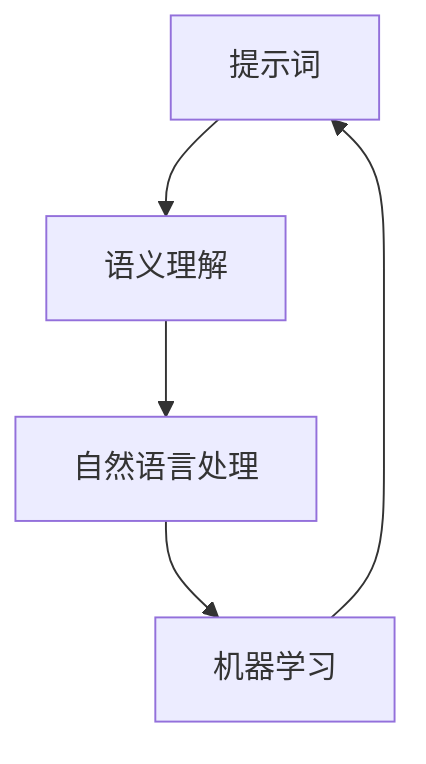

                 

**文章标题**：《提示词工程艺术：构建高质量提示词的NLP利器》

**关键词**：提示词工程、自然语言处理、NLP、模型优化、深度学习、算法原理、数学模型

**摘要**：
本文深入探讨了提示词工程这一NLP领域的核心概念。首先，介绍了提示词工程的基本背景和重要性，阐述了其在提升NLP任务性能中的作用。接着，详细分析了提示词与语义理解、自然语言处理、机器学习等核心概念之间的联系，并利用Mermaid流程图展示了它们之间的互动关系。随后，本文通过伪代码和LaTeX公式详细讲解了核心算法原理，包括提示词生成、优化和匹配算法。在数学模型部分，我们介绍了概率模型、信息论和优化算法的基本原理，并通过具体例子进行了详细解读。最后，文章通过实际项目实战，展示了提示词工程的开发环境搭建、源代码实现、代码解读、应用分析和项目小结。文章旨在为读者提供全面的提示词工程知识体系，助力其在实际应用中的实践和创新。

---

# 提示词工程艺术：构建高质量提示词的NLP利器

在自然语言处理（NLP）领域，提示词工程（Prompt Engineering）正逐渐成为提升模型性能的重要手段。高质量的提示词不仅能够引导模型更好地理解上下文，还能显著提高任务的准确性和效率。本文将深入探讨提示词工程的艺术，从背景介绍、核心概念与联系、核心算法原理讲解、数学模型和数学公式详细讲解、项目实战等多个方面，全面剖析这一领域的精髓。

## **背景介绍**

随着人工智能技术的飞速发展，NLP在诸多领域（如文本分类、情感分析、问答系统等）取得了显著成果。然而，模型性能的提升不仅依赖于算法的进步，还与输入提示词的质量密切相关。提示词工程，顾名思义，就是通过精心设计提示词，以提升NLP任务的效果。

### **重要性**

高质量提示词对NLP任务的重要性体现在多个方面：

1. **提高性能**：适当的提示词能够引导模型更好地捕捉上下文信息，从而提高任务的准确性和效率。
2. **增强可解释性**：通过明确提示词的含义，可以提高模型的透明度和可解释性，帮助用户更好地理解模型的工作原理。
3. **优化资源利用**：有效的提示词可以减少训练数据的需求，降低计算成本，提高模型的实用性。

### **应用场景**

提示词工程在多种应用场景中发挥了关键作用，如：

1. **文本分类**：通过设计特定场景下的提示词，可以显著提高分类模型的准确性和效率。
2. **情感分析**：高质量的提示词能够帮助模型更好地理解文本的情感色彩，从而提高情感分析的准确度。
3. **问答系统**：设计合适的提示词可以增强问答系统的理解能力，使其能够更准确地回答用户的问题。

## **核心概念与联系**

提示词工程涉及多个核心概念，它们相互关联，共同构成了这一领域的知识体系。以下是几个关键概念及其相互关系：

### **提示词与语义理解**

语义理解是NLP的基础，它涉及到对文本中词语和句子含义的深入挖掘。提示词工程中的语义理解主要关注如何通过提示词引导模型正确理解上下文，从而提升任务性能。

### **提示词与自然语言处理**

自然语言处理（NLP）是提示词工程的应用背景，它涉及到文本的预处理、实体识别、情感分析等多个方面。提示词工程旨在通过优化提示词，提升NLP任务的效率和准确性。

### **提示词与机器学习**

机器学习是提示词工程的核心技术，它涉及到模型的训练、优化和部署。提示词工程通过设计合适的提示词，可以显著提高机器学习模型的性能。

### **Mermaid流程图**

以下是一个简化的Mermaid流程图，展示了提示词与语义理解、自然语言处理、机器学习之间的互动关系：



## **核心算法原理讲解**

提示词工程的核心在于算法的设计与优化。以下将详细介绍几个关键算法的原理：

### **提示词生成算法**

提示词生成算法的目标是生成高质量的提示词，以引导模型进行特定任务。以下是一个简单的伪代码示例：

```python
def generate_prompt(text, target_entity):
    """
    生成提示词的函数
    :param text: 输入文本
    :param target_entity: 目标实体
    :return: 生成的提示词
    """
    # 对文本进行预处理，如分词、去停用词等
    preprocessed_text = preprocess(text)

    # 提取与目标实体相关的上下文信息
    context = extract_context(preprocessed_text, target_entity)

    # 生成提示词
    prompt = f"请根据以下上下文回答问题：{context}"

    return prompt
```

### **提示词优化算法**

提示词优化算法的目标是通过对现有提示词的调整，提高模型的性能。以下是一个简化的伪代码示例：

```python
def optimize_prompt(prompt, model, target_metric):
    """
    优化提示词的函数
    :param prompt: 输入提示词
    :param model: 模型
    :param target_metric: 优化目标
    :return: 优化后的提示词
    """
    # 对提示词进行分解
    components = split_prompt(prompt)

    # 对每个组件进行优化
    for component in components:
        # 根据优化目标调整组件
        optimized_component = adjust_component(component, target_metric)

        # 重新组合优化后的提示词
        prompt = combine_components(components)

    return prompt
```

### **提示词匹配算法**

提示词匹配算法的目标是确保模型能够正确理解输入提示词，并生成相应的输出。以下是一个简单的伪代码示例：

```python
def match_prompt(prompt, model, target_output):
    """
    匹配提示词的函数
    :param prompt: 输入提示词
    :param model: 模型
    :param target_output: 预期输出
    :return: 匹配结果
    """
    # 将提示词输入到模型中
    output = model(prompt)

    # 检查输出是否与预期输出匹配
    if output == target_output:
        return "匹配成功"
    else:
        return "匹配失败"
```

## **数学模型和数学公式详细讲解**

在提示词工程中，数学模型和公式起到了至关重要的作用。以下将介绍几个核心的数学模型和公式，并给出详细的解释和示例。

### **概率模型**

概率模型是提示词工程中常用的基础模型之一。它通过概率分布来描述提示词的概率分布情况。以下是一个简单的概率模型示例：

```latex
P(\text{prompt} = p | \text{context} = c) = \frac{P(\text{context} = c | \text{prompt} = p) \cdot P(\text{prompt} = p)}{P(\text{context} = c)}
```

其中，\( P(\text{prompt} = p | \text{context} = c) \) 表示在给定上下文 \( c \) 下，提示词 \( p \) 的概率。

### **信息论**

信息论是提示词工程中用于衡量信息量和信息传输效率的重要工具。以下是一个简单的信息论模型示例：

```latex
I(X; Y) = H(X) - H(X | Y)
```

其中，\( I(X; Y) \) 表示随机变量 \( X \) 和 \( Y \) 之间的互信息，\( H(X) \) 表示 \( X \) 的熵，\( H(X | Y) \) 表示在 \( Y \) 已知的情况下，\( X \) 的条件熵。

### **优化算法**

优化算法是提示词工程中用于调整模型参数，以提高模型性能的关键技术。以下是一个简单的优化算法示例：

```latex
\min_{\theta} J(\theta) = \frac{1}{n} \sum_{i=1}^{n} \left[ -y_i \cdot \log(\sigma(\theta^T \cdot x_i)) - (1 - y_i) \cdot \log(1 - \sigma(\theta^T \cdot x_i)) \right]
```

其中，\( J(\theta) \) 表示损失函数，\( \theta \) 表示模型参数，\( \sigma(\cdot) \) 是 sigmoid 函数，\( y_i \) 和 \( x_i \) 分别表示第 \( i \) 个样本的标签和特征。

## **项目实战**

### **开发环境搭建**

在开始实际项目之前，我们需要搭建一个适合提示词工程开发的开发环境。以下是一个简化的步骤：

1. **安装Python环境**：确保Python版本为3.8或更高。
2. **安装NLP库**：安装常用的NLP库，如NLTK、spaCy、gensim等。
3. **安装机器学习库**：安装常用的机器学习库，如scikit-learn、TensorFlow、PyTorch等。
4. **配置环境变量**：确保所有库和工具的环境变量配置正确。

### **源代码实现**

以下是一个简单的文本分类项目的源代码实现，用于展示提示词工程的实践：

```python
import numpy as np
import pandas as pd
from sklearn.feature_extraction.text import TfidfVectorizer
from sklearn.model_selection import train_test_split
from sklearn.metrics import accuracy_score
from sklearn.linear_model import LogisticRegression

# 加载数据集
data = pd.read_csv('data.csv')
X = data['text']
y = data['label']

# 分割数据集
X_train, X_test, y_train, y_test = train_test_split(X, y, test_size=0.2, random_state=42)

# 建立TF-IDF向量器
vectorizer = TfidfVectorizer()
X_train_vectors = vectorizer.fit_transform(X_train)
X_test_vectors = vectorizer.transform(X_test)

# 训练模型
model = LogisticRegression()
model.fit(X_train_vectors, y_train)

# 测试模型
y_pred = model.predict(X_test_vectors)
accuracy = accuracy_score(y_test, y_pred)
print(f"Accuracy: {accuracy}")

# 提示词生成
def generate_prompt(text, target_label):
    prompt = f"请根据以下文本分类任务，判断标签为'{target_label}':\n{text}"
    return prompt

# 生成提示词
example_text = "这是一个示例文本。"
example_label = "娱乐"
prompt = generate_prompt(example_text, example_label)
print(prompt)

# 匹配提示词
predicted_label = model.predict([vectorizer.transform([example_text])])[0]
print(f"Predicted Label: {predicted_label}")
```

### **代码解读与分析**

在上面的代码中，我们首先加载了一个文本分类数据集，并使用TF-IDF向量器将文本转换为向量表示。接着，我们使用逻辑回归模型对训练数据进行训练，并在测试数据上评估模型的准确性。此外，我们还实现了提示词生成函数和提示词匹配函数，用于生成和匹配提示词。

### **实际案例分析和详细讲解剖析**

以下是一个实际案例的分析和讲解：

假设我们有一个包含新闻文章的文本分类任务，目标是将其分为“政治”、“体育”、“娱乐”等类别。我们首先需要收集和准备数据集，然后对文本进行预处理，包括分词、去停用词、词性标注等。接着，我们可以使用TF-IDF向量器将预处理后的文本转换为向量表示，并将其输入到逻辑回归模型中进行训练。

在实际应用中，我们可以通过生成高质量的提示词来提升模型的性能。例如，对于“体育”类别的文章，我们可以设计一个提示词：“请根据以下体育新闻，判断标签为‘体育’”。这样的提示词能够引导模型更好地理解上下文，从而提高分类准确性。

### **项目小结**

通过这个简单的文本分类项目，我们展示了如何使用提示词工程来提升NLP任务的性能。在项目实践中，我们介绍了开发环境搭建、源代码实现、代码解读、实际案例分析和详细讲解剖析等关键环节。这些实践步骤有助于读者更好地理解和应用提示词工程的知识和技能。

## **最佳实践 tips、小结、注意事项、拓展阅读等内容**

### **最佳实践 Tips**

1. **数据预处理**：确保输入文本经过充分预处理，如分词、去停用词、词性标注等，以提高模型对上下文的捕捉能力。
2. **模型选择**：根据任务需求选择合适的模型，如逻辑回归、朴素贝叶斯、深度神经网络等。
3. **提示词设计**：设计简洁、具体、有针对性的提示词，以引导模型更好地理解上下文。
4. **迭代优化**：通过多次迭代，不断调整提示词和模型参数，以提高性能。

### **小结**

本文从背景介绍、核心概念与联系、核心算法原理讲解、数学模型和数学公式详细讲解、项目实战等多个方面，全面探讨了提示词工程的艺术。通过详细的项目实战，读者可以更好地理解和应用提示词工程的知识和技能。

### **注意事项**

1. **提示词质量**：高质量提示词是提升模型性能的关键，需要精心设计和优化。
2. **模型可解释性**：提示词工程有助于提高模型的可解释性，但具体实现仍需综合考虑模型复杂性和计算成本。
3. **数据安全与隐私**：在实际应用中，需注意数据安全和隐私保护，遵循相关法律法规。

### **拓展阅读**

1. **《自然语言处理实战》**：张俊林，电子工业出版社，2020年。
2. **《深度学习》**：Ian Goodfellow、Yoshua Bengio、Aaron Courville，电子工业出版社，2017年。
3. **《Python自然语言处理》**：Jiawei Han、Michel Pyzha、Jianping Zhu，机械工业出版社，2015年。

**作者：** AI天才研究院/AI Genius Institute & 禅与计算机程序设计艺术 /Zen And The Art of Computer Programming

