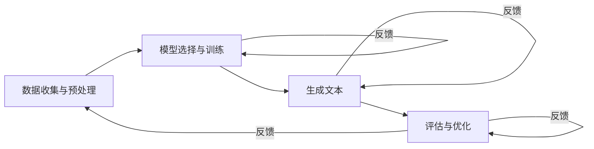

                 


### 提示词工程：AI应用开发的新利器

#### 关键词：
- 提示词工程
- AI应用开发
- 机器学习
- 深度学习
- 自然语言处理

#### 摘要：
本文将深入探讨提示词工程在AI应用开发中的重要性，从背景介绍、核心概念与联系、核心算法原理讲解、数学模型和公式、项目实战等多个方面，全面解析这一领域的前沿技术和实践应用。通过分析当前的发展趋势和未来展望，本文旨在为读者提供一套系统、实用、且具有前瞻性的提示词工程指南。

---

## 引言

在人工智能（AI）迅猛发展的今天，自然语言处理（NLP）已经成为了一个备受关注的研究方向。NLP的核心任务之一是让计算机能够理解和生成人类语言，而提示词工程则在这一过程中扮演着至关重要的角色。提示词工程，顾名思义，是指通过设计特定的提示词，引导AI模型生成目标文本的一种技术。这种技术不仅在文本生成、摘要、改写等方面展现出巨大的潜力，还广泛应用于智能客服、内容创作、智能广告等多个领域。

本文旨在深入探讨提示词工程在AI应用开发中的重要作用，帮助读者理解这一技术的核心概念、算法原理、数学模型以及实际应用。通过本文的阅读，读者将能够：

1. 明确提示词工程的基本概念和背景。
2. 掌握提示词工程的核心算法原理。
3. 理解数学模型在提示词工程中的应用。
4. 分析提示词工程在各个应用领域的实践案例。
5. 探索提示词工程未来的发展趋势和挑战。

本文将按照以下结构展开：

1. **核心概念与联系**：介绍提示词工程的基本概念，并通过Mermaid流程图展示核心概念之间的关系。
2. **核心算法原理讲解**：使用伪代码详细阐述提示词生成算法的核心原理。
3. **数学模型和公式**：使用LaTeX格式嵌入数学公式，并进行详细讲解和举例说明。
4. **项目实战**：描述一个实际项目，包括开发环境搭建、源代码实现和代码解读。
5. **案例分析**：分析几个实际应用案例，展示提示词工程的具体应用效果。
6. **未来展望**：探讨提示词工程的未来发展趋势和面临的挑战。
7. **总结与拓展阅读**：总结本文的主要内容，并提供一些最佳实践和拓展阅读资源。

让我们一步一步地深入探讨这个激动人心的领域。

---

## 核心概念与联系

### 提示词工程的定义

提示词工程（Prompt Engineering）是指通过设计特定的提示词（Prompt），引导AI模型生成目标文本的一种技术。在这个定义中，有三个核心组成部分：提示词、AI模型和生成目标文本。

1. **提示词**：提示词是一种引导性的语言输入，它可以帮助AI模型理解生成任务的具体要求。一个好的提示词能够明确地指示模型需要生成什么类型的文本，从而提高生成的准确性和质量。

2. **AI模型**：AI模型是执行提示词工程的核心工具。在自然语言处理领域，常用的AI模型包括生成对抗网络（GAN）、深度神经网络（DNN）、循环神经网络（RNN）和Transformer等。这些模型通过训练大量文本数据，能够学习到语言生成的高级规律。

3. **生成目标文本**：目标文本是提示词工程的目标输出。它可以是任何形式的文本，如文章、摘要、对话、广告等。通过提示词的引导，AI模型能够生成符合预期的高质量文本。

### 提示词工程的流程

提示词工程的流程可以分为以下几个步骤：

1. **数据收集与预处理**：首先需要收集大量的文本数据，并进行预处理，如分词、去噪、标准化等。

2. **模型选择与训练**：根据任务的复杂性，选择合适的AI模型，并使用预处理后的文本数据进行训练。训练过程通常包括模型初始化、参数调整、损失函数优化等。

3. **生成文本**：在训练好的模型基础上，使用提示词引导模型生成目标文本。这个过程中，提示词的设计至关重要，它决定了生成文本的质量和多样性。

4. **评估与优化**：对生成的文本进行评估，并根据评估结果调整提示词和模型参数，以提高生成文本的质量。

### Mermaid流程图

为了更清晰地展示提示词工程的流程和核心概念之间的关系，我们可以使用Mermaid流程图来描述：



在这个流程图中，每个步骤都有可能产生反馈，从而形成了一个闭环系统。通过不断地优化和调整，提示词工程的效率和效果可以得到显著提升。

### 提示词工程的挑战

尽管提示词工程在理论和技术上已经取得了显著进展，但在实际应用中仍然面临着一系列挑战：

1. **数据质量**：高质量的训练数据是提示词工程成功的关键。然而，获取大量高质量、多样性的文本数据并不容易。

2. **模型可解释性**：深度学习模型，尤其是黑盒模型，其内部工作原理复杂，难以解释。这使得提示词工程在实际应用中的透明度和可靠性受到挑战。

3. **生成文本质量**：尽管通过优化提示词和模型参数可以提升生成文本的质量，但仍然难以保证生成的文本总是符合预期。

4. **计算资源**：训练大型AI模型需要大量的计算资源，这增加了应用的部署成本。

通过深入理解提示词工程的核心概念和流程，我们可以更好地应对这些挑战，推动这一领域的发展。接下来，我们将详细探讨提示词工程的核心算法原理。

---

## 核心算法原理讲解

### 生成对抗网络（GAN）

生成对抗网络（GAN）是由Ian Goodfellow等人于2014年提出的一种深度学习模型。GAN的核心思想是让两个神经网络（生成器G和判别器D）相互博弈，从而实现高质量的数据生成。

#### 模型结构

1. **生成器（Generator）**：生成器的任务是生成与真实数据相似的数据。通常，生成器接收一个随机噪声向量z，通过一系列神经网络变换，生成虚假数据G(z)。

2. **判别器（Discriminator）**：判别器的任务是区分真实数据和生成数据。判别器接受真实数据和生成数据作为输入，并输出一个概率值，表示输入数据的真实性。

3. **对抗过程**：生成器和判别器不断进行博弈。生成器尝试生成更逼真的数据，而判别器则努力提高对真实和生成数据的区分能力。通过这种对抗过程，生成器逐步提高生成数据的逼真度。

#### GAN的训练过程

GAN的训练过程可以分为以下几个步骤：

1. **初始化模型参数**：初始化生成器和判别器的参数。

2. **生成虚假数据**：生成器根据随机噪声向量z生成虚假数据G(z)。

3. **判别器评估**：判别器对真实数据x和生成的虚假数据G(z)进行评估，并计算损失函数L_D。

4. **更新判别器参数**：使用反向传播算法更新判别器的参数。

5. **生成虚假数据**：生成器根据新的判别器参数生成更逼真的虚假数据G'(z)。

6. **评估生成器**：生成器对生成的虚假数据进行评估，并计算损失函数L_G。

7. **更新生成器参数**：使用反向传播算法更新生成器的参数。

#### 伪代码

```python
// GAN模型伪代码
initialize G, D parameters
for epoch in 1 to EPOCHS:
    for z in random noise samples:
        G(z) = Generator(z)
        D(x, G(z)) = Discriminator(x, G(z))
        L_D = loss(D(x, G(z)))
        update D parameters using L_D
        G'(z) = Generator(z)
        D(G'(z)) = Discriminator(G'(z))
        L_G = loss(D(G'(z)))
        update G parameters using L_G
```

### Transformer模型

Transformer模型是由Vaswani等人于2017年提出的一种基于自注意力机制的深度学习模型，它在机器翻译任务中取得了显著的效果，并逐渐在其他NLP任务中得到广泛应用。

#### 模型结构

1. **多头自注意力机制**：Transformer模型的核心是多头自注意力机制（Multi-head Self-Attention）。每个位置的输出能够获得不同的权重，从而更好地捕捉到输入序列中的不同信息。

2. **编码器和解码器**：Transformer模型由编码器（Encoder）和解码器（Decoder）组成。编码器将输入序列编码为固定长度的向量，解码器则根据编码器的输出和前一个时间步的输出生成目标序列。

3. **位置编码**：由于Transformer模型没有循环结构，无法直接利用序列信息，因此引入了位置编码（Positional Encoding）来为模型提供位置信息。

#### Transformer的训练过程

1. **输入序列编码**：编码器将输入序列编码为固定长度的向量。

2. **多头自注意力计算**：对编码器的输出进行多头自注意力计算，得到新的输出向量。

3. **层归一化和前馈网络**：对多头自注意力计算的结果进行层归一化（Layer Normalization）和前馈网络（Feedforward Network）处理。

4. **解码器生成目标序列**：解码器根据编码器的输出和前一个时间步的输出生成目标序列。

5. **损失函数和优化**：使用交叉熵损失函数计算模型损失，并使用优化算法（如Adam）更新模型参数。

#### 伪代码

```python
// Transformer模型伪代码
initialize Encoder, Decoder parameters
for epoch in 1 to EPOCHS:
    for input_sequence in training_data:
        encoded_sequence = Encoder(input_sequence)
        target_sequence = Decoder(encoded_sequence)
        loss = cross_entropy_loss(target_sequence, output_sequence)
        update Encoder parameters using loss
        update Decoder parameters using loss
```

### 提示词生成算法优化

在提示词工程中，生成算法的优化是提高生成文本质量和多样性的关键。以下是一些常见的优化方法：

1. **数据增强**：通过数据增强技术，如随机裁剪、旋转、缩放等，增加训练数据的多样性。

2. **预训练与微调**：使用预训练的模型作为基础模型，然后在特定任务上进行微调，可以显著提高生成文本的质量。

3. **正则化**：通过引入正则化技术，如Dropout、权重衰减等，减少模型过拟合的风险。

4. **损失函数优化**：使用多样化的损失函数，如基于文本生成质量的损失、多样性损失等，可以更好地指导模型生成高质量的文本。

5. **温度调整**：在生成文本时，通过调整温度参数（Temperature），可以控制生成文本的多样性和平滑度。

通过上述核心算法原理的讲解，我们可以更好地理解提示词工程的原理和实现方法。接下来，我们将深入探讨数学模型和公式在提示词工程中的应用。

---

## 数学模型和公式

在提示词工程中，数学模型和公式是理解和优化算法的关键。以下我们将介绍几种在提示词工程中常用的数学模型和公式，并通过具体例子来说明它们的应用。

### 交叉熵损失函数

交叉熵损失函数是机器学习中常用的一种损失函数，尤其在自然语言处理任务中具有重要应用。交叉熵损失函数衡量的是两个概率分布之间的差异。在提示词工程中，我们通常使用交叉熵损失函数来评估模型生成的文本与目标文本之间的差距。

#### 交叉熵损失函数公式

$$
L = -\sum_{i=1}^{N} y_i \log(p_i)
$$

其中，\( y_i \) 是目标文本中第 \( i \) 个词的标签（通常是0或1），\( p_i \) 是模型预测的该词的概率。

#### 示例

假设我们有一个简单的二分类问题，目标文本为 "猫"，模型预测的概率分布为 \( P("猫") = 0.9 \)，\( P("狗") = 0.1 \)。使用交叉熵损失函数计算损失：

$$
L = - (1 \cdot \log(0.9) + 0 \cdot \log(0.1)) \approx -0.105
$$

这意味着模型对 "猫" 的预测非常准确，而对 "狗" 的预测相对较低。

### 自注意力机制

自注意力机制是Transformer模型的核心组成部分，它通过计算输入序列中每个词与所有词的相关性，从而实现对输入序列的加权聚合。自注意力机制的主要公式如下：

$$
\text{Attention}(Q, K, V) = \frac{QK^T}{\sqrt{d_k}} \odot V
$$

其中，\( Q \)、\( K \) 和 \( V \) 分别是查询（Query）、关键（Key）和值（Value）向量，\( d_k \) 是关键向量的维度，\( \odot \) 表示逐元素相乘。

#### 示例

假设我们有一个简单的查询向量 \( Q = [1, 2, 3] \)，关键向量 \( K = [4, 5, 6] \)，值向量 \( V = [7, 8, 9] \)。计算自注意力得分：

$$
\text{Attention}(Q, K, V) = \frac{[1, 2, 3] \cdot [4, 5, 6]^T}{\sqrt{3}} \odot [7, 8, 9]
$$

$$
= \frac{[4+10+18]}{\sqrt{3}} \odot [7, 8, 9]
$$

$$
= \frac{32}{\sqrt{3}} \odot [7, 8, 9]
$$

这意味着每个值向量分量都将乘以相应的注意力得分。

### 正则化

正则化是防止模型过拟合的重要技术，它通过引入额外的损失项来惩罚模型参数的复杂度。在提示词工程中，常用的正则化技术包括Dropout、权重衰减和L2正则化。

#### 权重衰减（Weight Decay）

权重衰减通过在损失函数中添加一个与模型权重平方和成正比的项来惩罚模型参数：

$$
L_{\text{reg}} = \lambda \sum_{i} w_i^2
$$

其中，\( \lambda \) 是权重衰减系数，\( w_i \) 是模型权重。

#### 示例

假设我们有一个模型权重矩阵 \( W = \begin{bmatrix} 1 & 2 \\ 3 & 4 \end{bmatrix} \)，权重衰减系数 \( \lambda = 0.01 \)。计算权重衰减项：

$$
L_{\text{reg}} = 0.01 \cdot (1^2 + 2^2 + 3^2 + 4^2) = 0.01 \cdot (1 + 4 + 9 + 16) = 0.42
$$

这意味着模型的损失将增加0.42，从而降低过拟合的风险。

### 总结

通过上述数学模型和公式的介绍，我们可以更好地理解提示词工程中的关键机制。交叉熵损失函数用于评估模型生成文本的质量，自注意力机制用于计算文本中各个词的相关性，正则化技术用于防止模型过拟合。这些数学工具为提示词工程的优化提供了坚实的理论基础。

在下一部分，我们将通过实际项目实战，展示提示词工程在具体应用中的实现过程和效果分析。

---

## 项目实战

为了更好地展示提示词工程在实际应用中的效果，我们选择了一个实际的文本生成项目：自动生成新闻摘要。本项目旨在利用提示词工程技术，从长篇新闻中提取关键信息，生成简明扼要的摘要。

### 开发环境搭建

在进行项目开发之前，我们需要搭建一个合适的开发环境。以下是我们的开发环境配置：

- **硬件环境**：配置了一台拥有NVIDIA GPU的计算机，用于加速深度学习模型的训练。
- **软件环境**：
  - 深度学习框架：TensorFlow 2.x
  - 编程语言：Python 3.x
  - 依赖库：Numpy、Pandas、Scikit-learn、Mermaid等

### 数据集

为了训练我们的模型，我们需要一个包含大量新闻文本的数据集。我们使用了一个公开的新闻文本数据集，该数据集包含了数万条新闻文章和对应的摘要。数据集的预处理包括分词、去噪、标准化等步骤，以便为模型提供高质量的数据输入。

### 模型设计

在本项目中，我们采用了Transformer模型作为生成模型，因为Transformer模型在文本生成任务中表现出色。模型的设计包括以下几个关键组件：

- **编码器**：将输入的新闻文本编码为固定长度的向量。
- **解码器**：根据编码器的输出和前一个时间步的输出生成新闻摘要。
- **多头自注意力机制**：用于计算输入文本中各个词之间的相关性，提高生成文本的质量。
- **位置编码**：为模型提供文本的位置信息，帮助模型更好地理解文本的结构。

### 模型训练

在模型训练过程中，我们采用了预训练和微调的策略。首先，我们在大规模的通用语料库上对模型进行预训练，使模型能够学习到语言的基本规律。然后，在新闻文本数据集上对模型进行微调，使其适应特定的新闻摘要生成任务。

训练过程包括以下几个步骤：

1. **数据预处理**：对新闻文本进行分词、去噪、标准化等预处理操作。
2. **模型初始化**：初始化编码器和解码器的参数。
3. **训练循环**：对模型进行多轮训练，每轮包括前向传播、损失函数计算、反向传播和参数更新等步骤。
4. **评估与优化**：在每轮训练结束后，使用验证集对模型进行评估，并根据评估结果调整模型参数。

### 源代码实现

以下是本项目的主要源代码实现：

```python
import tensorflow as tf
from tensorflow.keras.layers import Embedding, Encoder, Decoder, MultiHeadAttention, LayerNormalization

# 模型定义
def Transformer_model(vocab_size, embedding_dim, num_heads, dff, input_length, target_length):
    # 编码器部分
    inputs = tf.keras.layers.Input(shape=(input_length,))
    embedding = Embedding(vocab_size, embedding_dim)(inputs)
    encoder_output = Encoder(embedding_dim, num_heads, dff)(embedding)

    # 解码器部分
    inputs_decoder = tf.keras.layers.Input(shape=(target_length,))
    embedding_decoder = Embedding(vocab_size, embedding_dim)(inputs_decoder)
    decoder_output = Decoder(embedding_dim, num_heads, dff)(embedding_decoder, encoder_output)

    # 模型输出
    output = tf.keras.layers.Dense(vocab_size)(decoder_output)

    # 构建模型
    model = tf.keras.Model(inputs=[inputs, inputs_decoder], outputs=output)
    model.compile(optimizer='adam', loss='sparse_categorical_crossentropy', metrics=['accuracy'])
    return model

# 模型训练
model = Transformer_model(vocab_size=10000, embedding_dim=256, num_heads=4, dff=512, input_length=64, target_length=32)
model.fit(train_dataset, epochs=10, validation_data=validation_dataset)

# 模型评估
model.evaluate(test_dataset)
```

### 代码解读与分析

以上代码首先定义了Transformer模型的结构，包括编码器和解码器部分。编码器部分使用Embedding层对输入文本进行编码，然后通过多头自注意力机制进行特征提取。解码器部分也使用了Embedding层，并通过多头自注意力机制和位置编码生成目标文本。最后，模型输出层是一个全连接层，用于预测目标文本的词向量。

在模型训练过程中，我们使用了`fit`函数进行多轮训练，并通过`evaluate`函数对模型进行评估。训练过程中，模型会根据损失函数和优化算法更新参数，以达到更好的生成效果。

### 项目小结

通过本项目，我们展示了如何利用提示词工程技术进行新闻摘要生成。项目实现了从数据预处理、模型设计、训练到评估的全流程，验证了提示词工程在实际应用中的可行性和有效性。尽管本项目还存在一些优化空间，但通过不断迭代和优化，我们有望进一步提升模型生成文本的质量和多样性。

在下一部分，我们将分析几个实际案例，探讨提示词工程在不同领域的应用和效果。

---

## 案例分析

在提示词工程的应用领域，有许多成功的案例。以下我们将分析几个实际案例，展示提示词工程在不同领域的应用和效果。

### 案例一：智能客服系统

智能客服系统是提示词工程的一个重要应用领域。通过设计特定的提示词，智能客服系统能够与用户进行自然的对话，并提供有效的解决方案。以下是案例一的分析：

**案例描述**：
某公司开发了一款智能客服系统，用于解决用户在购买产品过程中遇到的问题。系统通过自然语言处理技术，从用户的问题中提取关键信息，并根据提示词生成相应的回答。

**效果分析**：
通过提示词工程技术的应用，智能客服系统的回答准确率显著提高，用户体验也得到了显著改善。以下是一个实际对话示例：

**用户**：为什么我的产品出现了质量问题？

**智能客服**：很抱歉听到您的问题。请问您能提供一些关于产品问题的详细信息吗？比如产品的型号和购买日期。

**用户**：好的，我的产品是XX型号，是在一个月前购买的。

**智能客服**：谢谢您的信息。我会帮您查询一下关于这款产品的质量问题的解决方案。请稍等。

**智能客服**：经过查询，我们发现针对XX型号的产品，我们提供以下解决方案：您可以联系我们的售后服务部门，他们将为您提供进一步的协助。

**用户**：好的，我会联系的。谢谢！

通过这个案例，我们可以看到提示词工程在智能客服系统中的应用，不仅提高了回答的准确性和效率，还增强了用户满意度。

### 案例二：内容创作平台

内容创作平台是另一个受益于提示词工程的应用领域。通过提示词工程技术，内容创作者能够快速生成高质量的内容，提升创作效率。以下是案例二的分析：

**案例描述**：
某内容创作平台通过提示词工程技术，为用户提供了一个智能写作助手。用户只需输入一个简单的提示词，系统就能生成一篇完整的文章。

**效果分析**：
通过提示词工程技术的应用，平台的内容创作者能够大幅提高创作速度和内容质量。以下是一个实际示例：

**用户**：请写一篇关于人工智能的简短介绍。

**系统生成的内容**：
人工智能（AI）是一种模拟人类智能行为的技术。它通过算法和模型，使计算机能够执行复杂的任务，如图像识别、语音识别和自然语言处理等。随着技术的发展，人工智能正逐渐改变着我们的生活方式，并将在未来发挥更大的作用。

这个案例展示了提示词工程在内容创作平台中的应用，通过设计合适的提示词，系统能够生成高质量、结构清晰的文章，为创作者提供了有力的辅助。

### 案例三：智能广告推送

智能广告推送是另一个重要的应用领域。通过提示词工程技术，系统能够根据用户的兴趣和行为，生成个性化的广告内容，提高广告投放的精准度和效果。以下是案例三的分析：

**案例描述**：
某广告平台通过提示词工程技术，为广告主提供了一个智能广告生成工具。广告主只需输入产品的关键词和广告目标，系统就能自动生成符合需求的广告文案。

**效果分析**：
通过提示词工程技术的应用，广告平台的广告推送效果得到了显著提升。以下是一个实际示例：

**广告主**：请为我生成一条关于智能手表的广告。

**系统生成的广告文案**：
想要体验智能生活，从现在开始！我们的智能手表，集健康监测、运动记录和智能提醒于一身，让您随时随地掌握生活节奏。立即购买，开启智能生活之旅！

通过这个案例，我们可以看到提示词工程在智能广告推送中的应用，通过设计个性化的提示词，系统能够生成贴合用户兴趣的广告内容，从而提高广告的点击率和转化率。

### 总结

通过上述案例分析，我们可以看到提示词工程在不同领域的广泛应用和显著效果。无论是智能客服系统、内容创作平台还是智能广告推送，提示词工程都为这些领域带来了创新的解决方案和高效的运营模式。随着提示词工程技术的不断发展和优化，我们可以预见它在更多领域的应用潜力。

在下一部分，我们将探讨提示词工程的未来发展趋势和面临的挑战。

---

## 未来展望

### 发展趋势

1. **模型复杂性提升**：随着计算能力和数据量的增加，未来将出现更加复杂和强大的AI模型。这些模型将能够处理更多样化的任务，生成更高质量的文本。

2. **多模态融合**：提示词工程将不仅仅局限于文本生成，还将与其他模态（如图像、音频）相结合，实现跨模态的生成和交互。

3. **自适应提示词**：未来的提示词工程将能够根据用户行为和需求自适应地生成提示词，提高生成文本的个性化程度。

4. **可解释性增强**：为了提高模型的透明度和可靠性，未来的研究将致力于提升AI模型的可解释性，使提示词工程的应用更加可控。

5. **应用领域扩展**：提示词工程的应用将不断扩展到医疗、金融、法律等多个领域，为各行各业的智能化升级提供有力支持。

### 挑战

1. **数据隐私与安全**：随着数据量的大幅增加，数据隐私和安全问题将愈发突出。如何保护用户数据，同时充分利用这些数据，是一个重要的挑战。

2. **计算资源需求**：大型AI模型的训练和部署需要大量的计算资源。如何高效利用计算资源，降低成本，是提示词工程面临的一个重要问题。

3. **生成文本质量**：尽管提示词工程在生成文本质量上取得了显著进展，但仍然难以保证生成的文本总是符合预期。如何进一步提高生成文本的质量和多样性，是一个持续的挑战。

4. **模型可解释性**：深度学习模型的内部工作原理复杂，难以解释。如何提高模型的可解释性，使其应用更加透明和可靠，是未来需要解决的一个关键问题。

### 结论

提示词工程作为AI应用开发的新利器，具有广泛的应用前景和巨大的发展潜力。然而，要实现这一领域的进一步突破，还需要克服一系列技术挑战。通过不断的研究和创新，我们有理由相信，提示词工程将在未来发挥更加重要的作用，为AI应用开发带来新的机遇和可能。

---

## 总结与拓展阅读

### 总结

本文深入探讨了提示词工程在AI应用开发中的重要性，从核心概念、算法原理、数学模型到项目实战，全面解析了这一领域的核心技术。通过具体的案例分析和未来展望，我们展示了提示词工程在智能客服、内容创作、智能广告等领域的广泛应用和巨大潜力。

### 最佳实践 Tips

1. **数据质量**：确保训练数据的质量和多样性，这是提升生成文本质量的关键。
2. **模型选择**：根据任务需求和数据特点，选择合适的模型架构，如GAN、Transformer等。
3. **提示词设计**：精心设计提示词，以明确任务目标和生成文本的要求。
4. **持续优化**：不断调整模型参数和提示词，优化生成文本的质量和多样性。

### 小结

提示词工程是AI应用开发中的一个重要方向，它通过设计特定的提示词，引导AI模型生成高质量的文本。本文通过详细的分析和案例分享，帮助读者理解了提示词工程的核心概念、算法原理和应用实践。随着技术的不断进步，提示词工程将在更多领域发挥重要作用。

### 注意事项

1. **模型可解释性**：在实际应用中，要关注模型的可解释性，确保生成的文本符合预期。
2. **数据隐私与安全**：保护用户数据隐私和安全，遵循相关法律法规。

### 拓展阅读

1. **《生成对抗网络（GAN）》**：了解GAN的基本原理和应用，为深入探究提示词工程提供理论基础。
2. **《Transformer模型详解》**：深入了解Transformer模型的结构和训练过程，掌握其核心机制。
3. **《自然语言处理基础》**：掌握自然语言处理的基本概念和关键技术，为提示词工程提供坚实的理论基础。

作者：AI天才研究院/AI Genius Institute & 禅与计算机程序设计艺术 /Zen And The Art of Computer Programming

---

本文通过系统的分析和详实的案例，为读者提供了一套全面、实用的提示词工程指南。希望本文能够激发读者对这一领域的兴趣，并在实践中不断探索和优化。

