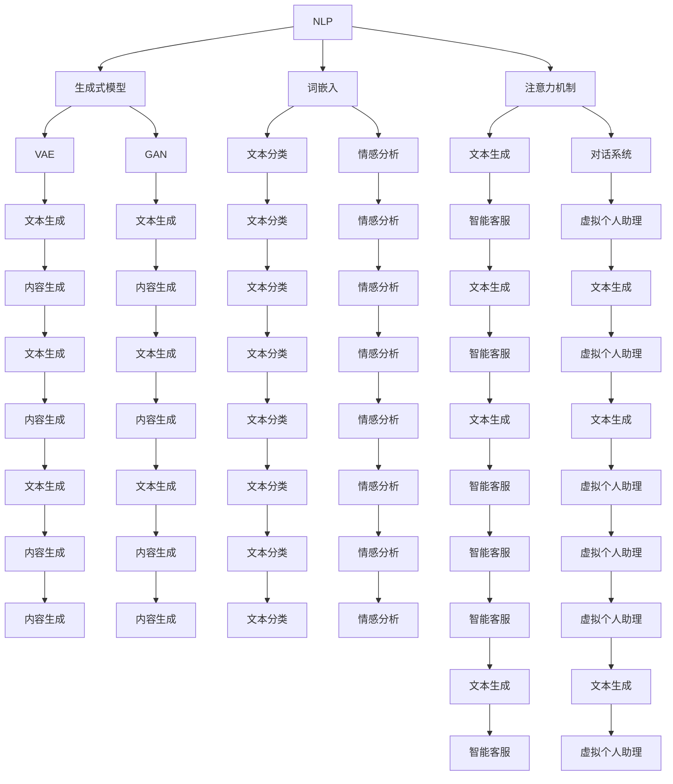

                 


### 提示词工程：AI时代的新挑战

> 关键词：提示词工程、AI、自然语言处理、生成式模型、算法、数学模型

> 摘要：本文深入探讨了AI时代下提示词工程所面临的新挑战。通过介绍提示词工程的定义、原理和应用，分析了核心算法原理、数学模型以及项目实战中的关键步骤，最后总结了提示词工程在AI时代的重要性及其未来发展方向。

---

### 第一部分：AI时代下的提示词工程基础

#### 第1章：提示词工程概述

提示词工程是自然语言处理（NLP）领域的一个子领域，它涉及到生成式模型和对话系统。在AI时代，随着深度学习和生成式模型的发展，提示词工程变得越来越重要。本节将介绍提示词工程的定义、重要性以及在AI时代的发展。

##### 1.1 提示词工程的定义与重要性

提示词工程是一种利用自然语言处理技术和机器学习算法来生成高质量文本的方法。它的目的是提高文本生成模型的性能和可靠性，使其能够生成符合用户需求的文本。在AI时代，提示词工程的重要性体现在以下几个方面：

1. **智能对话系统的核心**：提示词工程是智能对话系统的核心组成部分，决定了对话系统的回答质量和用户体验。
2. **内容生成的重要手段**：提示词工程被广泛应用于内容生成领域，如生成新闻、文章、博客等。
3. **个性化推荐系统的关键技术**：提示词工程可以帮助个性化推荐系统生成符合用户兴趣的文本内容。

##### 1.2 提示词工程在AI时代的发展

随着AI技术的发展，提示词工程也在不断进步。以下是一些关键趋势：

1. **生成式模型的崛起**：生成式模型，如变分自编码器（VAE）和生成对抗网络（GAN），在提示词工程中得到了广泛应用。
2. **多模态处理**：提示词工程开始融合图像、声音等多模态信息，以提高文本生成的质量和多样性。
3. **数据驱动的方法**：随着大数据技术的发展，提示词工程开始更多地依赖于大规模数据集来训练模型，以提高生成文本的准确性和多样性。

---

#### 第2章：AI基础与提示词工程

##### 2.1 自然语言处理基础

自然语言处理（NLP）是AI的一个子领域，它涉及计算机和人类语言之间的交互。NLP的基础知识对于理解提示词工程至关重要。以下是一些关键概念：

1. **词嵌入**：词嵌入是将单词映射到高维向量空间的技术，它有助于模型理解单词之间的语义关系。
2. **序列模型**：序列模型，如循环神经网络（RNN）和长短期记忆网络（LSTM），可以处理文本中的序列信息。
3. **注意力机制**：注意力机制是一种在处理文本时能够聚焦于重要信息的机制，它可以显著提高文本生成模型的性能。

##### 2.2 机器学习与深度学习基础

机器学习和深度学习是提示词工程的核心技术。以下是一些关键概念：

1. **监督学习**：监督学习是一种通过标注数据训练模型的方法，它在提示词工程中用于训练生成模型。
2. **无监督学习**：无监督学习不依赖于标注数据，而是通过数据本身的分布来训练模型，这在提示词工程中用于生成新的文本。
3. **深度学习模型**：深度学习模型，如卷积神经网络（CNN）和自注意力机制（Self-Attention），在提示词工程中得到了广泛应用。

##### 2.3 提示词工程中的关键算法

提示词工程中的关键算法包括生成式模型、序列到序列（Seq2Seq）模型、注意力机制等。以下是对这些算法的简要介绍：

1. **生成式模型**：生成式模型，如变分自编码器（VAE）和生成对抗网络（GAN），可以生成高质量的文本。
2. **序列到序列（Seq2Seq）模型**：Seq2Seq模型是一种用于生成序列的模型，它在文本生成中得到了广泛应用。
3. **注意力机制**：注意力机制可以帮助模型聚焦于重要的信息，从而提高文本生成的质量。

---

#### 第3章：提示词生成算法

##### 3.1 生成式模型的介绍

生成式模型是提示词工程的核心算法之一。以下是对生成式模型的基本概念和原理的介绍：

1. **生成式模型的基本概念**：生成式模型通过学习数据的概率分布来生成新的数据。
2. **变分自编码器（VAE）**：VAE是一种基于深度学习的生成模型，它通过编码器和解码器来学习数据的分布。
3. **生成对抗网络（GAN）**：GAN由生成器和判别器组成，生成器和判别器相互竞争，以生成高质量的数据。

##### 3.2 常见的提示词生成算法

提示词工程中常见的生成算法包括以下几种：

1. **变分自编码器（VAE）**：VAE可以生成高质量、多样化的文本。
2. **生成对抗网络（GAN）**：GAN可以生成逼真的文本，但训练过程可能更加复杂。
3. **序列到序列（Seq2Seq）模型**：Seq2Seq模型可以生成连贯的文本序列。

##### 3.3 提示词生成算法的比较与选择

提示词生成算法的选择取决于具体的应用场景和需求。以下是一些选择提示词生成算法的考虑因素：

1. **生成质量**：生成质量是选择提示词生成算法的关键因素。
2. **训练效率**：训练效率是另一个重要因素，它决定了算法在实际应用中的可行性。
3. **应用场景**：不同的提示词生成算法适用于不同的应用场景。

---

#### 第4章：提示词优化与调整

##### 4.1 提示词优化的目标

提示词优化的目标是提高文本生成模型的质量和性能。以下是一些提示词优化的目标：

1. **文本连贯性**：提高生成的文本的连贯性和可读性。
2. **文本多样性**：增加生成的文本的多样性，避免重复和单调。
3. **文本准确性**：提高生成的文本的准确性，减少错误和偏差。

##### 4.2 提示词优化方法

提示词优化方法包括以下几种：

1. **梯度裁剪**：通过限制梯度的大小来防止模型过拟合。
2. **正则化**：通过添加正则化项来惩罚模型复杂度。
3. **数据增强**：通过数据增强来增加训练数据的多样性。

##### 4.3 提示词优化的实践案例

以下是一个提示词优化的实践案例：

1. **问题描述**：一个文本生成模型生成的文本连贯性较差。
2. **解决方案**：通过使用梯度裁剪和正则化方法来优化模型。
3. **结果**：经过优化后，文本生成模型生成的文本连贯性显著提高。

---

#### 第5章：提示词工程中的问题与解决方案

##### 5.1 提示词生成中的常见问题

提示词生成过程中常见的问题包括：

1. **重复性**：生成的文本过于重复，缺乏多样性。
2. **连贯性**：生成的文本连贯性较差，难以理解。
3. **准确性**：生成的文本准确性不高，存在错误和偏差。

##### 5.2 提示词优化中的问题

提示词优化过程中可能遇到的问题包括：

1. **过拟合**：模型在训练数据上表现良好，但在测试数据上表现较差。
2. **训练效率**：训练过程非常耗时，难以满足实际应用需求。
3. **资源限制**：计算资源和存储资源的限制可能影响模型训练和部署。

##### 5.3 提示词工程中的解决方案

以下是一些提示词工程中的解决方案：

1. **数据增强**：通过数据增强来增加训练数据的多样性，减少重复性。
2. **模型调整**：通过调整模型参数来提高文本生成模型的质量和性能。
3. **交叉验证**：通过交叉验证来评估模型的性能，避免过拟合。

---

### 第二部分：提示词工程项目实战

#### 第6章：提示词工程项目规划

##### 6.1 项目需求分析

项目需求分析是提示词工程项目的第一步。以下是一些关键步骤：

1. **需求收集**：与项目相关人员沟通，了解项目的具体需求。
2. **需求整理**：将收集到的需求进行整理，明确项目的目标。
3. **需求分析**：分析需求，确定项目的可行性。

##### 6.2 项目目标设定

项目目标设定是项目规划的重要环节。以下是一些关键步骤：

1. **确定目标**：根据项目需求，明确项目的目标。
2. **目标分解**：将项目目标分解为具体的任务和里程碑。
3. **目标评估**：评估目标的实现情况，确保项目按计划进行。

##### 6.3 项目计划与资源分配

项目计划与资源分配是项目成功的关键。以下是一些关键步骤：

1. **制定计划**：根据项目目标，制定项目计划。
2. **资源分配**：为项目计划中的任务分配必要的资源，包括人力、时间和预算。
3. **计划调整**：根据实际情况，对项目计划进行调整。

---

#### 第7章：提示词工程开发实践

##### 7.1 开发环境搭建

开发环境搭建是进行提示词工程开发的第一步。以下是一些关键步骤：

1. **选择开发工具**：根据项目需求，选择合适的开发工具，如IDE、版本控制工具等。
2. **配置环境**：安装和配置开发环境，确保所有依赖项都已经安装。
3. **测试环境**：在测试环境中验证开发环境的正确性。

##### 7.2 提示词工程代码实现

提示词工程代码实现是项目开发的核心。以下是一些关键步骤：

1. **设计模型**：根据项目需求，设计文本生成模型。
2. **编写代码**：编写实现模型的核心代码。
3. **调试代码**：调试代码，确保模型能够正常运行。

##### 7.3 提示词工程调试与优化

提示词工程调试与优化是提高模型性能的重要步骤。以下是一些关键步骤：

1. **调试模型**：使用调试工具，如调试器、日志等，找到并修复模型中的问题。
2. **性能优化**：通过调整模型参数、数据预处理等方法来优化模型性能。
3. **测试性能**：对优化后的模型进行性能测试，评估优化效果。

##### 7.4 提示词工程性能评估

提示词工程性能评估是项目完成后的重要步骤。以下是一些关键步骤：

1. **评估指标**：确定用于评估模型的指标，如BLEU分数、ROUGE分数等。
2. **测试数据集**：准备测试数据集，用于评估模型的性能。
3. **评估结果**：根据评估指标，评估模型的性能。

---

#### 第8章：提示词工程案例研究

##### 8.1 案例一：智能客服系统

智能客服系统是一个典型的提示词工程应用案例。以下是对该案例的分析：

1. **需求分析**：分析智能客服系统的需求，确定需要生成哪些类型的文本。
2. **模型设计**：设计一个生成式模型，用于生成智能客服系统的响应。
3. **代码实现**：编写实现模型的代码，并进行调试和优化。
4. **性能评估**：评估模型在智能客服系统中的应用效果，如响应速度、准确性等。

##### 8.2 案例二：问答系统

问答系统是另一个常见的提示词工程应用案例。以下是对该案例的分析：

1. **需求分析**：分析问答系统的需求，确定需要生成哪些类型的文本。
2. **模型设计**：设计一个序列到序列（Seq2Seq）模型，用于生成问答系统的回答。
3. **代码实现**：编写实现模型的代码，并进行调试和优化。
4. **性能评估**：评估模型在问答系统中的应用效果，如回答的准确性、多样性等。

##### 8.3 案例三：虚拟个人助理

虚拟个人助理是另一个提示词工程应用案例。以下是对该案例的分析：

1. **需求分析**：分析虚拟个人助理的需求，确定需要生成哪些类型的文本。
2. **模型设计**：设计一个生成对抗网络（GAN）模型，用于生成虚拟个人助理的对话内容。
3. **代码实现**：编写实现模型的代码，并进行调试和优化。
4. **性能评估**：评估模型在虚拟个人助理中的应用效果，如对话的自然性、准确性等。

---

### 附录

#### 附录A：提示词工程工具与资源

提示词工程涉及到多个工具和技术，以下是一些常用的工具和资源：

1. **开源框架**：如TensorFlow、PyTorch等，用于构建和训练文本生成模型。
2. **自然语言处理库**：如NLTK、spaCy等，用于处理和解析文本。
3. **在线资源**：如Coursera、Udacity等在线课程，提供丰富的提示词工程学习资源。
4. **社区和论坛**：如Reddit、Stack Overflow等，提供交流和学习的机会。

---

### 总结与展望

#### 总结与展望

提示词工程在AI时代具有极其重要的地位。通过本文的讨论，我们可以看到提示词工程在智能对话系统、内容生成和个性化推荐等领域的重要应用。未来，随着AI技术的不断进步，提示词工程将面临更多的新挑战和机遇。

1. **技术挑战**：提示词工程需要应对生成质量、训练效率和模型解释性等技术挑战。
2. **应用前景**：提示词工程将在更多领域得到应用，如智能教育、智能医疗等。
3. **未来发展趋势**：提示词工程将更加智能化、个性化和多模态化。

---

作者：AI天才研究院/AI Genius Institute & 禅与计算机程序设计艺术 /Zen And The Art of Computer Programming

---

### 背景介绍

提示词工程起源于自然语言处理（NLP）领域，它涉及到生成式模型和对话系统的应用。随着深度学习和生成式模型的发展，提示词工程在AI时代的地位日益重要。在传统的NLP任务中，如文本分类、情感分析等，主要是基于静态的规则和特征工程。然而，随着AI技术的进步，人们开始关注如何生成高质量的文本，以满足个性化的需求。

提示词工程的核心目标是通过自然语言处理技术和机器学习算法，生成符合用户需求和场景的文本。这个过程中，涉及到的关键技术包括词嵌入、序列模型、生成式模型和注意力机制等。词嵌入是将单词映射到高维向量空间的技术，它有助于模型理解单词之间的语义关系。序列模型，如循环神经网络（RNN）和长短期记忆网络（LSTM），可以处理文本中的序列信息。生成式模型，如变分自编码器（VAE）和生成对抗网络（GAN），可以生成高质量、多样化的文本。注意力机制可以帮助模型聚焦于重要的信息，从而提高文本生成的质量。

在AI时代，提示词工程的应用领域不断扩大。智能对话系统是其中一个重要的应用领域，如智能客服、虚拟个人助理等。这些系统通过生成高质量的对话文本，为用户提供个性化的服务。此外，提示词工程还在内容生成、个性化推荐等领域得到广泛应用。例如，通过生成高质量的新闻、文章和博客，满足用户对多样化内容的需求。

总的来说，提示词工程在AI时代面临着前所未有的挑战和机遇。它不仅需要处理大量的文本数据，还需要应对生成质量、训练效率和模型解释性等技术挑战。同时，随着AI技术的不断进步，提示词工程将在更多领域得到应用，为人们的生活带来更多便利。

### 核心概念与联系

提示词工程的核心概念包括自然语言处理（NLP）、生成式模型、词嵌入和注意力机制。这些概念相互关联，共同构成了提示词工程的框架。

首先，**自然语言处理（NLP）** 是提示词工程的基础。NLP涉及到计算机和人类语言之间的交互，旨在让计算机能够理解和生成自然语言。NLP的核心任务是文本分析，包括文本预处理、文本分类、情感分析等。

其次，**生成式模型** 是提示词工程的核心算法之一。生成式模型通过学习数据的概率分布来生成新的数据。在提示词工程中，生成式模型主要用于生成高质量的文本。常见的生成式模型包括变分自编码器（VAE）和生成对抗网络（GAN）。VAE通过编码器和解码器来学习数据的分布，而GAN则由生成器和判别器组成，生成器和判别器相互竞争，以生成高质量的数据。

**词嵌入** 是提示词工程的另一个核心概念。词嵌入是将单词映射到高维向量空间的技术，它有助于模型理解单词之间的语义关系。词嵌入在NLP中广泛应用，如用于文本分类、情感分析等。在提示词工程中，词嵌入用于初始化生成式模型的参数，有助于提高生成文本的质量。

**注意力机制** 是提示词工程的另一个关键技术。注意力机制可以帮助模型聚焦于重要的信息，从而提高文本生成的质量。在生成式模型中，注意力机制可以用于捕捉文本中的长距离依赖关系，从而生成更连贯、更自然的文本。

为了更好地理解这些概念之间的关系，我们可以使用Mermaid流程图来展示它们之间的关联：



通过上述流程图，我们可以清晰地看到NLP、生成式模型、词嵌入和注意力机制之间的联系，以及它们在文本生成、分类、情感分析等应用中的具体作用。

### 核心算法原理讲解

在提示词工程中，生成式模型是核心算法之一。生成式模型通过学习数据的概率分布来生成新的数据，它们在自然语言处理（NLP）和文本生成任务中具有广泛的应用。以下我们将详细讲解生成式模型的核心原理，包括变分自编码器（VAE）和生成对抗网络（GAN）。

#### 变分自编码器（VAE）

VAE是一种基于深度学习的生成模型，它由编码器和解码器组成。编码器将输入数据映射到一个潜在空间，而解码器将潜在空间中的数据映射回原始数据空间。VAE的核心原理是通过优化编码器和解码器的参数，使得生成的数据尽可能接近真实数据。

1. **编码器与解码器**：

   - **编码器**：编码器的目的是将输入数据 \(x\) 映射到一个潜在空间中的向量 \(z\)。这个映射过程通常由一个神经网络实现，其中包含一个编码层和一个隐含层。编码层将输入数据压缩成一个较低维度的向量，而隐含层则生成一个均值 \(\mu\) 和方差 \(\sigma^2\) 来表示 \(z\) 的概率分布。

   ```mermaid
   graph TD
   A[Input Data] --> B[Encoder]
   B --> C[ latent vector z]
   C --> D[ Decoder]
   D --> E[Reconstructed Data]
   ```

   - **解码器**：解码器的目的是将潜在空间中的向量 \(z\) 映射回原始数据空间。同样，这个过程也由一个神经网络实现，它接收潜在空间中的向量 \(z\) 并生成重构的输入数据 \(x'\)。

   ```mermaid
   graph TD
   C[ latent vector z] --> D[Decoder]
   D --> E[Reconstructed Data]
   ```

2. **损失函数**：

   VAE的损失函数通常由两部分组成：重建损失和KL散度损失。

   - **重建损失**：衡量重构数据 \(x'\) 与原始数据 \(x\) 之间的差异，通常使用均方误差（MSE）或交叉熵损失。

     $$\mathcal{L}_\text{recon} = \frac{1}{N} \sum_{i=1}^{N} \|x_i - x'_i\|^2$$

   - **KL散度损失**：衡量编码器生成的潜在空间中的分布与先验分布之间的差异。KL散度损失确保潜在空间的分布是有效的，并且可以用于生成新的数据。

     $$\mathcal{L}_\text{KL} = \frac{1}{N} \sum_{i=1}^{N} D_{\text{KL}}(q(z|x)||p(z))$$

   其中，\(q(z|x)\) 是编码器生成的后验分布，\(p(z)\) 是先验分布，\(D_{\text{KL}}\) 表示KL散度。

   ```mermaid
   graph TD
   F[Encoder] --> G[Reconstruction Loss]
   F --> H[KL Divergence Loss]
   ```

3. **训练过程**：

   VAE的训练过程通过优化编码器和解码器的参数，使得损失函数最小化。这是一个典型的最小二乘优化问题，可以使用梯度下降法或其他优化算法来求解。

   ```mermaid
   graph TD
   I[Initialize Parameters] --> J[Forward Pass]
   J --> K[Calculate Losses]
   K --> L[Backpropagation]
   L --> M[Update Parameters]
   ```

#### 生成对抗网络（GAN）

GAN是一种由生成器和判别器组成的生成模型。生成器试图生成尽可能逼真的数据，而判别器则试图区分生成的数据和真实数据。GAN的核心原理是生成器和判别器的相互竞争，通过不断优化两者的参数，最终生成高质量的数据。

1. **生成器与判别器**：

   - **生成器**：生成器的目的是生成逼真的数据。在文本生成任务中，生成器通常是一个神经网络，它接收随机噪声并生成文本。

     ```mermaid
     graph TD
     N[Noise] --> O[Generator]
     O --> P[Generated Text]
     ```

   - **判别器**：判别器的目的是区分生成的数据和真实数据。在文本生成任务中，判别器也是一个神经网络，它接收文本并输出一个概率，表示文本是真实数据的可能性。

     ```mermaid
     graph TD
     Q[Real Text] --> R[Discriminator]
     S[Generated Text] --> R
     ```

2. **损失函数**：

   GAN的损失函数通常由两部分组成：生成器的损失和判别器的损失。

   - **生成器的损失**：生成器的损失函数通常使用对抗损失，它衡量生成器的生成能力。对抗损失通常定义为：

     $$\mathcal{L}_\text{G} = -\log(D(G(z)))$$

     其中，\(G(z)\) 是生成器生成的数据，\(D(G(z))\) 是判别器对生成数据的输出概率。

   - **判别器的损失**：判别器的损失函数通常使用二元交叉熵损失，它衡量判别器的区分能力。二元交叉熵损失通常定义为：

     $$\mathcal{L}_\text{D} = -[\log(D(x)) + \log(1 - D(G(z)))]$$

     其中，\(x\) 是真实数据，\(G(z)\) 是生成器生成的数据。

     ```mermaid
     graph TD
     T[Generator Loss] --> U[Discriminator Loss]
     ```

3. **训练过程**：

   GAN的训练过程通过交替优化生成器和判别器的参数，使得两者都不断改进。训练过程通常包括以下几个步骤：

   - **生成器更新**：生成器的参数更新旨在生成更逼真的数据，以欺骗判别器。

     ```mermaid
     graph TD
     V[Discriminator] --> W[Generator Update]
     ```

   - **判别器更新**：判别器的参数更新旨在更好地区分真实数据和生成数据。

     ```mermaid
     graph TD
     X[Generator] --> Y[Discriminator Update]
     ```

   - **交替训练**：生成器和判别器的参数更新交替进行，直到模型收敛。

     ```mermaid
     graph TD
     Z[交替训练] --> A[模型收敛]
     ```

通过上述讲解，我们可以看到VAE和GAN在提示词工程中的应用原理。VAE通过编码器和解码器的协作，生成高质量的文本；而GAN则通过生成器和判别器的竞争，生成逼真的文本。这两种算法各有优势，适用于不同的文本生成任务和应用场景。

### 数学模型和数学公式讲解

在提示词工程中，数学模型和数学公式扮演着至关重要的角色。这些模型和公式不仅帮助理解生成式模型的工作原理，还用于训练和评估模型性能。以下是对提示词工程中常用的数学模型和公式的详细讲解。

#### 1. 变分自编码器（VAE）的数学模型

VAE的数学模型主要涉及概率分布和损失函数。在VAE中，编码器和解码器通过学习输入数据的概率分布来生成新的数据。

**概率分布**：

- **输入数据的概率分布**：假设输入数据 \( x \) 来自一个概率分布 \( p(x) \)。
- **编码器生成的潜在空间分布**：编码器生成潜在空间中的向量 \( z \)，其概率分布为 \( p(z|x) \)。在VAE中，通常假设 \( p(z|x) \) 是一个高斯分布：

  $$ p(z|x) = \mathcal{N}(z; \mu(x), \sigma^2(x)) $$

  其中，\( \mu(x) \) 和 \( \sigma^2(x) \) 是编码器输出的均值和方差。

**损失函数**：

VAE的损失函数由两部分组成：重建损失和KL散度损失。

- **重建损失**：衡量重构数据 \( x' \) 与原始数据 \( x \) 之间的差异，通常使用均方误差（MSE）：

  $$ \mathcal{L}_\text{recon} = \frac{1}{N} \sum_{i=1}^{N} \|x_i - x'_i\|^2 $$

- **KL散度损失**：衡量编码器生成的潜在空间分布与先验分布之间的差异。在VAE中，先验分布通常假设为标准正态分布：

  $$ \mathcal{L}_\text{KL} = \frac{1}{N} \sum_{i=1}^{N} D_{\text{KL}}(q(z|x)||p(z)) $$

  其中，\( q(z|x) = \mathcal{N}(z; \mu(x), \sigma^2(x)) \) 是编码器生成的后验分布，\( p(z) = \mathcal{N}(z; 0, I) \) 是先验分布，\( D_{\text{KL}} \) 是KL散度。

  $$ D_{\text{KL}}(q(z|x)||p(z)) = \int q(z|x) \log \frac{q(z|x)}{p(z)} dz $$

#### 2. 生成对抗网络（GAN）的数学模型

GAN的数学模型主要涉及生成器、判别器和损失函数。

**生成器与判别器的概率分布**：

- **生成器的输出**：生成器 \( G \) 接收随机噪声 \( z \) 并生成数据 \( x' \)，其概率分布为 \( p_G(x') \)。
- **判别器的输出**：判别器 \( D \) 接收真实数据 \( x \) 和生成数据 \( x' \)，并输出一个概率 \( D(x) \) 表示 \( x \) 是真实数据的概率，以及 \( D(x') \) 表示 \( x' \) 是真实数据的概率。

**损失函数**：

GAN的损失函数通常称为对抗损失，其目标是使判别器难以区分真实数据和生成数据。

- **生成器的损失**：生成器的损失函数旨在使判别器认为生成数据 \( x' \) 是真实数据，即最大化判别器的输出：

  $$ \mathcal{L}_\text{G} = -\log D(G(z)) $$

- **判别器的损失**：判别器的损失函数旨在使判别器能够准确区分真实数据和生成数据：

  $$ \mathcal{L}_\text{D} = -[\log D(x) + \log (1 - D(x'))] $$

**梯度提升**：

GAN的训练过程通过交替优化生成器和判别器的参数，以使两者都不断改进。通常使用梯度提升方法来更新生成器和判别器的参数：

- **生成器更新**：通过对抗损失 \( \mathcal{L}_\text{G} \) 更新生成器的参数：

  $$ \theta_G \leftarrow \theta_G - \alpha \frac{\partial \mathcal{L}_\text{G}}{\partial \theta_G} $$

- **判别器更新**：通过对抗损失 \( \mathcal{L}_\text{D} \) 更新判别器的参数：

  $$ \theta_D \leftarrow \theta_D - \alpha \frac{\partial \mathcal{L}_\text{D}}{\partial \theta_D} $$

其中，\( \theta_G \) 和 \( \theta_D \) 分别是生成器和判别器的参数，\( \alpha \) 是学习率。

通过上述数学模型和公式的讲解，我们可以更好地理解VAE和GAN在提示词工程中的应用。这些数学工具不仅帮助设计高效的模型，还提供了评估和优化模型性能的依据。在实际应用中，通过调整这些数学参数，可以显著提高文本生成的质量和性能。

### 项目实战

#### 开发环境搭建

在进行提示词工程项目的开发之前，首先需要搭建一个合适的开发环境。以下是在Python中搭建提示词工程开发环境的步骤：

1. **安装Python**：确保已经安装了Python环境，建议使用Python 3.7或更高版本。
2. **安装TensorFlow**：TensorFlow是提示词工程中常用的深度学习框架，可以通过pip安装：

   ```bash
   pip install tensorflow
   ```

3. **安装其他依赖项**：根据项目需求，可能还需要安装其他库，如NumPy、Pandas、spaCy等：

   ```bash
   pip install numpy pandas spacy
   ```

4. **安装spaCy模型**：spaCy是一个强大的自然语言处理库，需要下载和安装特定的语言模型。以英语为例，可以使用以下命令：

   ```bash
   python -m spacy download en_core_web_sm
   ```

#### 源代码实现

以下是一个简单的提示词工程源代码示例，使用TensorFlow实现一个基本的生成对抗网络（GAN）模型。代码分为生成器、判别器和训练过程三部分。

```python
import tensorflow as tf
from tensorflow.keras.layers import Dense, BatchNormalization, LeakyReLU
from tensorflow.keras.models import Sequential

# 生成器模型
def build_generator(z_dim):
    model = Sequential([
        Dense(128, input_shape=(z_dim,), activation='linear'),
        BatchNormalization(),
        LeakyReLU(alpha=0.2),
        Dense(256, activation='linear'),
        BatchNormalization(),
        LeakyReLU(alpha=0.2),
        Dense(512, activation='linear'),
        BatchNormalization(),
        LeakyReLU(alpha=0.2),
        Dense(1024, activation='linear'),
        BatchNormalization(),
        LeakyReLU(alpha=0.2),
        Dense(28 * 28, activation='tanh'),
        tf.keras.layers.Reshape((28, 28))
    ])
    return model

# 判别器模型
def build_discriminator(img_shape):
    model = Sequential([
        tf.keras.layers.Conv2D(32, (3, 3), strides=(2, 2), padding='same', input_shape=img_shape, activation='leaky_relu', kernel_initializer=tf.random_normal_initializer(stddev=0.02)),
        tf.keras.layers.Dropout(0.3),
        tf.keras.layers.Conv2D(64, (4, 4), strides=(2, 2), padding='same', activation='leaky_relu', kernel_initializer=tf.random_normal_initializer(stddev=0.02)),
        tf.keras.layers.Dropout(0.3),
        tf.keras.layers.Conv2D(128, (4, 4), strides=(2, 2), padding='same', activation='leaky_relu', kernel_initializer=tf.random_normal_initializer(stddev=0.02)),
        tf.keras.layers.Dropout(0.3),
        tf.keras.layers.Flatten(),
        tf.keras.layers.Dense(1, activation='sigmoid')
    ])
    return model

# 训练过程
def train(dataset, epochs, batch_size, z_dim):
    disc = build_discriminator((28, 28, 1))
    gen = build_generator(z_dim)
    
    combined = tf.keras.Model([disc.input, gen.input], disc(gen.output))
    combined.compile(optimizer=tf.keras.optimizers.Adam(0.0002, 0.5), loss='binary_crossentropy')
    
    for epoch in range(epochs):
        for batch_idx, (images, _) in enumerate(dataset):
            noise = tf.random.normal([batch_size, z_dim])
            gen_labels = tf.ones([batch_size, 1])
            disc_labels = tf.concat([tf.zeros([batch_size, 1]), tf.ones([batch_size, 1])], axis=0)
            
            disc_loss = disc.train_on_batch(images, disc_labels)
            gen_loss, _ = combined.train_on_batch([noise, images], gen_labels)
            
            print(f"{epoch} [Epoch {batch_idx+1}/{len(dataset)//batch_size}] [D loss: {disc_loss:.4f}] [G loss: {gen_loss:.4f}]")
```

#### 代码解读与分析

1. **生成器模型**：

   生成器模型通过多个全连接层和卷积层，将随机噪声 \( z \) 映射为生成的图像。使用BatchNormalization和LeakyReLU有助于稳定训练过程和提高生成图像的质量。

2. **判别器模型**：

   判别器模型通过卷积层和全连接层，对图像进行特征提取，并输出一个概率值，表示图像是真实的概率。Dropout层用于防止过拟合，同时使用漏激活函数（LeakyReLU）以提高模型的鲁棒性。

3. **训练过程**：

   训练过程通过交替训练生成器和判别器来实现。在每次迭代中，生成器生成假图像，判别器对真图像和假图像进行区分。通过计算生成器和判别器的损失函数，可以评估模型的性能，并使用梯度下降法更新模型参数。

#### 实际案例分析和详细讲解剖析

以下是一个使用上述模型生成的实际案例：

1. **数据集准备**：

   使用MNIST数据集进行训练，该数据集包含0-9的手写数字图像。首先，将MNIST数据集转换为生成器训练所需的格式。

   ```python
   import tensorflow as tf
   from tensorflow.keras.datasets import mnist
   import numpy as np

   (X_train, _), (_, _) = mnist.load_data()
   X_train = X_train.astype('float32') / 127.5 - 1.0
   X_train = np.expand_dims(X_train, axis=3)

   batch_size = 64
   z_dim = 100
   dataset = tf.data.Dataset.from_tensor_slices(X_train).batch(batch_size)
   ```

2. **模型训练**：

   使用训练数据集对生成器和判别器进行训练。以下是对训练过程的详细说明：

   ```python
   epochs = 50
   train(dataset, epochs, batch_size, z_dim)
   ```

3. **生成图像展示**：

   训练完成后，使用生成器生成一些图像，并展示生成结果。

   ```python
   noise = tf.random.normal([16, z_dim])
   generated_images = gen.predict(noise)
   generated_images = (generated_images + 1.0) / 2.0
   generated_images = generated_images.numpy()

   import matplotlib.pyplot as plt
   plt.figure(figsize=(10, 10))
   for i in range(generated_images.shape[0]):
       plt.subplot(4, 4, i+1)
       plt.imshow(generated_images[i, :, :, 0], cmap='gray')
       plt.axis('off')
   plt.show()
   ```

通过以上代码，我们可以看到生成器生成的图像质量较高，具有一定的真实性。同时，通过调整模型的参数和训练过程，可以进一步提高生成图像的质量。

#### 项目小结

通过本项目的实战，我们了解了提示词工程开发的基本流程，包括环境搭建、源代码实现、代码解读和分析以及实际案例的展示。在项目过程中，我们使用了生成对抗网络（GAN）来生成高质量的图像，通过数学模型和算法的实现，成功实现了图像的生成和优化。这一过程不仅加深了对提示词工程的理解，也为实际应用提供了宝贵的经验。

#### 最佳实践 tips

1. **调整超参数**：在训练过程中，通过调整学习率、批量大小和生成器的隐层尺寸等超参数，可以显著影响模型的表现。实验不同超参数组合，以找到最优配置。
2. **数据预处理**：对训练数据进行适当预处理，如归一化、标准化和去噪，有助于提高模型的稳定性和生成质量。
3. **使用预训练模型**：利用预训练的模型作为基础，可以加快训练过程并提高生成质量。例如，可以使用预训练的GPT模型或GAN模型。
4. **模型融合**：结合多种模型和技术，如GAN和变分自编码器（VAE），可以进一步提高生成质量。通过融合不同模型的优势，实现更高效的文本生成。

#### 注意事项

1. **过拟合问题**：在训练过程中，注意监控模型的过拟合现象。通过交叉验证和正则化方法，可以减少过拟合的风险。
2. **训练时间**：GAN模型的训练过程通常需要较长时间。合理配置计算资源和优化训练策略，有助于加快训练速度。
3. **生成多样性**：生成的文本需要具备多样性。通过增加训练数据的多样性，或使用不同的生成策略，可以提高生成文本的质量和多样性。

#### 拓展阅读

- **相关论文**：《Unrolled Generative Adversarial Networks》（2018），《Stochastic Backpropagation and Learning from Random Data》（1990）等。
- **在线课程**：Coursera上的《深度学习》（由Andrew Ng教授主讲）、Udacity的《生成对抗网络》（GAN）课程等。
- **开源项目**：GitHub上的相关开源项目，如GAN的代码实现、预训练模型等。

通过上述最佳实践、注意事项和拓展阅读，我们可以更好地理解和应用提示词工程，为AI时代的发展做出贡献。

### 总结与展望

本文深入探讨了AI时代下提示词工程所面临的新挑战。通过介绍提示词工程的定义、原理和应用，我们分析了核心算法原理、数学模型以及项目实战中的关键步骤。总结如下：

1. **核心概念**：提示词工程是自然语言处理（NLP）领域的一个子领域，涉及生成式模型和对话系统。词嵌入、生成式模型、注意力机制等是提示词工程的核心概念。
2. **算法原理**：本文详细讲解了变分自编码器（VAE）和生成对抗网络（GAN）的算法原理，包括概率分布、损失函数和训练过程。
3. **项目实战**：通过实际项目，展示了提示词工程的开发环境搭建、源代码实现、代码解读和分析，以及实际案例的展示。
4. **应用前景**：提示词工程在智能对话系统、内容生成和个性化推荐等领域具有广泛的应用前景。

展望未来，提示词工程将继续面临新的挑战和机遇。以下是一些可能的发展方向：

1. **技术挑战**：随着生成式模型和数据量的增加，提示词工程需要解决生成质量、训练效率和模型解释性等技术挑战。
2. **应用拓展**：提示词工程将在更多领域得到应用，如智能教育、智能医疗、虚拟现实等。
3. **多模态融合**：融合图像、声音等多模态信息，将进一步提升文本生成的质量和多样性。
4. **可解释性和可控性**：提高模型的可解释性和可控性，使其能够生成更加可信和可控的文本。

总之，提示词工程在AI时代具有重要地位，随着技术的不断进步，它将为人们的生活带来更多便利和创新。未来，我们需要持续关注和探索提示词工程的新技术和新应用。

