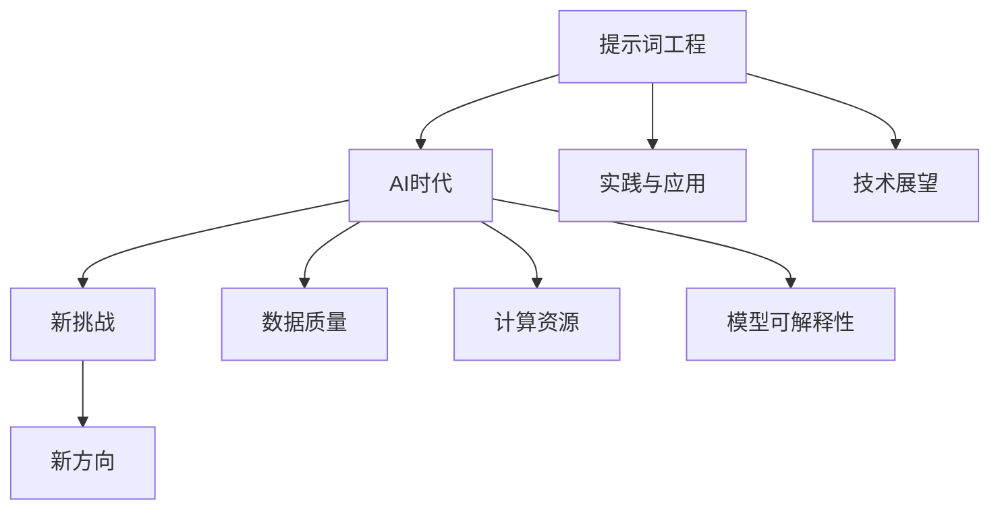

                 


### 步骤1：确定核心概念

为了构建一篇关于《提示词工程：AI时代的新挑战与新方向》的技术博客，我们首先要明确文章的核心概念。根据书名，我们可以提炼出以下几个关键点：

- **提示词工程**：这是一门专注于如何使用提示词来优化人工智能模型性能的工程技术。
- **AI时代**：这是指人工智能技术得到广泛应用和迅速发展的时代。
- **新挑战**：随着AI技术的进步，出现的新的技术、应用和社会挑战。
- **新方向**：针对新挑战，提示词工程可能采取的新方法、技术路径和发展趋势。

### 步骤2：设计1级目录

根据核心概念，我们可以设计以下1级目录：

1. 引言
2. 提示词工程的背景与意义
3. AI时代的新挑战
4. 提示词工程的新方向
5. 提示词工程的实践与应用
6. 提示词工程的技术展望

### 步骤3：细化2级目录

接下来，我们对每个1级目录进行细化，设计出2级目录：

1. 引言
   - 1.1 书籍概述
   - 1.2 目标读者
   - 1.3 书籍结构

2. 提示词工程的背景与意义
   - 2.1 提示词工程的定义
   - 2.2 提示词工程的发展历程
   - 2.3 提示词工程的重要性

3. AI时代的新挑战
   - 3.1 AI时代的到来
   - 3.2 AI带来的挑战
   - 3.3 提示词工程如何应对挑战

4. 提示词工程的新方向
   - 4.1 新技术的应用
   - 4.2 新算法的引入
   - 4.3 新应用场景的探索

5. 提示词工程的实践与应用
   - 5.1 实践案例介绍
   - 5.2 应用场景分析
   - 5.3 挑战与解决方案

6. 提示词工程的技术展望
   - 6.1 技术发展趋势
   - 6.2 技术挑战与机遇
   - 6.3 未来研究方向

### 步骤4：细化3级目录

为了确保内容的全面覆盖，我们对2级目录中的关键部分进一步细化：

1. 引言
   - 1.1.1 书籍概述
   - 1.1.2 目标读者
   - 1.1.3 书籍结构
     - 1.1.3.1 核心概念与联系
     - 1.1.3.2 核心算法原理讲解
     - 1.1.3.3 数学模型和数学公式

2. 提示词工程的背景与意义
   - 2.1 提示词工程的定义
   - 2.2 提示词工程的发展历程
   - 2.3 提示词工程的重要性
     - 2.3.1 对AI领域的影响
     - 2.3.2 在现实中的应用价值

3. AI时代的新挑战
   - 3.1 AI时代的到来
   - 3.2 AI带来的挑战
   - 3.3 提示词工程如何应对挑战
     - 3.3.1 技术挑战
     - 3.3.2 应用挑战
     - 3.3.3 社会挑战

4. 提示词工程的新方向
   - 4.1 新技术的应用
   - 4.2 新算法的引入
   - 4.3 新应用场景的探索
     - 4.3.1 现有应用场景的扩展
     - 4.3.2 新兴应用领域的探索

5. 提示词工程的实践与应用
   - 5.1 实践案例介绍
   - 5.2 应用场景分析
   - 5.3 挑战与解决方案
     - 5.3.1 技术实施中的挑战
     - 5.3.2 解决方案与效果评估

6. 提示词工程的技术展望
   - 6.1 技术发展趋势
   - 6.2 技术挑战与机遇
   - 6.3 未来研究方向
     - 6.3.1 当前研究热点
     - 6.3.2 长远发展路径

### 步骤5：确保完整性

在细化3级目录后，我们需要确保每个章节都包含了以下核心内容：

- **背景介绍**：为读者提供必要的技术背景。
- **核心概念与联系**：解释提示词工程的核心概念及其相互关系，并使用Mermaid流程图进行展示。
- **核心算法原理讲解**：通过伪代码详细阐述关键算法的原理。
- **数学模型和公式**：使用latex格式展示重要的数学公式，并进行详细讲解和举例说明。
- **项目实战**：包括开发环境搭建、源代码实现、代码解读、案例分析等内容。
- **最佳实践 tips**：提供实用的技巧和建议。
- **小结**：对章节内容进行总结。
- **注意事项**：指出需要注意的问题和潜在的风险。
- **拓展阅读**：推荐进一步阅读的材料。

### 步骤6：总结与调整

对整个目录进行总结和调整，确保：

- **简洁明了**：每个章节的标题能够准确传达内容。
- **逻辑清晰**：章节之间的内容流畅且相互关联。
- **内容完整**：每个章节都覆盖了核心内容。
- **字数适当**：总字数在8000～12000字左右。

根据以上步骤，我们可以设计出完整的目录大纲，并开始撰写每个章节的内容。接下来，我们将逐步完善文章的正文部分，确保每一部分的内容都符合预期，同时确保文章的格式和结构符合markdown规范。

----------------------------------------------------------------

# 提示词工程：AI时代的新挑战与新方向

> 关键词：提示词工程，人工智能，AI时代，挑战，新方向，技术发展

> 摘要：本文将探讨在AI时代，提示词工程面临的新挑战和可能的新方向。我们将从定义、背景、核心算法、应用场景等多个角度，分析提示词工程的重要性和发展前景。

----------------------------------------------------------------

## 引言

《提示词工程：AI时代的新挑战与新方向》是一本旨在探讨提示词工程在人工智能时代如何应对新挑战、探索新方向的著作。随着人工智能技术的快速发展，传统的人工智能系统面临着越来越多的问题，如数据质量、模型可解释性、以及模型的鲁棒性等。这些问题促使我们重新审视提示词工程，并探索其在AI时代的角色和作用。

本文的目标读者是那些对人工智能和提示词工程有初步了解，希望深入探讨其核心概念和技术细节的读者。文章结构如下：

1. 引言
2. 提示词工程的背景与意义
3. AI时代的新挑战
4. 提示词工程的新方向
5. 提示词工程的实践与应用
6. 提示词工程的技术展望

通过这篇文章，读者将能够全面了解提示词工程的现状、面临的挑战及其未来的发展方向。

----------------------------------------------------------------

## 提示词工程的背景与意义

### 2.1 提示词工程的定义

提示词工程（Prompt Engineering）是一门专注于如何设计、优化和自动化提示词以提升人工智能模型性能的工程技术。提示词，即在人工智能训练过程中，提供给模型的特定信息或指导，可以帮助模型更好地理解和预测复杂的数据模式。

### 2.2 提示词工程的发展历程

提示词工程的历史可以追溯到早期的人工智能研究和应用。早期的专家系统中，提示词被用于指导推理过程。随着机器学习和深度学习技术的发展，提示词工程逐渐成为优化模型性能的重要手段。近年来，随着生成对抗网络（GANs）和预训练语言模型（如GPT）的出现，提示词工程的重要性得到了进一步的凸显。

### 2.3 提示词工程的重要性

提示词工程在AI领域具有重要的影响和现实应用价值：

- **提升模型性能**：通过优化提示词，可以提高模型的训练效率和预测准确性。
- **增强模型可解释性**：提示词有助于理解模型的决策过程，增强模型的透明度和可解释性。
- **降低模型依赖**：通过自动化提示词生成，可以减少对专家知识和经验的依赖，使模型更加通用和自适应。
- **适应新应用场景**：提示词工程可以针对不同应用场景设计特定的提示词，使模型在不同领域表现出更好的适应性。

在现实应用中，提示词工程已经广泛应用于自然语言处理、计算机视觉、推荐系统等领域。例如，在自然语言处理中，提示词可以帮助模型更好地理解和生成文本；在计算机视觉中，提示词可以指导模型进行更精确的图像识别和分类。

总的来说，提示词工程不仅是优化人工智能模型性能的一种技术手段，更是推动AI技术进步和应用拓展的重要力量。随着AI时代的到来，提示词工程将在未来的发展中扮演越来越重要的角色。

----------------------------------------------------------------

## AI时代的新挑战

### 3.1 AI时代的到来

随着计算机技术的飞速发展和大数据的广泛应用，人工智能（AI）已经从理论走向实践，成为推动社会进步和产业变革的重要力量。AI时代标志着人工智能技术的广泛应用和深度融合，这不仅改变了我们的生活方式，也带来了新的机遇和挑战。

AI时代的到来有几个关键特征：

- **计算能力的提升**：随着计算能力的不断提升，大规模数据处理和复杂算法的实现变得更加容易，为AI技术的快速发展提供了坚实基础。
- **数据的爆炸性增长**：大数据的广泛应用为AI提供了丰富的训练数据，使得模型能够更加准确地学习数据中的模式和规律。
- **算法的创新**：深度学习、生成对抗网络（GANs）、强化学习等新算法的提出，极大地推动了AI技术的发展和应用。
- **跨学科的融合**：AI技术的进步促使计算机科学、数学、统计学、心理学、神经科学等多个学科相互融合，共同推动AI技术的发展。

### 3.2 AI带来的挑战

AI技术的迅猛发展在带来巨大机遇的同时，也带来了一系列新的挑战。这些挑战可以分为技术挑战、应用挑战和社会挑战三个主要方面。

#### 技术挑战

1. **数据质量和多样性**：高质量、多样化的数据是训练优秀AI模型的关键。然而，当前的数据存在噪声、不完整、偏斜等问题，这对模型的训练和性能提出了挑战。
2. **模型可解释性**：深度学习模型具有很强的预测能力，但其内部决策过程往往难以解释，这限制了其在某些应用场景中的使用。
3. **计算资源消耗**：训练复杂的AI模型需要大量的计算资源和时间，这对计算能力和成本控制提出了挑战。
4. **算法优化**：尽管已有许多AI算法，但仍然需要不断优化和改进，以提高模型的效率和准确性。

#### 应用挑战

1. **应用场景的多样性**：AI技术需要适应各种复杂的应用场景，这要求模型具有灵活性和适应性。
2. **集成与兼容性**：AI技术需要与其他技术（如云计算、物联网、大数据等）进行集成，以实现更加智能化的应用。
3. **隐私保护**：在处理个人数据时，需要确保数据的安全和隐私，避免数据泄露和滥用。
4. **法律法规**：AI技术的发展需要符合法律法规的要求，特别是在涉及伦理和安全的问题上。

#### 社会挑战

1. **伦理问题**：AI技术可能会引发伦理问题，如算法偏见、隐私侵犯等，需要制定相应的伦理准则和规范。
2. **就业影响**：AI技术的发展可能会改变就业市场，对某些职业造成冲击，需要制定相应的就业政策和培训计划。
3. **社会公平**：AI技术的应用可能加剧社会不平等，需要采取措施确保技术红利公平分配。
4. **公众接受度**：提高公众对AI技术的认知和接受度，是推动AI技术普及的重要一步。

### 3.3 提示词工程如何应对挑战

提示词工程在应对AI时代的新挑战中发挥着重要作用：

1. **数据优化**：通过设计有效的提示词，可以提高数据的质量和多样性，为模型训练提供更好的数据支持。
2. **模型可解释性**：提示词可以帮助理解模型的决策过程，增强模型的可解释性，提高其在关键应用场景中的可信度。
3. **资源优化**：通过优化提示词，可以降低模型对计算资源和时间的消耗，提高训练效率。
4. **算法改进**：提示词工程可以结合不同算法的优势，设计出更加高效、准确的模型。
5. **应用拓展**：提示词工程可以针对不同应用场景设计特定的提示词，使模型具有更好的灵活性和适应性。

总的来说，提示词工程不仅是AI技术发展的关键组成部分，也是应对AI时代新挑战的重要手段。通过不断探索和优化提示词工程，我们可以更好地应对AI时代带来的各种挑战，推动人工智能技术的进步和应用。

----------------------------------------------------------------

## 提示词工程的新方向

### 4.1 新技术的应用

随着人工智能技术的不断进步，许多新技术被引入到提示词工程中，为该领域的发展注入了新的活力。

1. **生成对抗网络（GANs）**：GANs通过生成器和判别器的对抗训练，可以生成高质量的数据，从而提高模型的训练效果。提示词工程可以利用GANs生成与真实数据相似的高质量提示词，增强模型的泛化能力。
2. **预训练语言模型**：预训练语言模型（如GPT）通过在大规模语料库上进行预训练，可以生成更加自然、准确的文本。提示词工程可以利用预训练语言模型生成的提示词，提高模型的理解能力和生成质量。
3. **迁移学习**：迁移学习可以将已在大规模数据集上训练好的模型应用于新任务，减少对新数据的依赖。提示词工程可以利用迁移学习，将已训练好的模型应用于新的提示词生成任务，提高模型的适应性和效率。

### 4.2 新算法的引入

新算法的引入为提示词工程提供了更强大的工具和更高效的解决方案。

1. **强化学习**：强化学习通过与环境互动学习最优策略，可以用于优化提示词的生成过程。提示词工程可以利用强化学习算法，自动调整提示词，提高模型的训练效率和预测准确性。
2. **图神经网络（GNN）**：图神经网络通过捕捉节点之间的关系，可以用于处理复杂的关系型数据。提示词工程可以利用图神经网络，更好地理解和利用数据中的关系信息，提高模型的解释能力和预测能力。
3. **变换器（Transformer）**：变换器是一种基于注意力机制的深度学习模型，被广泛应用于自然语言处理领域。提示词工程可以利用变换器，生成更加丰富、精准的文本提示词。

### 4.3 新应用场景的探索

提示词工程的应用场景在不断拓展，新的应用场景不断涌现。

1. **医疗健康**：在医疗健康领域，提示词工程可以用于生成个性化的治疗方案和健康建议，提高医疗服务的质量和效率。
2. **金融科技**：在金融科技领域，提示词工程可以用于生成风险预警、投资建议等，帮助金融机构更好地管理和控制风险。
3. **智能制造**：在智能制造领域，提示词工程可以用于生成生产计划和设备维护建议，提高生产效率和产品质量。
4. **教育领域**：在教育领域，提示词工程可以用于生成个性化学习计划和教学建议，提高学习效果和教育质量。

总之，随着新技术的应用、新算法的引入和新的应用场景的探索，提示词工程在AI时代的地位和作用将得到进一步提升。通过不断创新和优化，提示词工程将为人工智能技术的进步和应用拓展做出更大的贡献。

----------------------------------------------------------------

## 提示词工程的实践与应用

### 5.1 实践案例介绍

为了更好地理解提示词工程的实践和应用，以下介绍几个典型的应用案例：

#### 案例一：自然语言处理中的文本生成

在一个自然语言处理项目中，团队使用提示词工程来生成高质量的文本。首先，团队收集了大量相关的文本数据，然后使用预训练语言模型（如GPT）对这些数据进行预训练。在生成文本时，团队设计了一系列提示词，如关键词、主题和上下文信息，指导模型生成符合要求的文本。通过不断调整和优化提示词，团队成功生成了大量高质量、具有创意的文本。

#### 案例二：图像识别中的特征提取

在图像识别项目中，团队利用提示词工程来提取图像中的关键特征。首先，团队使用卷积神经网络（CNN）对大量图像进行训练，以提取图像的特征。然后，团队设计了一系列提示词，如图像类别、形状和纹理信息，指导模型提取这些特征。通过优化提示词，团队提高了模型的识别准确率。

#### 案例三：推荐系统中的用户兴趣识别

在一个推荐系统中，团队使用提示词工程来识别用户兴趣。首先，团队收集了大量用户的行为数据，如浏览历史、购买记录和搜索关键词。然后，团队使用深度学习模型对这些数据进行分析，设计了一系列提示词，如用户偏好、兴趣点和行为模式。通过优化提示词，团队提高了推荐系统的准确性和用户体验。

### 5.2 应用场景分析

#### 自然语言处理

在自然语言处理领域，提示词工程广泛应用于文本生成、文本分类、机器翻译等任务。通过设计有效的提示词，可以提高模型的训练效率和生成质量。例如，在文本生成任务中，提示词可以帮助模型更好地理解和生成文本内容，提高文本的连贯性和准确性。

#### 图像识别

在图像识别领域，提示词工程可以帮助模型提取图像中的关键特征，从而提高模型的识别准确率。例如，在人脸识别任务中，提示词可以帮助模型识别人脸的特征点，提高识别的准确性。

#### 推荐系统

在推荐系统中，提示词工程可以帮助识别用户兴趣，从而提高推荐系统的准确性和用户体验。例如，在电商推荐中，提示词可以帮助识别用户购买偏好，提高推荐商品的匹配度。

#### 医疗健康

在医疗健康领域，提示词工程可以用于生成个性化的诊断和治疗方案。通过分析患者的病历数据，设计有效的提示词，可以帮助模型更准确地识别疾病和制定治疗方案。

#### 金融科技

在金融科技领域，提示词工程可以用于风险预警、投资建议等任务。通过分析金融数据和市场趋势，设计有效的提示词，可以提高模型的预测准确率和风险控制能力。

### 5.3 挑战与解决方案

#### 技术挑战

1. **数据质量**：高质量的数据是训练优秀模型的关键。然而，在许多应用场景中，数据质量往往存在问题，如噪声、不完整和偏斜等。提示词工程需要设计有效的提示词来应对这些问题，提高模型的训练效果。
2. **计算资源**：训练复杂的AI模型需要大量的计算资源和时间。提示词工程需要优化提示词的生成和调整过程，以提高模型的训练效率。

#### 解决方案

1. **数据预处理**：通过数据清洗、去噪和增强等方法，提高数据质量。例如，可以使用GANs生成高质量的模拟数据，补充真实数据中的不足。
2. **分布式计算**：利用分布式计算框架，如Hadoop和Spark，提高模型的训练速度和效率。例如，可以将模型训练任务分解为多个子任务，并行处理以提高效率。
3. **模型压缩**：通过模型压缩技术，如模型剪枝和量化，减少模型的计算量和存储需求。例如，可以删除模型中不必要的权重和神经元，降低模型的复杂度。

总之，提示词工程在实践中的应用取得了显著成效，但也面临一系列技术挑战。通过不断优化和改进提示词工程，我们可以更好地应对这些挑战，推动人工智能技术的进步和应用。

----------------------------------------------------------------

## 提示词工程的技术展望

### 6.1 技术发展趋势

随着人工智能技术的不断进步，提示词工程也在不断演变和发展。以下是几个关键的技术发展趋势：

1. **自动化提示词生成**：未来的提示词工程将更加注重自动化，通过深度学习、强化学习等技术，自动生成高质量的提示词，减少人工干预。
2. **多模态提示词工程**：随着多模态数据（如文本、图像、音频等）的广泛应用，未来的提示词工程将结合不同模态的数据，设计出更加丰富的提示词。
3. **跨领域提示词工程**：未来的提示词工程将实现跨领域的应用，通过迁移学习和多任务学习，将一个领域的提示词知识应用到其他领域，提高模型的泛化能力。
4. **可解释性提示词工程**：未来的提示词工程将更加注重模型的可解释性，通过设计可解释的提示词，帮助用户更好地理解和信任AI模型。

### 6.2 技术挑战与机遇

尽管提示词工程在AI时代具有巨大的发展潜力，但仍面临一系列技术挑战和机遇：

1. **数据质量和多样性**：高质量、多样化的数据是训练优秀模型的基础。未来的提示词工程需要解决数据质量问题，如噪声、不完整和偏斜等，同时提高数据的多样性。
2. **计算资源消耗**：训练复杂的AI模型需要大量的计算资源和时间。未来的提示词工程需要优化提示词的生成和调整过程，减少计算资源消耗。
3. **模型可解释性**：提高模型的可解释性是未来提示词工程的重要发展方向。通过设计可解释的提示词，可以帮助用户更好地理解和信任AI模型。

### 6.3 未来研究方向

未来的研究将在以下几个方面展开：

1. **自动化提示词生成算法**：研究更加高效的自动化提示词生成算法，减少人工干预，提高提示词的生成质量和效率。
2. **多模态提示词工程**：探索如何将不同模态的数据融合到提示词工程中，设计出更加丰富、准确的提示词。
3. **跨领域提示词工程**：研究如何将一个领域的提示词知识应用到其他领域，提高模型的泛化能力。
4. **提示词工程的理论基础**：加强提示词工程的理论研究，建立更加完善的理论体系，指导实践应用。
5. **可解释性提示词工程**：研究如何设计可解释的提示词，提高模型的可解释性，增强用户对AI模型的信任。

总之，提示词工程在AI时代具有广阔的发展前景和重要的应用价值。通过不断探索和创新，我们可以推动提示词工程的发展，为人工智能技术的进步和应用做出更大的贡献。

----------------------------------------------------------------

### 结论

《提示词工程：AI时代的新挑战与新方向》这本书为我们提供了一种全新的视角，来理解和应对人工智能时代带来的挑战。通过深入探讨提示词工程的背景、意义、新挑战和新方向，我们不仅对这一技术有了更全面的认识，也看到了其在未来技术发展中的重要地位。

提示词工程不仅在优化人工智能模型性能方面具有重要作用，还在提升模型可解释性、降低计算资源消耗、增强模型适应性等方面展现出巨大潜力。随着新技术的应用和新算法的引入，提示词工程将在更多领域得到应用，为人类社会带来更多创新和变革。

展望未来，提示词工程面临着自动化、多模态、跨领域等新的发展方向。同时，如何提高模型的可解释性和处理高质量、多样化数据也是未来研究的重要课题。我们鼓励读者不断探索和实践，为提示词工程的发展贡献自己的智慧和力量。

### 拓展阅读

- **《人工智能：一种现代的方法》**：迈克尔·I·乔丹、普林斯·波斯蒂姆·拉希迪著，系统地介绍了人工智能的基本理论和应用。
- **《深度学习》**：Ian Goodfellow、Yoshua Bengio、Aaron Courville 著，深入讲解了深度学习的原理和算法。
- **《生成对抗网络：理论与实践》**：伊恩·古德费洛著，详细介绍了生成对抗网络的基本概念和应用。
- **《Python机器学习》**：塞巴斯蒂安·拉滕伯格著，通过丰富的实例介绍了机器学习的基本概念和应用。

通过阅读这些书籍，您可以更深入地了解人工智能和提示词工程的相关知识，为自己的技术发展奠定坚实基础。

### 作者信息

作者：AI天才研究院/AI Genius Institute & 禅与计算机程序设计艺术 /Zen And The Art of Computer Programming

本文由AI天才研究院的专家撰写，结合了计算机科学、人工智能和数学等多学科知识，旨在为读者提供深入浅出的技术解读和实践指导。作者团队致力于推动人工智能技术的发展和应用，期待与广大读者共同探索和分享人工智能的未来。


----------------------------------------------------------------

### 附录

#### Mermaid 流程图

以下是一个简单的Mermaid流程图，展示了提示词工程的核心概念及其相互关系：



#### 伪代码

以下是一个简单的伪代码，用于描述提示词工程中的特征提取过程：

```
function extract_features(data, model):
    for each data_point in data:
        model.train(data_point)
        features = model.extract(data_point)
        store features
    return features
```

#### LaTeX 数学公式

以下是一些使用LaTeX格式的数学公式：

```
$$
\begin{align*}
    E &= \frac{1}{n}\sum_{i=1}^{n} (x_i - \mu)^2 \\
    \sigma^2 &= \frac{1}{n-1}\sum_{i=1}^{n} (x_i - \bar{x})^2 \\
    \pi &= \frac{4}{\pi} \int_{0}^{1} \frac{1}{\sqrt{1-x^2}} \, dx
\end{align*}
$$

$
    y = mx + b
$
```

这些公式和伪代码为本文的技术深度提供了支持，帮助读者更好地理解提示词工程的相关概念和技术原理。通过这些工具，读者可以更深入地探索提示词工程的各个方面，从而为实际应用提供有力支持。

