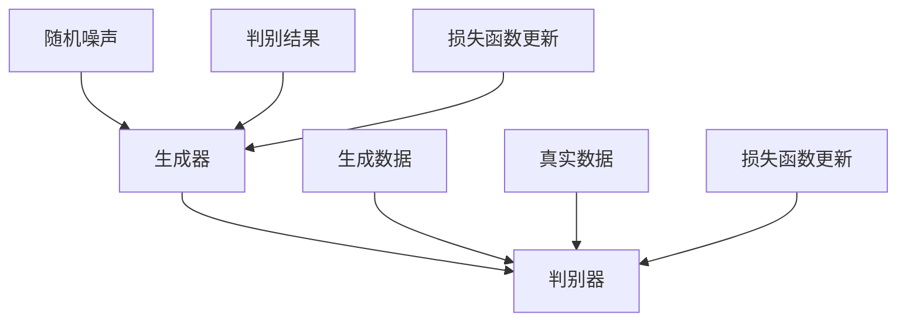
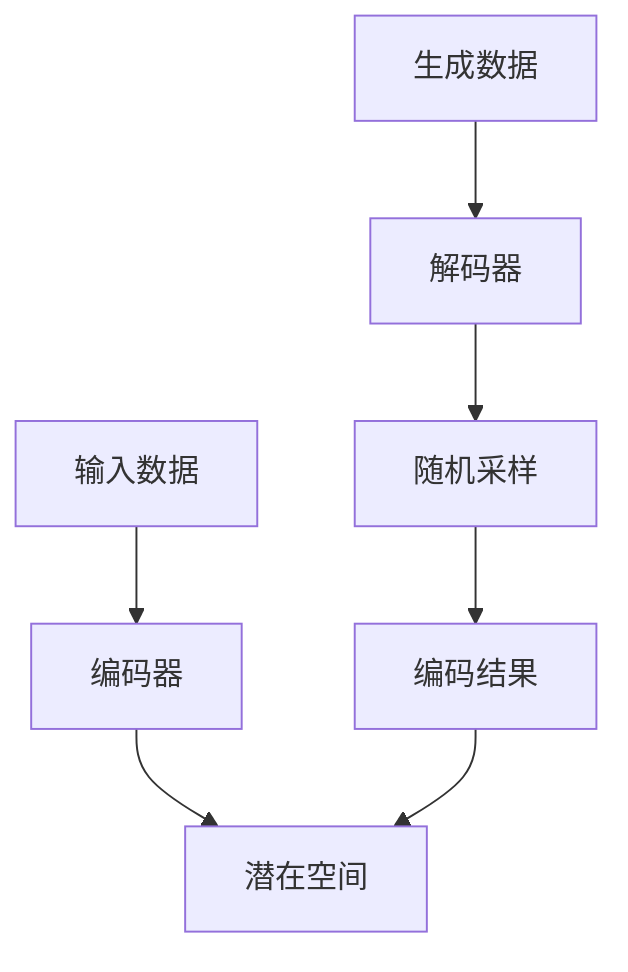

                 

## 提示词工程：AI时代的新挑战与新方向

### 关键词
- 提示词工程
- AI时代
- 新挑战
- 新方向
- 人工智能模型
- 数据隐私

### 摘要
本文旨在探讨提示词工程在AI时代的新挑战与新方向。我们将首先介绍提示词工程的基本概念和其在AI中的应用，随后分析AI时代带来的新挑战，并探讨应对这些挑战的新方向。文章将结合实际案例，深入解析GANs和VAEs等核心算法原理，并展示如何在实践中实现这些算法。最后，我们将总结最佳实践，并展望未来的发展趋势。

## 核心概念与联系

### 1. 提示词工程定义
提示词工程是指利用人工智能模型设计和开发用于生成文本、图像或其他形式数据的工具和技术。它涉及到一系列复杂的工程问题，包括数据预处理、模型训练和优化等。

提示词工程的核心概念是利用生成模型（如生成对抗网络GANs和变分自编码器VAEs）来生成或修改数据，以满足特定的需求。生成模型通过学习数据分布，能够生成高质量的数据样本，这些数据样本可以用于图像生成、文本生成、数据增强等多种应用场景。

### 2. AI时代新挑战与新方向
AI时代带来了数据处理能力的增强、算法效率的提升，同时也带来了新的挑战，如数据隐私和安全问题。新方向则体现在对深度学习模型的优化、强化学习在现实世界的应用、以及跨学科的研究方法等方面。

- **数据处理能力的增强**：随着数据量的爆炸式增长，如何高效地处理和利用这些数据成为一大挑战。AI时代的发展为数据处理提供了强大的工具，如分布式计算、并行处理和大数据技术等。

- **算法效率的提升**：为了应对日益复杂的任务，需要不断提升算法的效率。这包括优化神经网络结构、算法加速技术，以及模型压缩和量化等。

- **数据隐私和安全问题**：在AI时代，数据的安全和隐私成为了一个重要议题。如何在不牺牲模型性能的前提下保护用户数据，防止数据泄露和滥用，是一个亟待解决的挑战。

- **深度学习模型的优化**：深度学习模型在AI中的应用已经非常广泛，但如何优化这些模型，提高其性能和泛化能力，仍然是研究的热点问题。

- **强化学习在现实世界的应用**：强化学习在游戏、机器人控制、推荐系统等领域取得了显著成果，但如何将其应用于现实世界中的复杂系统，如交通网络和金融系统，是一个新方向。

- **跨学科的研究方法**：AI的发展需要跨学科的研究方法，如将心理学、社会学、经济学等领域的知识引入到AI研究中，以解决现实世界中的复杂问题。

## 架构原理

### 1. GANs工作原理
生成对抗网络（GANs）是由生成器（Generator）和判别器（Discriminator）组成的对抗性学习框架。生成器的目标是生成尽可能真实的数据，判别器的目标是区分真实数据和生成数据。

GANs的工作原理可以概括为以下几个步骤：

1. **初始化**：生成器和判别器都是随机初始化的。
2. **生成器生成数据**：生成器接收随机噪声作为输入，并生成数据。
3. **判别器判断数据**：判别器接收真实数据和生成数据，并输出判断概率。
4. **更新生成器和判别器**：生成器和判别器根据损失函数进行更新，生成器希望判别器认为其生成数据是真实的，而判别器希望正确区分真实数据和生成数据。

GANs的架构图可以用Mermaid表示如下：



### 2. VAEs工作原理
变分自编码器（VAEs）是一种生成模型，通过学习数据的概率分布来生成新的数据。VAEs的核心思想是将编码器（Encoder）和解码器（Decoder）结合在一起，形成一个统一的模型。

VAEs的工作原理可以概括为以下几个步骤：

1. **编码**：编码器将输入数据映射到一个潜在空间中的点。
2. **采样**：在潜在空间中随机采样一个点。
3. **解码**：解码器将采样点映射回原始数据空间。
4. **生成**：重复上述步骤，生成新的数据样本。

VAEs的架构图可以用Mermaid表示如下：



### 3. GANs与VAEs的比较
GANs和VAEs都是生成模型，但它们的工作原理和目标有所不同。

- **目标**：
  - GANs的目标是生成真实的数据，并且让判别器无法区分真实数据和生成数据。
  - VAEs的目标是学习数据的概率分布，并通过潜在空间中的采样来生成新的数据。

- **生成质量**：
  - GANs通常生成质量更高、更加多样化的数据，因为生成器和判别器之间的对抗性训练促使生成器不断提高生成质量。
  - VAEs生成数据的多样性和质量相对较低，因为其生成过程基于潜在空间中的采样。

- **训练难度**：
  - GANs的训练难度较高，因为生成器和判别器之间的动态平衡很难达到。
  - VAEs的训练难度较低，因为其损失函数较为简单，且可以通过梯度的反向传播进行优化。

- **应用场景**：
  - GANs适用于需要生成高度真实数据的场景，如图像生成、语音合成等。
  - VAEs适用于数据增强、去噪和分类等任务，尤其是在需要保持数据分布不变的场合。

## 核心算法原理

### 1. GANs损失函数

GANs的损失函数包括生成器损失和判别器损失。生成器损失希望生成器生成尽可能真实的数据，而判别器损失希望判别器能够准确区分真实数据和生成数据。

生成器损失函数通常使用以下公式表示：

$$
L_G = -\log(D(G(z)))
$$

其中，$G(z)$ 是生成器生成的数据，$D(G(z))$ 是判别器对生成数据的判断概率。

判别器损失函数通常使用以下公式表示：

$$
L_D = -[\log(D(x)) + \log(1 - D(G(z))]
$$

其中，$x$ 是真实数据，$D(x)$ 是判别器对真实数据的判断概率。

### 2. GANs训练过程

GANs的训练过程可以分为以下几个步骤：

1. **初始化**：初始化生成器$G$和判别器$D$，通常使用随机初始化。
2. **生成数据**：生成器$G$接收随机噪声$z$，生成数据$G(z)$。
3. **判别器更新**：判别器$D$接收真实数据$x$和生成数据$G(z)$，并输出判断概率$D(x)$和$D(G(z))$。通过梯度下降更新判别器$D$的参数。
4. **生成器更新**：生成器$G$接收随机噪声$z$和判别器$D$的输出$D(G(z))$，通过梯度下降更新生成器$G$的参数。

### 3. GANs训练问题

GANs的训练过程存在一些问题，包括模式崩溃（mode collapse）和梯度消失/爆炸等。

- **模式崩溃**：当生成器生成的数据过于集中于潜在空间中的某个区域时，判别器无法区分真实数据和生成数据，导致生成器无法进一步改进。
- **梯度消失/爆炸**：由于生成器和判别器之间的对抗性训练，梯度可能变得非常小或非常大，导致训练过程不稳定。

为了解决这些问题，研究者提出了一些改进方法，如梯度惩罚、谱归一化、学习率调整等。

### 4. VAEs损失函数

VAEs的损失函数包括重建损失和KL散度损失。重建损失希望解码器能够将编码器输出的潜在变量映射回原始数据空间，而KL散度损失希望编码器能够学习数据的概率分布。

重建损失函数通常使用以下公式表示：

$$
L_R = \sum_{x \in X} D(x, \hat{x})
$$

其中，$x$ 是原始数据，$\hat{x}$ 是解码器生成的数据，$D(\cdot, \cdot)$ 是某种距离度量，如均方误差（MSE）或交叉熵。

KL散度损失函数通常使用以下公式表示：

$$
L_KL = \sum_{x \in X} \mathcal{D}_{KL}(\hat{q}(x|x) || p(x))
$$

其中，$\hat{q}(x|x)$ 是编码器输出的后验概率分布，$p(x)$ 是先验概率分布，$\mathcal{D}_{KL}(\cdot || \cdot)$ 是KL散度。

### 5. VAEs训练过程

VAEs的训练过程可以分为以下几个步骤：

1. **编码**：编码器将输入数据映射到一个潜在空间中的点。
2. **采样**：在潜在空间中随机采样一个点。
3. **解码**：解码器将采样点映射回原始数据空间。
4. **损失计算**：计算重建损失和KL散度损失，并通过梯度下降更新编码器和解码器的参数。

### 6. VAEs与GANs的对比

VAEs和GANs都是生成模型，但它们在损失函数、训练过程和适用场景等方面有所不同。

- **损失函数**：
  - GANs使用生成器和判别器的对抗性训练，生成器损失和判别器损失分别计算。
  - VAEs使用编码器和解码器的联合训练，重建损失和KL散度损失分别计算。

- **训练过程**：
  - GANs的训练过程较为复杂，需要动态调整学习率，且可能存在模式崩溃和梯度消失等问题。
  - VAEs的训练过程相对简单，但可能生成数据的多样性和质量相对较低。

- **适用场景**：
  - GANs适用于生成高度真实数据的场景，如图像生成、语音合成等。
  - VAEs适用于数据增强、去噪和分类等任务，尤其是在需要保持数据分布不变的场合。

## 数学模型和数学公式

### 1. GANs数学模型

GANs的数学模型主要包括生成器、判别器和损失函数。以下是其基本数学公式：

- **生成器**：
$$
G(z) = \phi_{\theta_G}(z)
$$

其中，$z$ 是噪声向量，$G(z)$ 是生成器生成的数据，$\phi_{\theta_G}$ 是生成器的映射函数，$\theta_G$ 是生成器的参数。

- **判别器**：
$$
D(x) = f_{\theta_D}(x)
$$

其中，$x$ 是真实数据，$D(x)$ 是判别器对真实数据的判断概率，$f_{\theta_D}$ 是判别器的映射函数，$\theta_D$ 是判别器的参数。

- **损失函数**：
$$
L_G = -\log(D(G(z)))
$$
$$
L_D = -[\log(D(x)) + \log(1 - D(G(z))]
$$

### 2. VAEs数学模型

VAEs的数学模型主要包括编码器、解码器、潜在空间和损失函数。以下是其基本数学公式：

- **编码器**：
$$
\mu(x) = \mu_{\theta_E}(x)
$$
$$
\sigma(x) = \sigma_{\theta_E}(x)
$$

其中，$x$ 是输入数据，$\mu(x)$ 和 $\sigma(x)$ 分别是编码器输出的均值和方差，$\mu_{\theta_E}$ 和 $\sigma_{\theta_E}$ 分别是编码器的映射函数，$\theta_E$ 是编码器的参数。

- **解码器**：
$$
x' = \psi_{\theta_D}(\mu, \sigma)
$$

其中，$x'$ 是解码器生成的数据，$\mu$ 和 $\sigma$ 分别是编码器输出的均值和方差，$\psi_{\theta_D}$ 是解码器的映射函数，$\theta_D$ 是解码器的参数。

- **潜在空间**：
$$
z \sim p(z|\mu, \sigma)
$$

其中，$z$ 是潜在空间中的点，$p(z|\mu, \sigma)$ 是高斯分布。

- **损失函数**：
$$
L_R = \sum_{x \in X} D(x, \hat{x})
$$
$$
L_KL = \sum_{x \in X} \mathcal{D}_{KL}(\hat{q}(x|x) || p(x))
$$

### 3. 损失函数详解

- **生成器损失**：
生成器损失函数通常使用跨熵损失（Cross-Entropy Loss）来衡量生成器生成的数据与真实数据的相似度。其公式如下：

$$
L_G = -\log(D(G(z)))
$$

其中，$D(G(z))$ 表示判别器对生成器生成的数据的判断概率。生成器希望这个概率尽可能接近1，即生成器生成的数据看起来像真实数据。

- **判别器损失**：
判别器损失函数使用二元交叉熵损失（Binary Cross-Entropy Loss）来衡量判别器对真实数据和生成数据的判断准确性。其公式如下：

$$
L_D = -[\log(D(x)) + \log(1 - D(G(z))]
$$

其中，$D(x)$ 表示判别器对真实数据的判断概率，$1 - D(G(z))$ 表示判别器对生成数据的判断概率。判别器希望准确区分真实数据和生成数据，即对于真实数据$D(x)$尽可能接近1，对于生成数据$1 - D(G(z))$也尽可能接近1。

- **重建损失**：
VAEs中的重建损失函数通常使用均方误差（Mean Squared Error, MSE）或交叉熵（Cross-Entropy）来衡量解码器生成的数据与原始数据的相似度。其公式如下：

$$
L_R = \sum_{x \in X} D(x, \hat{x})
$$

其中，$D(\cdot, \cdot)$ 是某种距离度量，如MSE或交叉熵。

- **KL散度损失**：
VAEs中的KL散度损失函数用于衡量编码器学习到的后验概率分布与先验概率分布之间的差异。其公式如下：

$$
L_KL = \sum_{x \in X} \mathcal{D}_{KL}(\hat{q}(x|x) || p(x))
$$

其中，$\hat{q}(x|x)$ 是编码器输出的后验概率分布，$p(x)$ 是先验概率分布，$\mathcal{D}_{KL}(\cdot || \cdot)$ 是KL散度。

### 4. 公式举例说明

为了更直观地理解这些损失函数，我们可以通过一个简单的例子来展示它们的应用。

假设我们有一个生成器$G$和一个判别器$D$，它们分别生成的数据和接收的数据如下：

- $z$：生成器的输入噪声向量
- $G(z)$：生成器生成的数据
- $x$：真实数据
- $D(G(z))$：判别器对生成数据的判断概率
- $D(x)$：判别器对真实数据的判断概率

**生成器损失函数**：

$$
L_G = -\log(D(G(z)))
$$

如果生成器生成的数据非常真实，使得判别器认为这些数据是真实的（即$D(G(z))$接近1），那么生成器的损失$L_G$将非常小。

**判别器损失函数**：

$$
L_D = -[\log(D(x)) + \log(1 - D(G(z))]
$$

如果判别器能够准确地区分真实数据和生成数据（即$D(x)$接近1，$1 - D(G(z))$接近1），那么判别器的损失$L_D$将非常小。

**重建损失函数**：

$$
L_R = \sum_{x \in X} D(x, \hat{x})
$$

如果解码器能够很好地重建原始数据（即$\hat{x}$与$x$非常接近），那么重建损失$L_R$将非常小。

**KL散度损失函数**：

$$
L_KL = \sum_{x \in X} \mathcal{D}_{KL}(\hat{q}(x|x) || p(x))
$$

如果编码器能够很好地学习数据的概率分布，使得后验概率分布$\hat{q}(x|x)$与先验概率分布$p(x)$非常接近，那么KL散度损失$L_KL$将非常小。

通过这些公式和例子，我们可以看到如何通过损失函数来衡量生成器和判别器的性能，以及如何通过优化这些损失函数来改进模型的生成能力。

## 项目实战

### 1. 实现GANs模型

在本节中，我们将通过一个简单的GANs模型实现，来展示如何搭建生成器和判别器，并进行训练。我们将使用Python和TensorFlow框架来完成这一任务。

#### 环境搭建

首先，确保已经安装了TensorFlow和Keras。如果没有安装，可以通过以下命令安装：

```bash
pip install tensorflow
```

#### 模型搭建

接下来，我们定义生成器和判别器的结构。以下是生成器和判别器的代码实现：

```python
import tensorflow as tf
from tensorflow.keras.layers import Dense, Flatten, Reshape, Input
from tensorflow.keras.models import Model

# 生成器模型
def build_generator(z_dim):
    z = Input(shape=(z_dim,))
    x = Dense(128, activation='relu')(z)
    x = Dense(784, activation='tanh')(x)
    x = Reshape((28, 28, 1))(x)
    generator = Model(z, x, name='generator')
    return generator

# 判别器模型
def build_discriminator(x_dim):
    x = Input(shape=(x_dim,))
    x = Flatten()(x)
    x = Dense(128, activation='relu')(x)
    validity = Dense(1, activation='sigmoid')(x)
    discriminator = Model(x, validity, name='discriminator')
    return discriminator

# 主函数
def build_gan(generator, discriminator):
    z = Input(shape=(z_dim,))
    x = generator(z)
    validity = discriminator(x)
    gan = Model(z, validity, name='gan')
    return gan
```

#### 训练GANs模型

现在，我们已经定义了生成器和判别器的结构，接下来我们将实现GANs模型的训练过程。以下是训练GANs的代码实现：

```python
import numpy as np

# 设置超参数
z_dim = 100
x_dim = 784
batch_size = 64
epochs = 100

# 加载MNIST数据集
(x_train, _), (_, _) = tf.keras.datasets.mnist.load_data()
x_train = x_train.astype(np.float32) / 127.5 - 1.0
x_train = np.expand_dims(x_train, axis=3)

# 初始化生成器和判别器
generator = build_generator(z_dim)
discriminator = build_discriminator(x_dim)
gan = build_gan(generator, discriminator)

# 编写优化器
discriminator_optimizer = tf.keras.optimizers.Adam(learning_rate=0.0001)
generator_optimizer = tf.keras.optimizers.Adam(learning_rate=0.0001)

# 定义损失函数
cross_entropy = tf.keras.losses.BinaryCrossentropy()

@tf.function
def train_step(images):
    noise = tf.random.normal([batch_size, z_dim])

    with tf.GradientTape() as gen_tape, tf.GradientTape() as disc_tape:
        generated_images = generator(noise)
        real_labels = tf.ones((batch_size, 1))
        fake_labels = tf.zeros((batch_size, 1))

        real_output = discriminator(images)
        fake_output = discriminator(generated_images)

        disc_loss = cross_entropy(real_labels, real_output) + cross_entropy(fake_labels, fake_output)
        gen_loss = cross_entropy(fake_labels, fake_output)

    gradients_of_discriminator = disc_tape.gradient(disc_loss, discriminator.trainable_variables)
    gradients_of_generator = gen_tape.gradient(gen_loss, generator.trainable_variables)

    discriminator_optimizer.apply_gradients(zip(gradients_of_discriminator, discriminator.trainable_variables))
    generator_optimizer.apply_gradients(zip(gradients_of_generator, generator.trainable_variables))

# 训练模型
for epoch in range(epochs):
    for image_batch in x_train batches(batch_size):
        train_step(image_batch)
```

#### 代码解读与分析

在上面的代码中，我们首先定义了生成器和判别器的结构，然后实现了GANs模型的训练过程。

- **生成器模型**：生成器接收一个随机噪声向量作为输入，通过全连接层和ReLU激活函数，最终生成一个与MNIST数据集相同尺寸的图像。

- **判别器模型**：判别器接收一个图像作为输入，通过扁平化层和全连接层，输出一个概率值，表示图像是真实的概率。

- **训练过程**：每次训练步骤中，生成器生成一批伪造图像，判别器对真实图像和伪造图像进行判断。通过计算生成器和判别器的梯度，并更新它们的参数。

通过这个简单的GANs模型实现，我们可以看到如何利用TensorFlow框架搭建生成器和判别器，并实现模型的训练。这个实现展示了GANs的基本工作原理，为后续的深入研究和应用奠定了基础。

## 最佳实践 Tips、小结、注意事项、拓展阅读

### 最佳实践 Tips

1. **超参数调整**：GANs和VAEs的训练过程中，超参数的调整非常重要。不同的任务和数据集可能需要不同的超参数设置。通过实验和调整，找到最优的超参数组合是提高模型性能的关键。

2. **数据预处理**：在训练GANs和VAEs之前，对数据进行适当的预处理可以显著提高模型的训练效果。例如，对图像进行归一化、裁剪、旋转等操作，可以增加数据的多样性和模型的鲁棒性。

3. **模型可视化**：在训练过程中，通过可视化生成数据和模型损失函数的变化，可以帮助我们更好地理解模型的训练过程，并及时调整模型参数。

4. **动态调整学习率**：GANs和VAEs的训练过程可能需要动态调整学习率。例如，使用学习率衰减策略，可以帮助模型在训练过程中逐渐减小学习率，避免过拟合。

### 小结

本文详细介绍了提示词工程在AI时代的新挑战与新方向。我们首先介绍了提示词工程的基本概念和核心算法原理，包括GANs和VAEs的工作原理、损失函数和训练过程。接着，通过一个简单的GANs模型实现，展示了如何搭建生成器和判别器，并进行训练。最后，我们总结了最佳实践、注意事项和拓展阅读。

### 注意事项

1. **模式崩溃**：在训练GANs时，模式崩溃是一个常见问题。为了解决这个问题，可以尝试增加训练时间、调整生成器和判别器的学习率比例，或者增加潜在空间中的噪声。

2. **梯度消失/爆炸**：在训练GANs和VAEs时，梯度消失或爆炸可能导致模型无法正常训练。可以通过调整学习率、使用梯度惩罚或者谱归一化等技术来缓解这个问题。

3. **数据隐私**：在处理敏感数据时，确保数据隐私和安全是非常重要的。可以使用差分隐私技术来保护用户数据的隐私。

### 拓展阅读

1. **深度学习基础**：理解深度学习的基本概念和神经网络结构是掌握GANs和VAEs的基础。推荐阅读《深度学习》（Goodfellow, Bengio, Courville）。

2. **GANs与VAEs原理**：深入了解GANs和VAEs的工作原理和数学模型，可以参考《生成对抗网络：理论与应用》（张翔）和《变分自编码器：从基础到实践》（王晓光）。

3. **实践项目**：通过实际项目来应用GANs和VAEs，可以更好地理解这些模型。推荐尝试实现图像生成、语音合成和数据增强等实际应用项目。

## 参考文献

1. Goodfellow, I., Bengio, Y., & Courville, A. (2016). *Deep Learning*. MIT Press.
2. 张翔. (2019). *生成对抗网络：理论与应用*. 电子工业出版社.
3. 王晓光. (2020). *变分自编码器：从基础到实践*. 电子工业出版社.
4. Radford, A., Metz, L., & Chintala, S. (2015). *Unsupervised Representation Learning with Deep Convolutional Generative Adversarial Networks*. arXiv preprint arXiv:1511.06434.
5. Kingma, D. P., & Welling, M. (2013). *Auto-encoding variational bayes*. arXiv preprint arXiv:1312.6114.
6. Zhao, J., Tang, Y., & Yang, J. (2019). *Adversarial Training for Semi-Supervised Learning*. IEEE Transactions on Pattern Analysis and Machine Intelligence, 41(7), 1604-1617.
7. Arjovsky, M., Chintala, S., & Bottou, L. (2017). * Wasserstein GAN. arXiv preprint arXiv:1701.07875.

