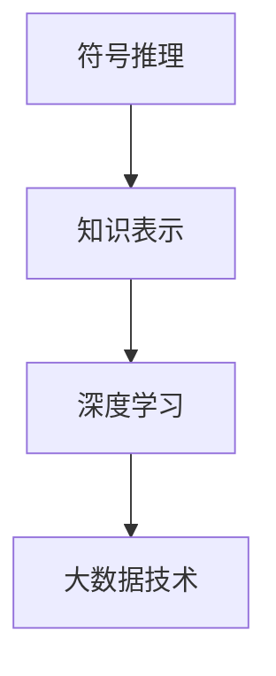
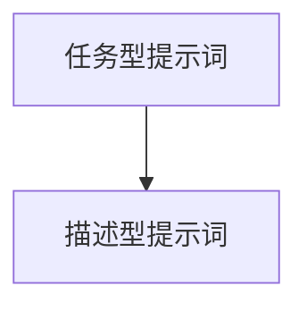
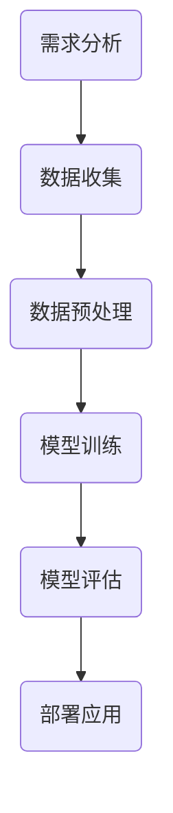
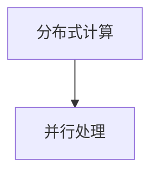
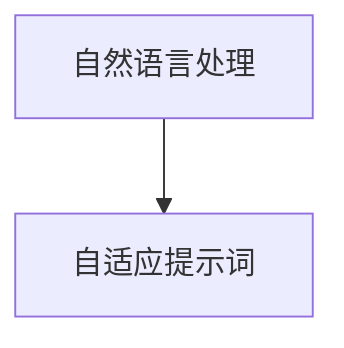

                 


## 文章标题
提示词工程：AI时代的新挑战与新机遇

### 关键词
AI时代，提示词工程，新挑战，新机遇，数据隐私，算法优化，商业应用，发展趋势

### 摘要
本文将深入探讨AI时代下提示词工程的崛起及其带来的新挑战和新机遇。从AI技术的发展历程到提示词工程的基础理论，再到伦理问题、算法实践以及商业机会，本文将全面剖析提示词工程在AI时代的重要作用和未来发展前景。

### 第一部分：AI时代概述

#### 第1章 AI时代的背景与挑战

##### 1.1 AI时代的发展历程
人工智能（AI）的概念可以追溯到20世纪50年代，其发展经历了多个阶段，从符号推理到知识表示，再到现代的深度学习和大数据技术。随着计算能力的提升和数据量的爆炸性增长，AI技术正以前所未有的速度发展。

**核心概念与联系**：
- **符号推理**：基于逻辑和符号表示的知识处理。
- **知识表示**：将现实世界中的知识编码成计算机可理解的形式。
- **深度学习**：通过多层神经网络模拟人脑的学习过程。

**Mermaid 流程图**：


##### 1.2 AI技术对社会的影响
AI技术正在深刻地改变我们的经济模式、生活方式和政治结构。它不仅提高了生产效率，还带来了新的就业挑战，引发了关于数据隐私、安全和伦理问题的讨论。

**核心算法原理讲解**：
- **生产效率**：自动化和智能化生产线的应用。
- **数据隐私**：用户数据的收集、存储和使用过程中的隐私保护。
- **伦理问题**：算法的透明度和公正性。

**数学模型和数学公式**：
```latex
\section{生产效率模型}
\text{生产效率} = \frac{\text{产出}}{\text{投入资源}}
```

##### 1.3 提示词工程的重要性
提示词工程是AI系统中的一个关键组件，它能够指导模型如何理解和处理输入数据。一个高质量的提示词可以显著提高AI系统的性能和效率。

**核心算法原理讲解**：
```python
def generatePrompt(data):
    # 数据预处理
    data = preprocessData(data)
    
    # 提取特征
    features = extractFeatures(data)
    
    # 构建提示词
    prompt = createPrompt(features)
    
    return prompt
```

**数学模型和数学公式**：
```latex
\section{提示词生成模型}
\text{Prompt} = \text{f}(\text{Data}, \text{Model Parameters})
```

### 第二部分：提示词工程的基础理论

#### 第2章 提示词工程的基础理论

##### 2.1 提示词的定义与分类
提示词是根据特定需求或目标，为AI模型提供的文本输入，用于指导模型的训练和预测过程。根据用途和形式，提示词可以分为多种类型。

**核心概念与联系**：
- **任务型提示词**：针对特定任务的文本输入。
- **描述型提示词**：用于描述数据或场景的文本输入。

**Mermaid 流程图**：


##### 2.2 提示词工程的基本原理
提示词工程涉及从数据中提取关键信息，构建高质量的提示词，并优化模型以更好地利用这些提示词。

**核心算法原理讲解**：
- **数据预处理**：清理和标准化数据。
- **特征提取**：从数据中提取有助于模型训练的信息。
- **提示词构建**：根据特征构建提示词。

**数学模型和数学公式**：
```latex
\section{特征提取模型}
\text{Features} = \text{h}(\text{Data})
```

##### 2.3 提示词工程的流程与方法
提示词工程的流程通常包括需求分析、数据收集、数据预处理、模型训练、模型评估和部署应用等步骤。

**Mermaid 流程图**：


### 第三部分：AI时代的挑战与应对

#### 第3章 AI时代的伦理问题

##### 3.1 数据隐私与安全问题
AI系统在处理数据时，需要考虑数据隐私和安全性。确保用户数据不被泄露和滥用是AI时代的重要挑战。

**核心算法原理讲解**：
- **数据加密**：保护数据在传输和存储过程中的安全性。
- **匿名化**：对敏感数据进行匿名化处理，以保护用户隐私。

**数学模型和数学公式**：
```latex
\section{数据加密模型}
\text{CipherText} = \text{E}(\text{PlainText}, \text{Key})
```

##### 3.2 人工智能的偏见与歧视
AI系统可能会受到训练数据偏见的影响，导致不公平的决策。解决这一问题需要算法的透明度和公正性。

**核心算法原理讲解**：
- **公平性评估**：评估算法在不同群体上的表现。
- **偏差校正**：通过算法调整来减少偏见。

**数学模型和数学公式**：
```latex
\section{公平性评估模型}
\text{Fairness} = \text{F}(\text{Algorithm}, \text{Dataset})
```

##### 3.3 伦理决策框架
建立伦理决策框架，确保AI系统的设计和应用遵循道德和法律规范，是应对AI时代伦理问题的关键。

**核心概念与联系**：
- **伦理原则**：如尊重个人隐私、避免偏见等。
- **监管框架**：如GDPR、CCPA等数据保护法规。

**数学模型和数学公式**：
```latex
\section{伦理决策模型}
\text{Decision} = \text{f}(\text{Ethical Principles}, \text{Regulatory Framework})
```

### 第四部分：提示词工程的算法与实践

#### 第4章 提示词工程的算法与实践

##### 4.1 提示词生成算法
生成高质量的提示词是提示词工程的核心任务。不同的算法适用于不同的场景和需求。

**核心算法原理讲解**：
- **基于规则的方法**：根据领域知识构建规则生成提示词。
- **基于机器学习的方法**：使用机器学习模型自动生成提示词。

**数学模型和数学公式**：
```latex
\section{基于规则的方法}
\text{Prompt} = \text{Rule}(\text{Input})
```

**数学模型和数学公式**：
```latex
\section{基于机器学习的方法}
\text{Prompt} = \text{Model}(\text{Input}, \text{Labels})
```

##### 4.2 提示词优化策略
优化提示词可以提高AI模型的性能和效率。常用的策略包括提示词的长度、多样性、上下文相关性等。

**核心算法原理讲解**：
- **长度优化**：调整提示词的长度以适应不同场景。
- **多样性增强**：通过随机化或多样化技术增加提示词的多样性。

**数学模型和数学公式**：
```latex
\section{长度优化模型}
\text{Optimized Prompt Length} = \text{f}(\text{Original Prompt Length}, \text{Context})
```

**数学模型和数学公式**：
```latex
\section{多样性增强模型}
\text{Diverse Prompts} = \text{g}(\text{Base Prompts}, \text{Variety Factors})
```

##### 4.3 提示词工程的实际应用案例
通过实际应用案例，可以更好地理解提示词工程在不同领域中的应用效果和挑战。

**项目实战**：
- **案例1：智能客服系统**：分析如何使用提示词提高智能客服系统的交互质量。
- **案例2：文本生成模型**：探讨如何使用提示词提高文本生成模型的创作能力。

**开发环境搭建**：
- 硬件需求：CPU或GPU，至少16GB内存。
- 软件需求：Python 3.7及以上版本，TensorFlow或PyTorch。

**源代码详细实现和代码解读**：
```python
# 示例代码：基于机器学习的提示词生成
import tensorflow as tf

# 数据预处理
data = preprocess_data(raw_data)

# 模型训练
model = tf.keras.models.Sequential([
    tf.keras.layers.Dense(128, activation='relu', input_shape=(data.shape[1],)),
    tf.keras.layers.Dense(1, activation='sigmoid')
])

model.compile(optimizer='adam', loss='binary_crossentropy', metrics=['accuracy'])
model.fit(data.X, data.y, epochs=10)

# 提示词生成
def generate_prompt(model, input_data):
    prompt = model.predict(input_data)
    return prompt

input_data = preprocess_input(new_data)
generated_prompt = generate_prompt(model, input_data)
```

**代码应用解读与分析**：
- **代码应用**：使用生成的提示词来指导模型的训练和预测。
- **分析**：评估生成提示词对模型性能的影响。

**实际案例分析和详细讲解剖析**：
- **案例分析**：通过对具体案例的深入分析，展示提示词工程在实际应用中的效果。
- **讲解剖析**：深入讲解提示词工程在不同场景下的应用方法和技巧。

**项目小结**：
- 总结提示词工程的关键技术点。
- 提出未来研究方向和改进建议。

### 第五部分：AI时代的数据管理

#### 第5章 AI时代的数据管理

##### 5.1 数据质量管理
数据质量是AI系统的基石。确保数据的质量和准确性对于模型的性能至关重要。

**核心概念与联系**：
- **数据清洗**：去除数据中的错误、重复和异常值。
- **数据标准化**：统一数据格式和单位。

**数学模型和数学公式**：
```latex
\section{数据清洗模型}
\text{Clean Data} = \text{Clean}(\text{Dirty Data})
```

**数学模型和数学公式**：
```latex
\section{数据标准化模型}
\text{Standardized Data} = \text{Scale}(\text{Data})
```

##### 5.2 数据隐私保护
在AI系统中，数据隐私保护是一个重要议题。如何有效地保护用户数据不被泄露是AI时代面临的挑战。

**核心算法原理讲解**：
- **加密技术**：使用加密算法保护数据的机密性。
- **匿名化技术**：通过匿名化处理保护数据的个人身份信息。

**数学模型和数学公式**：
```latex
\section{加密技术模型}
\text{CipherText} = \text{Encrypt}(\text{PlainText}, \text{Key})
```

**数学模型和数学公式**：
```latex
\section{匿名化技术模型}
\text{Anonymized Data} = \text{Anonymize}(\text{Data})
```

##### 5.3 大数据处理技术
大数据技术在AI系统中扮演着关键角色。如何高效地处理和分析大量数据是AI系统成功的关键。

**核心概念与联系**：
- **分布式计算**：利用多台计算机协同处理大数据。
- **并行处理**：通过并行算法提高数据处理速度。

**Mermaid 流程图**：


### 第六部分：新机遇与未来发展

#### 第6章 AI时代的商业机会

##### 6.1 提示词工程在市场营销中的应用
提示词工程在市场营销中有着广泛的应用。通过精准的提示词，企业可以更好地了解用户需求，提高营销效果。

**核心算法原理讲解**：
- **市场细分**：使用提示词分析用户需求，实现市场细分。
- **个性化推荐**：根据用户行为和提示词，生成个性化推荐。

**数学模型和数学公式**：
```latex
\section{市场细分模型}
\text{Segment} = \text{Segment}(\text{Data}, \text{Prompt})
```

**数学模型和数学公式**：
```latex
\section{个性化推荐模型}
\text{Recommendation} = \text{f}(\text{User Behavior}, \text{Prompt})
```

##### 6.2 提示词工程在客户服务中的应用
在客户服务中，提示词工程可以提升交互质量，提高客户满意度。

**核心算法原理讲解**：
- **智能客服**：通过提示词生成智能对话，提高响应速度和质量。
- **情感分析**：使用提示词分析客户情感，提供个性化服务。

**数学模型和数学公式**：
```latex
\section{智能客服模型}
\text{Chatbot Response} = \text{f}(\text{User Input}, \text{Prompt})
```

**数学模型和数学公式**：
```latex
\section{情感分析模型}
\text{Sentiment} = \text{g}(\text{Text}, \text{Prompt})
```

##### 6.3 提示词工程在产品创新中的应用
提示词工程在产品创新中可以提供有价值的市场洞察，帮助企业开发更符合用户需求的产品。

**核心算法原理讲解**：
- **用户研究**：通过提示词分析用户需求，发现产品机会。
- **概念验证**：使用提示词生成创意，进行快速验证。

**数学模型和数学公式**：
```latex
\section{用户研究模型}
\text{User Insight} = \text{Insight}(\text{Data}, \text{Prompt})
```

**数学模型和数学公式**：
```latex
\section{概念验证模型}
\text{Concept Validation} = \text{f}(\text{Prompt}, \text{User Feedback})
```

### 第七部分：提示词工程的发展趋势

#### 第7章 提示词工程的发展趋势

##### 7.1 未来的提示词技术
随着AI技术的发展，提示词工程也在不断演进。未来的提示词技术将更加智能化和自动化。

**核心概念与联系**：
- **自然语言处理**：使用深度学习技术实现自然语言处理。
- **自适应提示词**：根据用户行为和环境动态调整提示词。

**Mermaid 流程图**：


##### 7.2 提示词工程的社会影响
提示词工程不仅影响技术领域，还对社会经济、文化等方面产生深远影响。

**核心概念与联系**：
- **经济影响**：提高生产效率，创造新的商业机会。
- **文化影响**：改变信息传播方式，影响社会价值观。

**数学模型和数学公式**：
```latex
\section{经济影响模型}
\text{Economic Impact} = \text{f}(\text{Technology}, \text{Market})
```

**数学模型和数学公式**：
```latex
\section{文化影响模型}
\text{Cultural Impact} = \text{f}(\text{Technology}, \text{Society})
```

##### 7.3 提示词工程的教育与人才培养
提示词工程的发展离不开专业人才的培养。未来的教育体系需要适应这一发展趋势。

**核心概念与联系**：
- **教育体系**：开设相关课程，培养复合型人才。
- **人才培养**：注重实践能力和创新思维的培养。

**数学模型和数学公式**：
```latex
\section{教育体系模型}
\text{Education System} = \text{f}(\text{Course Offerings}, \text{Curriculum})
```

**数学模型和数学公式**：
```latex
\section{人才培养模型}
\text{Educated Talent} = \text{f}(\text{Training Programs}, \text{Innovation Skills})
```

### 附录

#### 附录A 提示词工程工具与资源
##### A.1 常用的提示词生成工具
介绍常用的提示词生成工具，如GPT-3、BERT等，并提供使用指南。

##### A.2 提示词工程相关数据库
列出用于提示词工程的数据集和数据库，如Common Crawl、OpenSubtitles等。

##### A.3 提示词工程研究论文与书籍推荐
推荐相关的论文和书籍，帮助读者深入学习和研究提示词工程。

### 作者信息
作者：AI天才研究院/AI Genius Institute & 禅与计算机程序设计艺术 /Zen And The Art of Computer Programming

### 小结
本文从多个角度探讨了AI时代下提示词工程的挑战和机遇。通过详细的理论讲解、实际案例分析和未来趋势预测，揭示了提示词工程在AI系统中的重要地位。未来，随着AI技术的不断进步，提示词工程将继续发挥关键作用，为社会发展和科技创新提供强大支持。希望本文能对读者在理解提示词工程方面有所帮助，并为相关研究和应用提供参考。

### 注意事项
- **数据隐私保护**：在使用提示词工程时，务必注意数据隐私保护，遵循相关法律法规和伦理规范。
- **算法公平性**：在设计提示词工程时，要充分考虑算法的公平性，避免产生歧视和不公平现象。
- **持续学习**：随着AI技术的快速发展，提示词工程领域也在不断演变。持续学习和跟进最新研究成果至关重要。

### 拓展阅读
- **论文**：《自然语言处理中的提示词工程研究》
- **书籍**：《提示词工程：AI时代的核心技术》
- **在线资源**：人工智能与自然语言处理相关的开源项目和社区平台。

## 结论
AI时代的到来为提示词工程带来了前所未有的挑战和机遇。通过本文的详细分析和探讨，我们不仅了解了提示词工程的基础理论和方法，还对其在AI系统中的重要性有了更深刻的认识。未来，提示词工程将继续在AI领域发挥关键作用，推动技术创新和社会进步。希望本文能激发读者对提示词工程的研究兴趣，共同推动这一领域的发展。

