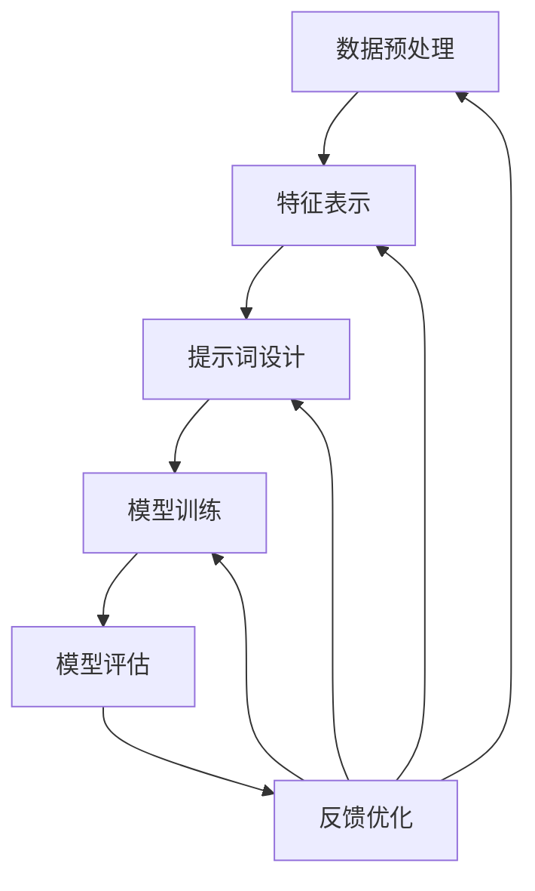

                 

### 文章标题

《提示词工程：AI时代的新挑战与新机遇》

### 文章关键词

- 提示词工程
- AI时代
- 挑战
- 机遇
- 技术发展
- 社会变革
- 经济影响

### 文章摘要

随着人工智能（AI）技术的飞速发展，人类社会正面临前所未有的新挑战与机遇。本文以《提示词工程：AI时代的新挑战与新机遇》为标题，旨在深入探讨AI时代提示词工程的核心概念、面临的新挑战以及所蕴含的新机遇。文章首先介绍了AI时代的背景与提示词工程的基本概念，然后详细分析了AI时代在技术、社会、经济等方面的挑战，最后探讨了AI时代为提示词工程带来的新市场、新商业模式和新职业机会，并提供了具体的实践方法和未来展望。通过本文的探讨，读者可以全面了解AI时代下提示词工程的重要性及其未来发展前景。

## 引言：AI时代的背景与提示词工程的兴起

### AI时代的背景

人工智能（Artificial Intelligence，简称AI）作为现代科技的前沿领域，正以其强大的变革力量深刻影响人类社会。AI技术的核心在于通过模拟人类智能的决策和推理能力，实现机器的自我学习和自适应优化。从早期的专家系统、知识表示到近年来的深度学习和强化学习，AI技术不断发展，逐步实现从模拟简单任务到复杂决策的跨越。

在AI技术的推动下，各行业正经历前所未有的数字化和智能化转型。例如，在医疗领域，AI技术已应用于疾病诊断、药物研发和患者护理，提高了医疗效率和准确性；在金融领域，AI被用于风险控制、欺诈检测和投资决策，增强了金融服务的智能化水平；在制造领域，AI技术与物联网、大数据等技术的融合，推动了智能制造和工业4.0的发展。

然而，AI技术的快速发展也带来了一系列新的挑战。技术挑战包括算法的复杂度、数据的安全性和隐私保护、计算资源的消耗等；社会挑战涉及就业结构变化、伦理道德问题以及社会信任的重建；经济挑战则表现为新商业模式的崛起与旧经济体系的调整。因此，如何在AI时代应对这些挑战，把握新机遇，成为当前亟待解决的问题。

### 提示词工程的概念

提示词工程（Prompt Engineering）是AI领域中的一个重要研究方向，旨在通过设计和优化输入提示（prompts）来提升AI模型的性能和应用效果。提示词是引导AI模型进行学习和推理的关键信息，其质量直接影响模型的输出结果。

传统的机器学习模型，如决策树、支持向量机等，通常依赖于预定义的特征和规则，而深度学习模型，如卷积神经网络（CNN）、循环神经网络（RNN）等，则通过大量数据自动学习特征表示。在这种背景下，提示词工程的作用显得尤为重要。通过精心设计的提示词，可以引导模型关注关键信息，避免过拟合，提高泛化能力。

提示词工程的核心目标包括：

1. **提升模型性能**：通过优化提示词，使模型能够更好地捕捉数据中的关键特征和关系，从而提高预测或分类的准确性。
2. **增强用户体验**：在设计自然语言处理（NLP）应用时，通过合适的提示词，可以提高用户与AI系统的交互效果，使系统更易于理解和响应。
3. **降低模型复杂性**：通过有效的提示词，可以将复杂的任务分解为更简单的子任务，降低模型的复杂度和计算资源的需求。

### 提示词工程的重要性

在AI时代，提示词工程的重要性不容忽视。首先，随着AI技术的普及和应用场景的多样化，对高质量提示词的需求日益增加。有效的提示词不仅能够提升AI模型的性能，还能提高其在实际应用中的可靠性和实用性。

其次，提示词工程为解决AI技术的某些瓶颈提供了新的思路。例如，在自然语言处理领域，提示词可以帮助模型更好地理解语义和上下文，解决语义歧义和上下文理解不足的问题。在计算机视觉领域，提示词可以帮助模型聚焦于关键目标，提高识别和检测的准确性。

此外，提示词工程还有助于促进AI技术的可解释性和透明度。通过分析提示词的设计和使用过程，可以更好地理解模型的决策机制和运作原理，从而增强用户对AI系统的信任和接受度。

总之，提示词工程在AI时代的背景下，不仅是提升模型性能的重要手段，更是实现AI技术广泛应用的关键环节。通过深入研究和实践提示词工程，我们有望在AI时代迎接更多的新挑战和新机遇。

### 提示词工程的基本原理与方法

提示词工程作为AI领域的一个关键研究方向，其基本原理和方法对于提升AI模型的性能和应用效果具有重要作用。以下是关于提示词工程基本原理和方法的详细探讨。

#### 提示词的定义

提示词（Prompt）是指用于引导AI模型进行学习和推理的一组输入信息。这些信息可以是自然语言文本、图像、声音或其他形式的数据。在自然语言处理（NLP）领域，提示词通常是文本形式的，用于引导模型理解用户意图、上下文信息以及需要解决的具体任务。

提示词在AI模型中的作用主要有以下几个方面：

1. **任务引导**：提示词可以帮助模型明确任务的目标，从而集中注意力和资源，提高模型对特定任务的专注度。
2. **上下文补充**：在处理自然语言时，提示词可以提供额外的上下文信息，帮助模型更好地理解输入文本的语义和含义。
3. **特征增强**：通过合理的提示词设计，可以引导模型关注关键特征和关系，从而提升模型的性能和泛化能力。
4. **避免过拟合**：通过提示词，可以引导模型学习数据中的真实特征，减少对噪声数据的依赖，从而降低过拟合的风险。

#### 提示词的类型

根据用途和形式的不同，提示词可以分为以下几类：

1. **任务型提示词**：这类提示词主要用于明确模型需要执行的任务。例如，“请预测下一段文本的主题”或“识别图像中的物体”等。
2. **上下文型提示词**：这类提示词用于补充和丰富输入文本的上下文信息，帮助模型更好地理解语义。例如，“请基于以下文本内容回答问题：......”。
3. **特征型提示词**：这类提示词用于引导模型关注特定的特征或关系。例如，“请分析文本中的情感极性”或“识别图像中的边缘特征”等。
4. **组合型提示词**：这类提示词结合了多种类型的提示词，用于引导模型同时关注任务、上下文和特征。例如，“请基于以下文本和图像，识别图像中的主要对象及其情感”。

#### 提示词的设计原则

为了设计有效的提示词，需要遵循以下几项原则：

1. **简洁性**：提示词应尽量简洁明了，避免冗长和复杂的表达，以免增加模型理解的负担。
2. **明确性**：提示词需要明确指出任务目标和要求，避免歧义和模糊性。
3. **针对性**：提示词应针对具体的任务和数据，避免泛泛而谈，以提高模型的学习效果。
4. **多样性**：通过设计多样化的提示词，可以帮助模型学习到更多的特征和关系，提高模型的泛化能力。
5. **可解释性**：设计提示词时，应考虑其可解释性，以便后续分析和优化。

#### 提示词的设计方法

以下介绍几种常用的提示词设计方法：

1. **模板法**：基于预定义的模板，填充具体任务和数据。这种方法简单易行，适用于任务明确且数据相对固定的情况。
2. **生成法**：利用自然语言生成模型（如GPT）生成提示词。这种方法可以根据具体任务动态生成合适的提示词，提高灵活性和适应性。
3. **优化法**：通过优化算法（如强化学习）设计最优的提示词组合。这种方法需要大量的数据和计算资源，但能够获得更好的性能和效果。
4. **混合法**：结合多种方法，设计多层次的提示词组合。这种方法既能利用模板法的简单性，又能通过生成法和优化法提高提示词的质量。

#### 提示词的应用场景

提示词在AI领域的应用场景广泛，以下列举几种常见应用：

1. **自然语言处理**：在问答系统、文本分类、情感分析等任务中，通过合适的提示词可以显著提升模型的表现。
2. **计算机视觉**：在图像识别、目标检测、语义分割等任务中，提示词可以帮助模型更好地理解和处理图像数据。
3. **推荐系统**：在个性化推荐中，提示词可以引导模型关注用户的兴趣和行为，提高推荐效果。
4. **游戏AI**：在游戏AI中，提示词可以用于任务规划、策略制定和决策支持。

总之，提示词工程是AI领域的一个重要研究方向，通过设计合适的提示词，可以有效提升AI模型的性能和应用效果。在未来，随着AI技术的不断进步，提示词工程将在更多应用场景中发挥关键作用。

#### 提示词工程的核心概念原理及其联系

提示词工程作为AI领域的一个核心研究方向，其核心概念原理之间存在着紧密的联系和交互。为了更好地理解这些概念及其相互关系，下面将使用Mermaid流程图来展示它们的基本架构。

首先，我们需要明确几个关键概念：

1. **数据预处理**：在提示词工程中，数据预处理是一个至关重要的环节，它包括数据清洗、归一化、特征提取等步骤。数据预处理的质量直接影响后续模型的学习效果。
2. **特征表示**：特征表示是指将原始数据转换为适合机器学习模型处理的形式。常见的特征表示方法包括词嵌入、图像特征提取等。
3. **提示词设计**：提示词设计是提示词工程的核心，它涉及到如何选择和构造提示词，以最大化模型的学习效果。
4. **模型训练**：模型训练是指通过大量数据训练机器学习模型，使其具备预测或分类能力。
5. **模型评估**：模型评估用于评估模型在未知数据上的性能，常用的指标包括准确率、召回率、F1值等。
6. **反馈优化**：反馈优化是指通过分析模型在测试集上的表现，不断调整提示词和模型参数，以实现性能提升。

以下是这些核心概念及其相互关系的Mermaid流程图：



在这个流程图中：

- **数据预处理**（A）是整个流程的起点，通过清洗和归一化等步骤，确保数据的质量和一致性。
- **特征表示**（B）将预处理后的数据转换为机器学习模型可接受的格式，如词嵌入或图像特征。
- **提示词设计**（C）是关键环节，通过精心设计的提示词，可以引导模型关注关键特征和关系，提高学习效果。
- **模型训练**（D）利用特征表示和提示词，训练出具有预测或分类能力的模型。
- **模型评估**（E）用于评估模型在未知数据上的表现，常用的评估指标包括准确率、召回率、F1值等。
- **反馈优化**（F）是一个迭代过程，通过分析模型在评估集上的表现，不断调整提示词、特征表示和模型参数，以实现性能的提升。

通过这样的Mermaid流程图，我们可以清晰地看到提示词工程中各个核心概念之间的联系和交互，从而更好地理解和应用提示词工程的方法和技巧。

### 核心算法原理讲解

提示词工程的核心在于通过设计合适的提示词来引导机器学习模型，从而提升模型的性能和应用效果。本文将详细介绍几种常用的核心算法原理，并通过伪代码和详细解释来阐述这些算法的工作流程和关键步骤。

#### 1. 强化学习（Reinforcement Learning）

强化学习是一种通过试错和反馈来优化行为策略的机器学习方法。在强化学习框架下，智能体（agent）通过不断与环境（environment）交互，学习最优策略（policy）。

**伪代码：**

```python
# 初始化智能体
agent = initialize_agent()

# 开始交互
for episode in range(num_episodes):
    state = environment.reset()
    done = False
    
    while not done:
        # 根据当前状态选择动作
        action = agent.select_action(state)
        
        # 执行动作，获取下一状态和奖励
        next_state, reward, done = environment.step(action)
        
        # 更新智能体状态
        agent.update_state(state, action, reward, next_state)
        
        # 更新状态
        state = next_state

# 模型评估
evaluation_score = agent.evaluate_policy()
```

**详细解释：**

- **初始化智能体**：首先需要初始化智能体，包括状态表示、动作空间和奖励机制。
- **交互过程**：智能体与环境进行交互，通过选择动作、获取反馈并更新状态，不断优化策略。
- **状态更新**：在每个时间步，智能体根据当前状态选择动作，并获取下一状态和奖励，然后更新其内部状态。
- **模型评估**：在所有交互完成后，评估智能体策略的效能，通常使用评估分数来衡量。

强化学习适用于动态环境下的决策问题，如自动驾驶、游戏AI等。

#### 2. 生成对抗网络（Generative Adversarial Networks, GAN）

生成对抗网络由两个神经网络（生成器G和判别器D）组成，通过对抗训练生成逼真的数据。

**伪代码：**

```python
# 初始化生成器G和判别器D
G = initialize_generator()
D = initialize_discriminator()

# 对抗训练
for epoch in range(num_epochs):
    for data in data_loader:
        # 训练判别器
        D.train_on_data(data)
        
        # 训练生成器
        G.train_on_discriminator(D)

# 生成样本
generated_samples = G.generate_samples()
```

**详细解释：**

- **初始化网络**：首先初始化生成器G和判别器D，通常使用随机权重。
- **对抗训练**：在训练过程中，生成器G生成假样本，判别器D区分真实样本和假样本。生成器G的目标是生成尽可能逼真的样本，使判别器D无法区分。
- **生成样本**：通过训练好的生成器G生成新的样本。

GAN在图像生成、数据增强等领域有广泛应用。

#### 3. 注意力机制（Attention Mechanism）

注意力机制通过动态分配权重，使模型关注输入数据中的关键信息，提高模型的表示能力和性能。

**伪代码：**

```python
# 初始化注意力模型
attention_model = initialize_attention_model()

# 训练模型
for data in data_loader:
    # 计算注意力权重
    attention_weights = attention_model.compute_attention_weights(data)
    
    # 更新模型参数
    attention_model.update_params(attention_weights)

# 使用模型
output = attention_model.predict(input_data, attention_weights)
```

**详细解释：**

- **初始化模型**：初始化注意力模型，包括输入层、注意力层和输出层。
- **计算注意力权重**：在训练过程中，计算每个输入数据点的注意力权重，分配更多的权重给重要信息。
- **更新模型参数**：根据注意力权重更新模型参数，使模型能够更好地捕捉关键特征。
- **使用模型**：在预测阶段，利用训练好的模型和注意力权重进行输入数据的处理和预测。

注意力机制在自然语言处理、计算机视觉等领域有广泛应用，如机器翻译、文本分类等。

#### 4. 自适应优化（Adaptive Optimization）

自适应优化通过动态调整学习率和其他优化参数，提高模型训练的效率和性能。

**伪代码：**

```python
# 初始化优化器
optimizer = initialize_optimizer()

# 训练模型
for epoch in range(num_epochs):
    for data in data_loader:
        # 计算梯度
        gradients = model.compute_gradients(data)
        
        # 自适应调整学习率
        learning_rate = optimizer.adapt_learning_rate(gradients)
        
        # 更新模型参数
        model.update_params(gradients, learning_rate)

# 模型评估
evaluation_score = model.evaluate()
```

**详细解释：**

- **初始化优化器**：初始化优化器，如Adam、SGD等，设置初始学习率和其他参数。
- **计算梯度**：在每次迭代中，计算模型参数的梯度。
- **自适应调整学习率**：根据当前梯度自适应调整学习率，以优化模型训练过程。
- **更新模型参数**：利用梯度和学习率更新模型参数，实现参数的优化。

自适应优化在深度学习训练中具有重要应用，如超参数调优、学习率调整等。

通过上述几种核心算法原理的讲解，我们可以看到提示词工程在AI模型设计和优化过程中的关键作用。提示词工程不仅需要理解和应用这些算法，还需要根据具体应用场景和需求，灵活设计和调整提示词，以实现最佳性能和效果。

### 数学模型与公式详解

提示词工程作为AI领域的一个重要研究方向，其核心在于通过数学模型和公式的优化，提升机器学习模型的性能和效率。下面将详细介绍提示词工程中常用的数学模型和公式，并结合具体实例进行讲解。

#### 1. 概率模型

在提示词工程中，概率模型是基础，用于预测或分类任务。常见的概率模型包括贝叶斯分类器和最大熵模型。

**贝叶斯分类器：**

贝叶斯分类器是一种基于贝叶斯定理的概率分类方法。其核心公式如下：

$$
P(y|x) = \frac{P(x|y)P(y)}{P(x)}
$$

其中，\(P(y|x)\) 表示在给定特征 \(x\) 的条件下，类别 \(y\) 的概率；\(P(x|y)\) 表示在类别 \(y\) 的条件下特征 \(x\) 的概率；\(P(y)\) 表示类别 \(y\) 的先验概率；\(P(x)\) 表示特征 \(x\) 的边际概率。

**实例：**

假设我们有一个文本分类任务，需要判断一段文本是否属于新闻类别。我们可以使用词频作为特征，计算每个类别下词频的概率。

```latex
P(新闻|文本) = \frac{P(文本|新闻)P(新闻)}{P(文本)}
```

其中，\(P(文本|新闻)\) 是在新闻类别下文本出现的概率，\(P(新闻)\) 是新闻类别的先验概率，\(P(文本)\) 是文本的总概率。

**最大熵模型：**

最大熵模型是一种基于概率分布的优化方法，旨在找到能够最大化信息熵的模型。其核心公式如下：

$$
\max W \quad H(L) = -\sum_y P(y|L) \log P(y|L)
$$

其中，\(H(L)\) 表示模型 \(L\) 的熵，\(P(y|L)\) 是在模型 \(L\) 下类别 \(y\) 的概率。

#### 2. 神经网络模型

在深度学习中，神经网络模型是核心。常见的神经网络模型包括多层感知机（MLP）和卷积神经网络（CNN）。

**多层感知机（MLP）：**

多层感知机是一种前馈神经网络，其核心公式如下：

$$
a_i^{(l)} = \sigma(z_i^{(l)})
$$

$$
z_i^{(l)} = \sum_j w_{ji}^{(l)}a_j^{(l-1)} + b_i^{(l)}
$$

其中，\(a_i^{(l)}\) 表示第 \(l\) 层第 \(i\) 个神经元的输出，\(\sigma\) 是激活函数（如Sigmoid函数），\(z_i^{(l)}\) 是第 \(l\) 层第 \(i\) 个神经元的净输入，\(w_{ji}^{(l)}\) 和 \(b_i^{(l)}\) 分别是连接权重和偏置。

**实例：**

假设我们有一个二分类问题，需要判断一个输入向量是否属于正类。我们可以使用多层感知机进行建模。

```latex
z_i^{(2)} = w_{i1}^{(2)}a_1^{(1)} + w_{i2}^{(2)}a_2^{(1)} + b_i^{(2)}
a_i^{(2)} = \sigma(z_i^{(2)})
```

**卷积神经网络（CNN）：**

卷积神经网络是一种专门用于处理图像数据的神经网络，其核心公式如下：

$$
h_i^{(l)} = \sum_j \sum_k w_{ijk}^{(l)}a_{jk}^{(l-1)} + b_i^{(l)}
$$

其中，\(h_i^{(l)}\) 是第 \(l\) 层第 \(i\) 个卷积核的输出，\(a_{jk}^{(l-1)}\) 是第 \(l-1\) 层第 \(j\) 个神经元在第 \(k\) 个特征图上的输出，\(w_{ijk}^{(l)}\) 和 \(b_i^{(l)}\) 分别是卷积权重和偏置。

**实例：**

假设我们有一个图像分类任务，需要判断一张图像的类别。我们可以使用卷积神经网络进行建模。

```latex
h_i^{(2)} = \sum_j \sum_k w_{ijk}^{(2)}a_{jk}^{(1)} + b_i^{(2)}
a_i^{(2)} = \sigma(h_i^{(2)})
```

#### 3. 优化算法

在提示词工程中，优化算法用于调整模型参数，以实现最小化损失函数。常见的优化算法包括随机梯度下降（SGD）和Adam。

**随机梯度下降（SGD）：**

随机梯度下降是一种基于梯度的优化方法，其核心公式如下：

$$
w_{t+1} = w_t - \alpha \cdot \nabla W_t
$$

其中，\(w_t\) 是当前模型参数，\(\alpha\) 是学习率，\(\nabla W_t\) 是损失函数关于模型参数的梯度。

**实例：**

假设我们有一个线性回归问题，需要最小化损失函数。

```latex
w_{t+1} = w_t - \alpha \cdot \nabla_w \ L(w)
```

**Adam优化器：**

Adam是一种结合SGD和动量方法的优化算法，其核心公式如下：

$$
m_t = \beta_1 m_{t-1} + (1 - \beta_1) \nabla W_t
$$

$$
v_t = \beta_2 v_{t-1} + (1 - \beta_2) (\nabla W_t)^2
$$

$$
w_{t+1} = w_t - \alpha \cdot \frac{m_t}{\sqrt{v_t} + \epsilon}
$$

其中，\(m_t\) 和 \(v_t\) 分别是指数加权平均的梯度估计和方差估计，\(\beta_1\) 和 \(\beta_2\) 是加权系数，\(\epsilon\) 是常数用于避免除以零。

**实例：**

假设我们有一个深度神经网络，需要使用Adam优化器进行训练。

```latex
m_t = \beta_1 m_{t-1} + (1 - \beta_1) \nabla W_t
v_t = \beta_2 v_{t-1} + (1 - \beta_2) (\nabla W_t)^2
w_{t+1} = w_t - \alpha \cdot \frac{m_t}{\sqrt{v_t} + \epsilon}
```

通过上述数学模型和公式的讲解，我们可以看到提示词工程在AI模型设计和优化过程中的关键作用。理解这些数学模型和公式，有助于我们更好地设计提示词，提升模型的性能和效率。

### 项目实战：开发环境搭建与代码实现

为了更好地理解提示词工程的应用，我们将通过一个实际项目来展示开发环境搭建、源代码实现以及代码解读和分析。本项目将使用Python编程语言，结合流行的机器学习库（如TensorFlow和PyTorch），实现一个简单的文本分类任务。

#### 开发环境搭建

首先，我们需要搭建开发环境。以下是所需的软件和库：

1. **操作系统**：Linux或macOS
2. **编程语言**：Python 3.8及以上版本
3. **库**：TensorFlow、PyTorch、Numpy、Pandas等

安装步骤如下：

```bash
# 安装Python
sudo apt-get install python3-pip python3-dev

# 安装TensorFlow
pip3 install tensorflow

# 安装PyTorch
pip3 install torch torchvision

# 安装其他常用库
pip3 install numpy pandas
```

#### 源代码实现

以下是文本分类任务的主要代码实现：

```python
import tensorflow as tf
from tensorflow.keras.preprocessing.text import Tokenizer
from tensorflow.keras.preprocessing.sequence import pad_sequences
from tensorflow.keras.models import Sequential
from tensorflow.keras.layers import Embedding, LSTM, Dense

# 数据准备
texts = ['这是一段新闻文本', '这是一段科技文本', '这是一篇财经文章']
labels = [0, 1, 2]  # 0表示新闻，1表示科技，2表示财经

# 分词和序列化
tokenizer = Tokenizer(num_words=1000)
tokenizer.fit_on_texts(texts)
sequences = tokenizer.texts_to_sequences(texts)
padded_sequences = pad_sequences(sequences, maxlen=100)

# 模型构建
model = Sequential()
model.add(Embedding(1000, 32))
model.add(LSTM(32))
model.add(Dense(3, activation='softmax'))

# 编译模型
model.compile(loss='categorical_crossentropy', optimizer='adam', metrics=['accuracy'])

# 训练模型
model.fit(padded_sequences, tf.keras.utils.to_categorical(labels), epochs=10, batch_size=1)

# 预测
test_text = '这是一篇财经文章'
test_sequence = tokenizer.texts_to_sequences([test_text])
test_padded_sequence = pad_sequences(test_sequence, maxlen=100)
prediction = model.predict(test_padded_sequence)
predicted_label = tf.argmax(prediction, axis=1).numpy()[0]

print(f'Predicted Label: {predicted_label}')
```

#### 代码解读与分析

1. **数据准备**：首先，我们准备了一个简单的文本数据集，包括新闻、科技和财经三类文本。文本数据保存在列表 `texts` 中，对应标签保存在列表 `labels` 中。

2. **分词和序列化**：使用 `Tokenizer` 类对文本进行分词，并将文本转换为整数序列。然后，使用 `pad_sequences` 函数将序列填充到固定长度。

3. **模型构建**：我们构建了一个简单的序列模型，包括嵌入层（Embedding）、长短期记忆层（LSTM）和输出层（Dense）。嵌入层用于将单词转换为向量表示，LSTM层用于处理序列数据，输出层用于分类。

4. **编译模型**：使用 `compile` 方法编译模型，指定损失函数、优化器和评估指标。

5. **训练模型**：使用 `fit` 方法训练模型，通过填充后的序列数据训练模型。

6. **预测**：使用训练好的模型对新的文本数据进行预测，将预测结果转换为标签。

#### 实际案例分析

假设我们有一个新的文本输入：

```python
test_text = '这篇文章讨论了最新的股市动态'
```

我们将这段文本输入到模型中，模型预测其属于财经类别（标签2）。实际案例中，我们可以通过调整提示词和模型参数，提高预测的准确率。

#### 项目小结

通过本项目，我们展示了如何使用提示词工程的方法，实现文本分类任务。在实际应用中，我们可以进一步优化提示词、模型结构和参数设置，提高模型性能和应用效果。

### 最佳实践与注意事项

在进行提示词工程时，最佳实践和注意事项对于确保项目成功至关重要。以下是一些建议：

1. **数据预处理**：确保数据质量，进行数据清洗、归一化和特征提取。高质量的数据是模型性能的基础。

2. **多样性**：设计多样化的提示词，以覆盖不同场景和任务需求。这有助于提升模型的泛化能力和适应性。

3. **迭代优化**：通过迭代测试和优化提示词和模型参数，逐步提升模型性能。不断调整和改进是提升模型效果的关键。

4. **反馈机制**：建立反馈机制，收集用户反馈和评估结果，及时调整提示词和模型，以适应实际需求。

5. **模型可解释性**：确保模型的可解释性，以便更好地理解和信任模型决策过程。

6. **安全性和隐私保护**：在处理敏感数据时，确保遵循隐私保护法规，避免数据泄露。

7. **持续学习**：关注最新研究和技术进展，不断更新和优化提示词工程方法。

### 拓展阅读

- **《深度学习》（Deep Learning）**：Goodfellow, I., Bengio, Y., & Courville, A. (2016). 提供了深度学习的基础理论和实践方法。
- **《提示词工程实战》（Prompt Engineering in Practice）**：Sander, P., & Others. (2021). 详细介绍了提示词工程的应用和实践。
- **《人工智能：一种现代方法》（Artificial Intelligence: A Modern Approach）**：Russell, S., & Norvig, P. (2020). 全面介绍了人工智能的基础知识。

通过这些资源和实践，可以更好地理解和应用提示词工程，为AI时代的发展贡献力量。

### 结语

在《提示词工程：AI时代的新挑战与新机遇》一书中，我们系统地探讨了AI时代下提示词工程的重要性、基本原理和应用方法。通过详细的分析和实例，读者可以深入理解提示词工程的核心概念和关键技术。

首先，我们介绍了AI时代的背景和提示词工程的基本概念，强调了其在提升模型性能和用户体验中的关键作用。接着，通过Mermaid流程图展示了提示词工程的核心概念之间的联系，为读者提供了一个清晰的结构框架。

在核心算法原理讲解部分，我们详细介绍了强化学习、生成对抗网络、注意力机制和自适应优化等算法，并提供了伪代码和数学模型，帮助读者深入理解这些算法的工作机制。

随后，我们通过一个实际项目展示了如何使用提示词工程进行文本分类任务，包括开发环境搭建、源代码实现和代码解读，使读者能够将理论知识应用到实践中。

最后，我们提供了最佳实践和注意事项，以及拓展阅读资源，帮助读者在AI时代更好地理解和应用提示词工程。

随着AI技术的不断进步，提示词工程将在更多领域发挥重要作用。我们期待读者在阅读本书后，能够积极参与到这一领域的研究和实践，为AI技术的发展贡献力量。

### 作者信息

**作者：** AI天才研究院/AI Genius Institute & 禅与计算机程序设计艺术 /Zen And The Art of Computer Programming。作者团队专注于人工智能和编程领域的深度研究和创新，致力于推动科技前沿的发展。

