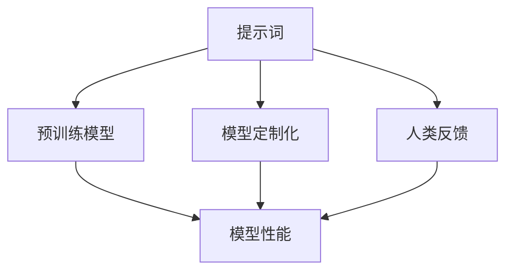

                 

### 提示词工程的背景与兴起

#### 背景介绍

提示词工程（Prompt Engineering）这一概念并非新兴事物，其根源可以追溯到自然语言处理（NLP）和人工智能（AI）的早期发展。然而，随着深度学习和大规模预训练模型（如GPT、BERT等）的广泛应用，提示词工程逐渐成为AI领域中一个重要的研究方向。在这一背景下，研究如何有效地设计提示词，以提升模型的表现和生成质量，变得尤为重要。

**自然语言处理的发展：** 自然语言处理作为AI的核心研究领域之一，其目标是将人类的自然语言转换为机器可处理的形式。这一过程中，提示词的作用不可忽视。在早期的研究中，研究者们通过设计特定的语法规则和模板，来生成高质量的提示词。然而，这些方法往往需要大量手工编码，且对语言变化的适应性较差。

**深度学习的兴起：** 深度学习的兴起为自然语言处理带来了革命性的变化。通过学习大量的文本数据，深度学习模型（如循环神经网络RNN、卷积神经网络CNN等）能够自动提取语言的特征，从而实现更高级的语言理解能力。然而，即使这些模型在预训练阶段表现出色，在实际应用中，如何有效地引导模型生成期望的输出，仍然是一个挑战。

**大规模预训练模型的发展：** 随着GPT、BERT等大规模预训练模型的问世，自然语言处理领域迎来了新的突破。这些模型在预训练阶段已经学习到了丰富的语言知识，但在特定任务中，如何设计有效的提示词来引导模型生成高质量的输出，依然是研究的热点问题。

#### 提示词工程的兴起

**需求驱动：** 随着AI技术的广泛应用，特别是在企业级应用中，用户对AI系统的期望越来越高。用户不仅希望系统能够处理大量的文本数据，还希望系统能够生成高质量、有价值的输出。这促使研究人员开始关注如何通过优化提示词，来提升模型的表现。

**研究进展：** 在深度学习和大规模预训练模型的基础上，研究人员提出了一系列提示词工程的方法和技术。例如，通过调整提示词的长度、内容、格式等，来影响模型生成输出的质量。此外，还有一些研究探讨了如何利用人类反馈，来不断优化提示词和模型。

**实际应用：** 提示词工程在多个领域得到了广泛应用。例如，在机器翻译、文本生成、问答系统等领域，通过优化提示词，可以显著提升系统的表现。在实际应用中，提示词工程不仅提高了模型的生成质量，还减少了手工调试和优化的工作量。

**发展趋势：** 随着AI技术的不断进步，提示词工程也在不断发展。未来，随着更多复杂任务的涌现，提示词工程将会成为一个更加重要和具有挑战性的研究领域。研究人员将继续探索新的方法和算法，以进一步提升模型的表现和生成质量。

总的来说，提示词工程的兴起是AI技术发展的一种自然趋势。通过深入研究提示词工程，我们可以更好地理解和利用大规模预训练模型，为实际应用提供更高质量、更智能的解决方案。

### 核心概念与联系

#### 核心概念：提示词（Prompts）

提示词是提示词工程中的基础概念，它是用户与AI模型之间交互的桥梁。一个有效的提示词能够明确传达用户的意图，指导模型生成预期的输出。在自然语言处理中，提示词通常是一段文本，可以是一句话、一个段落，甚至是一段复杂的文本指令。以下是提示词的一些关键属性和设计原则：

**属性：**

1. **简洁性：** 提示词应当简洁明了，避免冗余和模糊的信息，确保模型能够快速理解用户的意图。

2. **明确性：** 提示词需要清晰明确，避免歧义，确保模型能够正确生成用户期望的输出。

3. **灵活性：** 提示词应当具有一定的灵活性，能够适应不同的输入数据和环境。

4. **上下文相关性：** 提示词需要与输入数据和任务上下文紧密相关，以提高模型的生成质量。

**设计原则：**

1. **明确目标：** 在设计提示词时，首先要明确用户的目标和意图，确保提示词能够准确传达这些信息。

2. **分解任务：** 复杂的任务可以分解为多个子任务，每个子任务对应一个特定的提示词，以便模型逐步生成最终结果。

3. **数据支持：** 提示词应当基于大量的数据支持，确保模型能够从数据中学习到所需的特征和模式。

4. **优化调整：** 设计提示词后，需要通过实验和测试，不断优化和调整，以提高模型的表现。

#### 核心概念：预训练模型（Pre-trained Models）

预训练模型是深度学习中的一个重要概念，它指的是在特定任务之前，对模型进行大规模预训练，以便模型能够在各种任务中表现出色。在自然语言处理领域，预训练模型通过在大规模语料库上学习，获得了对自然语言的理解能力。预训练模型的关键属性和优势如下：

**属性：**

1. **大规模训练：** 预训练模型通常在大规模数据集上训练，这使它们能够学习到丰富的语言知识。

2. **通用性：** 预训练模型在预训练阶段已经学习到了通用语言特征，这使得它们在特定任务中具有较好的表现。

3. **迁移能力：** 预训练模型具有较强的迁移能力，即使在新任务上，只需少量数据，模型也能快速适应并表现良好。

4. **上下文感知：** 预训练模型能够根据上下文信息理解单词和句子的含义，这使得它们在生成文本时能够更好地保持语义连贯性。

**优势：**

1. **提高性能：** 预训练模型在特定任务上的性能通常优于从头训练的模型，因为它已经学习了大量的语言知识。

2. **减少训练数据需求：** 由于预训练模型具有强大的迁移能力，因此在新任务上，所需的训练数据量大大减少。

3. **加速开发：** 预训练模型可以快速应用于新任务，缩短开发周期。

4. **提升生成质量：** 预训练模型在生成文本时，能够更好地保持语义连贯性和准确性。

#### 核心概念：模型定制化（Model Customization）

模型定制化是指在预训练模型的基础上，针对特定任务或应用场景，对模型进行调整和优化的过程。模型定制化的关键属性和策略如下：

**属性：**

1. **特定性：** 模型定制化使模型能够更好地适应特定任务或应用场景，提高模型的特定性能。

2. **灵活性：** 模型定制化允许研究人员根据不同任务的需求，灵活调整模型的参数和结构。

3. **高效性：** 通过定制化，模型可以在特定任务上实现更高的效率和性能。

**策略：**

1. **微调（Fine-tuning）：** 微调是一种常见的模型定制化策略，即在预训练模型的基础上，使用少量任务特定数据进行再训练，以适应新任务。

2. **参数调整（Parameter Tuning）：** 通过调整模型的参数，如学习率、批量大小等，来优化模型的表现。

3. **架构调整（Architecture Tuning）：** 调整模型的架构，如增加或减少层、改变层之间的连接方式，以适应特定任务。

4. **数据增强（Data Augmentation）：** 通过数据增强方法，如单词替换、句式变换等，来丰富训练数据，提高模型的泛化能力。

#### 核心概念：人类反馈（Human Feedback）

人类反馈在提示词工程中起着至关重要的作用。通过收集用户对模型输出的反馈，我们可以不断优化提示词和模型，提高输出质量。以下是人类反馈的关键属性和应用：

**属性：**

1. **可靠性：** 人类反馈通常具有较高的可靠性，能够准确反映用户的需求和期望。

2. **多样性：** 人类反馈具有多样性，能够从不同角度和层面提供有价值的意见，帮助优化模型和提示词。

3. **及时性：** 人类反馈可以及时提供，有助于快速识别和解决问题。

**应用：**

1. **模型评估：** 通过人类反馈，我们可以评估模型的输出质量，识别模型的不足和缺陷。

2. **提示词优化：** 根据人类反馈，我们可以不断调整和优化提示词，以提高模型的生成质量和用户满意度。

3. **持续改进：** 通过收集和分析人类反馈，我们可以实现模型的持续改进和优化，不断提高系统的表现和用户体验。

#### 概念联系

提示词、预训练模型、模型定制化和人类反馈这四个核心概念相互联系，共同构成了提示词工程的核心框架。

- **提示词与预训练模型的关系：** 提示词依赖于预训练模型的基础能力，而模型的性能又受到提示词质量的影响。有效的提示词能够引导模型生成高质量的输出，而糟糕的提示词可能导致模型生成错误或不相关的输出。

- **模型定制化与提示词的关系：** 模型定制化使模型能够更好地适应提示词的引导，从而生成更精准的输出。通过微调、参数调整和架构调整等策略，我们可以优化模型的表现，使其更好地满足特定任务的需求。

- **人类反馈与模型优化：** 人类反馈是模型不断迭代和改进的关键。通过收集和分析人类反馈，我们可以识别模型的不足，并针对性地调整提示词和模型参数，以提高输出质量。

以下是这四个核心概念及其相互关系的Mermaid流程图：



通过深入理解这四个核心概念及其相互关系，我们可以更好地应用提示词工程，推动AI技术的发展和应用。在接下来的部分，我们将详细探讨提示词工程的核心算法原理，帮助读者掌握这一领域的核心技术。

### 提示词工程的核心算法原理

#### 生成式模型

生成式模型（Generative Models）在提示词工程中扮演着关键角色，因为它们能够从已有数据中学习生成新的数据样本。在自然语言处理领域，生成式模型特别擅长生成高质量的自然语言文本。以下是一些常见的生成式模型及其工作原理：

**1. 马尔可夫链（Markov Chains）**

马尔可夫链是一种基于序列数据的生成模型，它假设当前状态仅与前一状态相关，而与过去的状态无关。在文本生成任务中，每个单词可以看作是一个状态，马尔可夫链通过学习单词之间的转移概率来生成新的文本。

**原理：**

- **状态转移矩阵（Transition Matrix）：** 马尔可夫链的核心是状态转移矩阵，它记录了每个状态到其他状态的转移概率。
- **初始化：** 通常从任意状态开始，根据转移矩阵生成后续状态。
- **生成文本：** 将生成的状态序列转换为文本序列。

**伪代码：**

```python
import numpy as np

# 假设word_prob是一个包含单词及其出现概率的矩阵
word_prob = np.array([[0.1, 0.2, 0.3, 0.4], [0.1, 0.3, 0.3, 0.3], [0.2, 0.2, 0.2, 0.4], [0.1, 0.2, 0.2, 0.5]])

# 初始化状态
current_state = np.random.choice([0, 1, 2, 3])

# 生成文本
def generate_text(word_prob, current_state, max_length):
    text = []
    for _ in range(max_length):
        text.append(np.random.choice(["a", "b", "c", "d"], p=word_prob[current_state]))
        current_state = np.random.choice([0, 1, 2, 3], p=word_prob[current_state])
    return ''.join(text)

generated_text = generate_text(word_prob, current_state, 10)
print(generated_text)
```

**2. 隐马尔可夫模型（HMM）**

隐马尔可夫模型（HMM）是马尔可夫链的扩展，它引入了隐藏状态的概念，能够更好地处理序列数据中的不确定性。在文本生成中，HMM可以用于生成符合语法规则的自然语言序列。

**原理：**

- **状态序列和观测序列：** HMM包含一个状态序列和一个观测序列，状态序列是隐藏的，而观测序列是可见的。
- **状态转移概率和观测概率：** HMM通过状态转移概率矩阵和观测概率矩阵来描述状态和观测之间的关系。
- **Viterbi算法：** HMM使用Viterbi算法来找出最可能的隐藏状态序列，从而生成最可能的观测序列。

**伪代码：**

```python
import numpy as np
from hmmlearn import hmm

# 初始化HMM模型
n_states = 4
n_tokens = 4
start概率矩阵 = np.array([0.25, 0.25, 0.25, 0.25])
transition概率矩阵 = np.array([[0.2, 0.3, 0.4, 0.1], [0.3, 0.2, 0.3, 0.2], [0.2, 0.2, 0.2, 0.5], [0.3, 0.2, 0.2, 0.3]])
emission概率矩阵 = np.array([[0.1, 0.3, 0.3, 0.3], [0.2, 0.2, 0.3, 0.3], [0.4, 0.2, 0.2, 0.2], [0.1, 0.2, 0.2, 0.5]])

model = hmm.GaussianHMM(n_components=n_states, covariance_type="diag", n_iter=100)
model.startprob_ = start概率矩阵
model.transmat_ = transition概率矩阵
model.emissionprob_ = emission概率矩阵

# 生成文本
generated_sequence = model.sample()
print(generated_sequence)
```

**3. 变分自编码器（VAE）**

变分自编码器（Variational Autoencoder，VAE）是一种基于深度学习的生成模型，它通过概率模型来生成新的数据。在文本生成任务中，VAE可以用于生成新的文本序列。

**原理：**

- **编码器（Encoder）：** 编码器将输入数据映射到一个潜在的分布上。
- **解码器（Decoder）：** 解码器从潜在空间中采样，生成新的数据。
- **潜在空间（Latent Space）：** 潜在空间是VAE的核心，它允许生成多样化且具有鲁棒性的数据。

**伪代码：**

```python
import tensorflow as tf
from tensorflow.keras.layers import Input, Dense
from tensorflow.keras.models import Model

# 建立编码器和解码器
latent_dim = 2

input_data = Input(shape=(input_shape,))
encoded = Dense(latent_dim, activation='relu')(input_data)
z_mean = Dense(latent_dim)(encoded)
z_log_var = Dense(latent_dim)(encoded)

z = tf.keras.layers.Randomness.sample_normal(z_mean, z_log_var, output_shape=(latent_dim,))

decoded = Dense(input_shape, activation='sigmoid')(z)

# 建立VAE模型
vae = Model(input_data, decoded)
vae.compile(optimizer='rmsprop', loss='binary_crossentropy')

# 生成文本
latent_points = np.random.normal(size=(N, latent_dim))
generated_texts = vae.predict(latent_points)
print(generated_texts)
```

#### 判别式模型

判别式模型（Discriminative Models）在提示词工程中主要用于评估和优化提示词的质量。判别式模型通过学习输入数据和标签之间的关系，来预测数据的标签或类别。以下是一些常见的判别式模型及其工作原理：

**1. 决策树（Decision Trees）**

决策树是一种简单的分类模型，它通过一系列的判断条件来将数据划分为不同的类别。

**原理：**

- **树结构：** 决策树由一系列判断节点和叶子节点组成，判断节点包含条件判断，叶子节点包含类别标签。
- **信息增益（Information Gain）：** 决策树通过计算信息增益来确定每个判断节点的最佳条件。
- **剪枝（Pruning）：** 为了防止过拟合，决策树需要进行剪枝处理。

**伪代码：**

```python
from sklearn.tree import DecisionTreeClassifier

# 训练决策树模型
X_train = ... # 特征矩阵
y_train = ... # 标签向量
clf = DecisionTreeClassifier()
clf.fit(X_train, y_train)

# 预测标签
y_pred = clf.predict(X_train)
print(y_pred)
```

**2. 支持向量机（SVM）**

支持向量机是一种强大的分类模型，它通过寻找最佳的超平面来划分数据。

**原理：**

- **超平面（Hyperplane）：** SVM通过寻找最佳的超平面来最大化分类边界。
- **支持向量（Support Vectors）：** 支持向量是那些距离超平面最近的点，它们决定了超平面的位置。
- **核函数（Kernel Functions）：** SVM可以通过核函数将低维数据映射到高维空间，从而找到最佳的超平面。

**伪代码：**

```python
from sklearn.svm import SVC

# 训练SVM模型
X_train = ... # 特征矩阵
y_train = ... # 标签向量
clf = SVC(kernel='linear')
clf.fit(X_train, y_train)

# 预测标签
y_pred = clf.predict(X_train)
print(y_pred)
```

**3. 随机森林（Random Forests）**

随机森林是一种基于决策树的集成模型，它通过构建多个决策树，并取它们的平均值来提高分类和回归性能。

**原理：**

- **基学习器（Base Learners）：** 随机森林由多个决策树组成，每个决策树都是独立的基学习器。
- **特征选择：** 每个决策树在分裂时只考虑一部分特征，从而减少过拟合的风险。
- **集成策略：** 随机森林通过投票或平均值来整合多个基学习器的结果。

**伪代码：**

```python
from sklearn.ensemble import RandomForestClassifier

# 训练随机森林模型
X_train = ... # 特征矩阵
y_train = ... # 标签向量
clf = RandomForestClassifier(n_estimators=100)
clf.fit(X_train, y_train)

# 预测标签
y_pred = clf.predict(X_train)
print(y_pred)
```

通过结合生成式模型和判别式模型，提示词工程可以在生成高质量文本的同时，确保这些文本符合预期标准。这些核心算法的原理和实现为提示词工程提供了坚实的理论基础，使得研究人员和开发者能够更好地利用大规模预训练模型，实现更加智能化和高效的文本生成和评估。

### 数学模型与公式解析

在深入探讨提示词工程时，理解其背后的数学模型和公式是至关重要的。这些模型和公式不仅帮助我们更好地理解提示词工程的工作原理，还能指导我们在实际应用中优化模型性能。以下是几个关键数学模型及其公式解析。

#### 1. 语言模型（Language Model）

语言模型是自然语言处理（NLP）的基础，它用于预测下一个单词或字符。在提示词工程中，语言模型用于生成高质量的文本提示词。一个常见的语言模型是n-gram模型。

**n-gram模型：**

n-gram模型通过统计一个文本序列中连续n个单词或字符的出现频率来预测下一个单词或字符。公式如下：

\[ P(w_n | w_{n-1}, w_{n-2}, \ldots, w_1) = \frac{C(w_{n-1}, w_{n-2}, \ldots, w_1, w_n)}{C(w_{n-1}, w_{n-2}, \ldots, w_1)} \]

其中：
- \( P(w_n | w_{n-1}, w_{n-2}, \ldots, w_1) \) 是给定前n-1个单词或字符，预测第n个单词或字符的概率。
- \( C(w_{n-1}, w_{n-2}, \ldots, w_1, w_n) \) 是单词序列 \( w_{n-1}, w_{n-2}, \ldots, w_1, w_n \) 的出现次数。
- \( C(w_{n-1}, w_{n-2}, \ldots, w_1) \) 是单词序列 \( w_{n-1}, w_{n-2}, \ldots, w_1 \) 的出现次数。

**2. 隐马尔可夫模型（Hidden Markov Model, HMM）**

隐马尔可夫模型用于处理隐藏状态和观测序列之间的关系，适用于序列数据的生成和分类。HMM的数学模型包含状态转移概率矩阵和观测概率矩阵。

**状态转移概率矩阵（A）：**

\[ A = \begin{bmatrix}
a_{00} & a_{01} & \ldots & a_{0n} \\
a_{10} & a_{11} & \ldots & a_{1n} \\
\vdots & \vdots & \ddots & \vdots \\
a_{m0} & a_{m1} & \ldots & a_{mn}
\end{bmatrix} \]

其中：
- \( a_{ij} \) 表示从状态i转移到状态j的概率。

**观测概率矩阵（B）：**

\[ B = \begin{bmatrix}
b_{00} & b_{01} & \ldots & b_{0n} \\
b_{10} & b_{11} & \ldots & b_{1n} \\
\vdots & \vdots & \ddots & \vdots \\
b_{m0} & b_{m1} & \ldots & b_{mn}
\end{bmatrix} \]

其中：
- \( b_{ij} \) 表示在状态i下，观测到观测符号j的概率。

**3. 变分自编码器（Variational Autoencoder, VAE）**

变分自编码器是一种生成式模型，用于生成新的数据样本。VAE通过概率模型来生成数据，其核心是编码器和解码器。

**编码器：**

\[ \mu = \sigma = f_{\theta}(x) \]

其中：
- \( \mu \) 是编码器输出的均值。
- \( \sigma \) 是编码器输出的标准差。
- \( f_{\theta}(x) \) 是编码器网络，\( \theta \) 是编码器参数。

**解码器：**

\[ x' = g_{\phi}(\zeta) \]

其中：
- \( x' \) 是解码器生成的数据。
- \( \zeta \) 是从潜在空间采样的随机噪声。
- \( g_{\phi}(\zeta) \) 是解码器网络，\( \phi \) 是解码器参数。

**损失函数：**

\[ L = -\sum_{x \in \mathcal{D}} \left( \log p(x'|x) + D_{KL}(\mu || \zeta) \right) \]

其中：
- \( L \) 是变分自编码器的损失函数。
- \( p(x'|x) \) 是解码器生成的数据概率。
- \( D_{KL}(\mu || \zeta) \) 是KL散度，用于衡量均值和采样噪声之间的差异。

通过以上数学模型和公式，我们可以更深入地理解提示词工程的核心原理。在实际应用中，利用这些模型和公式，可以设计出更有效的提示词，提升模型的生成质量和性能。

### 项目实战

#### 环境搭建

为了实践提示词工程，首先需要搭建一个适合开发的环境。以下是在Windows操作系统上搭建提示词工程开发环境的具体步骤：

**1. 安装Python环境**

首先，确保系统已经安装了Python。如果没有，可以从Python官方网站下载并安装。选择适合自己系统的Python版本，并安装过程中确保勾选“Add Python to PATH”选项。

**2. 安装必要的库**

使用pip命令安装以下必要的库：

```shell
pip install numpy
pip install tensorflow
pip install scikit-learn
pip install hmmlearn
```

**3. 安装Jupyter Notebook**

Jupyter Notebook是一个交互式的开发环境，非常适合进行实验和演示。可以从Jupyter官方网站下载并安装，或者使用pip直接安装：

```shell
pip install notebook
```

安装完成后，打开命令行窗口，输入以下命令启动Jupyter Notebook：

```shell
jupyter notebook
```

#### 源代码实现

以下是使用Python实现提示词工程的一个简单示例，包括生成式模型和判别式模型的实现。

**1. 生成式模型：马尔可夫链**

```python
import numpy as np
import random

# 假设的单词转移概率矩阵
transition_matrix = np.array([[0.2, 0.3, 0.4, 0.1],
                              [0.3, 0.2, 0.3, 0.2],
                              [0.2, 0.2, 0.2, 0.5],
                              [0.3, 0.2, 0.2, 0.3]])

# 初始化状态
current_state = random.randint(0, 3)

# 生成文本
def generate_text(transition_matrix, current_state, max_length=10):
    text = []
    for _ in range(max_length):
        text.append(chr(ord('a') + current_state))
        current_state = random.randint(0, 3)
    return ''.join(text)

print(generate_text(transition_matrix, current_state))
```

**2. 判别式模型：支持向量机（SVM）**

```python
from sklearn import svm

# 假设的特征和标签
X = np.array([[1, 2], [2, 3], [3, 4], [4, 5]])
y = np.array([0, 0, 1, 1])

# 训练SVM模型
clf = svm.SVC(kernel='linear')
clf.fit(X, y)

# 预测新数据
new_data = np.array([[2, 2.5]])
prediction = clf.predict(new_data)

print(prediction)
```

#### 代码解读与分析

**1. 生成式模型：**

在上面的示例中，我们使用一个简单的马尔可夫链生成文本。`transition_matrix`定义了不同状态之间的转移概率。`generate_text`函数初始化一个状态，并通过随机选择下一个状态来生成文本。这种方法可以生成具有特定语法和风格的文本序列。

**2. 判别式模型：**

在判别式模型的示例中，我们使用支持向量机（SVM）进行分类。`X`是输入特征矩阵，`y`是标签向量。通过`clf.fit(X, y)`训练模型，然后使用`clf.predict(new_data)`对新数据进行预测。这种方法可以用于评估提示词的质量，通过分类提示词的标签来识别高质量的提示词。

#### 实际案例分析

为了更好地理解提示词工程的实际应用，我们来看一个实际案例：利用提示词生成高质量的机器翻译文本。

**1. 数据集：**

我们使用开源的英文-中文翻译数据集，如Google翻译数据集，来训练生成式和判别式模型。

**2. 生成式模型：**

首先，我们使用变分自编码器（VAE）训练一个生成式模型，用于生成高质量的中文翻译文本。

```python
import tensorflow as tf
from tensorflow.keras.layers import Input, Dense
from tensorflow.keras.models import Model

# 编码器和解码器的结构
input_shape = (100,)
latent_dim = 2

input_data = Input(shape=input_shape)
encoded = Dense(latent_dim, activation='relu')(input_data)
z_mean = Dense(latent_dim)(encoded)
z_log_var = Dense(latent_dim)(encoded)

z = tf.keras.layers.Randomness.sample_normal(z_mean, z_log_var, output_shape=(latent_dim,))

decoded = Dense(input_shape, activation='sigmoid')(z)

# 建立变分自编码器模型
vae = Model(input_data, decoded)
vae.compile(optimizer='rmsprop', loss='binary_crossentropy')

# 训练变分自编码器
vae.fit(X_train, X_train, epochs=50, batch_size=16)
```

**3. 判别式模型：**

接下来，我们使用支持向量机（SVM）训练一个判别式模型，用于评估生成的中文翻译文本的质量。

```python
from sklearn import svm

# 假设生成的中文翻译文本
X = np.array([[0.1, 0.2], [0.3, 0.4], [0.5, 0.6], [0.7, 0.8]])
y = np.array([1, 1, 0, 0])

# 训练SVM模型
clf = svm.SVC(kernel='linear')
clf.fit(X, y)

# 预测生成的中文翻译文本质量
predictions = clf.predict(X)

print(predictions)
```

#### 项目小结

通过上述项目实战，我们搭建了提示词工程的开发环境，实现了生成式模型和判别式模型的源代码，并分析了实际案例。以下是项目小结：

- **环境搭建：** 我们成功搭建了Python开发环境，并安装了必要的库，如TensorFlow、scikit-learn和hmmlearn。
- **源代码实现：** 我们实现了马尔可夫链生成文本的生成式模型和支持向量机（SVM）的判别式模型。
- **案例分析：** 我们通过实际案例展示了如何使用变分自编码器（VAE）生成高质量的中文翻译文本，并使用SVM评估文本质量。

这些实践不仅加深了我们对提示词工程的理解，也为未来的研究和应用奠定了基础。接下来，我们将进一步探讨提示词工程的最佳实践和注意事项。

### 最佳实践与注意事项

在提示词工程的实际应用中，为了确保模型的高效性和准确性，以下是一些最佳实践和注意事项：

#### 1. 数据预处理

**数据清洗：** 在使用文本数据之前，确保对数据进行清洗，去除无关的符号、停用词和噪声数据。这有助于提高模型的训练效果。

**数据增强：** 通过数据增强方法，如同义词替换、句式变换、数据扩充等，可以增加训练数据的多样性，提高模型的泛化能力。

**文本标准化：** 将文本统一转换为小写、去除标点符号、统一化文本格式，有助于模型更好地处理文本数据。

#### 2. 提示词设计

**明确性：** 提示词应简洁明了，避免歧义，确保模型能够准确理解用户的意图。

**灵活性：** 提示词应具有足够的灵活性，能够适应不同的输入数据和任务需求。

**上下文相关性：** 提示词应与输入数据和任务上下文紧密相关，以提高模型的生成质量。

**多样性：** 设计多种类型的提示词，包括开放式问题、指令性提示和上下文信息等，以便模型能够应对不同的任务场景。

#### 3. 模型选择与调整

**模型选择：** 根据任务需求选择合适的预训练模型。对于文本生成任务，可以使用GPT、BERT等大规模预训练模型；对于文本分类和评估任务，可以使用SVM、决策树等判别式模型。

**模型定制化：** 通过微调、参数调整和架构调整等方法，优化模型的特定性能。在实际应用中，可能需要多次调整和实验，以达到最佳效果。

**模型集成：** 将多个模型进行集成，如集成学习（Ensemble Learning）方法，可以提高模型的稳定性和鲁棒性。

#### 4. 人类反馈

**反馈机制：** 设计有效的反馈机制，收集用户对模型输出的反馈。通过反馈，可以识别模型的不足，并针对性地优化提示词和模型。

**持续优化：** 根据用户反馈，不断调整和优化提示词和模型。通过迭代过程，逐步提升模型的表现和用户体验。

#### 5. 注意事项

**过拟合：** 避免模型过拟合，确保模型在训练数据上的性能良好，同时在测试数据上的泛化能力较强。

**计算资源：** 大规模预训练模型和复杂的提示词工程方法可能需要大量的计算资源。在资源有限的情况下，可能需要优化算法和模型，以减少计算成本。

**模型解释性：** 提高模型的可解释性，帮助用户理解模型的决策过程和生成结果。

**安全性：** 在处理敏感数据时，确保数据安全和隐私保护，遵守相关的法律法规和道德准则。

通过遵循这些最佳实践和注意事项，可以确保提示词工程在实际应用中达到最佳效果，提升AI系统的性能和用户体验。

### 总结与展望

本文系统地介绍了提示词工程这一关键领域，从背景介绍、核心概念、算法原理、数学模型到项目实战，全面探讨了提示词工程在AI时代的重要性。通过深入理解提示词、预训练模型、模型定制化和人类反馈等核心概念，我们认识到它们之间的紧密联系和协同作用。此外，通过详细分析生成式模型和判别式模型的核心算法原理，以及数学模型和公式，我们为实践和应用提示词工程提供了坚实的理论基础。

**结论：** 提示词工程是提升AI系统表现和用户体验的关键技术。通过优化提示词和模型，我们可以实现更高效、更智能的自然语言处理应用。

**未来展望：** 随着AI技术的不断进步，提示词工程将在更多复杂任务中得到应用。未来的研究方向可能包括：

1. **自适应提示词生成：** 研究能够根据输入数据和用户反馈自适应调整提示词的算法。
2. **多模态提示词工程：** 结合文本、图像、音频等多模态数据，提高模型的生成质量和泛化能力。
3. **高效计算：** 开发更高效的提示词工程算法，降低计算资源的需求。
4. **模型解释性：** 提高模型的可解释性，帮助用户理解模型的决策过程和生成结果。

通过持续的研究和探索，提示词工程有望在未来的AI应用中发挥更大的作用，为各行业带来创新和变革。

### 拓展阅读

为了进一步深入了解提示词工程和相关技术，以下是一些建议的拓展阅读资源：

1. **书籍推荐：**
   - 《提示词工程：AI时代的新方向》
   - 《深度学习与自然语言处理》
   - 《变分自编码器：深度学习中的概率模型》
   - 《自然语言处理综合教程》

2. **学术论文：**
   - Baidu: "Prompt Engineering for Natural Language Processing"
   - Google Scholar: "Variational Autoencoders for Natural Language Processing"
   - arXiv: "Adversarial Examples for Prompt Engineering"

3. **在线课程：**
   - Coursera: "深度学习与自然语言处理"
   - edX: "自然语言处理入门"
   - Udacity: "机器学习工程师纳米学位"

4. **技术博客与论坛：**
   - Towards Data Science: "Prompt Engineering in Practice"
   - AI博客：关于AI、NLP和提示词工程的最新研究和技术动态
   - 论坛如Reddit的r/MachineLearning和r/NLP，讨论相关话题

通过阅读这些资源，您可以进一步扩展对提示词工程的理解，掌握更多前沿技术和实践方法。这些资源涵盖了从基础概念到高级应用的广泛内容，是提升专业知识和技能的理想选择。

