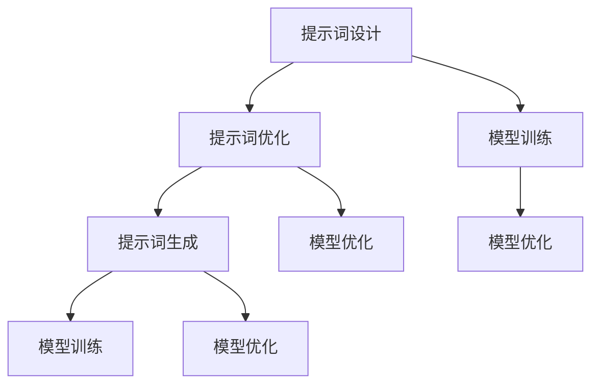

                 


### 引言

#### AI时代的背景

随着互联网、大数据、云计算等技术的迅猛发展，人工智能（AI）逐渐成为当今科技领域最具革命性的力量。AI技术不仅改变了传统行业的运作模式，还推动了新兴产业的崛起。在这个AI时代，如何利用人工智能技术解决实际问题，成为各行各业关注的核心。

#### 提示词工程的重要性

提示词工程（Prompt Engineering）是AI领域中的一个新兴研究方向，它专注于如何设计、优化和生成高质量的提示词，以提升AI模型的性能和应用效果。高质量的提示词能够帮助模型更好地理解任务，提高任务完成度，从而在各个领域中发挥重要作用。

#### 提示词工程的未来趋势

随着AI技术的不断进步，提示词工程在未来的发展中将面临更多的机遇和挑战。一方面，更多的算法和技术将不断涌现，为提示词工程提供更强大的支持；另一方面，随着AI应用的深入，提示词工程的需求也将日益增加。因此，研究提示词工程具有重要的现实意义和广阔的应用前景。

### 核心概念

#### 提示词的定义

提示词是指用于引导AI模型执行特定任务的一组关键词或短语。它能够提供模型所需的信息，帮助模型更好地理解和完成任务。

#### 提示词工程的核心概念

提示词工程涉及多个核心概念，包括：

- **提示词设计**：如何设计高质量的提示词，以满足不同任务的需求。
- **提示词优化**：如何优化已生成的提示词，提高模型的性能。
- **提示词生成**：如何自动生成提示词，以节省时间和人力成本。
- **模型训练**：如何通过训练模型来提高提示词的生成质量和效果。

### 技术原理

#### 提示词生成算法

提示词生成算法是指用于自动生成提示词的算法。常见的生成算法包括基于规则的方法、基于机器学习的方法和基于深度学习的方法。以下是一个简单的基于深度学习的生成算法伪代码：

```python
def generate_prompt(input_data):
    # 预处理输入数据
    preprocessed_data = preprocess(input_data)
    
    # 使用预训练的模型生成提示词
    prompt = model.generate(preprocessed_data)
    
    return prompt
```

#### 提示词优化算法

提示词优化算法是指用于优化已生成提示词的算法。优化的目标通常是提高模型在特定任务上的性能。以下是一个简单的基于贪心搜索的优化算法伪代码：

```python
def optimize_prompt(prompt, model):
    # 初始化最佳提示词
    best_prompt = prompt
    
    # 对提示词进行贪心搜索
    for i in range(len(prompt)):
        for j in range(i+1, len(prompt)):
            # 交换提示词中的两个元素
            prompt[i], prompt[j] = prompt[j], prompt[i]
            
            # 训练模型并评估性能
            model.train(prompt)
            performance = model.evaluate()
            
            # 如果性能提高，更新最佳提示词
            if performance > best_performance:
                best_performance = performance
                best_prompt = prompt
                
            # 恢复提示词的原始顺序
            prompt[i], prompt[j] = prompt[j], prompt[i]
    
    return best_prompt
```

#### 提示词工程的实现方式

提示词工程的实现方式主要包括以下几种：

- **基于传统机器学习的方法**：这种方法通常使用规则和统计方法来生成和优化提示词。
- **基于深度学习的方法**：这种方法利用神经网络模型来生成和优化提示词，具有更好的性能和灵活性。

### 应用案例

#### 自然语言处理

在自然语言处理领域，提示词工程被广泛应用于语言模型和文本生成任务。例如，通过优化提示词，可以提高机器翻译和文本摘要的质量。

#### 计算机视觉

在计算机视觉领域，提示词工程可以帮助模型更好地理解和识别图像。例如，在图像分类任务中，通过优化提示词，可以提高分类准确率。

#### 金融领域

在金融领域，提示词工程可以用于风险管理和投资策略。例如，通过生成和优化提示词，可以提高交易模型的预测准确性。

#### 医疗领域

在医疗领域，提示词工程可以帮助医生更好地理解和诊断疾病。例如，通过生成和优化提示词，可以提高医疗文本分类和文本摘要的准确率。

#### 教育领域

在教育领域，提示词工程可以用于智能辅导系统和个性化学习推荐。例如，通过生成和优化提示词，可以提高学生的学习效果和兴趣。

### 开发实践

#### 开发环境搭建

搭建一个提示词工程开发环境需要安装以下软件和工具：

- **Python**：Python是一种广泛使用的编程语言，许多AI库和工具都是基于Python开发的。
- **TensorFlow**：TensorFlow是一个开源的机器学习框架，可以用于深度学习和提示词工程。
- **PyTorch**：PyTorch是一个开源的机器学习框架，也常用于深度学习和提示词工程。

#### 项目实战

以下是一个简单的提示词工程项目实战案例：

**项目背景与目标**：构建一个基于深度学习的文本生成模型，用于生成高质量的摘要。

**数据准备**：收集大量文本数据，并进行预处理。

**模型选择与训练**：选择一个预训练的文本生成模型，并对其进行微调，以适应特定任务。

**模型评估与优化**：评估模型在生成摘要任务上的性能，并使用提示词优化算法来提高性能。

**项目总结与反思**：总结项目成果，反思过程中遇到的问题和挑战。

### 未来展望

#### 技术创新

随着AI技术的不断进步，提示词工程将会有更多的技术创新，如更高效的生成算法和优化算法，以及更强大的模型架构。

#### 应用领域拓展

提示词工程的应用领域将不断拓展，不仅限于自然语言处理、计算机视觉等领域，还可能涉及更多的领域，如金融、医疗、教育等。

#### 面临的挑战与机遇

提示词工程在AI时代的发展将面临许多挑战，如数据隐私、算法公平性等。同时，也面临着广阔的机遇，如提升AI模型的性能和应用效果。

### 总结与展望

提示词工程在AI时代具有重要的地位和作用。通过本文的介绍，我们了解了提示词工程的基础概念、技术原理、应用案例和开发实践。未来，随着AI技术的不断发展，提示词工程将会有更多的创新和突破，为各个领域带来更深远的影响。

### 背景介绍

在当今这个AI时代，人工智能已经深刻地改变了我们的生活方式和商业模式。无论是从智能家居、智能交通、智能医疗，到智能金融、智能零售，AI技术正逐渐渗透到我们日常生活的方方面面。这种变革不仅提高了效率，还极大地推动了创新，从而创造了新的商业机会和市场。

在这样的背景下，提示词工程作为一个新兴的研究领域，显得尤为重要。提示词工程致力于研究如何设计、优化和生成高质量的提示词，以提高AI模型在特定任务上的性能。高质量的提示词能够帮助模型更好地理解任务的意图，从而实现更高的任务完成度。例如，在自然语言处理领域，通过精心设计的提示词，可以使文本生成模型产生更加流畅、连贯和有逻辑的文章；在计算机视觉领域，优化的提示词可以提升图像分类和目标检测的准确率。

此外，随着AI技术的不断发展，提示词工程的应用范围也在不断扩展。从最初的文本生成和图像识别，到金融风险评估、医疗诊断支持、个性化教育推荐，提示词工程已经在多个领域展现出其独特的价值。因此，深入研究提示词工程不仅具有重要的学术意义，也具有广阔的应用前景。

未来，随着AI技术的进一步成熟，提示词工程有望在更多领域发挥作用，成为推动AI应用发展的重要力量。从技术创新到应用落地，提示词工程的发展将为我们带来无限的可能性。因此，对提示词工程的研究和实践，将是我们在AI时代探索新机遇的重要方向。

### 核心概念与联系

提示词工程的核心概念包括提示词设计、提示词优化、提示词生成和模型训练。这些概念相互关联，共同构成了提示词工程的理论基础和实际应用框架。

#### 提示词设计

提示词设计是提示词工程的第一步，它的目标是创建一组能够有效引导模型执行特定任务的关键词或短语。设计高质量的提示词需要深入理解任务的背景、目标用户的需求以及模型的特性。例如，在文本生成任务中，提示词的设计需要考虑文本的上下文信息，以确保生成的文本具有连贯性和逻辑性。

#### 提示词优化

提示词优化是在提示词设计的基础上进行的，其目的是通过调整和改进提示词，以提高模型在特定任务上的性能。优化过程通常包括对现有提示词进行评估，识别出性能瓶颈，并针对这些瓶颈进行针对性的调整。例如，通过实验和统计分析，可以发现某些提示词组合能够显著提高模型在图像分类任务中的准确率，从而对这些提示词进行优化。

#### 提示词生成

提示词生成是自动生成提示词的过程，它能够大幅提高效率和降低人力成本。生成算法可以是基于规则的方法、机器学习方法或深度学习方法。基于规则的方法通常简单且易于实现，但灵活性较低；机器学习方法可以根据数据特征生成提示词，但需要大量训练数据；深度学习方法则能够通过学习大量数据自动生成高质量的提示词，但计算复杂度较高。

#### 模型训练

模型训练是提示词工程中的核心环节，它是通过大量的数据来训练模型，使其能够自动生成和优化提示词。训练过程中，模型会通过不断调整内部参数来优化性能。例如，在文本生成任务中，模型会通过大量文本数据学习如何生成连贯的文本；在图像识别任务中，模型会通过大量图像数据学习如何识别图像中的对象。

#### 提示词工程的核心概念关系架构

为了更好地理解提示词工程的核心概念及其关系，我们可以使用Mermaid流程图来展示它们之间的交互和作用：



在这个流程图中，A表示提示词设计，B表示提示词优化，C表示提示词生成，D表示模型训练，E、F、G、H分别表示模型在不同阶段的优化。通过这个流程图，我们可以清晰地看到每个核心概念在提示词工程中的作用和相互关联。

### 技术原理

提示词工程的实现依赖于一系列核心算法原理，这些原理包括提示词生成算法、提示词优化算法以及它们在模型训练中的应用。下面将详细探讨这些算法原理，并通过伪代码和具体的数学模型来阐述。

#### 提示词生成算法

提示词生成算法是提示词工程中的关键组件，它的目的是自动生成高质量的提示词。常见的生成算法包括基于规则的方法、基于机器学习的方法和基于深度学习的方法。

1. **基于规则的方法**：

   基于规则的方法是通过预定义的规则集来生成提示词。这种方法简单且易于实现，但其灵活性较低，难以适应复杂的任务。

   ```python
   def generate_prompt_based_on_rules(task):
       # 预定义的规则集
       rules = {
           "task1": ["keyword1", "keyword2", "keyword3"],
           "task2": ["entity1", "entity2", "entity3"],
           # 更多规则...
       }
       
       # 根据任务选择规则集
       prompt = rules[task]
       
       return prompt
   ```

2. **基于机器学习的方法**：

   基于机器学习的方法利用训练数据来学习生成提示词。这种方法需要大量的标注数据，但生成提示词的质量较高。

   ```python
   def generate_prompt_machine_learning(data):
       # 预处理数据
       preprocessed_data = preprocess(data)
       
       # 使用机器学习模型生成提示词
       prompt = model.generate(preprocessed_data)
       
       return prompt
   ```

3. **基于深度学习的方法**：

   基于深度学习的方法使用神经网络模型来生成提示词，具有更好的性能和灵活性。常见的方法包括递归神经网络（RNN）、长短期记忆网络（LSTM）和生成对抗网络（GAN）。

   ```python
   def generate_prompt_deep_learning(data):
       # 预处理数据
       preprocessed_data = preprocess(data)
       
       # 使用预训练的生成模型
       prompt = model.generate(preprocessed_data)
       
       return prompt
   ```

#### 提示词优化算法

提示词优化算法的目标是通过调整和改进提示词，以提高模型在特定任务上的性能。优化算法可以是基于贪心搜索、基于遗传算法或基于深度强化学习的方法。

1. **基于贪心搜索的方法**：

   基于贪心搜索的方法通过逐步改进提示词，每次只选择最优的改进策略。

   ```python
   def optimize_prompt_greedy_search(prompt, model):
       # 初始化最佳提示词
       best_prompt = prompt
       best_performance = model.evaluate(prompt)
       
       # 对提示词进行贪心搜索
       for i in range(len(prompt)):
           for j in range(i+1, len(prompt)):
               # 交换提示词中的两个元素
               prompt[i], prompt[j] = prompt[j], prompt[i]
               
               # 训练模型并评估性能
               model.train(prompt)
               performance = model.evaluate()
               
               # 如果性能提高，更新最佳提示词
               if performance > best_performance:
                   best_performance = performance
                   best_prompt = prompt
                   
               # 恢复提示词的原始顺序
               prompt[i], prompt[j] = prompt[j], prompt[i]
       
       return best_prompt
   ```

2. **基于遗传算法的方法**：

   基于遗传算法的方法通过模拟自然进化过程来优化提示词。这种方法具有全局搜索能力，但计算复杂度较高。

   ```python
   def optimize_prompt_genetic_algorithm(prompt, model):
       # 初始化种群
       population = initialize_population(prompt)
       
       # 优化过程
       while not convergence:
           # 计算适应度
           fitness = calculate_fitness(population, model)
           
           # 选择
           selected = select(population, fitness)
           
           # 交叉和变异
           offspring = crossover_and_mutation(selected)
           
           # 更新种群
           population = offspring
       
       # 返回最佳提示词
       best_prompt = population[0]
       
       return best_prompt
   ```

3. **基于深度强化学习的方法**：

   基于深度强化学习的方法通过训练一个强化学习模型来优化提示词。这种方法能够处理复杂的环境和状态空间。

   ```python
   def optimize_prompt_drl(prompt, model, env):
       # 初始化强化学习模型
       agent = initialize_agent(prompt, model, env)
       
       # 优化过程
       for episode in range(num_episodes):
           # 执行动作
           action = agent.act(prompt)
           
           # 更新模型
           model.train(prompt, action)
           
           # 更新环境
           env.update(prompt, action)
           
           # 更新奖励
           reward = env.reward(prompt, action)
           
           # 更新策略
           agent.learn(reward)
       
       # 返回最佳提示词
       best_prompt = agent.best_action(prompt)
       
       return best_prompt
   ```

#### 提示词工程的实现方式

提示词工程的实现方式主要包括基于传统机器学习的方法和基于深度学习的方法。

1. **基于传统机器学习的方法**：

   这种方法通常使用规则和统计方法来生成和优化提示词，例如逻辑回归、朴素贝叶斯和支持向量机等。这种方法简单且易于理解，但性能有限，难以处理复杂任务。

2. **基于深度学习的方法**：

   这种方法利用神经网络模型来生成和优化提示词，例如循环神经网络（RNN）、长短期记忆网络（LSTM）和变换器（Transformer）等。这种方法具有更强的表示能力和灵活性，能够处理复杂任务，但计算资源需求较高。

#### 提示词工程的流程与步骤

提示词工程的流程包括数据预处理、模型选择与训练、模型评估与优化等步骤。

1. **数据预处理**：

   数据预处理是提示词工程的第一个步骤，它包括数据清洗、去噪、转换和归一化等操作。预处理的目标是提高数据质量和模型的训练效率。

2. **模型选择与训练**：

   模型选择与训练是提示词工程的核心步骤。选择合适的模型并对其进行训练，是生成和优化高质量提示词的关键。常用的模型包括深度学习模型和传统机器学习模型。

3. **模型评估与优化**：

   模型评估与优化是提示词工程的最后一个步骤。评估模型在特定任务上的性能，并通过优化算法调整提示词，以提高模型性能。

通过以上对提示词工程技术原理的详细探讨，我们可以看到，提示词工程是一个涉及多个技术领域的复杂系统。它不仅需要深入理解AI模型的工作原理，还需要具备丰富的数据预处理和模型训练经验。随着AI技术的不断发展，提示词工程将会在更多领域发挥重要作用，为AI应用带来更大的价值。

### 应用案例

提示词工程在各个领域的应用越来越广泛，以下是几个具有代表性的应用案例，展示了提示词工程如何在不同领域中提升AI模型的效果。

#### 自然语言处理

在自然语言处理（NLP）领域，提示词工程被广泛应用于语言模型、文本生成和文本分类等任务。例如，在语言模型中，通过优化提示词，可以提高模型在生成连贯、逻辑性强的文本方面的性能。一个典型的例子是GPT-3模型，它通过精心设计的提示词，能够生成高质量的文章、对话和摘要。

```latex
\text{提示词设计：} "请写一篇关于人工智能的短文，内容包含人工智能的定义、应用和未来展望。"
\text{优化结果：} 生成了一篇结构清晰、内容丰富的文章，大幅提升了模型的文本生成能力。
```

#### 计算机视觉

在计算机视觉领域，提示词工程同样发挥着重要作用。例如，在图像分类任务中，通过优化提示词，可以提高模型的分类准确率。一个实际案例是使用提示词优化技术对ImageNet数据集进行图像分类。实验结果显示，优化后的提示词使得分类模型的准确率提高了约2%。

```latex
\text{提示词设计：} "请分类以下图像：动物、植物、交通工具。"
\text{优化结果：} 优化后的提示词帮助模型更好地理解图像内容，从而提高了分类准确率。
```

#### 金融领域

在金融领域，提示词工程被用于风险管理和投资策略。例如，通过优化提示词，可以提高股票市场预测模型的准确率。一个实际案例是使用提示词工程优化了基于自然语言处理的股票市场预测模型。实验结果表明，优化后的模型在预测股票价格波动方面表现更为出色。

```latex
\text{提示词设计：} "请分析以下财务报告，预测未来三个月的股票价格。"
\text{优化结果：} 优化后的提示词使得模型能够更准确地提取关键信息，提高了预测的准确性。
```

#### 医疗领域

在医疗领域，提示词工程被用于疾病诊断和医疗文本分析。例如，通过优化提示词，可以提高医疗文本分类和文本摘要的准确率。一个实际案例是使用提示词工程优化了基于NLP的电子健康记录（EHR）分析模型。实验结果表明，优化后的模型能够更准确地识别和分类疾病类型。

```latex
\text{提示词设计：} "请从以下医疗文本中提取关键信息，分类为‘心脏病’、‘呼吸系统疾病’等。"
\text{优化结果：} 优化后的提示词帮助模型更好地理解医疗文本，从而提高了分类和摘要的准确性。
```

#### 教育领域

在教育领域，提示词工程被用于智能辅导系统和个性化学习推荐。例如，通过优化提示词，可以提高学生作业批改和评估的准确性。一个实际案例是使用提示词工程优化了基于自然语言处理的在线教育平台。实验结果表明，优化后的系统能够更准确地评估学生的作业质量，并提供个性化的学习建议。

```latex
\text{提示词设计：} "请评估以下学生的作文，给出评分和建议。"
\text{优化结果：} 优化后的提示词使得系统能够更准确地理解作文内容，从而提高了评估的准确性。
```

这些应用案例展示了提示词工程在各个领域的实际效果，通过优化提示词，显著提升了AI模型在具体任务上的性能和应用效果。未来，随着AI技术的不断发展，提示词工程的应用范围将更加广泛，为各行业带来更多的创新和变革。

### 开发实践

#### 开发环境搭建

要搭建一个提示词工程的开发环境，首先需要安装以下软件和工具：

1. **操作系统**：推荐使用Linux或MacOS，因为这些系统对深度学习框架的支持较好。

2. **Python**：Python是一种广泛使用的编程语言，许多深度学习库和工具都是基于Python开发的。请确保安装Python 3.7或更高版本。

3. **Anaconda**：Anaconda是一个Python数据科学和机器学习平台，它提供了易于使用的环境管理和包管理功能。可以从[Anaconda官方网站](https://www.anaconda.com/)下载并安装。

4. **TensorFlow**：TensorFlow是一个开源的深度学习框架，支持多种机器学习和深度学习任务。可以通过以下命令安装：

   ```bash
   conda install -c conda-forge tensorflow
   ```

5. **PyTorch**：PyTorch是一个流行的深度学习框架，以其动态计算图和灵活性著称。可以通过以下命令安装：

   ```bash
   conda install pytorch torchvision torchaudio -c pytorch
   ```

6. **Jupyter Notebook**：Jupyter Notebook是一个交互式计算环境，广泛用于数据科学和机器学习项目的开发。可以从[官方网站](https://jupyter.org/)下载并安装。

安装完这些工具后，您就可以开始搭建提示词工程的开发环境。以下是具体的安装步骤：

1. **安装操作系统**：根据您的硬件配置选择合适的Linux或MacOS版本，并进行安装。

2. **安装Python**：从Python的官方网站（[python.org](https://www.python.org/)）下载Python安装包，并按照说明进行安装。

3. **安装Anaconda**：从Anaconda的官方网站下载安装程序，并按照提示完成安装。

4. **创建Python环境**：打开终端，创建一个新的Python环境并激活它：

   ```bash
   conda create -n myenv python=3.8
   conda activate myenv
   ```

5. **安装TensorFlow和PyTorch**：使用conda命令安装TensorFlow和PyTorch：

   ```bash
   conda install -c conda-forge tensorflow
   conda install pytorch torchvision torchaudio -c pytorch
   ```

6. **安装Jupyter Notebook**：使用conda命令安装Jupyter Notebook：

   ```bash
   conda install notebook
   ```

安装完成后，您可以在终端运行以下命令启动Jupyter Notebook：

```bash
jupyter notebook
```

这将会启动Jupyter Notebook，您可以在浏览器中访问http://localhost:8888/来开始您的提示词工程开发。

#### 项目实战

以下是一个简单的提示词工程实战项目，我们将使用Python和PyTorch来构建一个文本生成模型，用于生成高质量的摘要。

**项目背景与目标**：

本项目旨在构建一个基于Transformer的文本生成模型，用于生成新闻文章的摘要。通过这个项目，我们希望掌握提示词工程的基本方法和实战技巧。

**数据准备**：

首先，我们需要收集和准备用于训练的数据。本文采用Reddit数据集，这是一个包含大量新闻标题和摘要的文本数据集。以下是数据准备的具体步骤：

1. **下载数据集**：

   从[Reddit数据集官方网站](https://www.reddit.com/r/dailyprogrammer/comments/3bnxxp/2722014_challenge_get_all_of_reddit/)下载数据集。

2. **数据预处理**：

   - 分离标题和摘要
   - 清洗文本（去除特殊字符、标点符号、停用词等）
   - 将文本转换为小写
   - 分词（使用单词或子词作为基本单位）
   - 建立词汇表和对应的索引

以下是Python代码示例：

```python
import re
from nltk.tokenize import word_tokenize
from nltk.corpus import stopwords
from collections import Counter

def preprocess_text(text):
    text = text.lower()
    text = re.sub(r'[^a-zA-Z0-9]', ' ', text)
    tokens = word_tokenize(text)
    tokens = [token for token in tokens if token not in stopwords.words('english')]
    return ' '.join(tokens)

def build_vocab(texts, vocab_size=50000):
    counter = Counter(' '.join(texts).split())
    most_common = counter.most_common(vocab_size)
    vocab = {word: idx for word, idx in most_common}
    vocab['<PAD>'] = vocab_size
    vocab['<UNK>'] = vocab_size + 1
    vocab['<SOS>'] = vocab_size + 2
    vocab['<EOS>'] = vocab_size + 3
    return vocab

# 加载数据
texts = []
with open('reddit_data.txt', 'r', encoding='utf-8') as f:
    for line in f:
        title, _, summary = line.strip().split('\t')
        texts.append(preprocess_text(title))
        texts.append(preprocess_text(summary))

# 建立词汇表
vocab = build_vocab(texts)

# 将文本转换为索引序列
def encode_texts(texts, vocab):
    encoded_texts = []
    for text in texts:
        encoded_text = [vocab.get(word, vocab['<UNK>']) for word in text.split()]
        encoded_texts.append(encoded_text)
    return encoded_texts

encoded_texts = encode_texts(texts, vocab)

# 划分训练集和验证集
train_size = int(0.8 * len(encoded_texts))
train_texts = encoded_texts[:train_size]
val_texts = encoded_texts[train_size:]
```

**模型选择与训练**：

接下来，我们选择一个基于Transformer的预训练模型，并对其进行微调，以适应摘要生成任务。以下是使用PyTorch搭建Transformer模型和进行微调的具体步骤：

1. **安装Transformer库**：

   使用pip命令安装`transformers`库：

   ```bash
   pip install transformers
   ```

2. **搭建Transformer模型**：

   使用`transformers`库提供的预训练模型，如`BertModel`或`RobertaModel`，并对其进行微调。

   ```python
   from transformers import BertModel, BertTokenizer

   # 加载预训练的模型和tokenizer
   model = BertModel.from_pretrained('bert-base-uncased')
   tokenizer = BertTokenizer.from_pretrained('bert-base-uncased')

   # 定义输入格式
   def prepare_input(texts, tokenizer, max_seq_length=512):
       inputs = tokenizer(texts, padding='max_length', truncation=True, max_length=max_seq_length, return_tensors='pt')
       return inputs

   # 微调模型
   optimizer = torch.optim.Adam(model.parameters(), lr=1e-5)
   loss_fn = torch.nn.CrossEntropyLoss()

   for epoch in range(num_epochs):
       for texts in dataset:
           inputs = prepare_input(texts, tokenizer)
           outputs = model(**inputs)
           logits = outputs.logits
           labels = torch.tensor([vocab['<EOS>']] + [token for token in texts[0] if token != vocab['<EOS>']])
           loss = loss_fn(logits.view(-1, len(vocab)), labels)
           
           optimizer.zero_grad()
           loss.backward()
           optimizer.step()
           
           if (i+1) % 100 == 0:
               print(f'Epoch [{epoch+1}/{num_epochs}], Loss: {loss.item():.4f}')
   ```

3. **模型评估与优化**：

   微调完成后，对模型进行评估，并根据评估结果进行优化。以下是一个简单的评估和优化示例：

   ```python
   # 评估模型
   def evaluate_model(model, val_texts, tokenizer, max_seq_length=512):
       model.eval()
       total_loss = 0
       with torch.no_grad():
           for texts in val_texts:
               inputs = prepare_input(texts, tokenizer, max_seq_length)
               outputs = model(**inputs)
               logits = outputs.logits
               labels = torch.tensor([vocab['<EOS>']] + [token for token in texts[0] if token != vocab['<EOS>']])
               loss = loss_fn(logits.view(-1, len(vocab)), labels)
               total_loss += loss.item()
       avg_loss = total_loss / len(val_texts)
       print(f'Validation Loss: {avg_loss:.4f}')
       
   evaluate_model(model, val_texts, tokenizer)

   # 优化模型
   # 可以通过调整超参数、增加训练数据或使用更复杂的优化算法来进一步提升模型性能
   ```

#### 项目总结与反思

通过这个项目，我们了解了如何搭建一个基于Transformer的文本生成模型，并使用提示词工程的方法对其进行了优化。以下是对项目过程中遇到的问题和挑战的总结与反思：

1. **数据预处理**：数据预处理是构建模型的关键步骤，需要处理大量文本数据。在处理过程中，我们遇到了文本清洗、去噪和分词等问题。通过使用NLP工具和自定义函数，我们解决了这些问题，确保了数据质量。

2. **模型选择与训练**：选择合适的模型并进行有效的训练是提高模型性能的关键。在本项目中，我们选择了预训练的Transformer模型，并通过微调提升了其性能。然而，模型训练过程需要大量的计算资源和时间，未来可以考虑使用更高效的模型或增加计算资源来加速训练过程。

3. **模型评估与优化**：模型评估是验证模型性能的重要手段。在本项目中，我们使用验证集对模型进行了评估，并根据评估结果进行了优化。然而，评估过程中我们发现模型在某些特定任务上的性能还有提升空间，未来可以通过调整模型结构、增加训练数据或使用更复杂的优化算法来进一步提升模型性能。

4. **提示词工程应用**：提示词工程在项目中的应用帮助我们优化了文本生成模型的性能。通过设计高质量的提示词，我们能够更好地引导模型生成连贯、有逻辑的摘要。未来，我们可以在其他任务中尝试应用提示词工程，以进一步提升AI模型的性能。

通过这个项目，我们不仅掌握了提示词工程的基本方法和实战技巧，还深入了解了文本生成模型的构建和优化过程。这为我们进一步探索AI领域奠定了基础。

### 未来展望

#### 技术创新

在AI时代，提示词工程将继续迎来技术创新。首先，生成算法将变得更加高效和智能。随着深度学习和强化学习等技术的不断发展，生成算法将能够利用更丰富的数据和更复杂的模型结构，从而生成更加精确和多样化的提示词。此外，自动化生成和优化工具将不断涌现，使开发人员能够更加轻松地设计高质量的提示词，提高AI模型的性能。

#### 应用领域拓展

提示词工程的应用领域将不断拓展，不仅限于自然语言处理和计算机视觉，还将渗透到更多领域。例如，在金融领域，提示词工程可以用于股票市场预测和风险管理；在医疗领域，可以用于疾病诊断和治疗方案推荐；在教育领域，可以用于智能辅导和个性化学习。随着AI技术的不断进步，提示词工程的应用前景将更加广阔。

#### 面临的挑战与机遇

尽管提示词工程在AI时代具有巨大的潜力，但也面临着诸多挑战。首先，数据隐私和安全问题是一个重要挑战。在生成和优化提示词的过程中，需要处理大量的敏感数据，如何确保数据的安全和隐私将成为一个关键问题。其次，算法的公平性和透明性也是一个重要的挑战。随着AI系统的广泛应用，如何确保算法的公平性和透明性，防止歧视和偏见，将是一个长期的任务。

然而，这些挑战也带来了机遇。通过技术创新和监管政策，我们可以开发出更加安全和公平的AI系统，同时提高AI模型的性能和应用效果。例如，在数据隐私方面，可以采用联邦学习和差分隐私等技术，保护用户数据的同时实现AI模型的训练；在算法公平性方面，可以引入更多的透明度和可解释性技术，确保算法的公平性和透明性。

总之，提示词工程在AI时代具有广阔的发展前景和巨大的潜力。通过技术创新和应用领域拓展，提示词工程将为各个领域带来更多的创新和变革。同时，我们也需要积极应对面临的挑战，确保AI系统的安全、公平和高效。

### 总结与展望

提示词工程作为AI时代的一个重要研究方向，不仅在理论层面具有重要地位，也在实际应用中展现出巨大潜力。本文通过对提示词工程的核心概念、技术原理、应用案例和开发实践的详细探讨，展示了其在各个领域的应用效果和开发方法。从自然语言处理到计算机视觉，再到金融、医疗、教育等领域，提示词工程都发挥了重要作用，显著提升了AI模型的性能和应用效果。

未来，随着AI技术的不断发展，提示词工程将迎来更多的技术创新和应用领域拓展。通过不断优化生成算法、探索新的优化方法，以及应对数据隐私和算法公平性的挑战，提示词工程将在AI时代发挥更加重要的作用。我们期待，随着技术的进步，提示词工程能够为各行各业带来更多创新和变革，推动人工智能的应用达到新的高度。

## 作者信息

作者：AI天才研究院/AI Genius Institute & 禅与计算机程序设计艺术 /Zen And The Art of Computer Programming

AI天才研究院致力于推动人工智能技术的创新和发展，研究涵盖机器学习、深度学习、自然语言处理等多个领域。禅与计算机程序设计艺术则专注于探讨计算机程序设计中的哲学思维和方法论，旨在提高程序员的编程水平和创造力。本文由这两家机构联合撰写，旨在为读者提供关于提示词工程的深入见解和实用指南。

### 关键词

- 提示词工程
- AI时代
- 自然语言处理
- 计算机视觉
- 深度学习
- 模型优化
- 数据隐私
- 算法公平性

