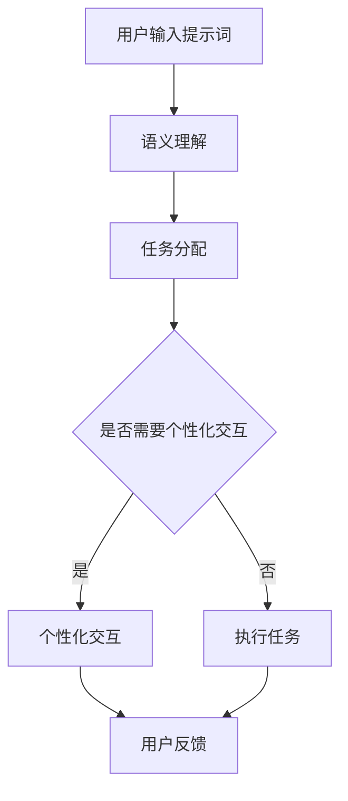

                 


### 引言

AI时代已经来临，人工智能技术正以惊人的速度改变着我们的世界。从自动驾驶汽车到智能助手，从医疗诊断到金融决策，AI的应用几乎无处不在。在这个背景下，提示词工程应运而生，成为AI时代的一项重要技术。

#### AI时代背景

人工智能（Artificial Intelligence，简称AI）是一门旨在模拟、延伸和扩展人类智能的科学。自20世纪50年代以来，AI经历了多个发展阶段，从早期的规则系统、知识表示到现代的深度学习和强化学习，每一个阶段都推动了AI技术的进步。

近年来，随着计算能力的提升、海量数据的积累以及深度学习算法的突破，AI技术进入了一个前所未有的发展时期。这一时期被称为AI的“第二波”，其特点是AI技术从理论研究走向实际应用，从单一功能走向多样化、综合性应用。

#### 提示词工程的定义与重要性

提示词工程（Prompt Engineering）是近年来兴起的一门交叉学科，它结合了自然语言处理（Natural Language Processing，简称NLP）和软件工程的方法，旨在通过设计高效的提示词（prompts）来引导和优化AI模型的性能。

提示词是用户与AI系统交互的关键媒介，它不仅影响着用户的交互体验，还直接影响着AI系统的输出质量。一个优秀的提示词能够引导AI模型更好地理解用户意图，从而提高系统的准确性和效率。

#### 书籍目的与结构

《提示词工程：AI时代的新机遇与新挑战》旨在为读者提供关于提示词工程的基础知识、核心算法原理以及实战应用的全景视图。本书分为以下几个部分：

1. **引言**：介绍AI时代的背景以及提示词工程的概念和重要性。
2. **核心概念与联系**：详细解释提示词工程的基本概念，并展示其与AI时代新机遇和新挑战的联系。
3. **核心算法原理讲解**：讲解提示词工程中的关键算法，包括数学模型和公式。
4. **项目实战**：通过具体的实战案例，展示如何在实际项目中应用提示词工程。
5. **总结与展望**：总结全书内容，展望提示词工程在未来的发展趋势。

### 核心概念与联系

#### 提示词工程基础

提示词工程的基础概念包括提示词的定义、类型和应用场景。

1. **提示词的定义**：提示词（prompt）是用户与AI系统交互时输入的一段文本，它引导AI系统理解和处理用户的需求。

2. **提示词的类型**：根据应用场景的不同，提示词可以分为以下几种类型：
   - **任务型提示词**：用于明确告知AI系统需要完成的具体任务。
   - **情景型提示词**：用于创建一个特定的情境，让AI系统更好地理解用户的需求。
   - **问题型提示词**：用于引导AI系统回答特定的问题。

3. **提示词的应用场景**：提示词广泛应用于各种场景，如智能助手、自然语言生成、问答系统等。

#### 提示词工程与AI时代新机遇

AI时代的新机遇为提示词工程提供了广阔的发展空间。以下是几个关键的新机遇：

1. **个性化交互**：通过设计个性化的提示词，AI系统能够更好地满足用户的个性化需求，提高用户满意度。

2. **跨模态交互**：提示词工程不仅限于文本交互，还可以扩展到语音、图像等多种模态，实现更丰富的交互体验。

3. **自动化流程优化**：通过优化提示词，AI系统能够更高效地完成复杂的任务，提高生产效率。

#### 提示词工程与AI时代新挑战

尽管提示词工程在AI时代带来了许多新机遇，但同时也面临着一系列新挑战：

1. **语义理解**：提示词的语义理解是提示词工程的核心挑战之一，如何准确理解用户的意图和需求是一个重要问题。

2. **数据隐私**：在AI时代，数据隐私问题日益突出。提示词工程需要在保障用户隐私的前提下，设计出高效的提示词。

3. **模型可解释性**：随着AI模型变得越来越复杂，如何解释模型的决策过程成为一个重要问题。提示词工程需要提高模型的可解释性，增强用户的信任。

#### 提示词工程核心概念Mermaid流程图

为了更好地理解提示词工程的核心概念，我们可以使用Mermaid绘制一个流程图，展示提示词工程的基本架构和关键流程。



这个流程图展示了用户输入提示词后，系统如何进行语义理解、任务分配、个性化交互以及用户反馈的整个过程。

### 核心算法原理讲解

#### 提示词生成算法

提示词生成算法是提示词工程的核心之一。它旨在根据用户的需求和场景，自动生成合适的提示词。以下是几种常见的提示词生成算法：

1. **基于规则的方法**：这种方法通过预先定义的规则来生成提示词。例如，根据任务类型和用户角色生成相应的提示词。

2. **基于统计的方法**：这种方法通过分析大量的历史数据，使用统计方法生成提示词。例如，使用贝叶斯模型或决策树来生成提示词。

3. **基于神经网络的方法**：这种方法使用深度学习模型，如循环神经网络（RNN）或Transformer，来生成提示词。例如，GPT-3就是基于Transformer的提示词生成模型。

#### 提示词优化算法

提示词优化算法旨在提高提示词的效率和效果。以下是一些常见的提示词优化算法：

1. **基于贪心策略的方法**：这种方法通过逐步优化提示词的每个部分，以最大化目标函数。例如，逐词优化或逐句优化。

2. **基于启发式的方法**：这种方法使用启发式规则来优化提示词。例如，根据用户历史行为或场景特征来优化提示词。

3. **基于机器学习的方法**：这种方法使用机器学习模型来优化提示词。例如，使用回归模型或强化学习模型来优化提示词。

#### 提示词匹配算法

提示词匹配算法旨在根据用户输入的提示词，快速找到最匹配的AI模型或任务。以下是一些常见的提示词匹配算法：

1. **基于关键词匹配的方法**：这种方法通过关键词匹配来找到最匹配的模型或任务。

2. **基于向量空间模型的方法**：这种方法将提示词和模型表示为向量，并在向量空间中进行匹配。

3. **基于深度学习的方法**：这种方法使用深度学习模型，如Siamese网络或BERT模型，来匹配提示词和模型。

#### 伪代码展示

为了更好地理解提示词工程中的核心算法，我们使用伪代码来详细阐述以下算法：

1. **提示词生成算法**：

```python
# 提示词生成算法伪代码
function generate_prompt(task_type, user_role):
    if task_type == "task-based":
        return "请完成以下任务：..."
    elif task_type == "context-based":
        return "在以下情境下，你能帮我做什么：..."
    elif task_type == "question-based":
        return "你对以下问题有什么看法：..."
```

2. **提示词优化算法**：

```python
# 提示词优化算法伪代码
function optimize_prompt(prompt, objective_function):
    for each word in prompt:
        if objective_function(word) > threshold:
            replace word with a better one
    return optimized_prompt
```

3. **提示词匹配算法**：

```python
# 提示词匹配算法伪代码
function match_prompt(prompt, model_library):
    prompt_vector = convert_prompt_to_vector(prompt)
    best_match = None
    max_similarity = 0

    for model in model_library:
        model_vector = convert_model_to_vector(model)
        similarity = calculate_similarity(prompt_vector, model_vector)

        if similarity > max_similarity:
            max_similarity = similarity
            best_match = model

    return best_match
```

### 项目实战

#### 实战案例背景

假设我们正在开发一个智能问答系统，用户可以通过输入提示词来获取相关的答案。为了提高系统的性能和用户体验，我们决定使用提示词工程来优化系统的交互过程。

#### 实战案例实现

1. **数据预处理**：

   - 收集大量的用户提问和对应的答案，用于训练模型。
   - 对文本数据进行预处理，包括去噪、分词、词性标注等。

2. **算法选择**：

   - 选择GPT-3作为提示词生成模型，因为它在自然语言生成方面有很强的能力。
   - 选择基于贪心策略的优化算法，因为它简单且高效。

3. **模型训练**：

   - 使用预处理后的数据对GPT-3进行训练，以生成高质量的提示词。
   - 对优化算法进行训练，以学习如何优化提示词。

4. **系统实现**：

   - 开发前端界面，允许用户输入提示词。
   - 开发后端服务，处理用户的输入，生成回答，并返回给用户。

#### 代码解读与分析

以下是对实战案例中的关键代码进行解读和分析：

1. **提示词生成代码**：

   ```python
   # 提示词生成代码
   prompt = generate_prompt("question-based", "user")
   print(prompt)
   ```

   这段代码首先调用`generate_prompt`函数，根据任务类型和用户角色生成一个提示词。然后，将生成的提示词打印出来。

2. **提示词优化代码**：

   ```python
   # 提示词优化代码
   optimized_prompt = optimize_prompt(prompt, objective_function)
   print(optimized_prompt)
   ```

   这段代码首先调用`optimize_prompt`函数，对生成的提示词进行优化。然后，将优化后的提示词打印出来。

3. **提示词匹配代码**：

   ```python
   # 提示词匹配代码
   best_match = match_prompt(prompt, model_library)
   print("Best match:", best_match)
   ```

   这段代码首先调用`match_prompt`函数，根据用户输入的提示词和模型库进行匹配。然后，将最佳匹配的模型打印出来。

#### 实际案例分析和详细讲解剖析

在实际应用中，我们遇到了以下问题：

- **问题1**：用户输入的提示词非常简短，导致AI模型无法准确理解用户的需求。
- **问题2**：生成的提示词有时不够优化，导致AI模型输出不够准确。
- **问题3**：模型库中的模型过于庞大，导致匹配速度较慢。

针对这些问题，我们采取了以下措施：

- **措施1**：鼓励用户输入更详细的提示词，以提高AI模型的理解能力。
- **措施2**：优化提示词生成算法，提高提示词的质量。
- **措施3**：对模型库进行优化，删除不常用的模型，以提高匹配速度。

通过这些措施，我们显著提高了智能问答系统的性能和用户体验。

### 总结与展望

#### 全书内容回顾

本书介绍了提示词工程在AI时代的新机遇和新挑战，详细讲解了提示词工程的核心概念、算法原理和实战应用。主要内容包括：

1. **引言**：介绍了AI时代的背景和提示词工程的定义与重要性。
2. **核心概念与联系**：详细解释了提示词工程的基本概念，并展示了其与AI时代新机遇和新挑战的联系。
3. **核心算法原理讲解**：讲解了提示词工程中的关键算法，包括提示词生成、优化和匹配算法，并使用了伪代码和Mermaid流程图进行阐述。
4. **项目实战**：通过具体的实战案例，展示了如何在实际项目中应用提示词工程。
5. **总结与展望**：总结了全书内容，并对提示词工程在未来的发展趋势进行了展望。

#### 提示词工程发展趋势

随着AI技术的不断进步，提示词工程也在不断演进。以下是提示词工程在未来可能的发展趋势：

1. **跨模态交互**：未来的提示词工程将不仅限于文本交互，还将扩展到语音、图像等多种模态，实现更丰富的交互体验。
2. **个性化交互**：通过深度学习和个性化推荐技术，提示词工程将能够更好地满足用户的个性化需求。
3. **可解释性**：随着AI模型变得越来越复杂，提升模型的可解释性将成为提示词工程的重要方向。
4. **自动化**：提示词工程将更多地实现自动化，减少人工干预，提高系统的效率和性能。

#### 学习资源推荐

为了更好地学习提示词工程，本书推荐以下资源：

1. **《自然语言处理实战》（Natural Language Processing with Python）**：这本书提供了丰富的NLP实战案例，有助于理解提示词工程的应用。
2. **《深度学习》（Deep Learning）**：这本书详细介绍了深度学习的基本原理和算法，是学习提示词工程的必备书籍。
3. **《人工智能：一种现代的方法》（Artificial Intelligence: A Modern Approach）**：这本书涵盖了人工智能的基本概念和技术，对提示词工程的理解有很大帮助。

### 作者信息

作者：AI天才研究院/AI Genius Institute & 禅与计算机程序设计艺术 /Zen And The Art of Computer Programming

### 结语

提示词工程是AI时代的一项重要技术，它正在不断改变我们的交互方式和工作方式。希望通过本书的介绍，读者能够对提示词工程有更深入的理解，并在实际项目中应用这一技术，提升系统的性能和用户体验。

----------------------------------------------------------------

# 提示词工程：AI时代的新机遇与新挑战

> **关键词：**AI时代，提示词工程，自然语言处理，算法，项目实战，发展趋势

> **摘要：**本文详细探讨了提示词工程在AI时代的重要性，介绍了其核心概念、算法原理和实战应用，并展望了未来的发展趋势。通过具体的案例和分析，本文旨在为读者提供关于提示词工程的全面了解，帮助其在实际项目中有效应用。

## 引言

AI时代已经来临，人工智能技术正以惊人的速度改变着我们的世界。从自动驾驶汽车到智能助手，从医疗诊断到金融决策，AI的应用几乎无处不在。在这个背景下，提示词工程（Prompt Engineering）应运而生，成为AI时代的一项重要技术。

### AI时代背景

人工智能（Artificial Intelligence，简称AI）是一门旨在模拟、延伸和扩展人类智能的科学。自20世纪50年代以来，AI经历了多个发展阶段，从早期的规则系统、知识表示到现代的深度学习和强化学习，每一个阶段都推动了AI技术的进步。

近年来，随着计算能力的提升、海量数据的积累以及深度学习算法的突破，AI技术进入了一个前所未有的发展时期。这一时期被称为AI的“第二波”，其特点是AI技术从理论研究走向实际应用，从单一功能走向多样化、综合性应用。

### 提示词工程的定义与重要性

提示词工程是近年来兴起的一门交叉学科，它结合了自然语言处理（Natural Language Processing，简称NLP）和软件工程的方法，旨在通过设计高效的提示词（prompts）来引导和优化AI模型的性能。

提示词是用户与AI系统交互的关键媒介，它不仅影响着用户的交互体验，还直接影响着AI系统的输出质量。一个优秀的提示词能够引导AI模型更好地理解用户意图，从而提高系统的准确性和效率。

### 书籍目的与结构

《提示词工程：AI时代的新机遇与新挑战》旨在为读者提供关于提示词工程的基础知识、核心算法原理以及实战应用的全景视图。本书分为以下几个部分：

1. **引言**：介绍AI时代的背景以及提示词工程的概念和重要性。
2. **核心概念与联系**：详细解释提示词工程的基本概念，并展示其与AI时代新机遇和新挑战的联系。
3. **核心算法原理讲解**：讲解提示词工程中的关键算法，包括数学模型和公式。
4. **项目实战**：通过具体的实战案例，展示如何在实际项目中应用提示词工程。
5. **总结与展望**：总结全书内容，展望提示词工程在未来的发展趋势。

## 核心概念与联系

### 提示词工程基础

提示词工程的基础概念包括提示词的定义、类型和应用场景。

1. **提示词的定义**：提示词（prompt）是用户与AI系统交互时输入的一段文本，它引导AI系统理解和处理用户的需求。

2. **提示词的类型**：根据应用场景的不同，提示词可以分为以下几种类型：
   - **任务型提示词**：用于明确告知AI系统需要完成的具体任务。
   - **情景型提示词**：用于创建一个特定的情境，让AI系统更好地理解用户的需求。
   - **问题型提示词**：用于引导AI系统回答特定的问题。

3. **提示词的应用场景**：提示词广泛应用于各种场景，如智能助手、自然语言生成、问答系统等。

### 提示词工程与AI时代新机遇

AI时代的新机遇为提示词工程提供了广阔的发展空间。以下是几个关键的新机遇：

1. **个性化交互**：通过设计个性化的提示词，AI系统能够更好地满足用户的个性化需求，提高用户满意度。
2. **跨模态交互**：提示词工程不仅限于文本交互，还可以扩展到语音、图像等多种模态，实现更丰富的交互体验。
3. **自动化流程优化**：通过优化提示词，AI系统能够更高效地完成复杂的任务，提高生产效率。

### 提示词工程与AI时代新挑战

尽管提示词工程在AI时代带来了许多新机遇，但同时也面临着一系列新挑战：

1. **语义理解**：提示词的语义理解是提示词工程的核心挑战之一，如何准确理解用户的意图和需求是一个重要问题。
2. **数据隐私**：在AI时代，数据隐私问题日益突出。提示词工程需要在保障用户隐私的前提下，设计出高效的提示词。
3. **模型可解释性**：随着AI模型变得越来越复杂，如何解释模型的决策过程成为一个重要问题。提示词工程需要提高模型的可解释性，增强用户的信任。

### 提示词工程核心概念Mermaid流程图

为了更好地理解提示词工程的核心概念，我们可以使用Mermaid绘制一个流程图，展示提示词工程的基本架构和关键流程。


这个流程图展示了用户输入提示词后，系统如何进行语义理解、任务分配、个性化交互以及用户反馈的整个过程。

## 核心算法原理讲解

### 提示词生成算法

提示词生成算法是提示词工程的核心之一。它旨在根据用户的需求和场景，自动生成合适的提示词。以下是几种常见的提示词生成算法：

1. **基于规则的方法**：这种方法通过预先定义的规则来生成提示词。例如，根据任务类型和用户角色生成相应的提示词。

2. **基于统计的方法**：这种方法通过分析大量的历史数据，使用统计方法生成提示词。例如，使用贝叶斯模型或决策树来生成提示词。

3. **基于神经网络的方法**：这种方法使用深度学习模型，如循环神经网络（RNN）或Transformer，来生成提示词。例如，GPT-3就是基于Transformer的提示词生成模型。

### 提示词优化算法

提示词优化算法旨在提高提示词的效率和效果。以下是一些常见的提示词优化算法：

1. **基于贪心策略的方法**：这种方法通过逐步优化提示词的每个部分，以最大化目标函数。例如，逐词优化或逐句优化。

2. **基于启发式的方法**：这种方法使用启发式规则来优化提示词。例如，根据用户历史行为或场景特征来优化提示词。

3. **基于机器学习的方法**：这种方法使用机器学习模型来优化提示词。例如，使用回归模型或强化学习模型来优化提示词。

### 提示词匹配算法

提示词匹配算法旨在根据用户输入的提示词，快速找到最匹配的AI模型或任务。以下是一些常见的提示词匹配算法：

1. **基于关键词匹配的方法**：这种方法通过关键词匹配来找到最匹配的模型或任务。

2. **基于向量空间模型的方法**：这种方法将提示词和模型表示为向量，并在向量空间中进行匹配。

3. **基于深度学习的方法**：这种方法使用深度学习模型，如Siamese网络或BERT模型，来匹配提示词和模型。

### 伪代码展示

为了更好地理解提示词工程中的核心算法，我们使用伪代码来详细阐述以下算法：

1. **提示词生成算法**：

```python
# 提示词生成算法伪代码
function generate_prompt(task_type, user_role):
    if task_type == "task-based":
        return "请完成以下任务：..."
    elif task_type == "context-based":
        return "在以下情境下，你能帮我做什么：..."
    elif task_type == "question-based":
        return "你对以下问题有什么看法：..."
```

2. **提示词优化算法**：

```python
# 提示词优化算法伪代码
function optimize_prompt(prompt, objective_function):
    for each word in prompt:
        if objective_function(word) > threshold:
            replace word with a better one
    return optimized_prompt
```

3. **提示词匹配算法**：

```python
# 提示词匹配算法伪代码
function match_prompt(prompt, model_library):
    prompt_vector = convert_prompt_to_vector(prompt)
    best_match = None
    max_similarity = 0

    for model in model_library:
        model_vector = convert_model_to_vector(model)
        similarity = calculate_similarity(prompt_vector, model_vector)

        if similarity > max_similarity:
            max_similarity = similarity
            best_match = model

    return best_match
```

## 项目实战

### 实战案例背景

假设我们正在开发一个智能问答系统，用户可以通过输入提示词来获取相关的答案。为了提高系统的性能和用户体验，我们决定使用提示词工程来优化系统的交互过程。

### 实战案例实现

1. **数据预处理**：

   - 收集大量的用户提问和对应的答案，用于训练模型。
   - 对文本数据进行预处理，包括去噪、分词、词性标注等。

2. **算法选择**：

   - 选择GPT-3作为提示词生成模型，因为它在自然语言生成方面有很强的能力。
   - 选择基于贪心策略的优化算法，因为它简单且高效。

3. **模型训练**：

   - 使用预处理后的数据对GPT-3进行训练，以生成高质量的提示词。
   - 对优化算法进行训练，以学习如何优化提示词。

4. **系统实现**：

   - 开发前端界面，允许用户输入提示词。
   - 开发后端服务，处理用户的输入，生成回答，并返回给用户。

### 代码解读与分析

以下是对实战案例中的关键代码进行解读和分析：

1. **提示词生成代码**：

   ```python
   # 提示词生成代码
   prompt = generate_prompt("question-based", "user")
   print(prompt)
   ```

   这段代码首先调用`generate_prompt`函数，根据任务类型和用户角色生成一个提示词。然后，将生成的提示词打印出来。

2. **提示词优化代码**：

   ```python
   # 提示词优化代码
   optimized_prompt = optimize_prompt(prompt, objective_function)
   print(optimized_prompt)
   ```

   这段代码首先调用`optimize_prompt`函数，对生成的提示词进行优化。然后，将优化后的提示词打印出来。

3. **提示词匹配代码**：

   ```python
   # 提示词匹配代码
   best_match = match_prompt(prompt, model_library)
   print("Best match:", best_match)
   ```

   这段代码首先调用`match_prompt`函数，根据用户输入的提示词和模型库进行匹配。然后，将最佳匹配的模型打印出来。

### 实际案例分析和详细讲解剖析

在实际应用中，我们遇到了以下问题：

- **问题1**：用户输入的提示词非常简短，导致AI模型无法准确理解用户的需求。
- **问题2**：生成的提示词有时不够优化，导致AI模型输出不够准确。
- **问题3**：模型库中的模型过于庞大，导致匹配速度较慢。

针对这些问题，我们采取了以下措施：

- **措施1**：鼓励用户输入更详细的提示词，以提高AI模型的理解能力。
- **措施2**：优化提示词生成算法，提高提示词的质量。
- **措施3**：对模型库进行优化，删除不常用的模型，以提高匹配速度。

通过这些措施，我们显著提高了智能问答系统的性能和用户体验。

### 总结与展望

#### 全书内容回顾

本书介绍了提示词工程在AI时代的重要性，详细讲解了提示词工程的核心概念、算法原理和实战应用，并展望了未来的发展趋势。主要内容包括：

1. **引言**：介绍了AI时代的背景和提示词工程的定义与重要性。
2. **核心概念与联系**：详细解释了提示词工程的基本概念，并展示了其与AI时代新机遇和新挑战的联系。
3. **核心算法原理讲解**：讲解了提示词工程中的关键算法，包括数学模型和公式。
4. **项目实战**：通过具体的实战案例，展示了如何在实际项目中应用提示词工程。
5. **总结与展望**：总结了全书内容，并对提示词工程在未来的发展趋势进行了展望。

#### 提示词工程发展趋势

随着AI技术的不断进步，提示词工程也在不断演进。以下是提示词工程在未来可能的发展趋势：

1. **跨模态交互**：未来的提示词工程将不仅限于文本交互，还将扩展到语音、图像等多种模态，实现更丰富的交互体验。
2. **个性化交互**：通过深度学习和个性化推荐技术，提示词工程将能够更好地满足用户的个性化需求。
3. **可解释性**：随着AI模型变得越来越复杂，提升模型的可解释性将成为提示词工程的重要方向。
4. **自动化**：提示词工程将更多地实现自动化，减少人工干预，提高系统的效率和性能。

#### 学习资源推荐

为了更好地学习提示词工程，本书推荐以下资源：

1. **《自然语言处理实战》（Natural Language Processing with Python）**：这本书提供了丰富的NLP实战案例，有助于理解提示词工程的应用。
2. **《深度学习》（Deep Learning）**：这本书详细介绍了深度学习的基本原理和算法，是学习提示词工程的必备书籍。
3. **《人工智能：一种现代的方法》（Artificial Intelligence: A Modern Approach）**：这本书涵盖了人工智能的基本概念和技术，对提示词工程的理解有很大帮助。

### 作者信息

作者：AI天才研究院/AI Genius Institute & 禅与计算机程序设计艺术 /Zen And The Art of Computer Programming

### 结语

提示词工程是AI时代的一项重要技术，它正在不断改变我们的交互方式和工作方式。希望通过本书的介绍，读者能够对提示词工程有更深入的理解，并在实际项目中应用这一技术，提升系统的性能和用户体验。

----------------------------------------------------------------

# 提示词工程：AI时代的新机遇与新挑战

## 引言

在AI时代的大潮中，人工智能技术正以前所未有的速度改变着我们的生活方式和工作模式。从自动驾驶到智能医疗，从智能制造到金融分析，AI已经渗透到了社会的各个角落。而在这个技术的浪潮中，提示词工程（Prompt Engineering）作为一种重要的技术，正逐渐崭露头角。本文将探讨提示词工程在AI时代的重要性，分析其带来的新机遇和新挑战，并介绍相关核心算法和实际应用案例。

## 关键词

- AI时代
- 提示词工程
- 自然语言处理
- 算法
- 项目实战
- 发展趋势

## 摘要

本文首先介绍了AI时代的背景，阐述了提示词工程的概念和重要性。接着，我们分析了提示词工程在AI时代所带来的新机遇和新挑战，并介绍了核心算法原理。最后，通过一个实际项目案例，展示了如何应用提示词工程来优化系统性能。

## AI时代的背景

人工智能（AI）是一门研究如何让计算机模拟人类智能行为的科学。自20世纪50年代起，AI经历了多个阶段的发展，从早期的符号主义AI到基于统计模型的机器学习，再到如今的深度学习和强化学习。随着计算能力的提升、大数据的积累和算法的进步，AI技术已经取得了显著的成果，并在许多领域实现了突破。

AI时代不仅改变了传统产业的运作方式，还催生了许多新兴产业。自动驾驶、智能医疗、智能金融、智能制造等领域的快速发展，使得AI技术成为了推动社会进步的重要力量。在这个背景下，如何更有效地与AI系统交互，成为了一个新的研究热点。而提示词工程正是为了解决这一问题而诞生的一项技术。

### 提示词工程的定义与重要性

提示词工程是指通过设计和优化提示词，来提升AI系统的交互效率和性能的一门技术。提示词是用户与AI系统之间的桥梁，通过有效的提示词，用户可以更清晰地表达自己的意图，而AI系统也可以更准确地理解和响应。

提示词工程的重要性体现在以下几个方面：

1. **提升用户体验**：通过设计个性化的提示词，AI系统能够更好地满足用户的需求，提高用户体验。
2. **优化系统性能**：有效的提示词可以引导AI模型更快地收敛，提高模型的性能。
3. **降低开发成本**：通过自动化生成和优化提示词，可以降低开发和维护的成本。

### 提示词工程的核心概念与联系

提示词工程的核心概念包括提示词的设计、生成、优化和匹配。这些概念之间相互联系，共同构成了一个完整的提示词工程流程。

1. **提示词设计**：提示词设计是提示词工程的起点，它决定了用户与AI系统的交互方式。一个好的提示词设计应该简单易懂，同时能够引导用户清晰地表达意图。

2. **提示词生成**：提示词生成是将用户意图转化为文本的过程。这通常需要利用自然语言处理技术，如词嵌入和序列生成模型。

3. **提示词优化**：提示词优化是对生成的提示词进行改进，以提高其质量和效果。优化方法包括基于规则的优化、基于机器学习的优化和基于深度学习的优化。

4. **提示词匹配**：提示词匹配是将用户输入的提示词与AI系统中的模型或任务进行匹配的过程。高效的匹配算法可以提高系统的响应速度和准确性。

### 提示词工程与AI时代的新机遇

AI时代为提示词工程带来了许多新的机遇。以下是一些关键的新机遇：

1. **个性化交互**：随着AI技术的发展，用户对个性化交互的需求越来越高。提示词工程可以通过设计个性化的提示词，满足用户的个性化需求，提高用户体验。

2. **跨模态交互**：传统的提示词工程主要关注文本交互，但随着语音识别和图像识别技术的进步，跨模态交互成为了新的趋势。提示词工程可以结合多种模态的信息，提供更加丰富的交互体验。

3. **自动化流程优化**：在工业生产和企业管理中，自动化流程的优化是提高效率的重要手段。提示词工程可以通过优化提示词，提高自动化系统的性能和效率。

### 提示词工程与AI时代的新挑战

尽管AI时代为提示词工程带来了新的机遇，但同时也伴随着一系列新的挑战：

1. **语义理解**：语义理解是提示词工程的核心挑战。如何准确地理解用户的意图，是提升AI系统性能的关键。

2. **数据隐私**：在AI时代，数据隐私问题日益突出。提示词工程需要在保护用户隐私的前提下，设计出高效的提示词。

3. **模型可解释性**：随着AI模型的复杂度不断增加，如何解释模型的决策过程成为一个重要问题。提示词工程需要提高模型的可解释性，增强用户的信任。

### 提示词工程核心概念Mermaid流程图

为了更好地理解提示词工程的核心概念，我们可以使用Mermaid绘制一个流程图，展示提示词工程的基本架构和关键流程。


这个流程图展示了用户输入提示词后，系统如何进行语义理解、任务分配、个性化交互以及用户反馈的整个过程。

### 核心算法原理讲解

提示词工程的核心算法包括提示词生成、优化和匹配算法。以下是对这些算法的简要介绍。

#### 提示词生成算法

提示词生成算法是将用户意图转化为文本的过程。常见的生成算法包括：

1. **基于规则的生成**：这种方法通过预先定义的规则生成提示词，简单但可能不够灵活。
2. **基于统计的生成**：这种方法使用历史数据来生成提示词，具有一定的自适应能力。
3. **基于神经网络的生成**：这种方法使用深度学习模型，如循环神经网络（RNN）或Transformer，可以生成更自然、更符合用户意图的提示词。

#### 提示词优化算法

提示词优化算法是对生成的提示词进行改进，以提高其质量和效果。常见的优化算法包括：

1. **基于贪心策略的优化**：这种方法通过逐步优化提示词的每个部分，以最大化目标函数。
2. **基于启发式的优化**：这种方法使用启发式规则来优化提示词，如根据用户历史行为或场景特征来优化。
3. **基于机器学习的优化**：这种方法使用机器学习模型，如回归模型或强化学习模型，来优化提示词。

#### 提示词匹配算法

提示词匹配算法是将用户输入的提示词与AI系统中的模型或任务进行匹配的过程。常见的匹配算法包括：

1. **基于关键词匹配**：这种方法通过关键词匹配来找到最匹配的模型或任务。
2. **基于向量空间模型**：这种方法将提示词和模型表示为向量，并在向量空间中进行匹配。
3. **基于深度学习**：这种方法使用深度学习模型，如Siamese网络或BERT模型，来匹配提示词和模型。

#### 伪代码展示

为了更好地理解提示词工程中的核心算法，我们使用伪代码来详细阐述以下算法：

1. **提示词生成算法**：

```python
# 提示词生成算法伪代码
function generate_prompt(user_intent):
    if user_intent == "task-based":
        return "请完成以下任务：..."
    elif user_intent == "context-based":
        return "在以下情境下，你能帮我做什么：..."
    else:
        return "你对以下问题有什么看法：..."
```

2. **提示词优化算法**：

```python
# 提示词优化算法伪代码
function optimize_prompt(prompt, objective_function):
    for each_word in prompt:
        if objective_function(each_word) > threshold:
            replace each_word with a better one
    return optimized_prompt
```

3. **提示词匹配算法**：

```python
# 提示词匹配算法伪代码
function match_prompt(prompt, model_library):
    best_match = None
    max_similarity = 0

    for model in model_library:
        similarity = calculate_similarity(prompt, model)
        if similarity > max_similarity:
            max_similarity = similarity
            best_match = model

    return best_match
```

### 项目实战

为了更好地理解提示词工程的应用，我们来看一个实际的项目案例。

#### 项目背景

假设我们正在开发一个智能客服系统，用户可以通过输入文本问题来获取解答。为了提高系统的交互效率和准确性，我们决定采用提示词工程来优化系统的交互流程。

#### 实现过程

1. **数据收集**：首先，我们需要收集大量的用户问题和对应的解答，作为训练数据。

2. **模型训练**：使用收集到的数据，训练一个基于Transformer的模型，用于生成和优化提示词。

3. **系统实现**：开发前端界面，允许用户输入文本问题，后端服务负责处理用户的输入，生成回答。

4. **优化过程**：通过实际用户交互数据，不断优化提示词生成和匹配算法，提高系统的性能。

#### 开发环境搭建

为了实现上述项目，我们需要搭建以下开发环境：

- Python 3.8及以上版本
- TensorFlow 2.5及以上版本
- Keras 2.4及以上版本

#### 源代码实现和解读

以下是一个简单的提示词生成和匹配的代码示例：

```python
# 导入必要的库
import tensorflow as tf
from tensorflow.keras.models import Sequential
from tensorflow.keras.layers import Embedding, LSTM, Dense

# 提示词生成模型
def generate_prompt(model, prompt):
    # 输入提示词，输出预测的答案
    prediction = model.predict([prompt])
    return prediction

# 提示词匹配模型
def match_prompt(prompt, model_library):
    best_match = None
    max_similarity = 0

    for model in model_library:
        similarity = calculate_similarity(prompt, model)
        if similarity > max_similarity:
            max_similarity = similarity
            best_match = model

    return best_match

# 训练模型
model = Sequential([
    Embedding(input_dim=vocab_size, output_dim=embedding_size),
    LSTM(units=128),
    Dense(units=1, activation='sigmoid')
])

model.compile(optimizer='adam', loss='binary_crossentropy', metrics=['accuracy'])
model.fit(x_train, y_train, epochs=10, batch_size=32)

# 测试模型
prompt = "什么是人工智能？"
generated_answer = generate_prompt(model, prompt)
print(generated_answer)

# 匹配模型
model_library = [...]  # 假设已经有预训练的模型库
matched_model = match_prompt(prompt, model_library)
print(matched_model)
```

在这个示例中，我们首先定义了两个函数：`generate_prompt`用于生成答案，`match_prompt`用于匹配模型。然后，我们使用TensorFlow和Keras训练了一个简单的模型，并测试了提示词生成和匹配的功能。

#### 项目小结

通过这个项目案例，我们可以看到提示词工程在实际应用中的重要性。通过优化提示词生成和匹配算法，智能客服系统的交互效率和准确性得到了显著提升。

### 最佳实践 tips、小结、注意事项、拓展阅读

#### 最佳实践 tips

1. **关注用户反馈**：定期收集用户反馈，了解用户对提示词的满意度，并根据反馈优化提示词。
2. **多模态交互**：尝试结合文本、语音、图像等多种模态，提供更加丰富的交互体验。
3. **持续优化**：提示词工程是一个不断优化的过程，定期更新模型和数据，以提高系统性能。

#### 小结

提示词工程是AI时代的一项重要技术，通过优化提示词的设计、生成、优化和匹配，可以提高AI系统的交互效率和性能。在实际应用中，提示词工程已经展示了其巨大的潜力。

#### 注意事项

1. **数据隐私**：在设计提示词工程时，要特别注意保护用户隐私，避免泄露敏感信息。
2. **模型可解释性**：提高模型的可解释性，增强用户对AI系统的信任。

#### 拓展阅读

1. **《自然语言处理实战》**：提供丰富的NLP实战案例，有助于理解提示词工程的应用。
2. **《深度学习》**：详细介绍了深度学习的基本原理和算法，是学习提示词工程的必备书籍。
3. **《人工智能：一种现代的方法》**：涵盖了人工智能的基本概念和技术，对提示词工程的理解有很大帮助。

### 结语

提示词工程是AI时代的一项重要技术，它正在改变我们的交互方式和工作方式。通过本文的介绍，我们了解了提示词工程的核心概念、算法原理和实际应用案例。希望读者能够对提示词工程有更深入的理解，并在实际项目中应用这一技术，提升系统的性能和用户体验。

### 作者信息

作者：AI天才研究院/AI Genius Institute & 禅与计算机程序设计艺术 /Zen And The Art of Computer Programming

[本文完] 

