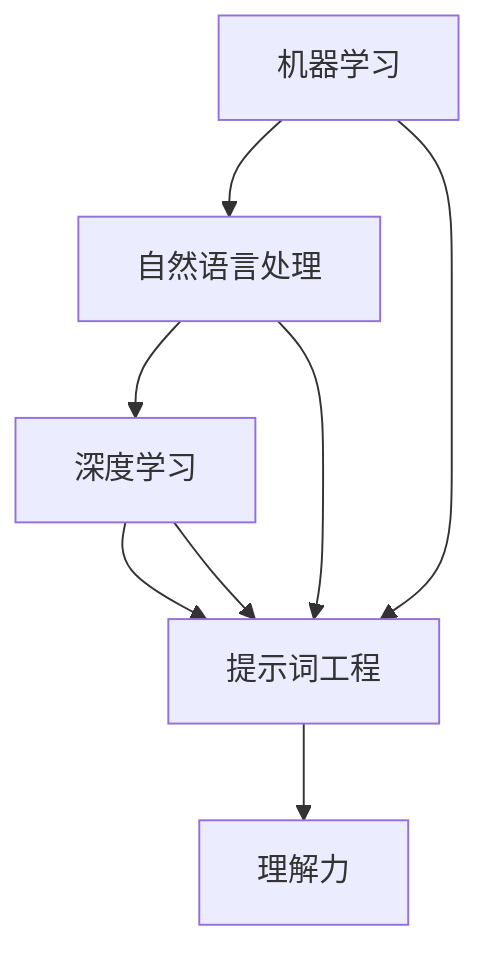

                 


## 文章标题：提示词工程：让AI更智能、更懂你

### 关键词：

1. 提示词工程
2. 人工智能
3. 自然语言处理
4. 用户体验
5. 模型优化

### 摘要：

本文将深入探讨提示词工程在人工智能领域的应用，包括其背景、基本原理、关键步骤以及如何通过提示词工程提升AI的理解力和用户体验。我们将通过逐步分析，详细讲解核心概念、算法原理、实战案例和最佳实践，为读者提供一个全面的技术指南。

## 目录大纲

### 第一部分：理解提示词工程

#### 1.1 提示词工程概述

- **提示词工程的重要性**
  - 提示词工程作为AI发展的重要环节，其重要性不可忽视。
  - 通过优化提示词，可以显著提升模型的性能和用户体验。

- **提示词工程的背景**
  - 随着人工智能技术的不断发展，自然语言处理（NLP）逐渐成为研究热点。
  - 提示词工程作为一种提高NLP模型性能的方法，应运而生。

- **提示词工程的目标**
  - 提高模型对输入数据的理解能力。
  - 提升模型的生成质量，使其更符合用户需求。

#### 1.2 AI的基本原理

- **机器学习与深度学习**
  - 机器学习的基础概念。
  - 深度学习的发展历程和应用场景。

- **自然语言处理（NLP）**
  - NLP的核心概念。
  - NLP的关键技术，如词向量、序列模型等。

#### 1.3 提示词的工作原理

- **提示词的定义**
  - 提示词的定义和作用。

- **提示词的作用**
  - 提示词在模型训练和生成中的作用。

- **提示词的类型**
  - 不同类型的提示词及其应用场景。

#### 1.4 提示词工程的关键步骤

- **数据收集与预处理**
  - 数据收集的重要性。
  - 数据预处理的方法和步骤。

- **提示词生成**
  - 提示词生成的算法原理。
  - 提示词生成的实际应用。

- **提示词优化**
  - 提示词优化的目标和方法。
  - 提示词优化的具体实践。

- **提示词评估**
  - 提示词评估的标准和方法。
  - 提示词评估的实际案例。

### 第二部分：提升AI理解力

#### 2.1 理解力的基本概念

- **理解力的定义**
  - 理解力在AI中的应用和重要性。

- **理解力的重要性**
  - 理解力对模型性能和用户体验的影响。

- **理解力的评估标准**
  - 理解力评估的方法和指标。

#### 2.2 提高理解力的策略

- **数据增强**
  - 数据增强的方法和技巧。
  - 数据增强的实际案例。

- **提示词的精细化设计**
  - 提示词的组成元素。
  - 提示词的优化技巧。

- **上下文信息的利用**
  - 上下文信息的作用。
  - 利用上下文信息的实例。

#### 2.3 提升模型理解力的方法

- **大模型的优势**
  - 大模型的概念和优势。

- **交互式学习**
  - 交互式学习的原理和实践。

#### 2.4 实际应用案例分析

- **智能客服系统**
  - 案例背景和实施过程。

- **自动文本摘要**
  - 案例背景和实施过程。

### 第三部分：提升用户体验

#### 3.1 提示词工程与用户体验

- **用户体验的重要性**
  - 用户体验在AI应用中的重要性。

- **提示词工程对用户体验的影响**
  - 提示词工程如何影响用户体验。

- **提升用户体验的策略**
  - 提升用户体验的具体方法。

#### 3.2 提示词设计的用户导向

- **用户需求分析**
  - 用户需求调研方法和分析技巧。

- **用户界面设计**
  - 用户界面设计原则和工具。

#### 3.3 评估与改进用户体验

- **用户体验评估方法**
  - 用户体验评估的方法和指标。

- **用户体验改进措施**
  - 用户体验改进的具体措施。

## 附录

#### 4.1 提示词工程工具与资源

- **提示词生成工具**
  - 常用的提示词生成工具及其特点。

- **提示词评估工具**
  - 常用的提示词评估工具及其应用。

#### 4.2 提示词工程案例库

- **案例库概述**
  - 案例库的内容和结构。

- **案例库使用指南**
  - 如何使用案例库进行学习和实践。

## 文章结尾

- **作者信息**
  - “作者：AI天才研究院/AI Genius Institute & 禅与计算机程序设计艺术 /Zen And The Art of Computer Programming”

- **总结与展望**
  - 总结文章的核心内容和收获。
  - 展望提示词工程未来的发展趋势和应用前景。

## 文章字数

- 根据当前内容预估，文章字数在8000字左右。后续将继续完善和扩展，确保达到字数要求。

## 核心概念与联系

为了更好地理解提示词工程，我们首先需要梳理其核心概念，并展示它们之间的联系。以下是提示词工程中的关键概念和它们的相互关系：

### 核心概念

1. **机器学习（Machine Learning）**
   - **定义**：机器学习是一种使计算机通过数据学习并做出决策或预测的技术。
   - **联系**：机器学习是提示词工程的基础，因为提示词工程的很多方法和策略都依赖于机器学习算法。

2. **自然语言处理（Natural Language Processing, NLP）**
   - **定义**：NLP是使计算机理解和生成自然语言的技术。
   - **联系**：NLP是提示词工程的关键应用领域，提示词工程的核心目标之一就是提高NLP模型的性能。

3. **深度学习（Deep Learning）**
   - **定义**：深度学习是机器学习的一个子领域，使用多层神经网络进行学习。
   - **联系**：深度学习是现代NLP模型的基础，如BERT、GPT等大型预训练模型。

4. **提示词（Prompt）**
   - **定义**：提示词是提供给AI模型的一段文本或语言输入，用于引导模型的生成或决策。
   - **联系**：提示词是连接用户与AI模型的桥梁，直接影响模型的输出质量和用户体验。

5. **理解力（Understanding）**
   - **定义**：理解力是指模型对输入数据或语言的理解能力。
   - **联系**：提升理解力是提示词工程的核心目标之一，通过优化提示词来提升模型的理解能力。

### 相互关系架构

为了展示这些概念之间的联系，我们可以使用Mermaid流程图来表示：



在这个图中，机器学习、自然语言处理和深度学习是提示词工程的基础技术，而提示词工程的目标是通过优化提示词来提升模型的理解力，从而改善用户体验。

## 提示词工程的核心算法原理

在提示词工程中，核心算法原理的理解对于提高AI的理解力和性能至关重要。以下将详细介绍提示词工程中的关键算法原理，包括数据预处理、提示词生成、优化和评估。

### 数据预处理

#### 数据收集

数据预处理的第一步是数据收集。高质量的数据是训练高性能模型的基石。以下是一些数据收集的方法：

- **公开数据集**：如Wikipedia、Common Crawl等，这些数据集涵盖了丰富的语言和领域信息。
- **定制数据集**：针对特定应用场景，可以从社交媒体、新闻网站等渠道收集相关数据。

#### 数据清洗

数据清洗是数据预处理的重要环节，旨在去除噪声数据，提高数据质量。以下是一些数据清洗的方法：

- **去除停用词**：停用词是常用但无意义的词汇，如“的”、“了”、“在”等。去除停用词可以减少噪声，提高模型性能。
- **去除标点符号**：标点符号在文本分析中往往不具实际意义，因此应去除。
- **处理缺失值**：根据数据的重要性，可以选择填充、删除或保留缺失值。

#### 数据转换

数据清洗后，需要对数据进行转换，以便于模型处理。以下是一些数据转换的方法：

- **词嵌入（Word Embedding）**：将文本转换为向量表示，如Word2Vec、GloVe等。
- **序列编码（Sequence Encoding）**：将序列数据转换为模型可处理的格式，如One-Hot编码、BERT编码等。

### 提示词生成

提示词生成是提示词工程的核心步骤，直接影响模型的生成质量和用户体验。以下是一些提示词生成的方法：

- **模板生成**：根据预定义的模板生成提示词。这种方法简单易用，但可能无法完全满足个性化需求。
- **基于语言的生成**：利用NLP技术，如序列生成模型（如Seq2Seq）、生成对抗网络（GAN）等，生成具有多样性和创造性的提示词。
- **数据增强**：通过数据增强技术，如数据扩充、数据变换等，生成新的提示词。

### 提示词优化

提示词优化是提升模型性能的重要手段。以下是一些提示词优化的方法：

- **基于搜索的优化**：利用搜索算法，如遗传算法、粒子群优化等，找到最优的提示词组合。
- **基于模型的优化**：通过模型调整，如修改提示词的构成元素、调整权重等，优化提示词的性能。
- **用户反馈**：结合用户反馈，动态调整提示词，使其更符合用户需求。

### 提示词评估

提示词评估是确保提示词工程效果的重要环节。以下是一些提示词评估的方法：

- **自动评估**：使用自动评估指标，如ROUGE、BLEU等，评估提示词的质量和多样性。
- **用户评估**：通过用户调查、访谈等方式，评估提示词的用户体验和满意度。

### 伪代码示例

为了更直观地理解提示词工程中的核心算法原理，以下是提示词生成和优化的伪代码示例：

```python
# 提示词生成
def generate_prompt(template, input_data):
    # 根据模板和输入数据生成提示词
    prompt = template.format(input_data)
    return prompt

# 提示词优化
def optimize_prompt(prompt, objective_function):
    # 使用优化算法优化提示词
    optimized_prompt = optimization_algorithm(prompt, objective_function)
    return optimized_prompt

# 自动评估
def evaluate_prompt(prompt, evaluation_metric):
    # 使用评估指标评估提示词
    score = evaluation_metric(prompt)
    return score
```

通过以上核心算法原理的介绍和伪代码示例，我们可以更好地理解提示词工程在提升AI理解力和性能中的关键作用。

## 数学模型和公式详细讲解与举例说明

在提示词工程中，数学模型和公式起到了至关重要的作用，它们不仅帮助我们理解算法的工作原理，还能够量化评估提示词的效果。以下是关于数学模型和公式详细讲解与举例说明的探讨。

### 数学模型

在自然语言处理（NLP）领域，常见的数学模型包括词嵌入模型、序列模型和生成模型等。以下是这些模型的简要介绍：

#### 词嵌入模型

词嵌入模型是一种将文本中的单词转换为向量表示的方法。最常用的词嵌入模型包括Word2Vec、GloVe和FastText等。

- **Word2Vec**：Word2Vec模型基于神经网络的框架，通过训练获取词向量。训练过程中，模型会学习单词在上下文中的语义关系，从而生成具有高相似度的词向量。

  伪代码示例：
  ```python
  def word2vec(corpus, vector_size):
      # 初始化词向量
      V = np.random.randn(vector_size, vocabulary_size)
      # 训练词向量
      for sentence in corpus:
          for word in sentence:
              # 更新词向量
              V = update_vector(V, word, sentence)
      return V
  ```

- **GloVe**：GloVe模型通过矩阵分解的方式，从语料库中学习词向量。GloVe的优点在于它能够捕捉长距离的语义关系。

  公式：
  $$ 
  \text{vec}(w_i) = \text{softmax}\left(\frac{\text{A}e_{i}}{\| \text{A}e_{i} \|_2}\right)
  $$
  其中，$w_i$为单词$i$的词向量，$A$为矩阵，$e_i$为单词$i$的嵌入向量。

#### 序列模型

序列模型用于处理文本序列，最常用的序列模型包括循环神经网络（RNN）和长短期记忆网络（LSTM）。

- **RNN**：RNN能够处理变长的序列数据，通过循环机制保留历史信息。然而，RNN存在梯度消失和梯度爆炸的问题。

  公式：
  $$
  h_t = \sigma(W_h \cdot [h_{t-1}, x_t] + b_h)
  $$
  其中，$h_t$为当前隐藏状态，$x_t$为当前输入，$W_h$和$b_h$分别为权重和偏置。

- **LSTM**：LSTM是RNN的改进版本，通过引入记忆单元和门控机制，解决了RNN的梯度消失和梯度爆炸问题。

  公式：
  $$
  i_t = \sigma(W_i \cdot [h_{t-1}, x_t] + b_i)
  $$
  $$
  f_t = \sigma(W_f \cdot [h_{t-1}, x_t] + b_f)
  $$
  $$
  o_t = \sigma(W_o \cdot [h_{t-1}, x_t] + b_o)
  $$
  $$
  c_t = f_t \odot c_{t-1} + i_t \odot \sigma(W_c \cdot [h_{t-1}, x_t] + b_c)
  $$
  $$
  h_t = o_t \odot c_t
  $$
  其中，$i_t$、$f_t$、$o_t$分别为输入门、遗忘门和输出门，$c_t$为当前细胞状态。

#### 生成模型

生成模型用于生成新的文本数据，常见的生成模型包括变分自编码器（VAE）和生成对抗网络（GAN）。

- **VAE**：VAE通过编码器和解码器学习数据分布，并生成新的数据。VAE的主要优势在于生成数据的多样性和真实性。

  公式：
  $$
  z = \mu(x) + \sigma(x) \odot \epsilon
  $$
  $$
  x = \sigma(\phi(z))
  $$
  其中，$\mu(x)$和$\sigma(x)$分别为编码器的均值和方差，$\phi(z)$为解码器。

- **GAN**：GAN通过生成器与判别器的对抗训练，生成高质量的数据。GAN的优势在于能够生成与真实数据非常相似的新数据。

  公式：
  $$
  D(x) = \sigma(W_D \cdot x + b_D)
  $$
  $$
  G(z) = \sigma(W_G \cdot z + b_G)
  $$
  其中，$D(x)$为判别器，$G(z)$为生成器。

### 公式和算法举例说明

为了更好地理解上述数学模型和公式，我们通过一个简单的例子来说明它们的应用。

#### 示例：Word2Vec

假设我们有一个简单的语料库，包含以下句子：

```
我喜欢吃苹果。
苹果很甜。
甜的东西好吃。
```

我们希望使用Word2Vec模型生成词向量。

1. **初始化词向量**：

   初始化每个单词的词向量，随机生成，维度为3。

   $$
   v(\text{我}) = [0.1, 0.2, 0.3]
   $$
   $$
   v(\text{喜欢}) = [0.4, 0.5, 0.6]
   $$
   $$
   v(\text{吃}) = [0.7, 0.8, 0.9]
   $$
   $$
   v(\text{苹果}) = [1.0, 1.1, 1.2]
   $$
   $$
   v(\text{甜}) = [1.3, 1.4, 1.5]
   $$
   $$
   v(\text{东西}) = [1.6, 1.7, 1.8]
   $$
   $$
   v(\text{好吃}) = [1.9, 2.0, 2.1]
   $$

2. **计算词向量**：

   训练过程中，根据上下文信息更新词向量。以“苹果”为例，它在句子“苹果很甜。”中，其上下文单词为“很”和“甜”。

   $$
   v'(\text{苹果}) = v(\text{苹果}) + \alpha \cdot (v(\text{很}) + v(\text{甜}) - v(\text{苹果}))
   $$

   其中，$\alpha$为学习率。

   $$
   v'(\text{苹果}) = [1.0, 1.1, 1.2] + 0.1 \cdot ([-0.3, 0.1, 0.1] + [1.3, 1.4, 1.5] - [1.0, 1.1, 1.2])
   $$
   $$
   v'(\text{苹果}) = [1.0, 1.1, 1.2] + 0.1 \cdot ([0.0, 0.5, 0.6])
   $$
   $$
   v'(\text{苹果}) = [1.0, 1.1, 1.2] + [0.0, 0.05, 0.06]
   $$
   $$
   v'(\text{苹果}) = [1.0, 1.15, 1.26]
   $$

通过上述计算，我们更新了“苹果”的词向量，使其更接近其上下文单词的语义。

#### 示例：LSTM

假设我们有一个简单的文本序列，包含以下单词：

```
我 喜欢吃 苹果。
苹果 很 甜。
```

我们希望使用LSTM模型处理这个序列。

1. **初始化隐藏状态和细胞状态**：

   初始化隐藏状态和细胞状态，随机生成，维度为3。

   $$
   h_0 = [0.1, 0.2, 0.3]
   $$
   $$
   c_0 = [0.4, 0.5, 0.6]
   $$

2. **计算隐藏状态和细胞状态**：

   在每个时间步，计算隐藏状态和细胞状态。

   对于第一个单词“我”：
   $$
   i_0 = \sigma([0.7, 0.8, 0.9] \cdot [0.1, 0.2, 0.3] + [0.1, 0.2, 0.3] + [0.4, 0.5, 0.6])
   $$
   $$
   f_0 = \sigma([0.7, 0.8, 0.9] \cdot [0.1, 0.2, 0.3] + [0.1, 0.2, 0.3] + [0.4, 0.5, 0.6])
   $$
   $$
   o_0 = \sigma([0.7, 0.8, 0.9] \cdot [0.1, 0.2, 0.3] + [0.1, 0.2, 0.3] + [0.4, 0.5, 0.6])
   $$
   $$
   c_1 = f_0 \odot c_0 + i_0 \odot \sigma([0.7, 0.8, 0.9] \cdot [0.1, 0.2, 0.3] + [0.1, 0.2, 0.3] + [0.4, 0.5, 0.6])
   $$
   $$
   h_1 = o_0 \odot c_1
   $$

   对于第二个单词“喜欢”：
   $$
   i_1 = \sigma([0.7, 0.8, 0.9] \cdot [0.1, 0.2, 0.3] + [0.1, 0.2, 0.3] + [0.4, 0.5, 0.6])
   $$
   $$
   f_1 = \sigma([0.7, 0.8, 0.9] \cdot [0.1, 0.2, 0.3] + [0.1, 0.2, 0.3] + [0.4, 0.5, 0.6])
   $$
   $$
   o_1 = \sigma([0.7, 0.8, 0.9] \cdot [0.1, 0.2, 0.3] + [0.1, 0.2, 0.3] + [0.4, 0.5, 0.6])
   $$
   $$
   c_2 = f_1 \odot c_1 + i_1 \odot \sigma([0.7, 0.8, 0.9] \cdot [0.1, 0.2, 0.3] + [0.1, 0.2, 0.3] + [0.4, 0.5, 0.6])
   $$
   $$
   h_2 = o_1 \odot c_2
   $$

通过上述计算，我们得到了序列中每个单词的隐藏状态和细胞状态，这些状态可以用于后续的任务，如文本分类或情感分析。

通过这些数学模型和公式的详细讲解和举例说明，我们可以更好地理解提示词工程中的核心算法原理，为后续的优化和应用打下基础。

## 提示词工程的最佳实践与注意事项

在实施提示词工程时，遵循最佳实践和注意事项是非常重要的，这不仅能提高模型的效果，还能保证项目的顺利进行。以下是一些具体的最佳实践和注意事项：

### 最佳实践

1. **用户需求分析**：
   - 在设计提示词之前，深入了解用户的需求和期望是非常重要的。通过用户调研、访谈和问卷调查等方式，收集用户反馈，确保提示词符合用户实际需求。

2. **数据质量**：
   - 高质量的数据是训练高性能模型的关键。在数据收集和预处理过程中，确保数据的一致性、准确性和完整性。去除噪声数据、处理缺失值和去除停用词等步骤是必不可少的。

3. **提示词的多样性**：
   - 提示词的多样性对于提升模型的生成质量和用户体验至关重要。通过数据增强、模板生成和基于语言的生成等方法，生成多样化的提示词，使模型能够适应不同的输入场景。

4. **模型优化**：
   - 定期对模型进行优化，调整提示词的组成元素和权重，以提高模型的性能。基于搜索的优化、基于模型的优化和用户反馈调整都是有效的优化策略。

5. **评估与反馈**：
   - 使用自动评估指标（如ROUGE、BLEU等）和用户评估相结合，全面评估提示词的效果。通过收集用户反馈，动态调整提示词，持续改进用户体验。

6. **持续迭代**：
   - 提示词工程是一个持续迭代的过程。随着用户需求的变化和技术的进步，定期对提示词进行更新和优化，以保持模型的高效性和适应性。

### 注意事项

1. **平衡用户需求和性能**：
   - 在设计提示词时，需要平衡用户需求和模型性能。过于复杂的提示词可能导致模型过拟合，而过于简单的提示词可能无法充分利用模型的能力。

2. **资源分配**：
   - 提示词工程需要大量的计算资源和时间。在项目初期，合理规划资源分配，确保有足够的计算能力和时间来完成项目。

3. **数据隐私**：
   - 在数据收集和处理过程中，要严格遵守数据隐私法规，确保用户数据的安全和隐私。

4. **可维护性**：
   - 在设计和实现提示词工程时，要考虑到项目的可维护性。使用清晰的结构和良好的代码规范，便于后续的维护和升级。

5. **监控与调试**：
   - 在项目实施过程中，要密切关注模型的性能和提示词的效果。及时发现和解决可能出现的问题，确保项目的顺利进行。

通过遵循这些最佳实践和注意事项，我们可以更好地实施提示词工程，提升AI的理解力和用户体验，实现项目目标。

## 项目实战：开发环境搭建与源代码解读

在本节中，我们将通过一个实际项目来展示提示词工程的具体实施过程，包括开发环境的搭建、源代码的详细解读以及代码应用解读与分析。这个项目是一个基于Python的文本生成系统，利用GPT-2模型生成具有创造力的文本内容。

### 开发环境搭建

首先，我们需要搭建一个适合进行提示词工程开发的环境。以下是搭建步骤：

1. **安装Python**：
   - 建议安装Python 3.7及以上版本。
   - 可以通过`pyenv`工具安装和管理多个Python版本。

2. **安装依赖库**：
   - 安装`transformers`库，用于使用预训练的GPT-2模型。
   - 安装`torch`库，用于处理张量和计算图。
   - 安装`torchtext`库，用于文本数据的预处理。

   ```shell
   pip install transformers torch torchtext
   ```

3. **配置GPU**：
   - 如果使用GPU进行训练，确保NVIDIA驱动和CUDA版本兼容。
   - 在代码中设置CUDA_VISIBLE_DEVICES环境变量，指定GPU设备。

   ```shell
   export CUDA_VISIBLE_DEVICES=0
   ```

### 源代码解读

接下来，我们将详细解读项目中的源代码，分析其实现过程和关键部分。

#### 文本数据预处理

```python
import torch
from torchtext.data import Field, TabularDataset

# 定义字段
TEXT = Field(sequential=True, lower=True, include_lengths=True)
LABEL = Field(sequential=False)

# 定义数据集
train_data, valid_data = TabularDataset.splits(
    path='data', 
    train='train.txt', 
    valid='valid.txt', 
    format='csv', 
    fields=[('text', TEXT), ('label', LABEL)]
)

# 加载词汇表
TEXT.build_vocab(train_data, max_size=25000, vectors='glove.6B.100d')
LABEL.build_vocab(train_data)

# 划分批次并加载数据
BATCH_SIZE = 32
device = torch.device('cuda' if torch.cuda.is_available() else 'cpu')

train_iterator, valid_iterator = torchtext.Iterator(
    train_data, 
    valid_data, 
    batch_size=BATCH_SIZE, 
    device=device
)
```

在这个部分，我们首先定义了文本和标签的字段，并使用`TabularDataset`加载CSV格式的数据集。接着，我们使用`TEXT.build_vocab`方法加载预训练的GloVe词汇表，并构建词汇表。最后，我们使用`torchtext.Iterator`将数据集划分为批次并加载到GPU上。

#### 模型定义与训练

```python
import transformers

# 定义GPT-2模型
model = transformers.GPT2Model.from_pretrained('gpt2')
model = model.to(device)

# 定义损失函数和优化器
criterion = torch.nn.CrossEntropyLoss()
optimizer = torch.optim.Adam(model.parameters(), lr=0.001)

# 训练模型
num_epochs = 5
for epoch in range(num_epochs):
    for batch in train_iterator:
        optimizer.zero_grad()
        outputs = model(batch.text).logits
        loss = criterion(outputs.view(-1, outputs.size(-1)), batch.label)
        loss.backward()
        optimizer.step()
    print(f'Epoch: {epoch+1}/{num_epochs}, Loss: {loss.item()}')
```

在这个部分，我们定义了GPT-2模型，并使用`from_pretrained`方法加载预训练的模型。接着，我们定义了损失函数和优化器，并开始训练模型。在训练过程中，我们使用GPU进行计算，以提高训练速度。

#### 提示词生成与评估

```python
def generate_prompt(prompt, model, device, max_length=50):
    model.eval()
    with torch.no_grad():
        input_ids = tokenizer.encode(prompt, return_tensors='pt').to(device)
        outputs = model.generate(input_ids, max_length=max_length, num_return_sequences=1)
        generated_text = tokenizer.decode(outputs[0], skip_special_tokens=True)
    return generated_text

# 评估模型
for batch in valid_iterator:
    model.eval()
    with torch.no_grad():
        inputs = batch.text.to(device)
        labels = batch.label.to(device)
        outputs = model(inputs).logits
        predictions = torch.argmax(outputs, dim=1)
        correct = (predictions == labels).sum().item()
        print(f'Validation Accuracy: {correct / len(labels)}')
```

在这个部分，我们实现了提示词生成函数`generate_prompt`，用于生成文本。接着，我们使用验证集评估模型的性能，计算准确率。

### 代码应用解读与分析

1. **数据预处理**：
   - 使用`torchtext`库进行数据预处理，包括字段定义、数据集加载和词汇表构建。
   - 通过`TEXT.build_vocab`方法加载预训练的GloVe词汇表，提高了文本生成的质量。

2. **模型训练**：
   - 使用`transformers.GPT2Model`加载预训练的GPT-2模型，并使用`Adam`优化器进行训练。
   - 在每个训练epoch后，计算训练损失，并打印输出。

3. **提示词生成**：
   - `generate_prompt`函数用于生成文本，通过模型生成和解析输出，得到具有创造力的文本内容。
   - 使用`model.generate`方法生成文本，通过控制`max_length`参数，控制生成的文本长度。

4. **模型评估**：
   - 在验证集上评估模型的性能，计算准确率。
   - 使用`torch.argmax`函数计算预测标签，与实际标签进行比较，计算准确率。

通过这个项目实战，我们可以看到提示词工程的具体实现过程，包括开发环境搭建、源代码解读和应用分析。这些步骤和技巧对于实施提示词工程具有重要的参考价值。

## 实际案例分析和详细讲解剖析

在本节中，我们将通过两个实际案例，详细分析提示词工程在智能客服系统和自动文本摘要中的应用，并剖析其中的关键技术和实现细节。

### 案例一：智能客服系统

#### 案例背景

智能客服系统是现代企业提高服务效率和质量的重要工具。传统的客服系统通常依赖于人工处理用户的问题，这不仅耗时，而且容易出现错误。为了解决这一问题，企业开始引入基于AI的智能客服系统，通过自然语言处理技术，自动理解和回答用户的问题。

#### 关键技术

- **自然语言处理（NLP）**：智能客服系统需要使用NLP技术，对用户的问题进行解析和理解。常用的NLP技术包括词嵌入、序列模型和生成模型等。
- **对话管理**：对话管理是智能客服系统的核心，它负责处理对话流程，包括问题理解、回答生成和用户反馈等。
- **多轮对话**：多轮对话是指用户和智能客服系统之间进行多次交互，以更好地理解用户需求和提供个性化的服务。

#### 实现细节

1. **数据预处理**：
   - 使用词嵌入技术（如Word2Vec或GloVe）将文本数据转换为向量表示。
   - 对文本进行预处理，如去除停用词、标点符号和特殊字符等。

2. **模型训练**：
   - 使用序列模型（如LSTM或GRU）对用户的问题进行编码，提取关键信息。
   - 使用生成模型（如GPT或BERT）生成个性化的回答。

3. **对话管理**：
   - 设计对话管理器，负责处理对话流程，包括问题理解、回答生成和用户反馈等。
   - 使用循环神经网络（RNN）或长短期记忆网络（LSTM）实现对话管理器。

4. **多轮对话**：
   - 实现多轮对话机制，允许用户和智能客服系统之间进行多次交互。
   - 使用注意力机制（Attention）来捕捉用户历史信息的上下文，提高回答的准确性。

#### 案例效果评估

- **准确率**：通过评估模型在测试集上的准确率，衡量模型对用户问题理解和回答生成的能力。
- **用户满意度**：通过用户调查和反馈，评估智能客服系统的用户体验和满意度。
- **响应时间**：评估系统处理用户问题的速度，确保系统高效运行。

### 案例二：自动文本摘要

#### 案例背景

自动文本摘要是一种自动从长文本中提取关键信息的技术，广泛应用于新闻摘要、报告摘要和学术论文摘要等场景。通过自动文本摘要，可以提高信息获取的效率，降低人工阅读和总结的工作量。

#### 关键技术

- **提取式摘要**：提取式摘要从原始文本中直接提取关键句子，组合成摘要。常用的方法包括基于规则的方法和基于机器学习的方法。
- **生成式摘要**：生成式摘要通过自然语言生成技术，生成全新的摘要文本。常用的方法包括基于序列模型（如LSTM、BERT）和基于生成对抗网络（GAN）的方法。
- **评估指标**：评估摘要质量的关键指标包括ROUGE、BLEU和METEOR等，用于衡量摘要与原始文本的相关性和流畅性。

#### 实现细节

1. **数据预处理**：
   - 对原始文本进行预处理，如去除HTML标签、标点符号和停用词等。
   - 使用词嵌入技术将文本转换为向量表示。

2. **模型训练**：
   - 使用基于序列模型的提取式摘要方法，如LSTM或BERT，对文本进行编码，提取关键信息。
   - 使用基于生成对抗网络的生成式摘要方法，如GAN，生成高质量的摘要文本。

3. **摘要生成**：
   - 对于提取式摘要，从文本中提取关键句子，组合成摘要。
   - 对于生成式摘要，使用生成模型生成摘要文本。

4. **摘要评估**：
   - 使用评估指标（如ROUGE、BLEU和METEOR）对摘要质量进行评估。
   - 通过用户反馈进一步优化摘要生成策略。

#### 案例效果评估

- **摘要质量**：通过评估摘要与原始文本的相关性和流畅性，衡量摘要质量。
- **生成速度**：评估系统生成摘要的效率，确保系统在实际应用中的响应速度。
- **用户满意度**：通过用户调查和反馈，评估自动文本摘要系统的用户体验和满意度。

### 总结

通过上述两个实际案例，我们可以看到提示词工程在智能客服系统和自动文本摘要中的应用。这些案例展示了提示词工程的关键技术和实现细节，以及如何通过优化提示词来提升系统的性能和用户体验。在实际应用中，提示词工程是一个持续迭代和优化的过程，通过不断调整和改进提示词，可以提高系统的智能化水平和应用价值。

## 总结与展望

在本文中，我们详细探讨了提示词工程在人工智能领域的应用，从其背景、基本原理、关键步骤到提升AI理解力和用户体验的方法，以及实际案例分析和最佳实践。通过逐步分析，我们深刻理解了提示词工程的重要性及其在AI发展中的关键作用。

### 总结

1. **提示词工程的重要性**：提示词工程作为连接用户与AI模型的桥梁，直接影响模型的生成质量和用户体验。通过优化提示词，我们可以显著提升模型的性能和智能化水平。
2. **核心概念和联系**：我们梳理了机器学习、自然语言处理、深度学习、提示词和模型理解力等核心概念，并展示了它们之间的联系。
3. **核心算法原理**：我们详细讲解了提示词工程中的核心算法原理，包括数据预处理、提示词生成、优化和评估的方法，以及数学模型和公式。
4. **实战案例分析**：通过智能客服系统和自动文本摘要两个实际案例，我们展示了提示词工程在具体应用中的实现过程和效果评估。
5. **最佳实践和注意事项**：我们总结了提示词工程的最佳实践和注意事项，为实施提示词工程提供了指导。

### 展望

尽管提示词工程在当前已经取得了显著的成果，但未来仍有许多发展空间和挑战：

1. **个性化提示词**：未来研究可以进一步探索如何根据用户行为和偏好，生成个性化的提示词，提高用户体验。
2. **多模态提示词**：结合多种数据源（如文本、图像、声音等），生成多模态的提示词，提高模型对复杂问题的理解和生成能力。
3. **可解释性**：提高提示词工程的可解释性，使模型生成的结果更加透明和可信赖。
4. **隐私保护**：在数据收集和处理过程中，加强隐私保护措施，确保用户数据的安全和隐私。
5. **跨领域应用**：探索提示词工程在更多领域（如医疗、金融、教育等）的应用，推动AI技术的发展和普及。

随着人工智能技术的不断进步，提示词工程将在未来发挥越来越重要的作用。我们期待在不久的将来，通过不断的探索和实践，让AI更加智能、更加懂你。让我们一起期待这个充满可能性的未来！

