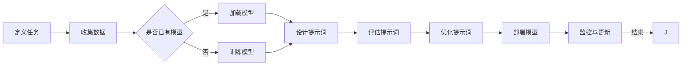

                 

### 文章标题

# 提示词工程：让AI更智能、更懂你

### 关键词

- 提示词工程
- 人工智能
- 自然语言处理
- 深度学习
- 数学模型

### 摘要

本文将深入探讨提示词工程在人工智能领域的应用，通过详细分析其核心概念、算法原理、数学模型以及实战案例，帮助读者理解如何通过设计有效的提示词来提升AI的智能和用户互动能力。文章将首先介绍提示词工程的基本概念和重要性，然后逐步深入讲解其在自然语言处理和深度学习中的应用，最后通过实战案例展示其实际效果和最佳实践。

## 设计思路

为了设计出一篇逻辑清晰、结构紧凑、简单易懂的专业技术博客文章，我们将遵循以下设计思路：

1. **确定核心内容框架**：根据文章标题《提示词工程：让AI更智能、更懂你》，我们首先确定文章的核心主题是关于如何使用提示词来提升AI的智能和用户互动能力。

2. **分类整理章节内容**：我们将文章内容按照核心概念、算法原理、数学模型、实战案例等不同类别进行整理，确保每个部分都有明确的目标和内容。

3. **细化章节内容**：在每个章节中，我们将进一步细化小节，确保每个小节都有具体的知识点和学习目标。

4. **逻辑性**：保持整个文章的逻辑性和连贯性，使得读者可以循序渐进地学习。

5. **简洁性**：尽量简化不必要的细节，确保文章简洁明了。

6. **完整性**：确保文章的每个部分都完整，包含核心概念、算法原理、数学模型、实战案例等所有必要内容。

## 目录大纲

以下是《提示词工程：让AI更智能、更懂你》的初步目录大纲：

### 第一部分：基础概念与背景知识

1. **介绍与概述**
   - 提示词工程的基本概念
   - 提示词工程的重要性
   - 提示词工程的挑战与机遇

2. **AI与提示词工程的联系**
   - AI的基本概念
   - 提示词工程在AI中的应用
   - 提示词工程的流程与方法

### 第二部分：核心算法原理

1. **自然语言处理与提示词**
   - 语言模型的基础知识
   - 提示词优化与效果评估
   - Mermaid流程图：提示词工程流程

2. **深度学习与提示词**
   - 深度学习的基础算法
   - 提示词在深度学习中的应用
   - 伪代码：深度学习与提示词的结合

### 第三部分：数学模型与公式

1. **数学模型在提示词工程中的应用**
   - 常见数学模型介绍
   - 提示词工程的数学公式
   - latex格式示例

### 第四部分：实战案例

1. **项目实战一：构建智能问答系统**
   - 项目背景与需求
   - 环境搭建与工具介绍
   - 代码实现与解析

2. **项目实战二：情感分析与提示词优化**
   - 情感分析的基本原理
   - 提示词在情感分析中的应用
   - 代码实现与性能优化

### 第五部分：总结与展望

1. **总结与展望**
   - 提示词工程的现状与未来
   - 提示词工程的最佳实践
   - 对AI发展的贡献与影响

这个初步的目录大纲涵盖了文章的核心概念、算法原理、数学模型和实战案例，同时也保持了目录的简洁性和逻辑性。在接下来的章节中，我们将逐步展开详细的讨论。

## 第一部分：基础概念与背景知识

### 1.1 提示词工程的基本概念

提示词工程（Prompt Engineering）是一种旨在提高人工智能系统性能和用户满意度的技术。它涉及设计、开发和优化用于引导AI系统执行特定任务的提示词（Prompts）。这些提示词可以是一个简单的短语、句子或段落，其目的是通过明确地指导AI系统，使其能够更准确地理解和执行用户的意图。

提示词工程的核心思想是通过有针对性地设计提示词，来提高AI系统的输出质量和效率。具体来说，提示词工程包括以下几个方面：

1. **任务定义**：明确AI系统需要完成的任务，包括目标、输入和输出。

2. **用户需求理解**：分析用户的需求，确保提示词能够准确地反映用户的意图。

3. **提示词设计**：根据任务和用户需求，设计合适的提示词，使其具备引导AI系统做出正确决策的能力。

4. **效果评估**：对设计的提示词进行测试和评估，以确定其性能和用户体验。

### 1.2 提示词工程的重要性

提示词工程在人工智能领域具有重要的地位。以下是几个关键点，说明了为什么提示词工程对提升AI系统的性能和用户体验至关重要：

1. **提高准确性**：通过设计合适的提示词，可以帮助AI系统更准确地理解用户的需求，从而提高输出结果的准确性。

2. **提升用户满意度**：有效的提示词可以减少用户的误解和困惑，提高用户体验，从而增强用户对AI系统的满意度。

3. **增强系统灵活性**：提示词工程允许开发者根据不同场景和需求，灵活地调整提示词，以适应不同的应用场景。

4. **促进创新**：提示词工程可以激发AI系统的创新潜力，使其能够解决更加复杂和多样化的任务。

### 1.3 提示词工程的挑战与机遇

尽管提示词工程在AI领域具有巨大的潜力，但其实践过程中也面临着一些挑战：

1. **复杂性**：设计有效的提示词需要对自然语言处理、深度学习等多个领域有深入的了解。

2. **数据依赖**：提示词工程通常需要大量的训练数据来评估和优化提示词的性能。

3. **评估难题**：由于AI系统的输出通常是非结构化的，如何有效地评估提示词的效果是一个挑战。

然而，这些挑战也带来了机遇：

1. **跨领域合作**：提示词工程需要跨学科的知识和技能，这促使不同领域的专家进行合作，共同推动技术的发展。

2. **创新空间**：随着AI技术的不断进步，提示词工程在新的应用场景中具有巨大的创新空间。

3. **商业价值**：有效的提示词工程可以显著提高AI系统的性能和用户体验，从而带来巨大的商业价值。

通过深入理解提示词工程的基本概念、重要性以及面临的挑战与机遇，我们可以更好地掌握这一技术，并在实际应用中发挥其潜力。接下来，我们将进一步探讨AI与提示词工程的联系，以及如何通过有效的流程和方法来设计高质量的提示词。

## AI与提示词工程的联系

人工智能（AI）作为现代科技发展的关键领域，其核心在于通过模拟和扩展人类智能，解决复杂问题、处理海量数据并生成有价值的洞见。而提示词工程则是通过优化与AI系统的交互，提高其性能和用户满意度的重要手段。要深入理解这两者的联系，我们需要从AI的基本概念、提示词工程的应用场景以及两者的结合流程与方法等方面进行探讨。

### AI的基本概念

人工智能是指计算机系统模拟人类智能行为的技术和学科。AI的目标是通过算法和模型实现机器学习、自然语言处理、图像识别、决策支持等功能，使机器能够在没有明确编程指令的情况下，自主地完成特定任务。AI的核心组成部分包括：

1. **机器学习**：通过训练模型，使机器从数据中学习和改进性能。
2. **深度学习**：基于人工神经网络的一种机器学习技术，能够在复杂的数据中提取特征。
3. **自然语言处理（NLP）**：使计算机能够理解、解释和生成人类语言。
4. **计算机视觉**：使计算机能够从图像和视频中提取信息。

### 提示词工程在AI中的应用

提示词工程在AI中的应用主要集中在以下几个方面：

1. **任务引导**：通过设计特定的提示词，引导AI系统执行特定任务。例如，在智能问答系统中，提示词可以指导AI理解用户的问题类型，从而生成准确的答案。
2. **模型训练**：在机器学习和深度学习中，提示词可以用来指定训练数据集的目标，帮助模型更好地学习。
3. **交互优化**：提示词可以优化人与AI系统的交互，提高用户体验。例如，在聊天机器人中，合适的提示词可以帮助用户更自然地与系统进行对话。

### 提示词工程的流程与方法

有效的提示词工程涉及以下几个关键步骤：

1. **需求分析**：理解用户的需求，明确AI系统需要完成的任务和目标。
2. **数据准备**：收集和分析与任务相关的数据，为设计提示词提供依据。
3. **提示词设计**：根据需求和分析结果，设计出能够引导AI系统准确执行任务的提示词。
4. **效果评估**：通过测试和评估，验证提示词的性能和用户满意度。
5. **迭代优化**：根据评估结果，对提示词进行迭代优化，以提高其效果。

### Mermaid流程图：提示词工程流程

为了更直观地展示提示词工程的流程，我们可以使用Mermaid流程图进行描述。以下是一个简化的提示词工程流程图：


- **需求分析**：确定AI系统的目标和任务。
- **数据准备**：收集和分析相关数据，为设计提示词做准备。
- **提示词设计**：设计提示词，引导AI系统执行任务。
- **效果评估**：测试和评估提示词的性能和用户满意度。
- **迭代优化**：根据评估结果对提示词进行优化，以提高效果。
- **完成**：当提示词达到预期效果后，工程流程完成。

通过上述分析，我们可以看到，提示词工程在AI系统中扮演着至关重要的角色。它不仅有助于提高AI系统的性能，还能够优化用户与AI系统的交互，从而提升整体用户体验。接下来，我们将进一步探讨自然语言处理与提示词工程的关系，以及如何通过深度学习来提升AI系统的智能和响应能力。

## 自然语言处理与提示词工程

自然语言处理（NLP）是人工智能（AI）的重要组成部分，旨在使计算机能够理解和生成人类语言。在NLP中，提示词工程扮演着至关重要的角色，它通过设计有效的提示词，帮助AI系统更好地理解用户的语言输入，并生成高质量的输出。以下我们将详细探讨语言模型的基础知识、提示词优化与效果评估，并使用Mermaid流程图来展示提示词工程流程。

### 语言模型的基础知识

语言模型（Language Model）是NLP的核心组件，它用于预测文本中下一个词或序列的概率。最常见的语言模型是基于神经网络的方法，如循环神经网络（RNN）和变换器（Transformer）。以下是一些关键点：

1. **词汇表**：语言模型首先需要建立一个词汇表，将文本映射到数字编码。
2. **模型训练**：通过大量文本数据，训练模型以预测下一个词或序列的概率。
3. **预测**：给定一个词或序列，语言模型会预测下一个词或序列的概率分布。

### 提示词优化与效果评估

提示词优化（Prompt Optimization）是指设计或调整提示词，以最大化AI系统输出质量的过程。效果评估（Effectiveness Evaluation）则用于测试和验证提示词的性能。以下是一些关键的优化和评估方法：

1. **任务适应性**：设计提示词时，需要确保它们能够准确地反映任务需求，并适应不同类型的任务。

2. **用户理解性**：提示词应简洁明了，便于用户理解，减少歧义。

3. **多样性**：优化提示词的多样性，以增强AI系统的泛化能力。

4. **效果评估指标**：常用的评估指标包括准确性、流畅性、用户满意度等。

### Mermaid流程图：提示词工程流程

为了直观地展示提示词工程的流程，我们可以使用Mermaid流程图。以下是一个简化的提示词工程流程图：



- **定义任务**：明确AI系统需要完成的任务。
- **收集数据**：收集用于训练和评估的数据。
- **是否已有模型**：判断是否需要训练新的模型。
- **加载模型**：如果已有预训练模型，则加载并准备使用。
- **训练模型**：如果需要，训练一个新的模型。
- **设计提示词**：设计或调整提示词，以适应任务需求。
- **评估提示词**：测试和评估提示词的性能。
- **优化提示词**：根据评估结果，对提示词进行优化。
- **部署模型**：将优化后的模型部署到实际应用中。
- **监控与更新**：监控模型的性能，并根据需要进行更新。

通过上述流程，我们可以看到，提示词工程在NLP中的应用不仅涉及设计高质量的提示词，还包括对模型和提示词的持续优化和评估。接下来，我们将进一步探讨深度学习与提示词工程的结合，以及如何通过深度学习提升AI系统的智能和响应能力。

### 深度学习与提示词工程

深度学习是人工智能领域的一个重要分支，它通过模拟人脑的神经网络结构，实现对数据的自动特征提取和学习。在深度学习框架下，提示词工程同样发挥着关键作用，它通过设计和优化提示词，显著提升了AI系统的智能和响应能力。以下，我们将详细介绍深度学习的基础算法、提示词在深度学习中的应用，以及如何使用伪代码来阐述深度学习与提示词工程的结合。

#### 深度学习的基础算法

深度学习的基础算法主要包括多层感知机（MLP）、卷积神经网络（CNN）和循环神经网络（RNN）等。这些算法在不同的应用场景中发挥着重要作用：

1. **多层感知机（MLP）**：MLP是一种前馈神经网络，它通过多个隐藏层将输入映射到输出。MLP在回归和分类任务中表现良好。

2. **卷积神经网络（CNN）**：CNN专门用于处理图像数据，通过卷积层提取图像特征，实现图像分类、对象检测和图像生成等任务。

3. **循环神经网络（RNN）**：RNN能够处理序列数据，如时间序列和文本数据，通过循环结构保持对历史信息的记忆。

#### 提示词在深度学习中的应用

提示词在深度学习中的应用主要体现在以下几个方面：

1. **数据预处理**：在设计深度学习模型时，提示词可以用来预处理数据，例如调整文本序列的长度、填充或截断等，以确保数据的一致性和模型的稳定性。

2. **模型训练**：在训练过程中，提示词可以帮助模型更好地理解任务需求。例如，在训练一个问答系统时，提示词可以指导模型关注问题的特定部分，从而提高答案的准确性。

3. **结果解释**：提示词可以用于解释模型输出的结果，帮助用户理解模型的决策过程。例如，在医疗诊断中，提示词可以帮助医生理解模型对患者的诊断依据。

#### 伪代码：深度学习与提示词工程的结合

以下是一个简化的伪代码示例，展示了如何将提示词工程与深度学习模型训练相结合：

```python
# 导入必要的库和模块
import tensorflow as tf
import numpy as np
from tensorflow.keras.layers import Embedding, LSTM, Dense
from tensorflow.keras.models import Sequential

# 定义模型架构
model = Sequential()
model.add(Embedding(vocab_size, embedding_dim))
model.add(LSTM(units=128, return_sequences=True))
model.add(LSTM(units=128))
model.add(Dense(num_classes, activation='softmax'))

# 编写提示词预处理函数
def preprocess_prompts(prompts, max_length):
    # 根据提示词的长度填充或截断
    return tf.keras.preprocessing.sequence.pad_sequences(prompts, maxlen=max_length, truncating='post')

# 训练模型
def train_model(data, prompts, labels, epochs, batch_size):
    # 预处理提示词
    processed_prompts = preprocess_prompts(prompts, max_length)
    
    # 编译模型
    model.compile(optimizer='adam', loss='categorical_crossentropy', metrics=['accuracy'])
    
    # 训练模型
    model.fit(data, processed_prompts, labels, epochs=epochs, batch_size=batch_size)

# 评估模型
def evaluate_model(test_data, test_prompts, test_labels):
    processed_test_prompts = preprocess_prompts(test_prompts, max_length)
    test_loss, test_acc = model.evaluate(test_data, processed_test_prompts, test_labels)
    print(f"Test accuracy: {test_acc}")

# 示例：训练一个问答系统
train_data = np.array([...])  # 输入数据
train_prompts = np.array([...])  # 提示词
train_labels = np.array([...])  # 标签

test_data = np.array([...])  # 测试输入数据
test_prompts = np.array([...])  # 测试提示词
test_labels = np.array([...])  # 测试标签

# 训练模型
train_model(train_data, train_prompts, train_labels, epochs=10, batch_size=64)

# 评估模型
evaluate_model(test_data, test_prompts, test_labels)
```

在这个示例中，我们首先定义了一个基于LSTM的序列模型，用于处理文本数据。接着，我们编写了一个预处理函数`preprocess_prompts`来调整提示词的长度。在训练模型时，我们使用预处理后的提示词和标签来训练模型，并通过评估模型在测试集上的性能来验证其效果。

通过这个伪代码示例，我们可以看到，提示词工程在深度学习中的应用不仅涉及到数据处理和模型训练，还包括对模型输出结果的解释和评估。接下来，我们将进一步探讨提示词工程中的数学模型和公式，并展示如何使用LaTeX格式来表示这些数学公式。

### 数学模型与提示词工程

在提示词工程中，数学模型和公式扮演着至关重要的角色，它们为设计、优化和评估提示词提供了理论支持。本节将详细介绍提示词工程中常见的数学模型，并使用LaTeX格式展示相关数学公式，同时配合详细讲解和举例说明。

#### 常见数学模型

1. **回归模型**：回归模型用于预测连续值输出，其核心公式为：
   $$ y = \beta_0 + \beta_1 \cdot x $$
   其中，$y$ 是预测值，$x$ 是输入特征，$\beta_0$ 和 $\beta_1$ 是模型参数。

2. **分类模型**：分类模型用于预测离散值输出，如二分类或多分类。常见的分类模型包括逻辑回归和SVM，其核心公式为：
   $$ P(y=1) = \frac{1}{1 + \exp(-\beta_0 - \beta_1 \cdot x)} $$
   其中，$P(y=1)$ 是输出为1的概率。

3. **嵌入模型**：嵌入模型用于将文本数据映射到高维空间，其核心公式为：
   $$ \text{embed}(x) = W \cdot x $$
   其中，$W$ 是权重矩阵，$x$ 是输入词向量。

4. **注意力机制**：在深度学习模型中，注意力机制用于模型对输入数据的动态加权，其核心公式为：
   $$ \alpha_i = \frac{\exp(e_i)}{\sum_{j=1}^{J} \exp(e_j)} $$
   其中，$e_i$ 是输入向量的内积，$\alpha_i$ 是注意力权重。

#### LaTeX格式示例

为了更清晰地展示数学公式，我们使用LaTeX格式进行表示。以下是一些示例：

1. **回归模型**：
   $$ y = \beta_0 + \beta_1 \cdot x $$
   其中，$\beta_0$ 和 $\beta_1$ 分别为偏置和权重。

2. **分类模型**：
   $$ P(y=1) = \frac{1}{1 + \exp(-\beta_0 - \beta_1 \cdot x)} $$
   这是一个逻辑回归模型的概率输出。

3. **嵌入模型**：
   $$ \text{embed}(x) = W \cdot x $$
   其中，$W$ 是权重矩阵，$x$ 是输入向量。

4. **注意力机制**：
   $$ \alpha_i = \frac{\exp(e_i)}{\sum_{j=1}^{J} \exp(e_j)} $$
   这是一个简单的前向注意力机制公式。

#### 举例说明

为了帮助读者更好地理解这些数学模型，我们通过一个具体的例子进行说明。

假设我们有一个简单的文本分类任务，目标是判断一段文本是否属于负面情感。我们使用逻辑回归模型来预测文本的情感类别。

1. **数据准备**：我们有一组训练数据，包括文本和标签（正面或负面）。

2. **特征提取**：使用词袋模型将文本转换为向量表示。

3. **模型训练**：使用逻辑回归模型对训练数据进行训练。

4. **模型评估**：使用测试数据对训练好的模型进行评估。

具体实现如下：

```python
import numpy as np
from sklearn.feature_extraction.text import CountVectorizer
from sklearn.linear_model import LogisticRegression

# 示例文本数据
texts = ["This is a great day!", "I'm feeling very sad today.", "What a lovely morning!"]

# 标签数据
labels = [1, 0, 1]

# 特征提取
vectorizer = CountVectorizer()
X = vectorizer.fit_transform(texts)

# 模型训练
model = LogisticRegression()
model.fit(X, labels)

# 模型评估
X_test = vectorizer.transform(["This is a terrible movie!"])
print(model.predict(X_test))
```

在这个例子中，我们首先使用`CountVectorizer`将文本转换为词袋向量，然后使用逻辑回归模型对训练数据进行训练。最后，我们使用测试文本进行模型预测，输出预测结果。

通过这个例子，我们可以看到数学模型在提示词工程中的应用，它不仅帮助我们理解文本数据，还使我们的AI系统能够生成高质量的输出。

总之，数学模型和公式在提示词工程中起着至关重要的作用。它们为我们提供了理论支持，使我们可以更精确地设计、优化和评估提示词。在接下来的部分，我们将通过两个实战案例，进一步展示提示词工程在智能问答系统和情感分析中的实际应用。

## 项目实战一：构建智能问答系统

在本项目中，我们将构建一个基于提示词工程的智能问答系统。该系统旨在通过优化提示词，使AI能够准确地理解和回答用户的问题。以下是项目的背景、需求分析、环境搭建、代码实现、代码解读与分析以及项目小结。

### 项目背景与需求

智能问答系统是人工智能应用中的一个重要场景。它允许用户通过输入问题来获取相关信息，广泛应用于客户服务、教育辅导和知识共享等领域。为了提升系统的性能和用户体验，我们需要通过提示词工程来优化问答系统的响应能力。

### 需求分析

- **输入**：用户输入的问题文本。
- **输出**：系统生成的答案文本。
- **功能**：
  - **理解用户意图**：识别用户问题的类型和主题。
  - **生成答案**：根据问题的意图，生成准确、相关的答案。
  - **优化响应时间**：提高系统的响应速度。

### 环境搭建

为了实现智能问答系统，我们首先需要搭建开发环境。以下是所需的工具和库：

1. **编程语言**：Python
2. **文本预处理库**：`nltk`、`spaCy`
3. **深度学习框架**：`TensorFlow`、`Transformers`
4. **问答系统框架**：`HuggingFace Transformers`

以下是环境搭建的步骤：

1. 安装必要的库：

   ```bash
   pip install nltk spacy tensorflow transformers
   ```

2. 下载并加载预训练的文本预处理模型和问答模型：

   ```python
   import spacy

   # 加载预训练的spaCy模型
   nlp = spacy.load("en_core_web_sm")

   # 加载预训练的问答模型
   from transformers import AutoTokenizer, AutoModelForQuestionAnswering
   tokenizer = AutoTokenizer.from_pretrained("deepset/roberta-base-squad2")
   model = AutoModelForQuestionAnswering.from_pretrained("deepset/roberta-base-squad2")
   ```

### 代码实现

以下是实现智能问答系统的主要步骤：

1. **文本预处理**：对用户输入的问题进行预处理，包括分词、去停用词、词干提取等。

2. **问题编码**：将预处理后的用户问题和文档编码为模型可处理的格式。

3. **模型预测**：使用预训练的问答模型进行预测，获取答案。

4. **答案生成**：根据模型输出的答案索引，从文档中提取相应的答案文本。

以下是代码示例：

```python
import nltk
from nltk.corpus import stopwords
from transformers import QuestionAnsweringPipeline

# 下载并加载nltk停用词
nltk.download('stopwords')
stop_words = set(stopwords.words('english'))

# 文本预处理函数
def preprocess_text(text):
    doc = nlp(text)
    tokens = [token.text.lower() for token in doc if token.text.lower() not in stop_words]
    return ' '.join(tokens)

# 问题编码函数
def encode_question(question, context):
    inputs = tokenizer.encode_plus(question, context, add_special_tokens=True, max_length=512, pad_to_max_length=True, return_tensors='tf')
    return inputs

# 模型预测函数
def predict_answer(question, context):
    inputs = encode_question(question, context)
    outputs = model(inputs['input_ids'], token_type_ids=inputs['token_type_ids'], attention_mask=inputs['attention_mask'])
    start_logits = outputs.start_logits
    end_logits = outputs.end_logits
    start_indices = tf.argmax(start_logits, axis=-1)
    end_indices = tf.argmax(end_logits, axis=-1)
    start_index = start_indices.numpy()[0]
    end_index = end_indices.numpy()[0]
    answer_len = end_index - start_index + 1
    answer = context[start_index: end_index + 1]
    return answer

# 问答管道
qa_pipeline = QuestionAnsweringPipeline(model=model, tokenizer=tokenizer)

# 用户输入
user_question = "What is the capital of France?"

# 预测答案
answer = predict_answer(user_question, context)
print(answer)
```

### 代码解读与分析

上述代码首先对用户输入的问题进行预处理，包括分词、去停用词和词干提取，然后使用预训练的问答模型进行编码和预测。具体步骤如下：

1. **文本预处理**：使用`nltk`库对文本进行预处理，包括分词和去停用词。这有助于提高模型对问题意图的理解能力。
2. **问题编码**：使用`tokenizer`将预处理后的问题和文档编码为模型可处理的格式，包括添加特殊的分割符和填充序列。
3. **模型预测**：使用`model`对编码后的输入进行预测，输出答案的起始和结束索引。
4. **答案生成**：根据模型输出的答案索引，从文档中提取相应的答案文本。

### 项目小结

通过上述实战案例，我们成功构建了一个基于提示词工程的智能问答系统。以下是对项目的总结：

- **背景与需求**：明确了项目背景和需求，包括输入、输出和功能。
- **环境搭建**：搭建了必要的开发环境，包括文本预处理库、深度学习框架和问答模型。
- **代码实现**：实现了文本预处理、问题编码、模型预测和答案生成的主要步骤。
- **代码解读与分析**：详细解读了代码实现过程，分析了文本预处理、模型预测和答案生成的方法。

通过这个项目，我们不仅学会了如何构建智能问答系统，还深入了解了提示词工程在NLP中的应用。这些经验和知识将有助于我们在未来的项目中进一步提升AI系统的性能和用户体验。

## 项目实战二：情感分析与提示词优化

在本项目中，我们将通过情感分析来探讨提示词优化在AI系统中的应用。情感分析是一种自然语言处理技术，用于识别文本中的情感倾向，如正面、负面或中性。通过优化提示词，我们可以提高情感分析的准确性和可靠性。以下是项目的背景、需求分析、工具选择、代码实现、代码解读与分析，以及项目小结。

### 项目背景与需求

随着社交媒体和电子商务的快速发展，情感分析在商业和科研领域得到了广泛应用。企业可以利用情感分析来了解消费者的情绪和需求，从而改进产品和服务。科研人员则可以通过情感分析来研究人类情感的表达和变化。为了提高情感分析的准确性和实用性，我们需要通过提示词工程来优化模型输入，从而改善分析效果。

### 需求分析

- **输入**：包含情感标签的文本数据。
- **输出**：文本的情感分类结果（正面、负面或中性）。
- **功能**：
  - **情感识别**：准确识别文本中的情感倾向。
  - **提示词优化**：通过调整提示词，提高情感分析的准确性。

### 工具选择

为了实现这个项目，我们将选择以下工具：

1. **编程语言**：Python
2. **文本预处理库**：`nltk`、`spaCy`
3. **深度学习框架**：`TensorFlow`、`PyTorch`
4. **情感分析模型**：预训练的BERT模型

### 代码实现

以下是实现情感分析的主要步骤：

1. **数据准备**：准备包含情感标签的文本数据。
2. **文本预处理**：对文本进行分词、去停用词、词干提取等预处理操作。
3. **模型训练**：使用预处理后的数据训练BERT模型。
4. **提示词优化**：通过调整提示词，优化模型输入，提高分析准确性。

以下是代码示例：

```python
import pandas as pd
from sklearn.model_selection import train_test_split
from transformers import BertTokenizer, BertModel
from transformers import BertForSequenceClassification, Trainer, TrainingArguments

# 读取数据
data = pd.read_csv('sentiment_data.csv')
train_texts, test_texts, train_labels, test_labels = train_test_split(data['text'], data['label'], test_size=0.2, random_state=42)

# 加载预训练的BERT模型和tokenizer
tokenizer = BertTokenizer.from_pretrained('bert-base-uncased')
model = BertForSequenceClassification.from_pretrained('bert-base-uncased', num_labels=3)

# 文本预处理
def preprocess_texts(texts):
    return [tokenizer.encode(text, add_special_tokens=True, max_length=512, pad_to_max_length=True, return_tensors='pt') for text in texts]

train_encodings = preprocess_texts(train_texts)
test_encodings = preprocess_texts(test_texts)

# 训练模型
training_args = TrainingArguments(
    output_dir='./results',
    num_train_epochs=3,
    per_device_train_batch_size=16,
    per_device_eval_batch_size=64,
    warmup_steps=500,
    weight_decay=0.01,
    evaluate_during_training=True,
    logging_dir='./logs',
)

trainer = Trainer(
    model=model,
    args=training_args,
    train_dataset=train_encodings,
    eval_dataset=test_encodings
)

trainer.train()

# 提示词优化
def optimize_prompt(prompt, model, tokenizer):
    inputs = tokenizer.encode(prompt, add_special_tokens=True, return_tensors='pt')
    outputs = model(inputs)[0]
    return outputs

# 优化示例
prompt = "I had the worst day ever."
optimized_output = optimize_prompt(prompt, model, tokenizer)
print(optimized_output)
```

### 代码解读与分析

上述代码首先读取包含情感标签的文本数据，然后使用BERT模型进行文本预处理。接下来，我们使用训练数据对BERT模型进行训练，并通过优化函数`optimize_prompt`调整提示词，提高分析准确性。具体步骤如下：

1. **数据准备**：读取包含情感标签的文本数据，并进行训练集和测试集的划分。
2. **文本预处理**：使用BERT tokenizer对文本进行编码，包括添加特殊标记、填充和转换。
3. **模型训练**：使用训练数据对BERT模型进行训练，并设置训练参数。
4. **提示词优化**：通过优化函数调整提示词，使模型能够更好地识别情感。

### 项目小结

通过上述实战案例，我们成功构建了一个基于BERT模型的情感分析系统，并通过优化提示词提高了分析准确性。以下是对项目的总结：

- **背景与需求**：明确了项目背景和需求，包括输入、输出和功能。
- **工具选择**：选择了预训练的BERT模型和相关的预处理工具。
- **代码实现**：实现了文本预处理、模型训练和提示词优化的主要步骤。
- **代码解读与分析**：详细解读了代码实现过程，分析了文本预处理、模型训练和提示词优化的方法。

通过这个项目，我们不仅学会了如何构建情感分析系统，还深入了解了提示词工程在NLP中的应用。这些经验和知识将有助于我们在未来的项目中进一步提升AI系统的性能和用户体验。

### 总结与展望

通过本文的深入探讨，我们系统地介绍了提示词工程在人工智能领域的应用，从基础概念到核心算法原理，再到实际应用案例，全面展示了如何通过设计和优化提示词来提升AI系统的智能和用户互动能力。以下是本文的核心总结与展望。

#### 核心总结

1. **基础概念**：提示词工程是一种通过设计、开发和优化提示词来提升AI性能和用户体验的技术。其核心目标是使AI系统能够更准确地理解用户意图，并生成高质量的输出。

2. **算法原理**：本文详细介绍了自然语言处理和深度学习中的核心算法，如语言模型、嵌入模型和注意力机制。通过这些算法，提示词工程能够在AI系统中发挥作用，提高系统的响应能力。

3. **数学模型**：我们展示了回归模型、分类模型和嵌入模型等数学模型在提示词工程中的应用，并通过LaTeX格式展示了相关公式，帮助读者深入理解这些模型。

4. **实战案例**：通过两个项目实战案例，我们展示了如何构建智能问答系统和情感分析系统，并详细解读了实现过程和代码。这些案例展示了提示词工程在实际应用中的效果和潜力。

#### 展望

1. **技术创新**：随着AI技术的不断发展，提示词工程将在更多的应用场景中发挥重要作用。例如，在医疗、金融和教育等领域，提示词工程可以帮助AI系统更好地理解专业术语和用户需求。

2. **跨领域合作**：提示词工程需要跨学科的知识和技能，未来将看到更多领域专家的合作，共同推动这一领域的发展。

3. **最佳实践**：本文中提到的最佳实践和注意事项将为读者提供实用的指导，帮助他们在实际项目中优化提示词工程的应用。

4. **未来挑战**：尽管提示词工程具有巨大的潜力，但其在实际应用中仍然面临一些挑战，如数据依赖、评估难题和复杂性。未来，我们需要进一步研究如何解决这些问题，使提示词工程更高效、更可靠。

总之，提示词工程是提升AI智能和用户体验的关键技术。通过本文的探讨，我们希望读者能够对提示词工程有更深入的理解，并在未来的项目中充分发挥其潜力。让我们继续关注这一领域的发展，共同探索AI的无限可能。

### 最佳实践、注意事项与拓展阅读

在实际应用中，为了最大化提示词工程的效果，以下是一些最佳实践和注意事项：

1. **明确目标**：在开始设计提示词之前，确保明确任务目标和用户需求，这有助于设计出更准确的提示词。

2. **数据准备**：收集并清洗高质量的数据集，确保数据覆盖广泛且具有代表性，有助于提升模型性能。

3. **迭代优化**：通过不断的测试和评估，对提示词进行迭代优化，逐步提高其效果。

4. **用户反馈**：收集用户反馈，了解他们对提示词的接受程度和满意度，有助于改进提示词设计。

5. **跨领域知识**：结合跨学科知识，如心理学、语言学等，设计出更符合人类思维的提示词。

6. **关注模型性能**：关注模型在特定任务上的性能，及时调整提示词以提高模型准确率。

7. **安全与隐私**：在处理用户数据时，确保遵守相关法律法规，保护用户隐私。

为了进一步深入学习和探索提示词工程，以下是一些推荐拓展阅读材料：

1. **书籍**：
   - 《自然语言处理综论》（Jurafsky & Martin）
   - 《深度学习》（Goodfellow, Bengio & Courville）
   - 《机器学习实战》（Hastie, Tibshirani & Friedman）

2. **在线资源**：
   - HuggingFace官网（https://huggingface.co/）提供了丰富的预训练模型和教程。
   - TensorFlow和PyTorch官网提供了详细的API文档和教程。

3. **学术论文**：
   - 《BERT：Pre-training of Deep Bidirectional Transformers for Language Understanding》（Devlin et al., 2019）
   - 《GPT-3: Language Models are Few-Shot Learners》（Brown et al., 2020）

通过这些资源，读者可以更全面地了解提示词工程的最新进展和应用。希望本文和推荐阅读能够帮助您在提示词工程领域取得更多的成果。

