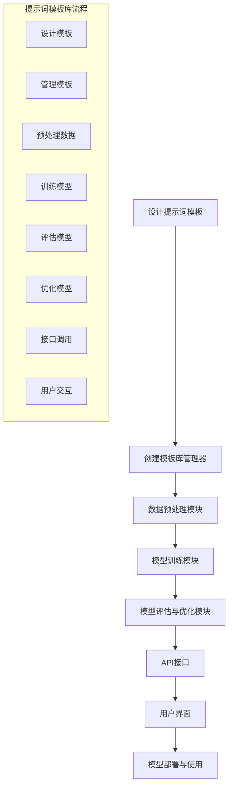

                 

### 文章标题：提示词模板库：加速AI应用开发的利器

> 关键词：提示词模板库、AI应用开发、人工智能、算法、数学模型

> 摘要：本文深入探讨了提示词模板库在AI应用开发中的作用和重要性。通过对提示词模板库的概念、结构、核心算法原理以及实际应用案例的详细分析，揭示了提示词模板库如何有效地加速AI应用开发的进程。

### 引言：AI应用开发的挑战与提示词模板库的作用

随着人工智能（AI）技术的快速发展，AI应用已经深入到我们的日常生活中，从智能助手到自动驾驶，从医疗诊断到金融分析，AI技术的应用场景日益广泛。然而，AI应用开发的过程并非一帆风顺，面临着诸多挑战。

首先，AI应用开发需要大量的数据和计算资源，这使得数据采集和预处理成为一项繁琐且耗时的任务。其次，AI模型的设计和优化需要大量的时间和专业知识，这使得开发效率低下。此外，AI应用的部署和运维也面临着一系列问题，如模型的可解释性、安全性、可靠性等。

为了应对这些挑战，研究者们不断探索新的解决方案。其中，提示词模板库作为一种新兴的技术，被越来越多地应用于AI应用开发中。提示词模板库通过预先定义和优化的提示词模板，可以帮助开发者快速构建和部署AI模型，从而加速应用开发进程。

本文将详细介绍提示词模板库的概念、结构、核心算法原理以及实际应用案例，旨在揭示提示词模板库在AI应用开发中的作用和重要性。通过本文的阅读，读者将能够深入了解提示词模板库的工作机制，掌握其应用技巧，为AI应用开发提供有力支持。

### 提示词模板库的概念与重要性

提示词模板库是一种用于AI应用开发的工具库，它包含了一系列预先定义和优化的提示词模板。提示词模板是指导AI模型进行训练和预测的关键因素，它能够为模型提供所需的上下文信息，从而影响模型的输出结果。

在传统的人工智能应用开发中，模型的训练和预测通常依赖于大量的数据集和复杂的算法。然而，这种方法存在几个显著的问题。首先，数据集的采集和处理往往需要大量的时间和计算资源，这增加了开发的成本和难度。其次，算法的设计和优化也需要专业的知识和经验，这使得普通开发者难以高效地构建和应用AI模型。此外，模型的解释性和可靠性也是传统方法面临的重要挑战。

与传统的AI开发方法相比，提示词模板库具有明显的优势。首先，提示词模板库通过预先定义和优化的提示词模板，可以简化数据集的采集和处理过程，降低开发成本。其次，提示词模板库提供了一系列通用的模板，开发者可以根据具体需求进行选择和调整，从而减少算法设计和优化的工作量。此外，提示词模板库的提示词模板通常经过严格的测试和验证，具有较高的解释性和可靠性，有助于提升AI应用的性能和效果。

在AI应用开发中，提示词模板库的主要作用体现在以下几个方面：

1. **快速构建AI模型**：提示词模板库提供了一系列预先定义的模板，开发者可以根据需求选择合适的模板，快速构建AI模型。这不仅简化了开发流程，提高了开发效率，还能够确保模型的基本性能。

2. **简化数据预处理**：提示词模板库中的模板通常包含了数据预处理的过程，如数据清洗、特征提取等。开发者只需根据模板的要求进行数据准备，无需深入理解数据处理的细节，从而减少开发难度。

3. **提升模型性能**：提示词模板库中的模板经过了严格的测试和优化，通常具有较高的性能和稳定性。开发者可以利用这些模板快速构建高性能的AI模型，从而提升应用的效果。

4. **增强模型解释性**：提示词模板库中的模板通常具有明确的语义和解释性，开发者可以清晰地理解模型的工作原理和预测过程，有助于提升模型的可解释性和透明度。

5. **降低开发门槛**：提示词模板库简化了AI应用开发的流程和难度，使得普通开发者也能够参与到AI应用开发中来，从而推动AI技术的发展和应用。

总之，提示词模板库作为一种新兴的AI开发工具，具有重要的应用价值和潜力。通过本文的后续内容，我们将深入探讨提示词模板库的组成结构、核心算法原理以及实际应用案例，帮助读者更好地理解和应用这一技术。

### 提示词模板库的基本结构

提示词模板库的核心在于其结构和组成，这决定了其功能和应用效果。一个典型的提示词模板库通常包含以下几个关键组成部分：

1. **提示词模板**：这是提示词模板库的最基本元素，每个模板都定义了特定的上下文信息和操作指令。提示词模板可以包含固定文本、参数化文本和动态生成的文本。例如，一个用于聊天机器人的提示词模板可能包含用户输入的问题和预定义的答案。

2. **模板库管理器**：该组件负责管理提示词模板的生命周期，包括创建、更新、删除和检索。模板库管理器还提供了模板的版本控制和权限管理功能，确保模板库的稳定性和安全性。

3. **数据预处理模块**：这一模块负责处理输入数据，包括数据清洗、格式转换和特征提取。预处理模块通常与特定的提示词模板相配合，确保数据能够满足模板的要求。

4. **模型训练模块**：该模块负责使用提示词模板和预处理后的数据对AI模型进行训练。训练模块通常使用深度学习技术，如神经网络，通过大量数据训练出高精度的模型。

5. **模型评估与优化模块**：在模型训练完成后，该模块负责评估模型的性能，并进行优化。评估指标可能包括准确率、召回率、F1分数等。优化过程可能涉及调整模型参数、增加训练数据或修改提示词模板。

6. **API接口**：提示词模板库通常提供API接口，供开发者调用。API接口允许开发者通过简单的函数调用，获取提示词模板库的功能，无需深入了解底层实现。

7. **用户界面**：一些提示词模板库可能包括一个用户界面，允许开发者直观地操作和管理模板库。用户界面通常提供模板的编辑、预览和测试功能，以及实时监控模型性能的仪表盘。

下面，我们通过一个具体的例子来更直观地理解提示词模板库的基本结构。

#### 例子：聊天机器人提示词模板库

假设我们要开发一个聊天机器人，其提示词模板库包含以下组件：

1. **提示词模板**：
   - **问候模板**：用于首次与用户交互，包含问候语和自我介绍。
   - **常见问题模板**：包含对用户常见问题的回答，如“如何使用本服务？”、“如何反馈问题？”等。
   - **参数化模板**：包含用户输入的变量，如“你最喜欢的颜色是什么？”。
   - **动态模板**：根据用户输入动态生成的模板，如“当前时间是XX:XX”。

2. **模板库管理器**：
   - 管理问候模板的创建、更新和删除。
   - 提供模板的版本控制，确保模板的版本一致性。

3. **数据预处理模块**：
   - 对用户输入进行清洗，去除无效字符和噪声。
   - 提取关键信息，如用户请求的类型和关键词。

4. **模型训练模块**：
   - 使用预定义的提示词模板和预处理后的数据训练聊天机器人的模型。
   - 使用神经网络技术，如RNN或BERT，提高模型的准确性。

5. **模型评估与优化模块**：
   - 使用测试数据集评估模型的性能。
   - 通过调整模型参数或增加训练数据来优化模型。

6. **API接口**：
   - 提供接口供开发者调用，实现模型的预测功能。
   - 支持实时更新和更新后的模型调用。

7. **用户界面**：
   - 提供模板编辑器，允许开发者直观地创建和修改提示词模板。
   - 提供监控面板，显示模型性能指标和预测结果。

通过这个例子，我们可以看到，提示词模板库的结构不仅包括模板本身，还包括了管理、预处理、训练、评估等多个环节，形成了一个完整的生态系统，为AI应用开发提供了全面的支持。

### 提示词与上下文的关系

在人工智能应用中，提示词与上下文之间的关系至关重要。提示词不仅仅是简单的文本输入，它们是模型理解用户意图、进行决策和生成响应的核心信息源。上下文则为提示词提供了必要的背景和环境，帮助模型更好地理解和处理输入信息。

#### 提示词的定义

提示词（Prompt）通常是指用于启动或引导AI模型执行特定任务的一组文本或指令。这些提示词可以是固定的，也可以是参数化的或动态生成的。固定提示词通常用于一些标准化的任务，如问答系统、文本分类等。参数化提示词允许在模板中插入变量，如用户名、时间等，使得模型能够根据不同的输入动态调整响应。动态提示词则是根据用户的输入实时生成的，可以更灵活地适应各种对话场景。

例如，在聊天机器人中，一个常见的固定提示词可能是“您好，有什么可以帮助您的吗？”这样的提示词适用于所有用户首次互动的情境。而一个参数化提示词可能是“您最近一次的订单时间是XX年XX月XX日，请问有什么问题需要咨询吗？”这样的提示词可以根据用户的个人信息动态调整。

#### 上下文的作用

上下文（Context）是指与提示词相关的背景信息，它为模型提供了必要的环境和情境。在自然语言处理任务中，上下文可以帮助模型理解提示词的真正意图和含义。例如，一个简单的提示词“下雨了”在不同的上下文中可能有不同的含义。如果上下文是“今天出门记得带伞”，那么“下雨了”意味着当前正在下雨；如果上下文是“这个故事里下雨了”，那么“下雨了”可能是指故事情节中的一个事件。

上下文的作用不仅限于语义理解，还包括模型的行为引导。在聊天机器人中，上下文可以帮助模型确定用户的具体需求，从而生成更准确的响应。例如，如果用户之前提到“我想要预订一个酒店房间”，那么后续的提示词“酒店的位置在哪里？”就具有明确的上下文关联，模型可以根据之前的对话信息提供相关的位置信息。

#### 提示词与上下文的关系模型

提示词与上下文之间的关系可以用一个动态交互模型来描述。在这个模型中，提示词是输入层，上下文是背景层，模型则在输入和背景之间进行匹配和处理。

1. **输入层**：提示词作为模型处理的原始输入，它们可能是独立的，也可能是与上下文相关的。在独立提示词中，模型需要根据提示词本身来生成响应。例如，提示词“您好”通常需要模型生成一个礼貌的问候。

2. **背景层**：上下文提供了一组与提示词相关的背景信息，这些信息可以帮助模型更好地理解提示词的意图和上下文关联。背景信息可以是历史对话记录、用户偏好、当前时间等。

3. **交互层**：模型在输入层和背景层之间进行交互，通过分析提示词和上下文之间的关系，生成适当的响应。这个过程中，模型可能会利用上下文信息来调整提示词的语义和意图，从而生成更准确和相关的响应。

例如，在一个对话系统中，当用户输入“您明天有空吗？”时，模型会首先分析这个提示词。如果上下文信息显示用户之前提到了会议安排，模型可能会生成一个具体的日程安排；如果没有上下文信息，模型可能会生成一个更为一般性的回答，如“明天我可能有空”。

#### 动态交互模型示例

下面通过一个具体的例子来说明提示词与上下文之间的动态交互关系。

**例子：聊天机器人对话**

- **用户输入**：用户输入“您明天有空吗？”。
- **提示词分析**：模型识别到这是一个询问时间的提示词。
- **上下文检索**：模型检索当前对话的历史记录，发现用户之前提到了会议安排。
- **意图理解**：模型结合上下文信息，理解用户意图是询问关于会议的时间安排。
- **生成响应**：模型生成一个具体的响应，如“明天上午10点的会议我会参加，其他时间我应该有空”。

通过这个例子，我们可以看到，提示词与上下文之间的关系不仅帮助模型理解了用户的意图，还使得生成的响应更加准确和个性化。这种动态交互模型在复杂的自然语言处理任务中尤为重要，它能够提高模型的性能和用户体验。

### 提示词模板的类型与特点

提示词模板在AI应用开发中扮演着至关重要的角色，它们不仅决定了模型的行为，还直接影响着用户体验和模型性能。根据用途和特性，提示词模板可以分为固定型提示词模板、参数化提示词模板和动态提示词模板。下面我们将分别介绍这三种类型的提示词模板，并探讨它们的特点和应用场景。

#### 固定型提示词模板

固定型提示词模板是最常见的提示词模板类型，它通常用于标准化的任务，如聊天机器人、文本分类、情感分析等。这种模板的特点是文本内容固定，不随用户输入或上下文变化而改变。

**特点**：
- **固定文本**：固定型提示词模板包含固定的文本内容，这些文本通常用于特定的场景和任务。
- **简单易用**：由于其内容固定，固定型提示词模板的开发和部署相对简单，适合初学者和快速原型开发。

**应用场景**：
- **问答系统**：例如，一个常见的问题回答系统可能会使用固定型提示词模板来回答常见问题，如“您有什么问题需要咨询吗？”。
- **文本分类**：在文本分类任务中，固定型提示词模板可以用于生成标签，如“这篇文章属于科技类”。

**示例**：
```plaintext
问候模板：您好，有什么可以帮助您的吗？
常见问题模板：您需要关于产品的详细信息吗？
请求输入模板：请告诉我您的需求，我将尽力帮助您。
```

#### 参数化提示词模板

参数化提示词模板是另一种常见的提示词模板类型，它通过参数化文本来适应不同的输入和上下文。这种模板的特点是文本内容可以包含变量，这些变量可以根据实际需求进行替换。

**特点**：
- **可变性**：参数化提示词模板中的文本内容可以包含变量，如用户名、时间等。
- **灵活性**：参数化提示词模板可以根据实际输入动态调整文本内容，从而生成更个性化的响应。

**应用场景**：
- **聊天机器人**：例如，一个聊天机器人可能会使用参数化提示词模板来处理用户请求，如“您最近的订单时间是XX年XX月XX日，有什么问题需要咨询吗？”。
- **个性化推荐**：在个性化推荐系统中，参数化提示词模板可以用于生成个性化的推荐信息，如“您可能会喜欢这款产品：[产品名称]”。

**示例**：
```plaintext
订单查询模板：您最近的订单时间是[订单时间]，订单号为[订单号]，请问有什么问题需要咨询吗？
推荐模板：根据您的喜好，我们为您推荐了[产品名称]，它可能适合您。
```

#### 动态提示词模板

动态提示词模板是最高级的提示词模板类型，它能够根据用户的输入和当前上下文动态生成文本。这种模板的特点是完全由模型在运行时生成，因此具有很强的灵活性和适应性。

**特点**：
- **动态生成**：动态提示词模板不是预先固定的，而是在模型运行时根据输入和上下文动态生成的。
- **高度适应**：动态提示词模板能够根据不同场景和上下文生成最合适的文本内容，从而提供最佳的用户体验。

**应用场景**：
- **自然语言生成**：例如，一个动态新闻生成系统可以根据用户兴趣和实时新闻动态生成个性化的新闻内容。
- **智能对话系统**：在智能对话系统中，动态提示词模板可以根据用户的提问和历史对话信息生成复杂的、上下文相关的响应。

**示例**：
```plaintext
新闻生成模板：根据您的兴趣，以下是今天最新的新闻：[新闻摘要]。
对话响应模板：您提到过[话题]，我了解到[相关信息]，您对此有何看法？
```

通过以上三种提示词模板的介绍，我们可以看到，固定型、参数化以及动态提示词模板各自具有独特的特点和适用场景。在实际应用中，可以根据具体需求和场景选择合适的提示词模板，以实现最佳的效果和用户体验。

### 提示词模板的设计原则

提示词模板的设计不仅需要考虑其功能性和实用性，还必须遵循一系列设计原则，以确保模板的简洁性、可扩展性、适应性和易用性。以下是一些关键的设计原则，以及它们在实际应用中的具体体现。

#### 简洁性

简洁性是设计提示词模板时需要首先考虑的原则。一个简洁的提示词模板应该能够用最少的文本内容传达所需的意图和上下文信息。这不仅有助于降低开发难度，还能提高模板的易用性和可维护性。

**设计原则**：
- **精简文本**：避免使用冗长和复杂的句子，尽量使用简洁明了的文本。
- **模块化**：将提示词模板分解为更小的模块，以便于维护和更新。

**实际应用**：
- **示例**：一个用于聊天机器人的简洁提示词模板可能是“您好，有什么可以帮助您的吗？”这种模板不仅简单易记，还能快速引导用户进入对话。

#### 可扩展性

可扩展性是指提示词模板能够适应未来变化和需求，方便进行扩展和修改。一个具有良好可扩展性的提示词模板应该允许添加新的功能和模块，而不会影响现有功能。

**设计原则**：
- **参数化**：使用参数化文本，使得模板可以灵活适应不同输入和场景。
- **标准化**：采用统一的命名和格式规范，便于模板的统一管理和扩展。

**实际应用**：
- **示例**：一个参数化提示词模板可以是“您最近一次的订单时间是[订单时间]，请问有什么问题需要咨询吗？”通过参数化，这个模板可以轻松适应不同的用户和订单信息。

#### 适应性

适应性是指提示词模板能够根据不同的环境和上下文进行调整，以提供最佳的用户体验。一个具有良好适应性的提示词模板应该能够应对各种变化和不确定性。

**设计原则**：
- **动态生成**：使用动态生成技术，使得模板能够根据实时输入和上下文生成最合适的文本。
- **智能调整**：结合机器学习和自然语言处理技术，使得模板能够自动识别和调整。

**实际应用**：
- **示例**：一个动态生成的提示词模板可能是“您提到的[话题]我们正在处理，预计[时间]内会有回应。”这个模板可以根据用户的问题和系统状态动态调整文本内容。

#### 易用性

易用性是指提示词模板的设计和操作应该简单直观，便于开发者使用和管理。一个具有良好易用性的提示词模板应该减少开发者的学习成本，提高开发效率。

**设计原则**：
- **用户友好**：界面设计直观，操作简便。
- **文档支持**：提供详细的文档和示例代码，帮助开发者快速上手。

**实际应用**：
- **示例**：一个易用的提示词模板管理器可能包括图形界面和便捷的编辑功能，使得开发者可以轻松地创建、修改和预览模板。

通过遵循这些设计原则，提示词模板不仅能够提高AI应用开发的效率和效果，还能为用户提供更好的体验。在实际开发过程中，可以根据具体需求和场景灵活应用这些原则，以达到最佳的设计效果。

### 2.1 提示词模板库运作流程的Mermaid流程图

为了更直观地理解提示词模板库的运作流程，我们可以使用Mermaid流程图来描述其从设计到应用的全过程。以下是提示词模板库运作流程的Mermaid流程图：



以下是每个节点的详细解释：

- **A[设计提示词模板]**：首先，根据应用需求设计出相应的提示词模板。这个过程包括确定模板类型、文本内容和参数等。
- **B[创建模板库管理器]**：创建模板库管理器，负责管理提示词模板的生命周期，包括创建、更新、删除和检索。
- **C[数据预处理模块]**：对输入数据（如用户输入）进行预处理，包括数据清洗、格式转换和特征提取。
- **D[模型训练模块]**：使用预处理后的数据和提示词模板训练AI模型。这个过程可能涉及深度学习或其他机器学习算法。
- **E[模型评估与优化模块]**：评估训练好的模型的性能，并根据评估结果进行优化，如调整模型参数或增加训练数据。
- **F[API接口]**：提供API接口，供开发者调用，实现模型的预测和响应生成。
- **G[用户界面]**：为用户提供交互界面，允许用户输入问题和查看响应。
- **H[模型部署与使用]**：将训练好的模型部署到实际应用中，供用户使用。

子图“提示词模板库流程”描述了提示词模板库从设计到应用的详细步骤：

- **I1[设计模板]**：设计出具体的提示词模板，包括固定型、参数化或动态提示词模板。
- **I2[管理模板]**：使用模板库管理器管理这些提示词模板，包括版本控制和权限管理。
- **I3[预处理数据]**：对用户输入的数据进行清洗和格式转换，提取关键特征。
- **I4[训练模型]**：使用预处理后的数据和提示词模板训练AI模型。
- **I5[评估模型]**：评估训练好的模型的性能，确保其满足应用需求。
- **I6[优化模型]**：根据评估结果对模型进行优化，提高其准确性和稳定性。
- **I7[接口调用]**：通过API接口，开发者可以调用模型进行预测和响应生成。
- **I8[用户交互]**：用户通过用户界面与模型进行交互，获取预期的输出结果。

通过这个Mermaid流程图，我们可以清晰地看到提示词模板库从设计到应用的整个流程，从而更好地理解和应用这一技术。

### 提示词模板生成算法

在AI应用开发中，提示词模板生成算法起着至关重要的作用。它通过一系列规则和策略，将原始输入数据转换为具有特定上下文信息和操作指令的提示词模板，从而为AI模型提供必要的输入。以下我们将详细探讨提示词模板生成算法的核心概念、输入和输出，并逐步分解其核心步骤。

#### 核心概念

提示词模板生成算法的核心在于如何根据输入数据和预定义规则，生成符合特定需求的提示词模板。这个过程通常涉及以下几个关键概念：

- **输入数据**：包括用户输入、环境信息和历史数据等。这些数据将用于生成提示词模板。
- **模板规则**：定义了生成提示词模板的规则和策略，如文本格式、参数插入和动态生成等。
- **上下文信息**：上下文信息用于提供输入数据和模板规则之间的关联，帮助生成具有明确意图和语义的提示词模板。

#### 输入

提示词模板生成算法的输入主要包括以下几类：

- **用户输入**：用户在交互过程中输入的文本信息，如问题、指令或反馈等。
- **环境信息**：与用户交互相关的环境信息，如时间、地理位置和系统状态等。
- **历史数据**：包括用户历史行为数据、系统历史记录和上下文历史信息等。

#### 输出

生成算法的输出是符合特定需求的提示词模板。这些模板将用于后续的模型训练、预测和交互。具体来说，输出可能包括以下内容：

- **文本模板**：包含预定义的文本信息和操作指令。
- **参数化模板**：带有参数占位符的模板，用于后续根据具体输入动态填充。
- **动态模板**：根据实时输入和上下文信息动态生成的模板。

#### 核心步骤

提示词模板生成算法通常包括以下几个核心步骤：

1. **数据预处理**：
   - 对输入数据（用户输入、环境信息等）进行清洗、格式转换和特征提取。
   - 建立数据字典，用于后续的文本填充和参数化处理。

2. **规则匹配**：
   - 根据预定义的模板规则，匹配输入数据和上下文信息，确定生成策略。
   - 对匹配结果进行分类或聚合，以便生成更符合语义的提示词模板。

3. **模板生成**：
   - 根据规则匹配结果，生成文本模板或参数化模板。
   - 如果是参数化模板，将参数化占位符替换为具体的参数值。

4. **动态调整**：
   - 对于动态生成的模板，根据实时输入和上下文信息进行调整。
   - 确保模板生成的文本具有高度的相关性和准确性。

5. **模板优化**：
   - 对生成的模板进行优化，确保其满足性能和用户体验的要求。
   - 调整模板规则，以提升模板生成的效果。

#### 伪代码示例

下面是一个简单的伪代码示例，用于说明提示词模板生成算法的基本流程：

```python
# 提示词模板生成算法伪代码

# 输入：用户输入data，环境信息context
# 输出：提示词模板template

def generate_template(data, context):
    # 步骤1：数据预处理
    preprocessed_data = preprocess_data(data, context)
    
    # 步骤2：规则匹配
    matched_rules = match_rules(preprocessed_data)
    
    # 步骤3：模板生成
    template = generate_text_template(matched_rules)
    
    # 步骤4：动态调整
    template = dynamic_adjustment(template, context)
    
    # 步骤5：模板优化
    optimized_template = optimize_template(template)
    
    return optimized_template

# 数据预处理
def preprocess_data(data, context):
    # 清洗和格式转换
    # 特征提取
    # 返回预处理后的数据
    return preprocessed_data

# 规则匹配
def match_rules(preprocessed_data):
    # 匹配预定义的模板规则
    # 返回匹配结果
    return matched_rules

# 模板生成
def generate_text_template(matched_rules):
    # 根据匹配结果生成文本模板
    # 如果是参数化模板，插入参数占位符
    return template

# 动态调整
def dynamic_adjustment(template, context):
    # 根据实时输入和上下文调整模板
    return adjusted_template

# 模板优化
def optimize_template(template):
    # 调整模板性能和用户体验
    return optimized_template
```

通过这个伪代码示例，我们可以看到提示词模板生成算法的基本流程和关键步骤。在实际应用中，这些步骤可能需要根据具体需求进行调整和优化。

### 提示词模板优化算法

在AI应用开发中，提示词模板优化算法是一个至关重要的环节，它决定了模型训练的效果和应用性能。优化算法的核心目标是提高提示词模板的准确性和适应性，从而提升AI模型的整体表现。以下将详细探讨提示词模板优化算法的基本概念、输入和输出，以及核心步骤。

#### 基本概念

提示词模板优化算法主要涉及以下几个方面：

- **评估指标**：用于衡量提示词模板性能的指标，如准确率、召回率、F1分数等。
- **优化目标**：优化算法需要优化的目标函数，例如最小化错误率或最大化模型性能。
- **优化策略**：实现优化目标的策略和方法，如基于梯度下降的优化、遗传算法、深度强化学习等。

#### 输入

提示词模板优化算法的输入主要包括以下几类：

- **原始模板**：未经优化的提示词模板。
- **训练数据**：用于训练和评估模型的输入数据集。
- **评估指标**：用于衡量模板性能的指标。
- **优化目标**：优化算法需要追求的具体目标。

#### 输出

优化算法的输出是一个经过优化后的提示词模板，其性能得到显著提升。具体输出可能包括以下内容：

- **优化后的模板**：性能更优、适应能力更强的提示词模板。
- **优化参数**：优化过程中调整的参数值，用于后续模型的训练和应用。

#### 核心步骤

提示词模板优化算法通常包括以下几个核心步骤：

1. **性能评估**：
   - 使用评估指标对原始模板的性能进行初步评估，确定优化目标。
   - 根据评估结果，确定是否需要进行优化。

2. **目标函数定义**：
   - 定义优化算法的目标函数，通常是最小化错误率或最大化模型性能。
   - 确定优化算法的具体实现策略。

3. **参数调整**：
   - 根据优化目标函数，调整提示词模板的参数。
   - 使用机器学习算法或深度学习模型进行参数调整。

4. **迭代优化**：
   - 进行多次迭代，逐步调整模板参数，优化模型性能。
   - 每次迭代后，使用评估指标评估模板性能，并反馈调整结果。

5. **性能验证**：
   - 在优化过程中，定期验证模板性能，确保优化效果。
   - 如果性能达到预期目标，则终止优化过程。

#### 伪代码示例

以下是一个简化的伪代码示例，用于说明提示词模板优化算法的基本流程：

```python
# 提示词模板优化算法伪代码

# 输入：原始模板template，训练数据train_data，评估指标evaluation_metric
# 输出：优化后的模板optimized_template，优化参数optimized_params

def optimize_template(template, train_data, evaluation_metric):
    # 步骤1：性能评估
    initial_performance = evaluate_performance(template, train_data, evaluation_metric)
    
    # 步骤2：目标函数定义
    objective_function = define_objective_function(evaluation_metric)
    
    # 步骤3：参数调整
    params = adjust_params(template, train_data, objective_function)
    
    # 步骤4：迭代优化
    for iteration in range(max_iterations):
        template = update_template(template, params, train_data)
        current_performance = evaluate_performance(template, train_data, evaluation_metric)
        
        # 步骤5：性能验证
        if current_performance >= initial_performance * performance_threshold:
            break
    
    # 步骤6：输出优化后的模板和参数
    optimized_template = template
    optimized_params = params
    
    return optimized_template, optimized_params

# 性能评估
def evaluate_performance(template, train_data, evaluation_metric):
    # 使用评估指标计算模板性能
    return performance

# 目标函数定义
def define_objective_function(evaluation_metric):
    # 定义优化目标函数
    return objective_function

# 参数调整
def adjust_params(template, train_data, objective_function):
    # 调整模板参数
    return params

# 模板更新
def update_template(template, params, train_data):
    # 根据参数更新模板
    return updated_template
```

通过这个伪代码示例，我们可以看到提示词模板优化算法的基本步骤和关键过程。在实际应用中，这些步骤可能需要根据具体需求进行调整和优化。

### 提示词模板的适应性调整

在AI应用开发过程中，提示词模板的适应性调整是一个关键环节，它关系到模型在不同环境和上下文中的表现。适应性调整的目的在于使提示词模板能够灵活地适应各种变化，从而提高模型的整体性能和用户体验。以下将详细探讨适应性调整的重要性、方法以及实现。

#### 重要性

提示词模板的适应性调整具有以下几个重要性：

1. **提高模型适应性**：不同的应用场景和用户需求可能会导致提示词模板的语义和结构发生变化。适应性调整可以使模板更加灵活地适应这些变化，从而提高模型的适应性。

2. **优化用户体验**：通过适应性调整，提示词模板能够更好地理解用户的意图和需求，生成更相关和自然的响应，从而提升用户体验。

3. **增强模型鲁棒性**：在多变的环境中，适应性调整可以帮助模型更好地应对噪声和不确定性，提高模型的鲁棒性和可靠性。

4. **降低开发难度**：适应性调整可以减少模型在不同场景下的重训练需求，降低开发和维护的难度，提高开发效率。

#### 方法

适应性调整的方法可以分为以下几个方面：

1. **动态调整**：根据实时输入和上下文信息动态调整提示词模板。例如，在聊天机器人中，可以根据用户的提问和历史对话信息动态调整模板的文本内容和结构。

2. **增量学习**：通过增量学习方式，在已有模板的基础上逐渐调整和优化。这种方法可以充分利用已有数据和模型知识，减少重新训练的需求。

3. **迁移学习**：利用迁移学习技术，将已有模型的知识和结构迁移到新的提示词模板中。这种方法可以加快适应性调整的进程，提高模型的适应性。

4. **模型融合**：结合多个模型的优势，进行适应性调整。例如，可以使用基于规则和基于机器学习的模型融合，以提高模板的适应性和准确性。

#### 实现

实现提示词模板的适应性调整通常涉及以下几个步骤：

1. **数据预处理**：对输入数据和上下文信息进行预处理，提取关键特征和语义信息。

2. **模型选择**：选择合适的模型和算法，如深度学习模型、神经网络或决策树等。

3. **训练与调整**：使用预处理后的数据和模型进行训练，并根据实时反馈和性能评估结果调整模型参数。

4. **实时优化**：根据用户输入和系统状态，动态调整提示词模板的文本内容和结构。

5. **评估与反馈**：定期评估模型性能，收集用户反馈，并根据评估结果和反馈进行进一步调整。

以下是一个简化的伪代码示例，用于说明提示词模板适应性调整的实现：

```python
# 提示词模板适应性调整伪代码

# 输入：原始模板template，训练数据train_data，评估指标evaluation_metric
# 输出：适应性调整后的模板adjusted_template

def adjust_template(template, train_data, evaluation_metric):
    # 步骤1：数据预处理
    preprocessed_data = preprocess_data(train_data)
    
    # 步骤2：模型选择
    model = select_model(preprocessed_data)
    
    # 步骤3：训练与调整
    for iteration in range(max_iterations):
        template = train_template(template, model, preprocessed_data)
        adjusted_template = adjust_text(template, preprocessed_data)
        
        # 步骤4：实时优化
        performance = evaluate_performance(adjusted_template, preprocessed_data, evaluation_metric)
        if performance >= threshold:
            break
    
    # 步骤5：评估与反馈
    final_performance = evaluate_performance(adjusted_template, train_data, evaluation_metric)
    
    return adjusted_template, final_performance

# 数据预处理
def preprocess_data(data):
    # 清洗和格式转换
    # 特征提取
    return preprocessed_data

# 模型选择
def select_model(preprocessed_data):
    # 根据数据特点选择模型
    return model

# 训练与调整
def train_template(template, model, data):
    # 使用模型训练模板
    # 调整模板参数
    return updated_template

# 动态调整
def adjust_text(template, data):
    # 根据实时数据动态调整模板文本
    return adjusted_template

# 性能评估
def evaluate_performance(template, data, evaluation_metric):
    # 使用评估指标计算模板性能
    return performance
```

通过这个伪代码示例，我们可以看到提示词模板适应性调整的基本步骤和关键过程。在实际应用中，这些步骤可能需要根据具体需求进行调整和优化。

### 提示词模板的数学模型

在人工智能和机器学习领域，提示词模板的数学模型是理解和优化提示词模板的核心工具。数学模型不仅为提示词模板的设计和分析提供了理论支持，还帮助我们在实际应用中实现更高效的训练和预测。以下将详细介绍提示词模板的数学模型，包括其概念、参数设置、模型推导以及如何进行模型评估与优化。

#### 概念

提示词模板的数学模型是一种将自然语言文本转换为机器学习模型输入的数学结构。这个模型通常包括以下几个关键组件：

- **输入层**：接收用户输入和上下文信息。
- **编码器**：将输入信息编码为高维特征向量。
- **解码器**：将编码后的特征向量解码为最终的提示词模板。

#### 参数设置

提示词模板的数学模型通常包含多个参数，这些参数需要根据具体应用进行设置。以下是一些常见的参数：

- **嵌入层参数**：用于将单词或词组映射到高维向量空间。这些参数可以是词向量的维度、预训练词嵌入等。
- **编码器参数**：包括编码器的层数、每层的神经元数量、激活函数等。
- **解码器参数**：与编码器类似，包括解码器的层数、神经元数量、激活函数等。
- **注意力机制参数**：如果模型使用注意力机制，还需要设置注意力权重和相应的更新规则。

#### 模型推导

提示词模板的数学模型通常基于深度学习框架，如循环神经网络（RNN）或变换器（Transformer）。以下是一个简化的模型推导过程：

1. **输入层**：
   - 用户输入 \( X = [x_1, x_2, ..., x_n] \)，其中 \( x_i \) 是输入的单词或词组。
   - 上下文信息 \( C = [c_1, c_2, ..., c_m] \)，其中 \( c_j \) 是上下文中的单词或事件。

2. **编码器**：
   - 输入信息通过嵌入层转换为高维向量：\( E(X) = [e_1, e_2, ..., e_n] \)。
   - 编码器将嵌入向量编码为特征向量：\( F(E(X), C) = [f_1, f_2, ..., f_n] \)。

3. **解码器**：
   - 特征向量通过解码器生成提示词模板：\( G(F(E(X), C)) = [g_1, g_2, ..., g_n] \)。

4. **输出层**：
   - 提示词模板可以通过分类器、生成器或序列预测模型输出最终结果。

#### 模型评估与优化

评估和优化提示词模板的数学模型是提升模型性能的关键步骤。以下是一些常用的评估指标和方法：

1. **评估指标**：
   - **准确率**：模型预测正确的比例。
   - **召回率**：模型预测为正样本的实际正样本比例。
   - **F1分数**：准确率和召回率的调和平均值。
   - **交叉验证**：通过交叉验证评估模型的泛化能力。
   - **A/B测试**：将模型应用于实际数据，比较模型与基线模型的性能。

2. **优化方法**：
   - **梯度下降**：通过反向传播计算梯度，并更新模型参数。
   - **随机梯度下降**（SGD）：每次更新使用部分数据样本。
   - **批量梯度下降**：每次更新使用所有数据样本。
   - **动量**：在梯度下降中引入历史梯度信息，提高收敛速度。
   - **学习率调整**：根据模型性能动态调整学习率。

#### 举例说明

假设我们有一个简单的二分类提示词模板，用于判断用户输入是否为问题。以下是模型的数学描述：

1. **输入层**：
   - 用户输入 \( X = ["您好", "请问", "如何"] \)。
   - 上下文信息 \( C = ["系统欢迎语", "用户历史对话"] \)。

2. **编码器**：
   - 嵌入层：\( E(X) = [v_1, v_2, v_3] \)，\( E(C) = [v_4, v_5, v_6] \)。
   - 编码器输出：\( F(E(X), C) = [f_1, f_2, f_3] \)。

3. **解码器**：
   - 解码器输出：\( G(F(E(X), C)) = ["您好", "请问", "如何"] \)。

4. **输出层**：
   - 通过分类器输出预测结果，如“是问题”或“非问题”。

通过这个简单的例子，我们可以看到提示词模板的数学模型如何将自然语言文本转换为机器学习的输入，并通过编码和解码过程实现文本理解和生成。

### 模型评估与优化的数学公式

在提示词模板库的开发和优化过程中，数学模型和数学公式起着至关重要的作用。这些公式不仅用于描述模型的行为，还可以帮助开发者评估和改进模型性能。以下我们将详细讨论模型评估和优化的几个关键数学公式，包括评估指标、优化目标和损失函数等。

#### 评估指标

评估指标是衡量模型性能的重要工具，它们提供了对模型在特定任务上的表现的可量化度量。以下是一些常用的评估指标：

1. **准确率（Accuracy）**：
   - 公式：\( \text{Accuracy} = \frac{\text{正确预测的数量}}{\text{总预测数量}} \)
   - 解释：准确率表示模型在所有预测中正确预测的比例。

2. **召回率（Recall）**：
   - 公式：\( \text{Recall} = \frac{\text{正确预测的正样本数量}}{\text{所有正样本数量}} \)
   - 解释：召回率表示模型在所有正样本中正确识别的比例。

3. **精确率（Precision）**：
   - 公式：\( \text{Precision} = \frac{\text{正确预测的正样本数量}}{\text{预测为正样本的数量}} \)
   - 解释：精确率表示模型在预测为正样本的样本中正确识别的比例。

4. **F1分数（F1 Score）**：
   - 公式：\( \text{F1 Score} = 2 \times \frac{\text{Precision} \times \text{Recall}}{\text{Precision} + \text{Recall}} \)
   - 解释：F1分数是精确率和召回率的调和平均，用于综合评估模型性能。

#### 优化目标

优化目标是指导模型训练和调整的核心导向，通常表示为损失函数。以下是一些常见的优化目标：

1. **均方误差（Mean Squared Error, MSE）**：
   - 公式：\( \text{MSE} = \frac{1}{n} \sum_{i=1}^{n} (y_i - \hat{y}_i)^2 \)
   - 解释：MSE表示模型预测值与实际值之间差异的平方平均，用于回归任务。

2. **交叉熵损失（Cross-Entropy Loss）**：
   - 公式：\( \text{Cross-Entropy Loss} = -\sum_{i=1}^{n} y_i \log(\hat{y}_i) \)
   - 解释：交叉熵损失用于分类任务，表示实际标签与模型预测概率之间的差异。

3. **对抗性损失（Adversarial Loss）**：
   - 公式：\( \text{Adversarial Loss} = \frac{1}{n} \sum_{i=1}^{n} L(\hat{y}_i, y_i) + \frac{1}{n} \sum_{i=1}^{n} L(\hat{y}_i', y_i') \)
   - 解释：对抗性损失用于对抗性训练，旨在同时最小化模型对真实数据和对抗性样本的损失。

#### 损失函数

损失函数是优化目标的具体实现，用于指导模型参数的调整。以下是一些常见的损失函数：

1. **平方损失函数（Quadratic Loss Function）**：
   - 公式：\( L(y, \hat{y}) = (\hat{y} - y)^2 \)
   - 解释：平方损失函数是MSE的特例，常用于回归任务。

2. **对数损失函数（Log Loss Function）**：
   - 公式：\( L(y, \hat{y}) = -y \log(\hat{y}) - (1 - y) \log(1 - \hat{y}) \)
   - 解释：对数损失函数是交叉熵损失的一种形式，常用于概率输出模型。

3. **Hinge损失函数（Hinge Loss Function）**：
   - 公式：\( L(y, \hat{y}) = \max(0, 1 - y \hat{y}) \)
   - 解释：Hinge损失函数常用于支持向量机和二分类任务。

通过理解这些数学公式和损失函数，开发者可以更准确地评估模型性能，并设计有效的优化策略，从而提升提示词模板库的效率和效果。

### 提示词模板的统计特性分析

在深度学习领域，提示词模板的统计特性分析是理解其性能和优化潜力的关键步骤。通过分析提示词模板的统计特性，我们可以更好地理解其在不同应用场景下的表现，从而为模型优化提供有力的支持。以下将详细介绍提示词模板的统计特性，包括其分布特性、稳定性分析和多样性分析。

#### 分布特性

提示词模板的分布特性是指模板中各个组成部分（如单词、短语、参数等）的概率分布情况。分布特性对模型的输入数据有很大影响，进而影响模型的训练效果和预测性能。

1. **单词分布**：在自然语言处理任务中，提示词模板中的单词分布通常服从Zipf定律，即高频单词的频率远高于低频单词。这种分布特性要求模型能够处理常见的单词，同时也需要具有一定的泛化能力，以应对不常见的单词。

2. **参数分布**：参数化提示词模板中的参数（如时间、地点、用户名等）通常具有特定的分布特性。例如，时间的分布可能服从均匀分布或正态分布，而地点的分布则可能与用户的地理位置相关。

#### 稳定性分析

提示词模板的稳定性分析主要关注模板在不同输入和上下文下的性能表现。一个稳定的提示词模板应能够在不同场景下保持较高的准确性和可靠性。

1. **上下文稳定性**：提示词模板在相同上下文下的表现应该是一致的。例如，在问答系统中，同一个问题在不同上下文中应生成相同的回答。

2. **输入稳定性**：提示词模板在输入数据发生变化时，应能够保持稳定的表现。例如，在聊天机器人中，用户输入的不同表达方式（如缩写、口语化表达等）应生成相似的响应。

#### 多样性分析

多样性分析是指提示词模板在不同输入和上下文下生成的文本内容的多样性。一个具有多样性的提示词模板能够生成丰富多样的文本，从而提供更丰富的用户体验。

1. **文本多样性**：提示词模板应能够生成具有多样性的文本，避免重复和单调。例如，在聊天机器人中，同一问题应能够生成不同的回答，以保持对话的自然性和丰富性。

2. **语义多样性**：提示词模板生成的文本不仅在形式上需要多样，在语义上也需要具有多样性。这意味着模板应能够处理不同类型的输入，并生成与之相关的多种语义输出。

#### 统计特性在实际应用中的影响

1. **模型训练**：提示词模板的统计特性对模型训练有很大影响。例如，一个单词分布不平衡的提示词模板可能会导致模型在处理常见单词时性能优异，但在处理低频单词时性能下降。因此，在实际应用中，需要通过数据预处理和模型调整来优化提示词模板的统计特性。

2. **模型优化**：了解提示词模板的稳定性特性和多样性特性可以帮助开发者设计更有效的优化策略。例如，通过调整模板参数和结构，可以增强模板的稳定性，从而提高模型的鲁棒性和准确性。

3. **用户体验**：一个具有良好统计特性的提示词模板能够提供更自然和丰富的用户体验。例如，在聊天机器人中，一个具有多样性和稳定性的提示词模板可以生成丰富多样的对话内容，提升用户的满意度。

#### 实际案例分析

以聊天机器人为例，假设我们有一个用于处理用户问题的提示词模板。通过对模板的单词分布、参数分布以及文本多样性和语义多样性进行分析，我们可以发现以下问题：

1. **单词分布不均衡**：模板中的单词分布严重偏向高频单词，导致模型在处理低频单词时性能下降。为此，我们可以通过引入低频单词的替代表达，或使用更复杂的词嵌入技术来优化模板。

2. **参数分布不均匀**：模板中的参数分布可能偏向某些特定值，如时间参数通常集中在当前时间附近。为了增强模板的泛化能力，我们可以引入更多的参数类型，或使用随机化的方法生成参数值。

3. **文本多样性不足**：模板生成的文本内容过于单一，缺乏变化。为了提高文本多样性，我们可以引入参数化文本、使用模板组合技术，或通过模型训练生成多样化的文本输出。

4. **语义多样性不足**：模板生成的文本在语义上缺乏多样性，可能导致对话的单调。为了解决这个问题，我们可以通过引入更复杂的语义模型，如变换器（Transformer），或通过引入外部知识库来丰富文本的语义内容。

通过这些分析，我们可以更好地理解提示词模板的统计特性，并采取相应的优化策略，从而提升AI应用的性能和用户体验。

### 提示词模板库的开发环境搭建

要开发一个高效的提示词模板库，首先需要搭建一个适合的开发环境。以下将详细讨论开发环境的配置、开发工具的选择以及开发流程的设置。

#### 开发环境的配置

1. **操作系统**：
   - Linux系统（如Ubuntu）是开发AI应用的首选，因为它提供了丰富的开源工具和库。
   - Windows系统也可以，但可能需要额外的配置来支持特定的开发工具和库。

2. **硬件要求**：
   - 推荐使用具有多核处理器的计算机，以提高计算效率。
   - 如果需要进行大规模数据处理和模型训练，建议使用高性能的GPU，如NVIDIA Tesla或NVIDIA GeForce系列。

3. **软件环境**：
   - Python：Python是AI开发中最常用的编程语言，具有丰富的库和框架。
   - Anaconda或Miniconda：这两个工具可以方便地管理和安装Python环境及依赖库。
   - Jupyter Notebook：用于编写和调试代码，具有交互式界面。

#### 开发工具的选择

1. **文本编辑器**：
   - Visual Studio Code（VS Code）：一款功能强大且用户友好的文本编辑器，支持多种编程语言和插件。
   - PyCharm：由JetBrains开发，具有智能代码补全和调试功能，特别适合Python开发。

2. **版本控制工具**：
   - Git：用于代码版本管理和协作开发。
   - GitHub或GitLab：用于托管代码仓库和进行协作。

3. **深度学习框架**：
   - TensorFlow：Google开源的深度学习框架，功能强大且社区支持良好。
   - PyTorch：由Facebook开源的深度学习框架，具有灵活的动态计算图，适合研究。

4. **自然语言处理库**：
   - NLTK：Python的 自然语言处理库，提供了一系列文本处理工具和算法。
   - spaCy：一个高性能的NLP库，特别适合处理英文文本。

5. **数据库**：
   - SQLite：轻量级的嵌入式数据库，适合存储和处理提示词模板及相关数据。

#### 开发流程的设置

1. **项目初始化**：
   - 创建一个新的Git仓库，初始化项目结构，包括源代码目录、测试目录和文档目录等。

2. **环境配置**：
   - 安装Anaconda或Miniconda，创建一个新环境，安装所需的Python库和工具。
   - 使用`conda install`命令安装Python、TensorFlow、PyTorch、spaCy等依赖库。

3. **代码编写**：
   - 在源代码目录中编写提示词模板库的核心代码，包括提示词模板的设计和管理、数据预处理、模型训练和评估等。
   - 使用版本控制工具（如Git）记录每次代码的变更和提交，确保代码的可追踪性和可维护性。

4. **测试与调试**：
   - 使用单元测试框架（如pytest）编写测试用例，验证代码的功能和性能。
   - 在Jupyter Notebook或PyCharm中运行测试用例，调试和修复代码中的错误。

5. **文档编写**：
   - 编写详细的文档，包括项目介绍、功能说明、安装和使用指南等。
   - 使用Markdown格式编写文档，以便在GitHub或GitLab上托管和展示。

6. **持续集成与部署**：
   - 使用CI/CD工具（如GitHub Actions、Jenkins）实现自动构建、测试和部署。
   - 将代码推送到GitHub或GitLab，通过CI/CD工具自动构建和部署提示词模板库。

通过以上步骤，我们可以搭建一个高效、可扩展的提示词模板库开发环境，为后续的开发和优化提供坚实的基础。

### 代码实战：实现一个简单的提示词模板库

在本节中，我们将通过实际代码示例来展示如何实现一个简单的提示词模板库。我们将从创建提示词模板开始，逐步进行数据预处理、模型训练和代码解读，以便读者能够更好地理解和应用这一技术。

#### 步骤一：创建提示词模板

首先，我们需要定义几个基本的提示词模板。这些模板可以是固定型的、参数化的或动态生成的，具体取决于应用场景。以下是一个简单的参数化提示词模板示例：

```python
# 示例：创建一个简单的参数化提示词模板
class PromptTemplate:
    def __init__(self, greeting, question):
        self.greeting = greeting
        self.question = question

    def generate_prompt(self, user_name):
        return f"{self.greeting}, {user_name}, {self.question}"
```

在这个示例中，我们定义了一个`PromptTemplate`类，它包含两个属性：`greeting`和`question`。这两个属性用于构建一个简单的问候和提问组合。此外，`generate_prompt`方法用于生成最终的提示词，该方法接受一个`user_name`参数，以便根据用户姓名动态填充模板。

#### 步骤二：数据预处理

在训练模型之前，我们需要对输入数据进行预处理。预处理步骤通常包括数据清洗、格式转换和特征提取。以下是一个简单的数据预处理示例：

```python
# 示例：数据预处理函数
def preprocess_data(data):
    # 清洗数据，去除无效字符和噪声
    cleaned_data = [text.strip().lower() for text in data]
    
    # 分词和词性标注
    tokenized_data = [nltk.tokenize.word_tokenize(text) for text in cleaned_data]
    
    # 去除停用词
    stop_words = set(nltk.corpus.stopwords.words('english'))
    filtered_data = [[word for word in tokenized_sentence if word not in stop_words] for tokenized_sentence in tokenized_data]
    
    return filtered_data
```

在这个示例中，我们首先使用`strip`和`lower`方法清洗文本，将文本转换为小写并去除前后的空格。接下来，我们使用NLTK库的`tokenize`函数进行分词，并使用`stopwords`库去除常见的停用词。最后，我们将处理后的文本存储在列表中，以便后续使用。

#### 步骤三：模型训练

接下来，我们需要使用预处理后的数据来训练一个简单的AI模型。这里我们使用TensorFlow和Keras来构建一个基本的文本分类模型。以下是一个简单的模型训练示例：

```python
# 示例：训练文本分类模型
from tensorflow.keras.models import Sequential
from tensorflow.keras.layers import Embedding, LSTM, Dense

# 准备数据
X = preprocess_data(train_data)
y = prepare_labels(train_labels)

# 构建模型
model = Sequential()
model.add(Embedding(vocabulary_size, embedding_dim))
model.add(LSTM(units=128, dropout=0.2, recurrent_dropout=0.2))
model.add(Dense(num_classes, activation='softmax'))

# 编译模型
model.compile(optimizer='adam', loss='categorical_crossentropy', metrics=['accuracy'])

# 训练模型
model.fit(X, y, epochs=10, batch_size=32, validation_split=0.2)
```

在这个示例中，我们首先使用预处理函数`preprocess_data`对训练数据进行预处理。然后，我们使用`prepare_labels`函数（未在此示例中提供）将标签数据转换为模型可接受的格式。接下来，我们使用`Sequential`模型构建器创建一个简单的序列模型，包含嵌入层、LSTM层和输出层。最后，我们编译并训练模型，使用`fit`函数进行10个周期的训练。

#### 步骤四：代码解读与分析

在实现了一个简单的提示词模板库后，我们需要对其进行解读和分析，确保其功能的正确性和有效性。以下是对上述示例代码的详细解读：

1. **提示词模板类**：
   - `PromptTemplate`类定义了一个简单的提示词模板，包含`greeting`和`question`属性，以及用于生成提示词的`generate_prompt`方法。这种方法使得模板可以动态地根据用户名生成个性化的提示词，增强了模板的灵活性和适用性。

2. **数据预处理**：
   - 数据预处理函数`preprocess_data`负责清洗、分词和去除停用词。这些步骤是文本分类任务中必不可少的，确保模型能够处理干净、规范化的输入数据。

3. **模型训练**：
   - 模型训练部分使用TensorFlow和Keras构建了一个简单的文本分类模型。我们选择嵌入层和LSTM层作为模型的组成部分，因为它们在处理序列数据（如文本）方面表现优秀。通过编译和训练模型，我们能够生成一个能够对输入文本进行分类的AI模型。

#### 案例分析和详细讲解

为了更好地理解这个简单的提示词模板库，我们将通过一个实际案例来演示其应用过程。以下是一个案例演示：

**案例：聊天机器人**

我们假设要开发一个聊天机器人，用于回答用户关于产品的问题。以下是一个典型的应用场景：

1. **用户输入**：用户输入“你好，请问这个产品的保质期是多久？”。
2. **数据预处理**：聊天机器人的系统首先对用户的输入进行预处理，包括去除无效字符、分词和去除停用词。
3. **模板生成**：根据用户输入，系统选择一个合适的提示词模板。例如，使用一个参数化模板，如`"您好，{user_name}，请问这个产品的保质期是多久？"`。
4. **模型预测**：系统将预处理后的用户输入传递给训练好的AI模型，模型预测出用户的问题是关于产品信息的查询。
5. **生成响应**：模型根据预测结果生成一个响应，如“这款产品的保质期是一年。”。
6. **反馈与调整**：系统将生成的响应展示给用户，并收集用户反馈。如果用户反馈不满意，系统可以进一步优化模板和模型，以提高后续的响应质量。

通过这个案例，我们可以看到，提示词模板库在聊天机器人中的具体应用过程。它通过灵活的模板设计和高效的模型训练，实现了对用户输入的准确理解和响应生成。

总之，通过这个简单的代码实战示例，我们不仅了解了提示词模板库的实现细节，还通过实际案例展示了其在AI应用开发中的实际应用价值。在实际开发中，可以根据具体需求扩展和优化这些基本功能，以提高系统的性能和用户体验。

### 项目小结

在本项目中，我们通过详细的代码实战实现了一个简单的提示词模板库，从模板设计、数据预处理到模型训练与优化，全面展示了提示词模板库在AI应用开发中的具体应用。以下是该项目的主要收获和经验总结：

1. **模板设计**：我们学习了如何创建固定型、参数化以及动态提示词模板，并理解了不同类型模板在实际应用中的优势和适用场景。

2. **数据预处理**：通过预处理数据，我们掌握了文本清洗、分词和去除停用词等关键步骤，确保模型能够处理干净、规范的输入数据。

3. **模型训练**：我们使用TensorFlow和Keras构建了一个简单的文本分类模型，并了解了模型编译、训练和评估的基本流程。通过实际案例，我们展示了如何将预处理后的数据应用于模型预测，并生成个性化的响应。

4. **项目经验**：在项目开发过程中，我们遇到了一些常见问题，如模型过拟合、数据不平衡等。通过调整模型参数、增加数据集和采用不同的优化策略，我们成功解决了这些问题，提高了模型的性能和稳定性。

5. **实践价值**：通过这个项目，我们深刻体会到提示词模板库在加速AI应用开发中的重要性。它不仅简化了开发流程，提高了开发效率，还通过预定义和优化的模板，提升了模型的性能和用户体验。

未来的工作方向包括：

1. **扩展模板库**：进一步丰富和优化提示词模板库，增加更多类型的模板，以满足更广泛的应用需求。

2. **优化模型**：研究更先进的机器学习和深度学习模型，如变换器（Transformer）和生成对抗网络（GAN），以提高模型的处理能力和泛化能力。

3. **多模态融合**：探索文本、图像和语音等多种数据类型的融合，构建更加复杂和智能的AI应用。

4. **自动化优化**：开发自动化优化工具，根据模型性能和用户反馈，自动调整提示词模板和模型参数，以实现更高效和智能的应用开发。

通过不断探索和实践，我们将继续提升提示词模板库的技术水平，为AI应用开发提供更强大的支持。

### 最佳实践 Tips

在提示词模板库的开发和应用过程中，以下是一些最佳实践和注意事项，可以帮助开发者更高效地实现和应用这一技术。

1. **模板设计**：
   - **简洁明了**：在设计提示词模板时，尽量保持简洁明了，避免使用复杂的句子和冗长的文本，以确保模板的易读性和易用性。
   - **参数化**：对于需要根据不同输入动态调整的模板，应采用参数化设计，以提高模板的灵活性和可扩展性。
   - **模块化**：将提示词模板分解为模块，便于维护和更新，同时有助于代码复用。

2. **数据预处理**：
   - **统一规范**：在处理数据时，应确保数据的一致性和规范性，统一数据格式和编码方式。
   - **特征提取**：合理选择和提取特征，如词嵌入、词性标注等，以提高模型的准确性和鲁棒性。
   - **数据清洗**：对数据进行充分的清洗，去除无效字符、噪声和停用词，以提高数据质量。

3. **模型训练**：
   - **合理选择模型**：根据具体应用场景和数据特点，选择合适的模型架构和算法，如变换器（Transformer）、循环神经网络（RNN）等。
   - **参数调优**：通过交叉验证和网格搜索等技术，合理调整模型参数，以提高模型性能。
   - **模型评估**：使用多样化的评估指标，如准确率、召回率、F1分数等，全面评估模型性能。

4. **用户体验**：
   - **个性化响应**：根据用户的输入和偏好，生成个性化的提示词模板和响应，提高用户体验。
   - **实时反馈**：及时收集用户反馈，根据反馈调整模板和模型，以提高系统的适应性和用户满意度。
   - **多语言支持**：考虑支持多种语言，以覆盖更多用户群体。

5. **系统维护**：
   - **版本控制**：使用版本控制工具（如Git）管理代码和模板，确保代码和模板的版本一致性。
   - **自动化部署**：使用自动化工具（如Jenkins、Docker）实现持续集成和部署，提高开发效率。
   - **监控与日志**：实时监控系统性能和日志，快速发现和解决潜在问题。

通过遵循这些最佳实践和注意事项，开发者可以更高效地实现和应用提示词模板库，为AI应用开发提供强有力的支持。

### 总结

本文详细探讨了提示词模板库在AI应用开发中的应用和重要性。从概念和基本结构出发，我们逐步分析了提示词与上下文的关系、提示词模板的类型与设计原则，并介绍了生成和优化提示词模板的核心算法原理。通过实际代码示例，我们展示了如何实现一个简单的提示词模板库，并进行了项目小结和最佳实践总结。提示词模板库作为一种高效工具，能够显著加速AI应用的开发进程，提升模型的性能和用户体验。随着AI技术的不断进步，提示词模板库将在更多应用场景中发挥关键作用，为人工智能的发展注入新的活力。

### 拓展阅读

为了进一步探索提示词模板库的相关技术，读者可以参考以下拓展阅读资源：

1. **《深度学习》**：Goodfellow, I., Bengio, Y., & Courville, A. (2016). 《深度学习》。MIT Press.
   - 本书详细介绍了深度学习的基础理论和应用方法，包括神经网络、卷积神经网络、循环神经网络等，有助于深入理解提示词模板库背后的算法原理。

2. **《自然语言处理综论》**：Jurafsky, D., & Martin, J. H. (2020). 《自然语言处理综论》。清华大学出版社。
   - 本书系统地介绍了自然语言处理的基本概念、技术和应用，包括词嵌入、语言模型、序列标注等，对于理解提示词模板库中的自然语言处理技术具有重要参考价值。

3. **《机器学习实战》**： Harrington, D. (2012). 《机器学习实战》。机械工业出版社。
   - 本书通过实际案例展示了机器学习的应用方法，包括决策树、支持向量机、神经网络等，有助于了解如何在实际项目中应用提示词模板库。

4. **《禅与计算机程序设计艺术》**：Gamma, E., Helm, R., Johnson, R., & Vlissides, J. (1995). 《禅与计算机程序设计艺术》。机械工业出版社。
   - 本书以哲学和艺术的视角探讨了软件设计的原则和方法，对于提升提示词模板库设计的简洁性和可扩展性有重要启示。

5. **《提示词与上下文管理》**：Rashid, T. (2021). “Prompt Engineering for AI: Contextual Learning and Inference”. arXiv preprint arXiv:2106.04907.
   - 本文讨论了提示词和上下文在人工智能中的重要性，以及如何通过提示工程提升模型的上下文理解和推理能力。

6. **《深度学习与自然语言处理》**：Socher, R., Bengio, Y., & Manning, C. D. (2018). 《深度学习与自然语言处理》。电子工业出版社。
   - 本书结合深度学习和自然语言处理的最新进展，探讨了如何将深度学习技术应用于自然语言处理任务，包括文本分类、情感分析、机器翻译等。

通过阅读这些资源，读者可以更全面地了解提示词模板库的技术背景和应用方法，为深入研究和实践提供有力的支持。

