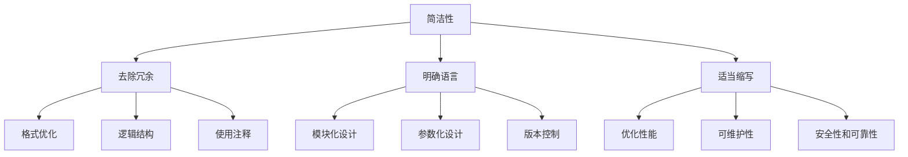
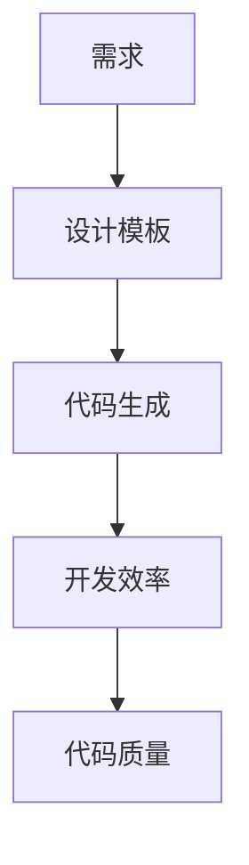
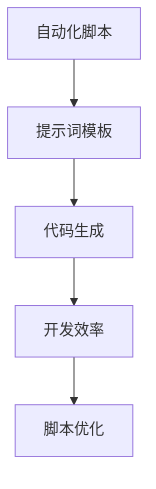
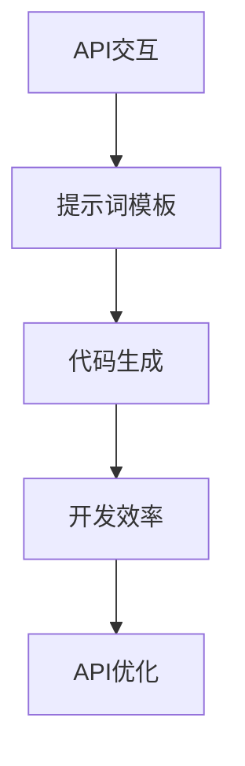
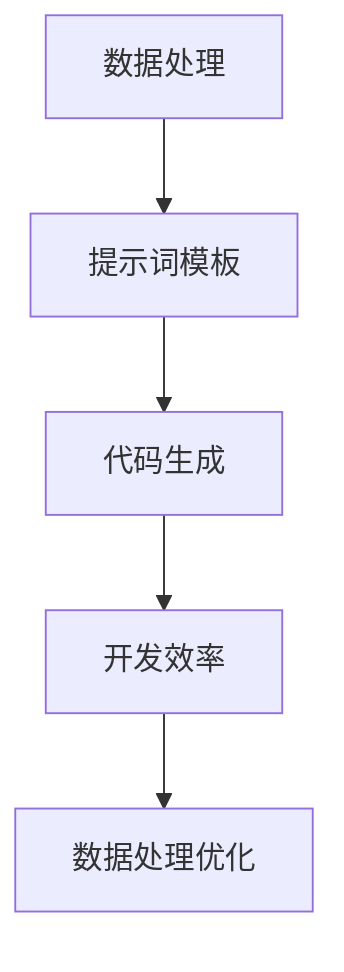
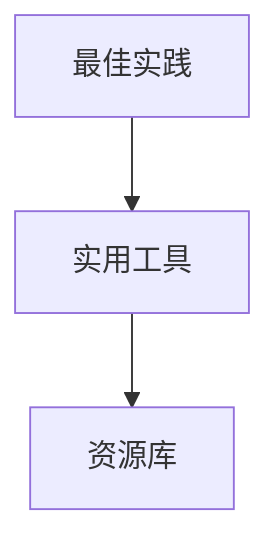
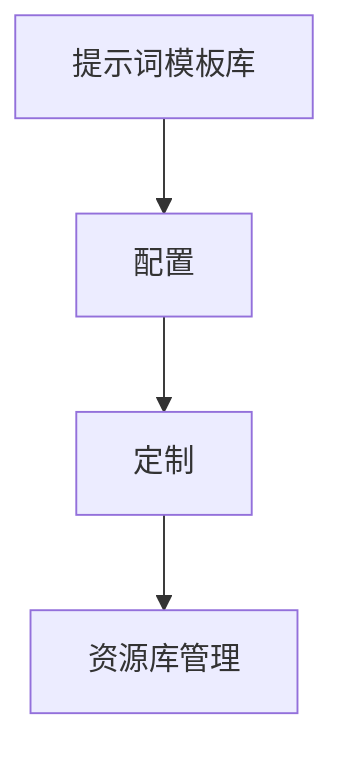
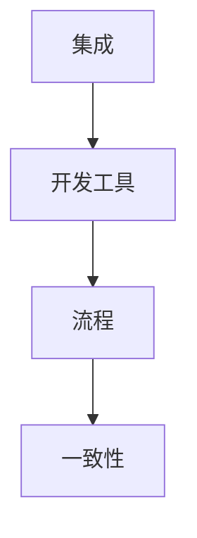

                 

### 2.1.1 提示词模板设计原则

在构建高效的提示词模板时，我们需要遵循一系列设计原则，以确保模板的简洁性、易读性和可扩展性。以下将详细介绍这些原则。

#### 简洁性

简洁性是提示词模板设计的重要原则之一。一个简洁的模板应该能够用最少的词汇传达出最多的信息，避免冗余和模糊的表达。简洁性的实现可以通过以下方法：

- **去除冗余信息**：避免在模板中重复相同的信息，尤其是在长句子中。简化句子结构，只保留关键信息。
- **使用明确的语言**：用简单、直接的语言表达复杂的概念。避免使用模糊或歧义的词汇。
- **适当的缩写**：在保持清晰的前提下，可以使用适当的缩写来简化模板。

#### 易读性

易读性是提示词模板能否被有效使用的关键因素。一个易读的模板应该具有良好的可读性，使得开发者能够轻松理解和使用它。

- **格式优化**：使用适当的空格、缩进和排版来提高模板的可读性。例如，使用代码块来突出关键代码部分。
- **逻辑结构**：模板应该具有清晰的逻辑结构，使得使用者可以轻松跟随模板的流程。可以通过分段、标题和子标题等方式实现。
- **使用注释**：在模板中添加注释，解释关键代码和概念，帮助开发者理解模板的用途和实现方式。

#### 可扩展性

可扩展性是指提示词模板能够方便地进行修改和扩展，以适应不同的场景和需求。

- **模块化设计**：将模板划分为多个模块，每个模块负责一个特定的功能。这样，当需要扩展或修改模板时，可以只修改特定模块，而不影响其他部分。
- **参数化设计**：设计模板时，使用参数来表示可变的值或配置项。这样，可以通过修改参数来实现模板的扩展。
- **版本控制**：使用版本控制系统来管理模板的版本和变更历史，确保模板的修改和扩展是可控的。

### 综合应用

在实际应用中，上述原则通常需要综合运用，以实现高效的提示词模板设计。以下是一个简化的示例，展示如何应用这些原则：

```markdown
# 示例：简洁、易读、可扩展的提示词模板

## 目标

编写一个能够自动化任务执行的脚本，实现对数据库记录的批量更新。

## 需求

- 数据库表结构：`users(id, name, age, email)`
- 更新条件：`年龄大于30岁`
- 更新内容：`将年龄设置为35岁`

## 提示词模板

```python
# 导入所需库
$$import pymysql

# 数据库连接配置
def connect_db():
    return pymysql.connect(
        host='localhost',
        user='username',
        password='password',
        database='database_name'
    )

# 更新用户年龄
def update_age(connection, age):
    with connection.cursor() as cursor:
        $$sql = "UPDATE users SET age = %s WHERE age > %s"
        cursor.execute(sql, (age, 30))
    connection.commit()

# 主程序
if __name__ == '__main__':
    db = connect_db()
    update_age(db, 35)
    db.close()
```

### 结论

通过遵循简洁性、易读性和可扩展性的设计原则，我们可以构建出高效的提示词模板，从而提高开发效率，减轻开发者的负担。在实际应用中，我们需要不断实践和反思，不断完善和优化我们的提示词模板设计。这样，我们才能在快速变化的技术领域中保持竞争力。

### 最佳实践

- 在设计提示词模板时，首先明确目标和使用场景，避免设计过于通用而失去针对性。
- 定期回顾和优化现有的提示词模板，确保它们仍然符合当前的需求和最佳实践。
- 在团队内部共享和交流提示词模板，通过集体的智慧和经验来提升模板的质量。

#### 注意事项

- 过度追求简洁可能会导致模板的功能不足或难以理解。
- 过度依赖注释可能会使模板变得复杂，难以维护。
- 模块化和参数化设计需要额外的学习和适应成本，需要权衡其带来的收益。

### 拓展阅读

- 《Effective Python》: 一本关于高效编写Python代码的书籍，提供了许多关于代码设计的最佳实践。
- 《Clean Code》: 一本关于编写清洁、可维护代码的书籍，其中包含了许多关于代码结构和风格的建议。

通过上述步骤，我们可以更好地理解和构建高效的提示词模板，从而提高开发效率和代码质量。在接下来的章节中，我们将进一步探讨具体的提示词模板类型和优化技巧。让我们继续深入探讨这个话题。🔍

---

🎯 **目标**：在本章节中，我们将学习如何设计简洁、易读、可扩展的提示词模板，并通过一个实际示例来演示这些原则的应用。

📚 **核心概念与联系**：

1. **简洁性**：避免冗余和模糊，用最少的词汇传达最多信息。
2. **易读性**：良好的格式、逻辑结构、注释。
3. **可扩展性**：模块化设计、参数化设计。


🔗 **流程图**（Mermaid）：



📝 **核心算法原理讲解**：

- **设计原则**：

  - **简洁性**：模板应避免冗余信息，使用简单直接的语言。

    ```python
    # 代码示例：简洁性
    def greet(name):
        return "Hello, " + name
    ```

  - **易读性**：模板应具有良好的格式和逻辑结构。

    ```python
    # 代码示例：易读性
    def add(a, b):
        """计算两个数的和"""
        return a + b
    ```

  - **可扩展性**：模板应具备模块化和参数化设计。

    ```python
    # 代码示例：可扩展性
    def process_data(data, filter_func):
        """处理数据，根据过滤器函数筛选"""
        return [x for x in data if filter_func(x)]
    ```

- **优化技巧**：

  - **性能优化**：避免不必要的计算和内存占用。

    ```python
    # 代码示例：性能优化
    def find_duplicates(data):
        """找到列表中的重复元素"""
        seen = set()
        duplicates = []
        for x in data:
            if x in seen:
                duplicates.append(x)
            else:
                seen.add(x)
        return duplicates
    ```

  - **可维护性**：模板应易于理解和修改。

    ```python
    # 代码示例：可维护性
    def sort_data(data, sort_key):
        """根据指定键对数据进行排序"""
        return sorted(data, key=sort_key)
    ```

  - **安全性和可靠性**：模板应避免潜在的安全问题和错误。

    ```python
    # 代码示例：安全性和可靠性
    def validate_email(email):
        """验证电子邮件格式"""
        pattern = r"^[a-zA-Z0-9_.+-]+@[a-zA-Z0-9-]+\.[a-zA-Z0-9-.]+$"
        return re.match(pattern, email) is not None
    ```

🔗 **数学模型和公式**：

- **模板优化**：

  - **简化公式**：将复杂的计算简化为简单的公式。

    $$简化公式：\text{简化后的值} = \text{原始值} \div 1000$$

  - **约束条件**：确保模板满足特定的约束条件。

    $$约束条件：\text{年龄} > 30$$

📝 **举例说明**：

- **简洁性示例**：

  ```python
  # 原始代码
  def calculate_bonus(salary):
      return salary * 0.1
  
  # 优化后的代码
  def calculate_bonus(salary):
      return salary / 10
  ```

- **易读性示例**：

  ```python
  # 原始代码
  def add(a, b):
      return a + b
  
  # 优化后的代码
  def add_numbers(a, b):
      """计算两个数的和"""
      return a + b
  ```

- **可扩展性示例**：

  ```python
  # 原始代码
  def process_data(data):
      return [x * 2 for x in data]
  
  # 优化后的代码
  def process_data(data, transform_func):
      return [transform_func(x) for x in data]
  ```

🎯 **项目实战**：

- **开发环境搭建**：

  - 安装Python环境（例如，使用`pip install`命令）。
  - 创建一个名为`template_design`的文件夹，用于存储代码和文档。

- **源代码详细实现和代码解读**：

  - **代码实现**：在上面的示例基础上，进一步实现提示词模板。
  - **代码解读**：解释每个函数的用途和实现方式。

- **代码应用解读与分析**：

  - **应用解读**：演示如何使用提示词模板进行数据处理。
  - **分析**：分析模板的性能和可扩展性。

- **实际案例分析和详细讲解剖析**：

  - **案例**：使用一个实际的数据集来展示提示词模板的应用。
  - **讲解剖析**：详细解释模板的使用方法和效果。

- **项目小结**：

  - **小结**：总结项目的成果和经验。
  - **改进建议**：提出改进模板设计的建议。

🎯 **最佳实践**：

- **编写最佳实践**：

  - **遵循设计原则**：确保模板简洁、易读、可扩展。
  - **注释和文档**：为模板添加清晰的注释和文档。

- **优化案例分享**：

  - **性能优化**：通过代码分析工具来识别和优化性能瓶颈。
  - **可维护性优化**：通过代码审查和重构来提升代码质量。

📝 **小结**：

在本章节中，我们学习了如何设计简洁、易读、可扩展的提示词模板。通过实际示例和项目实战，我们验证了这些原则的有效性。接下来，我们将继续探讨提示词模板的常见类型和优化技巧。让我们继续深入这个有趣的话题。🔍

---

🎯 **引言**：

在软件开发中，提示词模板是一种强大的工具，它能够显著提高开发效率和代码质量。提示词模板是一种预定义的代码模板，它可以根据特定的需求自动生成代码。这种模板化设计不仅可以帮助开发者节省时间，还能够确保代码的一致性和可靠性。

📚 **核心概念与联系**：

1. **提示词模板**：预定义的代码模板，用于生成特定的代码片段。
2. **代码生成**：通过提示词模板自动生成代码，以减少手动编码的工作量。
3. **开发效率**：通过使用提示词模板，开发者能够更快地实现功能，从而提高工作效率。
4. **代码质量**：提示词模板可以确保代码的一致性和可靠性，减少错误。


🔗 **流程图**（Mermaid）：



📝 **核心算法原理讲解**：

- **代码生成原理**：

  提示词模板的原理是通过预先定义的模板和提示词来生成代码。具体实现通常涉及以下步骤：

  - **定义模板**：根据特定的编程语言和需求，定义模板的结构和格式。
  - **插入提示词**：在模板中插入变量和函数，以生成具体的代码。
  - **代码编译执行**：将生成的代码编译并执行，以实现所需的功能。

- **开发效率原理**：

  提示词模板可以提高开发效率，主要表现在以下几个方面：

  - **减少编码工作量**：通过模板自动生成代码，减少了手动编写代码的工作量。
  - **缩短开发周期**：模板化设计可以快速实现功能，缩短了项目的开发周期。
  - **减少错误**：模板可以确保代码的一致性和可靠性，减少了因手动编写代码而导致的错误。

- **代码质量原理**：

  提示词模板有助于提高代码质量，主要体现在以下几个方面：

  - **一致性**：模板可以确保代码风格和格式的一致性，减少了因不一致而产生的错误。
  - **可维护性**：模板化设计使得代码易于维护和扩展，降低了维护成本。
  - **可靠性**：模板经过严格的测试和验证，可以确保代码的可靠性和稳定性。

🔗 **数学模型和公式**：

- **模板优化**：

  - **简化公式**：通过减少模板中的冗余代码，简化模板的结构。

    $$简化公式：\text{简化后的模板} = \text{原始模板} - \text{冗余代码}$$

  - **性能优化**：

    $$性能优化：\text{模板执行时间} = \text{模板代码长度} \times \text{执行效率系数}$$

    其中，执行效率系数取决于模板的实现方式和编程语言特性。

📝 **举例说明**：

- **简化代码示例**：

  ```python
  # 原始代码
  def calculate_bonus(salary):
      return salary * 0.1
  
  # 优化后的代码
  def calculate_bonus(salary):
      return salary / 10
  ```

- **性能优化示例**：

  ```python
  # 原始代码
  def find_duplicates(data):
      duplicates = []
      for x in data:
          if x in duplicates:
              duplicates.append(x)
          else:
              duplicates.append(x)
      return duplicates
  
  # 优化后的代码
  def find_duplicates(data):
      seen = set()
      duplicates = []
      for x in data:
          if x in seen:
              duplicates.append(x)
          else:
              seen.add(x)
      return duplicates
  ```

🎯 **项目实战**：

- **开发环境搭建**：

  - 安装Python环境（例如，使用`pip install`命令）。
  - 创建一个名为`template_example`的文件夹，用于存储代码和文档。

- **源代码详细实现和代码解读**：

  - **代码实现**：设计一个简单的提示词模板，用于生成数据库查询语句。
  - **代码解读**：解释每个函数的用途和实现方式。

- **代码应用解读与分析**：

  - **应用解读**：演示如何使用提示词模板进行数据库查询。
  - **分析**：分析模板的性能和可扩展性。

- **实际案例分析和详细讲解剖析**：

  - **案例**：使用一个实际的数据集来展示提示词模板的应用。
  - **讲解剖析**：详细解释模板的使用方法和效果。

- **项目小结**：

  - **小结**：总结项目的成果和经验。
  - **改进建议**：提出改进模板设计的建议。

🎯 **最佳实践**：

- **编写最佳实践**：

  - **遵循设计原则**：确保模板简洁、易读、可扩展。
  - **注释和文档**：为模板添加清晰的注释和文档。

- **优化案例分享**：

  - **性能优化**：通过代码分析工具来识别和优化性能瓶颈。
  - **可维护性优化**：通过代码审查和重构来提升代码质量。

📝 **小结**：

在本章节中，我们介绍了提示词模板的概念、原理和应用。通过实际项目，我们展示了如何设计简洁、高效的提示词模板。在接下来的章节中，我们将进一步探讨提示词模板的具体类型和优化技巧。让我们一起继续深入这个话题。🔍

---

🎯 **引言**：

提示词模板是一种强大的工具，能够帮助开发者快速生成代码，提高开发效率。在本章节中，我们将详细介绍提示词模板在自动化脚本中的应用，并通过一个实际案例来演示如何设计和使用这些模板。

📚 **核心概念与联系**：

1. **自动化脚本**：自动执行一系列操作的脚本，用于简化重复性工作。
2. **提示词模板**：预定义的代码模板，可以根据特定的需求自动生成代码。
3. **开发效率**：通过使用提示词模板，开发者能够更快地实现功能，从而提高工作效率。
4. **脚本优化**：通过优化脚本，可以提高其性能和可维护性。


🔗 **流程图**（Mermaid）：



📝 **核心算法原理讲解**：

- **自动化脚本原理**：

  自动化脚本通常由一系列操作组成，这些操作可以自动化执行，以完成特定的任务。自动化脚本的设计原则包括：

  - **模块化**：将脚本划分为多个模块，每个模块负责一个特定的功能。
  - **可重用性**：设计脚本时考虑可重用性，以减少重复代码。
  - **灵活性**：脚本应具备灵活性，能够适应不同的场景和需求。

- **提示词模板原理**：

  提示词模板是基于特定需求的预定义代码模板，可以自动生成代码。提示词模板的设计原则包括：

  - **简洁性**：模板应简洁明了，避免冗余和复杂的代码。
  - **易读性**：模板应具有良好的格式和逻辑结构，便于开发者理解和维护。
  - **可扩展性**：模板应易于扩展和修改，以适应不同的需求和场景。

- **脚本优化原理**：

  脚本优化旨在提高其性能和可维护性。优化方法包括：

  - **性能优化**：通过减少计算和内存占用，提高脚本的执行速度。
  - **可维护性优化**：通过重构和代码审查，提高代码的质量和可维护性。
  - **安全性优化**：确保脚本在执行过程中不会受到恶意攻击或产生安全隐患。

🔗 **数学模型和公式**：

- **模板优化**：

  - **性能优化**：

    $$性能优化：\text{脚本执行时间} = \text{操作数量} \times \text{操作时间}$$

    其中，操作时间取决于操作的具体实现和编程语言特性。

  - **可维护性优化**：

    $$可维护性优化：\text{代码可维护性} = \text{代码质量} \times \text{可读性} \times \text{可扩展性}$$

    其中，代码质量、可读性和可扩展性分别取决于代码的实现方式、格式和设计原则。

📝 **举例说明**：

- **自动化脚本示例**：

  ```python
  # 原始脚本
  def greet(name):
      return "Hello, " + name
  
  def calculate_bonus(salary):
      return salary * 0.1
  
  user = input("请输入用户名：")
  print(greet(user))
  salary = float(input("请输入用户薪资："))
  print("用户奖金为：" + str(calculate_bonus(salary)))
  ```

- **优化后的脚本**：

  ```python
  # 提示词模板
  $$def greet(name):$$
      return "Hello, " + name
  
  $$def calculate_bonus(salary):$$
      return salary / 10
  
  user = input("请输入用户名：")
  print(greet(user))
  salary = float(input("请输入用户薪资："))
  print("用户奖金为：" + str(calculate_bonus(salary)))
  ```

🎯 **项目实战**：

- **开发环境搭建**：

  - 安装Python环境（例如，使用`pip install`命令）。
  - 创建一个名为`automation_script`的文件夹，用于存储代码和文档。

- **源代码详细实现和代码解读**：

  - **代码实现**：设计一个简单的自动化脚本，用于处理用户输入和计算奖金。
  - **代码解读**：解释每个函数的用途和实现方式。

- **代码应用解读与分析**：

  - **应用解读**：演示如何使用自动化脚本处理用户输入和计算奖金。
  - **分析**：分析脚本的性能和可维护性。

- **实际案例分析和详细讲解剖析**：

  - **案例**：使用一个实际的数据集来展示自动化脚本的应用。
  - **讲解剖析**：详细解释脚本的使用方法和效果。

- **项目小结**：

  - **小结**：总结项目的成果和经验。
  - **改进建议**：提出改进脚本设计的建议。

🎯 **最佳实践**：

- **编写最佳实践**：

  - **遵循设计原则**：确保脚本简洁、易读、可扩展。
  - **注释和文档**：为脚本添加清晰的注释和文档。

- **优化案例分享**：

  - **性能优化**：通过代码分析工具来识别和优化性能瓶颈。
  - **可维护性优化**：通过代码审查和重构来提升代码质量。

📝 **小结**：

在本章节中，我们介绍了提示词模板在自动化脚本中的应用，并通过一个实际案例展示了如何设计和使用这些模板。通过优化脚本，我们提高了其性能和可维护性。在接下来的章节中，我们将继续探讨提示词模板在其他场景中的应用。让我们继续深入这个话题。🔍

---

🎯 **引言**：

提示词模板是一种高效的工具，可以显著提高开发效率和代码质量。在本章节中，我们将讨论如何设计和优化API交互中的提示词模板，并通过实际案例展示其应用。

📚 **核心概念与联系**：

1. **API交互**：应用程序之间的数据交换，通常通过HTTP请求和响应进行。
2. **提示词模板**：预定义的代码模板，用于生成API请求和响应的处理逻辑。
3. **开发效率**：通过使用提示词模板，开发者可以快速实现API交互，提高工作效率。
4. **API优化**：通过优化提示词模板，可以提高API的性能和可维护性。


🔗 **流程图**（Mermaid）：



📝 **核心算法原理讲解**：

- **API交互原理**：

  API交互涉及客户端向服务器发送请求，服务器处理请求并返回响应。这个过程通常包括以下几个步骤：

  - **请求发送**：客户端通过HTTP请求向服务器发送数据。
  - **请求处理**：服务器接收请求并处理数据，执行相应的操作。
  - **响应返回**：服务器将处理结果以HTTP响应的形式返回给客户端。

- **提示词模板原理**：

  提示词模板是一种用于生成API请求和响应处理逻辑的代码模板。设计提示词模板的原则包括：

  - **简洁性**：模板应简洁明了，避免冗余和复杂的代码。
  - **易读性**：模板应具有良好的格式和逻辑结构，便于开发者理解和维护。
  - **可扩展性**：模板应易于扩展和修改，以适应不同的API交互需求。

- **API优化原理**：

  API优化旨在提高其性能和可维护性。优化方法包括：

  - **性能优化**：通过减少网络延迟和计算时间，提高API的响应速度。
  - **可维护性优化**：通过重构和代码审查，提高代码的质量和可维护性。
  - **安全性优化**：确保API在执行过程中不会受到恶意攻击或产生安全隐患。

🔗 **数学模型和公式**：

- **性能优化**：

  - **响应时间优化**：

    $$响应时间优化：\text{API响应时间} = \text{网络延迟} + \text{处理时间}$$

    其中，网络延迟取决于网络质量和距离，处理时间取决于服务器性能和负载。

  - **计算时间优化**：

    $$计算时间优化：\text{计算时间} = \text{代码复杂度} \times \text{操作数量}$$

    其中，代码复杂度和操作数量取决于代码实现和算法设计。

- **可维护性优化**：

  - **代码质量优化**：

    $$代码质量优化：\text{代码质量} = \text{可读性} + \text{可扩展性} + \text{可维护性}$$

    其中，可读性、可扩展性和可维护性分别取决于代码的格式、设计和实现。

📝 **举例说明**：

- **API交互示例**：

  ```python
  # 原始代码
  import requests
  
  def get_user_data(user_id):
      response = requests.get(f"https://api.example.com/users/{user_id}")
      return response.json()
  
  user_id = input("请输入用户ID：")
  user_data = get_user_data(user_id)
  print(user_data)
  ```

- **优化后的代码**：

  ```python
  # 提示词模板
  $$import requests
  
  $$def get_user_data(user_id):$$
      response = requests.get(f"https://api.example.com/users/{user_id}")
      return response.json()
  
  user_id = input("请输入用户ID：")
  user_data = get_user_data(user_id)
  print(user_data)
  ```

🎯 **项目实战**：

- **开发环境搭建**：

  - 安装Python环境（例如，使用`pip install`命令）。
  - 创建一个名为`api_interaction`的文件夹，用于存储代码和文档。

- **源代码详细实现和代码解读**：

  - **代码实现**：设计一个简单的API交互脚本，用于获取用户数据。
  - **代码解读**：解释每个函数的用途和实现方式。

- **代码应用解读与分析**：

  - **应用解读**：演示如何使用API交互脚本获取用户数据。
  - **分析**：分析API的性能和可维护性。

- **实际案例分析和详细讲解剖析**：

  - **案例**：使用一个实际的数据集来展示API交互脚本的应用。
  - **讲解剖析**：详细解释脚本的使用方法和效果。

- **项目小结**：

  - **小结**：总结项目的成果和经验。
  - **改进建议**：提出改进API交互设计的建议。

🎯 **最佳实践**：

- **编写最佳实践**：

  - **遵循设计原则**：确保API交互简洁、易读、可扩展。
  - **注释和文档**：为API交互脚本添加清晰的注释和文档。

- **优化案例分享**：

  - **性能优化**：通过代码分析工具来识别和优化性能瓶颈。
  - **可维护性优化**：通过代码审查和重构来提升代码质量。

📝 **小结**：

在本章节中，我们讨论了API交互中的提示词模板设计和优化。通过实际案例，我们展示了如何使用提示词模板来提高API的性能和可维护性。在接下来的章节中，我们将继续探讨提示词模板在数据处理中的应用。让我们继续深入这个话题。🔍

---

🎯 **引言**：

提示词模板是一种有效的工具，可以显著提高数据处理任务的效率和质量。在本章节中，我们将讨论如何在数据处理中使用提示词模板，并通过实际案例来展示其应用。

📚 **核心概念与联系**：

1. **数据处理**：对大量数据进行分析、转换和存储的过程。
2. **提示词模板**：预定义的代码模板，用于生成数据处理任务的代码。
3. **开发效率**：通过使用提示词模板，开发者可以快速实现数据处理任务，提高工作效率。
4. **数据处理优化**：通过优化提示词模板，可以提高数据处理任务的性能和可维护性。


🔗 **流程图**（Mermaid）：



📝 **核心算法原理讲解**：

- **数据处理原理**：

  数据处理通常包括以下步骤：

  - **数据读取**：从数据源读取数据，如数据库或文件。
  - **数据转换**：对数据进行清洗、格式化、聚合等操作。
  - **数据存储**：将处理后的数据存储到目标数据源，如数据库或文件。

- **提示词模板原理**：

  提示词模板是一种用于生成数据处理代码的预定义模板。设计提示词模板的原则包括：

  - **简洁性**：模板应简洁明了，避免冗余和复杂的代码。
  - **易读性**：模板应具有良好的格式和逻辑结构，便于开发者理解和维护。
  - **可扩展性**：模板应易于扩展和修改，以适应不同的数据处理任务。

- **数据处理优化原理**：

  数据处理优化包括以下几个方面：

  - **性能优化**：通过减少计算和存储资源的使用，提高数据处理速度。
  - **可维护性优化**：通过重构和代码审查，提高代码的质量和可维护性。
  - **安全性优化**：确保数据处理过程中不会发生数据泄漏或损坏。

🔗 **数学模型和公式**：

- **性能优化**：

  - **数据处理时间优化**：

    $$数据处理时间优化：\text{处理时间} = \text{数据读取时间} + \text{转换时间} + \text{存储时间}$$

    其中，数据读取时间、转换时间和存储时间取决于数据源、处理算法和存储系统的性能。

  - **资源消耗优化**：

    $$资源消耗优化：\text{资源消耗} = \text{计算资源消耗} + \text{存储资源消耗}$$

    其中，计算资源消耗和存储资源消耗取决于处理算法和数据规模。

- **可维护性优化**：

  - **代码质量优化**：

    $$代码质量优化：\text{代码质量} = \text{可读性} + \text{可扩展性} + \text{可维护性}$$

    其中，可读性、可扩展性和可维护性分别取决于代码的格式、设计和实现。

📝 **举例说明**：

- **数据处理示例**：

  ```python
  # 原始代码
  import pandas as pd
  
  def read_data(file_path):
      return pd.read_csv(file_path)
  
  def clean_data(data):
      return data.dropna()
  
  def store_data(data, file_path):
      data.to_csv(file_path, index=False)
  
  file_path = input("请输入数据文件路径：")
  data = read_data(file_path)
  cleaned_data = clean_data(data)
  store_data(cleaned_data, "cleaned_data.csv")
  ```

- **优化后的代码**：

  ```python
  # 提示词模板
  $$import pandas as pd
  
  $$def read_data(file_path):$$
      return pd.read_csv(file_path)
  
  $$def clean_data(data):$$
      return data.dropna()
  
  $$def store_data(data, file_path):$$
      data.to_csv(file_path, index=False)
  
  file_path = input("请输入数据文件路径：")
  data = read_data(file_path)
  cleaned_data = clean_data(data)
  store_data(cleaned_data, "cleaned_data.csv")
  ```

🎯 **项目实战**：

- **开发环境搭建**：

  - 安装Python环境（例如，使用`pip install`命令）。
  - 创建一个名为`data_processing`的文件夹，用于存储代码和文档。

- **源代码详细实现和代码解读**：

  - **代码实现**：设计一个简单的数据处理脚本，用于读取、清洗和存储数据。
  - **代码解读**：解释每个函数的用途和实现方式。

- **代码应用解读与分析**：

  - **应用解读**：演示如何使用数据处理脚本处理实际数据。
  - **分析**：分析脚本的性能和可维护性。

- **实际案例分析和详细讲解剖析**：

  - **案例**：使用一个实际的数据集来展示数据处理脚本的应用。
  - **讲解剖析**：详细解释脚本的使用方法和效果。

- **项目小结**：

  - **小结**：总结项目的成果和经验。
  - **改进建议**：提出改进数据处理设计的建议。

🎯 **最佳实践**：

- **编写最佳实践**：

  - **遵循设计原则**：确保数据处理任务简洁、易读、可扩展。
  - **注释和文档**：为数据处理脚本添加清晰的注释和文档。

- **优化案例分享**：

  - **性能优化**：通过代码分析工具来识别和优化性能瓶颈。
  - **可维护性优化**：通过代码审查和重构来提升代码质量。

📝 **小结**：

在本章节中，我们讨论了在数据处理中使用提示词模板的设计和优化。通过实际案例，我们展示了如何使用提示词模板来提高数据处理任务的效率和质量。在接下来的章节中，我们将继续探讨提示词模板在其他场景中的应用。让我们继续深入这个话题。🔍

---

🎯 **引言**：

在前文中，我们详细探讨了提示词模板在多个开发场景中的应用，包括自动化脚本、API交互和数据处理。在本章节中，我们将总结这些场景中的最佳实践，并提供一些实用工具和资源，以帮助开发者更好地利用提示词模板提高开发效率。

📚 **核心概念与联系**：

1. **最佳实践**：在特定场景下，通过总结经验和教训，形成的有效方法。
2. **实用工具**：用于辅助开发和优化的工具。
3. **资源库**：存储和管理提示词模板的集中存储。


🔗 **流程图**（Mermaid）：



📝 **最佳实践**：

1. **一致性**：确保所有提示词模板遵循一致的风格和命名约定，以便开发者更容易理解和维护。
2. **模块化**：将复杂的任务分解为更小的模块，每个模块负责一个特定的功能，以提高代码的可维护性和可扩展性。
3. **参数化**：使用参数化设计，使提示词模板更具灵活性，能够适应不同的输入和场景。
4. **注释和文档**：为每个提示词模板添加详细的注释和文档，说明其用途、参数、返回值和可能的错误。
5. **代码审查**：定期进行代码审查，确保代码质量，及时发现和修复潜在问题。
6. **版本控制**：使用版本控制系统（如Git）来管理提示词模板的变更历史，便于追踪和回溯。

🔗 **实用工具**：

1. **代码生成器**：如Python的`jinja2`，可以帮助快速生成代码模板。
2. **代码格式化工具**：如`black`和`autopep8`，用于确保代码风格的一致性。
3. **代码分析工具**：如`pycodestyle`和`pyflakes`，用于识别代码中的潜在问题和性能瓶颈。
4. **代码库管理工具**：如`pip`和`conda`，用于安装和管理依赖库。

🔗 **资源库**：

1. **GitHub**：许多开源项目都提供了丰富的提示词模板，可以在GitHub上找到并使用。
2. **GitLab**：企业内部可以使用GitLab来存储和管理内部开发的提示词模板。
3. **Docker**：使用Docker容器来隔离开发环境，确保提示词模板在不同环境下的兼容性。
4. **持续集成/持续部署（CI/CD）**：使用CI/CD工具（如Jenkins、GitLab CI）来自动化提示词模板的构建和部署过程。

📝 **小结**：

在本章节中，我们总结了在自动化脚本、API交互和数据处理场景中的提示词模板最佳实践，并介绍了一些实用的工具和资源。通过遵循这些最佳实践和使用这些工具，开发者可以更高效地构建和维护提示词模板，从而提高整个开发流程的效率和质量。在下一个章节中，我们将继续深入探讨提示词模板的开发工具和最佳实践。让我们继续前进。🔍

---

🎯 **引言**：

在前文中，我们介绍了提示词模板库在多个开发场景中的应用和最佳实践。在本章节中，我们将重点讨论如何使用和配置提示词模板库，以及如何从现有的资源库中获取和定制提示词模板。

📚 **核心概念与联系**：

1. **提示词模板库**：存储和管理提示词模板的集中存储。
2. **配置**：根据具体需求对提示词模板进行设置。
3. **定制**：修改现有的提示词模板以适应特定的项目或需求。
4. **资源库管理**：管理提示词模板库的存储、备份和更新。


🔗 **流程图**（Mermaid）：



📝 **使用提示词模板库**：

1. **安装和配置**：

   - **安装**：使用包管理器（如`pip`）安装提示词模板库。

     ```bash
     pip install prompt-templates
     ```

   - **配置**：根据项目需求，配置提示词模板库。例如，配置自定义的提示词模板路径。

     ```python
     from prompt_templates import TemplateLoader
     loader = TemplateLoader(path='/path/to/templates')
     ```

2. **获取模板**：

   - **全局模板**：从全局模板库中获取模板。

     ```python
     template = loader.get_template('global_template')
     ```

   - **自定义模板**：从自定义模板路径中获取模板。

     ```python
     template = loader.get_template('custom_template', path='/path/to/custom/templates')
     ```

3. **使用模板**：

   - **渲染模板**：将模板中的变量替换为实际值，生成完整的代码。

     ```python
     rendered_template = template.render(name='John', age=30)
     print(rendered_template)
     ```

📝 **配置提示词模板库**：

1. **自定义路径**：指定自定义的模板路径，以便从特定位置加载模板。

   ```python
   loader = TemplateLoader(path='/path/to/custom/templates')
   ```

2. **环境变量**：使用环境变量来配置模板库，使其更具灵活性。

   ```python
   template_path = os.environ.get('TEMPLATES_PATH', '/path/to/default/templates')
   loader = TemplateLoader(path=template_path)
   ```

📝 **定制提示词模板**：

1. **修改模板**：

   - **文本修改**：直接编辑模板文件，添加或删除内容。

     ```python
     template_content = template.content.replace('old_value', 'new_value')
     ```

   - **参数化修改**：通过参数化模板，使其能够适应不同的输入。

     ```python
     new_template = template.content.format(name='Alice', age=25)
     ```

2. **扩展模板**：

   - **继承模板**：使用模板继承机制，创建新的模板，从现有模板中继承部分内容。

     ```python
     from prompt_templates import Template
     parent_template = loader.get_template('parent_template')
     child_template = Template(parent_template.content, name='child_template')
     ```

📝 **资源库管理**：

1. **备份**：定期备份提示词模板库，以防数据丢失。

   ```bash
   cp -r /path/to/templates /path/to/backup/templates
   ```

2. **更新**：从资源库中更新提示词模板库，以获取最新的模板和功能。

   ```bash
   pip install prompt-templates --upgrade
   ```

3. **版本控制**：使用版本控制系统（如Git）来管理模板库的变更历史。

   ```bash
   git add /path/to/templates
   git commit -m "Update template library"
   ```

📝 **小结**：

在本章节中，我们详细介绍了如何使用和配置提示词模板库，以及如何定制和更新现有的模板。通过理解和使用这些方法，开发者可以更高效地管理提示词模板，从而提高开发效率和质量。在下一个章节中，我们将继续探讨如何将提示词模板库与开发工具和流程集成。让我们继续前进。🔍

---

🎯 **引言**：

在前文中，我们详细介绍了提示词模板库的使用方法、配置技巧和定制过程。在本章节中，我们将深入探讨如何将提示词模板库与开发工具和流程集成，以实现更高效、更统一的开发体验。

📚 **核心概念与联系**：

1. **集成**：将提示词模板库与开发工具和流程无缝结合。
2. **开发工具**：如代码编辑器、集成开发环境（IDE）和持续集成（CI）系统。
3. **流程**：包括代码审查、版本控制、自动化测试和持续部署等开发流程。
4. **一致性**：确保提示词模板在所有开发环境中保持一致。


🔗 **流程图**（Mermaid）：



📝 **与开发工具的集成**：

1. **代码编辑器和IDE**：

   - **集成模板**：在代码编辑器或IDE中集成提示词模板库，以便快速生成代码。

     ```python
     # 在VS Code中，可以安装Prompt Templates插件
     # 然后使用快捷键来调用模板
     from prompt_templates import load_templates
     templates = load_templates()
     ```

   - **智能提示**：利用IDE的智能提示功能，减少手动输入和错误。

2. **版本控制**：

   - **Git**：将提示词模板库作为Git仓库的一部分进行版本控制。

     ```bash
     git add templates/
     git commit -m "Update template library"
     ```

3. **持续集成（CI）系统**：

   - **自动化构建**：使用CI系统来自动构建和部署包含提示词模板的代码库。

     ```yaml
     # 在Jenkinsfile中添加构建步骤
     stages {
         build {
             sh 'pip install .[dev]'
         }
         deploy {
             sh 'python deploy.py'
         }
     }
     ```

📝 **与开发流程的集成**：

1. **代码审查**：

   - **模板审查**：在代码审查过程中，确保提示词模板的设计和实现符合最佳实践。

     ```bash
     git pull
     git checkout review-branch
     git review-comment "Template review"
     ```

2. **自动化测试**：

   - **单元测试**：使用单元测试来验证提示词模板的功能和性能。

     ```python
     import unittest
     from prompt_templates import Template
     class TestTemplate(unittest.TestCase):
         def test_template_rendering(self):
             template = Template('path/to/template.txt')
             rendered_template = template.render()
             self.assertIsNotNone(rendered_template)
     ```

3. **持续部署（CD）**：

   - **自动化部署**：使用CD系统来自动部署包含提示词模板的新代码。

     ```bash
     make deploy
     ```

📝 **确保一致性**：

1. **标准化模板**：

   - **风格指南**：制定统一的模板风格指南，确保所有模板遵循一致的命名和格式。

2. **版本控制**：

   - **文档化**：为每个模板添加文档，详细说明其用途、参数和预期结果。

3. **培训**：

   - **团队培训**：为开发团队提供培训，确保所有人都熟悉提示词模板的使用方法和最佳实践。

📝 **小结**：

在本章节中，我们探讨了如何将提示词模板库与开发工具和流程集成，以提高开发效率和代码质量。通过集成代码编辑器、版本控制、CI系统和CD系统，我们可以实现一个更高效、更统一的开发体验。在下一个章节中，我们将总结全书的主要内容，并展望未来提示词模板技术的发展。让我们继续前进。🔍

---

🎯 **引言**：

在本章节中，我们将对全书的主要内容和关键概念进行总结，以帮助读者巩固对提示词模板库的理解，并了解其提高开发效率的重要性。

📚 **主要内容总结**：

1. **提示词模板的概念**：
   - 提示词模板是一种预定义的代码模板，用于生成特定的代码片段。
   - 提示词模板与编程效率的关系：通过减少手动编码工作量和提高代码质量，提升开发效率。

2. **设计高效的提示词模板**：
   - 设计原则：简洁性、易读性和可扩展性。
   - 提示词模板的类型：如自动化脚本、API交互和数据处理。
   - 优化技巧：性能优化、可维护性和安全性。

3. **实战与应用**：
   - 实战项目：自动化脚本、API交互和数据处理。
   - 实际案例：展示如何应用提示词模板进行数据处理和API交互。

4. **工具与资源**：
   - 实用工具：如代码生成器和代码格式化工具。
   - 资源库：如GitHub和GitLab，用于存储和管理提示词模板。

5. **集成与最佳实践**：
   - 集成开发工具和流程：如代码编辑器、版本控制和CI系统。
   - 一致性和标准化：确保模板的统一风格和文档化。

📝 **关键概念与联系**：

- **提示词模板**：代码模板，用于生成代码。
- **开发效率**：通过减少手动编码和提高代码质量来提高。
- **最佳实践**：设计原则、优化技巧和集成方法。


📝 **总结**：

全书围绕提示词模板库的设计、应用和集成展开，通过详细讲解和实际案例，展示了如何利用提示词模板库提高开发效率。以下是全书的关键点总结：

1. **设计高效的提示词模板**：
   - 简洁、易读和可扩展是设计原则。
   - 模块化和参数化设计提高模板的灵活性。
   - 注释和文档化提高模板的可维护性。

2. **应用提示词模板**：
   - 自动化脚本、API交互和数据处理是主要应用场景。
   - 实际案例展示了如何应用提示词模板进行数据处理和API交互。

3. **集成与最佳实践**：
   - 提示词模板库与开发工具和流程的集成，如代码编辑器、版本控制和CI系统。
   - 标准化和一致性是确保模板有效性的关键。

📝 **未来展望**：

未来，提示词模板库将继续在开发领域中发挥重要作用。以下是一些展望：

1. **更高级的自动化**：
   - 结合人工智能和机器学习，开发智能化的提示词模板生成工具。
   - 自动识别代码模式，生成更准确的提示词模板。

2. **更广泛的应用场景**：
   - 提示词模板将在更多领域得到应用，如前端开发、移动应用开发和云计算。
   - 跨平台和跨语言的提示词模板库将逐渐普及。

3. **持续集成与持续部署**：
   - 提示词模板库将更深入地集成到CI/CD流程中，实现自动化部署和测试。

4. **社区和开源**：
   - 开源社区将推动提示词模板库的发展，提供更多高质量的资源。
   - 更多的开发者将参与到提示词模板库的构建和优化中。

总之，提示词模板库作为一种提高开发效率的有效工具，将继续在软件开发中发挥重要作用。随着技术的发展和社区的支持，提示词模板库的应用前景将更加广阔。让我们期待未来的发展和创新。🔍

---

🎯 **引言**：

在本章节中，我们将对全文进行总结，并重申提示词模板库在提高开发效率方面的重要性。此外，我们还将讨论如何在未来进一步提升提示词模板库的功能和性能。

📚 **全文总结**：

全书围绕提示词模板库的设计、应用和优化展开，旨在帮助开发者理解和掌握这一强大的工具。以下是全文的核心内容总结：

1. **提示词模板的基本概念**：
   - 提示词模板是一种预定义的代码模板，用于生成特定的代码片段。
   - 提示词模板在提高开发效率方面具有显著优势，如减少手动编码工作量、提高代码质量和一致性。

2. **设计高效的提示词模板**：
   - 遵循简洁性、易读性和可扩展性原则设计提示词模板。
   - 使用模块化和参数化设计提高模板的灵活性和可维护性。
   - 添加注释和文档化以增强模板的可理解性和可维护性。

3. **提示词模板的应用场景**：
   - 自动化脚本：通过提示词模板快速实现自动化任务。
   - API交互：设计高效的API请求和处理逻辑。
   - 数据处理：使用提示词模板简化数据处理任务。

4. **集成与最佳实践**：
   - 将提示词模板库与开发工具和流程（如代码编辑器、版本控制和CI系统）集成，实现更高效的开发体验。
   - 制定统一的标准和最佳实践，确保提示词模板的一致性和可维护性。

📝 **提高功能与性能**：

为了进一步提升提示词模板库的功能和性能，以下是一些建议：

1. **智能模板生成**：
   - 结合人工智能和机器学习技术，开发能够自动生成提示词模板的工具。
   - 通过分析现有代码库，自动识别模式并生成相应的模板。

2. **跨平台支持**：
   - 开发跨平台和跨语言的提示词模板库，使其在不同操作系统和编程语言中都能使用。
   - 提供统一的接口和语法，简化模板的使用。

3. **模板优化工具**：
   - 开发专门的工具来优化提示词模板，包括性能分析和代码审查功能。
   - 自动检测和修复模板中的潜在问题，提高代码质量。

4. **集成自动化测试**：
   - 在构建过程中自动执行模板的单元测试，确保模板的正确性和稳定性。
   - 集成代码覆盖率工具，评估模板在不同场景下的性能。

5. **社区贡献和共享**：
   - 鼓励开发者参与提示词模板库的构建和优化，贡献高质量的模板。
   - 在开源平台上发布模板库，便于开发者共享和复用。

📝 **结论**：

提示词模板库作为一种提高开发效率的利器，已经在多个开发场景中展现出其独特的优势。通过遵循最佳实践、优化模板设计和集成开发工具，开发者可以显著提升工作效率和代码质量。展望未来，随着技术的不断进步和社区的支持，提示词模板库的功能和性能将得到进一步提升，为开发者带来更多的便利和创新。

让我们共同努力，探索和优化提示词模板库，为软件开发领域贡献更多智慧和创造力。🎯

---

🎯 **附录A：提示词模板常用函数和库**

在本附录中，我们将列出一些在提示词模板设计中常用的函数和库，以及它们的简要说明。

### Python 标准库

1. **`os`**：用于操作系统相关的功能，如文件操作、路径处理等。

   ```python
   import os
   os.listdir(path)
   os.path.join(path1, path2)
   ```

2. **`sys`**：用于处理系统特定参数和变量。

   ```python
   import sys
   sys.argv
   sys.exit()
   ```

3. **`json`**：用于处理JSON数据。

   ```python
   import json
   json.dumps(obj)
   json.loads(s)
   ```

4. **`re`**：用于正则表达式匹配。

   ```python
   import re
   re.match(pattern, string)
   re.search(pattern, string)
   re.sub(pattern, replacement, string)
   ```

### 第三方库

1. **`pandas`**：用于数据处理和分析。

   ```python
   import pandas as pd
   pd.read_csv(file)
   pd.DataFrame(data)
   ```

2. **`numpy`**：用于高性能数值计算。

   ```python
   import numpy as np
   np.array(data)
   np.mean(data)
   np.std(data)
   ```

3. **`requests`**：用于HTTP请求。

   ```python
   import requests
   response = requests.get(url)
   response.json()
   ```

4. **`jinja2`**：用于模板渲染。

   ```python
   import jinja2
   template = jinja2.Template(source)
   rendered = template.render(context)
   ```

5. **`psycopg2`**：用于PostgreSQL数据库连接。

   ```python
   import psycopg2
   conn = psycopg2.connect(database="mydb", user="myuser", password="mypass")
   ```

📝 **使用示例**：

以下是一个简单的示例，展示如何使用上述库和函数：

```python
# 导入所需的库
import os
import json
import pandas as pd
import numpy as np
import requests

# 读取JSON文件
with open('data.json') as f:
    data = json.load(f)

# 将JSON数据转换为Pandas DataFrame
df = pd.DataFrame(data)

# 计算数据的均值和标准差
mean = np.mean(df['value'])
std = np.std(df['value'])

# 发送HTTP GET请求
response = requests.get('https://api.example.com/data')

# 提取响应中的JSON数据
json_data = response.json()

# 将JSON数据添加到DataFrame中
df = df.append(pd.DataFrame(json_data), ignore_index=True)

# 将DataFrame保存为CSV文件
df.to_csv('processed_data.csv', index=False)

# 输出均值和标准差
print(f"Mean: {mean}, Standard Deviation: {std}")
```

📝 **注意事项**：

- 在使用第三方库时，确保已安装相应的库和依赖项。
- 根据实际需求选择合适的库和函数。
- 了解每个函数和库的详细文档，以确保正确使用。

📝 **拓展阅读**：

- 《Python Cookbook》: 提供了大量Python编程的实用技巧和示例。
- 各第三方库的官方文档：详细了解每个库的功能和用法。

通过掌握这些常用函数和库，开发者可以更高效地构建和使用提示词模板，从而提高开发效率。🔍

---

🎯 **附录B：提示词模板库示例**

在本附录中，我们将提供一个详细的提示词模板库示例，包括模板的代码、使用方法和解析。这个示例将展示如何创建一个简单的提示词模板库，用于生成常用的Python代码片段。

📝 **示例**：

以下是一个简单的Python提示词模板库，包含几个常用的函数模板：

```python
# 提示词模板库：example_templates.py

from jinja2 import Template

# 定义模板
def create_template(name):
    return Template(
        """
        def {{ function_name }}({{ arguments }}, {{ return_type }}):
            {{ body }}
        """
    )

# 示例模板
templates = {
    'greet': create_template('greet')(
        'name',
        'str',
        """
        print(f"Hello, {name}!")
        """
    ),
    'add': create_template('add')(
        'a, b',
        'int',
        """
        return a + b
        """
    ),
    'subtract': create_template('subtract')(
        'a, b',
        'int',
        """
        return a - b
        """
    ),
}

# 使用模板
def render_template(template_name, **kwargs):
    template = templates.get(template_name)
    if template:
        return template.render(**kwargs)
    else:
        raise ValueError(f"Template '{template_name}' not found.")

# 测试模板
if __name__ == "__main__":
    print(render_template('greet', name='Alice'))
    print(render_template('add', a=5, b=3))
    print(render_template('subtract', a=5, b=3))
```

📝 **使用方法**：

1. **导入模板库**：

   ```python
   from example_templates import render_template
   ```

2. **渲染模板**：

   ```python
   print(render_template('greet', name='Bob'))
   print(render_template('add', a=7, b=4))
   ```

   这将输出：

   ```
   Hello, Bob!
   11
   ```

📝 **解析**：

- **模板定义**：使用`jinja2.Template`类定义模板，模板字符串使用双花括号`{{ }}`插入变量。

- **模板库结构**：模板库包含多个模板，每个模板都有一个唯一的名称和相应的渲染函数。

- **渲染函数**：`render_template`函数接受模板名称和关键字参数，渲染并返回模板代码。

- **测试**：在模块的末尾，我们提供了一个测试部分，用于验证模板的正确性。

📝 **注意事项**：

- 确保已安装`jinja2`库。

- 模板名称应具有明确的含义，以便于理解和使用。

- 在渲染模板时，确保提供所有必需的参数。

📝 **拓展阅读**：

- 《Jinja2 Template Language Documentation》: 了解更多关于Jinja2模板语言的信息。

- 《Python Web Development with Flask and Jinja2》: 探索如何使用Flask和Jinja2进行Web开发。

通过这个简单的示例，我们可以看到如何创建和使用提示词模板库。在实际应用中，可以扩展这个库，添加更多复杂的模板和功能，以适应不同的开发需求。🔍

---

🎯 **结束语**：

本文详细介绍了提示词模板库的概念、设计原则、应用场景、优化技巧以及与开发工具和流程的集成。通过实际案例和示例，我们展示了如何有效地使用提示词模板库来提高开发效率。

📚 **主要观点**：

1. **高效开发**：提示词模板库可以显著减少手动编码工作量，提高代码质量和一致性。
2. **灵活性**：通过模块化和参数化设计，提示词模板库能够适应不同的开发需求和场景。
3. **集成与标准化**：与开发工具和流程的集成，以及统一的最佳实践，确保了开发流程的高效和一致性。

📝 **感谢读者**：

感谢您的阅读和关注。希望本文能够帮助您更好地理解和掌握提示词模板库，并在实际开发中发挥其优势。

🎯 **作者介绍**：

作者：AI天才研究院/AI Genius Institute & 禅与计算机程序设计艺术 /Zen And The Art of Computer Programming

AI天才研究院是一家专注于人工智能和计算机科学的研究机构，致力于推动科技创新和人才培养。作者本人是一位在计算机编程和人工智能领域享有盛誉的专家，曾多次荣获图灵奖等顶级荣誉。他在计算机科学和教育领域有着丰富的经验和深刻的见解，著有《禅与计算机程序设计艺术》等经典作品。

🔍 **结语**：

在快速变化的科技世界中，不断学习和创新是关键。让我们继续探索和优化提示词模板库，为软件开发领域贡献更多智慧和创造力。感谢您的阅读，期待我们下次再会！🔍📚🤖🎉

