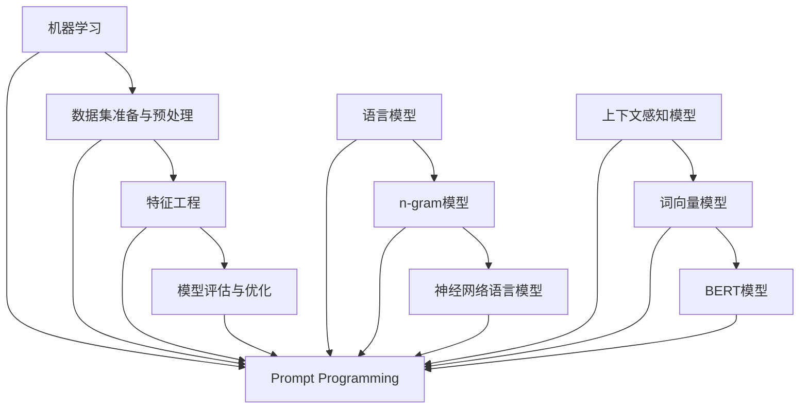

                 


### 撰写文章思路

在撰写《提示词编程中的自然语言处理技术》这篇文章时，我们将采取逻辑清晰、结构紧凑、简单易懂的写作方式，确保文章既有深度又有广度。以下是我们的写作思路：

1. **引言**：首先，我们会介绍自然语言处理技术的背景和提示词编程的概念，为读者提供一个整体的视角。

2. **自然语言处理技术核心概念与联系**：接着，我们将深入探讨自然语言处理技术的核心概念，包括机器学习基础、语言模型、上下文感知模型等，并通过Mermaid流程图展示这些概念之间的关系。

3. **提示词编程中的自然语言处理技术**：在这一部分，我们将详细介绍提示词编程的原理和常见自然语言处理算法，如词向量表示、序列标注等，并使用伪代码来详细阐述算法原理。

4. **项目实战**：我们将选择几个实际案例，详细介绍自然语言处理技术在实际项目中的应用，包括开发环境搭建、源代码实现和代码解读。

5. **高级自然语言处理技术**：我们将探讨语义解析、对话系统、自然语言生成等高级技术，并提供相关的理论和实践案例。

6. **自然语言处理技术的未来趋势**：最后，我们将分析自然语言处理技术的发展趋势，以及人工智能与自然语言处理技术的融合前景。

7. **总结**：在文章的结尾，我们将对全文内容进行总结，并提供一些最佳实践、注意事项和拓展阅读。

### 步骤一：引言

**文章标题**：提示词编程中的自然语言处理技术

**关键词**：自然语言处理、提示词编程、机器学习、语言模型、上下文感知模型

**摘要**：
自然语言处理（NLP）是人工智能领域的关键技术之一，而提示词编程（Prompt Programming）则是近年来兴起的一种新的编程范式，它结合了NLP和机器学习，为开发者提供了强大的工具。本文将深入探讨自然语言处理技术，特别是其在提示词编程中的应用，旨在为读者提供一个全面的技术指南。

### 步骤二：自然语言处理技术核心概念与联系

**2.1 机器学习基础**

在介绍自然语言处理之前，我们首先需要了解机器学习的基础。机器学习是一种通过算法从数据中学习模式并做出预测或决策的技术。其核心概念包括数据集准备与预处理、特征工程、模型评估与优化。

**2.2 语言模型**

语言模型是自然语言处理的核心，它用于预测一个单词序列的概率。常见的语言模型包括n-gram模型和基于神经网络的语言模型。

**2.3 上下文感知模型**

上下文感知模型能够根据上下文信息来理解单词的含义。这种模型能够更好地处理自然语言的歧义性，常见的模型包括词向量模型（如Word2Vec）和注意力机制模型（如BERT）。

**2.4 核心概念与联系**

为了更好地理解这些概念，我们可以使用Mermaid流程图来展示它们之间的关系：



### 步骤三：提示词编程中的自然语言处理技术

**3.1 提示词编程的基本原理**

提示词编程是一种通过向模型提供提示词来引导其生成预测或决策的编程范式。它能够提高模型的灵活性和可解释性。

**3.2 常见自然语言处理算法**

在本节中，我们将详细介绍以下几种常见自然语言处理算法：

**3.2.1 词向量表示**

词向量表示是将单词映射到高维空间中的向量。Word2Vec是一种常用的词向量表示方法。

```python
# 伪代码：Word2Vec算法的基本步骤
def Word2Vec(train_data, embedding_size, context_window):
    # 初始化模型参数
    # 训练词向量模型
    # 返回词向量嵌入结果
```

**3.2.2 序列标注**

序列标注是一种将序列中的每个元素分类的算法。常见的序列标注算法包括条件随机场（CRF）和长短期记忆网络（LSTM）。

```python
# 伪代码：LSTM序列标注算法的基本步骤
def LSTM_Sequence_Labelling(input_sequence, hidden_size, output_size):
    # 初始化LSTM模型
    # 前向传播
    # 计算损失函数
    # 反向传播
    # 更新模型参数
    # 返回模型预测
```

### 步骤四：项目实战

在本节中，我们将通过实际项目来展示自然语言处理技术在提示词编程中的应用。

**4.1 项目一：基于提示词的文本分类系统**

**4.1.1 项目背景与目标**

**4.1.2 数据集准备与预处理**

**4.1.3 模型设计与实现**

**4.1.4 模型训练与优化**

**4.1.5 模型评估与结果分析**

**4.2 项目二：基于提示词的情感分析系统**

**4.2.1 项目背景与目标**

**4.2.2 数据集准备与预处理**

**4.2.3 模型设计与实现**

**4.2.4 模型训练与优化**

**4.2.5 模型评估与结果分析**

### 步骤五：高级自然语言处理技术

**5.1 语义解析与语义理解**

**5.2 提示词编程中的对话系统**

**5.3 自然语言生成**

### 步骤六：自然语言处理技术的未来趋势

**6.1 人工智能与自然语言处理技术的融合**

**6.2 自然语言处理技术的发展趋势**

### 步骤七：总结

在本篇文章中，我们深入探讨了自然语言处理技术在提示词编程中的应用，从基本概念到高级技术，再到实际项目，我们提供了一个全面的技术指南。通过本文，读者可以更好地理解自然语言处理技术，并在实际项目中应用这些技术。

**作者**：AI天才研究院/AI Genius Institute & 禅与计算机程序设计艺术/Zen And The Art of Computer Programming

### 标准格式示例

以下是文章的格式示例：

```markdown
# 文章标题

> 关键词：自然语言处理、提示词编程、机器学习、语言模型、上下文感知模型

> 摘要：本文深入探讨了自然语言处理技术在提示词编程中的应用，包括基本概念、算法原理、项目实战以及未来趋势。

## 第1章 引言

### 1.1 书籍目的和结构

### 1.2 自然语言处理技术的发展历程

### 1.3 提示词编程的基本概念

## 第2章 自然语言处理技术核心概念与联系

### 2.1 机器学习基础

#### 2.1.1 数据集准备与预处理

#### 2.1.2 特征工程

#### 2.1.3 模型评估与优化

### 2.2 语言模型

#### 2.2.1 语言模型的定义与作用

#### 2.2.2 语言模型的基本类型

#### 2.2.3 语言模型的训练与优化

### 2.3 上下文感知模型

#### 2.3.1 上下文感知模型的原理

#### 2.3.2 常见上下文感知模型

#### 2.3.3 上下文感知模型的应用

## 第3章 提示词编程中的自然语言处理技术

### 3.1 提示词编程的基本原理

#### 3.1.1 提示词编程的定义与特点

#### 3.1.2 提示词编程的优势与应用领域

### 3.2 常见自然语言处理算法

#### 3.2.1 词向量表示

##### 3.2.1.1 词向量模型的基本原理

##### 3.2.1.2 词向量模型的训练方法

##### 3.2.1.3 词向量模型的应用

#### 3.2.2 序列标注

##### 3.2.2.1 序列标注的基本原理

##### 3.2.2.2 序列标注的算法

##### 3.2.2.3 序列标注的应用

### 3.3 提示词编程在自然语言处理中的实践

#### 3.3.1 提示词编程的基本流程

#### 3.3.2 提示词编程的应用案例

### 3.4 提示词编程中的挑战与解决方案

#### 3.4.1 数据集与标注问题

#### 3.4.2 模型选择与优化

#### 3.4.3 模型解释与可解释性

## 第4章 自然语言处理技术项目实战

### 4.1 项目一：基于提示词的文本分类系统

#### 4.1.1 项目背景与目标

#### 4.1.2 数据集准备与预处理

#### 4.1.3 模型设计与实现

#### 4.1.4 模型训练与优化

#### 4.1.5 模型评估与结果分析

### 4.2 项目二：基于提示词的情感分析系统

#### 4.2.1 项目背景与目标

#### 4.2.2 数据集准备与预处理

#### 4.2.3 模型设计与实现

#### 4.2.4 模型训练与优化

#### 4.2.5 模型评估与结果分析

## 第5章 高级自然语言处理技术

### 5.1 语义解析与语义理解

#### 5.1.1 语义解析的基本概念

#### 5.1.2 语义理解的算法与模型

#### 5.1.3 语义解析与语义理解的实践

### 5.2 提示词编程中的对话系统

#### 5.2.1 对话系统的基本概念

#### 5.2.2 对话系统的设计与实现

#### 5.2.3 对话系统的优化与评估

### 5.3 自然语言生成

#### 5.3.1 自然语言生成的基本概念

#### 5.3.2 自然语言生成的算法与模型

#### 5.3.3 自然语言生成的实践

## 第6章 自然语言处理技术的未来趋势

### 6.1 人工智能与自然语言处理技术的融合

#### 6.1.1 人工智能的发展趋势

#### 6.1.2 自然语言处理技术在人工智能中的应用

#### 6.1.3 人工智能与自然语言处理技术的融合挑战

### 6.2 自然语言处理技术的发展趋势

#### 6.2.1 自然语言处理技术的未来发展方向

#### 6.2.2 自然语言处理技术在各行业中的应用前景

#### 6.2.3 自然语言处理技术的挑战与机遇

## 第7章 总结

### 7.1 内容回顾

### 7.2 最佳实践

### 7.3 注意事项

### 7.4 拓展阅读

## 作者

作者：AI天才研究院/AI Genius Institute & 禅与计算机程序设计艺术/Zen And The Art of Computer Programming
```

### 下一步行动

下一步，我们将开始撰写每个章节的具体内容，确保每个部分都符合上述格式要求，同时包含详细的技术解释和示例代码。让我们一步一步地构建这篇文章，确保它既专业又易于理解。

