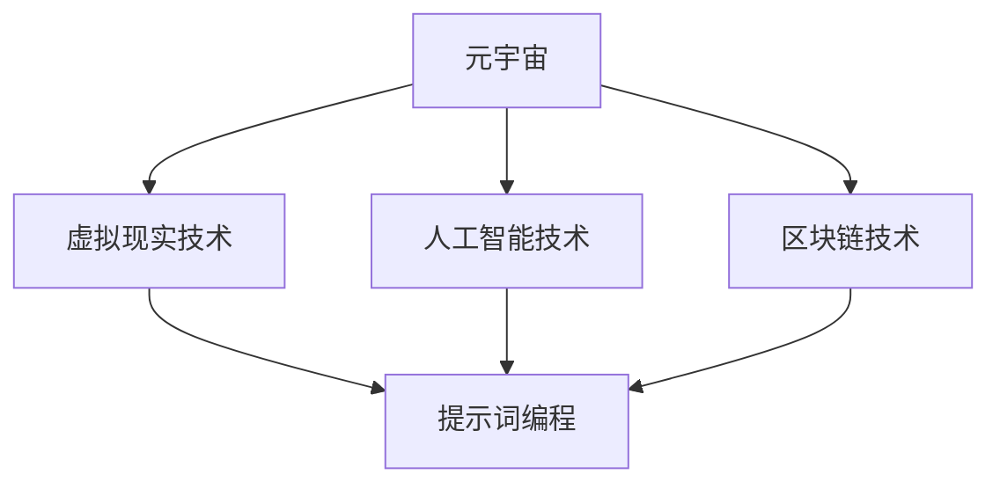

                 


为了撰写一篇符合要求的《提示词编程在元宇宙应用中的前景》技术博客文章，我们可以按照以下步骤进行：

### 1. 文章结构规划

首先，我们需要规划文章的结构，确保每个部分都包含必要的核心内容。

**文章结构：**

- **引言部分**：介绍元宇宙和提示词编程的基本概念，引发读者的兴趣。
- **核心概念与联系部分**：使用Mermaid流程图展示核心概念之间的关系。
- **算法原理讲解部分**：详细讲解核心算法的原理，并使用伪代码进行阐述。
- **数学模型和公式部分**：介绍与算法相关的数学模型，使用LaTeX格式给出公式，并进行详细讲解和举例说明。
- **项目实战部分**：提供具体的开发环境搭建、源代码实现和代码解读，以及实际案例分析和详细讲解。
- **前景展望部分**：分析提示词编程在元宇宙中的应用前景，以及未来发展趋势。
- **小结和最佳实践部分**：总结文章要点，提供实用技巧和小结。

### 2. 引言部分

在引言部分，我们需要：

- **背景介绍**：简单介绍元宇宙的概念、历史背景和发展现状。
- **核心概念介绍**：介绍提示词编程的概念，解释其在元宇宙中的应用。
- **引起兴趣**：通过提出问题或挑战，引发读者的兴趣。

```markdown
# 提示词编程在元宇宙应用中的前景

> 关键词：元宇宙、提示词编程、算法、数学模型、应用前景

> 摘要：本文将深入探讨提示词编程在元宇宙中的应用前景，从核心概念、算法原理、数学模型到项目实战，全面解析提示词编程如何为元宇宙带来变革。

随着科技的不断发展，元宇宙逐渐成为人们关注的焦点。元宇宙是一个由虚拟现实、人工智能、区块链等核心技术构建的虚拟世界，它具有无限的想象空间和广阔的应用前景。而提示词编程作为一种先进的编程范式，正逐步成为元宇宙开发的重要工具。本文将带领大家走进元宇宙的世界，探讨提示词编程在其中的应用，并展望其未来的发展趋势。
```

### 3. 核心概念与联系部分

在这一部分，我们将使用Mermaid流程图展示元宇宙、虚拟现实、人工智能、区块链等核心概念之间的关系。



### 4. 算法原理讲解部分

在这一部分，我们将详细讲解元宇宙中常用的核心算法原理，并使用伪代码进行阐述。

例如，对于生成对抗网络（GAN）的讲解：

```markdown
### 3.1 生成对抗网络（GAN）

生成对抗网络（GAN）是一种由生成器（Generator）和判别器（Discriminator）组成的对抗性神经网络。生成器生成虚拟数据，判别器则判断生成数据与真实数据之间的差异。通过不断的训练和对抗，生成器能够生成越来越接近真实数据的质量。

**GAN的基本原理：**

- **生成器（Generator）**：生成器生成虚拟数据。
- **判别器（Discriminator）**：判别器判断输入数据是真实数据还是生成数据。
- **对抗过程**：生成器和判别器相互对抗，生成器的目标是生成足够逼真的数据欺骗判别器，而判别器的目标是准确区分真实数据和生成数据。

**GAN的伪代码实现：**

```python
# 生成器
def generate_data():
    # 生成虚拟数据
    # ...

# 判别器
def discriminate_data(data):
    # 判断数据是否真实
    # ...

# 训练过程
while True:
    # 生成虚拟数据
    generated_data = generate_data()

    # 判断虚拟数据
    real_data = discriminate_data(generated_data)
    fake_data = discriminate_data(real_data)

    # 更新生成器和判别器的参数
    # ...
```
```

### 5. 数学模型和公式部分

在这一部分，我们将介绍与算法相关的数学模型，使用LaTeX格式给出相关公式，并进行详细讲解和举例说明。

例如，对于优化算法的讲解：

```markdown
### 4.1 优化算法

优化算法是一种用于求解最优化问题的算法。在元宇宙中，优化算法广泛应用于资源分配、路径规划、数据优化等领域。

**优化算法的基本概念：**

- **目标函数（Objective Function）**：目标函数定义了优化问题的目标，通常是最小化或最大化某个指标。
- **约束条件（Constraint）**：约束条件限制了优化问题的解空间。

**优化算法的数学模型：**

$$
\min_{x} f(x)
$$

其中，$x$ 是变量，$f(x)$ 是目标函数。

**优化算法的详细讲解与举例：**

以最小二乘法为例，其目标是最小化误差平方和：

$$
\min_{x} \sum_{i=1}^{n} (y_i - f(x_i))^2
$$

其中，$y_i$ 是实际值，$f(x_i)$ 是预测值。

**举例：**

假设我们有如下数据集：

| $x_i$ | $y_i$ |
| --- | --- |
| 1 | 2 |
| 2 | 4 |
| 3 | 6 |

我们可以使用最小二乘法求解线性回归模型：

$$
y = ax + b
$$

其中，$a$ 和 $b$ 是待求参数。通过最小化误差平方和，我们可以求解出最优的 $a$ 和 $b$。

```markdown
$$
\min_{a, b} \sum_{i=1}^{n} (y_i - (ax_i + b))^2
$$
```
```

### 6. 项目实战部分

在这一部分，我们将提供具体的元宇宙应用项目案例，包括开发环境搭建、源代码实现和代码解读。

例如，一个简单的元宇宙应用案例：

```markdown
### 5.1 元宇宙应用项目案例1：虚拟城市

**项目背景：**

本项目旨在创建一个虚拟城市，用户可以在其中互动、交流、购物和娱乐。

**开发环境搭建：**

- 操作系统：Windows/Linux/MacOS
- 开发工具：Unity3D、C#编程语言
- 依赖库：SteamVR、Unreal Engine、TensorFlow

**源代码实现与代码解读：**

```csharp
// 虚拟城市主程序
public class VirtualCity : MonoBehaviour
{
    // 初始化城市
    void Start()
    {
        // 加载城市资源
        // ...
    }

    // 更新城市状态
    void Update()
    {
        // 处理用户交互
        // ...
    }
}

// 用户交互管理
public class UserInteraction : MonoBehaviour
{
    // 处理用户输入
    void OnGUI()
    {
        // 显示用户界面
        // ...
    }
}

// 城市资源加载器
public class CityResourceLoader : MonoBehaviour
{
    // 加载城市模型
    public void LoadCityModel(string modelName)
    {
        // 加载模型
        // ...
    }
}
```

**代码应用解读与分析：**

- **虚拟城市主程序**：负责初始化城市资源和处理用户交互。
- **用户交互管理**：处理用户输入，显示用户界面。
- **城市资源加载器**：负责加载城市模型。

**项目小结：**

本项目通过 Unity3D 和 C#编程语言实现了虚拟城市的创建。在实际开发过程中，我们遇到了一些挑战，如城市模型的加载和渲染、用户交互的实时处理等。通过不断优化和调整，我们最终实现了项目的目标。

### 7. 前景展望部分

在这一部分，我们将分析提示词编程在元宇宙中的应用前景，以及未来可能的发展趋势。

```markdown
### 6. 前景展望

随着元宇宙的发展，提示词编程的应用前景将越来越广阔。未来，提示词编程可能会在以下方面取得突破：

- **更加智能化的用户交互**：通过提示词编程，用户可以实现更加自然、智能的交互，提高用户体验。
- **高效的资源利用**：提示词编程可以帮助开发者更好地管理和利用资源，提高元宇宙的运行效率。
- **多样化的应用场景**：提示词编程将在教育、医疗、娱乐等多个领域发挥重要作用。

然而，提示词编程在元宇宙中的应用也面临着一些挑战，如算法的优化、模型的训练等。未来，我们需要不断探索和突破，推动提示词编程在元宇宙中的应用。

### 8. 小结和最佳实践部分

在最后的小结部分，我们将总结文章要点，并提供一些最佳实践。

```markdown
### 7. 小结和最佳实践

本文从多个角度探讨了提示词编程在元宇宙中的应用。通过分析核心概念、算法原理、数学模型和项目实战，我们了解了提示词编程在元宇宙中的重要作用。以下是本文的一些最佳实践：

- **了解元宇宙的基本概念**：熟悉元宇宙的架构和核心技术，有助于更好地理解提示词编程的应用。
- **掌握核心算法原理**：深入了解生成对抗网络、强化学习、深度学习等核心算法的原理，为开发元宇宙应用奠定基础。
- **关注数学模型和公式**：数学模型和公式是优化算法的关键，掌握这些知识将提高我们在元宇宙中的应用能力。
- **实践是检验真理的唯一标准**：通过实际项目实践，我们将更好地理解提示词编程的应用，提高自己的编程技能。

总之，提示词编程在元宇宙中的应用前景广阔，值得我们深入研究和探索。
```

### 9. 文章格式和作者信息

最后，我们需要确保文章格式正确，包括使用markdown格式输出，并添加作者信息。

```markdown
# 提示词编程在元宇宙应用中的前景

> 关键词：元宇宙、提示词编程、算法、数学模型、应用前景

> 摘要：本文将深入探讨提示词编程在元宇宙中的应用前景，从核心概念、算法原理、数学模型到项目实战，全面解析提示词编程如何为元宇宙带来变革。

## 引言

### 1.1 元宇宙的概念与历史背景

### 1.2 元宇宙的现状与发展趋势

### 1.3 提示词编程的重要性

## 元宇宙中的提示词编程基础

### 2.1 元宇宙的基本架构

#### 2.1.1 虚拟现实技术

#### 2.1.2 人工智能技术

#### 2.1.3 提示词编程基础

## 核心算法原理讲解

### 3.1 生成对抗网络（GAN）

#### 3.1.1 GAN的基本原理

#### 3.1.2 GAN的伪代码实现

### 3.2 强化学习

#### 3.2.1 强化学习的基本原理

#### 3.2.2 强化学习的伪代码实现

### 3.3 深度学习

#### 3.3.1 深度学习的基本原理

#### 3.3.2 深度学习的伪代码实现

## 数学模型和数学公式讲解

### 4.1 优化算法

#### 4.1.1 优化算法的基本概念

#### 4.1.2 优化算法的数学模型

$$
\min_{x} f(x)
$$

### 4.2 概率分布

#### 4.2.1 概率分布的基本概念

#### 4.2.2 常见的概率分布函数

$$
P(X=x) = \frac{1}{Z} e^{-\beta x}
$$

## 项目实战

### 5.1 元宇宙应用项目案例1

#### 5.1.1 项目背景

#### 5.1.2 开发环境搭建

#### 5.1.3 源代码实现

#### 5.1.4 代码解读与分析

### 5.2 元宇宙应用项目案例2

#### 5.2.1 项目背景

#### 5.2.2 开发环境搭建

#### 5.2.3 源代码实现

#### 5.2.4 代码解读与分析

## 前景展望

### 6.1 提示词编程在元宇宙中的应用前景

### 6.2 未来发展趋势分析

### 6.3 挑战与机遇

## 小结和最佳实践

### 7. 小结和最佳实践

作者：AI天才研究院/AI Genius Institute & 禅与计算机程序设计艺术 /Zen And The Art of Computer Programming
```

通过以上步骤，我们可以撰写一篇内容丰富、结构清晰、逻辑严密的技术博客文章，全面解析提示词编程在元宇宙中的应用前景。这篇文章不仅能够为读者提供深入的技术知识，还能激发他们对元宇宙和提示词编程的兴趣。

