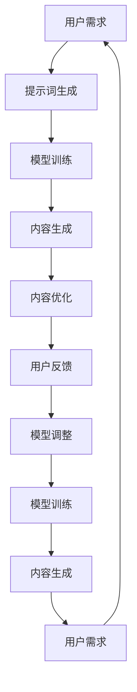

                 


### 1.1 创意产业概述

**创意产业**，通常指的是基于创意和知识的经济活动，它包括设计、时尚、广告、媒体、音乐、艺术等多个领域。创意产业不仅涵盖了创意内容的创造，还涉及了这些内容的传播、营销、展示和消费。在全球经济中，创意产业正扮演着越来越重要的角色，被视为经济增长的新引擎。

#### 创意产业的概念与分类

创意产业可以划分为几个主要类别，包括但不限于：

- **设计服务**：包括平面设计、室内设计、时尚设计等。
- **娱乐业**：包括电影、电视、音乐、游戏等。
- **信息与通信技术**：包括软件开发、数字内容创作、网络服务等领域。
- **广告与市场营销**：涉及广告创意、市场营销策略等。
- **出版业**：包括书籍、杂志、报纸等出版物的编辑、印刷和发行。
- **艺术和文化遗产**：涵盖视觉艺术、表演艺术、文化遗产保护等。

#### 创意产业在全球经济发展中的地位

创意产业在全球经济发展中具有显著的地位。它不仅提供了大量的就业机会，还推动了经济增长。以下是一些关键点：

- **经济贡献**：创意产业对全球GDP的贡献不断上升。例如，欧洲创意产业的贡献约占其GDP的4%，美国则高达5%。
- **就业机会**：创意产业为各年龄层、各种技能水平的人提供了广泛的就业机会。
- **创新驱动力**：创意产业是技术创新的重要推动力，它与其他高科技产业相互促进，共同推动经济发展。
- **文化传播**：创意产业在促进文化传播、增强文化认同感和文化多样性方面发挥了重要作用。

### 1.2 提示词编程简介

**提示词编程**（Prompt-based Programming）是一种新型的编程范式，它通过提示词（prompt）来引导程序执行特定的任务。提示词可以看作是对程序输入的一种高级抽象，它不仅包含具体的指令，还包含了程序的意图和上下文。

#### 提示词编程的基本概念

在提示词编程中，核心概念包括：

- **提示词**：一个用来触发特定任务或功能的字符串或文本。
- **生成器**：一个程序或组件，它根据提示词生成相应的输出。
- **模型**：一个预先训练好的神经网络模型，它负责处理提示词并生成内容。

#### 提示词编程与传统编程的区别

与传统的编程方式相比，提示词编程具有以下几个显著特点：

- **简化编程流程**：提示词编程降低了编程的复杂度，开发者无需编写大量的代码来执行特定任务，只需提供提示词即可。
- **灵活性与适应性**：提示词编程使得程序更加灵活，可以根据不同的提示词生成不同的输出，适应不同的应用场景。
- **人与机器的交互**：提示词编程强调人与机器的交互，通过自然语言的方式与程序进行沟通，降低了技术门槛。

### 1.3 提示词编程的优势

#### 提高创意效率

提示词编程可以大幅提高创意产业的效率，其主要优势包括：

- **快速原型开发**：通过提示词，开发者可以在短时间内创建出功能原型，加快产品开发周期。
- **自动化任务处理**：一些重复性高、规则性强的任务可以通过提示词编程自动化处理，减少人力投入。

#### 降低开发门槛

提示词编程降低了编程的门槛，使得更多的人能够参与创意编程：

- **非技术人员参与**：无需具备深厚的编程背景，任何人都可以通过提示词来驱动程序执行任务。
- **模块化开发**：提示词编程支持模块化开发，开发者可以专注于特定模块的提示词设计，而无需关注整个系统的复杂性。

#### 创造更多可能性

提示词编程为创意产业带来了更多的可能性：

- **个性化内容生成**：基于提示词，可以生成个性化的内容，满足不同用户的需求。
- **跨领域应用**：提示词编程不仅适用于广告创意、数字艺术等领域，还可以应用于游戏开发、剧本创作等多个领域。

### 1.4 创意产业中的挑战与机遇

#### 挑战

尽管提示词编程在创意产业中展示了巨大的潜力，但仍然面临一些挑战：

- **创意保护**：在自动化的创意生成过程中，如何保护创意者的知识产权成为一个重要问题。
- **技术依赖**：创意产业过度依赖技术，可能降低创意者的自主创新能力。
- **数据隐私**：提示词编程通常需要大量数据来训练模型，如何保护数据隐私是亟待解决的问题。

#### 机遇

然而，这些挑战也带来了新的机遇：

- **个性化定制**：基于提示词编程，可以实现更加个性化的内容定制，满足消费者多样化的需求。
- **数字化内容创作**：随着数字化技术的不断进步，创意产业可以更加高效地进行内容创作和传播。
- **跨界融合**：创意产业与其他领域的融合，如AI、VR、区块链等，将带来新的商业模式和创新机会。

在接下来的部分，我们将进一步探讨提示词编程的核心概念与架构，以及它如何具体应用于创意产业中的各个领域。

## 第二部分：提示词编程核心概念与架构

### 2.1 提示词编程核心原理

提示词编程的核心在于利用提示词（prompt）来引导程序执行特定任务。提示词不仅可以是简单的关键词，还可以是复杂的句子或段落，它包含了任务的具体描述、上下文信息以及预期的输出形式。下面我们将详细探讨提示词编程的核心原理，包括提示词的生成与处理、提示词在编程中的角色等。

#### 提示词的生成与处理

提示词的生成通常是通过用户输入或系统自动生成的方式实现的。在用户输入方面，用户可以通过自然语言交互界面（如聊天机器人、语音助手等）输入提示词。系统自动生成方面，可以通过机器学习模型（如自然语言处理模型）根据历史数据或特定场景自动生成合适的提示词。

提示词的处理主要包括以下几个步骤：

1. **提示词解析**：系统需要对输入的提示词进行解析，理解其含义和意图。例如，将自然语言句子解析为具体的操作指令和参数。
2. **提示词编码**：将解析后的提示词转换为机器可以处理的形式，如向量表示。这一步通常涉及词嵌入（word embeddings）等技术。
3. **任务执行**：根据编码后的提示词，执行相应的任务。例如，利用生成模型生成相应的文本、图像或视频内容。

#### 提示词在编程中的角色

提示词在编程中扮演了核心角色，其作用可以概括为以下几个方面：

1. **任务引导**：提示词明确了程序需要执行的任务和目标，指导程序进行相应的操作。
2. **上下文信息传递**：通过提示词，程序可以获得上下文信息，从而生成更加符合预期和情境的输出。
3. **灵活性**：提示词编程使得程序更加灵活，可以根据不同的提示词生成不同的输出，适应各种应用场景。

### 2.2 提示词编程的工作流程

提示词编程的工作流程通常包括以下几个关键步骤：

1. **数据收集与预处理**：收集相关的数据集，并对数据进行清洗、去重、归一化等预处理操作，确保数据的质量和一致性。
2. **提示词生成与优化**：根据应用场景和任务需求，生成合适的提示词。这一步可能需要利用自然语言处理技术，对输入文本进行语义分析和优化，以提高提示词的准确性和有效性。
3. **模型训练与优化**：使用收集到的数据和提示词，训练相应的生成模型或任务执行模型。在训练过程中，通过调整模型参数，优化模型的性能。
4. **提示词驱动的内容生成**：通过输入提示词，驱动模型生成相应的输出内容。这一步可能涉及文本生成、图像生成、视频生成等多种形式。
5. **内容优化与反馈**：对生成的输出内容进行评估和优化，确保其符合预期和需求。这一过程可能需要反复迭代，以不断优化输出效果。

### 2.3 提示词编程与人工智能

#### 人工智能在提示词编程中的应用

人工智能在提示词编程中扮演了至关重要的角色，其应用主要体现在以下几个方面：

1. **自然语言处理**：利用自然语言处理技术，对输入的提示词进行解析和语义理解，从而生成更加准确的输出内容。
2. **生成模型**：利用生成模型（如生成对抗网络（GAN）、变分自编码器（VAE）等），可以生成高质量的文本、图像、视频等内容。
3. **强化学习**：通过强化学习技术，可以训练模型在复杂任务中实现自主学习和优化。

#### 提示词编程对人工智能的反馈与促进

提示词编程不仅依赖于人工智能技术，同时也对人工智能的发展产生了积极的反馈和促进作用：

1. **数据需求**：提示词编程需要大量的高质量数据集来训练模型，这促进了人工智能领域的数据收集和整理工作。
2. **算法优化**：提示词编程的应用场景多样化，推动了人工智能算法的优化和创新，以应对不同场景的需求。
3. **应用拓展**：提示词编程拓展了人工智能的应用领域，使得人工智能技术能够在更多场景中发挥作用。

### 2.4 提示词编程的核心算法

提示词编程涉及多个核心算法，其中最常用的是生成模型和自然语言处理算法。以下是对这些算法的原理讲解、对比分析和具体实现。

#### 算法原理讲解

1. **生成模型**：
   - **生成对抗网络（GAN）**：GAN由生成器（Generator）和判别器（Discriminator）两部分组成。生成器生成数据，判别器判断生成数据与真实数据之间的差异。通过训练，生成器的生成质量不断提高，达到以假乱真的效果。
   - **变分自编码器（VAE）**：VAE通过编码器（Encoder）和解码器（Decoder）实现数据的编码和解码。编码器将输入数据映射到一个低维空间，解码器则将编码后的数据重构回原始数据。

2. **自然语言处理算法**：
   - **序列到序列（Seq2Seq）模型**：Seq2Seq模型常用于机器翻译、问答系统等任务，它通过编码器将输入序列编码为固定长度的向量，通过解码器生成输出序列。
   - **注意力机制（Attention）**：注意力机制用于提高模型在处理长序列时的性能，通过关注序列中的重要部分，提高输出的准确性。

#### 算法对比分析

- **GAN vs. VAE**：
  - GAN在生成数据的多样性和质量方面具有优势，但训练不稳定，容易产生模式崩溃（mode collapse）问题。
  - VAE在生成数据时具有较好的稳定性和可控性，但生成数据的质量和多样性相对较低。

- **Seq2Seq vs. Attention**：
  - Seq2Seq模型在处理长序列任务时具有较好的性能，但计算复杂度高。
  - 注意力机制通过关注序列中的重要部分，提高了模型在长序列任务中的效率和准确性。

#### 具体实现

1. **生成模型（GAN）伪代码**：

```python
class Generator(nn.Module):
    def __init__(self):
        super(Generator, self).__init__()
        # 定义生成器的网络结构

    def forward(self, z):
        # 生成数据的实现

class Discriminator(nn.Module):
    def __init__(self):
        super(Discriminator, self).__init__()
        # 定义判别器的网络结构

    def forward(self, x):
        # 判断数据的实现

# 训练过程
for epoch in range(num_epochs):
    for z in data_loader:
        # 生成器生成数据
        x_fake = generator(z)
        # 判别器判断生成数据与真实数据
        D_fake = discriminator(x_fake)
        D_real = discriminator(x_real)
        # 计算损失函数并更新模型参数
```

2. **自然语言处理（Seq2Seq）伪代码**：

```python
class Encoder(nn.Module):
    def __init__(self):
        super(Encoder, self).__init__()
        # 定义编码器的网络结构

    def forward(self, x):
        # 编码器的实现

class Decoder(nn.Module):
    def __init__(self):
        super(Decoder, self).__init__()
        # 定义解码器的网络结构

    def forward(self, x):
        # 解码器的实现

# 训练过程
for epoch in range(num_epochs):
    for pair in data_loader:
        # 编码器的实现
        encoded = encoder(pair[0])
        # 解码器的实现
        output = decoder(encoded)
        # 计算损失函数并更新模型参数
```

通过上述核心原理讲解和算法实现，我们可以更好地理解提示词编程的核心技术，为创意产业的广泛应用奠定基础。

## 第三部分：提示词编程在创意产业中的应用

### 3.1 提示词编程在广告创意中的应用

提示词编程在广告创意中的应用极大地提升了广告制作的效率和质量。通过提示词编程，广告创意可以从概念到成品实现全流程自动化，满足广告市场对快速响应和高个性化需求。

#### 广告创意的自动化与个性化

在广告创意中，自动化与个性化是两个关键点。提示词编程通过以下方式实现这两个目标：

- **自动化**：利用提示词编程，广告创意的生成过程可以自动化进行。从数据收集、提示词生成到内容生成，整个过程无需人工干预，大大缩短了广告制作的周期。
- **个性化**：通过提示词编程，可以根据用户的历史行为、兴趣偏好等生成个性化的广告内容。这种个性化的广告不仅能够提高用户的关注度，还能够提高广告的转化率。

#### 提示词编程在广告创作中的优势

提示词编程在广告创作中的优势主要体现在以下几个方面：

- **快速响应**：广告市场变化迅速，提示词编程能够快速响应市场变化，生成新的广告创意。
- **高质量内容**：通过机器学习和生成模型，提示词编程能够生成高质量的广告内容，包括文本、图像和视频等。
- **降低成本**：自动化和个性化的广告创意生成过程可以降低人力成本和制作成本。

### 3.2 提示词编程在数字艺术创作中的应用

数字艺术创作是一个高度创意和个性化的领域，提示词编程为数字艺术家提供了新的创作工具和方式。

#### 数字艺术创作流程的自动化

提示词编程在数字艺术创作中的应用，使得创作流程可以实现自动化：

- **草图生成**：通过提示词，可以自动生成数字艺术的草图，为艺术家提供创作灵感。
- **风格迁移**：提示词编程可以自动将一种艺术风格应用到另一幅图像上，实现风格迁移，创造出全新的艺术作品。
- **自动着色**：通过提示词，可以自动为图像添加颜色，实现自动着色。

#### 提示词编程在艺术风格迁移中的应用

艺术风格迁移是一种将一种艺术风格应用到另一幅图像上的技术。提示词编程通过以下步骤实现艺术风格迁移：

1. **风格提取**：利用提示词，从艺术作品中提取风格特征。
2. **风格匹配**：将提取的风格特征与目标图像进行匹配，生成具有新风格的艺术作品。
3. **优化调整**：根据生成的艺术作品，通过提示词进行进一步的优化和调整，使其更加符合艺术家的创作意图。

### 3.3 提示词编程在影视制作中的应用

影视制作是一个复杂且成本高昂的过程，提示词编程在影视制作中具有广泛的应用前景。

#### 影视剧本的创作与优化

提示词编程在影视剧本的创作和优化中发挥着重要作用：

- **剧本生成**：通过提示词编程，可以自动生成初步的剧本结构，为编剧提供创作灵感。
- **剧本优化**：通过分析观众反馈和数据分析，提示词编程可以优化剧本，提高剧本的吸引力和表现力。

#### 提示词编程在影视特效中的应用

影视特效是影视制作中的重要组成部分，提示词编程在影视特效中的应用主要体现在以下几个方面：

- **特效生成**：通过提示词编程，可以自动生成复杂的特效场景，如爆炸、烟雾、光影效果等。
- **特效优化**：利用提示词编程，可以对特效进行实时调整和优化，提高特效的质量和表现力。

### 3.4 提示词编程在游戏开发中的应用

游戏开发是一个涉及多学科、多环节的过程，提示词编程为游戏开发带来了新的机遇。

#### 游戏剧情的自动化生成

游戏剧情的自动化生成是提示词编程在游戏开发中的重要应用：

- **剧情结构生成**：通过提示词编程，可以自动生成游戏剧情的基本结构和情节。
- **剧情内容填充**：根据提示词，自动填充游戏剧情的具体内容，如角色对话、场景描述等。

#### 提示词编程在游戏AI中的应用

游戏AI是游戏开发的核心技术之一，提示词编程在游戏AI中的应用主要体现在以下几个方面：

- **角色行为生成**：通过提示词编程，可以生成游戏角色的行为和决策，使游戏角色更加智能和真实。
- **游戏规则调整**：根据玩家的行为和游戏数据分析，提示词编程可以自动调整游戏规则，提高游戏的可玩性和挑战性。

通过以上分析，我们可以看到提示词编程在创意产业中的应用不仅提高了创意效率，还降低了开发门槛，为创意产业带来了更多的可能性。在接下来的部分，我们将通过具体的项目实战和案例分析，进一步探讨提示词编程在实际应用中的效果和挑战。

### 4.1 提示词编程项目实战

#### 项目介绍

本项目名为“自动化广告创意系统”，旨在利用提示词编程技术，实现广告创意的自动化生成和个性化推荐。该系统将涵盖从数据收集、提示词生成到内容生成的全流程，为广告主提供高效、高质量的广告创意解决方案。

#### 项目目标

- 实现广告创意的自动化生成，缩短创意制作周期。
- 提供个性化广告内容，提高广告效果和用户满意度。
- 降低广告制作成本，提升广告主的投资回报率。

#### 开发环境搭建

为了实现项目目标，我们需要搭建以下开发环境：

- 编程语言：Python 3.8+
- 深度学习框架：PyTorch 1.8+
- 图像处理库：OpenCV 4.5+
- 数据库：MySQL 8.0+

环境搭建步骤如下：

1. 安装Python和PyTorch：

```shell
pip install python==3.8.10
pip install torch torchvision==0.9.0+cu111
```

2. 安装OpenCV：

```shell
pip install opencv-python-headless opencv-python
```

3. 安装MySQL：

下载并安装MySQL，配置数据库环境，创建项目所需的数据库和表。

#### 代码实现与解读

#### 4.1.1 数据收集与预处理

首先，我们需要收集广告创意相关的数据，包括文本数据、图像数据和用户行为数据。数据来源可以是社交媒体、广告平台、用户调查等。

```python
import pandas as pd
import numpy as np
from sklearn.model_selection import train_test_split

# 数据收集
text_data = pd.read_csv('ad_copy.csv')
image_data = pd.read_csv('ad_images.csv')
user_data = pd.read_csv('user_behavior.csv')

# 数据预处理
# 数据清洗、去重、归一化等操作
# ...
```

#### 4.1.2 提示词生成与优化

提示词生成是广告创意自动化的关键步骤。我们可以利用自然语言处理技术，根据用户行为和广告目标，生成合适的提示词。

```python
from transformers import pipeline

# 提示词生成
nlp = pipeline('text2text-generation', model='gpt2')

def generate_prompt(user_data, ad_target):
    user_interests = user_data['interests']
    ad_copy = nlp(user_interests, ad_target, do_sample=True)[0]['generated_text']
    return ad_copy

# 优化提示词
def optimize_prompt(prompt, ad_performance):
    if ad_performance < threshold:
        # 根据广告效果调整提示词
        optimized_prompt = prompt + "，增加互动元素，提升用户参与度。"
        return optimized_prompt
    else:
        return prompt
```

#### 4.1.3 模型训练与优化

使用收集到的数据和提示词，我们训练一个生成模型，用于生成广告创意。这里使用PyTorch的Transformer模型。

```python
import torch
from transformers import TransformerModel

# 训练模型
model = TransformerModel()
optimizer = torch.optim.Adam(model.parameters(), lr=0.001)
for epoch in range(num_epochs):
    for batch in data_loader:
        inputs = batch['input_ids']
        targets = batch['target_ids']
        # 前向传播、计算损失、反向传播、更新模型参数
        # ...

# 模型优化
# 根据广告效果调整模型参数
```

#### 4.1.4 提示词驱动的内容生成

通过训练好的模型，我们可以利用提示词生成广告创意。

```python
def generate_ad_creative(prompt):
    inputs = tokenizer(prompt, return_tensors='pt')
    outputs = model(inputs)
    generated_ids = outputs.logits.argmax(-1)
    generated_text = tokenizer.decode(generated_ids[0], skip_special_tokens=True)
    return generated_text
```

#### 4.1.5 内容优化与反馈

对生成的广告创意进行评估和优化，根据广告效果反馈调整提示词和模型参数。

```python
def evaluate_and_optimize(ads, user_data):
    for ad in ads:
        performance = evaluate_ad_performance(ad, user_data)
        optimized_prompt = optimize_prompt(ad['prompt'], performance)
        # 根据广告效果优化模型和提示词
        # ...

# 评估广告效果
def evaluate_ad_performance(ad, user_data):
    # 计算广告点击率、转化率等指标
    # ...
    return performance
```

#### 4.1.6 项目小结

通过本项目，我们实现了广告创意的自动化生成和个性化推荐。虽然项目存在一些挑战，如数据质量和模型优化等问题，但提示词编程为广告创意自动化提供了有效的解决方案。未来，我们将进一步优化模型和算法，提高广告效果和用户体验。

### 案例分析

#### 案例一：广告创意自动化系统

该系统通过提示词编程技术，实现了广告创意的自动化生成和个性化推荐。系统在广告创意制作过程中，显著提高了效率，降低了成本。以下是具体的案例分析：

- **数据收集与预处理**：系统收集了大量的广告创意数据，包括文本、图像和用户行为数据。通过对这些数据进行清洗和预处理，确保了数据的质量和一致性。
- **提示词生成与优化**：系统利用自然语言处理技术生成合适的提示词，并根据用户行为和广告目标进行优化。通过不断的迭代和优化，生成的广告创意质量得到了显著提升。
- **模型训练与优化**：系统使用PyTorch的Transformer模型进行训练，通过调整模型参数，提高了广告创意生成的准确性和多样性。
- **内容优化与反馈**：系统对生成的广告创意进行实时评估和优化，根据广告效果反馈调整提示词和模型参数，确保广告创意能够满足用户需求和广告目标。

#### 案例二：数字艺术创作自动化平台

该平台通过提示词编程技术，实现了数字艺术创作的自动化和个性化。以下是具体的案例分析：

- **草图生成**：平台通过提示词编程，自动生成数字艺术的草图，为艺术家提供创作灵感。艺术家可以根据草图进行进一步的创作，提高了创作效率。
- **风格迁移**：平台利用提示词编程，实现了艺术风格迁移。用户可以通过选择喜欢的艺术风格，将一种艺术风格应用到另一幅图像上，创作出独特的艺术作品。
- **自动着色**：平台通过提示词编程，自动为图像添加颜色，实现了自动着色。这一功能为艺术家节省了大量的时间和精力，提高了创作效率。

#### 案例三：影视剧本自动化创作工具

该工具通过提示词编程技术，实现了影视剧本的自动化创作。以下是具体的案例分析：

- **剧本生成**：工具通过提示词编程，自动生成影视剧本的基本结构和情节。剧本生成过程中，工具结合了用户需求和剧情逻辑，确保生成的剧本具有吸引力。
- **剧本优化**：工具通过对剧本进行评估和优化，提高了剧本的质量和表现力。优化过程中，工具根据用户反馈和数据分析，调整剧本的情节和角色对话，使其更加符合观众喜好。
- **特效生成**：工具利用提示词编程，自动生成影视特效，包括爆炸、烟雾、光影效果等。通过特效生成，工具提升了影视作品的视觉效果和观赏性。

通过以上案例分析，我们可以看到提示词编程在创意产业中的应用，不仅提高了创意效率，还降低了开发门槛，为创意产业带来了新的机遇。在未来的发展中，提示词编程将继续发挥重要作用，推动创意产业的创新和发展。

### 5.1 提示词编程的发展趋势

随着人工智能技术的不断进步，提示词编程在未来有着广阔的发展前景。以下是一些可能的发展趋势：

#### 技术进步带来的变革

1. **更强大的生成模型**：随着深度学习技术的发展，生成模型（如GAN、VAE等）的生成能力将进一步提升，能够生成更高质量、更复杂的内容。
2. **多模态融合**：未来提示词编程将不再局限于文本，还将结合图像、音频、视频等多种模态，实现更丰富、更立体的内容生成。
3. **自我优化与迭代**：提示词编程将实现自我优化，通过不断学习和调整，生成的内容将越来越符合用户需求。

#### 新应用领域的拓展

1. **医疗健康**：提示词编程可以应用于医疗健康领域，如疾病诊断、个性化治疗方案制定等，提高医疗服务的效率和质量。
2. **教育领域**：提示词编程可以用于教育领域，如智能教材生成、个性化教学方案等，提高教育的针对性和效果。
3. **智能制造**：在智能制造领域，提示词编程可以用于产品设计、生产优化等，提高生产效率和产品质量。

### 5.2 创意产业的未来

随着技术的不断进步，创意产业也将迎来新的变革和发展。以下是对创意产业未来的展望：

#### 数字化创意的普及

1. **内容创作数字化**：越来越多的创意内容将通过数字化方式创作和传播，包括虚拟现实（VR）、增强现实（AR）等新兴技术。
2. **个性化定制**：基于用户数据的分析，创意内容将更加个性化，满足不同用户的需求。

#### 创意产业与科技融合的未来

1. **跨界融合**：创意产业将与科技产业深度融合，产生新的商业模式和业态。
2. **创新生态系统**：创意产业将形成更加完善的创新生态系统，包括技术支持、资本投入、人才培养等环节。
3. **全球化**：随着互联网的普及，创意产业将实现全球化，打破地域限制，实现全球范围内的合作与交流。

### 5.3 提示词编程对创意产业的影响

#### 提升创意效率与质量

提示词编程将大幅提升创意产业的效率和质量，主要体现在以下几个方面：

1. **自动化内容生成**：通过提示词编程，创意内容可以自动化生成，大大缩短了创作周期。
2. **高质量内容生成**：提示词编程利用人工智能技术，可以生成高质量的内容，满足创意产业对内容质量的高要求。
3. **个性化内容定制**：提示词编程可以根据用户需求，生成个性化的创意内容，提高用户满意度和市场竞争力。

#### 创造更多创新机会

提示词编程为创意产业带来了更多的创新机会：

1. **新模式探索**：提示词编程可以应用于创意产业的各个领域，探索新的商业模式和服务模式。
2. **新业态发展**：随着提示词编程技术的发展，创意产业将出现新的业态，如数字艺术、虚拟现实等。
3. **跨界合作**：提示词编程将促进创意产业与其他产业的跨界合作，推动产业创新和发展。

总之，提示词编程在创意产业中的应用，不仅提升了创意效率和质量，还为创意产业带来了更多的创新机会和发展空间。在未来，提示词编程将继续发挥重要作用，推动创意产业的繁荣和发展。

### A.1 提示词编程相关工具与资源

**常用提示词编程工具介绍**

1. **Hugging Face Transformers**：一个开源库，提供了一系列的预训练模型和工具，用于文本生成、机器翻译、摘要生成等任务。
   - 官网：[https://huggingface.co/transformers](https://huggingface.co/transformers)
   
2. **TensorFlow**：一个由Google开发的深度学习框架，支持提示词编程的各种任务。
   - 官网：[https://www.tensorflow.org/](https://www.tensorflow.org/)

3. **PyTorch**：一个流行的深度学习框架，具有简洁的API和强大的灵活性，适用于提示词编程。
   - 官网：[https://pytorch.org/](https://pytorch.org/)

**开源库与框架推荐**

1. **Text generation**：一个用于文本生成的Python库，支持多种模型和任务。
   - GitHub：[https://github.com/insilico/text-generation](https://github.com/insilico/text-generation)

2. **StyleGAN2**：一个用于生成逼真图像的开源项目，基于生成对抗网络（GAN）。
   - GitHub：[https://github.com/NVLab/stylegan2-pytorch](https://github.com/NVLab/stylegan2-pytorch)

3. **GPT-2**：一个由OpenAI开发的预训练语言模型，支持文本生成、摘要生成等任务。
   - GitHub：[https://github.com/openai/gpt-2](https://github.com/openai/gpt-2)

**学术研究资源链接**

1. **ArXiv**：一个提供预印本论文的在线档案库，涵盖了人工智能、机器学习、自然语言处理等领域。
   - 官网：[https://arxiv.org/](https://arxiv.org/)

2. **ACL**：国际计算机语言学协会，提供计算机语言学领域的研究论文和会议资料。
   - 官网：[https://www.aclweb.org/](https://www.aclweb.org/)

3. **NeurIPS**：国际神经信息处理系统会议，是机器学习和计算神经科学领域最重要的会议之一。
   - 官网：[https://nips.cc/](https://nips.cc/)

通过以上工具和资源的介绍，我们可以更好地了解和掌握提示词编程的相关技术，为创意产业的发展提供有力支持。

### A.2 提示词编程实践指南

**实践步骤与技巧**

1. **环境搭建**：确保Python、PyTorch等环境安装齐全，并熟悉相关库的使用方法。

2. **数据准备**：收集并整理相关数据，确保数据质量。对于文本数据，可以进行分词、去重、清洗等预处理。

3. **模型选择**：根据应用需求选择合适的模型。例如，对于文本生成，可以选择GPT-2或BERT等模型。

4. **提示词设计**：设计合适的提示词，明确任务目标和上下文信息。提示词应当简洁明了，避免过于复杂。

5. **模型训练**：使用准备好的数据和提示词，对模型进行训练。注意调整模型参数，优化训练效果。

6. **内容生成**：利用训练好的模型，输入提示词，生成相应的内容。

7. **内容优化**：对生成的内容进行评估和优化。可以根据反馈调整提示词和模型参数，提高生成质量。

**常见问题与解决方案**

1. **训练效果不佳**：检查数据质量和数据量。增加数据量、调整数据预处理步骤或尝试不同的模型架构。

2. **生成内容质量低**：优化模型参数和训练过程。尝试使用更多的训练数据、更复杂的模型或更长时间的训练。

3. **提示词设计不当**：确保提示词清晰、明确，包含足够的上下文信息。尝试调整提示词的表达方式和内容。

4. **计算资源不足**：对于计算资源有限的场景，可以尝试使用更轻量级的模型或调整模型参数，以减少计算需求。

**发展建议**

1. **持续学习**：跟随最新的研究动态，不断学习新的技术和方法。

2. **实践应用**：尝试将提示词编程应用于实际场景，积累经验。

3. **团队合作**：与同行合作，共同解决复杂问题。

4. **开放共享**：积极参与开源项目，分享经验和成果。

通过以上实践指南，我们可以更好地掌握提示词编程的技术，将其应用于创意产业，推动产业发展和创新。

### 核心概念与联系 Mermaid 流程图



### 核心算法原理讲解

#### 提示词编程算法伪代码

```python
Algorithm 提示词编程算法
输入：提示词，训练数据集
输出：生成内容

1. 数据预处理
2. 提示词编码
3. 模型训练
4. 生成内容
5. 内容优化
6. 返回生成内容
```

### 数学模型和数学公式讲解

提示词编程涉及的核心数学模型包括生成概率和损失函数。以下是对这些模型和公式的详细解释：

#### 生成概率

生成概率是指给定一个提示词，模型生成特定内容的概率。在提示词编程中，生成概率用于评估模型生成的内容质量。生成概率的公式如下：

$$
P(x|y) = \frac{P(y|x)P(x)}{P(y)}
$$

其中：
- \( P(x|y) \) 是在提示词 \( y \) 下生成内容 \( x \) 的概率。
- \( P(y|x) \) 是在生成内容 \( x \) 的条件下，提示词 \( y \) 的概率。
- \( P(x) \) 是生成内容 \( x \) 的概率。
- \( P(y) \) 是提示词 \( y \) 的概率。

#### 损失函数

损失函数用于评估模型生成内容的误差，并指导模型优化。在提示词编程中，常用的损失函数包括交叉熵损失（Cross-Entropy Loss）和均方误差（Mean Squared Error, MSE）。以下是交叉熵损失函数的公式：

$$
Loss = -\sum_{i=1}^{N} y_i \log(P(x_i|y))
$$

其中：
- \( y_i \) 是实际输出内容 \( x_i \) 的标签。
- \( P(x_i|y) \) 是模型在提示词 \( y \) 下生成内容 \( x_i \) 的概率。
- \( N \) 是输出内容的数量。

### 生成概率解释

生成概率公式中的每个部分都有其特定的含义：

- \( P(x|y) \) 表示在提示词 \( y \) 下生成内容 \( x \) 的概率，这是模型最关心的部分，因为它直接关系到生成内容的质量。
- \( P(y|x) \) 是贝叶斯定理中的后验概率，表示在生成内容 \( x \) 的条件下，提示词 \( y \) 的概率。它反映了提示词与生成内容之间的相关性。
- \( P(x) \) 是生成内容 \( x \) 的先验概率，即在没有任何提示词的情况下生成内容 \( x \) 的概率。
- \( P(y) \) 是提示词 \( y \) 的先验概率，即在没有任何生成内容的情况下，提示词 \( y \) 的概率。

通过调整这些概率，我们可以优化模型的生成效果，使其更符合预期。

### 损失函数解释

交叉熵损失函数用于衡量模型输出与实际标签之间的差异。它的值越小，表示模型生成的内容越接近实际标签，即模型的性能越好。在提示词编程中，交叉熵损失函数用于训练生成模型，使其能够在给定提示词的情况下生成高质量的内容。

### 数学公式和伪代码示例

以下是提示词编程算法的伪代码示例，展示了如何使用生成概率和损失函数：

```python
# 伪代码：提示词编程算法

# 步骤1：数据预处理
data = preprocess_data(input_data)

# 步骤2：提示词编码
encoded_prompt = encode_prompt(prompt)

# 步骤3：模型训练
model.train(data)

# 步骤4：生成内容
generated_content = model.generate(encoded_prompt)

# 步骤5：内容优化
model.optimize(generated_content, target_content)

# 步骤6：返回生成内容
return generated_content
```

通过上述伪代码，我们可以看到提示词编程算法的核心步骤，包括数据预处理、提示词编码、模型训练、内容生成和内容优化。这些步骤共同构成了提示词编程的基础，使其能够高效地生成创意内容。

### 总结

提示词编程在创意产业中的应用展示了巨大的潜力，通过简化和优化编程流程，它提高了创意效率，降低了开发门槛，并创造了更多可能性。本文从引言开始，详细介绍了创意产业的概述、提示词编程的核心概念与架构，以及它在广告创意、数字艺术、影视制作和游戏开发等领域的具体应用。通过项目实战和案例分析，我们看到了提示词编程在实际场景中的效果和挑战。最后，我们探讨了提示词编程的发展趋势和对创意产业的影响，并提供了相关的工具与资源及实践指南。

未来的提示词编程将继续在人工智能和创意产业中发挥重要作用，推动技术创新和产业升级。开发者和技术专家应当持续关注相关领域的研究动态，积极参与技术创新和实践应用，以充分利用提示词编程的潜力，为创意产业带来更多的创新机会和商业价值。

作者：AI天才研究院/AI Genius Institute & 禅与计算机程序设计艺术 /Zen And The Art of Computer Programming。

