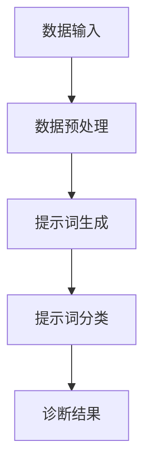

                 

# 文章标题

《提示词编程在医疗诊断系统中的应用》

> 关键词：提示词编程、医疗诊断系统、算法原理、应用案例、数据处理、人工智能

> 摘要：本文将深入探讨提示词编程在医疗诊断系统中的应用，包括其基本概念、原理、优势、具体应用以及未来发展方向。通过分析提示词编程在医疗诊断系统中的关键环节和实际案例，本文旨在为读者提供全面的技术见解和实用指导。

---

## Introduction

### 背景介绍

随着人工智能技术的发展，医疗诊断系统正逐渐从传统的人工分析向自动化、智能化方向转变。在这个变革过程中，提示词编程作为一种新兴的技术手段，正逐渐受到关注。提示词编程，顾名思义，是通过预设的提示词来引导计算机进行特定任务的编程方法。在医疗诊断系统中，提示词编程可以通过对大量医疗数据的学习和分析，自动生成诊断报告、治疗方案等，从而提高诊断准确性和效率。

### 核心概念与联系

提示词编程的核心概念包括提示词生成、提示词分类、数据预处理等。这些概念之间有着密切的联系。例如，在疾病诊断中，提示词生成算法可以根据患者的病史、体征等信息生成相应的提示词，提示词分类算法则将这些提示词分类为不同的疾病类型，从而实现疾病的自动诊断。以下是一个简化的提示词编程原理架构 Mermaid 流程图：

### 目的

本文的主要目的是通过对提示词编程在医疗诊断系统中的应用进行详细分析，帮助读者理解这一技术的核心原理和实际应用。文章将分为以下几个部分：

1. 提示词编程概述，介绍提示词编程的定义、原理和核心概念。
2. 医疗诊断系统的概述，介绍医疗诊断系统的基本架构、发展趋势和关键技术。
3. 提示词编程在医疗诊断系统中的应用，分析提示词编程在医疗诊断系统中的优势、应用场景和实际案例。
4. 提示词编程技术详解，详细讲解提示词生成和提示词分类算法。
5. 医疗诊断系统的数据预处理，介绍医疗数据的来源、类型和预处理步骤。
6. 提示词编程在医疗诊断系统的具体应用，分析提示词编程在疾病诊断、药物治疗和手术规划中的应用。
7. 提示词编程在医疗诊断系统中的挑战与未来发展方向，探讨提示词编程在医疗诊断系统中的挑战和未来发展方向。

通过以上分析，本文旨在为读者提供一个全面的技术见解和实用指导，帮助他们在实际项目中更好地应用提示词编程技术。

---

在接下来的章节中，我们将对提示词编程和医疗诊断系统的基本概念进行详细介绍，并逐步分析其在医疗诊断系统中的应用。通过这一系列的分析，我们将揭示提示词编程如何提高医疗诊断的准确性和效率，为医疗行业带来革命性的变革。敬请期待后续章节的精彩内容。

