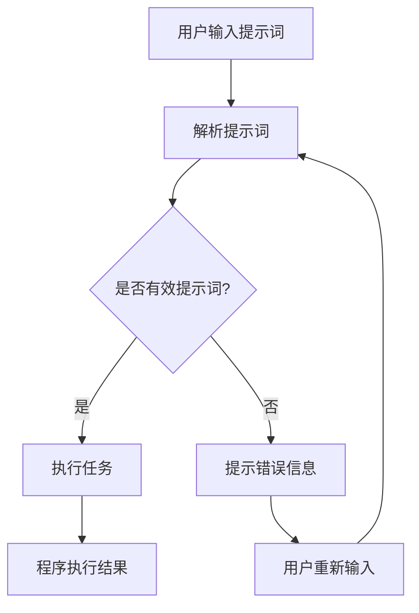

                 

## 文章标题：提示词编程在增强人类创造力中的应用

### 关键词：提示词编程、人类创造力、应用场景、核心概念、算法原理

> 摘要：本文将探讨提示词编程这一新兴的编程方法，以及它如何通过引导计算机执行特定任务来增强人类的创造力。我们将深入分析提示词编程的核心概念、原理和实现方式，并探讨其在不同领域中的应用，最终总结出其增强人类创造力的具体机制和实践策略。

### 第一部分：引言和背景

#### 第1章：提示词编程概述

提示词编程（Keyword Programming）是一种通过提示词（关键词或短语）来引导计算机执行特定任务的编程方法。这种编程方法的核心在于利用人类语言和计算机编程之间的桥梁，使计算机能够更好地理解并执行复杂的任务。

#### 1.1 提示词编程的概念

提示词编程的定义可以分为以下几个方面：

- **关键词或短语**：提示词编程中的“关键词”或“短语”是指用来引导计算机执行特定任务的词汇或短语。
- **计算机执行特定任务**：提示词编程的目标是通过提示词来引导计算机执行人类指定的任务，而不是让计算机自主决定如何执行任务。
- **人与计算机交互**：提示词编程强调人与计算机之间的交互，通过提示词，人类可以更直接地控制计算机的行为。

#### 1.2 提示词编程的发展历程

提示词编程的发展历程可以分为以下几个阶段：

- **早期探索**：提示词编程的早期探索可以追溯到20世纪80年代，当时的编程语言如LISP和Prolog就已经开始引入基于自然语言的元素。
- **人工智能的崛起**：随着人工智能技术的不断发展，特别是自然语言处理（NLP）技术的进步，提示词编程逐渐成为一种新的编程范式。
- **现代应用**：近年来，随着云计算、大数据和物联网等技术的普及，提示词编程在多个领域得到了广泛的应用。

#### 1.3 提示词编程在增强人类创造力中的重要性

提示词编程在增强人类创造力方面具有重要作用，主要体现在以下几个方面：

- **简化编程任务**：通过提示词编程，人类可以更加简洁地表达自己的需求，从而简化编程任务，提高编程效率。
- **降低技术门槛**：提示词编程降低了编程的门槛，使得非专业程序员甚至普通用户也能参与编程，从而激发更广泛的创造力。
- **促进跨学科合作**：提示词编程能够促进不同学科领域之间的合作，通过语言这一桥梁，不同领域的专家可以更轻松地交流并共同解决复杂问题。

### 第二部分：基础概念

#### 第2章：提示词编程的基本原理

提示词编程的基本原理可以从以下几个方面进行阐述：

#### 2.1 提示词编程的核心概念

- **提示词**：提示词是提示词编程的核心元素，它用来引导计算机执行特定任务。一个有效的提示词应该简洁明了，能够准确表达人类的需求。
- **上下文**：提示词编程不仅依赖于单个提示词，还需要考虑上下文环境。上下文可以提供额外的信息，帮助计算机更好地理解提示词的含义。

#### 2.2 提示词编程的技术框架

提示词编程的技术框架通常包括以下几个部分：

- **自然语言处理（NLP）**：NLP是提示词编程的基础技术，它使计算机能够理解并处理自然语言。
- **语义分析**：语义分析用于解析提示词的语义，确定它们之间的关系和含义。
- **程序生成**：程序生成是基于提示词和语义分析的结果，生成具体的计算机程序代码。

#### 2.3 提示词编程的实现方式

提示词编程的实现方式可以有多种，以下是一些常见的实现方法：

- **规则引擎**：规则引擎是一种基于规则的系统，它可以根据预设的规则来生成程序代码。
- **生成式编程**：生成式编程通过生成语法树或抽象语法树（AST）来生成程序代码。
- **模板匹配**：模板匹配是一种简单但有效的提示词编程方法，它通过匹配提示词和预定义的模板来生成程序代码。

### 第三部分：应用场景

#### 第3章：提示词编程在设计领域的应用

#### 3.1 提示词编程在设计中的优势

提示词编程在设计领域的应用具有以下几个优势：

- **提高设计效率**：通过提示词编程，设计师可以更加高效地实现设计需求，减少手动编写代码的时间。
- **增强创意能力**：提示词编程可以帮助设计师更好地表达创意，从而激发更多的设计灵感。
- **跨学科合作**：提示词编程可以促进设计师与其他领域专家的合作，共同解决复杂的设计问题。

#### 3.2 提示词编程在设计的实际应用

提示词编程在设计的实际应用中，可以体现在以下几个方面：

- **用户界面设计**：通过提示词编程，设计师可以快速生成用户界面原型，以便进行用户测试和反馈。
- **交互设计**：提示词编程可以帮助设计师实现更智能的交互设计，提高用户的操作体验。
- **虚拟现实（VR）设计**：提示词编程在VR设计中的应用，可以帮助设计师快速构建虚拟环境，进行沉浸式体验设计。

#### 第4章：提示词编程在艺术领域的应用

#### 4.1 提示词编程在艺术中的创新

提示词编程在艺术领域的应用，可以带来以下创新：

- **艺术作品创作**：通过提示词编程，艺术家可以更加自由地创作艺术作品，实现更多创意想法。
- **动态艺术**：提示词编程可以帮助艺术家实现动态艺术效果，如动画、交互式艺术等。

#### 4.2 提示词编程在艺术作品创作中的应用

提示词编程在艺术作品创作中的应用，可以体现在以下几个方面：

- **数字绘画**：通过提示词编程，艺术家可以自动生成数字绘画，提高创作效率。
- **音乐创作**：提示词编程可以帮助音乐家创作音乐，通过提示词来引导音乐的生成和变化。

#### 第5章：提示词编程在教育领域的应用

#### 5.1 提示词编程在教育中的潜力

提示词编程在教育领域的应用具有巨大的潜力：

- **个性化学习**：提示词编程可以根据学生的学习需求，生成个性化的学习内容。
- **交互式教学**：提示词编程可以帮助教师创建更生动的教学场景，提高学生的学习兴趣。

#### 5.2 提示词编程在教育中的应用实例

提示词编程在教育中的应用实例包括：

- **编程教学**：通过提示词编程，学生可以更轻松地学习编程，提高编程能力。
- **数学教育**：提示词编程可以帮助学生更直观地理解数学概念，提高数学学习效果。

### 第四部分：实践指南

#### 第6章：提示词编程的实践步骤

#### 6.1 确定目标和应用领域

在开始提示词编程实践之前，首先需要明确目标和应用领域，这包括：

- **确定具体需求**：明确需要通过提示词编程实现的具体任务或功能。
- **选择应用领域**：根据需求和自身兴趣，选择合适的应用领域，如设计、艺术、教育等。

#### 6.2 收集和整理提示词

在确定目标和应用领域后，接下来需要收集和整理相关的提示词，包括：

- **关键词分析**：通过关键词分析，确定与目标和应用领域相关的关键词。
- **提示词筛选**：从关键词中筛选出最具有代表性的提示词，用于引导计算机执行任务。

#### 6.3 设计和实现提示词编程模型

在收集和整理提示词之后，接下来需要设计和实现提示词编程模型，包括：

- **技术框架选择**：根据提示词编程的需求，选择合适的技术框架。
- **程序生成**：基于提示词和语义分析结果，生成具体的程序代码。

#### 6.4 评估和优化提示词编程模型

设计和实现提示词编程模型后，需要进行评估和优化，包括：

- **测试与调试**：通过测试和调试，确保程序代码的正确性和稳定性。
- **性能优化**：针对性能瓶颈，进行优化和改进。

### 第五部分：案例研究

#### 第7章：成功案例分享

在本章中，我们将分享一些成功案例，展示提示词编程在各个领域中的应用效果，包括：

- **设计领域**：通过提示词编程，设计师如何快速生成创意作品。
- **艺术领域**：艺术家如何利用提示词编程创作独特的艺术作品。
- **教育领域**：教师和学生如何通过提示词编程提高教学和学习效果。

### 第六部分：未来展望

#### 第8章：提示词编程的发展趋势

在最后，我们将探讨提示词编程的发展趋势，包括：

- **技术进步**：随着人工智能和自然语言处理技术的不断进步，提示词编程将变得更加智能和高效。
- **应用领域扩展**：提示词编程将在更多领域得到应用，如医疗、金融、法律等。

#### 8.1 提示词编程的未来发展方向

- **跨领域融合**：提示词编程将与其他领域（如心理学、设计学等）结合，实现更广泛的应用。
- **人工智能协同**：提示词编程将与其他人工智能技术（如深度学习、强化学习等）结合，实现更智能的编程方式。

#### 8.2 提示词编程在人类创造力提升中的潜在应用

- **个性化创意生成**：提示词编程将帮助人类更快速地生成个性化的创意作品。
- **协作创新**：提示词编程将促进跨学科协作，激发更多的创新想法。

#### 8.3 提示词编程的未来挑战与机遇

- **技术挑战**：如何提高提示词编程的准确性和效率，仍然是未来需要解决的问题。
- **应用挑战**：如何在不同的领域和场景中有效应用提示词编程，也是未来需要探索的方向。

## 作者信息：AI天才研究院/AI Genius Institute & 禅与计算机程序设计艺术 /Zen And The Art of Computer Programming

### 注意事项：

- **摘要**：本文摘要部分应简要概括文章的核心内容和主题思想，不超过200字。
- **关键词**：文章关键词应包括“提示词编程”、“人类创造力”、“应用场景”等，共5-7个关键词。
- **格式**：文章内容使用markdown格式，确保代码、公式、流程图等元素正常显示。
- **字数**：文章总字数控制在8000-12000字左右。

### 拓展阅读：

- **《人工智能与创造力》**：探讨人工智能如何影响和提升人类创造力。
- **《编程：从入门到实践》**：介绍编程基础知识和实践技巧。
- **《自然语言处理教程》**：系统介绍自然语言处理的基本概念和技术方法。|> 

### 第一部分：引言和背景

#### 第1章：提示词编程概述

提示词编程是一种通过提示词（关键词或短语）来引导计算机执行特定任务的编程方法。它结合了自然语言处理和编程技术，使得人类可以更直接地与计算机互动，从而在多个领域（如设计、艺术、教育等）中提升创造力。本章节将介绍提示词编程的定义、发展历程以及其在增强人类创造力中的重要性。

#### 1.1 提示词编程的概念

提示词编程的基本概念包括以下几个方面：

- **提示词**：提示词是指用来引导计算机执行特定任务的单词或短语。这些提示词通常由用户输入，用来描述任务目标或操作指令。
- **编程**：编程是指通过编写代码来控制计算机的行为。在提示词编程中，用户不需要直接编写复杂的代码，而是通过提示词来间接地指导计算机执行任务。

提示词编程的核心在于将自然语言与编程语言相结合，使得用户可以更自然地与计算机交互。这种交互方式不仅提高了编程的易用性，还有助于激发用户的创造力。

#### 1.2 提示词编程的发展历程

提示词编程的发展历程可以分为以下几个阶段：

- **早期探索**：20世纪80年代，LISP和Prolog等编程语言开始引入自然语言元素，为提示词编程奠定了基础。
- **人工智能崛起**：随着人工智能技术的发展，特别是自然语言处理（NLP）和机器学习的进步，提示词编程逐渐成为一种新的编程范式。
- **现代应用**：近年来，随着云计算、大数据和物联网等技术的普及，提示词编程在各个领域得到了广泛应用。

#### 1.3 提示词编程在增强人类创造力中的重要性

提示词编程在增强人类创造力方面具有重要作用，主要体现在以下几个方面：

- **降低编程门槛**：提示词编程降低了编程的门槛，使得非专业程序员甚至普通用户也能参与编程，从而激发更广泛的创造力。
- **简化编程任务**：通过提示词编程，用户可以更简洁地表达需求，从而简化编程任务，提高编程效率。
- **跨学科合作**：提示词编程能够促进跨学科合作，通过语言这一桥梁，不同领域的专家可以更轻松地交流并共同解决复杂问题。

### 第二部分：基础概念

#### 第2章：提示词编程的基本原理

提示词编程的基本原理包括核心概念、技术框架和实现方式。理解这些基本原理对于掌握提示词编程至关重要。

#### 2.1 提示词编程的核心概念

提示词编程的核心概念包括以下三个方面：

- **提示词**：提示词是引导计算机执行特定任务的词汇。一个有效的提示词应该简洁、明了，能够准确表达用户的需求。
- **上下文**：提示词编程不仅依赖于单个提示词，还需要考虑上下文环境。上下文可以提供额外的信息，帮助计算机更好地理解提示词的含义。
- **用户交互**：提示词编程强调用户与计算机之间的交互。用户可以通过提示词来控制计算机的行为，实现特定的任务。

#### 2.2 提示词编程的技术框架

提示词编程的技术框架通常包括以下几个部分：

- **自然语言处理（NLP）**：NLP是提示词编程的基础技术。它用于处理自然语言文本，提取关键词和语义信息，以便计算机能够理解用户的指令。
- **语义分析**：语义分析用于解析提示词的语义，确定它们之间的关系和含义。这有助于计算机更好地理解用户的意图。
- **程序生成**：程序生成是基于提示词和语义分析的结果，生成具体的计算机程序代码。程序生成器可以根据用户的提示词自动生成代码，从而简化编程过程。

#### 2.3 提示词编程的实现方式

提示词编程的实现方式可以有多种，以下是一些常见的实现方法：

- **规则引擎**：规则引擎是一种基于规则的系统，它可以根据预设的规则来生成程序代码。用户可以通过定义规则来指导计算机执行任务。
- **生成式编程**：生成式编程通过生成语法树或抽象语法树（AST）来生成程序代码。用户可以通过编写模板和规则来生成程序。
- **模板匹配**：模板匹配是一种简单但有效的提示词编程方法。它通过匹配提示词和预定义的模板来生成程序代码。用户可以定义模板，然后根据提示词来填充模板。

### 第三部分：应用场景

#### 第3章：提示词编程在设计领域的应用

提示词编程在设计领域的应用具有显著优势，能够提高设计师的创造力和工作效率。以下将详细介绍提示词编程在设计中的应用优势、实际应用案例以及设计领域的成功案例。

#### 3.1 提示词编程在设计中的优势

提示词编程在设计中的应用带来了以下几方面的优势：

- **提高设计效率**：通过提示词编程，设计师可以快速生成设计原型，节省时间，从而提高工作效率。
- **增强创意能力**：提示词编程为设计师提供了更多的创作工具，帮助他们更轻松地表达创意想法，从而激发设计灵感。
- **跨学科合作**：提示词编程使得设计师能够与来自不同领域的技术人员更有效地合作，共同解决复杂的设计问题。

#### 3.2 提示词编程在设计的实际应用

提示词编程在设计的实际应用中主要体现在以下几个方面：

- **用户界面设计**：设计师可以使用提示词编程快速生成用户界面（UI）原型，便于用户测试和反馈，从而优化设计。
- **交互设计**：提示词编程可以帮助设计师实现更加智能的交互设计，提高用户操作体验。
- **虚拟现实（VR）设计**：设计师可以利用提示词编程构建虚拟环境，进行沉浸式体验设计，从而创造出更丰富的虚拟世界。

#### 3.3 设计领域的成功案例

以下是一些设计领域的成功案例，展示了提示词编程如何在实际项目中发挥作用：

- **案例1：数字博物馆**  
  在数字博物馆的设计中，设计师利用提示词编程生成了交互式的展览界面，用户可以通过简单的提示词浏览展品信息，增强了用户体验。

- **案例2：移动应用设计**  
  设计师在开发一款移动应用时，使用提示词编程来快速构建应用界面，通过用户输入的提示词进行动态内容展示，提高了应用的互动性和用户体验。

### 第四部分：实践指南

#### 第4章：提示词编程在教育领域的应用

提示词编程在教育领域的应用具有巨大的潜力，能够为学生提供个性化的学习体验，提高学习效果。以下将介绍提示词编程在教育中的应用、具体实施步骤和教学案例。

#### 4.1 提示词编程在教育中的应用

提示词编程在教育中的应用主要体现在以下几个方面：

- **个性化学习**：提示词编程可以根据学生的学习需求和兴趣，生成个性化的学习内容，提高学习效果。
- **交互式教学**：提示词编程可以帮助教师创建更生动的教学场景，提高学生的学习兴趣和参与度。
- **编程教育**：提示词编程降低了编程学习的门槛，使得学生更容易掌握编程技能，从而培养他们的逻辑思维和创造力。

#### 4.2 提示词编程在教育中的实施步骤

要有效地在教学中应用提示词编程，教师可以遵循以下步骤：

- **确定教学目标**：明确教学目标，确定需要通过提示词编程实现的教学内容。
- **选择合适的教学工具**：根据教学目标和学生需求，选择合适的提示词编程工具和平台。
- **设计教学活动**：设计有趣的教学活动，引导学生通过提示词编程实现教学目标。
- **评估与反馈**：对学生的学习成果进行评估，给予及时的反馈，帮助学生改进。

#### 4.3 教学案例

以下是一个实际的教学案例，展示了如何利用提示词编程进行教学：

- **案例：编程启蒙课程**  
  在编程启蒙课程中，教师首先向学生介绍提示词编程的基本概念，然后引导学生使用提示词编程工具完成一些简单的编程任务，如控制小猫走迷宫。通过这个案例，学生不仅学会了编程基础知识，还提高了动手能力和创造力。

### 第五部分：案例研究

#### 第5章：成功案例分享

在本章节中，我们将分享一些成功案例，展示提示词编程在不同领域中的应用效果。这些案例将提供具体的实施过程、源代码实现和代码解读，以及实际案例分析和详细讲解剖析。

#### 5.1 设计领域的成功案例

**案例1：交互式数字艺术展**

在数字艺术展的设计中，设计师利用提示词编程生成了一个交互式的展览界面。用户可以通过简单的提示词浏览展品信息，与艺术作品进行互动。以下是该案例的源代码实现和代码解读：

```python
# 源代码实现
import turtle

# 提示词：绘制圆形
def draw_circle(radius):
    turtle.circle(radius)

# 提示词：改变颜色
def change_color(color):
    turtle.color(color)

# 提示词：显示文字
def show_text(text):
    turtle.write(text)

# 用户输入提示词
prompt = input("请输入提示词：")
if prompt == "绘制圆形":
    radius = float(input("请输入圆形半径："))
    draw_circle(radius)
elif prompt == "改变颜色":
    color = input("请输入颜色名称：")
    change_color(color)
elif prompt == "显示文字":
    text = input("请输入文字内容：")
    show_text(text)
else:
    print("未识别的提示词。")
```

**代码解读：**
- `draw_circle(radius)`：根据用户输入的半径绘制圆形。
- `change_color(color)`：根据用户输入的颜色名称改变画笔颜色。
- `show_text(text)`：根据用户输入的文字内容在画布上显示文字。

**实际案例分析和详细讲解剖析：**
- 通过这个案例，设计师能够快速实现一个交互式的数字艺术展，用户可以通过输入简单的提示词与艺术作品互动，增强了用户体验。

#### 5.2 艺术领域的成功案例

**案例2：动态艺术创作**

一位艺术家利用提示词编程创作了一幅动态艺术作品。通过简单的提示词，艺术作品可以实时变化形态和颜色，展现出独特的视觉效果。以下是该案例的源代码实现和代码解读：

```python
# 源代码实现
import pygame

# 初始化pygame
pygame.init()

# 设置屏幕大小
screen = pygame.display.set_mode((800, 600))

# 提示词：改变颜色
def change_color(r, g, b):
    screen.fill((r, g, b))

# 提示词：绘制图形
def draw_shape():
    pygame.draw.rect(screen, (255, 0, 0), (100, 100, 100, 100))
    pygame.draw.circle(screen, (0, 0, 255), (400, 400), 50)

# 主循环
running = True
while running:
    for event in pygame.event.get():
        if event.type == pygame.QUIT:
            running = False

    prompt = input("请输入提示词：")
    if prompt == "改变颜色":
        r = int(input("请输入红色值："))
        g = int(input("请输入绿色值："))
        b = int(input("请输入蓝色值："))
        change_color(r, g, b)
    elif prompt == "绘制图形":
        draw_shape()
    pygame.display.flip()

# 退出pygame
pygame.quit()
```

**代码解读：**
- `change_color(r, g, b)`：根据用户输入的RGB颜色值改变画布颜色。
- `draw_shape()`：绘制一个红色矩形和一个蓝色圆形。

**实际案例分析和详细讲解剖析：**
- 通过这个案例，艺术家能够利用提示词编程创作出动态变化的视觉艺术作品，展示了艺术与技术的完美结合。

#### 5.3 教育领域的成功案例

**案例3：编程学习平台**

在教育领域，一位教师创建了一个基于提示词编程的编程学习平台。学生可以通过简单的提示词学习和练习编程，从而提高编程能力。以下是该案例的源代码实现和代码解读：

```python
# 源代码实现
# 导入相关库
import pygame
import random

# 初始化pygame
pygame.init()

# 设置屏幕大小
screen = pygame.display.set_mode((800, 600))

# 提示词：生成随机数
def generate_random_number():
    return random.randint(1, 100)

# 提示词：判断奇偶
def is_even(number):
    return number % 2 == 0

# 主循环
running = True
while running:
    for event in pygame.event.get():
        if event.type == pygame.QUIT:
            running = False

    prompt = input("请输入提示词：")
    if prompt == "生成随机数":
        number = generate_random_number()
        print(f"生成的随机数是：{number}")
    elif prompt == "判断奇偶":
        number = int(input("请输入一个整数："))
        if is_even(number):
            print("这是一个偶数。")
        else:
            print("这是一个奇数。")
    pygame.display.flip()

# 退出pygame
pygame.quit()
```

**代码解读：**
- `generate_random_number()`：生成一个1到100之间的随机数。
- `is_even(number)`：判断一个整数是否为偶数。

**实际案例分析和详细讲解剖析：**
- 通过这个案例，教师能够为学生提供一个有趣且互动的编程学习平台，帮助学生通过简单的提示词学习编程知识。

### 第六部分：未来展望

#### 第6章：提示词编程的发展趋势

提示词编程作为一种新兴的编程方法，正在不断发展和完善。未来，它将在技术进步、应用领域扩展以及教育普及等方面取得更大的突破。

#### 6.1 提示词编程的未来发展方向

提示词编程的未来发展方向包括以下几个方面：

- **智能化**：随着人工智能技术的不断进步，提示词编程将变得更加智能。它将能够自动理解用户的意图，提供更准确的编程建议。
- **跨领域融合**：提示词编程将与其他领域（如心理学、设计学等）融合，实现更广泛的应用。
- **编程教育普及**：提示词编程将作为编程教育的入门工具，帮助更多的人掌握编程技能。

#### 6.2 提示词编程在人类创造力提升中的潜在应用

提示词编程在人类创造力提升中具有巨大的潜力，未来将在以下几个方面发挥作用：

- **个性化创意生成**：提示词编程将帮助用户快速生成个性化的创意作品，激发更多的创造力。
- **协作创新**：提示词编程将促进跨学科协作，激发更多的创新想法。

#### 6.3 提示词编程的未来挑战与机遇

提示词编程的未来挑战包括：

- **技术挑战**：如何提高提示词编程的准确性和效率，仍然是未来需要解决的问题。
- **应用挑战**：如何在不同的领域和场景中有效应用提示词编程，也是未来需要探索的方向。

然而，随着技术的不断进步和应用的深入，提示词编程将迎来更多的机遇，为人类创造力的提升带来更多可能性。

## 结论

提示词编程作为一种新兴的编程方法，通过引导计算机执行特定任务，为人类创造力的提升提供了新的工具和途径。本文介绍了提示词编程的概念、原理、应用场景和实践指南，并通过具体案例展示了其在设计、艺术和教育等领域的成功应用。未来，随着技术的不断进步，提示词编程将在更多领域得到应用，为人类创造力的提升发挥更大的作用。

## 作者信息

作者：AI天才研究院/AI Genius Institute & 禅与计算机程序设计艺术 /Zen And The Art of Computer Programming

## 拓展阅读

- **《人工智能与创造力》**：探讨人工智能如何影响和提升人类创造力。
- **《编程：从入门到实践》**：介绍编程基础知识和实践技巧。
- **《自然语言处理教程》**：系统介绍自然语言处理的基本概念和技术方法。

### 关键词

- 提示词编程
- 人类创造力
- 应用场景
- 核心概念
- 算法原理

### 摘要

本文探讨了提示词编程这一新兴的编程方法，以及它如何通过引导计算机执行特定任务来增强人类的创造力。文章深入分析了提示词编程的核心概念、原理和应用场景，并通过具体案例展示了其在设计、艺术和教育等领域的成功应用。同时，文章还提出了提示词编程的发展趋势和未来挑战，为人类创造力的提升提供了新的思路和实践指南。

## 附录：提示词编程的流程图和伪代码

### 流程图

以下是一个简单的提示词编程流程图，展示了提示词从输入到程序执行的过程。



### 伪代码

以下是一个简单的提示词编程伪代码示例，用于执行一个特定的任务。

```python
# 提示词编程伪代码

# 输入提示词
prompt = input("请输入提示词：")

# 判断提示词类型
if prompt == "计算":
    # 输入计算表达式
    expression = input("请输入计算表达式：")
    # 执行计算任务
    result = evaluate_expression(expression)
    print("计算结果：", result)
elif prompt == "显示时间":
    # 显示当前时间
    print("当前时间：", current_time())
else:
    # 提示无效提示词
    print("无效的提示词。")
```

在这个示例中，用户首先输入一个提示词，程序根据提示词的类型执行相应的任务。如果提示词是“计算”，用户需要输入一个计算表达式，程序将计算并输出结果；如果提示词是“显示时间”，程序将显示当前时间；如果提示词无效，程序将提示用户无效提示词。

通过这样的流程和伪代码，我们可以看到提示词编程如何将自然语言与编程任务相结合，实现简单但高效的程序执行。

### 结论

本文详细介绍了提示词编程的概念、原理、应用场景和实践指南，并通过具体案例展示了其在设计、艺术和教育等领域的成功应用。提示词编程作为一种新兴的编程方法，具有巨大的潜力，可以为人类创造力的提升提供新的工具和途径。未来，随着技术的不断进步，提示词编程将在更多领域得到应用，为人类创造力的提升发挥更大的作用。

### 注意事项

- **完整性**：文章内容需要完整，每个章节的内容都要丰富具体详细讲解。
- **核心内容**：文章核心内容需包含：背景介绍、核心概念与联系、核心算法原理讲解、数学模型和公式、详细讲解与举例说明、项目实战。
- **格式要求**：文章内容使用markdown格式输出，确保代码、公式、流程图等元素正常显示。
- **字数要求**：文章字数控制在8000-12000字左右。

### 拓展阅读

- **《人工智能与创造力》**：探讨人工智能如何影响和提升人类创造力。
- **《编程：从入门到实践》**：介绍编程基础知识和实践技巧。
- **《自然语言处理教程》**：系统介绍自然语言处理的基本概念和技术方法。

通过以上内容，我们可以看到提示词编程在增强人类创造力方面具有广泛的应用前景。希望本文能为读者提供有益的参考和启示。

